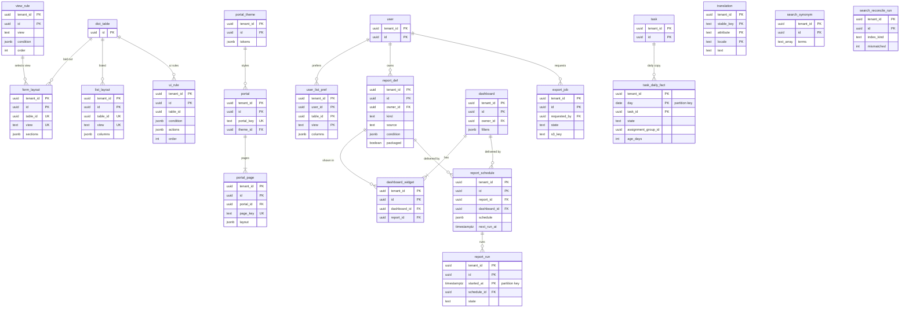

# Data model: 画面・ポータル・翻訳・検索・レポート

[data-model.md](../data-model.md) の一部。フォームとリストの配置・画面の規則・利用者のリストの設定、ポータル・ページ・テーマ、テナントの文言の翻訳、検索の同義語と突き合わせ、レポート・ダッシュボード・定期の配信・実行の記録・エクスポート・日次の事実の表を定義する。振る舞いは [portal-and-ui.md](../portal-and-ui.md)、[search.md](../search.md)、[reports.md](../reports.md) を正とする。OpenSearch の索引の形は [stores.md](stores.md) の 3 節。

- 配置と画面の規則の既定（`form_layout`・`list_layout`・`view_rule`・`ui_rule`）と、組み込みのレポートとダッシュボードは、コードの版だけに持つ。テナントは自分の行で上書き・複製する（[data-model.md](../data-model.md) の 3.1 節）。
- **レポートの定義を共有しても、データは共有しない。** 開いた人・受け手の主体で計算する（[ADR-0046](../../decisions/0046-acl-aware-aggregation-and-per-recipient-delivery.md)）。

## 1. ER 図

## 2. 画面とポータル

### 2.1 `form_layout`・`list_layout`

テナントの配置（組み込みの既定の上書きと、足した `view`）。定義元：[portal-and-ui.md](../portal-and-ui.md) の 4.2 節、[ADR-0040](../../decisions/0040-metadata-driven-forms-and-lists.md)。

| 表 | 列 |
| --- | --- |
| `form_layout` | `tenant_id`、`id`、`table_id`、`view`（`default`・`portal`・テナントの名前）、`sections`（`jsonb`：見出しのラベルのキー、列の数、フィールドの ID の並び）、`related_lists`（`jsonb`）、メタデータの共通の列 |
| `list_layout` | `tenant_id`、`id`、`table_id`、`view`、`columns`（`jsonb`：フィールドの ID、参照のたどりは 1 段まで）、`default_sort`（`jsonb`）、`default_filter`（`jsonb`）、メタデータの共通の列 |

- キー：どちらも PK `(tenant_id, id)`、UK `(tenant_id, table_id, view) WHERE deleted_at IS NULL`。
- 保持：メタデータ。S1 の量：1 テナント 数百行。

### 2.2 `view_rule`・`ui_rule`

どの主体にどの `view` を使うか（上から最初に一致）と、フォームの画面の規則（隠したフィールドの値は保存で捨てない）。定義元：同じ文書の 4.2・4.3 節。

| 表 | 列 |
| --- | --- |
| `view_rule` | `tenant_id`、`id`、`table_id`（NULL は全テーブル）、`view`、`condition`（`jsonb`：ロール・グループの条件）、`order`、`active`、メタデータの共通の列 |
| `ui_rule` | `tenant_id`、`id`、`table_id`、`view`（NULL はすべての `view`）、`condition`（`jsonb`）、`actions`（`jsonb`：`[{field_id, visible, mandatory, read_only, set_value}]`）、`order`、`on_load`（`boolean`）、`active`、メタデータの共通の列 |

- キー：どちらも PK `(tenant_id, id)`、UK `(tenant_id, stable_key)`。索引 `(tenant_id, table_id, "order") WHERE active`。
- `ui_rule` は 1 テーブル・1 `view` で 100 まで（アプリで数える）。
- 保持：メタデータ。S1 の量：1 テナント 数百行。

### 2.3 `user_list_pref`

利用者ごとのリストの列の並びと保存したフィルター。メタデータではない（パッケージで移さない）。

| 列 | 型 | NULL | 既定 | 説明 |
| --- | --- | --- | --- | --- |
| `tenant_id`・`user_id`・`table_id` | `uuid` | NOT NULL | — | |
| `view` | `text` | NOT NULL | — | |
| `columns` | `jsonb` | NULL | — | |
| `saved_filters` | `jsonb` | NOT NULL | `'[]'` | `[{name, q, sort}]`（20 まで） |
| `updated_at` | `timestamptz` | NOT NULL | `now()` | |

- キー：PK `(tenant_id, user_id, table_id, view)`。
- 保持：利用者に従う。S1 の量：数十万行。

### 2.4 `portal`・`portal_page`

ポータル（既定 1 つ ＋ 子会社ごとに 5 まで）とページ（決まった部品の配置）。既定のポータルはテナントの作成の時にテナントの行として作る。定義元：同じ文書の 6.2 節、[ADR-0041](../../decisions/0041-employee-portal-themes-widgets-and-push.md)。

| 表 | 列 |
| --- | --- |
| `portal` | `tenant_id`、`id`、`portal_key`（URL の `/portal/{portal_key}`。`[a-z0-9-]{1,32}`）、`name`、`theme_id`（→ `portal_theme`）、`home_page_id`（→ `portal_page`）、`catalog_ids`（`uuid[]`）、`kb_base_ids`（`uuid[]`）、`active`、メタデータの共通の列 |
| `portal_page` | `tenant_id`、`id`、`portal_id`、`page_key`、`layout`（`jsonb`：行と列の部品。部品は決まった種類だけ）、メタデータの共通の列 |

- キー：`portal` PK `(tenant_id, id)`、UK `(tenant_id, portal_key)`。`portal_page` PK `(tenant_id, id)`、UK `(tenant_id, portal_id, page_key)`。
- 部品の文章は制限付きの Markdown。テナントの HTML・CSS・JavaScript を受けない。
- 保持：メタデータ。S1 の量：1 テナント 数十行。

### 2.5 `portal_theme`

テーマのトークン。色の組は保存の時にコントラストの比（本文 4.5:1）を検査する。

| 列 | 型 | NULL | 既定 | 説明 |
| --- | --- | --- | --- | --- |
| `tenant_id` | `uuid` | NOT NULL | — | |
| `id` | `uuid` | NOT NULL | `uuidv7()` | |
| `name` | `text` | NOT NULL | — | |
| `tokens` | `jsonb` | NOT NULL | — | 主・副・文字・背景の色、角の丸み、文字の大きさの段 |
| `logo_attachment_id` | `uuid` | NULL | — | → `attachment`（`image/png`・`jpeg`・`webp` だけ。SVG を受けない） |
| メタデータの共通の列 | | | | |

- キー：PK `(tenant_id, id)`。UK `(tenant_id, stable_key)`。
- 保持：メタデータ。S1 の量：1 テナント 数行。

### 2.6 `translation`

テナントが作った文言の翻訳（テーブル・フィールド・選択肢のラベル、カタログの品目と変数、ポータルの部品の文章、通知のテンプレート）。キーは名前ではなく `stable_key`。定義元：同じ文書の 7.2 節、[ADR-0042](../../decisions/0042-i18n-ja-en-and-translations.md)。

| 列 | 型 | NULL | 既定 | 説明 |
| --- | --- | --- | --- | --- |
| `tenant_id` | `uuid` | NOT NULL | — | |
| `stable_key` | `text` | NOT NULL | — | 訳すオブジェクトの `stable_key` |
| `attribute` | `text` | NOT NULL | — | `label`・`help`・`subject`・`body`・`choice:<value>` など |
| `locale` | `text` | NOT NULL | — | `ja`・`en` |
| `text` | `text` | NOT NULL | — | |
| `rev`・`content_hash`・`updated_in_version`・`deleted_at`・`updated_at`・`updated_by` | | | | メタデータの共通の列（`stable_key` は主キーの列を使う） |

- キー：PK `(tenant_id, stable_key, attribute, locale)`。
- CHECK：`locale IN ('ja','en')`。
- パッケージで移送できる。訳がなければ作成の時の言語の文言を出す。
- 保持：メタデータ。S1 の量：1 テナント 数千〜数万行。

## 3. 検索

### 3.1 `search_synonym`

テナントの同義語の一覧（問い合わせの時に展開する）。定義元：[search.md](../search.md) の 4.2 節。

| 列 | 型 | NULL | 既定 | 説明 |
| --- | --- | --- | --- | --- |
| `tenant_id` | `uuid` | NOT NULL | — | |
| `id` | `uuid` | NOT NULL | `uuidv7()` | |
| `terms` | `text[]` | NOT NULL | — | 同じ意味の語（NFKC・小文字の後）。2〜20 語 |
| `active` | `boolean` | NOT NULL | `true` | |
| メタデータの共通の列 | | | | |

- キー：PK `(tenant_id, id)`。UK `(tenant_id, stable_key)`。索引 `USING gin (tenant_id, terms)`。
- 保持：メタデータ。S1 の量：1 テナント 数百行。

### 3.2 `search_reconcile_run`

テナントごとの日次の索引の突き合わせの結果。テナントのコンテキストで動かし、RLS の対象の行として書く。定義元：同じ文書の 7.3 節。

| 列 | 型 | NULL | 既定 | 説明 |
| --- | --- | --- | --- | --- |
| `tenant_id` | `uuid` | NOT NULL | — | |
| `id` | `uuid` | NOT NULL | `uuidv7()` | |
| `index_kind` | `text` | NOT NULL | — | `task`・`ci`・`kb`・`catalog`・`record` |
| `started_at`・`finished_at` | `timestamptz` | | | |
| `sampled`・`mismatched`・`fixed` | `integer` | NOT NULL | `0` | 抜き取り 1%、最大 1 万件 |
| `state` | `text` | NOT NULL | `'running'` | `running`・`completed`・`failed` |

- キー：PK `(tenant_id, id)`。索引 `(tenant_id, index_kind, started_at DESC)`。
- 保持：90 日（日次の削除のジョブ）。S1 の量：1 日 約 1,500 行。

## 4. レポート

### 4.1 `report_def`

レポートの定義（テナントのデータ。`packaged` の印の付いたものだけパッケージで移す）。定義元：[reports.md](../reports.md) の 3 節。

| 列 | 型 | NULL | 既定 | 説明 |
| --- | --- | --- | --- | --- |
| `tenant_id` | `uuid` | NOT NULL | — | |
| `id` | `uuid` | NOT NULL | `uuidv7()` | |
| `stable_key` | `text` | NULL | — | `packaged` のときだけ持つ |
| `owner_id` | `uuid` | NOT NULL | — | → `user` |
| `name` | `text` | NOT NULL | — | 翻訳の対象 |
| `kind` | `text` | NOT NULL | — | `list`・`aggregate`・`pivot`・`trend` |
| `source` | `text` | NOT NULL | — | `table`・`daily_fact`・`sla`・`deflection_daily` |
| `table_id` | `uuid` | NULL | — | `source = table` |
| `condition` | `jsonb` | NULL | — | |
| `group_by` | `jsonb` | NOT NULL | `'[]'` | 最大 2 つ（索引のある列だけ） |
| `measure` | `jsonb` | NOT NULL | — | `count`・`sum`・`avg`・`min`・`max` |
| `trend` | `jsonb` | NULL | — | 日付のフィールド、粒度、期間（13 か月まで）、タイムゾーン |
| `visibility` | `text` | NOT NULL | `'private'` | `private`・`groups`・`roles` |
| `visible_group_ids`・`visible_role_ids` | `uuid[]` | NOT NULL | `'{}'` | |
| `packaged` | `boolean` | NOT NULL | `false` | 付けられるのは `tenant_admin` |
| `version` | `bigint` | NOT NULL | `1` | |
| `created_at`・`updated_at`・`deleted_at` | | | | |

- キー：PK `(tenant_id, id)`。UK `(tenant_id, stable_key) WHERE stable_key IS NOT NULL`。FK `(tenant_id, owner_id)` → `user`。
- 索引：`(tenant_id, owner_id)`、`USING gin (tenant_id, visible_group_ids)` — 共有されたレポートの一覧。
- CHECK：`packaged = (stable_key IS NOT NULL)`、`(source = 'table') = (table_id IS NOT NULL)`、`jsonb_array_length(group_by) <= 2`。
- 保持：テナント。S1 の量：1 テナント 数千行。

### 4.2 `dashboard`・`dashboard_widget`

ダッシュボード（最大 12 の部品、共通のフィルター）。定義元：同じ文書の 9 節。

| 表 | 列 |
| --- | --- |
| `dashboard` | `tenant_id`、`id`、`stable_key`（`packaged` のとき）、`owner_id`、`name`、`filters`（`jsonb`：期間・担当のグループ）、`visibility`、`visible_group_ids`、`visible_role_ids`、`packaged`、`version`、`created_at`、`updated_at`、`deleted_at` |
| `dashboard_widget` | `tenant_id`、`id`、`dashboard_id`、`report_id`、`position`（`jsonb`：行・列・幅）、`title_override` |

- キー：`dashboard` PK `(tenant_id, id)`、UK `(tenant_id, stable_key) WHERE stable_key IS NOT NULL`。`dashboard_widget` PK `(tenant_id, id)`、FK `(tenant_id, dashboard_id)` → `dashboard`（`ON DELETE CASCADE`）、`report_id` → `report_def`。
- CHECK：部品 12 まではアプリで数える。
- 保持：テナント。S1 の量：1 テナント 数百行。

### 4.3 `report_schedule`・`report_run`

定期の配信（受け手ごとに受け手の主体で計算。受け手はテナントの有効な利用者だけ）と実行の記録。定義元：同じ文書の 10 節。

| 表 | 列 |
| --- | --- |
| `report_schedule` | `tenant_id`、`id`、`report_id`・`dashboard_id`（どちらか 1 つ）、`owner_id`、`schedule`（`jsonb`：毎日・毎週・毎月、曜日・日・時刻、テナントのタイムゾーン）、`business_days_only`（`boolean`）、`calendar_id`（NULL）、`recipients`（`jsonb`：利用者・グループ。展開の後 500 人まで）、`format`（`email_table_csv`）、`jitter_seconds`（`integer`。0〜600、ハッシュで決まる値）、`next_run_at`、`active`、`version`、`created_at`、`updated_at` |
| `report_run` | `tenant_id`、`id`、`started_at`（パーティションのキー、日）、`schedule_id`、`report_id`、`dashboard_id`、`state`（`running`・`completed`・`partial`・`failed`）、`recipient_count`、`distinct_predicates`（同じ述語の受け手をまとめた計算の回数）、`truncated`（`boolean`）、`finished_at`、`error` |

- キー：`report_schedule` PK `(tenant_id, id)`、索引 `(next_run_at) WHERE active`（Engine の日次・時刻のジョブ。テナントのコンテキストで取り直す）。`report_run` PK `(tenant_id, id, started_at)`、索引 `(tenant_id, schedule_id, started_at DESC)`。
- CHECK：`num_nonnulls(report_id, dashboard_id) = 1`、`jitter_seconds BETWEEN 0 AND 600`。
- 配信の 1 通は `notification_message`（`rule_key = report_schedule:<id>`）で 1 回にする。
- 保持：`report_schedule` はテナント、`report_run` は 30 日（`DROP`）。S1 の量：配信 数万行、実行 1 日 数万行。

### 4.4 `export_job`

リスト・レポートの CSV のエクスポート（非同期、10 万行まで、ファイルは S3 に 24 時間）。定義元：同じ文書の 11 節、[access-control.md](../access-control.md) の 6.2 節の 10 行。

| 列 | 型 | NULL | 既定 | 説明 |
| --- | --- | --- | --- | --- |
| `tenant_id` | `uuid` | NOT NULL | — | |
| `id` | `uuid` | NOT NULL | `uuidv7()` | |
| `requested_by` | `uuid` | NOT NULL | — | 成り代わりの間はできない |
| `source` | `text` | NOT NULL | — | `list`・`report` |
| `spec` | `jsonb` | NOT NULL | — | テーブル、`q`、`fields`、並べ替え、またはレポートの ID |
| `state` | `text` | NOT NULL | `'queued'` | `queued`・`running`・`completed`・`failed`・`expired` |
| `row_count` | `integer` | NULL | — | 100,000 まで |
| `s3_key` | `text` | NULL | — | |
| `expires_at` | `timestamptz` | NULL | — | 完成 ＋ 24 時間 |
| `created_at`・`finished_at` | | | | |
| `error` | `jsonb` | NULL | — | |

- キー：PK `(tenant_id, id)`。索引 `(tenant_id, requested_by, created_at DESC)`、`(tenant_id, state) WHERE state IN ('queued','running')`（テナントの同時の実行 2 の数え方）。
- 保持：30 日（ファイルは 24 時間の S3 のライフサイクル）。S1 の量：1 日 数千行。

### 4.5 `task_daily_fact`

日次の事実の表（テナントのタイムゾーンの 0 時の時点の active な `task` の行の写し）。集計の結果ではなく行の値を写し、問い合わせの時に今の `task` の行の述語で絞る。定義元：同じ文書の 6 節、[ADR-0045](../../decisions/0045-report-execution-on-reader-and-daily-facts.md)。

| 列 | 型 | NULL | 既定 | 説明 |
| --- | --- | --- | --- | --- |
| `tenant_id` | `uuid` | NOT NULL | — | |
| `day` | `date` | NOT NULL | — | テナントのタイムゾーンの日。パーティションのキー（月） |
| `task_id` | `uuid` | NOT NULL | — | 今の `task` と結合する（削除した `task` は結合で落ちる） |
| `class_id` | `uuid` | NOT NULL | — | |
| `state` | `text` | NOT NULL | — | |
| `active` | `boolean` | NOT NULL | — | |
| `priority` | `smallint` | NULL | — | |
| `assignment_group_id`・`assigned_to_id` | `uuid` | NULL | — | |
| `age_days` | `integer` | NOT NULL | — | |
| `sla_breached_any` | `boolean` | NOT NULL | — | |

- キー：PK `(tenant_id, day, task_id)`。外部キーを張らない（写しで、`task` の削除で落ちてよい）。
- 索引：`(tenant_id, day, assignment_group_id)` — グループごとの滞留の推移。
- パーティション：`day` の月。保持：13 か月（`DROP`）。S1 の量：1 日 約 50 万行、13 か月で約 2 億行。
