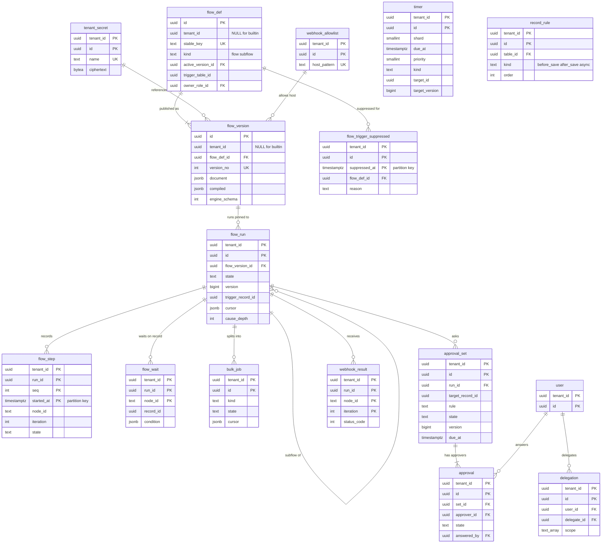

# Data model: フロー・タイマー・承認・レコードのルール

[data-model.md](../data-model.md) の一部。フローの定義と不変の版、実行・ステップ・待ち、一括の処理、共有のタイマー、承認と代理、レコードのルール、外への呼び出しの結果と資格情報、抑えたトリガーを定義する。振る舞い（1 回の進み ＝ 1 トランザクション、実行の状態機械、承認の規則、上限と優先度）は [workflow-engine.md](../workflow-engine.md) を正とする。

- **ノードの効果・実行の状態・タイマーの消化と登録・outbox は 1 つのトランザクションで書く**（[ADR-0004](../../decisions/0004-workflow-and-sla-engine.md)、[ADR-0015](../../decisions/0015-flow-execution-and-timers.md)）。どの表も `version` の条件付きで更新する。
- `flow_def`・`flow_version` は NULL の行（組み込みのフロー）を持つ。主キーは `id` だけ（[data-model.md](../data-model.md) の 3.3 節）。

## 1. ER 図

`record_rule` は図の中でほかの表と線を持たない（辞書のクラスを参照する）。`timer.target_id` は実行・承認のまとまり・計時の行・呼び出し・一括の処理のどれかを指す（外部キーなし）。

## 2. フローの定義と版

### 2.1 `flow_def`

定義元：[workflow-engine.md](../workflow-engine.md) の 3.4 節。

| 列 | 型 | NULL | 既定 | 説明 |
| --- | --- | --- | --- | --- |
| `id` | `uuid` | NOT NULL | `uuidv7()` | 実行の主体 `flow:<id>` |
| `tenant_id` | `uuid` | NULL | — | 組み込みのフロー（`change_approval_policy`、`incident_auto_close`、`kb_publish_approval`、`major_incident_response`、カタログの雛形 3 つ）は NULL |
| `name` | `text` | NOT NULL | — | |
| `kind` | `text` | NOT NULL | — | `flow`・`subflow` |
| `draft` | `jsonb` | NULL | — | 編集中の文書（`FlowDocument`） |
| `active_version_id` | `uuid` | NULL | — | 動かす版（→ `flow_version`） |
| `trigger_kind` | `text` | NULL | — | 有効な版から写す：`record_created`・`record_updated`・`record_created_or_updated`・`schedule`・`manual`・`api`・`subflow`・`catalog_fulfillment` |
| `trigger_table_id` | `uuid` | NULL | — | レコードのトリガーの対象のクラス（祖先を含めて照合する） |
| `run_as` | `text` | NOT NULL | `'flow_owner_role'` | `flow_owner_role`・`system_declared`（`tenant_admin` と `acl_admin` の両方の承認） |
| `owner_role_id` | `uuid` | NULL | — | → `role` |
| `active` | `boolean` | NOT NULL | `false` | |
| メタデータの共通の列 | | | | |

- キー：PK `(id)`。UK `NULLS NOT DISTINCT (tenant_id, stable_key)`。UK `(tenant_id, id)`。FK `active_version_id` → `flow_version(id)`、`owner_role_id` → `role(id)`（`check_shared_ref()`）。
- 索引：`(tenant_id, trigger_table_id) WHERE active AND trigger_kind LIKE 'record%'` — 保存のトランザクションの中のトリガーの評価（コンパイルしてキャッシュする元）。
- CHECK：テーブルごとの有効なトリガー 50 まではアプリで数える。
- 保持：メタデータ。S1 の量：組み込み 7 行、テナントの行は全体で数万行。

### 2.2 `flow_version`

公開した不変の版。DB のロールで `UPDATE` を与えない。定義元：同じ文書の 3.4・3.5 節、[ADR-0014](../../decisions/0014-flow-dsl-and-versioning.md)。

| 列 | 型 | NULL | 既定 | 説明 |
| --- | --- | --- | --- | --- |
| `id` | `uuid` | NOT NULL | `uuidv7()` | |
| `tenant_id` | `uuid` | NULL | — | |
| `flow_def_id` | `uuid` | NOT NULL | — | |
| `version_no` | `integer` | NOT NULL | — | 1, 2, 3 … |
| `document` | `jsonb` | NOT NULL | — | 公開の時の `FlowDocument`（ノード 200 まで） |
| `compiled` | `jsonb` | NOT NULL | — | コンパイル済みの形。サブフローの呼び出しは `flow_version_id` を固定して書き込む |
| `content_hash` | `bytea` | NOT NULL | — | |
| `engine_schema` | `integer` | NOT NULL | — | DSL の意味の版 |
| `published_at` | `timestamptz` | NOT NULL | `now()` | |
| `published_by` | `uuid` | NULL | — | 組み込みは NULL |

- キー：PK `(id)`。UK `(flow_def_id, version_no)`。FK `flow_def_id` → `flow_def(id)`。
- 動いている実行が使っている版は消さない。完了した実行の保持（90 日）の後、使われていない古い版を消せる。
- 保持：メタデータ。S1 の量：全体で数十万行（1 版 平均 20 KB）。

## 3. 実行

### 3.1 `flow_run`

定義元：同じ文書の 5.1・5.2 節。

| 列 | 型 | NULL | 既定 | 説明 |
| --- | --- | --- | --- | --- |
| `tenant_id` | `uuid` | NOT NULL | — | |
| `id` | `uuid` | NOT NULL | `uuidv7()` | |
| `flow_version_id` | `uuid` | NOT NULL | — | 開始の時の版に固定（→ `flow_version`。組み込みは NULL の行） |
| `state` | `text` | NOT NULL | `'pending'` | `pending`・`running`・`waiting`・`completed`・`failed`・`cancelled` |
| `version` | `bigint` | NOT NULL | `1` | タイマーの `target_version` と比べる |
| `trigger_table_id`・`trigger_record_id` | `uuid` | NULL | — | レコードのトリガーのとき |
| `parent_run_id` | `uuid` | NULL | — | サブフローの呼び出し元（→ `flow_run`） |
| `parent_node_id` | `text` | NULL | — | |
| `inputs`・`vars` | `jsonb` | NOT NULL | `'{}'` | 合わせて 256 KB まで |
| `outputs` | `jsonb` | NULL | — | |
| `cursor` | `jsonb` | NOT NULL | — | 次に動かすノードと `for_each` の位置 |
| `cause_depth` | `smallint` | NOT NULL | `0` | 原因の連鎖の深さ（5 まで） |
| `cause_chain` | `uuid[]` | NOT NULL | `'{}'` | 原因のフローの ID |
| `run_as` | `text` | NOT NULL | — | 開始の時の `flow_def.run_as` の写し |
| `steps_executed` | `integer` | NOT NULL | `0` | 5,000 まで（`step_limit`） |
| `started_at` | `timestamptz` | NOT NULL | `now()` | |
| `ended_at` | `timestamptz` | NULL | — | |
| `error` | `jsonb` | NULL | — | |

- キー：PK `(tenant_id, id)`。FK `flow_version_id` → `flow_version(id)`（`check_shared_ref()`）、`(tenant_id, parent_run_id)` → `flow_run`。
- 索引：`(tenant_id, trigger_record_id) WHERE state IN ('pending','running','waiting')` — レコードの削除・取り消しでの実行の取り消し。`(tenant_id, flow_version_id) WHERE state IN (...)` — 版の削除の可否、一括の取り消し。`(tenant_id, parent_run_id)` — 子の実行の取り消し。`(tenant_id, state, started_at) WHERE state IN (...)` — 止まった実行の回収（INV-FLOW-001。毎分）と、テナントの終わっていない実行の数（50 万まで）。`(ended_at) WHERE ended_at IS NOT NULL` — 90 日の削除のジョブ。
- CHECK：`state IN (...)`、`(state IN ('completed','failed','cancelled')) = (ended_at IS NOT NULL)`、`cause_depth <= 5`。
- 保持：完了の後 90 日（長く続く実行は終わるまで）。S1 の量：動いている約 100 万行、90 日分で約 2,000 万行。

### 3.2 `flow_step`

ノードの実行の記録。定義元：同じ文書の 5.1 節。

| 列 | 型 | NULL | 既定 | 説明 |
| --- | --- | --- | --- | --- |
| `tenant_id` | `uuid` | NOT NULL | — | |
| `run_id` | `uuid` | NOT NULL | — | |
| `seq` | `integer` | NOT NULL | — | 実行の中の順 |
| `started_at` | `timestamptz` | NOT NULL | `now()` | パーティションのキー（月） |
| `node_id` | `text` | NOT NULL | — | |
| `iteration` | `integer` | NOT NULL | `0` | ノードの実行の回（冪等のキーの一部） |
| `state` | `text` | NOT NULL | — | `completed`・`waiting`・`failed`・`skipped` |
| `outputs` | `jsonb` | NULL | — | |
| `attempt` | `smallint` | NOT NULL | `1` | |
| `ended_at` | `timestamptz` | NULL | — | |
| `error` | `jsonb` | NULL | — | |

- キー：PK `(tenant_id, run_id, seq, started_at)`。`run_id` に外部キーを張らない（パーティションの表から親の削除を追わない。親の削除のジョブが同じ範囲を消す）。
- 索引：`(tenant_id, run_id, seq)` — 実行の画面の時系列。
- パーティション：`started_at` の月。保持：90 日（パーティションを `DROP`。長い実行の古いステップも消える）。S1 の量：1 日 約 300 万行。

### 3.3 `flow_wait`

`wait_condition` のステップの待ち。保存のトランザクションで、レコードの ID で引いて評価する。定義元：同じ文書の 4 節。

| 列 | 型 | NULL | 既定 | 説明 |
| --- | --- | --- | --- | --- |
| `tenant_id` | `uuid` | NOT NULL | — | |
| `run_id` | `uuid` | NOT NULL | — | |
| `node_id` | `text` | NOT NULL | — | |
| `table_id`・`record_id` | `uuid` | NOT NULL | — | 待つレコード |
| `condition` | `jsonb` | NOT NULL | — | コンパイル済みの条件 |
| `created_at` | `timestamptz` | NOT NULL | `now()` | |

- キー：PK `(tenant_id, run_id, node_id)`。FK `(tenant_id, run_id)` → `flow_run`（`ON DELETE CASCADE`）。
- 索引：`(tenant_id, record_id)` — 保存の時の照合。
- 保持：待ちが解けたら同じトランザクションで消す。S1 の量：同時に数十万行。

### 3.4 `bulk_job`

一括の処理（`update_records` の 100 件を超える分、`cascade_children`、問題の解決の伝播、CI の統合の付け替え、取り込みの変換、値の埋め戻し）。100 件ずつ別のトランザクションで進め、次は `bulk_step` のタイマー（優先度 3）。定義元：同じ文書の 5.3 節、[api-and-integrations.md](../api-and-integrations.md) の 5.1 節。

| 列 | 型 | NULL | 既定 | 説明 |
| --- | --- | --- | --- | --- |
| `tenant_id` | `uuid` | NOT NULL | — | |
| `id` | `uuid` | NOT NULL | `uuidv7()` | |
| `kind` | `text` | NOT NULL | — | `update_records`・`cascade_children`・`problem_propagation`・`ci_merge_repoint`・`import_transform`・`backfill` |
| `run_id` | `uuid` | NULL | — | 待っている実行（→ `flow_run`） |
| `import_run_id` | `uuid` | NULL | — | `import_transform` のとき（→ `import_run`） |
| `spec` | `jsonb` | NOT NULL | — | 対象の条件・操作 |
| `state` | `text` | NOT NULL | `'pending'` | `pending`・`running`・`completed`・`failed`・`cancelled` |
| `cursor` | `jsonb` | NULL | — | 次の 100 件の位置 |
| `total`・`done`・`failed_count` | `integer` | NOT NULL | `0` | |
| `failures` | `jsonb` | NOT NULL | `'[]'` | 失敗した行（最新の 1,000 件、理由、再試行の回数） |
| `version` | `bigint` | NOT NULL | `1` | |
| `created_at`・`updated_at`・`finished_at` | | | | |

- キー：PK `(tenant_id, id)`。FK `(tenant_id, run_id)` → `flow_run`、`(tenant_id, import_run_id)` → `import_run`。
- 索引：`(tenant_id, state) WHERE state IN ('pending','running')`。
- 保持：完了の後 90 日。S1 の量：1 日 数万行。

## 4. `timer`

フロー・承認・SLA・当番の呼び出し・一括の処理で共有する 1 つのタイマーの表（[ADR-0004](../../decisions/0004-workflow-and-sla-engine.md)）。テナントをまたぐ候補の取得は `engine_scheduler` の `claim_due_timers` だけ（[security.md](../security.md) の 10.4 節）。定義元：[workflow-engine.md](../workflow-engine.md) の 5.1・8.2・8.3 節。

| 列 | 型 | NULL | 既定 | 説明 |
| --- | --- | --- | --- | --- |
| `tenant_id` | `uuid` | NOT NULL | — | |
| `id` | `uuid` | NOT NULL | `uuidv7()` | |
| `shard` | `smallint` | NOT NULL | — | `hash(tenant_id, target_id) mod 64` |
| `due_at` | `timestamptz` | NOT NULL | — | 絶対の時刻（テナントの移動でもそのまま写す） |
| `priority` | `smallint` | NOT NULL | — | 0（高）〜3。種類から決まる（下の表） |
| `kind` | `text` | NOT NULL | — | 下の表 |
| `target_id` | `uuid` | NOT NULL | — | 実行・承認のまとまり・計時の行・呼び出し・一括の処理 |
| `target_version` | `bigint` | NOT NULL | — | 作成の時の対象の `version`。違えば消すだけ |
| `created_at` | `timestamptz` | NOT NULL | `now()` | |

| `kind` | `priority` | `target_id` |
| --- | --- | --- |
| `sla_warning`、`sla_breach` | 0 | `sla_clock` |
| `page_escalation` | 0 | `page` |
| `approval_due` | 1 | `approval_set` |
| `run_step`（承認の決着の後）、`wait_timeout` | 1 | `flow_run` |
| `run_step`（そのほか）、`schedule_trigger` | 2 | `flow_run`・`flow_def` |
| `bulk_step` | 3 | `bulk_job` |

- キー：PK `(tenant_id, id)`。
- 索引：`(shard, due_at) INCLUDE (priority, tenant_id)` — `claim_due_timers` の候補の窓（2,000 件）。`(tenant_id, target_id)` — 対象の遷移での消し込み（一時停止・取り消し・受け付け）。
- CHECK：`shard BETWEEN 0 AND 63`、`priority BETWEEN 0 AND 3`、`kind` と `priority` の組が上の表のとおり。
- 種類を足すときは、この表、[workflow-engine.md](../workflow-engine.md) の 8.2 節、観測のヒストグラムのラベルを同じ PR で足す。
- 保持：発火で消える。S1 の量：同時に約 800 万行（[capacity.md](../capacity.md) の 1.4 節）、行が短命で更新が多いので `fillfactor` と autovacuum の値を E4 で調整する。

## 5. 承認

### 5.1 `approval_set`

1 つの `ask_approval` のノードの承認のまとまり。監査の対象。定義元：同じ文書の 7.1〜7.4 節、[ADR-0016](../../decisions/0016-approvals.md)。

| 列 | 型 | NULL | 既定 | 説明 |
| --- | --- | --- | --- | --- |
| `tenant_id` | `uuid` | NOT NULL | — | |
| `id` | `uuid` | NOT NULL | `uuidv7()` | |
| `run_id` | `uuid` | NOT NULL | — | |
| `node_id` | `text` | NOT NULL | — | |
| `iteration` | `integer` | NOT NULL | `0` | |
| `target_table_id`・`target_record_id` | `uuid` | NOT NULL | — | 承認の対象（変更、要求の品目、記事の版、パッケージの適用など） |
| `rule` | `text` | NOT NULL | — | `any`・`all`・`all_responded_any_approves`・`percent`・`count` |
| `rule_param` | `integer` | NULL | — | `percent` の p、`count` の k |
| `reject_rule` | `text` | NULL | — | NULL は規則の既定 |
| `state` | `text` | NOT NULL | `'requested'` | `requested`・`approved`・`rejected`・`cancelled`・`expired` |
| `version` | `bigint` | NOT NULL | `1` | |
| `due_at` | `timestamptz` | NULL | — | `approval_due` のタイマー |
| `on_due` | `text` | NOT NULL | `'reject'` | `reject`・`cancel`・`escalate`・`approve` |
| `escalated` | `boolean` | NOT NULL | `false` | `escalate` は 1 回だけ |
| `policy_rule_id`・`policy_rule_version` | `uuid`・`bigint` | NULL | — | 変更の承認の方針で使った `change_approval_policy_rule` の行と版（既定なら NULL） |
| `binding` | `jsonb` | NULL | — | 結び付けの条件（禁止期間の例外：変更の `version` と衝突の内容のハッシュ。記事の版：`content_hash`） |
| `created_at`・`decided_at` | `timestamptz` | | | |

- キー：PK `(tenant_id, id)`。UK `(tenant_id, run_id, node_id, iteration)`（同じノードの二重の依頼を防ぐ）。FK `(tenant_id, run_id)` → `flow_run`、`(tenant_id, policy_rule_id)` → `change_approval_policy_rule`。
- 索引：`(tenant_id, target_record_id, created_at)` — レコードの承認の履歴（J-SOX の説明、監査の問い合わせ）。
- CHECK：`on_due <> 'approve' OR 対象のテーブルの requires_explicit_approval が偽`（公開の時の検証 DT-FLOW-001 の 8 行と、作成のトリガーで二重に守る）、`(rule IN ('percent','count')) = (rule_param IS NOT NULL)`、`rule <> 'percent' OR rule_param BETWEEN 1 AND 100`。
- 保持：監査と同じ 7 年。パーティションを持たない（保持を過ぎた行は保守のジョブが消す）。S1 の量：1 日 約 5 万行、7 年で約 1.3 億行。

### 5.2 `approval`

承認者ごとの行。承認者を書き換えない（付け替えは取り消しと追加）。定義元：同じ文書の 7.1・7.3 節。

| 列 | 型 | NULL | 既定 | 説明 |
| --- | --- | --- | --- | --- |
| `tenant_id` | `uuid` | NOT NULL | — | |
| `id` | `uuid` | NOT NULL | `uuidv7()` | |
| `set_id` | `uuid` | NOT NULL | — | |
| `approver_id` | `uuid` | NOT NULL | — | 依頼の時に決めた人（→ `user`） |
| `state` | `text` | NOT NULL | `'requested'` | `requested`・`approved`・`rejected`・`no_longer_required`・`cancelled` |
| `version` | `bigint` | NOT NULL | `1` | |
| `answered_by` | `uuid` | NULL | — | 代理のとき代理の人 |
| `answered_at` | `timestamptz` | NULL | — | |
| `comment` | `text` | NULL | — | |
| `channel` | `text` | NULL | — | `ui`・`portal`・`api`・`cab_meeting`（メールでは受けない） |
| `cab_meeting_id` | `uuid` | NULL | — | CAB の会議で回答したとき |
| `created_at` | `timestamptz` | NOT NULL | `now()` | |

- キー：PK `(tenant_id, id)`。UK `(tenant_id, set_id, approver_id) WHERE state <> 'cancelled'`。FK `(tenant_id, set_id)` → `approval_set`、`approver_id`・`answered_by` → `user`、`cab_meeting_id` → `cab_meeting`。
- 索引：`(tenant_id, approver_id, created_at) WHERE state = 'requested'` — 自分への承認の依頼（ポータル・作業の画面）。
- CHECK：`(state IN ('approved','rejected')) = (answered_at IS NOT NULL)`、`channel <> 'cab_meeting' OR cab_meeting_id IS NOT NULL`。
- 保持：監査と同じ 7 年。S1 の量：1 日 約 10 万行。

### 5.3 `delegation`

承認と申請の代理。回答の時点の行で判定する（依頼の行に代理を加えない）。定義元：同じ文書の 7.1 節。

| 列 | 型 | NULL | 既定 | 説明 |
| --- | --- | --- | --- | --- |
| `tenant_id` | `uuid` | NOT NULL | — | |
| `id` | `uuid` | NOT NULL | `uuidv7()` | |
| `user_id` | `uuid` | NOT NULL | — | 本人 |
| `delegate_id` | `uuid` | NOT NULL | — | 代理 |
| `starts_at`・`ends_at` | `timestamptz` | NOT NULL | — | 半開区間 |
| `scope` | `text[]` | NOT NULL | — | `approvals`・`requests` の組 |
| `created_at`・`created_by` | | | | |

- キー：PK `(tenant_id, id)`。FK `user_id`・`delegate_id` → `user`。
- 索引：`(tenant_id, user_id, ends_at)` — 回答の時点の有効な代理。`(tenant_id, delegate_id, ends_at)` — 代理の人の承認の一覧。
- CHECK：`user_id <> delegate_id`、`starts_at < ends_at`、`scope <@ ARRAY['approvals','requests'] AND cardinality(scope) > 0`。
- 保持：終わりの後 7 年（承認の証跡の説明に使う）。S1 の量：数万行。

## 6. `record_rule`

ノーコードのレコードのルール。組み込みのルールはコードの版だけに持つ（NULL の行にしない）。定義元：同じ文書の 6 節、[ADR-0017](../../decisions/0017-no-code-record-rules.md)。

| 列 | 型 | NULL | 既定 | 説明 |
| --- | --- | --- | --- | --- |
| `tenant_id` | `uuid` | NOT NULL | — | |
| `id` | `uuid` | NOT NULL | `uuidv7()` | |
| `table_id` | `uuid` | NOT NULL | — | 子のクラスにも効く |
| `kind` | `text` | NOT NULL | — | `before_save`・`after_save`・`async` |
| `on_ops` | `text[]` | NOT NULL | — | `insert`・`update`・`delete` |
| `condition` | `jsonb` | NULL | — | |
| `actions` | `jsonb` | NOT NULL | — | 値の設定、中止、作業メモ、他のレコードの作成・更新（10 件まで）、通知の依頼、外への呼び出し（`async` だけ） |
| `order` | `integer` | NOT NULL | `100` | |
| `run_as_role_id` | `uuid` | NULL | — | `after_save`・`async` の他のレコードの書き込みの主体のロール |
| `active` | `boolean` | NOT NULL | `true` | |
| メタデータの共通の列 | | | | |

- キー：PK `(tenant_id, id)`。UK `(tenant_id, stable_key)`。
- 索引：`(tenant_id, table_id) WHERE active` — 保存の流れの 3・7 段のルールの組み立て。
- CHECK：`kind IN (...)`、`on_ops <@ ARRAY['insert','update','delete']`。テーブルごとの有効なルール 50 まではアプリで数える。
- 保持：メタデータ。S1 の量：全体で数万行。

## 7. 外への呼び出し

### 7.1 `webhook_result`

`call_webhook` の結果を待つときの応答。定義元：同じ文書の 5.5 節。

| 列 | 型 | NULL | 既定 | 説明 |
| --- | --- | --- | --- | --- |
| `tenant_id` | `uuid` | NOT NULL | — | |
| `run_id` | `uuid` | NOT NULL | — | |
| `node_id` | `text` | NOT NULL | — | |
| `iteration` | `integer` | NOT NULL | — | |
| `idempotency_key` | `text` | NOT NULL | — | `run_id`・`node_id`・`iteration` から作る（`<Brand>-Idempotency-Key`） |
| `status_code` | `smallint` | NULL | — | 送れなかったときは NULL |
| `response_head` | `bytea` | NULL | — | 応答の本文の先頭 64 KB |
| `attempts` | `smallint` | NOT NULL | `1` | |
| `outcome` | `text` | NOT NULL | — | `succeeded`・`failed_permanent`・`gave_up`（24 時間） |
| `received_at` | `timestamptz` | NOT NULL | `now()` | |

- キー：PK `(tenant_id, run_id, node_id, iteration)`（同じキーの 2 回目は挿入が衝突し、何もしない）。
- 保持：90 日。S1 の量：1 日 数万行。

### 7.2 `tenant_secret`

フローの資格情報（名前で参照する）。テナントの DEK で暗号化する。定義元：同じ文書の 5.5 節、[security.md](../security.md) の 5.2・7 節。

| 列 | 型 | NULL | 既定 | 説明 |
| --- | --- | --- | --- | --- |
| `tenant_id` | `uuid` | NOT NULL | — | |
| `id` | `uuid` | NOT NULL | `uuidv7()` | |
| `name` | `text` | NOT NULL | — | フローの文書が参照する名前 |
| `kind` | `text` | NOT NULL | — | `bearer`・`basic`・`header`・`oauth_client` |
| `ciphertext` | `bytea` | NOT NULL | — | AES-256-GCM。AAD は `tenant_id` と `id` |
| `dek_version` | `integer` | NOT NULL | — | → `tenant_dek` |
| `created_at`・`created_by`・`rotated_at` | | | | |

- キー：PK `(tenant_id, id)`。UK `(tenant_id, name)`。FK `(tenant_id, dek_version)` → `tenant_dek`。
- パッケージで移さない。画面・API は値を返さない（書くだけ）。
- 保持：テナント（削除で DEK を消すと読めなくなる）。S1 の量：数千行。

### 7.3 `webhook_allowlist`

Webhook とフローの呼び出しの宛先の許可の一覧（共有）。定義元：同じ文書の 5.5 節、[api-and-integrations.md](../api-and-integrations.md) の 6.1 節。

| 列 | 型 | NULL | 既定 | 説明 |
| --- | --- | --- | --- | --- |
| `tenant_id` | `uuid` | NOT NULL | — | |
| `id` | `uuid` | NOT NULL | `uuidv7()` | |
| `host_pattern` | `text` | NOT NULL | — | 小文字の完全なホスト名、または `*.example.co.jp`（1 段のワイルドカード） |
| `created_at`・`created_by` | | | | |

- キー：PK `(tenant_id, id)`。UK `(tenant_id, host_pattern)`。
- CHECK：`host_pattern ~ '^(\*\.)?[a-z0-9.-]+$'`。IP の直書きを受けない。
- 保持：テナント。S1 の量：数千行。

## 8. `flow_trigger_suppressed`

抑えたトリガー（連鎖の深さ、同じフローの再起動、実行の数の上限、1 分の作成の上限）。管理者が後から一括で実行を作り直せる。定義元：同じ文書の 4・8.1 節。

| 列 | 型 | NULL | 既定 | 説明 |
| --- | --- | --- | --- | --- |
| `tenant_id` | `uuid` | NOT NULL | — | |
| `id` | `uuid` | NOT NULL | `uuidv7()` | |
| `suppressed_at` | `timestamptz` | NOT NULL | `now()` | パーティションのキー（日） |
| `flow_def_id` | `uuid` | NOT NULL | — | |
| `reason` | `text` | NOT NULL | — | `cause_depth`・`cause_cycle`・`run_quota`・`rule_suppressed` |
| `trigger_table_id`・`trigger_record_id` | `uuid` | NULL | — | |
| `record_version` | `bigint` | NULL | — | |
| `recreated_run_id` | `uuid` | NULL | — | 作り直したとき |

- キー：PK `(tenant_id, id, suppressed_at)`。
- 索引：`(tenant_id, flow_def_id, suppressed_at)` — 管理の画面と作り直し。
- パーティション：`suppressed_at` の日。保持：30 日（`DROP`）。S1 の量：平常は小さい。暴走のときに 1 テナントで 1 日 数百万行になりうる（日ごとに消せる形にした理由）。
