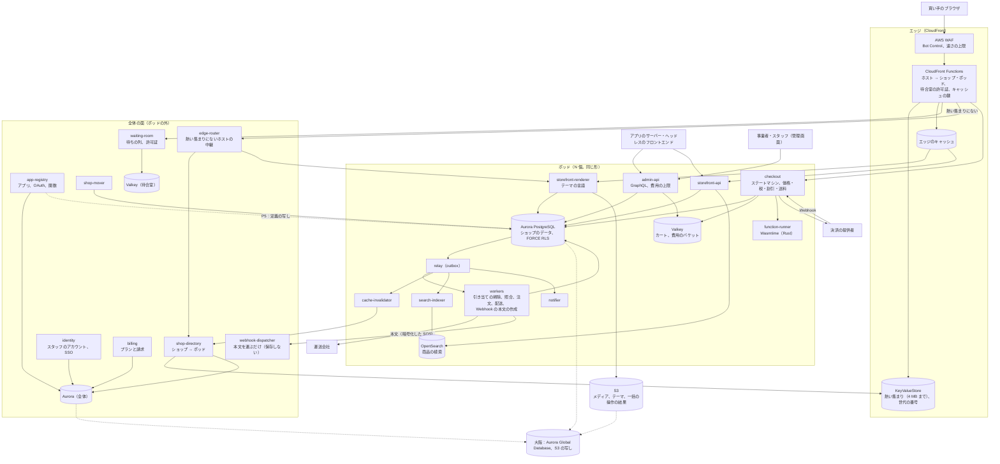

# Architecture: Shopify

全体像と横断的な方針。領域ごとの設計は、同じディレクトリに領域ごとのファイルとして置く（7 節）。データモデルの正本（規約、ER 図、表の目録、置き場所）は [data-model.md](data-model.md) と [data-model/](data-model/) にある。品質の戦略は [quality.md](../quality.md)、Epic と Story は [roadmap.md](../roadmap.md)、SLO と運用は [runbooks/](../runbooks/README.md) にある。

## 1. 全体構成

### 1.1 コンテキスト

```
 買い手（スマートフォン・PC のブラウザ）        ヘッドレスのフロントエンド（事業者の開発者）
      │ HTTPS <shop>.<brand>.<domain>、独自のドメイン        │ Storefront API（X-<Brand>-Storefront-Access-Token）
      ▼                                                        ▼
┌──── 本システム（ストアフロント、チェックアウト、管理画面、API）──────────────────────────┐
│  ショップとポッド、カタログと価格、税とインボイス、在庫と引き当て、待合室とボット対策、           │
│  カートとチェックアウト、割引、決済の連携、注文と配送、返品と返金、テーマ、検索、アプリの基盤     │
└──────────────────────────────────────────────────────────────────────┘
   ▲ 管理画面（admin.<brand>.<domain>）   ▲ Admin API（GraphQL、X-<Brand>-Access-Token）   │ 外向き
   │ 事業者・スタッフ                     │ アプリの開発者のサーバー、Webhook の受け口       ▼
                                                                                     決済の提供者（リダイレクト、ホストした入力部品、Webhook）、
                                                                                     運送会社（送り状、追跡）、メールの送信、TLS の証明書
```

### 1.2 コンテナ



| コンテナ | 責務 |
| --- | --- |
| エッジ（CloudFront、AWS WAF、CloudFront Functions） | TLS の終端、ボットの絞り込み、ホスト名からショップとポッドを引く（KeyValueStore）、待合室の許可証の確かめ、キャッシュの鍵（ショップ・テーマ・通貨・言語・世代の番号）の組み立て、ポッドの入口（ALB）への振り分け（[ADR-0002](../decisions/0002-pods-and-shop-placement.md)） |
| `shop-directory` | ショップ・ドメイン → ポッドの正本、ライフサイクル。熱い集まりと世代の番号を KeyValueStore に配る。ショップの移し替えの切り替えの点（[ADR-0010](../decisions/0010-shop-routing-hot-set-and-custom-domains.md)、[ADR-0013](../decisions/0013-shop-lifecycle-and-data-deletion.md)） |
| `edge-router` | 熱い集まりにないホストを `shop-directory` で引き、ポッドへ中継する（Fargate、VPC origin。[ADR-0010](../decisions/0010-shop-routing-hot-set-and-custom-domains.md)） |
| `billing` | プラン、利用量、事業者への請求（[ADR-0065](../decisions/0065-merchant-billing-plans-and-usage.md)） |
| `identity` | スタッフのアカウント（複数のショップに属しうる）、ログイン、2 段階の認証、SSO。ショップの中の権限は各ポッドが持つ（merchant-admin-and-staff の領域） |
| `app-registry` | アプリの登録、OAuth 2.0 の定義、スコープ、アプリの課金の計画、関数のモジュールの検査・翻訳・署名。アプリの定義をポッドへ写す（P5）（[ADR-0054](../decisions/0054-oauth-install-and-expiring-tokens.md)、[ADR-0059](../decisions/0059-function-publish-compile-and-distribution.md)） |
| `waiting-room` | フラッシュセールの待ちの列、受け入れの速さの計算、署名つきの許可証の発行（flash-sales-and-queueing の領域） |
| `shop-mover` | ショップの移し替え（コピー、変更の追いかけ、書き込みの短い停止、切り替え、15 分の中継の窓）（[ADR-0002](../decisions/0002-pods-and-shop-placement.md)、[ADR-0012](../decisions/0012-shop-mover-logical-decoding-and-cutover.md)） |
| `storefront-renderer` | テーマのテンプレートを、許可した値と上限の中で HTML にする（[ADR-0007](../decisions/0007-theme-language-design.md)） |
| `storefront-api` | ヘッドレスの GraphQL。商品、コレクション、検索、カート。公開と秘密のトークン |
| `checkout` | カートとチェックアウトのステートマシン、送料・税・割引の計算、在庫の引き当て、決済の提供者とのやり取り、注文の作成（[ADR-0004](../decisions/0004-inventory-reservation-model.md)、[ADR-0005](../decisions/0005-checkout-state-machine-and-exactly-once-orders.md)、[ADR-0006](../decisions/0006-payments-via-providers.md)） |
| `admin-api` | Admin API（GraphQL）と、管理画面の API。費用の計算とバケット、一括の操作（[ADR-0009](../decisions/0009-admin-api-graphql-and-cost-limits.md)） |
| `function-runner` | アプリの関数（WebAssembly）を、燃料とメモリーの上限を付けて動かす Rust のプロセス。`checkout` の隣のコンテナ（[ADR-0008](../decisions/0008-extension-sandbox-wasm.md)） |
| `workers` | 引き当ての期限切れの掃除、決済と注文の照合、配送の指示、送り状、通知の依頼、Webhook の本文の作成（fanout） |
| `relay` | outbox を読み、SNS へ流す |
| `webhook-dispatcher` | 全体の面。ポッドが作った Webhook の本文を暗号化した SQS で受け、署名を付けて隔離した egress から少なくとも 1 回送る。本文を保存しない（[ADR-0062](../decisions/0062-webhook-egress-and-payload-custody.md)） |
| `cache-invalidator` | ポッドの中。カタログ・テーマの変更から、エッジのキャッシュの世代の番号を上げる（[ADR-0050](../decisions/0050-edge-cache-keys-and-generations.md)） |
| `search-indexer` | ポッドの中。商品の変更をポッドの OpenSearch の索引に入れる（[ADR-0052](../decisions/0052-search-index-per-pod-and-japanese-analysis.md)） |
| `notifier` | ポッドの中。買い手へのメール（注文の確認、発送、返金）と事業者への通知 |
| OpenSearch（ポッド） | 商品の検索の索引。ポッドごとのドメイン（[ADR-0052](../decisions/0052-search-index-per-pod-and-japanese-analysis.md)） |
| Aurora（ポッド） | ショップのデータの正本（カタログ、在庫、チェックアウト、注文、スタッフの権限、アプリの導入）。FORCE RLS（[ADR-0003](../decisions/0003-tenancy-and-rls.md)） |
| Aurora（全体） | ショップの表、スタッフのアカウント、アプリの登録、プランと請求。ショップのデータを持たない |
| Valkey | ポッド：カート、Admin API の費用のバケット、入口の上限。全体：待合室の列、`identity` のセッション。失ってよい（正本にしない） |
| S3 | 商品のメディア、テーマのファイル、一括の操作の結果、書き出し。大阪へ写す |

原則は 6 つ。

- **ショップを単位にポッドへ閉じる。** ポッドは、Aurora・Valkey・SQS・OpenSearch・アプリのサービス（非同期の `cache-invalidator`・`search-indexer`・`notifier` を含む）を持つ完全なセルである。1 つの要求とジョブは 1 つのポッドだけに触れる。ポッドの外の全体の面は、ショップのデータを保存しない（`webhook-dispatcher` は本文を運ぶだけ）（[ADR-0002](../decisions/0002-pods-and-shop-placement.md)）。
- **在庫と注文の正本は 1 つの DB のトランザクション。** 引き当て・確定・注文の作成・outbox は、ポッドの Aurora の同じトランザクションで書く。Valkey と待合室は流量を絞るだけで、正しさを担わない（[ADR-0004](../decisions/0004-inventory-reservation-model.md)、[ADR-0005](../decisions/0005-checkout-state-machine-and-exactly-once-orders.md)）。
- **流量はエッジで絞る。** フラッシュセールの急増は、WAF・待合室・許可証で、ポッドが受けられる速さに絞ってから入れる。ポッドの中で無制限に受けて落ちる形にしない。
- **ストアフロントはキャッシュが先。** ページはショップごとの世代の番号を鍵に入れてエッジに置き、変更は世代を上げて無効にする。在庫の数や価格のような速く変わる値は、キャッシュしたページに焼き込まず、チェックアウトで必ず計算し直す。
- **拡張は砂場の中だけ。** テーマは副作用のない言語、アプリのロジックは WebAssembly の関数で、どちらも上限つき。アプリのサーバーとは API と Webhook でだけつながる（[ADR-0007](../decisions/0007-theme-language-design.md)、[ADR-0008](../decisions/0008-extension-sandbox-wasm.md)）。
- **カード処理は提供者に任せる。** 本システムはカード番号に触れない。提供者とは冪等キーと Webhook の inbox で、ちょうど 1 回の効果にする（[ADR-0006](../decisions/0006-payments-via-providers.md)）。

### 1.3 主要な流れ

**A. 商品のページを表示する**

1. 買い手が `https://<shop>.<brand>.<domain>/products/blue-tee` を開く。CloudFront Functions がホスト名で KeyValueStore（熱い集まり）を引き、`shop_id`・`pod_id`・ショップの世代の番号を得る。集まりにないホストは、`edge-router` が `shop-directory` で引いてポッドへ中継する（[ADR-0010](../decisions/0010-shop-routing-hot-set-and-custom-domains.md)）。
2. キャッシュの鍵を（ショップ、パス、テーマ、通貨、言語、世代の番号、端末の種類）で作る。当たればエッジから返す（TTFB p95 80ms の目標）。
3. 外れれば、ポッドの `storefront-renderer` へ送る。レンダラーはテーマのテンプレート（コンパイル済み）を、商品の値（drop）と上限で HTML にし、`Cache-Control: s-maxage=300, stale-while-revalidate=60` を付けて返す。
4. 在庫の有無と価格の最新の値は、ページの中の小さな部品が Storefront API から取る（短いキャッシュ）。カートに入れた後の価格は、チェックアウトで必ず計算し直す。
5. 事業者が商品を変えると、outbox → `cache-invalidator` がショップ（大きなショップは商品のページの 64 の桶）の世代の番号を上げ、`shop-directory` が KeyValueStore に書く。次の要求から新しい鍵になる（p95 10 秒の目標。`edge-cache-generation-poc` で確かめる。[ADR-0050](../decisions/0050-edge-cache-keys-and-generations.md)）。

**B. フラッシュセールで買う**

1. 事業者がセール（開始の時刻、対象の商品、1 人あたりの数の上限）を予定する。Ops の手順で、ショップを前もって空きの多いポッドへ移し、在庫の枠（slot）を広げる（[runbooks/](../runbooks/README.md) の 5 節）。
2. 開始の前後、エッジは対象のショップへの要求に待合室の許可証を求める。許可証のない買い手は待合室のページ（静的、S3）に並ぶ。開始の前に来た人は、開始の時刻に乱数で並べ替える。以後は来た順。
3. `waiting-room` は、残りの在庫と、ポッドのチェックアウトの受け入れの速さ（S1 で 1 ショップ 100 件/秒）から、1 秒あたりの受け入れの数を決め、署名つきの許可証（ショップ、期限 15 分、1 回だけ）を出す。売り切れたら、待っている人に売り切れを示す。
4. 買い手がチェックアウトで支払いを始める（送信）と、`checkout` が在庫を引き当てる。品目の枠のうち 1 つを選び、`UPDATE ... SET available = available - n WHERE available >= n` で減らし、引き当ての行（期限は通常 15 分、フラッシュセールのショップは 10 分）を同じトランザクションで書く。枠が足りなければ別の枠を試し、全部が足りなければ在庫切れを返す（[ADR-0004](../decisions/0004-inventory-reservation-model.md)）。
5. 決済が通ると、注文を作り、引き当てを確定に変える（C）。期限までに決済が終わらなければ、掃除の処理が引き当てを枠に戻す。

**C. 決済の結果と注文の作成（競合）**

1. `checkout` は提供者の決済のセッションを、冪等キー `<checkout_id>:<attempt>:<op>`（ここでは `op` は `session`）で作り、買い手をリダイレクトする（またはホストした入力部品で確定する）。
2. 結果は 2 つの経路で届く：買い手のリダイレクトの戻りと、提供者の Webhook。Webhook は inbox の表に提供者のイベント ID で一度だけ入る。
3. どちらの経路も `completeCheckout(checkout_id)` を呼ぶ。チェックアウトの行を `SELECT ... FOR UPDATE` で取り、状態が `completed` ならその注文を返す。そうでなければ、提供者に結果を照会して確かめ、注文を挿入し（`checkout_id` は一意）、引き当てを確定に変え、outbox（`orders/create`）を書き、状態を `completed` にする。全部が 1 つのトランザクション（[ADR-0005](../decisions/0005-checkout-state-machine-and-exactly-once-orders.md)）。
4. 引き当ての期限が切れていて在庫を取り直せないときは、注文を作らず、オーソリを取り消すか返金する（決定表は cart-and-checkout の領域）。
5. 照合の処理 `checkout-reconciler` が 1 分ごとに、送信から 5 分を超えて `payment_pending` のままのチェックアウトを探し、3 と同じ関数を呼ぶ。60 分を超えて提供者に支払いがなければ `expired` にする（[cart-and-checkout.md](cart-and-checkout.md) の 8 節、[ADR-0029](../decisions/0029-checkout-completion-decision-table.md)）。

**D. ショップをポッドの間で移す**

1. `shop-mover` が移す先のポッドに、ショップの行を一括でコピーする（ショップの `shop_id` で絞った読み出し）。
2. 元のポッドの論理デコードで、そのショップの変更を追いかけて先へ当てる。遅れが 1 秒未満になるまで続ける。
3. ショップの共有のアドバイザリーロックを排他で取って停止の印を書き、書き込みを止める（目標 p99 10 秒。書き込みは 503 と `Retry-After: 5`）。残りの変更を当て、変わった行だけを照合する（全量の照合は停止の前）。
4. `shop-directory` の行を新しいポッドに変え、KeyValueStore に配る。書き込みを再開する。伝わる前に元のポッドへ来た要求は、元のポッドが 15 分（最大 24 時間）新しいポッドへ中継する。元のポッドの行は 7 日の後に消す（[ADR-0002](../decisions/0002-pods-and-shop-placement.md)、[ADR-0012](../decisions/0012-shop-mover-logical-decoding-and-cutover.md)）。

**E. アプリの割引の関数を動かす**

1. 事業者がアプリを入れ、アプリの割引（関数）を有効にする。関数の WebAssembly のモジュールは、アプリの公開の時に `app-registry` が検査し、事前に機械語にして署名し、S3 に置く。
2. チェックアウトの価格の計算で、`checkout` が関数の入力（カート、買い手の区分、関数の設定。入力のクエリで決めた分だけ）を作り、隣の `function-runner` に UNIX ドメインソケットで渡す。
3. `function-runner` は、燃料（命令の数）1,000 万、線形メモリー 10 MiB、入力 128 KiB、出力 20 KiB の上限で動かす。WASI を渡さない。結果（割引の提案）を JSON で返す。
4. `checkout` は提案を検証し（対象の行がカートにあるか、額が 0 以上で行の価格以下か）、割引のエンジンの組み合わせの規則で、他の割引と合わせる。関数の失敗・上限の超過は「その関数の割引なし」として続ける（[ADR-0008](../decisions/0008-extension-sandbox-wasm.md)）。

### 1.4 本家の形（確かめたこと）

| 項目 | 本家 | 出典 |
| --- | --- | --- |
| ポッド | 完全に分けたデータストアの上のショップの集まり。アプリのサーバー・ジョブ・ロードバランサーは共有。1 つの要求は 1 つのポッドだけ。Sorting Hat が要求を振る。Pod Mover でポッドを 1 分ほどで別のデータセンターへ | [Pods Architecture](https://shopify.engineering/a-pods-architecture-to-allow-shopify-to-scale) |
| データの移し替え | MySQL の一部のデータを短い停止で移すライブラリ Ghostferry を公開 | [Ghostferry](https://github.com/Shopify/ghostferry) |
| Admin API の上限 | 計算した費用のリーキーバケット。回復は 1 秒 100〜2,000（プランによる）。1 つのクエリの上限 1,000。オブジェクト 1、ミューテーション 10 | [GraphQL Admin API rate limits](https://shopify.dev/docs/apps/build/apis/graphql-admin/rate-limits) |
| Storefront API | 買い手の通信に決まった上限なし。ボット・クローラーとチェックアウトの作成を絞る。買い手の IP アドレスのヘッダー | [Storefront API](https://shopify.dev/docs/api/storefront)、[API usage limits](https://shopify.dev/docs/api/usage/limits) |
| Functions | WebAssembly。命令 1,100 万、メモリー 10,000 kB、スタック 512 kB、モジュール 256 kB、入力 128 kB、出力 20 kB（200 行を超えると比例して広がる）、テーブル 4・要素 1 万。入力のクエリ 3,000 バイト・費用 30 | [Shopify Functions](https://shopify.dev/docs/api/functions) |
| Webhook | HMAC の署名、配信の ID で重複を除く、順序を保証しない。応答は 5 秒以内。4 時間に 8 回の送り直し、失敗が続けば購読を消す | [Webhooks](https://shopify.dev/docs/apps/build/webhooks)、[Troubleshoot webhooks](https://shopify.dev/docs/apps/build/webhooks/troubleshooting-webhooks) |
| 在庫の状態 | on_hand は available・committed・reserved・damaged・safety_stock・quality_control の和 | [Inventory states](https://shopify.dev/docs/apps/build/orders-fulfillment/inventory-management-apps/manage-quantities-states) |
| ボット対策 | フラッシュセールのチャレンジ（Plus）。500 商品まで、60 分まで | [Bot protection](https://help.shopify.com/en/manual/checkout-settings/bot-protection) |
| テンプレートの言語 | Liquid（Ruby、MIT）。評価せず安全であることを目標にする | [Liquid](https://github.com/Shopify/liquid) |
| 規模 | BFCM 2025：売上の最大 1 分 510 万 USD、エッジ 1 分 4.89 億件、アプリのサーバー 1 分 1.17 億件超 | [BFCM 2025](https://www.shopify.com/news/bfcm-data-2025) |
| チェックアウトで在庫を引き当てる時点、関数の失敗の扱い、待合室の並びの規則、本家の SLA、内部の DB の分け方の今の形 | 公式の資料で確かめられなかった（**未検証**） | — |

いずれも 2026-10-10 に確認。この設計は振る舞いを参考にするが、本家のコード・Liquid の実装・内部の形式は使わない（[リポジトリ共通の ADR-0007](../../../../docs/decisions/0007-no-reuse-of-original-implementation.md)）。

**本家との意図した違い**：

| 項目 | 本家 | 本システム | 理由・根拠 |
| --- | --- | --- | --- |
| ポッドの範囲 | データストアだけを分け、アプリのサーバーは共有 | アプリのサービスもポッドごとに持つ完全なセル | ショップのデータの DB の接続の数をポッドに閉じ、うるさい隣人の影響をアプリの層でも切る。Fargate なら小さく持てる（[ADR-0002](../decisions/0002-pods-and-shop-placement.md)） |
| DB | MySQL（本家の公開の資料から） | Aurora PostgreSQL と FORCE RLS | 共通の基盤。ショップの分離を DB でも守る（[ADR-0003](../decisions/0003-tenancy-and-rls.md)） |
| テンプレートの言語 | Liquid。既定で出力をエスケープしない（未検証） | 自前の言語。既定で HTML をエスケープし、歩数・出力・ループに上限 | XSS を既定で防ぐ。上限を言語の意味に含める（[ADR-0007](../decisions/0007-theme-language-design.md)） |
| 関数の上限 | 命令 1,100 万 | 燃料 1,000 万（`wasm-function-poc` で見直す）。失敗は種類ごとの「効果なし」 | 自前の値。チェックアウトの p99 の予算から決めた（[ADR-0008](../decisions/0008-extension-sandbox-wasm.md)） |
| Admin API | GraphQL と REST | GraphQL だけ | 作る量を減らす。費用の上限を 1 つの形にする（[ADR-0009](../decisions/0009-admin-api-graphql-and-cost-limits.md)） |
| データの所在 | 未検証 | すべて日本（東京、DR は大阪） | 日本を最初の市場にする（法務の L3） |
| ヘッダーと接頭辞 | 本家の名前を含む | `X-<Brand>-Access-Token`、`<brand>_at_` | リポジトリ共通の ADR-0006 |
| 振り分け | ロードバランサーの Sorting Hat が規則で振る | エッジの KeyValueStore には要求の多いホストだけの「熱い集まり」（4 MB まで）を置き、集まりにないホストは全体の面の `edge-router` が引いて中継する | KeyValueStore の 1 つの保存は 5 MB で、全ホストが入らない（[ADR-0010](../decisions/0010-shop-routing-hot-set-and-custom-domains.md)） |
| 全体の定義の配り | 未検証 | 全体の面のアプリの定義・プランの上限・言語と通貨の表を、ポッドの DB の写しの表へ配る（経路 P5）。ポッドの要求は全体の DB を読まない | 1 つの要求が 1 つのポッドだけに触れる規則を保つ（[ADR-0002](../decisions/0002-pods-and-shop-placement.md)、[ADR-0010](../decisions/0010-shop-routing-hot-set-and-custom-domains.md)） |
| ショップの移し替え | Pod Mover でポッドを 1 分ほどで別のデータセンターへ。ショップの単位の停止の時間は未検証 | ショップの単位で移す。書き込みの停止 p99 10 秒。切り替えの後 15 分（最大 24 時間）は、元のポッドが新しいポッドへ要求を中継する | ブラウザは 421 で送り直さないので、伝わる前の要求を見えない中継で受ける（[ADR-0012](../decisions/0012-shop-mover-logical-decoding-and-cutover.md)） |
| 売上の確定の時点 | チェックアウトで自動（既定）、注文の全体の配送で自動（Plus は配送ごと）、手動 | 注文の作成の後のジョブ（既定）、最初の発送で確定（`on_first_fulfillment`）、手動。期限の 24 時間前に自動で確定 | 一部の配送で売上を立てたい事業者に、全体の配送を待たせない（[ADR-0038](../decisions/0038-capture-timing-and-authorization-expiry.md)） |
| 同じ行の複数の商品の割引 | Plus のショップだけ | MVP は持たない（1 行に商品の割引 1 つ） | 選び方と按分を単純にし、参照の実装で全組み合わせを確かめられる大きさにする（[ADR-0032](../decisions/0032-discount-classes-order-and-combination.md)） |
| 別の行の商品の割引どうし | 組み合わせの設定に従う（未検証） | 常に両立 | 対象の行が重ならないので、組み合わせの印を見なくても金額が決まる（[ADR-0032](../decisions/0032-discount-classes-order-and-combination.md)） |
| 割引の組み合わせの可否 | 一部はショップの条件による | すべてのショップで同じ決定表（DT-DSC-001） | 規則を 1 つにする（[ADR-0032](../decisions/0032-discount-classes-order-and-combination.md)） |
| Webhook の失敗が続いた購読 | 購読を消す | 48 時間の連続の失敗で `disabled` にし、消さない。開発者が再開できる | 受け口の直しの後に、購読を作り直させない（[ADR-0061](../decisions/0061-webhook-delivery-and-signing.md)） |
| Webhook の署名の秘密 | アプリの client secret | Webhook の専用の秘密（`<brand>_whsec_`）。24 時間の入れ替え | client secret と入れ替えを独立にする（[ADR-0061](../decisions/0061-webhook-delivery-and-signing.md)） |

## 2. 規模の段階

| 段階 | ショップ（稼働） | 流通総額（GMV） | 注文 | 注文の最大（全体） | 注文の最大（1 ショップ） | ストアフロントの要求 | Admin API | ポッド | 構成 |
| --- | --- | --- | --- | --- | --- | --- | --- | --- | --- |
| S1（MVP） | 5 万（登録 10 万） | 年 1,000 億円 | 月 100 万件 | 200 件/秒 | 100 件/秒 | エッジ 平均 1 万・最大 10 万 件/秒、元 最大 1 万 件/秒 | 最大 5,000 件/秒 | 共有 4（`p01`〜`p04`）＋隔離 1（`x01`）＋見張り 1（`p00`、最小の大きさ） | 東京の 1 リージョン・3 AZ。大阪に Aurora Global Database と S3 の写し |
| S2 | 50 万 | 年 1 兆円 | 月 1,000 万件 | 1,000 件/秒 | 500 件/秒 | エッジ 最大 100 万 件/秒、元 最大 8 万 件/秒 | 最大 5 万 件/秒 | 40 | 東京にポッドを増やす。大きなショップは専用のポッド |
| S3 | 500 万 | 年 10 兆円 | 月 1 億件 | 5,000 件/秒 | 2,000 件/秒 | エッジ 最大 500 万 件/秒、元 最大 30 万 件/秒 | 最大 30 万 件/秒 | 300 | 東京に数百のポッド、ポッドの組ごとに全体の面の読み出しの写し。海外のリージョン（ショップをリージョンに固定） |

- 数値は本システムの想定。本家の参考は BFCM 2025 のエッジの最大 1 分 4.89 億件（1 秒およそ 815 万件）、売上の最大 1 分 510 万 USD（[出典](https://www.shopify.com/news/bfcm-data-2025)）。S3 の想定は、本家の最大の 6 割ほどのエッジの要求にあたる。
- 注文の平均の額を 8,000 円と見込んだ。GMV 年 1,000 億円は年 1,250 万件・月およそ 100 万件にあたる。
- チェックアウトの段の要求（カート、配送先、送料、確定）は、注文 1 件あたり 10 件と見込み、S1 の最大で 2,000 件/秒。
- エッジのキャッシュの当たりの割合を 90% と見込む（エッジ 10 万件/秒に対して元 1 万件/秒）。フラッシュセールの間は、在庫の部品の要求が増えるので、待合室で入れる数を絞る。
- S1 のポッドあたりのショップは 1.25 万。商品のバリエーションは全体で 2,500 万、ポッドあたり 625 万を見込む。
- フラッシュセールの待合室は、1 つのセールで 20 万人の待ちを S1 で受ける。
- 段階を上げる基準は [infrastructure.md](infrastructure.md) の 8 節、ポッドの大きさの段と負荷のモデルは [capacity.md](capacity.md) の 4・5 節にある。見張りのポッド `p00` は、デプロイの波 0 と見張りのショップのために置く（[ADR-0011](../decisions/0011-shop-placement-and-rebalancing.md)、[ADR-0075](../decisions/0075-pod-wave-rollout-and-cross-pod-migrations.md)）。

### 2.1 費用のモデル

注文 1 件と、ストアフロントの要求 100 万件あたりの原価を、次の和で見る。単価は AWS の東京の公開の価格で、値は [capacity.md](capacity.md) の 6 節と [infrastructure.md](infrastructure.md) の 9 節にある。

```
注文あたりの原価 = チェックアウトの計算（Fargate、関数の実行）
                ＋ DB（引き当て・注文・outbox の書き込み、Aurora の I/O）
                ＋ 非同期（Webhook、通知、検索の索引、SQS・SNS）
                ＋ 外部（メールの送信。決済の提供者の手数料は事業者の負担で原価に入れない）
ストアフロントの原価 = エッジ（CloudFront の要求と転送、WAF の Bot Control、Functions）
                    ＋ 元（レンダラーの CPU、Aurora の読み出しの写し）
                    ＋ S3（メディア、テーマ）
```

- S1 の本番の月の原価は約 18.7 万 USD（約 2,800 万円、±40%。オンデマンド、1 USD = 150 円）。最も大きいのはエッジの転送（43%）、CloudFront の要求（17%）、WAF（9%）で、ポッド（共有 4・隔離・見張り）は 15%（[capacity.md](capacity.md) の 6 節）。原価のほとんどはストアフロントのエッジで、要求の数と応答の大きさ（画像の変換と形式）、CloudFront の価格の交渉が主な手段になる。キャッシュの当たりの割合は、元の原価にだけ効く。
- 共有のポッドの最小の構成（Aurora の書き込みと読み出し、Valkey、OpenSearch、Fargate のサービス、ALB）は 1 ポッド月 約 5,700 USD（約 85 万円）で、目標の「1 ポッド月 100 万円以下」に収まる。
- 単位あたり：ストアフロントの 100 万要求 約 5.2 USD、注文 1 件 約 0.012 USD、稼働のショップ 1 つ 月 約 3.7 USD（[infrastructure.md](infrastructure.md) の 9 節）。

## 3. 非機能要件

| ID | 項目 | S1 の目標 | 備考 |
| --- | --- | --- | --- |
| NFR-001 | チェックアウトの速さ | 確定（`completeCheckout`）p99 1.5 秒（提供者の応答の時間を除く）。他の段（カートの更新、配送先、送料と税の計算）p99 500ms。在庫の引き当て 1 回 p99 50ms | [ADR-0005](../decisions/0005-checkout-state-machine-and-exactly-once-orders.md) |
| NFR-002 | フラッシュセールの処理 | 1 ショップ 100 件/秒・全体 200 件/秒の注文の作成を、NFR-001 の中で処理する（S2 は 500・1,000、S3 は 2,000・5,000）。待合室は 1 つのセールで 20 万人を受け、許可証の発行から 1 秒以内にチェックアウトへ入れる | flash-sales-and-queueing の領域 |
| NFR-003 | ストアフロントの速さ | 日本の買い手の TTFB：キャッシュに当たれば p95 80ms・p99 200ms。外れれば p95 500ms・p99 1.2 秒。Storefront API（商品・コレクション）p95 150ms | storefront-api-and-caching の領域 |
| NFR-004 | 売り越しなし | 「売り越さない」品目で、確定した数が拠点の手元の数を超えた件数 0。Valkey・待合室・キャッシュの障害のときも 0 | [ADR-0004](../decisions/0004-inventory-reservation-model.md) |
| NFR-005 | 注文の耐久性 | 確認の画面を出した注文の消失 0。AZ の障害で RPO 0。リージョンの障害で RPO 1 分（Aurora Global Database）・RTO 1 時間 | [ADR-0005](../decisions/0005-checkout-state-machine-and-exactly-once-orders.md) |
| NFR-006 | 注文の一回性 | 1 つのチェックアウトからの重複の注文 0。提供者で成功した決済のうち、15 分を超えて注文も返金もない件数 0 | [ADR-0005](../decisions/0005-checkout-state-machine-and-exactly-once-orders.md)、[ADR-0006](../decisions/0006-payments-via-providers.md) |
| NFR-007 | 可用性 | チェックアウト 月間 99.95%、ストアフロント 月間 99.95%、管理画面と Admin API 月間 99.9%、Webhook の配信の受け付け 月間 99.9% | 本家の SLA は公式の資料で確かめなかった（**未検証**） |
| NFR-008 | 分離 | 他のショップのデータが出た事象 0 件。同じポッドの 1 ショップが割り当ての 10 倍の要求を受けても、他のショップの NFR-001・NFR-003 を満たす。ポッドの障害は他のポッドに広がらない | [ADR-0002](../decisions/0002-pods-and-shop-placement.md)、[ADR-0003](../decisions/0003-tenancy-and-rls.md) |
| NFR-009 | Admin API | 費用 100 以下のクエリ p99 1 秒。ミューテーション p99 1.5 秒。上限の超過は 429 ではなく `THROTTLED` のエラーと残りの量で返す | [ADR-0009](../decisions/0009-admin-api-graphql-and-cost-limits.md) |
| NFR-010 | Webhook | 事象から最初の配信まで p95 10 秒。少なくとも 1 回。失敗は 4 時間に 8 回まで送り直す | webhooks の領域 |
| NFR-011 | キャッシュの無効化 | 商品・価格・テーマの変更が、ストアフロントの表示に出るまで p95 10 秒・p99 60 秒 | storefront-api-and-caching の領域 |
| NFR-012 | 拡張の上限 | 関数 1 回の実行 p99 5ms、チェックアウトの 1 段の関数の合計 p99 50ms。テンプレートの 1 ページの描画の CPU p99 50ms。上限の超過でチェックアウト・ページが落ちない | [ADR-0007](../decisions/0007-theme-language-design.md)、[ADR-0008](../decisions/0008-extension-sandbox-wasm.md) |
| NFR-013 | 金額の正しさ | 税額（税率ごとの端数処理）、割引の按分、返金の額の、参照の計算との差 0 円。表示・注文・決済の金額の不一致 0 件 | taxes-and-invoices、discounts-engine の各領域 |
| NFR-014 | 検索 | 商品の検索 p95 200ms。商品の変更が検索に出るまで p95 30 秒 | search-and-recommendations の領域 |
| NFR-015 | ショップの移し替え | 書き込みの停止 p99 10 秒、データの不一致 0 | [ADR-0002](../decisions/0002-pods-and-shop-placement.md) |

## 4. 技術スタック

| 層 | 選定 | 理由 |
| --- | --- | --- |
| 言語（サービス） | TypeScript（Hono＋Zod）。ドメインごとのパッケージを持つ 1 つのコードベースを、入口ごとに別のサービス（`storefront-renderer`、`storefront-api`、`checkout`、`admin-api`、`workers`）として出す | 他の題材と同じ（[ADR-0001](../decisions/0001-platform-and-stack.md)） |
| 関数の砂場のホスト | Rust と Wasmtime（燃料、メモリーの上限、Cranelift の事前の翻訳） | [ADR-0008](../decisions/0008-extension-sandbox-wasm.md)。共通の基盤からの外れ |
| テーマの言語 | 自前の字句解析・構文解析・中間表現・インタープリター（TypeScript）。`eval` を使わない | [ADR-0007](../decisions/0007-theme-language-design.md) |
| GraphQL | graphql-js（GraphQL の参照の実装）で構文解析と検証。費用の計算と実行の計画は自前 | [ADR-0009](../decisions/0009-admin-api-graphql-and-cost-limits.md) |
| DB | Aurora PostgreSQL 18。ポッドごとのクラスタと全体のクラスタ。FORCE RLS と `SET LOCAL`、ID は UUIDv7、transactional outbox | [ADR-0002](../decisions/0002-pods-and-shop-placement.md)、[ADR-0003](../decisions/0003-tenancy-and-rls.md) |
| キャッシュ | ElastiCache Valkey（ポッドごと、待合室は全体） | 他の題材と同じ。失ってよい部品 |
| 非同期 | outbox → SNS・SQS（ポッドごとのキュー） | 他の題材と同じ |
| エッジ | CloudFront、CloudFront Functions、KeyValueStore、AWS WAF（Bot Control、CAPTCHA・Challenge） | storefront-api-and-caching、flash-sales-and-queueing の各領域 |
| 検索 | Amazon OpenSearch Service（日本語の形態素の解析と n-gram）。順位付けとおすすめの規則は自前 | search-and-recommendations の領域で ADR にする。汎用の部品（[ADR-0001](../decisions/0001-platform-and-stack.md)） |
| 実行基盤 | ECS Fargate（ポッドごとのサービス）。`function-runner` は `checkout` のタスクの隣のコンテナ | [ADR-0001](../decisions/0001-platform-and-stack.md) |
| オブジェクトストレージ | S3（メディア、テーマ、一括の結果）。画像の変換は自前の変換のサービス（sharp）と CloudFront | catalog-and-pricing の領域 |
| IaC | Terraform。ポッドは 1 つのモジュールから作る | infrastructure の領域 |
| 可観測性 | OpenTelemetry（ADOT）→ CloudWatch・AMP・Managed Grafana。ショップ・ポッドのラベル | observability の領域 |
| フラグ | AWS AppConfig | 他の題材と同じ |
| 管理画面 | React（TypeScript）。自社の Admin API だけを使う | merchant-admin-and-staff の領域 |
| テスト | Vitest・fast-check、Rust の `cargo test`・proptest・cargo-fuzz、自前の参照の実装（在庫、税、割引）、Testcontainers（PostgreSQL 18、Valkey）、LocalStack、k6 と自前の負荷の生成器、Playwright | [quality.md](../quality.md) |

## 5. 主な決定

どれも `accepted`。0001〜0009 は最初の設計の起票で、下の表に置く。0010〜0076 は領域の文書の工程で起票した（空きの番号はない）。各領域の ADR は 7 節の各文書の頭の表にあり、状態の一覧は [decisions/README.md](../decisions/README.md)。統合の工程で、決定を覆した・具体にした ADR に日付付きの注記を足した（6 節の「決定（2026-10-10、統合）」）。

| ADR | 決定 |
| --- | --- |
| [0001](../decisions/0001-platform-and-stack.md) | 共通の基盤（TypeScript・Hono、Aurora、Fargate、Valkey、SQS・SNS）を引き継ぎ、ドメインごとのパッケージを持つ 1 つのコードベースを入口ごとのサービスで出す。関数の砂場のホストだけ Rust。検索は OpenSearch、GraphQL の構文解析は graphql-js を汎用の部品として使う |
| [0002](../decisions/0002-pods-and-shop-placement.md) | ショップを単位に、Aurora・Valkey・SQS・アプリのサービスを持つポッド（完全なセル）へ置く。エッジが KeyValueStore でショップ → ポッドを引く。ショップの移し替えは、コピー・論理デコードでの追いかけ・10 秒以内の書き込みの停止・ディレクトリの切り替えで行う。ポッドをまたぐ経路は P1〜P5 だけ（統合の工程で、熱い集まりと `edge-router`、P5、15 分の中継の窓を注記した） |
| [0003](../decisions/0003-tenancy-and-rls.md) | ショップをテナントにし、ポッドの DB の全表に `shop_id` と FORCE RLS を置く。`shop_id` はホスト名・トークン・セッションからだけ決める。ポッドの中で、ショップごとの同時実行と速さの上限を置く |
| [0004](../decisions/0004-inventory-reservation-model.md) | 在庫は拠点ごとの行を Aurora の正本にし、支払いの開始で期限つきの引き当て、注文の作成で確定にする。「売り越さない」品目は CHECK 制約で守る。熱い品目は在庫を複数の枠の行に分ける（`available`・`reserved`・`committed` は枠の行。ADR-0020 で具体にした） |
| [0005](../decisions/0005-checkout-state-machine-and-exactly-once-orders.md) | チェックアウトを明示のステートマシンにし、注文の作成を `completeCheckout` の 1 つの関数とトランザクションに集める。`orders.checkout_id` を一意にし、決済だけ済んだ状態を 1 分ごとの照合で解消する |
| [0006](../decisions/0006-payments-via-providers.md) | 決済は外部の提供者に任せ、本システムはカード番号に触れない。提供者の差を吸収するアダプターの契約（`findByReference` を含む）、冪等キー、Webhook の inbox を持つ。事業者の提供者の認証の情報は DB の封筒の暗号（ADR-0066）。Stripe の題材は提供者の 1 つとして使い、設計し直さない |
| [0007](../decisions/0007-theme-language-design.md) | テーマの言語を自前で設計する（`{{ }}`・`` の形、副作用なし、既定で HTML をエスケープ、歩数・出力・ループ・入れ子・データの読み出しの上限）。中間表現に翻訳し、インタープリターで動かす。Liquid の実装は使わない |
| [0008](../decisions/0008-extension-sandbox-wasm.md) | アプリの関数は WebAssembly のモジュールにし、`checkout` の隣の Rust のプロセスの Wasmtime で、燃料・メモリー・入出力の上限を付けて動かす。WASI を渡さない。失敗は種類ごとの「効果なし」 |
| [0009](../decisions/0009-admin-api-graphql-and-cost-limits.md) | Admin API は GraphQL だけにし、日付のバージョン（`YYYY-MM`、四半期）を持つ。クエリの費用を実行の前に計算し、アプリとショップの組ごとのリーキーバケット（Valkey）で絞る。重い読み出しは一括の操作（S3 の JSONL） |

領域ごとの ADR は、7 節の番号の範囲で起票する。リポジトリ共通の決定（開発プロセス、ブランチモデル、本家の名前・接頭辞を使わない規則の [ADR-0006](../../../../docs/decisions/0006-brand-neutral-identifiers.md)、本家の実装を核に使わない規則の [ADR-0007](../../../../docs/decisions/0007-no-reuse-of-original-implementation.md)）は、ルートの [docs/decisions/](../../../../docs/decisions/README.md) にある。

## 6. リスクと未解決事項

品質の面のリスクの順位と対策は [quality.md](../quality.md) の 1 節にある。ここは設計の面のリスクを書く。

- **売り越し**：引き当てと確定の順序の誤り、期限切れの掃除と確定の競合、キャッシュの数を正本に使う誤り。CHECK 制約、1 つのトランザクション、参照の実装との比べで抑える（[ADR-0004](../decisions/0004-inventory-reservation-model.md)）。
- **熱い行**：1 つの品目に 1 秒数百の更新が集まると、行のロックで待ちが伸び、チェックアウトの p99 が崩れる。枠の行への分割と、待合室での流量の制限で抑える。枠の数の上限と Aurora の 1 行の更新の速さは `inventory-hot-row-poc` で確かめる。
- **決済と注文の食い違い**：リダイレクトの戻りと Webhook の競合、提供者の時間切れ、結果の不明。1 つの関数、一意の制約、提供者への照会、1 分ごとの照合で抑える（[ADR-0005](../decisions/0005-checkout-state-machine-and-exactly-once-orders.md)、[ADR-0006](../decisions/0006-payments-via-providers.md)）。
- **フラッシュセールの崩壊**：待合室を通らない経路（Storefront API、古いカートの URL）から直接チェックアウトへ来る。許可証をチェックアウトの作成と確定の両方で確かめ、ショップの単位の受け入れの上限を `checkout` にも置く。
- **ボット**：許可証の使い回し、多数の端末と IP アドレス。許可証は 1 回だけ・買い手のセッションに結び付け、WAF の Bot Control とチャレンジ、1 人あたりの数の上限、配送先・決済の手段の重複の検出で抑える（flash-sales-and-queueing の領域）。
- **キャッシュの漏れと古さ**：鍵にショップ・通貨・言語のどれかが抜けると、他のショップ・他の通貨のページが出る。ログインした買い手の個人の情報をキャッシュする事故。鍵の組み立てを 1 つの関数にし、個人の値をキャッシュするページに入れない規則と検査で抑える（storefront-api-and-caching の領域）。
- **テーマの言語の悪用**：無限のループ、巨大な出力、深い入れ子、データの読み出しの嵐、XSS。言語の意味の上限、既定のエスケープ、ファジングで抑える（[ADR-0007](../decisions/0007-theme-language-design.md)）。
- **砂場の脱出と遅さ**：Wasmtime の不具合、ホストの関数の誤り、燃料の上限の誤り。WASI なし、ホストの関数を持たない形、別のプロセスと権限のない IAM、脱出の試験、Wasmtime の更新の流れで抑える（[ADR-0008](../decisions/0008-extension-sandbox-wasm.md)）。
- **ショップの移し替えの誤り**：変更の取りこぼし、切り替えの間の二重の書き込み。書き込みの停止の印をポッドの DB に置き、行の数とチェックサムの照合の後にだけ切り替える（[ADR-0002](../decisions/0002-pods-and-shop-placement.md)）。
- **税と割引の端数**：税率の混ざる注文の割引の按分、返品の税の戻し、通貨の換算と丸め。参照の計算との性質ベーステストで抑える（taxes-and-invoices、discounts-engine の各領域）。
- **法令**：法務の確認待ちの事項がある（[intent.md](../intent.md) の「法務の確認待ち」の L1〜L10）。結論が出るまで、そこに挙げた Epic の spec を承認しない。

### 決定（2026-10-10、既定案）

PM の方針（本家に寄せ、判断が要るところは推奨の既定案で進める）により、最初の設計で次のとおり決めた。法務の判断が要るものは決めず、[intent.md](../intent.md) の「法務の確認待ち」に残した。どれも領域の文書の工程と E1〜E18 の PoC・試験で覆りうる。

- **ポッドの範囲**：アプリのサービスまで含む完全なセル。本家（アプリのサーバーを共有）と違う。DB の接続の数と、うるさい隣人の影響をポッドに閉じる（[ADR-0002](../decisions/0002-pods-and-shop-placement.md)）。
- **ショップの移し替え**：自前の `shop-mover`（PostgreSQL の論理デコード）。Ghostferry は MySQL 向けで、核の設計を自前にするため使わない（[ADR-0002](../decisions/0002-pods-and-shop-placement.md)）。
- **在庫を引き当てる時点**：支払いの開始（チェックアウトの送信）。カートに入れた時点では引き当てない。期限は通常 15 分、フラッシュセールのショップは 10 分（[ADR-0004](../decisions/0004-inventory-reservation-model.md)）。
- **熱い品目**：在庫を枠の行に分ける（既定 1、フラッシュセールの品目は 32）。Valkey で数えて正本にする案は、障害のときに売り越すので外した（[ADR-0004](../decisions/0004-inventory-reservation-model.md)）。
- **非同期の決済（コンビニ払い・銀行振込）**：支払いの番号を出した時点で「支払い待ち」の注文を作り、在庫を確定する。支払いの期限（提供者の設定。既定 3 日）を過ぎたら注文を取り消し、在庫を戻す（payments-integration の領域）。
- **売上の確定の時点**：既定は注文の作成と同時の自動の確定。事業者は「発送の時に確定」を選べる（オーソリの期限は提供者の値）。
- **待合室**：自前（CloudFront Functions の許可証の確かめと、`waiting-room` の列）。開始の前に来た人は乱数で並べ、以後は来た順（flash-sales-and-queueing の領域）。
- **ボット対策**：AWS WAF の Bot Control と CAPTCHA・Challenge の動作を使い、許可証、1 人あたりの数の上限、重複の検出は自前。外部のチャレンジの提供者は E13 の選定で比べる。
- **ストアフロントの描画の場所**：東京の元（Fargate）で描画し、エッジでキャッシュする。エッジでの描画（Lambda@Edge）は、日本の買い手には東京からの往復が短く、利点が小さいので外した。
- **キャッシュの無効化**：ショップ（大きなショップは商品・コレクション）の世代の番号をキャッシュの鍵に入れ、KeyValueStore で配る。CloudFront の無効化の API はパスの単位で、数と費用の上限があるので主にしない。
- **テーマの言語**：自前（仮の名前は Loom、拡張子 `.loom`）。`{{ }}`・`` の形は、Jinja や Django にもある公開の形として使う。既定で HTML をエスケープする（[ADR-0007](../decisions/0007-theme-language-design.md)）。
- **関数の砂場**：Wasmtime（燃料）。V8 の isolate は燃料の仕組みがなく決定的な上限を付けられないので外した（[ADR-0008](../decisions/0008-extension-sandbox-wasm.md)）。
- **Admin API**：GraphQL だけ、四半期ごとの日付のバージョン、費用の上限は本家に寄せる（[ADR-0009](../decisions/0009-admin-api-graphql-and-cost-limits.md)）。
- **検索**：OpenSearch（汎用の部品）。順位付けとおすすめは自前の規則。search-and-recommendations の領域で ADR にする。
- **ギフトカード・ポイント**：MVP の後。法務の L5 の後に設計する。
- **運送会社**：MVP は 3 社の送り状の CSV（書き出しと追跡の番号の取り込み）と、選定した 1 社の API。
- **本家の名前**：識別子は `<Brand>`・`<brand>`（リポジトリ共通の ADR-0006）。

### 決定（2026-10-10、統合）

領域の文書の間の食い違いを、統合の工程で次のとおり解いた。法務の判断が要るものは決めず、[intent.md](../intent.md) の「法務の確認待ち」に残した。最初の設計の ADR は直接直し、決定を覆した・具体にしたところに日付付きの注記を残した（[process.md](../../../../docs/process.md) の 9 節）。

- **振り分けと KeyValueStore**（[ADR-0002](../decisions/0002-pods-and-shop-placement.md) の注記）：KeyValueStore は 1 つの保存が 5 MB で、全ホストは入らない。要求の多いホストだけの「熱い集まり」（4 MB まで）と、集まりにないホストを中継する全体の `edge-router` にした（[ADR-0010](../decisions/0010-shop-routing-hot-set-and-custom-domains.md)）。[storefront-api-and-caching.md](storefront-api-and-caching.md) の 4.1 節で、値のないホストは `edge-router` へ送る形に直した。
- **ポッドをまたぐ経路 P5**（ADR-0002 の注記）：全体の面からポッドへの読み出しの写し（アプリの定義、プランの上限、言語と通貨の表）を P5 として足した。[app-platform-and-apis.md](app-platform-and-apis.md) の持ち越しはこれで閉じた。写しの表と移し替えの表を、[ADR-0003](../decisions/0003-tenancy-and-rls.md) の RLS の外の表の一覧に足した（ADR-0003 の注記）。
- **移し替えの切り替え**（ADR-0002 の注記）：「伝わる前の要求は 421 で再送させる」を、[ADR-0012](../decisions/0012-shop-mover-logical-decoding-and-cutover.md) の 15 分（最大 24 時間）の中継の窓に置き換えた。`x-<brand>-pod-id` の不一致の 421 は残す。[quality.md](../quality.md) の 2.2.1 節 I と [roadmap.md](../roadmap.md) の `shop-directory-and-routing` も直した。
- **Webhook の本文**（ADR-0002 の注記）：全体の `webhook-dispatcher` は本文を運ぶが保存しない（[ADR-0062](../decisions/0062-webhook-egress-and-payload-custody.md)）。「全体の面はショップのデータを持たない」は「保存しない」と読む。
- **非同期の部品の置き場所**（1.2 節）：`cache-invalidator`・`search-indexer`・`notifier` はポッドの中に置き、`webhook-dispatcher` だけを全体の面に置く（[infrastructure.md](infrastructure.md) の 5 節）。1.2 節の図と表を直し、`edge-router`・`billing` を足した。
- **在庫の数の置き場所**（[ADR-0004](../decisions/0004-inventory-reservation-model.md) の注記）：`available`・`reserved`・`committed` は枠の行、`on_hand`・`unavailable` は拠点の行（[ADR-0020](../decisions/0020-inventory-slot-counters-and-reservation-sweep.md)）。図の `fulfilled`・`restocked` は引き当ての行の状態でなく、注文の側の状態として持つ。
- **決済のアダプター**（[ADR-0006](../decisions/0006-payments-via-providers.md) の注記）：`findByReference` を必須の操作に足した（[ADR-0035](../decisions/0035-payment-attempt-states-and-result-normalization.md)）。事業者の提供者・運送会社の認証の情報は、Secrets Manager でなく、ポッドの DB の KMS の封筒の暗号に置く（[ADR-0066](../decisions/0066-encryption-and-key-layout.md)。ADR-0042 の注記、payments-integration・orders-and-fulfillment の表を直した）。
- **S3 の置き場所**：ショップのデータの S3 のキーは、ポッドに依らない `shops/<shop_id>/…` に揃えた（メディア、テーマ、書き出し、一括の操作の結果、サイトマップ、送り状、監査ログの写しは `audit/shops/<shop_id>/…`）。移し替えで S3 を動かさない。
- **Valkey の鍵**：ショップのデータの鍵は全部 `{<shop_id>}:<種類>:…` で始める（クラスタのハッシュタグ。[ADR-0028](../decisions/0028-cart-storage-in-valkey.md) の注記）。ポッドの運用の鍵は `sys:`、全体の待合室の鍵は `wr:{<sale_id>}:` で、ショップのデータの値を持たない。一覧は [data-model.md](data-model.md)。
- **検索のシャード**（[ADR-0052](../decisions/0052-search-index-per-pod-and-japanese-analysis.md) の注記）：主のシャードを 12 から 3 にし、`routing_partition_size` を使わない。索引はポッドあたり 6 GB 前後で、12 では 1 シャード 0.5 GB ほどと小さすぎるため。
- **返金の税の方式の名前**（[ADR-0017](../decisions/0017-consumption-tax-calculation-and-rounding.md)・[ADR-0043](../decisions/0043-refund-calculation-from-unit-allocations.md) の注記）：taxes-and-invoices の `difference` と returns-and-refunds の「差分（D）」が逆の中身を指していたので、`independent`（返す分だけで計算）と `recompute`（返品の後の注文の税額との差）に揃えた。どちらを使うかは法務の確認待ち（L4）のまま。
- **関数の輸入**（[ADR-0008](../decisions/0008-extension-sandbox-wasm.md) の注記）：`proc_exit` を許す（[ADR-0058](../decisions/0058-function-io-contract.md)）。
- **外貨の通貨（仮、PM の判断待ち）**：intent の MVP は「表示と支払いの通貨」を含むが、外貨のマーケットは海外への販売を伴い、越境の税（法務の L4）と E22 の設計が要る。MVP では仕組み（マーケット、固定の価格、換算と丸め、為替の写し）を作って試験し、外貨のマーケットの有効化は `release.markets-foreign-currency` の裏に置く。MVP で買い手が使える通貨は JPY だけ。[intent.md](../intent.md) と [roadmap.md](../roadmap.md) を同じ書き方に直した。**残る問い**：MVP の GA の判定に外貨の表示（支払いは JPY）だけを含めるか、E22 まで全部を止めるか。
- **本家との意図した違い**（1.4 節）：振り分け、P5、移し替えの中継の窓、売上の確定の時点（最初の発送）、同じ行の複数の商品の割引を持たない、別の行の商品の割引は常に両立、組み合わせの規則を全ショップで同じに、Webhook の購読を消さずに止める、Webhook の専用の秘密を足した。
- **見張りのポッド `p00`**：S1 のポッドは共有 4・隔離 1・見張り 1 になった（2 節、[ADR-0011](../decisions/0011-shop-placement-and-rebalancing.md)）。
- **費用**（2.1 節）：S1 の本番の月の原価は約 18.7 万 USD、共有のポッド 1 つ 約 5,700 USD。capacity と infrastructure の 9 節の値に揃え、目標「1 ポッド月 100 万円以下」に収まることを確かめた。
- **Story**：領域の文書が足した Story（`checkout-submit-idempotency`、`checkout-admission-limits`、`purchase-limits`、`surge-auto-queue`、`inventory-location-selection`、`inventory-movements`、`discount-function-merge`、`payment-inquiry-and-circuit-breaker` ほか 26 件）を [roadmap.md](../roadmap.md) に足し、E6 の `cart` を「Valkey が正本、ログインした買い手のカートだけ 30 分ごとに DB へ写す」に直した。
- **検証の工程での直し（2026-10-10）**：公式の資料を取得し直して、次を確かめ・直した。
  - CloudFront の KeyValueStore は鍵 512 バイト・値 1 KB・保存 5 MB・関数に 1 つ・1 回の更新 50 鍵か 3 MB・アカウントに 200。マルチテナントの配信のテナントはアカウントに 1 万（引き上げ可）、別名はテナントに 100、継続のデプロイは使えない。タグでの無効化（`CacheTagConfig`、1 オブジェクト 50 タグ）はテナントにも使える（確認のみ）。
  - CloudFront の VPC origin のアカウントをまたぐ共有（AWS RAM）は 2025-11-06 の発表（確認のみ）。
  - Aurora PostgreSQL 18 は 2026-06 に一般提供、2026-08 に 18.4（[infrastructure.md](infrastructure.md) の 4 節の未検証を外し、18 で始める）。
  - Aurora の書き込みの交代の後の論理レプリケーションのスロットは、公式の文書に記述がない。AWS のブログは交代の後に作り直すと書く。**未検証**のまま、失う前提で設計した（[shops-and-pods.md](shops-and-pods.md) の 8.6 節）。
  - Wasmtime の `consume_fuel` は決定的に止める仕組みで、燃料が尽きるとトラップ。`epoch_interruption` は決定的でない（確認のみ。ADR-0008 の使い分けのとおり）。
  - 国税庁の Q&A（令和 8 年 5 月改訂）の問 57：一の適格請求書につき税率ごとに 1 回の端数処理、方法は任意、商品ごとの端数処理の合計は不可。[taxes-and-invoices.md](taxes-and-invoices.md) の未検証を外した。当てはめ（本システムが出すレシートへの適用）は法務の確認待ち（L4）のまま。
  - 消費者庁の最終確認画面のガイドライン：令和 3 年の改正の第 12 条の 6 の考え方。意見募集（2021-11-24）の入口だけを確かめ、確定したガイドラインの本文は取得できなかった（**未検証**。intent の出典に書いた）。表示の事項の当てはめは法務の確認待ち（L1）。
  - 本家の Functions の上限（命令 1,100 万、メモリー 10,000 kB、スタック 512 kB、テーブル 4・要素 1 万、入力 128 kB・出力 20 kB、200 行を超えると比例、入力のクエリ 3,000 バイト・費用 30）、Admin API の回復（100・200・1,000・2,000）と 1 クエリ 1,000、Webhook の 4 時間に 8 回と応答 5 秒（確認のみ）。Webhook の失敗が続いたときに消す購読の種類は文書に書いていないので、「Admin API で作った購読を消す」を「購読を消す」に直した。
- **品質と運用**：
  - 各領域の文書の「テスト」「data-model への項目」の提案を反映した。[quality.md](../quality.md) に、性質と決定表の一覧（2.2.2 節）、漏れの経路の表の行、判定基準、Epic の合否基準を足した。
  - runbooks の手順を、作ったもの（[incident-response.md](../runbooks/incident-response.md)、[deploy-and-rollback.md](../runbooks/deploy-and-rollback.md)、[disaster-recovery.md](../runbooks/disaster-recovery.md)、[flash-sale-operations.md](../runbooks/flash-sale-operations.md)、[shop-move.md](../runbooks/shop-move.md)、[oversell-or-paid-without-order.md](../runbooks/oversell-or-paid-without-order.md)）と計画のものに分けて一覧にし、2 節に新しいフラグ（`ops.inventory_item_sales_enabled` ほか）を足した。
  - 表と置き場所は [data-model.md](data-model.md)（その後のデータモデルの工程で正本にした。下の「決定（2026-10-10、データモデル）」）。
- **数値の正本**：
  - SLO とアラートは [runbooks/README.md](../runbooks/README.md) の 1・4 節。上限は各 ADR と runbooks の 2 節。
  - 引き当ての期限 15 分（フラッシュセールのショップ 10 分）と枠（既定 1、セール 32、1〜64）は [ADR-0004](../decisions/0004-inventory-reservation-model.md)・[ADR-0020](../decisions/0020-inventory-slot-counters-and-reservation-sweep.md)。許可証 15 分は [ADR-0025](../decisions/0025-queue-pass-tokens.md)。
  - 関数の上限（燃料 1,000 万、メモリー 10 MiB、入力 128 KiB、出力 20 KiB、1 段 50ms）は [ADR-0008](../decisions/0008-extension-sandbox-wasm.md)。Admin API の費用（1 クエリ 1,000、回復 100・200・1,000/秒、容量はその 10 倍）は [ADR-0009](../decisions/0009-admin-api-graphql-and-cost-limits.md)。Webhook の送り直し（4 時間に 8 回、1・4・10・20・30・45・60・70 分）は [ADR-0061](../decisions/0061-webhook-delivery-and-signing.md)。KeyValueStore の熱い集まり（4 MB、3.5 MB で外し始め、固定の枠 1 MB）は [ADR-0010](../decisions/0010-shop-routing-hot-set-and-custom-domains.md)。
  - 負荷と費用のモデルは [capacity.md](capacity.md)、単位あたりの原価は [infrastructure.md](infrastructure.md) の 9 節。
- 領域ごとの決定は、各文書の「未解決の問い」の「決定」の節にある。

### 決定（2026-10-10、データモデル）

[data-model.md](data-model.md) を、索引からデータモデルの正本に書き直した。規約（ID、テナントと RLS、全体とポッド、金額、税、バージョン、分割・保持・削除、暗号化）、全体の ER 図とチェックアウトから配送までの道筋の図、[data-model/](data-model/) の 19 の領域のファイル（Aurora の 205 表の列・キー・索引・CHECK・RLS・分割・保持・S1 の量と、ER 図 20 個）と、Aurora の外の置き場所（[stores.md](data-model/stores.md)）を持つ。名前と列の食い違いは data-model の 7 節（D-1〜D-41）で決め、領域の文書を直した。ADR の決定は変えていない。

アーキテクチャに関わる次の 2 つは、PM の方針（法務でない判断は推奨の案）により推奨の案で決め、ADR に注記した。

- **ポッドから全体の待合室への受け渡し（D-16）**：待合室（全体の面）は、ポッドのセールの設定（開始・終わり、`rate_cap`、`k`・`q`）と在庫の予算の材料（`U = Σavailable`、`R = Σreserved`、5 秒ごと）を要るが、[flash-sales-and-queueing.md](flash-sales-and-queueing.md) の 5.4 節は「DB の読み出しの写しから」と書くだけで、経路が ADR-0002 の P1〜P5 にない。
  - **決定：案 a（推奨）**。P3（各ポッドが SNS へ出したものを全体で集める）に含める。ポッドの `workers` が `sale/config`・`sale/budget` の事象を出し、`waiting-room` が全体の `waiting_room_sales` と Valkey の `wr:{<sale_id>}:budget` に当てる。値は ID と数だけで、全体の面はショップのデータを持たない。[ADR-0002](../decisions/0002-pods-and-shop-placement.md) の P3 に注記した。
  - 案 b：P6 として新しい経路を足す（ADR-0002 を直す）。中身は案 a と同じで、名前だけが増える。
  - 案 c：`waiting-room` がポッドの読み出しの写しを直接読む。「1 つの要求は 1 つのポッドだけ」と全体の面の分離に反するので外した。
- **X1 の発見の索引（D-6）**：[ADR-0003](../decisions/0003-tenancy-and-rls.md) は「`shop_id` を主キーと索引の先頭に置く」とするが、領域の文書の引き当ての掃除・inbox・照会の予定は `shop_id` を先頭にしない部分索引（`(expires_at) WHERE state = 'reserved'` など）を置いていた。
  - **決定：案 a（推奨）**。決めた表の部分索引だけを例外にし、その索引は `sys` の `SECURITY DEFINER` の関数（ショップの ID だけを返す）からだけ使う。作業はショップごとに `SET LOCAL` して本体を読む（data-model の 3.4 節の一覧）。[ADR-0003](../decisions/0003-tenancy-and-rls.md) の X1 に、表の一覧と規則を注記した。
  - 案 b：例外を作らず、作業がショップを全部回す。1 秒ごとの作業（inbox、照会）でポッドの 1.25 万ショップを回すのは重い。
- **写しの表を足した（D-8）**：P5 の写しに、為替・通貨・言語・署名の公開鍵・関数・保持と保全と削除の方針を足した。どれも ADR-0003 の注記の「全体の写し（`*_replica`）」の区分の中で、経路は P5 のまま。

### 残る未解決事項（2026-10-10）

| 項目 | いつ・どう決めるか |
| --- | --- |
| 法務の確認待ち（L1〜L10） | [intent.md](../intent.md) の「法務の確認待ち」。結論まで、そこに挙げた Story の spec を承認しない |
| 外貨の通貨を MVP の GA の範囲に含めるか（仮の決定は上） | PM |
| 返金の税の方式（`independent`・`recompute`）、返還インボイスの記載 | 法務の確認待ち（L4） |
| 在庫の枠の数（32）、1 行の更新の上限、共有のアドバイザリーロックの費用 | E5 の前の `inventory-hot-row-poc`、E2 の前の `shop-move-poc` |
| ショップの移し替えの停止の時間、コピーの速さ、Aurora の交代でのスロットの扱い（**未検証**） | E2 の前の `shop-move-poc` |
| KeyValueStore の伝わりの時間（**未検証**）、`s-maxage` を延ばすか、タグでの無効化に替えるか | E12 の前の `edge-cache-generation-poc` |
| テンプレートの描画の速さ、歩数の上限の値 | E11 の前の `theme-renderer-poc` |
| 関数の実体化と実行の時間、燃料の上限の値 | E15 の前の `wasm-function-poc` |
| マルチテナントの配信のテナントの数の天井、配信あたりの要求の天井、Anycast の固定の IP の料金（**未検証**） | E2・S2 の前に AWS に確かめる |
| 決済の提供者、運送会社の API、チャレンジの提供者、為替の提供者 | E3・E8・E9・E13 の選定の Story |
| 1 要求・1 注文の CPU と DB の費用、Fargate の自動の拡大の速さ、可観測性とネットワークの費用（**未検証**） | E18 の負荷試験と、E1 の後の実績 |
| 本家の振る舞いで未確認のもの（引き当ての時点、関数の失敗の扱い、待合室の並び、SLA、Webhook の送り直しの間隔） | 公式の資料で確かめられなかった。本システムの値を使う |

## 7. 領域の文書（計画）

各領域の文書は 2026-10-10 にそろい、統合の工程で食い違いを解いた。領域の担当は、下の表の番号の範囲の中で ADR を採番する（範囲の外に出るときは、この表を先に更新する）。持ち主は、どれも Dev が書き、下の「レビュー」の列のロールが確認する。

| ファイル | 範囲 | ADR | レビュー | 関わる Epic |
| --- | --- | --- | --- | --- |
| [shops-and-pods.md](shops-and-pods.md) | ショップの開設とプラン、ドメインと TLS、ポッドの構成、ショップの置き場所の選び方、ディレクトリと KeyValueStore、ショップの移し替え、ポッドの中のうるさい隣人の上限 | [0010](../decisions/0010-shop-routing-hot-set-and-custom-domains.md)、[0011](../decisions/0011-shop-placement-and-rebalancing.md)、[0012](../decisions/0012-shop-mover-logical-decoding-and-cutover.md)、[0013](../decisions/0013-shop-lifecycle-and-data-deletion.md) | Ops、QA | E1、E2 |
| [catalog-and-pricing.md](catalog-and-pricing.md) | 商品、バリエーション、オプション、コレクション（手動と条件）、メディアと画像の変換、メタフィールド、販売の公開、マーケットと通貨、価格の表と換算の丸め、比較の価格（法務の L2）、商品の区分（法務の L10） | [0014](../decisions/0014-product-variant-option-model.md)、[0015](../decisions/0015-markets-currencies-and-rounding.md)、[0016](../decisions/0016-collection-membership-and-catalog-events.md) | QA | E3 |
| [taxes-and-invoices.md](taxes-and-invoices.md) | 消費税の区分（10%・8%・非課税）、総額表示、税率ごとの端数処理、割引・送料の税の按分、適格簡易請求書（レシート）、登録番号、返還インボイス（法務の L4） | [0017](../decisions/0017-consumption-tax-calculation-and-rounding.md)、[0018](../decisions/0018-invoice-documents-and-receipts.md)、[0019](../decisions/0019-invoice-registration-number-verification.md) | QA、法務 | E4、E10 |
| [inventory-and-reservations.md](inventory-and-reservations.md) | 拠点、在庫の状態、引き当て・確定・戻し、期限と掃除、枠の行と移し替え、拠点の選び方、調整と移動の履歴、照合 | [0020](../decisions/0020-inventory-slot-counters-and-reservation-sweep.md)、[0021](../decisions/0021-inventory-slot-probing-and-rebalance.md)、[0022](../decisions/0022-location-selection-and-lock-order.md)、[0023](../decisions/0023-inventory-movements-ledger-and-reconciliation.md) | QA、Ops | E5 |
| [flash-sales-and-queueing.md](flash-sales-and-queueing.md) | セールの予定、待合室（並び、受け入れの速さ、許可証）、ボット対策（WAF、チャレンジ、1 人あたりの上限、重複の検出）、隔離のポッドへの前もっての移し替え | [0024](../decisions/0024-waiting-room-ordering-and-admission-rate.md)、[0025](../decisions/0025-queue-pass-tokens.md)、[0026](../decisions/0026-bot-defense-and-purchase-limits.md)、[0027](../decisions/0027-flash-sale-preparation-and-surge-auto-queue.md) | QA、Ops、セキュリティ | E13 |
| [cart-and-checkout.md](cart-and-checkout.md) | カート、チェックアウトのステートマシン、配送先、最終確認画面（法務の L1）、完了の決定表、照合の処理、チェックアウトの作成の速さの上限 | [0028](../decisions/0028-cart-storage-in-valkey.md)、[0029](../decisions/0029-checkout-completion-decision-table.md)、[0030](../decisions/0030-price-snapshot-and-final-confirmation.md)、[0031](../decisions/0031-checkout-admission-limits.md) | QA、法務 | E6 |
| [discounts-engine.md](discounts-engine.md) | 割引の種類、対象、組み合わせとスタックの規則、適用の順序、按分と端数、使用の回数の上限、自動の割引、関数の割引との合わせ | [0032](../decisions/0032-discount-classes-order-and-combination.md)、[0033](../decisions/0033-discount-allocation-and-rounding.md)、[0034](../decisions/0034-discount-usage-counters.md) | QA | E7 |
| [payments-integration.md](payments-integration.md) | 提供者のアダプターの契約、リダイレクトとホストした入力部品、冪等キー、Webhook の inbox、結果の不明、オーソリと確定、返金、日本の決済手段（コンビニ払い、銀行振込、キャリア決済、後払い）、提供者の選定（法務の L7） | [0035](../decisions/0035-payment-attempt-states-and-result-normalization.md)、[0036](../decisions/0036-payment-webhook-inbox-and-inquiry-schedule.md)、[0037](../decisions/0037-async-payments-pending-orders.md)、[0038](../decisions/0038-capture-timing-and-authorization-expiry.md) | QA、セキュリティ | E8 |
| [orders-and-fulfillment.md](orders-and-fulfillment.md) | 注文のライフサイクル、編集とキャンセル、配送の指示、拠点の振り分け、送料の表（都道府県、重さ・サイズ）、配送の日時の指定、送り状の CSV、運送会社の API、追跡 | [0039](../decisions/0039-order-status-axes-and-edits.md)、[0040](../decisions/0040-fulfillment-orders-and-partial-fulfillment.md)、[0041](../decisions/0041-shipping-rate-tables.md)、[0042](../decisions/0042-carrier-integration-profiles.md) | QA、Ops | E9 |
| [returns-and-refunds.md](returns-and-refunds.md) | 返品の受け付け、返金の計算（一部・送料・割引の戻し）、在庫への戻し、提供者の返金、返還インボイス | [0043](../decisions/0043-refund-calculation-from-unit-allocations.md)、[0044](../decisions/0044-returns-state-and-restock.md) | QA | E10 |
| [storefront-themes.md](storefront-themes.md) | テーマの言語の文法と意味、drop とフィルター、上限、コンパイルとインタープリター、セクションとブロック、テーマの編集、既定のテーマ、特定商取引法の表示（法務の L1）、外部送信規律（法務の L6） | [0045](../decisions/0045-loom-grammar-and-contextual-escaping.md)、[0046](../decisions/0046-theme-structure-sections-and-publishing.md)、[0047](../decisions/0047-loom-data-access-and-prefetch.md)、[0048](../decisions/0048-storefront-scripts-csp-and-external-transmission.md) | セキュリティ、QA | E11 |
| [storefront-api-and-caching.md](storefront-api-and-caching.md) | Storefront API（GraphQL、トークン、ボットの絞り込み）、エッジのキャッシュの鍵、世代の番号と無効化、在庫の部品、SEO（サイトマップ、構造化データ、正規の URL、リダイレクト） | [0049](../decisions/0049-storefront-api-tokens-and-limits.md)、[0050](../decisions/0050-edge-cache-keys-and-generations.md)、[0051](../decisions/0051-dynamic-islands-and-uncached-personal-data.md) | QA、Ops | E12 |
| [search-and-recommendations.md](search-and-recommendations.md) | 検索の索引（OpenSearch）、日本語の解析、絞り込みと並べ替え、予測の検索、関連の商品、索引の更新 | [0052](../decisions/0052-search-index-per-pod-and-japanese-analysis.md)、[0053](../decisions/0053-search-ranking-and-recommendations.md) | QA | E16 |
| [app-platform-and-apis.md](app-platform-and-apis.md) | アプリの登録、OAuth 2.0 とスコープ、トークン、Admin API（スキーマ、バージョン、費用、一括の操作）、管理画面への埋め込み、アプリの課金と開発者への支払い（法務の L5）、顧客のデータのスコープ（法務の L3） | [0054](../decisions/0054-oauth-install-and-expiring-tokens.md)、[0055](../decisions/0055-scopes-and-protected-customer-data.md)、[0056](../decisions/0056-admin-embedding-and-session-tokens.md)、[0057](../decisions/0057-app-billing.md) | セキュリティ、QA | E14 |
| [functions-sandbox.md](functions-sandbox.md) | 関数の種類と入出力、入力のクエリ、モジュールの検査と事前の翻訳、`function-runner`、上限、失敗の扱い、関数のログ | [0058](../decisions/0058-function-io-contract.md)、[0059](../decisions/0059-function-publish-compile-and-distribution.md)、[0060](../decisions/0060-function-invocation-budget-and-failure-defaults.md) | セキュリティ、QA | E15 |
| [webhooks.md](webhooks.md) | 話題、購読、配信（署名、送り直し、順序なし、重複）、隔離した egress、購読の停止、照合の勧め | [0061](../decisions/0061-webhook-delivery-and-signing.md)、[0062](../decisions/0062-webhook-egress-and-payload-custody.md) | セキュリティ、Ops | E14 |
| [merchant-admin-and-staff.md](merchant-admin-and-staff.md) | 管理画面、スタッフのアカウントと招待、権限の一覧と役割、SSO、監査ログ、ショップの開設の審査（法務の L8・L10）、顧客のデータの削除（法務の L3） | [0063](../decisions/0063-staff-identity-2fa-sso-and-collaborators.md)、[0064](../decisions/0064-permissions-roles-and-audit-log.md)、[0065](../decisions/0065-merchant-billing-plans-and-usage.md) | セキュリティ | E17 |
| [security.md](security.md) | 脅威モデル、トークンと秘密、暗号化と鍵、個人のデータの扱い、決済の範囲（法務の L7）、ボットと不正、監査、開示の請求の手順 | [0066](../decisions/0066-encryption-and-key-layout.md)、[0067](../decisions/0067-checkout-script-integrity-and-card-testing.md)、[0068](../decisions/0068-data-classes-retention-and-operator-access.md) | セキュリティ | E1、E17、E18 |
| [data-model.md](data-model.md) | データモデルの正本：規約、全体の ER 図と道筋、横断の不変条件。[data-model/](data-model/) に領域ごとの表の目録と ER 図、Aurora の外の置き場所（Valkey の鍵、S3 のパス、SNS・SQS、Webhook の本文、関数の入出力、Loom の IR） | なし（各領域の ADR を参照する） | QA | 全 Epic |
| [infrastructure.md](infrastructure.md) | AWS のアカウントとネットワーク、ポッドの Terraform のモジュール、全体の面、エッジ、egress、DR（大阪）、段階を上げる基準 | [0069](../decisions/0069-accounts-network-and-pod-groups.md)、[0070](../decisions/0070-edge-distributions-waf-and-origin-selection.md)、[0071](../decisions/0071-osaka-dr-and-stage-up-criteria.md) | Ops | E1、E18 |
| [observability.md](observability.md) | ログ・メトリクス・トレース、ショップとポッドのラベル、SLI の計測、合成監視、実ユーザーの計測 | [0072](../decisions/0072-telemetry-pipeline-and-shop-cardinality.md)、[0073](../decisions/0073-correctness-monitors-and-independent-canary.md) | Ops | E1、E18 |
| [capacity.md](capacity.md) | 負荷のモデル（ストアフロント、チェックアウト、フラッシュセール、Admin API、Webhook）、部品ごとの必要量、ポッドの大きさ、費用のモデル、負荷試験 | [0074](../decisions/0074-pod-size-tiers-and-pre-scaling.md) | Ops | E18 |
| [delivery.md](delivery.md) | CI/CD、ポッドごとの段階のデプロイ、スキーマの変更、フラグ、テーマの言語と関数の API のバージョンの出し方 | [0075](../decisions/0075-pod-wave-rollout-and-cross-pod-migrations.md)、[0076](../decisions/0076-api-runtime-version-lifecycles.md) | QA、Ops | E1、E18 |

- 次に採番する ADR は 0077。

## 8. Epic

Epic と Story の計画は [roadmap.md](../roadmap.md) にある（PM が持つ）。E1〜E18 が MVP（S1）。各 Epic の品質の重点と合否基準は [quality.md](../quality.md) の 5 節にある。

| Epic | 目的 |
| --- | --- |
| E1 | 基盤：AWS・Terraform・CI、ポッドのモジュール、全体の面、Aurora と RLS、エッジ、フラグ、監査ログ、大阪の骨格 |
| E2 | ショップとポッド：ショップの開設、ドメイン、ディレクトリと振り分け、ショップの移し替え、ポッドの中の上限 |
| E3 | カタログと価格：商品、バリエーション、コレクション、メディア、マーケットと通貨 |
| E4 | 税とインボイス：税の区分、端数処理、レシート、登録番号 |
| E5 | 在庫と引き当て：拠点、状態、引き当て・確定・戻し、枠の行、照合 |
| E6 | カートとチェックアウト：ステートマシン、配送先、送料、最終確認画面、注文の作成、照合 |
| E7 | 割引のエンジン：種類、組み合わせの規則、按分 |
| E8 | 決済の連携：アダプター、提供者、日本の決済手段、返金 |
| E9 | 注文と配送：ライフサイクル、配送の指示、送料の表、送り状、運送会社 |
| E10 | 返品と返金 |
| E11 | ストアフロントのテーマ：テーマの言語、レンダラー、テーマの編集、既定のテーマ |
| E12 | Storefront API とキャッシュ、SEO |
| E13 | フラッシュセール：待合室、許可証、ボット対策、隔離のポッド |
| E14 | アプリの基盤：OAuth、Admin API、Webhook、アプリの課金 |
| E15 | 関数の砂場 |
| E16 | 検索とおすすめ |
| E17 | 管理画面・スタッフ・権限・監査 |
| E18 | 本番の準備と GA の判定：負荷試験、フラッシュセールの試験、DR の訓練、外部のペンテスト |
| E19 以降（MVP の後） | ギフトカードとポイント、定期購入、POS、越境と海外のリージョン、B2B、販売のチャネル |
