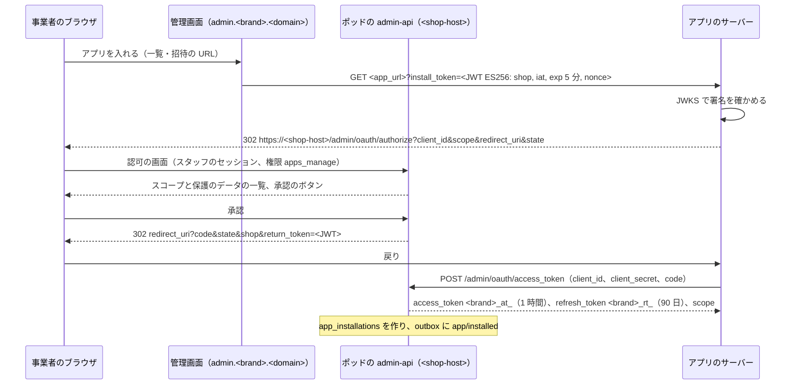
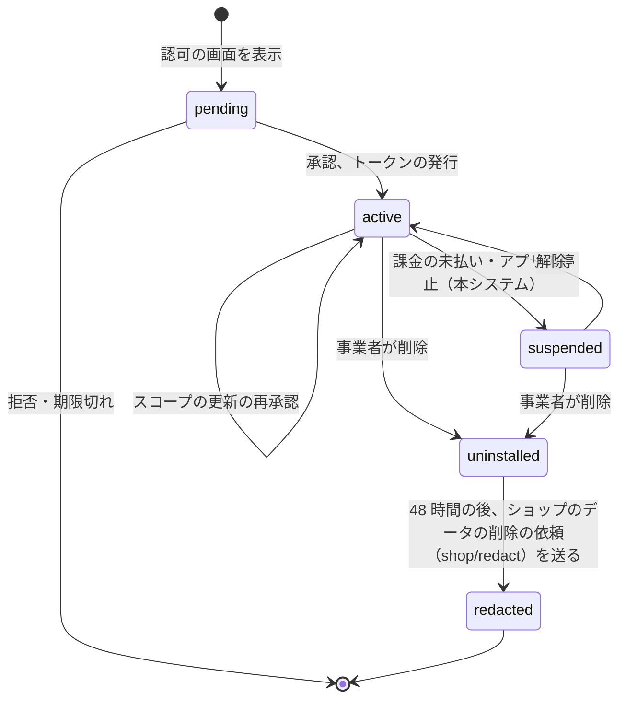
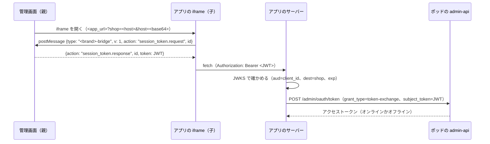
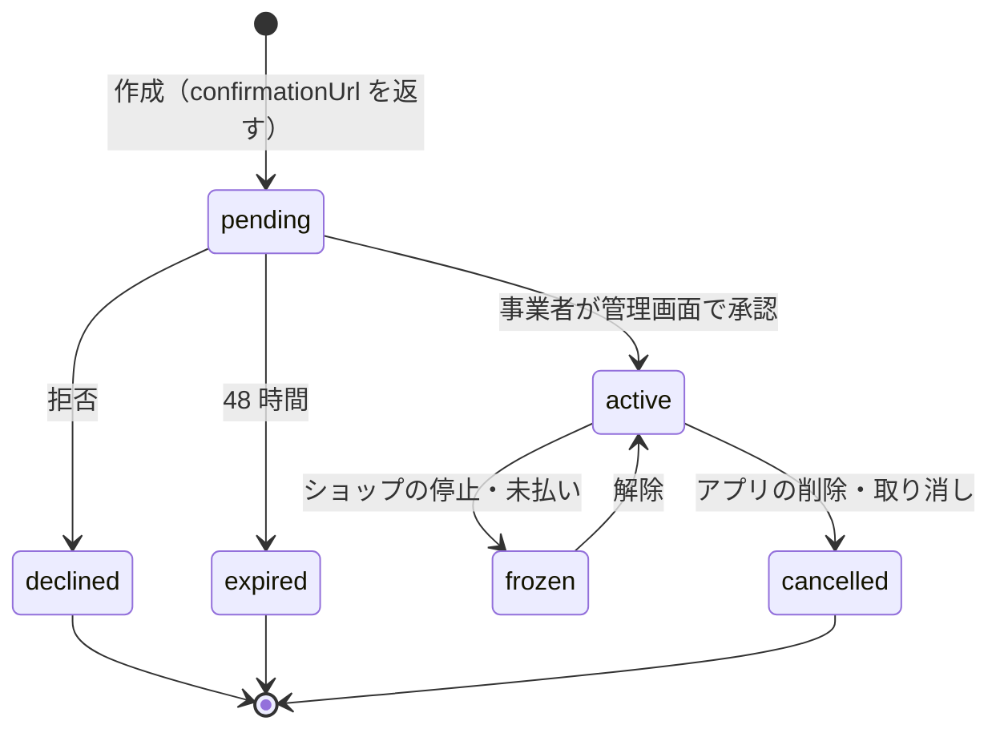

# App Platform and APIs: Shopify

アプリの登録、OAuth 2.0 による導入とトークン、スコープ、顧客の保護のデータ、Admin API（スキーマ、バージョン、費用の計算、エラー、一括の操作）、管理画面への埋め込みとセッションのトークン、アプリの課金と開発者への支払いを決める。

前提となる決定は、Admin API は GraphQL だけ・四半期のバージョン・費用のリーキーバケット・一括の操作（[ADR-0009](../decisions/0009-admin-api-graphql-and-cost-limits.md)）、`shop_id` はトークンから決めること（[ADR-0003](../decisions/0003-tenancy-and-rls.md)）、全体の面（`app-registry`）はショップのデータを持たないこと（[ADR-0002](../decisions/0002-pods-and-shop-placement.md)）、関数のモジュールの登録は `app-registry` が行うこと（[ADR-0008](../decisions/0008-extension-sandbox-wasm.md)）。要件は NFR-008（分離）、NFR-009（Admin API の速さと `THROTTLED`）、NFR-007（Admin API 月間 99.9%）。法務の確認待ちは L3（顧客のデータのアプリへの提供）、L5（アプリの課金の代金の受け渡し）、L9（Admin API の型の名前をどこまで似せてよいか）。この文書で決めたことは次の ADR にある。

| ADR | 決定 |
| --- | --- |
| [0054](../decisions/0054-oauth-install-and-expiring-tokens.md) | アプリの導入は OAuth 2.0 の認可コードの流れで行い、導入の要求と戻りに本システムが署名した JWT（ES256）を付ける。アクセストークン（`<brand>_at_`）は 1 時間で切れ、リフレッシュトークン（`<brand>_rt_`、90 日、使うたびに入れ替え、再利用で一式を取り消し）で更新する。トークンはポッドの DB にハッシュで置く。埋め込みのアプリは、セッションのトークン（ES256、60 秒）を RFC 8693 のトークンの交換でアクセストークンに替える |
| [0055](../decisions/0055-scopes-and-protected-customer-data.md) | スコープは `read_<資源>`・`write_<資源>` の形で、フィールドごとに要るスコープをスキーマの指示で持つ。顧客の個人のデータは、通常のスコープに加えて「保護のデータ」の段階（段階 1：買い手を識別する ID、段階 2：氏名・メール・電話・住所を項目ごとに）の承認を要し、公開のアプリは審査で理由を確かめる。承認のない項目は `null` と `ACCESS_DENIED` の注記で返し、Webhook の本文からも除く |
| [0056](../decisions/0056-admin-embedding-and-session-tokens.md) | 管理画面への埋め込みは iframe で行い、親（管理画面）と子（アプリ）の間は本システムの定めた `postMessage` の約束（`<brand>-bridge` v1）だけでつなぐ。子は親からセッションのトークンを受け、自分のサーバーへ渡す。Cookie に頼らない。アプリは `frame-ancestors` を管理画面のドメインに絞ることを審査で確かめる |
| [0057](../decisions/0057-app-billing.md) | アプリの課金（定額の購読、従量、1 回）は Admin API の課金のミューテーションで作り、事業者が管理画面で承認して有効にする。代金は本システムが事業者への月次の請求に載せて受け取り、開発者の取り分を台帳（`app_earnings`）に記録する。開発者への支払いの実行は、法務の L5 の確認まで自動にしない |

## 1. 範囲

- 扱う：
  - アプリの登録（開発者、アプリの定義、配る範囲）
  - 導入・更新・削除の流れ、OAuth 2.0、トークンの種類と寿命
  - スコープと、顧客の保護のデータ
  - Admin API のスキーマの区分、バージョン、費用の計算の細部、エラー、冪等、一括の操作
  - 管理画面への埋め込み、セッションのトークン、ブリッジ
  - アプリの課金と開発者の取り分
  - アプリの審査（公開のアプリ）
- 扱わない：
  - Webhook（[webhooks.md](webhooks.md)）
  - 関数（[functions-sandbox.md](functions-sandbox.md)）
  - Storefront API（[storefront-api-and-caching.md](storefront-api-and-caching.md)）
  - スタッフの権限と管理画面の本体（`merchant-admin-and-staff.md`）
  - 秘密と鍵の管理の全体（`security.md`）

## 2. 本家の形（確かめたこと）

いずれも 2026-10-10 に確認。

| 項目 | 内容 | 出典 |
| --- | --- | --- |
| Admin API の上限 | 計算した費用のリーキーバケット。回復はプランごとに 1 秒 100（Standard）・200（Advanced）・1,000（Plus）・2,000（Commerce Components）。1 クエリの上限 1,000。スカラーと列挙 0、オブジェクト 1、コネクションは `first`・`last` で決まり、ミューテーション 10 | [GraphQL Admin API rate limits](https://shopify.dev/docs/apps/build/apis/graphql-admin/rate-limits) |
| 入力とページング | 配列の入力は 250 件まで。ページングは 25,000 件まで | [API usage limits](https://shopify.dev/docs/api/usage/limits) |

- 本家の OAuth の流れの細部（導入の要求の署名の形、トークンの寿命、トークンの交換）、保護の顧客のデータの段階の名前と中身、埋め込みのブリッジの形、課金の API の形は、この確認では公式の資料で見ていない（**未検証**）。本システムの設計は、本家の振る舞いを参考にするが、名前と形は独自にする（法務の確認待ち L9）。

## 3. 要件

| 要件 | 目標 | NFR・基準 |
| --- | --- | --- |
| Admin API の速さ | 費用 100 以下のクエリ p99 1 秒。ミューテーション p99 1.5 秒 | NFR-009 |
| 上限の超過 | 429 でなく `THROTTLED` のエラーと残りの量 | NFR-009 |
| 分離 | トークンのショップと URL のショップの一致、スコープの外のフィールドを返さない | NFR-008、[quality.md](../quality.md) の 2.2.1 節 G |
| 可用性 | Admin API 月間 99.9% | NFR-007 |
| 導入の速さ | 導入の要求からトークンの発行まで p95 2 秒（事業者の操作の時間を除く） | 本システムの目標 |
| 削除の効き | アプリの削除から、トークンが使えなくなるまで 5 秒以内 | 本システムの目標 |

## 4. アプリと導入

ADR-0054。

### 4.1 アプリの登録

- 開発者は開発者のアカウント（`identity` の利用者と別の組織）を作り、アプリを登録する。アプリは `app-registry`（全体の Aurora）に次を持つ：`client_id`、`client_secret` のハッシュ、Webhook の署名の秘密（KMS で包んだもの。[webhooks.md](webhooks.md)）、戻りの URL の一覧、求めるスコープ、保護のデータの段階、宣言の Webhook の購読、関数、アプリの埋め込み（[storefront-themes.md](storefront-themes.md) の 9 節）、課金の計画、配る範囲。
- **配る範囲**：`custom`（1 つのショップだけ。事業者が自分で作るか、開発者が招待の URL で配る。審査なし）と `public`（一覧に載る。審査あり）。
- アプリの定義の変更は「アプリのバージョン」（不変）として出し、導入したショップは最新のバージョンを使う。スコープを増やすバージョンは、事業者の再承認まで、増やしたスコープを効かせない。
- アプリの定義（ショップのデータでない）は、全体の `app-registry` から各ポッドへ読み出しの写し（`app_definitions_replica`）として配る。ポッドの `admin-api` はトークンの発行とスコープの判定にこの写しを使う。これは全体の面からポッドへの配りの経路 P5（[ADR-0002](../decisions/0002-pods-and-shop-placement.md)、[ADR-0010](../decisions/0010-shop-routing-hot-set-and-custom-domains.md)）である。

### 4.2 導入の流れ



- `redirect_uri` は登録した一覧と完全一致だけ。`state` はアプリが作り、戻りで確かめる。
- 認可コードは 1 回だけ・60 秒。2 回目の使用で、そのコードから出したトークンを全部取り消す。
- `client_secret` の確かめは、ポッドの写しのハッシュ（SHA-256。秘密は 256 ビットの乱数なので遅いハッシュは要らない）と定数時間で比べる。
- 導入の行（`app_installations`）はポッドの DB（ショップのデータ）にある。承認したスコープ、保護のデータの段階、承認したスタッフ、時刻を持つ。

### 4.3 トークン

| トークン | 形 | 寿命 | 置き場所 |
| --- | --- | --- | --- |
| アクセストークン（オフライン） | `<brand>_at_<base62 で 43 文字>` | 1 時間 | ポッドの DB にハッシュ。Valkey に 60 秒の写し |
| リフレッシュトークン | `<brand>_rt_<…>` | 90 日。使うたびに入れ替え | ポッドの DB にハッシュと一式の ID |
| アクセストークン（オンライン：スタッフごと） | `<brand>_at_<…>` | 1 時間、スタッフのセッションの終わりで失効 | 同上。スタッフの権限と交わりで効く |
| セッションのトークン（埋め込み） | JWT（ES256） | 60 秒 | 持たない（署名だけ） |

- 要求の `X-<Brand>-Access-Token` のハッシュで導入の行を引き、`shop_id` を決める。URL のショップと違えば 401（[ADR-0003](../decisions/0003-tenancy-and-rls.md)）。
- リフレッシュトークンの再利用（一度入れ替えた古いものの使用）は、盗難の印として、一式（同じ導入のアクセストークンとリフレッシュトークンの全部）を取り消し、開発者に知らせる。
- オンラインのトークンの効く範囲は、アプリのスコープとスタッフの権限の交わり（`merchant-admin-and-staff.md` の権限の表）。
- 秘密の漏れの検出（公開のリポジトリの走査の通報）を受ける口を持ち、通報されたトークンを取り消す（`security.md`）。

### 4.4 導入の状態



- **削除**：1 つのトランザクションで、導入の行を `uninstalled` にし、トークンを全部取り消し、ショップごとの購読を消し、関数を外し、アプリの埋め込みを無効にし、outbox に `app/uninstalled` を書く。Valkey のトークンの写しを消す（5 秒以内の効き）。
- アプリの名前空間のメタフィールド（[catalog-and-pricing.md](catalog-and-pricing.md) の 7 節）は 30 日残し、再導入で戻る。30 日の後に消す。
- 削除の後にアプリが持つ買い手のデータの扱い（アプリの開発者の義務、削除の依頼の Webhook の法的な位置づけ）は法務の確認待ち（L3）。

## 5. Admin API

### 5.1 入口とスキーマ

- 入口：`POST https://<shop-host>/admin/api/<YYYY-MM>/graphql.json`（[ADR-0009](../decisions/0009-admin-api-graphql-and-cost-limits.md)）。
- スキーマの区分と持ち主のパッケージ：

| 区分 | 主な型 | 持ち主 |
| --- | --- | --- |
| カタログ | `Product`、`ProductVariant`、`Collection`、`Media`、`Metafield`、`Market` | [catalog-and-pricing.md](catalog-and-pricing.md) |
| 在庫 | `InventoryItem`、`InventoryLevel`、`Location` | [inventory-and-reservations.md](inventory-and-reservations.md) |
| 注文 | `Order`、`FulfillmentOrder`、`Fulfillment`、`Refund`、`Return` | [orders-and-fulfillment.md](orders-and-fulfillment.md)、[returns-and-refunds.md](returns-and-refunds.md) |
| 顧客 | `Customer`（保護のデータ） | この文書の 6 節 |
| 割引 | `Discount`、`DiscountCode` | [discounts-engine.md](discounts-engine.md) |
| 税と文書 | `TaxDocument`、`ShopTaxSettings` | [taxes-and-invoices.md](taxes-and-invoices.md) |
| テーマ | `Theme`、`ThemeFile` | [storefront-themes.md](storefront-themes.md) |
| アプリ | `AppInstallation`、`AppSubscription`、`WebhookSubscription`、`BulkOperation`、`FunctionConfiguration` | この文書、[webhooks.md](webhooks.md)、[functions-sandbox.md](functions-sandbox.md) |

- 型の名前は、本家に寄せるかどうかを法務の確認待ち（L9）とし、`admin-graphql-schema` の Story でスキーマの確定を確認の後にする。
- バージョンの間の違いはスキーマの変換の層で吸収し、各バージョンの SDL を固定して契約の試験で比べる（[ADR-0009](../decisions/0009-admin-api-graphql-and-cost-limits.md)）。

### 5.2 スコープ

ADR-0055。

| スコープ | 範囲 |
| --- | --- |
| `read_products`・`write_products` | 商品、バリエーション、コレクション、メディア、公開の行 |
| `read_inventory`・`write_inventory` | 在庫の数、拠点 |
| `read_orders`・`write_orders` | 注文（買い手の個人のデータの項目は 6 節） |
| `read_all_orders` | 60 日より古い注文（既定は直近 60 日だけ読める） |
| `read_fulfillments`・`write_fulfillments` | 配送の指示、配送 |
| `read_customers`・`write_customers` | 顧客（個人のデータの項目は 6 節） |
| `read_discounts`・`write_discounts` | 割引 |
| `read_themes`・`write_themes` | テーマ |
| `read_markets`・`write_markets` | マーケット、価格 |
| `read_metaobjects`・`write_metaobjects` | メタフィールドの定義 |
| `write_functions` | 関数の設定 |
| `read_tax_documents` | 税の文書 |

- スキーマのフィールドに `@requiresScope(any: [...])` と `@protectedData(field: EMAIL)` の指示を書き、実行の前の検証で、選択したフィールドの全部を確かめる。足りなければ、実行せずに `ACCESS_DENIED`（足りないスコープの名前つき）を返す。保護のデータの不足は 6 節の扱い。
- `write_*` は `read_*` を含む。
- スキーマの全フィールドに `@requiresScope` があることを lint で確かめる（指示の抜けは CI の失敗）。

### 5.3 費用の計算

[ADR-0009](../decisions/0009-admin-api-graphql-and-cost-limits.md) の規則を、次のとおり細かく決める。

| 選択 | 見積もりの費用 |
| --- | --- |
| スカラー・列挙 | 0 |
| オブジェクト | 1 |
| インターフェース・ユニオン | 選んだ型の費用の最大 |
| コネクション | `2 + n × (子の選択の費用)`。`n` は `first`・`last`（250 まで）。どちらもなければエラー |
| `nodes`・`edges.node` | 子の選択の費用（`edges` と `node` の両方を選んでも 1 回だけ数える） |
| `pageInfo` | 0 |
| ミューテーション | 10 ＋ 返す選択の費用 |
| 手で付けた費用 | スキーマの `@cost(weight: n)`（例：`Order.risk` 5、`Product.resourcePublications` 2） |

- **実際の費用**：実行の後、コネクションの `n` を実際に返した件数に置き換えて数え直す。差をバケットに返す。
- 例：

```graphql
query {
  products(first: 50) {                      # 2 + 50 × 子
    nodes {
      id title                               # 商品のオブジェクト 1
      variants(first: 20) {                  # 2 + 20 × 子
        nodes { id price inventoryItem { id } }   # バリエーション 1 + inventoryItem 1 = 2
      }
      featuredMedia { id }                   # 1
    }
  }
}
```

子（商品 1 件）の費用 = `1 + (2 + 20 × 2) + 1 = 44`。全体 = `2 + 50 × 44 = 2,202`。1,000 を超えるので、実行せずに `MAX_COST_EXCEEDED`（見積もり 2,202 を返す）。`products(first: 20)` にすれば `2 + 20 × 44 = 882` で通る。実際に商品が 12 件・平均 5 バリエーションなら、実際の費用は `2 + 12 × (1 + (2 + 5 × 2) + 1) = 2 + 12 × 14 = 170`。バケットから 882 を先に引き、`882 − 170 = 712` を返す。

- 応答の `extensions.cost` の例：

```json
{ "requestedQueryCost": 882, "actualQueryCost": 170,
  "throttleStatus": { "maximumAvailable": 1000, "currentlyAvailable": 830, "restoreRate": 100 } }
```

### 5.4 エラーと冪等

| 形 | 使う場面 |
| --- | --- |
| `errors[]`（GraphQL の最上位） | 構文・検証の失敗、`MAX_COST_EXCEEDED`、`THROTTLED`、`ACCESS_DENIED`、`INTERNAL`。`extensions.code` に名前 |
| `userErrors[]`（ミューテーションの結果） | 入力の検証、業務の規則の違反（`field` の道と `code`） |
| HTTP | 401（トークン）、402（ショップの停止）、403（アプリの停止）、503（ショップの移し替えの停止の間。`Retry-After: 5`）、5xx |

- ミューテーションは `Idempotency-Key` のヘッダーを受け、24 時間、同じ鍵と同じ本文のハッシュに同じ結果を返す（本文が違えば `IDEMPOTENCY_CONFLICT`）。鍵は（導入、鍵）で持つ。
- ショップの移し替えの停止の間（[ADR-0002](../decisions/0002-pods-and-shop-placement.md)）のミューテーションは 503 と `Retry-After: 5`。

### 5.5 一括の操作

- 読み出し：`bulkOperationRunQuery(query)` は、費用の上限を外したクエリ（コネクションの入れ子 2 段まで、`first` は無視）を受け、ワーカーが読み出しの写しでページを辿り、JSONL（子の行は `__parentId` を持つ）を S3（`shops/<shop_id>/bulk/<id>.jsonl`）に書く。期限 7 日の署名つきの URL。完了で `bulk_operations/finish` の Webhook。
- 書き込み：`stagedUploadsCreate` で JSONL（100 MB まで）を上げ、`bulkOperationRunMutation(mutation, path)` で 1 行ずつ同じミューテーションを実行する。結果を JSONL で返す。行ごとのトランザクション。
- 同時に 1 つ（アプリとショップの組ごとに読み出し 1・書き込み 1）。バケットの費用は使わないが、ショップのジョブの公平なキューで速さを絞る（[ADR-0003](../decisions/0003-tenancy-and-rls.md)）。
- 状態：`created` → `running` → `completed`・`failed`・`canceled`。24 時間で止める（`failed: TIMEOUT`）。

## 6. 顧客の保護のデータ

ADR-0055。

| 段階 | 読めるもの | 要るもの |
| --- | --- | --- |
| 0 | 顧客と注文の ID、注文の金額と行、配送の都道府県 | 通常のスコープ |
| 1 | 段階 0 ＋ 顧客のタグ、注文の数、会員の区分 | 段階 1 の申請（理由）、事業者の承認 |
| 2 | 段階 1 ＋ 項目ごと：`NAME`、`EMAIL`、`PHONE`、`ADDRESS` | 項目ごとの申請（理由）、公開のアプリは審査、事業者の承認 |

- 承認のない項目は、フィールドを選んでも `null` を返し、`extensions.redactedFields` に道を出す（エラーで全体を止めない。アプリの古いクエリが壊れないように）。
- Webhook の本文も同じ判定で項目を除く（[webhooks.md](webhooks.md) の 5 節）。関数の入力も同じ（[functions-sandbox.md](functions-sandbox.md) の 4 節）。
- 段階 2 のアプリは、データの保持の期間・削除の依頼への対応・暗号化を開発者が宣言し、審査で確かめる。
- 本システムの位置づけ（事業者からの委託か）、アプリへの提供が第三者提供か委託か、外国にあるアプリの開発者への提供の扱い、宣言と審査で足りるかは法務の確認待ち（L3）。確認まで、段階 2 の公開のアプリの審査を通さない運用にできるよう、段階 2 の承認を `release.protected-data-level2` の裏に置く。

## 7. 管理画面への埋め込み

ADR-0056。



- **セッションのトークン**（JWT、ES256、本システムの鍵）の中身：`iss`（`https://<shop-host>/admin`）、`dest`（`https://<shop-host>`）、`aud`（`client_id`）、`sub`（スタッフの ID）、`exp`（60 秒）、`nbf`、`iat`、`jti`、`sid`（スタッフのセッション）。公開鍵は `https://<brand>.<domain>/.well-known/jwks.json`（鍵は 90 日で入れ替え、2 つを同時に載せる）。
- **ブリッジ**（`<brand>-bridge` v1）の操作：`session_token.request`、`navigate`（管理画面の URL を変える）、`toast`、`modal.open`・`modal.close`、`resource_picker.open`（商品・コレクションを選ぶ。結果は ID だけ）、`title_bar.set`、`loading`。親は `event.origin` を、アプリの登録の URL の起点と比べ、違えば無視する。子への返事は登録の起点だけを `targetOrigin` にする。
- アプリは Cookie に頼らない（サードパーティの Cookie の制限）。
- iframe の `sandbox` は `allow-scripts allow-forms allow-same-origin allow-popups allow-downloads`。`allow-top-navigation` を与えない（親の画面を奪わせない）。
- 管理画面の CSP の `frame-src` は、導入したアプリの起点の一覧から作る。

## 8. アプリの課金

ADR-0057。

| 種類 | 作り方 | 請求 |
| --- | --- | --- |
| 定額の購読 | `appSubscriptionCreate(name, price, interval: EVERY_30_DAYS, trialDays, returnUrl)` | 30 日ごと。日割りなし（変更は次の期間から） |
| 従量 | 購読に `usageCap`（期間の上限の額）を付け、`appUsageRecordCreate(amount, description, idempotencyKey)` で記録 | 期間の終わりに合計。上限を超える記録は拒む |
| 1 回 | `appPurchaseOneTimeCreate(name, price, returnUrl)` | 承認の時 |



- 金額は JPY の整数（税込みか税抜きかは、本システムの請求の税の扱いと合わせて法務の確認待ち L4）。
- 承認は `apps_billing` の権限を持つスタッフだけ。承認の画面は本システムの画面で、アプリが文言を変えられない。
- 代金は、本システムの事業者への月次の請求（プランの料金と同じ請求）に載せて受け取る（請求の仕組みは `merchant-admin-and-staff.md`）。
- 開発者の取り分（本システムの手数料を引いた額）を `app_earnings` の台帳（全体の Aurora、ショップの ID と額だけ。ショップの商品・顧客のデータでない）に記録する。本システムが代金を受け取って開発者に渡すことの法的な位置づけ（収納代行か資金移動業か）は法務の確認待ち（L5）。確認まで、支払いの実行は自動にせず、月次の台帳の締めだけを行う。
- 課金のデータは、ポッドの購読の行（ショップのデータ）と、全体の請求の集計（P3：各ポッドが SNS に出した利用量を全体で集める。[ADR-0002](../decisions/0002-pods-and-shop-placement.md)）に分かれる。

## 9. 審査（公開のアプリ）

- 審査の項目：スコープの最小（使わないスコープの申請を拒む）、保護のデータの理由、`frame-ancestors`、Webhook の受け口の署名の確かめ（試験の送りで不正な署名を拒むか）、削除の依頼の Webhook の受け口、アプリの埋め込みの送信先と目的の宣言（[storefront-themes.md](storefront-themes.md) の 9 節。法務の L6）、課金の表示。
- 審査はスタッフ（人）が行い、エージェントは確かめの一覧の草案を作る。

## 10. 失敗のしかた

| 事象 | 振る舞い |
| --- | --- |
| Valkey（費用のバケット・トークンの写し）の障害 | バケットは局所のバケットに落ちる（[ADR-0009](../decisions/0009-admin-api-graphql-and-cost-limits.md)）。トークンは DB で引く（遅くなる） |
| `app-registry` の障害 | 新しい導入とアプリの更新ができない。導入済みのアプリの Admin API はポッドの写しで続く |
| アプリの定義の写しの遅れ | スコープを減らした更新が遅れて効く。減らす変更は同期の経路で配り、配りの完了まで新しいバージョンを出さない |
| JWKS の鍵の入れ替えの誤り | 2 つの鍵を同時に載せ、古い鍵を 7 日残す |
| 一括の操作の途中の障害 | 読み出しは印から再開。書き込みは行ごとの結果から、未処理の行だけを続ける |
| 課金の承認の画面の離脱 | `pending` のまま 48 時間で `expired` |

## 11. 上限

| 対象 | 上限 |
| --- | --- |
| 1 クエリの費用 | 1,000（[ADR-0009](../decisions/0009-admin-api-graphql-and-cost-limits.md)） |
| バケット | プランごと（ADR-0009 の表） |
| 同時実行 | アプリとショップの組ごとに 10 |
| 配列の入力 | 250 |
| ページングの深さ | 25,000 件（それ以上は一括の操作） |
| クエリの文字 | 50 KB、入れ子の深さ 15 |
| 一括の操作 | 組ごとに読み出し 1・書き込み 1、24 時間、書き込みの JSONL 100 MB |
| アプリの数 | 1 ショップ 100 |
| 戻りの URL | 1 アプリ 10 |

## 12. data-model への項目

| 表 | 中身 | 節 |
| --- | --- | --- |
| `developer_orgs`、`apps`、`app_versions`（全体） | 開発者、アプリ（`client_id`、`client_secret_hash`、`webhook_secret_ciphertext[2]`、配る範囲）、不変のバージョン（スコープ、保護のデータ、宣言の購読、関数、埋め込み、課金の計画） | 4.1 |
| `app_definitions_replica`（ポッド、RLS の外の読み出しの写し） | トークンの発行とスコープの判定に要る列だけ | 4.1 |
| `app_installations`（ポッド） | `(shop_id, app_id)`、`state`、`app_version_id`、`scopes`、`protected_data`、`approved_by`、`installed_at`、`uninstalled_at` | 4.2、4.4 |
| `app_tokens`（ポッド） | `(shop_id, id)`、`installation_id`、`kind`、`token_hash`、`family_id`、`staff_id`、`expires_at`、`rotated_from`、`revoked_at` | 4.3 |
| `oauth_codes`（ポッド） | `(shop_id, code_hash)`、`installation_id`、`expires_at`、`used_at` | 4.2 |
| `api_idempotency`（ポッド） | `(shop_id, installation_id, key)`、`request_hash`、`response`、`expires_at` | 5.4 |
| `bulk_operations`（ポッド） | `(shop_id, id)`、`installation_id`、`kind`、`state`、`query`、`s3_key`、`row_count`、`error` | 5.5 |
| `app_subscriptions`・`app_usage_records`・`app_one_time_purchases`（ポッド） | 課金の行 | 8 |
| `app_earnings`（全体） | `(developer_org_id, period, shop_id, app_id)`、`gross`、`fee`、`net`、`state` | 8 |
| Valkey | `{<shop_id>}:tok:<hash>`（60 秒）、`{<shop_id>}:cost:<app_id>`（バケット） | 4.3、5.3 |

## 13. テストと性質

- **PROP-APP-001（費用の見積もり）**：任意のクエリで、見積もりが実際の費用以上。1,000 を超える見積もりは実行されない（[ADR-0009](../decisions/0009-admin-api-graphql-and-cost-limits.md)、[quality.md](../quality.md) の 2.2.1 節 K）。
- **PROP-APP-002（スコープ）**：任意のクエリとスコープの組で、スコープの外のフィールドの値が応答に出ない。保護のデータの未承認の項目は `null`。
- **PROP-APP-003（トークンの一式）**：任意の更新・再利用・削除の列で、取り消した一式のトークンが使えず、再利用の後は一式の全部が使えない。
- **PROP-APP-004（ショップの一致）**：任意のトークンと URL の組で、トークンのショップと URL のショップが違えば 401。グローバル ID で他のショップの行を引けない。
- **DT-APP-001**：導入の状態 × 事象（承認、削除、停止、スコープの更新）の表。
- **DT-APP-002**：課金の状態 × 事象の表。
- 契約の試験：バージョンごとの SDL の写しの比べ。`@requiresScope` の抜けの lint。
- 結合：OAuth の誤り（`redirect_uri` の不一致、コードの再利用、期限切れ）、ブリッジの `origin` の確かめ、削除の 5 秒の効き。

## 14. Story の候補

| Epic | Story | 中身 |
| --- | --- | --- |
| E14 | `app-registration` | 4.1 節、審査（9 節） |
| E14 | `oauth-and-scopes` | 4.2〜4.4・5.2・6 節（ADR-0054・0055。PROP-APP-002〜004、DT-APP-001）。保護のデータは法務：L3 |
| E14 | `admin-graphql-schema` | 5.1・5.4 節。スキーマの確定は法務：L9 |
| E14 | `graphql-cost-and-buckets` | 5.3 節（PROP-APP-001） |
| E14 | `bulk-operations` | 5.5 節 |
| E14 | `admin-embedding` | 7 節（ADR-0056） |
| E14 | `app-billing` | 8 節（ADR-0057。DT-APP-002）。支払いは法務：L5 |

## 15. 未解決の問い

### 決定（2026-10-10、既定案）

- **トークン**：1 時間のアクセストークンと、入れ替えるリフレッシュトークン（ADR-0054）。
- **導入の署名**：本システムの鍵の JWT（ES256）。アプリの秘密での HMAC にしない（ADR-0054）。
- **保護のデータ**：2 段階、項目ごと、未承認は `null`（ADR-0055）。
- **埋め込み**：iframe と自前のブリッジ、セッションのトークンの交換（ADR-0056）。
- **課金**：本システムの請求に載せる、支払いは L5 まで手で（ADR-0057）。
- **古い注文**：既定で直近 60 日、`read_all_orders` で全部。

### 持ち越し

| 問い | いつ・どう決めるか |
| --- | --- |
| 顧客のデータのアプリへの提供の扱い、段階 2 の公開のアプリ | **法務の確認待ち：L3** |
| 代金の受け渡しと開発者への支払い | **法務の確認待ち：L5** |
| Admin API の型の名前 | **法務の確認待ち：L9** |
| アプリの課金の税の扱い | **法務の確認待ち：L4** |
| 本家の OAuth・保護のデータ・ブリッジ・課金の形 | 公式の資料で確かめられなかった（**未検証**のまま） |

## 出典

いずれも 2026-10-10 に確認。

- Shopify Dev, [GraphQL Admin API rate limits](https://shopify.dev/docs/apps/build/apis/graphql-admin/rate-limits)、[API usage limits](https://shopify.dev/docs/api/usage/limits)
- IETF, [RFC 6749](https://www.rfc-editor.org/rfc/rfc6749)（OAuth 2.0）、[RFC 8693](https://www.rfc-editor.org/rfc/rfc8693)（トークンの交換）、[RFC 7519](https://www.rfc-editor.org/rfc/rfc7519)（JWT）、[RFC 9700](https://www.rfc-editor.org/rfc/rfc9700)（OAuth 2.0 の安全の最新の実践。リフレッシュトークンの入れ替え）
