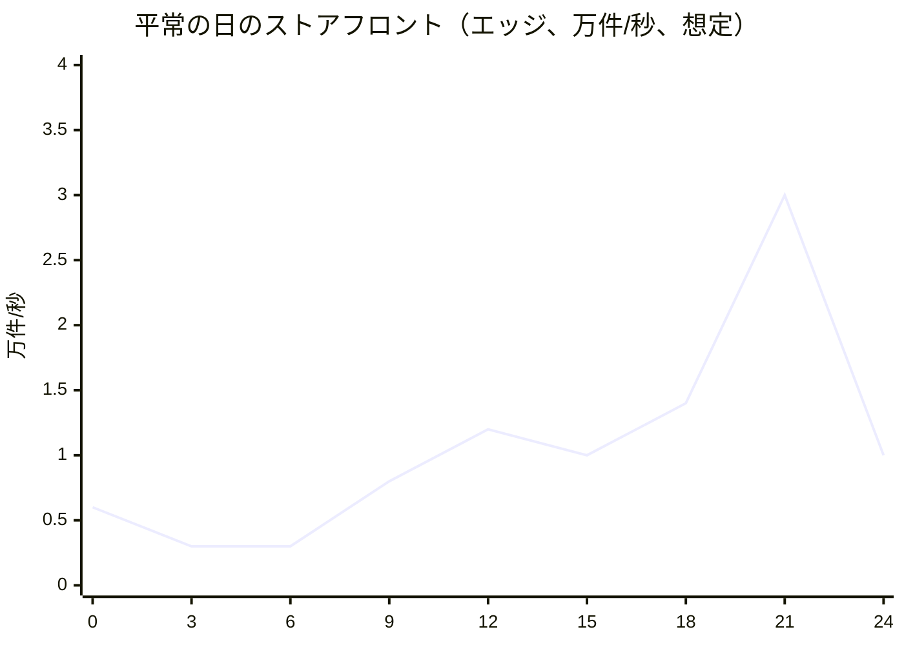

# Capacity: Shopify

負荷のモデル（ストアフロント、チェックアウト、1 ショップのフラッシュセールの急増、年末の商戦のような全体の山、Admin API、Webhook）、部品ごとの必要量、ポッドの大きさの段（S1・S2・S3）、予定したセールの前もっての拡大、月の費用、負荷試験、キャパシティの運用を決める。単位あたりの原価は [infrastructure.md](infrastructure.md) の 9 節にある。

| ADR | 決定 |
| --- | --- |
| [0074](../decisions/0074-pod-size-tiers-and-pre-scaling.md) | ポッドの大きさを段（`p-min`・`p-std`・`x-min`・`x-std`・`x-large`、S3 の `d-xl`）で持ち、Terraform の変数で切り替える。共有のポッドは 2 AZ でピークを受けられる最小の数と、CPU の自動の拡大で動かす。隔離のポッドは、セールの登録から段を決め、4 日前に Aurora を上げ（ショップを移す前）、開始の 60 分前に ECS の最小の数を予定の拡大で上げる。急増は自動の拡大を待たず、ショップの同時実行の上限と待合室で受ける |

数値は本システムの想定で、「初期見積もり」は E18 の負荷試験と PoC（`inventory-hot-row-poc`、`shop-move-poc`、`theme-renderer-poc`、`wasm-function-poc`）の前の仮の値である。単価は AWS の公開の価格（出典）で、為替は 1 USD = 150 円（本システムの想定）。

## 1. 負荷のモデル（S1）

### 1.1 量

[architecture/README.md](README.md) の 2 節の S1 の値と、ここで置いた想定。

| 項目 | 平均 | 平常の日の山 | 全体の最大 | 根拠 |
| --- | --- | --- | --- | --- |
| ストアフロント（エッジ） | 1 万件/秒 | 3 万件/秒 | 10 万件/秒 | README の 2 節 |
| ストアフロント（元、当たり 90%） | 1,000 件/秒 | 3,000 件/秒 | 1 万件/秒 | 同上 |
| 注文 | 0.38 件/秒（月 100 万） | 1.2 件/秒（21 時台） | 200 件/秒（フラッシュセール） | 平常の山は平均の 3 倍（本システムの想定） |
| チェックアウトの段の要求 | 4 件/秒 | 12 件/秒 | 2,000 件/秒 | 注文 1 件に 10 件（README の 2 節） |
| Admin API | 500 件/秒 | 1,500 件/秒 | 5,000 件/秒 | README の 2 節。平均は本システムの想定 |
| Webhook の配信 | 50 件/秒 | 200 件/秒 | 2,000 件/秒 | 注文 1 件に 15（5 つの話題 × 平均 3 アプリ）と、商品・在庫の更新（本システムの想定） |
| 待合室の状態の問い | — | — | 2 万件/秒（エッジ、1 秒のキャッシュ） | 20 万人 ÷ 10 秒の間隔（[flash-sales-and-queueing.md](flash-sales-and-queueing.md) の 12 節） |

- ストアフロントの元の要求の内訳（想定）：HTML の描画 40%、島（在庫・価格・カート）40%、Storefront API 20%。
- 1 つの共有のポッド（1.25 万ショップ）の山：元 3,000 件/秒（全体の最大の 1/4 に、偏りの 1.2 倍）、注文 60 件/秒（予定にない急増の 1 ショップを含む）、Admin API 1,500 件/秒。

### 1.2 時刻の形

- **年末の商戦のような全体の山**：3 日の間、平常の日の山の 3 倍が続き、開始の 1 時間は 5 倍（ストアフロントの元 1.5 万件/秒、注文 6 件/秒の平常に、各ショップのセールが重なる）。本家の BFCM 2025 の売上の最大 1 分 510 万 USD、エッジの最大 1 分 4.89 億件（[BFCM 2025](https://www.shopify.com/news/bfcm-data-2025)、2026-10-10 に確認）を参考の形にしたが、本システムの規模の値は想定である。
- **1 ショップのフラッシュセール**：開始の 10 分前から 20 万人が待合室に着き、開始の時刻に集中する。在庫 3,000 を 30 秒で売り切る場合、注文 100 件/秒（S1 の 1 ショップの上限）。チェックアウトの段の要求は 1,000 件/秒、商品のページは許可証を持つ人だけ（受け入れ 100 人/秒 × 平均 5 ページ）。
- **予定にない急増**（テレビの紹介）：1 ショップのストアフロントが平常の 100 倍に数分で上がる。エッジのキャッシュが受け、チェックアウトの同時実行が上限の 80% を 30 秒続けると待合室が自動で有効になる（[ADR-0027](../decisions/0027-flash-sale-preparation-and-surge-auto-queue.md)）。

## 2. ストアフロント

| 部品 | 1 要求の費用（初期見積もり） | 共有のポッドの山（3,000 件/秒） |
| --- | --- | --- |
| `storefront-renderer`（HTML 1,200 件/秒） | CPU 25ms（`theme-renderer-poc` で測る） | 30 vCPU。使用率 60% で 50 vCPU |
| 島・`storefront-api`（1,800 件/秒） | CPU 5ms | 9 vCPU。60% で 15 vCPU |
| Aurora の読み出しの写し | 1 ページ 3〜5 の問い（先読みでまとめる。[ADR-0047](../decisions/0047-loom-data-access-and-prefetch.md)） | 6,000〜9,000 問い/秒 |

- エッジの当たりの割合が 90% を下回ると、元の負荷は比例して増える。80% で元 2 倍。ポッドの元のショップごとのトークンバケット（[shops-and-pods.md](shops-and-pods.md) の 11 節）が、`stale-if-error` で古いページを返して守る。

## 3. チェックアウトとフラッシュセール

| 部品 | 1 注文の費用（初期見積もり） | 1 ショップ 100 件/秒 |
| --- | --- | --- |
| `checkout`（10 要求） | CPU 合計 300ms（関数の呼び出しを含む） | 30 vCPU。60% で 50 vCPU |
| `function-runner` | 1 段 2 関数 × 3 段 × 2ms | 1.2 vCPU |
| Aurora の書き込み | 行の書き込み 25（チェックアウト、引き当て、注文と行、確定、割引の回数、outbox 3、監査、事象） | 2,500 行/秒、トランザクション 1,000/秒 |
| 在庫の枠 | 1 品目 32 枠 | 枠あたり 3 件/秒（[ADR-0004](../decisions/0004-inventory-reservation-model.md)） |
| `workers`（注文の後の作業、Webhook の本文、通知） | CPU 50ms | 5 vCPU |
| Valkey（カート、同時実行のセマフォ、作成のバケット） | 20 操作 | 2,000 操作/秒 |

- 隔離のポッドのチェックアウトの同時実行の上限 500（[ADR-0003](../decisions/0003-tenancy-and-rls.md)）は、送信から完了まで平均 5 秒（提供者の時間を含む）で 100 件/秒に当たる。
- 1 行の更新の上限と枠の数は `inventory-hot-row-poc` で確かめる。

## 4. ポッドの大きさ（S1）

ADR-0074。

### 4.1 段

| 段 | 用途 | Aurora（書き込み＋読み出し、I/O-Optimized） | Valkey | OpenSearch |
| --- | --- | --- | --- | --- |
| `p-min` | 見張りのポッド `p00`、staging | `db.r8g.large` × 2 | `cache.m7g.large` × 2 | `m7g.medium.search` × 3（専用のマスターなし） |
| `p-std` | 共有のポッド | `db.r8g.2xlarge` × 2 | `cache.r7g.large` × 2 | `r7g.large.search` × 3 ＋ マスター `m7g.medium.search` × 3 |
| `x-min` | 隔離のポッド（セールのない間） | `db.r8g.large` × 2 | `cache.r7g.large` × 2 | `p-std` と同じ |
| `x-std` | 隔離のポッド（1 ショップ 100 件/秒まで、S1） | `db.r8g.4xlarge` × 2 | `cache.r7g.xlarge` × 2 | 同上 |
| `x-large` | 隔離のポッド（同時のセール 2、S2 の 500 件/秒） | `db.r8g.8xlarge` × 2 | `cache.r7g.2xlarge` × 2 | 同上 |
| `d-xl` | 専用のポッド（S3 の 2,000 件/秒） | `db.r8g.16xlarge` × 2（**未検証**：1 つの書き込みで足りるか） | 2 シャード | 大きさはショップの商品の数 |

- 共有のポッドの容量（PU の材料。[shops-and-pods.md](shops-and-pods.md) の 4.2 節）：書き込み 400 万行/時（`db.r8g.2xlarge` の書き込みの CPU 50% の想定）、元の要求 15 万件/分、データ 400 GB。
- 監査の行（[ADR-0064](../decisions/0064-permissions-roles-and-audit-log.md)）で書き込みの量は 1 割増える見込みで、上の容量に含めた。
- 接続：タスクごとのプール 8（読み出しの写しは別に 8）。共有のポッドの書き込みへの接続は、最大のタスクの数で 600 前後に収める。

### 4.2 ECS（`p-std`、タスク 2 vCPU・4 GB、ARM64。`storefront-api` と `relay` は小さい型）

| サービス | 最小（2 AZ で平常の山） | 最大 | 拡大の指標 |
| --- | --- | --- | --- |
| `storefront-renderer` | 6 | 30 | CPU 60% |
| `storefront-api`（1 vCPU・2 GB） | 4 | 20 | CPU 60% |
| `checkout`（＋`function-runner` 0.5 vCPU・1 GB） | 4 | 20 | CPU 60%、同時実行 |
| `admin-api` | 4 | 20 | CPU 60% |
| `workers` | 3 | 20 | キューの最古の年齢 |
| `relay`（0.5 vCPU・1 GB） | 2 | 4 | outbox の最古の年齢 |

- 最小の数は、1 つの AZ を失っても平常の山を受けられる数。急増は自動の拡大（1〜3 分。**未検証**）を待たず、ショップごとの上限と待合室で受ける（[ADR-0074](../decisions/0074-pod-size-tiers-and-pre-scaling.md)）。

### 4.3 全体の面

| 部品 | S1 |
| --- | --- |
| 全体の Aurora | `db.r8g.xlarge` × 2（I/O-Optimized） |
| 全体の Valkey（待合室、セッション） | `cache.r7g.xlarge` × 2 シャード × 2 |
| `edge-router` | 3〜12 タスク（1 vCPU） |
| `waiting-room` | 3〜20 タスク |
| その他のサービス | 各 2〜6 タスク |

### 4.4 S2・S3（目安）

| 段階 | 共有のポッド | 隔離・専用 | 全体 | エッジ |
| --- | --- | --- | --- | --- |
| S2 | 36 × `p-std`（ポッドの組 4） | 隔離 4（`x-large` まで）、専用 0〜4 | 全体の Aurora `db.r8g.4xlarge`、読み出し 3 | 要求の上限の引き上げ（[infrastructure.md](infrastructure.md) の 3.3 節） |
| S3 | 280 × `p-std` | 隔離 10、専用 10（`d-xl`） | `shop-directory` の読み出しの写しをポッドの組ごと | 同上と、独自のドメインのマルチテナントの配信の分割 |

## 5. 隔離のポッドと前もっての拡大

ADR-0074。

| いつ | 作業 | 自動・手 |
| --- | --- | --- |
| 登録（7 日前まで） | 想定の来訪者・在庫・1 人あたりの上限から段を決める：受け入れ 100 人/秒以下なら `x-std`、同じ時間帯のセール 2 か 100 人/秒を超えるなら `x-large` | 自動（段の機械、[ADR-0027](../decisions/0027-flash-sale-preparation-and-surge-auto-queue.md)） |
| 4 日前 | Aurora を上げる：大きい型の読み出しを足し、追いついたらフェイルオーバーで書き込みにする（書き込みの停止 30 秒前後。ショップを移す前なので、隔離のポッドにセールのショップはいない）。Valkey のシャードの型を上げる（オンライン） | Ops の承認 |
| 3 日前 | ショップを移す（[shops-and-pods.md](shops-and-pods.md) の 7.3 節） | Ops の承認 |
| 60 分前 | ECS の予定の拡大：`checkout` 最小 30、`storefront-renderer` 最小 20、`storefront-api` 最小 20、`workers` 最小 10。`waiting-room` 最小 20 | 自動（予定の拡大の動作） |
| 開始 | 待合室の受け入れ（AIMD）。拡大は CPU で続く | 自動 |
| 終わり ＋ 2 時間 | ECS の最小を戻す | 自動 |
| ショップを戻した後 | `x-min` へ下げる（同じ手順の逆） | Ops |

- 共有のポッドで予定したセール（隔離のポッドへ移さない小さなセール：想定の来訪者 1 万人以下）は、60 分前の ECS の予定の拡大だけを行う。
- ALB は事前の暖機を頼まない（S1 の 2,000 件/秒は ALB の自動の拡大で受ける想定。容量の予約の機能の要否は**未検証**、E18 で確かめる）。
- CloudFront は事前の作業をしない。

## 6. 月の費用（S1、本番、初期見積もり）

単価は AWS Price List の公開の価格（ap-northeast-1、出典）。オンデマンド、730 時間。

| 項目 | 内訳 | 月（USD） |
| --- | --- | --- |
| 共有のポッド × 4 | Aurora `db.r8g.2xlarge` I/O-Optimized × 2（1.732/時）＋保存 2,556、Valkey `cache.r7g.large` × 2（0.2104/時）307、OpenSearch 704、Fargate 1,700（平均 39 vCPU・78 GB と山の分）、ALB・ログ・SQS 420 → 1 ポッド 約 5,700 | 22,800 |
| 隔離のポッド | `x-min` の月と `x-std` の 1/3 の月の平均 | 4,300 |
| 見張りのポッド | `p-min` | 1,500 |
| 全体の面 | Aurora `db.r8g.xlarge` × 2（0.866/時）1,264、Valkey 1,224、Fargate 1,100、egress・その他 1,700 | 5,300 |
| エッジ：CloudFront の要求 | 2.63 × 10^10 件 × 0.012 USD/1 万 | 31,600 |
| エッジ：転送 | 1 要求 40 KB（想定）→ 約 98 万 GB、段階の単価（0.114〜0.080 USD/GB） | 80,900 |
| エッジ：関数と KeyValueStore | 関数 0.10 USD/100 万、読み出し 0.03 USD/100 万 | 3,400 |
| エッジ：WAF | 要求 0.60 USD/100 万で 15,800、Bot Control（要求の 5%、1 USD/100 万）1,300、web ACL と規則 100 | 17,200 |
| 可観測性 | CloudWatch Logs、AMP、Grafana（**未検証**） | 8,000 |
| S3（メディア 50 TB ほか） | Standard 0.025 USD/GB | 1,800 |
| 大阪（DR） | Aurora の二次 7 クラスタ × `db.r8g.large`（0.433/時）2,200、S3 の写しと転送 1,700、その他 300 | 4,200 |
| ネットワーク（Transit Gateway、Network Firewall、NAT、エンドポイント） | **未検証** | 3,000 |
| その他（KMS、Secrets Manager、AppConfig、SES、SQS・SNS） | — | 2,500 |
| 合計 | | 約 18.7 万（約 2,800 万円）、±40% |

- 最も大きいのはエッジの転送（43%）と要求（17%）と WAF（9%）。ポッドは 15%。
- 下げる手段：画像の形式と大きさ（AVIF・WebP、表示の幅に合わせた変換）、Savings Plans（Fargate）とリザーブド（Aurora）、CloudFront の大口の価格（**未検証**）。
- 本家の原価は確かめていない（**未検証**）。

## 7. キャパシティの運用

| 見るもの | 頻度 | 持ち主 |
| --- | --- | --- |
| ポッドの使用率（PU）と偏り（[ADR-0011](../decisions/0011-shop-placement-and-rebalancing.md)） | 週次 | Ops |
| 段階を上げる 6 指標（[infrastructure.md](infrastructure.md) の 8 節） | 月次 | Ops、PM |
| 予定したセールの一覧と隔離のポッドの段 | 週次 | Ops |
| 費用（注文あたり、ストアフロントの 100 万要求あたり、ポッドの使用率） | 月次 | Ops、PM（[runbooks/](../runbooks/README.md) の 6 節） |
| AWS の上限（配信、テナント、VPC origin、Fargate の vCPU、Aurora のクラスタ） | 月次。60% で引き上げを申請 | Ops |
| Admin API の見積もりの費用と DB の時間の相関（[ADR-0009](../decisions/0009-admin-api-graphql-and-cost-limits.md)） | 週次 | Dev |

## 8. 負荷試験

| 場面 | 規模（E18） | 合否 |
| --- | --- | --- |
| 平常の山 × 2 | エッジ 6 万件/秒、元 6,000 件/秒、Admin API 3,000 件/秒、Webhook 400 件/秒 | runbooks の SLO の全部 |
| 全体の最大 × 2 | エッジ 20 万件/秒（staging の配信、合成の負荷）、元 2 万件/秒 | 同上。ポッドの使用率 80% 以下 |
| フラッシュセール（[quality.md](../quality.md) の 2.2.1 節 H） | 待合室 20 万人、1 ショップ 100 件/秒、在庫 3,000・枠 32、ボット 20% | 売り越し 0、重複 0、NFR-001 |
| 同時のセール | 隔離のポッドに 2 ショップ、各 100 件/秒（`x-large`） | 同上 |
| うるさい隣人 | 共有のポッドの 1 ショップに割り当ての 10 倍、他の 1,000 ショップに平常 | 他のショップの NFR-001・NFR-003（NFR-008） |
| 年末の商戦 | 平常の山 × 5 を 1 時間、× 3 を 8 時間 | SLO、費用の記録 |
| 移し替えの下の負荷 | 書き込み 100 件/秒のショップを移す | 停止 10 秒以内、不一致 0（NFR-015） |

- 環境：staging のポッドの組を `p-std`・`x-std` の大きさに一時に広げる。負荷の生成は東京の別のアカウント（canary）と、日本の外の地点を使わない（エッジの地点の分布を日本の買い手に合わせる）。
- CloudFront と WAF への大きな合成の負荷の事前の届け出の要否は**未検証**（AWS の方針を E18 の前に確かめる）。
- 本番での負荷試験はしない。本番の山は、見張りと実ユーザーの計測で見る。

## 9. Story の候補

| Epic | Story | 中身 |
| --- | --- | --- |
| E1 | `pod-terraform-module` | 4.1 節の段の変数（ADR-0074） |
| E5 | `load-generator` | 1 節の負荷のモデルと 8 節の場面 |
| E13 | `flash-sale-prescaling` | 5 節（ADR-0074） |
| E18 | `load-tests` | 8 節 |
| E18 | `cost-baseline` | 6 節を請求の実績で置き換える |

## 10. 未解決の問い

### 決定（2026-10-10、既定案）

- **段**：`p-min`・`p-std`・`x-min`・`x-std`・`x-large`・`d-xl`（ADR-0074）。
- **前もっての拡大**：Aurora は 4 日前（移す前）、ECS は 60 分前の予定の拡大（ADR-0074）。
- **急増**：自動の拡大を待たず、上限と待合室で受ける（ADR-0074）。
- **費用**：S1 は月 約 18.7 万 USD、最大はエッジの転送。

### 持ち越し

| 問い | いつ・どう決めるか |
| --- | --- |
| 1 要求・1 注文の CPU と DB の費用 | `theme-renderer-poc`、`wasm-function-poc`、`inventory-hot-row-poc`、E18 |
| `d-xl`（1 ショップ 2,000 件/秒）を 1 つの Aurora の書き込みで受けられるか | S3 の前の PoC（**未検証**） |
| Fargate の自動の拡大の速さ、ALB の容量の予約の要否 | E18（**未検証**） |
| 大きな合成の負荷の届け出 | E18 の前（**未検証**） |
| 可観測性・ネットワークの費用 | E1 の後の実績（**未検証**） |
| [search-and-recommendations.md](search-and-recommendations.md) の主のシャード 12（1 シャード 0.5 GB ほどで、1 シャード 10〜30 GB の目安より小さい） | 主のシャードを 3 にすることを勧める。search-and-recommendations の担当が決める |

## 11. data-model への項目

| 表・置き場所 | 中身 | 節 |
| --- | --- | --- |
| `pods`（全体）に足す列 | `size_tier`、段の変更の履歴 | 4.1、5 |
| `pod_scaling_plans`（全体） | セールごとの段、Aurora の上げ下げの予定と結果、ECS の予定の拡大 | 5 |
| `capacity_reviews`（全体） | 月次の 6 指標の値 | 7 |

## 出典

いずれも 2026-10-10 に取得・確認。

- AWS Price List の公開の価格（[Using the bulk API](https://docs.aws.amazon.com/awsaccountbilling/latest/aboutv2/using-the-aws-price-list-bulk-api.html)、ap-northeast-1）：
  - `AmazonRDS`（2026-10-06 の公開分）：Aurora PostgreSQL `db.r8g.large` 0.333・I/O-Optimized 0.433、`db.r8g.xlarge` 0.666・0.866、`db.r8g.2xlarge` 1.332・1.732、`db.r8g.4xlarge` 2.664・3.464、`db.r8g.8xlarge` 5.328・6.928 USD/時。保存 0.12 USD/GB・月（I/O-Optimized 0.27）、I/O 0.24 USD/100 万
  - `AmazonElastiCache`：Valkey `cache.m7g.large` 0.1616、`cache.r7g.large` 0.2104、`cache.r7g.xlarge` 0.4192、`cache.r7g.2xlarge` 0.8376 USD/時
  - `AmazonECS`：Fargate ARM の vCPU 0.04045、メモリー 0.00442 USD/GB・時
  - `AmazonES`：`m7g.medium.search` 0.087、`m7g.large.search` 0.175、`r7g.large.search` 0.214 USD/時、gp3 0.1464 USD/GB・月
  - `AmazonCloudFront`（2026-10-03 の公開分）：日本の HTTPS の要求 0.012 USD/1 万、日本の転送 最初の 10 TB 0.114・次の 40 TB 0.089・次の 100 TB 0.086・次の 350 TB 0.084・次の 524 TB 0.080・次の 4 PB 0.070 USD/GB、関数 0.10 USD/100 万（最初の 200 万は無料）、KeyValueStore の読み出し 0.03 USD/100 万、KeyValueStore の API 1 USD/1,000
  - `awswaf`：要求 0.60 USD/100 万、web ACL 5 USD/月、規則 1 USD/月、Bot Control の管理の規則 10 USD/月と 1 USD/100 万要求（標的型 10 USD/100 万）、チャレンジ 0.4 USD/100 万
- Shopify, [Shopify merchants generate record-breaking $14.6 billion in Black Friday Cyber Monday sales](https://www.shopify.com/news/bfcm-data-2025)（2025-12-02）
