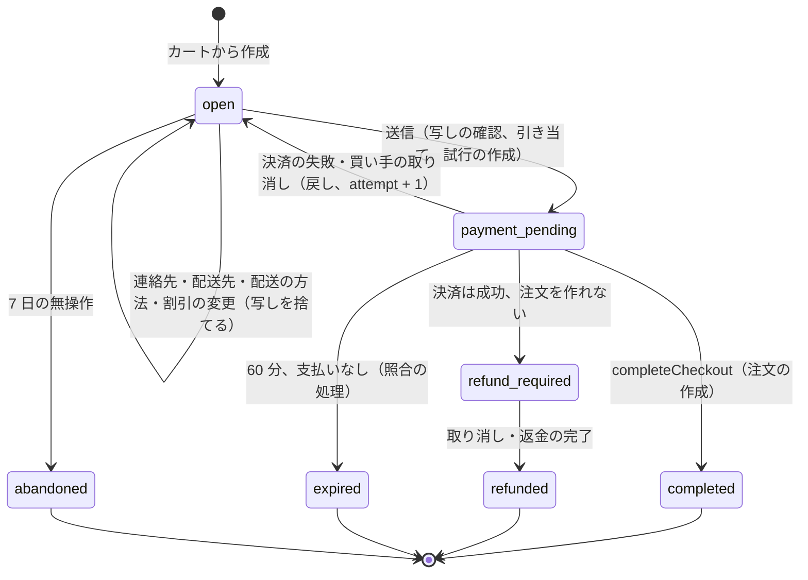
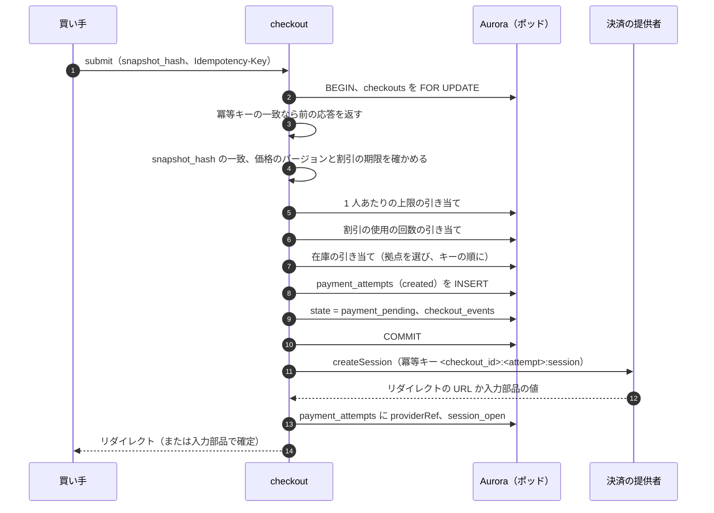

# Cart and Checkout: Shopify

カートとチェックアウトを決める。カートの置き場所、チェックアウトのステートマシンと段、送信と冪等、価格の写しと最終確認画面、`completeCheckout` と完了の決定表 DT-CHK-001、照合の処理、チェックアウトの入口の上限、配送先を扱う。

前提となる決定は次のとおり。

- チェックアウトは明示のステートマシン。送信で価格の写しを固定。注文の作成は `completeCheckout` の 1 つの関数・1 つのトランザクション。`orders.checkout_id` は一意。1 分ごとの照合（[ADR-0005](../decisions/0005-checkout-state-machine-and-exactly-once-orders.md)）
- 在庫は送信で引き当て、`completeCheckout` で確定（[ADR-0004](../decisions/0004-inventory-reservation-model.md)、[inventory-and-reservations.md](inventory-and-reservations.md)）
- 決済は提供者のアダプターと冪等キー `<checkout_id>:<attempt>:<op>`、Webhook の inbox（[ADR-0006](../decisions/0006-payments-via-providers.md)、[payments-integration.md](payments-integration.md)）
- 割引の計算は [discounts-engine.md](discounts-engine.md)、税は `taxes-and-invoices.md`、送料は [orders-and-fulfillment.md](orders-and-fulfillment.md) の 6 節、関数は `functions-sandbox.md`
- 最終確認画面に出す事項は法務の確認待ち（L1）

この文書で決めたことは次の ADR にある。

| ADR | 決定 |
| --- | --- |
| [0028](../decisions/0028-cart-storage-in-valkey.md) | カートはポッドの Valkey（14 日）。チェックアウトの作成で Aurora に写す。カートの値は目安 |
| [0029](../decisions/0029-checkout-completion-decision-table.md) | DT-CHK-001 を 11 行で確定。取り直しは別の枠・別の拠点。割引と 1 人あたりの上限は決済の後は超過を許して注文を作る。60 分で `expired` |
| [0030](../decisions/0030-price-snapshot-and-final-confirmation.md) | 価格の写しは正規の JSON と SHA-256。最終確認画面は写しだけから描き、送信は写しのハッシュを持つ。画面の項目は L1 の枠 |
| [0031](../decisions/0031-checkout-admission-limits.md) | ショップごとの同時実行のセマフォと作成の速さのバケット。超えたら 429 か待合室。照合の経路は別の上限 |

## 1. 範囲

- 扱う：
  - カート（行、数、属性、割引のコード）
  - チェックアウトの状態と段（連絡先、配送先、配送の方法、確認、送信、決済の待ち、完了）
  - 送信の冪等
  - 価格の写し、最終確認画面の枠
  - `completeCheckout`、完了の決定表、競合の例
  - 照合の処理（1 分ごと）
  - チェックアウトの入口の上限
  - 配送先（日本の住所）
- 扱わない：
  - 在庫の引き当ての手順（[inventory-and-reservations.md](inventory-and-reservations.md)）
  - 割引の計算（[discounts-engine.md](discounts-engine.md)）、税の計算（`taxes-and-invoices.md`）、送料の表（[orders-and-fulfillment.md](orders-and-fulfillment.md)）
  - 提供者との要求と結果の正規化（[payments-integration.md](payments-integration.md)）
  - 待合室と許可証（[flash-sales-and-queueing.md](flash-sales-and-queueing.md)）
  - 注文の後の状態（[orders-and-fulfillment.md](orders-and-fulfillment.md)）
  - 買い手のアカウント（ログイン）。MVP は会員の登録なしの購入が中心で、ログインは merchant-admin-and-staff と security の領域の顧客のアカウントで扱う

## 2. 要件

| 要件 | 目標 | NFR |
| --- | --- | --- |
| 確定の速さ | `completeCheckout` p99 1.5 秒（提供者の応答の時間を除く） | NFR-001、K3 |
| 他の段 | カートの更新、配送先、送料と税の計算、確認 p99 500ms | NFR-001 |
| 一回性 | 1 つのチェックアウトからの注文は 0 か 1 | NFR-006、K2 |
| 決済だけ済んだ状態 | 提供者で成功した決済のうち、15 分を超えて注文も返金もない件数 0 | NFR-006 |
| 金額の一致 | 最終確認画面・注文・決済の金額の不一致 0 | NFR-013、K6 |
| 耐久性 | 確認の画面を出した注文の消失 0 | NFR-005 |
| 隣人 | 1 ショップの急増で、同じポッドの他のショップの NFR-001 を満たす | NFR-008 |

## 3. 本家の形（確かめたこと）

- 本家の Storefront API は、1 分あたりのチェックアウトの作成を絞り、超えると `200 Throttled` を返す（[Storefront API](https://shopify.dev/docs/api/storefront)、2026-10-10 に確認）。
- 本家の割引の適用の順と、コードの数の上限は [discounts-engine.md](discounts-engine.md) の 3 節。
- 本家のチェックアウトの内部の状態、在庫を引き当てる時点、関数の失敗のときのチェックアウトの振る舞いは、公式の資料で確かめられなかった（**未検証**）。本システムの規則を使う。

## 4. カート（[ADR-0028](../decisions/0028-cart-storage-in-valkey.md)）

- 鍵 `{<shop_id>}:cart:<cart_token>`。`cart_token` は 128 ビットの乱数（cookie と Storefront API のカートの ID）。
- 値：行（`variant_id`、`inventory_item_id`、数、行の属性）、カートの属性、割引のコード（最大 5＋送料 1）、買い手の ID（ログインしたとき）、通貨、言語、`version`。
- 更新は Lua の比べて入れ替え（`version` が一致したときだけ書き、`version + 1`）。不一致は 409 で、呼び出しの側がもう一度読む。
- カートの表示の価格は、カタログの最新の価格を読んだ目安。割引は「使える見込み」だけを示す。確定の計算はチェックアウトで行う。
- 期限は最後の更新から 14 日。ログインした買い手のカートは 30 分ごとに `saved_carts` へ写す。

## 5. チェックアウトの状態と段

### 5.1 状態



- 状態は [ADR-0005](../decisions/0005-checkout-state-machine-and-exactly-once-orders.md) と同じ。`expired` への遷移の条件は [ADR-0029](../decisions/0029-checkout-completion-decision-table.md) で決めた。
- 遷移は `packages/checkout` の `transition(checkout, event)` だけが書き、`checkout_events` に行を足す（理由のコード、`attempt`）。

### 5.2 段

`open` の中の段は、入力の進み具合で、状態ではない。

| 段 | 要求 | 中身 | 書くもの |
| --- | --- | --- | --- |
| 作成 | `POST /checkouts`（`cart_token`） | 許可証の確かめ（セールの間）、入口の上限、カートの写し、最新の価格 | `checkouts`、`checkout_lines` |
| 連絡先 | `PATCH /checkouts/{id}` | メールアドレス、電話番号 | 同上 |
| 配送先 | 同上 | 日本の住所（10 節） | 同上 |
| 配送の方法 | 同上 | 送料の表の方法（関数の配送のカスタマイズの後）、配送の日時の指定 | 同上 |
| 割引 | 同上 | コードの追加・削除 | 同上 |
| 確認 | `POST /checkouts/{id}/review` | 価格の写しを作る（6 節） | `checkout_price_snapshots` |
| 送信 | `POST /checkouts/{id}/submit`（`snapshot_hash`、`Idempotency-Key`） | 5.3 節 | 5.3 節 |

- 確認の前の段の変更は、作った写しを無効にする（`checkouts.current_snapshot_id = null`）。

### 5.3 送信



- **送信の冪等**：買い手のブラウザは確認の段ごとに `Idempotency-Key`（UUIDv4）を作る。`checkout_submissions`（`checkout_id`、キー）に応答を 24 時間残し、同じキーの再送は同じ応答を返す。別のキーで `payment_pending` のチェックアウトに送信が来たら、今の試行の決済の続き（同じリダイレクトの URL）を返す。
- **引き当ての順**：1 人あたりの上限 → 割引の回数 → 在庫。どれかが足りなければ、トランザクションを戻し、理由（`purchase_limit_exceeded`・`discount_unavailable`・`out_of_stock`）を返す。在庫を最後にして、熱い在庫の枠のロックを持つ時間を短くする。
- **外部の呼び出しはトランザクションの外**：`createSession` はコミットの後に呼ぶ。時間切れのときは、試行は `created` のまま残り、照合の処理が参照の番号で照会する（[payments-integration.md](payments-integration.md) の 5 節）。買い手には「処理中」を返し、ブラウザは状態を問う。
- **買い手の取り消し**（決済のページから戻る）：`payment_pending` で `void` を依頼し、結果が `canceled` か `expired` なら `open` へ戻す（戻し、`attempt + 1`）。

## 6. 価格の写しと最終確認画面（[ADR-0030](../decisions/0030-price-snapshot-and-final-confirmation.md)）

### 6.1 写しの作り方

1. 行の最新の価格（カタログの価格のバージョン）と数。
2. 割引の計算（[discounts-engine.md](discounts-engine.md)）。関数の割引の提案を含む（関数の 1 段の予算 50ms。失敗は「その関数の割引なし」）。
3. 送料の計算（[orders-and-fulfillment.md](orders-and-fulfillment.md) の 6 節）と送料の割引。
4. 手数料（コンビニ払いの手数料など。決済の手段を選んだ後）。
5. 税の計算（`taxes-and-invoices.md`）：単位の `paid_amount` と送料・手数料を税率ごとに足し、税率ごとに 1 回丸める。
6. 正規の JSON にし、`snapshot_hash = SHA-256` を付けて保存する。

### 6.2 写しの例

[discounts-engine.md](discounts-engine.md) の 8 節のカートの写し（抜き出し）：

```json
{
  "currency": "JPY",
  "lines": [
    {"line_id": "L1", "qty": 2, "unit_price": 3300, "rate_bp": 1000,
     "units": [{"n": 1, "product_discount": 495, "order_discount": 254, "paid": 2551},
               {"n": 2, "product_discount": 495, "order_discount": 254, "paid": 2551}]},
    {"line_id": "L2", "qty": 3, "unit_price": 1080, "rate_bp": 800,
     "units": [{"n": 1, "product_discount": 0, "order_discount": 98, "paid": 982},
               {"n": 2, "product_discount": 0, "order_discount": 98, "paid": 982},
               {"n": 3, "product_discount": 0, "order_discount": 97, "paid": 983}]},
    {"line_id": "L3", "qty": 1, "unit_price": 2200, "rate_bp": 1000,
     "units": [{"n": 1, "product_discount": 0, "order_discount": 199, "paid": 2001}]}
  ],
  "shipping": {"method": "standard", "amount": 880, "discount": 880, "rate_bp": 1000},
  "fees": [],
  "tax_lines": [{"rate_bp": 1000, "consideration": 7103, "tax": 645},
                {"rate_bp": 800, "consideration": 2947, "tax": 218}],
  "total": 10050,
  "discounts": ["D1@v3", "D2@v1", "D4@v2"]
}
```

- `total = Σconsideration = 7,103 + 2,947 = 10,050`。送料は 880 円で、送料の割引 880 円で 0 円。
- 上は読みやすくした抜き出し。保存とハッシュの正規の形（キーの順、`tax_category`、割引の ID とバージョン）は [data-model/stores.md](data-model/stores.md) の 6 節。

### 6.3 最終確認画面の枠（法務の確認待ち L1）

- 画面は写しと、ショップの設定の値だけから描く。関数・アプリは枠の中身を変えられない（[ADR-0008](../decisions/0008-extension-sandbox-wasm.md) の関数は、配送の方法・決済の手段の並べ替えと割引の提案だけを持つ）。
- 枠（`final_confirmation_fields`）：分量（行と数）、価格（行・送料・手数料・割引・税率ごとの税・合計）、支払いの時期と方法、引き渡しの時期（配送の日時の指定、準備の日数）、申込みの期間（あるとき）、申込みの撤回と解除（返品の特約）。
- どの事項を、どの文言・配置で出すか、送信の部品の文言は、法務の確認（L1）の後に spec で確定する。確定まで E6 の `final-confirmation-screen` の spec を承認しない。

## 7. 完了（`completeCheckout`）

### 7.1 手順

```
completeCheckout(checkout_id, attempt, trigger):
  1. (トランザクションの外) チェックアウトを読む。completed なら注文を返す
  2. (トランザクションの外) 提供者の結果を照会する（getResult / findByReference）
  3. BEGIN
  4. checkouts を FOR UPDATE（ロックの順の最初）
  5. DT-CHK-001 を上から評価し、最初に一致した行の動作を行う
     - 注文を作る行：orders・order_lines（単位の按分）を INSERT（checkout_id 一意）
       → 引き当てを確定（足りなければ取り直し）
       → 割引の回数・1 人あたりの上限を確定（足りなければ超過の印）
       → 配送の指示を作る → outbox（orders/create、payment.capture_requested など）
  6. state を遷移し、checkout_events を書く
  7. COMMIT。一意の制約の違反なら、既存の注文を返す
```

- 手順 2 を外に出すので、行のロックは提供者の遅れを待たない。手順 4 の後に状態を読み直すので、2 つの経路が同時に来ても、後の側は行 1 になる。
- ロックの順：チェックアウト → 引き当ての行 → 枠（キーの順）→ 割引の数え上げ → 1 人あたりの上限の数え上げ。掃除の処理は引き当ての行を `SKIP LOCKED` で取るので、ここで待たない。

### 7.2 完了の決定表 DT-CHK-001（[ADR-0029](../decisions/0029-checkout-completion-decision-table.md)）

上から順に評価し、最初に一致した行を使う。「提供者の結果」は正規の結果（[payments-integration.md](payments-integration.md) の 5 節）。「金額」は提供者の金額と通貨が写しの合計と一致するか。「引き当て」は、この試行の引き当ての行の状態。

| # | チェックアウトの状態 | 提供者の結果 | 金額 | 引き当て | → 動作 | → 次の状態 |
| --- | --- | --- | --- | --- | --- | --- |
| 1 | `completed` | - | - | - | 既存の注文を返す | `completed` |
| 2 | `refund_required`・`refunded` | - | - | - | 何もしない | そのまま |
| 3 | `payment_pending` | `processing`・`not_found`（窓の内）・照会の失敗 | - | - | 照会の再試行を予約 | `payment_pending` |
| 4 | `payment_pending` | `failed`・`canceled` | - | - | 引き当てを戻す。`attempt + 1` | `open` |
| 5 | `payment_pending`・`expired`・`abandoned` | `authorized`・`captured` | 不一致 | - | 取り消しか返金 | `refund_required` |
| 6 | `expired`・`abandoned` | `authorized`・`captured` | 一致 | - | 取り消しか返金 | `refund_required` |
| 7 | `payment_pending` | `authorized`・`captured` | 一致 | 未戻し（期限の内外を問わず） | 注文を作り、確定 | `completed` |
| 8 | `payment_pending` | `authorized`・`captured` | 一致 | 戻し済み、取り直せた | 注文を作り、確定 | `completed` |
| 9 | `payment_pending` | `authorized`・`captured` | 一致 | 戻し済み、取り直せない | 取り消しか返金 | `refund_required` |
| 10 | `payment_pending` | `awaiting_payment` | 一致 | 未戻し・取り直せた | 支払い待ちの注文を作り、確定 | `completed` |
| 11 | `payment_pending` | `awaiting_payment` | 一致 | 戻し済み、取り直せない | 支払いの番号を取り消す | `expired` |

- 行 3 の `not_found` は、提供者の窓（`lookup_consistency_window`、既定 5 分）の内だけ。窓の外の `not_found` と `expired`（セッションの期限切れ）は、行 4 と同じに扱う。
- 行 5 の金額の不一致は、提供者の側の改ざんか設定の誤りの疑い。注文を作らず、セキュリティの事象として記録する（security の領域）。
- 行 7・8・10 で、割引の回数・1 人あたりの上限の引き当てが戻されていて取り直せないときは、注文を作り、`over_limit_reasons` を付ける（[ADR-0029](../decisions/0029-checkout-completion-decision-table.md)）。
- 「取り直せた」は、全行が、元の枠 → 他の枠 → 他の拠点の順で取れたこと。一部の行だけでは取り直せないとする（[inventory-and-reservations.md](inventory-and-reservations.md) の 5.3 節）。
- 「取り消しか返金」：結果が `authorized` なら `void`、`captured` なら全額の `refund`。どちらも冪等キーつきで、[returns-and-refunds.md](returns-and-refunds.md) の 7 節の返金の処理を使う。
- `payment_pending` の 60 分の後の `expired` は表の外の照合の規則（8 節）。

### 7.3 例：決済の Webhook とリダイレクトの戻りの競合

フラッシュセールのショップ（期限 10 分）。カードで 3D セキュアに時間がかかった。

**場面 A：期限を過ぎてから決済、掃除の前に完了**

| 時刻 | 出来事 | 状態・数 |
| --- | --- | --- |
| 12:00:00 | 送信。引き当て（期限 12:10:00）、試行 `created` → `session_open` | `payment_pending`、`reserved 1` |
| 12:10:20 | 提供者でオーソリが成功 | — |
| 12:10:22 | Webhook が inbox に入る。処理のジョブが照会 → `authorized` | — |
| 12:10:22 | ジョブが `completeCheckout`。ロックを取り、行 7（引き当ては期限の外だが未戻し）→ 注文を作り確定 | `completed`、`committed 1` |
| 12:10:24 | リダイレクトの戻りが `completeCheckout`。ロックの待ちの後、行 1 → 同じ注文を返す | `completed` |
| 12:10:45 | 掃除。`state = 'reserved'` でないので対象にならない | 変化なし |

**場面 B：掃除が先、ブラウザが閉じられた**

| 時刻 | 出来事 | 状態・数 |
| --- | --- | --- |
| 12:00:00 | 送信、引き当て | `payment_pending`、`reserved 1` |
| 12:10:45 | 掃除が引き当てを戻す（期限の 45 秒後 > 猶予 30 秒） | `released`、`available +1` |
| 12:11:30 | オーソリが成功。リダイレクトの戻りはない | — |
| 12:12:00 | Webhook の処理 → `completeCheckout` → 引き当ては戻し済み → 取り直し | — |
| 12:12:00 | B1：在庫が残っていた → 行 8 → 注文を作り確定 | `completed` |
| 12:12:00 | B2：売り切れていた → 行 9 → `void` を依頼 | `refund_required` |
| 12:12:03 | B2：`refund-worker` が `void` の成功を受ける | `refunded`。買い手と事業者に知らせる |

**場面 C：Webhook の重複と照合の同時の呼び出し**

- 同じイベントの ID の Webhook が 3 回来る → inbox の一意の制約で 1 行だけ。照合の処理（1 分ごと）も同じ時刻に `completeCheckout` を呼ぶ → チェックアウトの行のロックで直列になり、後の側は行 1。注文は 1 つ。

## 8. 照合の処理

`checkout-reconciler`（ポッドごと、1 分ごと、ショップを 1 つずつ `SET LOCAL`）：

| 対象 | 条件 | 動作 |
| --- | --- | --- |
| 決済の待ち | `payment_pending` のまま送信から 5 分超 | `completeCheckout(trigger = reconciler)` |
| 決済の待ちの期限 | `payment_pending` のまま 60 分超で、結果が `expired`・`not_found`（窓の外）・`canceled` | セッションの取り消し、戻し → `expired` |
| inbox の未処理 | `processed_at IS NULL` のまま 2 分超 | 処理のジョブを呼び直す |
| 返金の待ち | `refund_required` のまま 10 分超 | 返金の処理を呼び直す |
| 長い無操作 | `open` のまま 7 日 | `abandoned` |
| アラート | 提供者の結果が成功で、成功から 15 分を超えて `completed` でも `refunded` でもない | page（`payment-order-mismatch`） |

- 照合の経路は、買い手の要求のセマフォを取らない（9 節）。
- 日次の突き合わせ（提供者の取引の一覧と注文・返金）は [payments-integration.md](payments-integration.md) の 10 節。

## 9. チェックアウトの入口の上限（[ADR-0031](../decisions/0031-checkout-admission-limits.md)）

| 上限 | 掛ける段 | 既定 | 超えたとき |
| --- | --- | --- | --- |
| 同時実行（ショップ） | 送信、`completeCheckout`（買い手の経路） | 50（隔離のポッド 500） | 429、`Retry-After` 1〜5 秒 |
| 作成の速さ（ショップ） | 作成 | 20 件/秒・溜め 100。セールの `open` は `rate_cap` × 1.2 | 429。待合室のあるショップは待合室へ |
| 照合の同時実行（ポッド） | 照合・Webhook の経路の `completeCheckout` | 20 | 次の回へ |
| IP の速さ | エッジ（WAF） | [flash-sales-and-queueing.md](flash-sales-and-queueing.md) の 7 節 | 429 |

- 値は Valkey の数え上げ。Valkey の障害ではタスクの局所の値（上限 ÷ タスクの数）に落ちる。
- 予定にない急増は、自動の待合室が引き継ぐ（[flash-sales-and-queueing.md](flash-sales-and-queueing.md) の 10 節）。

## 10. 配送先

- 住所の形：郵便番号（7 桁）、都道府県（JIS X 0401 の 2 桁のコード）、市区町村、番地、建物の名前と部屋の番号、氏名、電話番号。
- 郵便番号からの補完：郵便番号の表（`postal_codes`）から都道府県と市区町村を出す。表の元のデータの選定と使用の条件は、E6 の `shipping-address-and-methods` で確かめる（**未検証**）。補完は入力の助けで、買い手が直せる。
- 配送先の都道府県は、拠点の選び方（[inventory-and-reservations.md](inventory-and-reservations.md) の 7 節）と送料の地域（[orders-and-fulfillment.md](orders-and-fulfillment.md) の 6 節）に使う。
- 住所・氏名・電話番号は、チェックアウトの行と注文の行の暗号化した列に置き、ログに出さない（security の領域）。

## 11. 障害のときの振る舞い

| 障害 | 影響 | 振る舞い |
| --- | --- | --- |
| 提供者の `createSession` の時間切れ | 決済のセッションがあるか不明 | 試行は `created`。ブラウザに「処理中」。照合の処理が `findByReference` で確かめ、見つかればその URL を返し、窓の外で見つからなければ `open` に戻す |
| 提供者の障害（失敗の急増） | 手段が使えない | 遮断器が手段を隠す（[payments-integration.md](payments-integration.md) の 7 節） |
| Webhook が来ない | 完了の遅れ | リダイレクトの戻りか、5 分後の照合で完了 |
| Aurora の書き込みの交代 | 送信・完了のトランザクションが戻る | 送信は冪等キーで再送。完了は照合で再び呼ぶ。一意の制約で二重にならない |
| Valkey の停止 | カートが読めない、入口の上限が局所に | 作成済みのチェックアウトは DB で続く。新しいカートは 503 |
| 関数の失敗・上限の超過 | 関数の効果なし | 割引なし・配送の変更なしで続ける（[ADR-0008](../decisions/0008-extension-sandbox-wasm.md)） |
| 税・送料の計算の失敗 | 写しを作れない | 確認の段で 503。送信させない（不完全な写しで請求しない） |
| 照合の処理の停止 | 決済だけ済んだ状態が残る | 15 分のアラート。照合の処理の死活を別に見張る |

## 12. 上限

| 対象 | 値 |
| --- | --- |
| カートの行、1 行の数 | 250、9,999 |
| カートの期限 | 14 日 |
| 割引のコード | 商品・注文 5、送料 1 |
| チェックアウトの無操作 | 7 日で `abandoned` |
| 送信の冪等キーの保持 | 24 時間 |
| `payment_pending` の期限 | 60 分（照合の処理） |
| 照合の間隔、`completeCheckout` を呼ぶまで | 1 分、送信から 5 分 |
| 決済だけ済んだ状態のアラート | 15 分 |
| 入口の上限 | 9 節 |

## 13. data-model への項目

| 表・置き場 | 中身 | 主キー・索引 | 節 |
| --- | --- | --- | --- |
| `checkouts` | 状態、`attempt`、カートの写しの元、連絡先、配送先（暗号化）、配送の方法と日時、割引のコード、`current_snapshot_id`、`queue_pass_jti`、バージョン | `(shop_id, checkout_id)`、`(shop_id, state, updated_at)` | 5 |
| `checkout_lines` | 品目、数、属性 | `(shop_id, checkout_id, line_id)` | 5 |
| `checkout_events` | 遷移、理由のコード、`attempt`、きっかけ | `(shop_id, checkout_id, seq)` | 5.1 |
| `checkout_price_snapshots` | 正規の JSON、`snapshot_hash`、作成の時刻 | `(shop_id, snapshot_id)`、`(shop_id, checkout_id, created_at)` | 6 |
| `checkout_submissions` | 冪等キー、応答、期限 | `(shop_id, checkout_id, idempotency_key)` | 5.3 |
| `final_confirmation_fields`（ショップの設定） | 枠の値（L1 の確認の後に確定） | `(shop_id, field)` | 6.3 |
| `saved_carts` | ログインした買い手のカートの写し | `(shop_id, customer_id)` | 4 |
| `postal_codes`（全体の参照のデータ、ポッドに写す） | 郵便番号 → 都道府県・市区町村 | `(postal_code)` | 10 |
| Valkey | `{<shop_id>}:cart:<token>`、`{<shop_id>}:co:sem`、`{<shop_id>}:co:bucket` | 失ってよい | 4、9 |

- `orders.checkout_id` の一意の制約は [orders-and-fulfillment.md](orders-and-fulfillment.md) の 11 節。

## 14. テスト

- **PROP-CHK-001（注文は 0 か 1）**：`psp-sim` の任意の順序・重複・遅れのリダイレクトの戻り・Webhook・照合・掃除・取り消しで、1 つのチェックアウトの注文は 0 か 1（[quality.md](../quality.md) の 2.2.1 節 B）。
- **PROP-CHK-002（決済は閉じる）**：提供者で成功した決済は、仮想の時計の 15 分の中で「注文あり」か「返金・取り消し済み」になる。
- **PROP-CHK-003（金額の一致）**：注文の金額 = 送信に使った写しの合計 = 決済の金額。写しのハッシュの不一致の送信は受けない。
- **PROP-CHK-004（決定表の網羅）**：生成器が DT-CHK-001 の全 11 行に到達する。
- **PROP-CHK-005（送信の冪等）**：同じ冪等キーの送信の並行で、試行は 1 つ、引き当ては 1 組。
- **表駆動**：DT-CHK-001 の全行（`DT-CHK-001 #1`〜`#11`）、5.1 節の遷移、9 節の上限。
- **E2E**：カード・コンビニ払いの購入、最終確認画面の金額と注文・決済の金額の一致（Playwright）。
- **障害の注入**：11 節の各行。
- **負荷**：[quality.md](../quality.md) の 2.2.1 節 H の提供者の遅れ（p99 10 秒）の場面。

## 15. Story の候補

| Epic | Story | 中身 |
| --- | --- | --- |
| E6 | `cart` | 4 節（ADR-0028） |
| E6 | `checkout-state-machine` | 5.1 節 |
| E6 | `checkout-submit-idempotency`（新しい Story の提案） | 5.3 節（PROP-CHK-005） |
| E6 | `shipping-address-and-methods` | 10 節、送料の呼び出し |
| E6 | `price-snapshot` | 6.1・6.2 節（ADR-0030。PROP-CHK-003） |
| E6 | `final-confirmation-screen` | 6.3 節。法務の確認待ち（L1） |
| E6 | `complete-checkout` | 7 節（ADR-0029。DT-CHK-001） |
| E6 | `checkout-reconciler` | 8 節 |
| E6 | `checkout-admission-limits`（新しい Story の提案） | 9 節（ADR-0031） |
| E6 | `checkout-simulator` | 14 節（PROP-CHK-001〜004） |
| E6 | `order-confirmation-email` | 注文の確認のメール（notifier） |

## 16. 未解決の問い

### 決定

2026-10-10 の既定案。

- **カート**：Valkey、14 日、ログインした買い手は 30 分ごとに DB へ（ADR-0028）。
- **完了の決定表**：11 行。取り直しは枠 → 拠点。割引と上限は決済の後の超過を許す（ADR-0029）。
- **写し**：正規の JSON と SHA-256。送信は写しのハッシュを持つ（ADR-0030）。
- **入口の上限**：同時実行 50・作成 20 件/秒。照合の経路は別（ADR-0031）。
- **送信の冪等**：確認の段ごとの冪等キー、24 時間。
- **外部の呼び出し**：トランザクションの外。結果の照会も外。

### 持ち越し

| 問い | いつ・どう決めるか |
| --- | --- |
| 最終確認画面の事項・文言・配置 | 法務の確認待ち（L1） |
| 郵便番号の表の元のデータと使用の条件 | E6 の `shipping-address-and-methods`（未検証） |
| 買い手のアカウント（ログイン）とカートの結び付け | merchant-admin-and-staff・security の領域 |
| `payment_pending` の 60 分の値（コンビニ払いの番号の発行は数秒、3D セキュアの放棄） | E6 の `checkout-simulator` と本番の分布で見直す |
| 本家のチェックアウトの内部の状態と引き当ての時点 | 公式の資料で確かめられなかった（**未検証**） |
