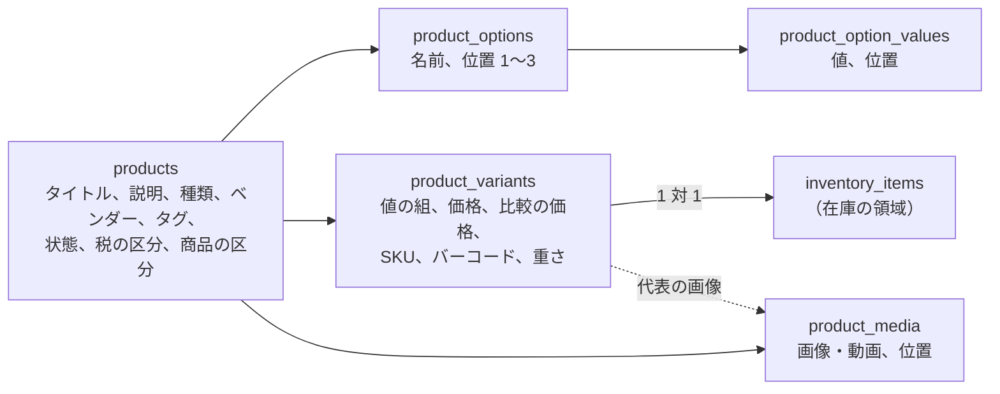
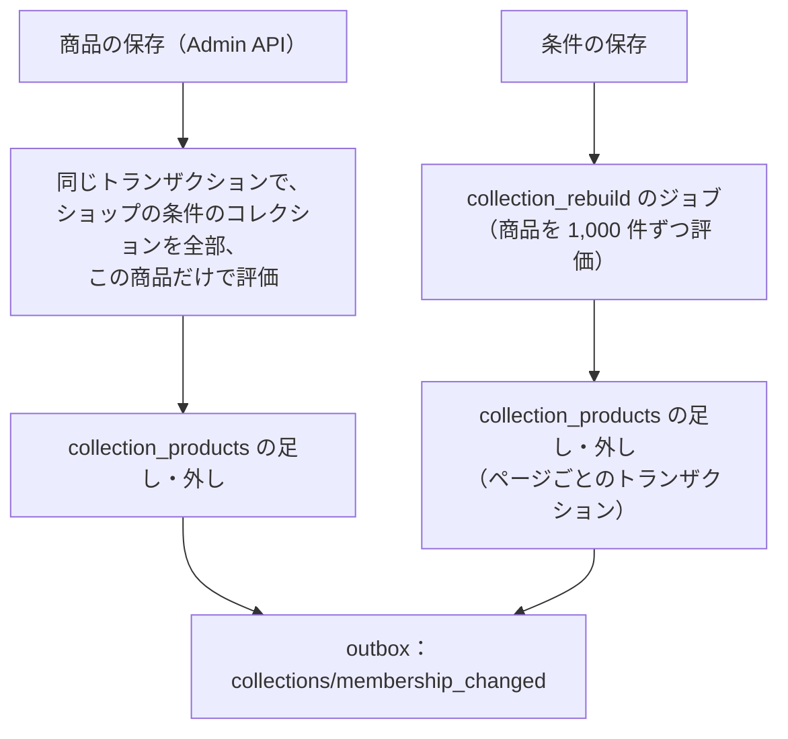
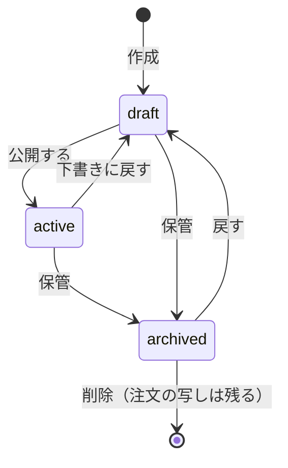

# Catalog and Pricing: Shopify

商品、バリエーション、オプション、コレクション（手動と条件）、メディアと画像の変換、メタフィールド、販売の公開、マーケットと通貨、価格と換算の丸め、比較の価格、商品の区分を決める。

前提となる決定は、ショップを単位にポッドへ置くこと（[ADR-0002](../decisions/0002-pods-and-shop-placement.md)）、全表に `shop_id` と FORCE RLS（[ADR-0003](../decisions/0003-tenancy-and-rls.md)）、在庫は拠点 × 品目の行（[ADR-0004](../decisions/0004-inventory-reservation-model.md)）、チェックアウトの価格の写し（[ADR-0005](../decisions/0005-checkout-state-machine-and-exactly-once-orders.md)）、Admin API の形と費用（[ADR-0009](../decisions/0009-admin-api-graphql-and-cost-limits.md)）。要件は NFR-003（ストアフロントの速さ）、NFR-011（変更の表示まで p95 10 秒）、NFR-013（金額の正しさ）、NFR-014（検索への反映 p95 30 秒）。法務の確認待ちは L2（比較の価格）と L10（扱う商品の制限）。この文書で決めたことは次の ADR にある。

| ADR | 決定 |
| --- | --- |
| [0014](../decisions/0014-product-variant-option-model.md) | 商品はオプション（3 つまで、順序つき）とオプションの値（1 つに 100 まで）を持ち、バリエーションはオプションの値の組で一意にする。1 商品のバリエーションは 1,000 まで。バリエーションと在庫の品目は 1 対 1。価格・比較の価格・SKU・重さはバリエーションが持つ |
| [0015](../decisions/0015-markets-currencies-and-rounding.md) | 価格の正本はショップの基本の通貨（JPY）の税込みの整数。マーケットごとに「固定の価格」か「換算と丸めの規則」で表示と支払いの通貨の価格を出す。換算は日次の為替の写し（ID つき）で行い、丸めは最小単位の整数の上で決めた規則（`none`・`whole`・`ends_99`・`ends_00_jpy10`）で 1 回だけ行う。チェックアウトは為替の写しの ID を価格の写しに固定する |
| [0016](../decisions/0016-collection-membership-and-catalog-events.md) | 条件のコレクションの所属は、保存した所属の表（`collection_products`）にする。商品の変更では、その商品だけを全条件で評価して同期で直し、条件の変更では、非同期のジョブで全商品を評価し直す。カタログの変更は、商品ごとに単調に増える `catalog_version` を持つ outbox の事象にし、キャッシュ・検索・Webhook が同じ事象を使う |

## 1. 範囲

- 扱う：
  - 商品・バリエーション・オプションの形と上限
  - コレクション（手動と条件）と並べ方
  - メディア（画像、動画）の受け取り、変換、配信の URL
  - メタフィールドの定義と値
  - 商品の状態と販売の公開（チャネル、予約の公開）
  - 価格、比較の価格、マーケット、通貨、為替、換算と丸め
  - 商品の区分と、扱いに許可の要る品目の印
  - CSV の取り込みと書き出し
  - カタログの変更の事象（キャッシュ・検索・Webhook への入力）
- 扱わない：
  - 税の区分と税額の計算（[taxes-and-invoices.md](taxes-and-invoices.md)）。この文書は商品に税の区分の列を置くだけ。
  - 在庫の数と引き当て（[inventory-and-reservations.md](inventory-and-reservations.md)）。この文書はバリエーションと在庫の品目の対応だけ。
  - 割引の価格（[discounts-engine.md](discounts-engine.md)）。
  - ストアフロントの表示とキャッシュ（[storefront-themes.md](storefront-themes.md)、[storefront-api-and-caching.md](storefront-api-and-caching.md)）。
  - 検索の索引（[search-and-recommendations.md](search-and-recommendations.md)）。
  - 送料の表（[orders-and-fulfillment.md](orders-and-fulfillment.md)）。

## 2. 本家の形（確かめたこと）

いずれも 2026-10-10 に確認。

| 項目 | 内容 | 出典 |
| --- | --- | --- |
| バリエーションの読み出し | 商品を根で読むとき、バリエーションを 2,048 件まで取れる | [Product（GraphQL Admin API）](https://shopify.dev/docs/api/admin-graphql/latest/objects/Product) |
| オプションの数 | 決まった数を書かず、ショップの資源の上限（`Shop.resourceLimits.maxProductOptions`）で決まる | 同上 |
| 配列の入力 | 250 件まで | [API usage limits](https://shopify.dev/docs/api/usage/limits) |

- 本家のバリエーションの作成の上限、オプションの値の数の上限、マーケットの換算の丸めの規則、為替の更新の頻度は、この確認では見ていない（**未検証**）。本システムの値は 4・9 節。
- 本家の識別子・型の名前は使わない。Admin API の型の名前をどこまで似せてよいかは法務の確認待ち（L9）。

## 3. 要件

| 要件 | 目標 | NFR・基準 |
| --- | --- | --- |
| 商品の保存 | 商品の作成・更新（バリエーション 100 まで）p99 1.5 秒 | NFR-009 |
| 変更の表示 | 価格・公開・タイトル・メディアの変更が、ストアフロントに出るまで p95 10 秒・p99 60 秒 | NFR-011 |
| 検索への反映 | 商品の変更が検索に出るまで p95 30 秒 | NFR-014 |
| 金額 | 価格は整数の最小単位。換算の丸めは 1 回だけ。表示とチェックアウトの価格が同じ為替の写しから出る | NFR-013 |
| 分離 | メディアの URL、CSV の結果、コレクションの所属に、他のショップの値が出ない | NFR-008 |
| 開店の速さ | 最初の商品の公開まで中央値 10 分（商品の作成が 1 画面で終わる） | K10 |

## 4. 商品とバリエーション

ADR-0014。

### 4.1 形



- **商品**は、タイトル、ハンドル（URL の名前）、説明（安全にした HTML）、種類、ベンダー、タグ、状態、税の区分（[taxes-and-invoices.md](taxes-and-invoices.md)）、商品の区分（10 節）を持つ。
- **オプション**は、商品ごとに 0〜3 個で、位置（1〜3）を持つ。名前は商品の中で一意（大文字と小文字、全角と半角を NFKC で揃えて比べる）。
- **オプションの値**は、オプションごとに 1〜100 個で、位置を持つ。値はオプションの中で一意（同じ正規化）。
- **バリエーション**は、各オプションから 1 つずつ選んだ値の組（`option_value_ids`、長さはオプションの数）を持つ。組は商品の中で一意。オプションが 0 個の商品は、バリエーションを 1 つだけ持つ（既定のバリエーション）。
- 価格、比較の価格、SKU、バーコード、重さ（グラム）、配送の要否、在庫の方針（`deny`・`continue`・数えない）はバリエーションが持つ。商品の価格は持たない（表示の「〜円から」は最小の値を計算する）。
- **在庫の品目**はバリエーションと 1 対 1 で、バリエーションの作成と同じトランザクションで在庫の領域の公開の関数で作る（`packages/inventory` の関数だけが在庫の表を書く。[ADR-0001](../decisions/0001-platform-and-stack.md)）。

### 4.2 上限

| 対象 | 上限 | 超えたとき |
| --- | --- | --- |
| オプション | 1 商品 3 | `userErrors` の `OPTIONS_LIMIT` |
| オプションの値 | 1 オプション 100 | `OPTION_VALUES_LIMIT` |
| バリエーション | 1 商品 1,000 | `VARIANTS_LIMIT`。Admin API の 1 回のミューテーションでは 250 まで（配列の入力の上限） |
| タイトル・ハンドル | 255 文字 | 拒む |
| 説明 | 512 KB（安全にした後） | 拒む |
| タグ | 1 商品 250、1 つ 255 文字 | 拒む |
| メディア | 1 商品 250 | 拒む |
| 商品 | 1 ショップ 10 万（プランで引き上げ。S1 の想定はポッドあたり 625 万バリエーション） | 拒む。Ops が引き上げる |
| SKU | 255 文字。ショップの中の一意は強制しない（警告） | — |

- 1,000 は本システムの値で、S1 の見込み（商品あたりの平均 5 バリエーション）の 200 倍の余裕を持たせた。本家の 2,048（読み出しの上限）より小さい。大きな組み合わせ（色 30 × サイズ 40）は、商品を分けるかメタフィールドで表す。
- 説明の HTML は、保存の時に許可の一覧の安全化（要素・属性・URL のスキーム）を通す。ストアフロントではエスケープしない「安全な HTML」の型で出す（[storefront-themes.md](storefront-themes.md) の 4.2 節）。

### 4.3 オプションの変更とバリエーションの再生成

オプションの変更は、バリエーションの組と在庫の品目を動かすので、次の決めた操作だけにする。

| 操作 | バリエーションへの効果 | 在庫 |
| --- | --- | --- |
| オプションの値を足す | 何も作らない。事業者が選んで作る（`productVariantsBulkCreate`） | 作ったものだけ品目を作る |
| オプションの値の名前を変える | 組は ID なので変わらない。表示だけ変わる | 変わらない |
| オプションの値を消す | その値を含むバリエーションを消す（確認の画面で数を出す） | 品目を消す。`on_hand > 0` か `committed > 0` なら拒む |
| オプションを足す（2 → 3） | 既存のバリエーションに、新しいオプションの最初の値を付ける | 変わらない |
| オプションを消す（3 → 2） | 残る組が重なるなら拒む。重ならなければ組を縮める | 変わらない |
| オプションの並べ替え | 組の順を並べ替える | 変わらない |

- どの操作も 1 つのトランザクションで、商品の `catalog_version` を 1 上げる（12 節）。
- 注文の行は、商品・バリエーションの名前・オプションの値・価格を写しとして持つ（[cart-and-checkout.md](cart-and-checkout.md)、[orders-and-fulfillment.md](orders-and-fulfillment.md)）。バリエーションを消しても、注文は壊れない。

### 4.4 例

T シャツ（色：白・黒・紺、サイズ：S・M・L・XL）を作る。

1. 商品を作る：オプション `色`（位置 1）の値 3 つ、`サイズ`（位置 2）の値 4 つ。
2. 全組み合わせの作成を選ぶと、バリエーション 12 個（3 × 4）を作る。価格は全部 3,300 円（税込み）、在庫の方針は `deny`。在庫の品目を 12 個作る。
3. 紺の XL を作らないときは、11 個にする。組 `(紺, XL)` は存在しないので、ストアフロントの選択の部品は「選べない」と出す（在庫切れとは区別する）。
4. 後で `色` に `赤` を足しても、バリエーションは増えない。事業者が `(赤, M)` を選んで作る。

## 5. コレクション

ADR-0016。

### 5.1 種類

| 種類 | 所属の決め方 |
| --- | --- |
| 手動 | 事業者が商品を足し・外す。並べ方は手動を選べる |
| 条件 | 条件（下の表）を `all`（すべて）か `any`（どれか）で組む。所属は保存した表から読む |

条件に使える項目（1 コレクション 60 条件まで）：

| 項目 | 演算 |
| --- | --- |
| タイトル、種類、ベンダー | 等しい、等しくない、始まる、終わる、含む、含まない |
| タグ | 等しい（1 つのタグ）、等しくない |
| バリエーションの価格、比較の価格 | 等しい、より大きい、より小さい（どれかのバリエーションが満たせば真） |
| 重さ | 同上 |
| 商品の区分 | 等しい、子孫である |
| メタフィールド（定義のあるもの、型が数・真偽・単一の文字列） | 型に合う演算 |

- 在庫の数は条件に使えない。在庫は速く変わり、所属の表の書き込みの嵐になる（「在庫あり」の絞り込みは検索の索引で行う。[search-and-recommendations.md](search-and-recommendations.md)）。
- 条件の文字列の比べは NFKC と小文字にそろえてから行う。

### 5.2 所属の更新



- **商品の変更**：ショップの条件のコレクションの条件（最大 5,000 × 60）を、変えた商品の値だけで評価する。条件は保存の時に IR（比べの列）にしてメモリーに持つ（ショップごとに 60 秒のキャッシュ、`collections_version` で破棄）。5,000 × 60 = 30 万の比べは 10ms 未満の見込み。
- **条件の変更**：コレクションを `rebuilding` にし、ジョブが商品を ID の順に 1,000 件ずつ評価して表を直す。終わったら `ready`。途中のストアフロントは古い所属と新しい所属が混ざる（数分で収まる）。`rebuilding` の間に同じコレクションの条件がまた変わったら、ジョブの世代を上げ、古いジョブは次のページで止まる。
- 手動のコレクションへの足し・外しも同じ表に書く（`source = manual`）。

### 5.3 並べ方

`manual`、`best_selling`（直近 30 日の売れた数。日次で計算する `product_sales_30d`）、`title_asc`・`title_desc`（NFKC の照合の順）、`price_asc`・`price_desc`（最小のバリエーションの価格）、`created_desc`。同じ値のときは商品の ID の順にして、ページングを決定的にする。

## 6. メディアと画像の変換

| 項目 | 決定 |
| --- | --- |
| 受け取り | 管理画面・Admin API が S3 の署名付きの URL（`stagedUploadsCreate`、15 分）を出し、事業者のブラウザ・アプリが直接上げる。本体は API のサーバーを通さない |
| 置き場所 | `s3://<media-bucket>/shops/<shop_id>/media/<media_id>/original`。キーにショップを入れる |
| 検査 | 形式（JPEG、PNG、WebP、GIF、AVIF、HEIC、MP4、MOV）を中身の先頭のバイトで判定。画像 20 MB・2,500 万画素、動画 1 GB・10 分まで。EXIF の位置の情報を消す |
| 画像の変換 | 自前の変換のサービス（sharp）。要求の時に `/<brand>-media/<shop_id>/<media_id>/<width>.<format>` を CloudFront の元として作り、S3 に置いて使い回す。幅は 16 段（100〜4,000）に丸める。形式は `Accept` で AVIF・WebP・JPEG を選ぶ |
| 動画 | MediaConvert で HLS（3 段）と MP4 の 1 本。変換の完了まで商品のメディアは `processing` |
| 配信 | メディアの URL は不変（中身が変われば `media_id` が変わる）。`Cache-Control: public, max-age=31536000, immutable` |
| 代替のテキスト | 512 文字まで。テーマの `image_url` のフィルターは `alt` を出す（[storefront-themes.md](storefront-themes.md)） |

- 状態：`uploaded` → `processing` → `ready` か `failed`（理由のコード）。`ready` でない画像は、ストアフロントに出さない。
- 未公開の商品の画像も、URL を知れば見られる（推測できない ID の URL）。未公開の商品の秘密の度合いは低いと判断した。ショップの削除では、S3 の接頭辞ごと消し、CDN の無効化をかける（`shops-and-pods.md`）。

## 7. メタフィールド

- **定義**：所有者の種類（商品、バリエーション、コレクション、顧客、注文、ショップ）× 名前空間 × 鍵。型（文字列、複数行の文字列、整数、十進、真偽、日付、URL、色、お金、重さ、JSON、商品の参照、ファイルの参照、それぞれの配列）と、検証（最小・最大、正規表現、選択肢）を持つ。
- **値**：所有者ごとに、定義の鍵で 1 つ。1 つの値は 64 KB まで（JSON は 128 KB）。1 所有者あたり 200 の値。1 ショップ 1 所有者の種類あたり 256 の定義。
- **アプリの名前空間**：`app--<app_id>--<名前>` はそのアプリだけが書け、事業者と他のアプリには読むだけを許すか隠すかを定義で選ぶ（[app-platform-and-apis.md](app-platform-and-apis.md)）。
- **ストアフロントへの公開**：定義に `storefront: public` を付けたものだけ、テーマの drop と Storefront API で読める（[storefront-themes.md](storefront-themes.md) の 5 節）。既定は非公開。
- 顧客・注文のメタフィールドは、テーマのキャッシュするページから読めない（[ADR-0047](../decisions/0047-loom-data-access-and-prefetch.md)）。

## 8. 商品の状態と販売の公開



- **販売のチャネル**（publication）：`online_store`（テーマのストアフロント）と、Storefront API のトークンを持つアプリごとのチャネル（`headless:<app_id>`）。商品はチャネルごとに公開の行（`product_publications`）を持ち、`publish_at` を持てる。
- ストアフロントで見える条件：`status = active` かつ そのチャネルの公開の行がある かつ `publish_at <= 要求の開始の時刻`。
- **予約の公開**：`workers` が 1 分ごとに、直近 1 分で `publish_at` を過ぎた行を探し、`products/published` の事象を出す（キャッシュの世代を上げる）。表示の正しさは上の条件で決まるので、ジョブが遅れても、キャッシュに外れたページは正しい。キャッシュに当たったページは、最大で 1 分と NFR-011 の分だけ遅れる。フラッシュセールのように時刻が大事な公開は、待合室の開始の時刻で揃える（[flash-sales-and-queueing.md](flash-sales-and-queueing.md)）。
- 公開の取り消し（`active` → `draft`）は、キャッシュの世代を同期の経路で上げ（[storefront-api-and-caching.md](storefront-api-and-caching.md) の 5 節）、チェックアウトの価格の計算で `status` を確かめ直す（[cart-and-checkout.md](cart-and-checkout.md)）。

## 9. 価格、マーケットと通貨

ADR-0015。

### 9.1 価格

| 値 | 持ち方 |
| --- | --- |
| 価格 | バリエーションの `price_amount`（基本の通貨の最小単位の整数、税込み）。日本は総額表示なので、税込みを正本にする（[taxes-and-invoices.md](taxes-and-invoices.md)） |
| 比較の価格 | `compare_at_amount`（任意）。価格より大きいときだけ表示の対象 |
| 通貨 | ショップの基本の通貨は JPY（ISO 4217 の小数の桁 0）。値と通貨の組を `Money` の型（`amount_minor`、`currency`）で持ち、浮動小数点にしない |

- **比較の価格の表示**（二重価格表示）の条件は法務の確認待ち（L2）。本システムは次の枠を用意し、既定の振る舞いは確認の後に決める。
  - 比較の価格に「根拠の種類」（`former_price`：自店の過去の価格、`msrp`：メーカーの希望の価格、なし）と「根拠の期間」（自店の過去の価格の販売の期間）の入力の欄。
  - 既定のテーマは、根拠の種類のない比較の価格を、打ち消しの線の表示にしない（確認の後に変えうる）。
  - 自店の過去の価格の履歴を `variant_price_history` に残す（価格の変更ごとに 1 行、2 年）。根拠の確かめに使える。

### 9.2 マーケット

- **マーケット**は、国・地域の集まりと、表示と支払いの通貨、言語、価格の決め方を持つ。ショップに必ず 1 つの主のマーケット（日本、JPY）がある。
- 価格の決め方：
  - `base`：基本の通貨の価格そのまま（主のマーケット）
  - `fixed`：マーケットの通貨で、バリエーションごとに固定の価格（`market_prices`）。ないバリエーションは `converted` に落ちる
  - `converted`：基本の価格 ×（1 ＋ 調整の率）× 為替、を丸めの規則で丸める
- 買い手のマーケットは、ストアフロントのドメイン・パス（`/en-us/`）か、買い手の選択で決める。IP アドレスの国の推定は案内の表示にだけ使い、価格の決定に使わない（キャッシュの鍵が IP に依らないようにする）。
- **MVP の範囲**：外貨のマーケットは海外への配送を伴う。海外への販売（越境）は MVP の後の Epic で、輸出の税の扱いが要る（法務の確認待ち L4）。MVP では仕組み（`markets`・`market_prices`・換算と丸め・為替の写し）を作って試験し、外貨のマーケットの有効化は `release.markets-foreign-currency` の裏に置く。

### 9.3 換算と丸め

為替は、日次（09:00 JST）に選定した提供者から取り、`fx_rates`（ID、取得の時刻、通貨の組、率は 10 進の文字列で 10 桁）に足す。行は消さない。

計算（整数と 10 進だけ。浮動小数点を使わない）：

```text
input : base_minor（JPY の整数）, adj（調整の率、10 進。例 0.05）, rate（1 JPY あたりの相手の通貨、10 進）
        to_exp（相手の通貨の小数の桁。USD は 2）, rule
raw   = base_minor × (1 + adj) × rate × 10^to_exp / 10^from_exp      ← 10 進で 12 桁まで保持
step1 = 最小単位へ：half-even で整数（minor）
step2 = rule で丸める
  none        : step1 のまま
  whole       : 最小単位で 10^to_exp の倍数へ、half-up（$22.37 → $22.00、$22.50 → $23.00）
  ends_99     : raw 以上で、末尾が .99 の最小の値（$22.0011 → $22.99、$22.99 → $22.99）
  ends_00_jpy10 : 相手が桁 0 の通貨で、10 の倍数へ half-up（JPY 相当の通貨向け）
output: amount_minor（整数）, fx_rate_id
```

- 丸めは 1 回だけ（`step1` は表現の都合で、`step2` が規則の丸め）。割引・税はこの後の金額の上で計算する（[discounts-engine.md](discounts-engine.md)、[taxes-and-invoices.md](taxes-and-invoices.md)）。
- 例 1：基本の価格 3,300 円、調整 0、率 0.006667（USD/JPY）、規則 `ends_99`。
  `raw = 3300 × 0.006667 × 100 = 2200.11`（$22.0011）。末尾 .99 の最小の値で $22.99（`2299`）。
- 例 2：基本の価格 1,980 円、調整 0.05、率 0.006667、規則 `whole`。
  `raw = 1980 × 1.05 × 0.006667 × 100 = 1386.069…`（$13.86）。half-up で $14.00（`1400`）。
- 例 3：同じ 1,980 円、規則 `none`。`step1 = 1386`（$13.86）。
- **表示とチェックアウトの一致**：ストアフロントの表示は、ページを描いた時の `fx_rate_id` で計算する。チェックアウトは、カートに入れた時の `fx_rate_id` を持ち、送信で価格の写しに固定する（[ADR-0005](../decisions/0005-checkout-state-machine-and-exactly-once-orders.md)）。為替が変わってから 24 時間を過ぎたカートは、新しい率で計算し直し、買い手に変わったことを示す。
- 為替の更新は、`converted` のマーケットを持つショップの世代の番号を上げる（日に 1 回。[storefront-api-and-caching.md](storefront-api-and-caching.md)）。

## 10. 商品の区分と制限

- 商品の区分は、自前の木（3 段、例：食品 > 飲料 > 酒類）で持つ。区分は検索の絞り込みと、税の区分の候補（食品の区分なら 8% を勧める。決めるのは事業者）に使う。
- 扱いに許可・届出の要る品目（酒類、医薬品、化粧品、食品、中古品など）の印（`regulated_kind`）を区分に付ける。印のある区分の商品を公開するときに、ショップの許可の番号の入力の欄（酒類販売業免許、古物商の許可など）を出す。
- 本システムが何をどこまで確かめるか（入力だけか、審査するか、禁止の品目）は法務の確認待ち（L10）。確認まで、印と入力の欄だけを作り、公開を止める規則は持たない。

## 11. CSV の取り込みと書き出し

- **書き出し**：一括の操作（[ADR-0009](../decisions/0009-admin-api-graphql-and-cost-limits.md)）で JSONL を作り、CSV へ変換して S3（`shops/<shop_id>/exports/`）に置き、期限 7 日の URL を返す。1 行 1 バリエーション。
- **取り込み**：S3 に上げた CSV（100 MB・10 万行まで、UTF-8 と BOM つきの UTF-8、Shift_JIS）を、ジョブが 500 行ずつ検証してから、商品ごとのミューテーションの関数で書く。行ごとの結果（成功、警告、エラー）を結果の CSV に書く。
- 取り込みは、ショップごとに同時に 1 つ。DB の書き込みの速さは、ショップの Admin API のバケットとは別の、ジョブの公平なキュー（[ADR-0003](../decisions/0003-tenancy-and-rls.md)）で絞る。
- 列の形は本システムの独自の形。本家の CSV の形との互換は目標にしない（[intent.md](../intent.md) の Non-goals）。

## 12. カタログの変更の事象

ADR-0016。

- 商品・バリエーション・オプション・メディア・公開・コレクションの所属を変えるトランザクションは、商品の `catalog_version`（`bigint`、商品ごとに単調に増える）を上げ、outbox に事象を 1 つ書く。

| 事象 | 中身 | 使うもの |
| --- | --- | --- |
| `products/create`・`products/update`・`products/delete` | `shop_id`、`product_id`、`catalog_version`、変わった項目の種類（`display`・`price`・`publication`・`inventory_policy`・`internal`） | `cache-invalidator`、`search-indexer`、Webhook |
| `products/published`・`products/unpublished` | 同上、チャネル | 同上 |
| `collections/update`・`collections/membership_changed` | `collection_id`、所属の足し・外しの数 | `cache-invalidator`、`search-indexer` |
| `markets/prices_changed` | マーケット、`fx_rate_id` | `cache-invalidator` |

- 変わった項目の種類が `internal`（SKU、仕入れの値、管理用のメタフィールド）だけなら、キャッシュの世代を上げない（[storefront-api-and-caching.md](storefront-api-and-caching.md) の 5 節）。在庫の数の変化は、この事象を出さない（在庫の部品で出す）。
- 使う側は、`catalog_version` が自分の持つ値以下の事象を捨てる（順序の入れ替えに強くする）。

## 13. 失敗のしかた

| 事象 | 振る舞い |
| --- | --- |
| 条件のコレクションの作り直しのジョブが止まる | `rebuilding` のまま。ジョブは最後のページの印から再開する。30 分を超えたら警告 |
| 画像の変換のサービスの障害 | 元の画像の配信は CloudFront のキャッシュから続く。新しい幅の要求は 503 で、テーマは `srcset` の他の幅を使う |
| 為替の提供者の障害 | 前日の率を使い続ける。72 時間を超えたら、`converted` のマーケットのチェックアウトを止める（`ops.markets_converted_checkout`）。表示は続ける |
| CSV の取り込みの途中の失敗 | 書いた商品は残る（行ごとのトランザクション）。結果の CSV で失敗の行を示し、再取り込みで続ける（ハンドルで同じ商品を更新） |
| outbox の遅れ | キャッシュと検索の反映が遅れる。NFR-011・NFR-014 の SLI で見る |

## 14. 上限（まとめ）

4.2・5.1・6・7・11 節のとおり。値は運用の値（`ops.catalog_limits`）で、プランで引き上げる。引き下げは既存のデータを壊さない（超えている商品は保存の時だけ拒む）。

## 15. data-model への項目

| 表 | 中身 | 節 |
| --- | --- | --- |
| `products` | `(shop_id, id)`、`handle`（一意 `(shop_id, handle)`）、`title`、`body_html`、`product_type`、`vendor`、`tags text[]`、`status`、`tax_category`、`category_id`、`catalog_version bigint`、`created_at`、`updated_at` | 4.1 |
| `product_options` | `(shop_id, option_id)`、一意 `(shop_id, product_id, position)`（遅延）、`name`、`name_norm`（[data-model.md](data-model.md) の D-31） | 4.1 |
| `product_option_values` | `(shop_id, value_id)`、一意 `(shop_id, option_id, position)`（遅延）、`value`、`value_norm` | 4.1 |
| `product_variants` | `(shop_id, id)`、`product_id`、`option_value_ids uuid[]`（一意 `(shop_id, product_id, option_value_ids)`）、`price_amount bigint`、`compare_at_amount bigint`、`compare_at_basis`、`sku`、`barcode`、`weight_g`、`requires_shipping`、`inventory_policy`、`inventory_item_id`、`position` | 4.1、9.1 |
| `variant_price_history` | `(shop_id, variant_id, changed_at)`、`price_amount`、`compare_at_amount`。2 年 | 9.1 |
| `product_media` | `(shop_id, id)`、`product_id`、`kind`、`s3_key`、`state`、`alt`、`width`、`height`、`position` | 6 |
| `collections` | `(shop_id, id)`、`handle`、`kind`、`rules jsonb`、`disjunctive`、`sort_order`、`state`、`rebuild_generation` | 5 |
| `collection_products` | `(shop_id, collection_id, product_id)`、`source`、`position` | 5 |
| `product_sales_30d` | `(shop_id, product_id)`、`units`、`computed_on` | 5.3 |
| `metafield_definitions`・`metafields` | 定義（所有者の種類、名前空間、鍵、型、検証、`storefront`）と値（所有者、定義、`value jsonb`） | 7 |
| `product_publications` | `(shop_id, product_id, channel)`、`publish_at` | 8 |
| `markets`・`market_regions`・`market_prices` | マーケット（通貨、言語、価格の決め方、調整の率、丸めの規則）、国・地域、固定の価格 `(shop_id, market_id, variant_id)` | 9.2 |
| `fx_rates`（全体の Aurora） | `id`、`fetched_at`、`base`、`quote`、`rate numeric(20,10)`。ショップのデータでない | 9.3 |
| `product_categories`（全体、読み出しの写しをポッドへ） | 区分の木、`regulated_kind`、推す税の区分 | 10 |
| S3 | `shops/<shop_id>/media/…`、`…/exports/…`、`…/imports/…`（ポッドに依らない） | 6、11 |

## 16. テストと性質

- **PROP-CAT-001（バリエーションの組の一意）**：任意のオプションの操作の列（4.3 節）の後、バリエーションの組が商品の中で一意で、各組の長さがオプションの数と等しく、在庫の品目とバリエーションが 1 対 1。
- **PROP-CAT-002（所属の一致）**：任意の商品の変更と条件の変更の列の後、ジョブが終われば、`collection_products` が、全商品を条件で素直に評価した集合と一致する。
- **PROP-CAT-003（換算の決定性と丸めの 1 回）**：任意の価格・調整・率・規則で、結果は整数で、同じ入力から同じ結果。`ends_99` の結果は `raw` 以上で末尾 99、`whole` は 10^桁 の倍数。浮動小数点の計算と比べない（10 進の参照の実装 `fx-ref` と一致）。
- **PROP-CAT-004（version の単調）**：任意の並行の商品の更新で、outbox の事象の `catalog_version` が商品ごとに狭義に増える。
- **DT-CAT-001**：4.3 節の表（オプションの操作 × 在庫の状態）を表駆動テストにする。
- ファジング：CSV の取り込み（文字コード、壊れた行、巨大なセル、数式の注入の `=` で始まる値は書き出しで `'` を前に付ける）。
- 漏れ：メディアの S3 のキー、書き出しの URL、コレクションの所属が他のショップの値を返さない（[quality.md](../quality.md) の 2.2.1 節 G の「書き出し・一括の操作の結果」）。

## 17. Story の候補

| Epic | Story | 中身 |
| --- | --- | --- |
| E3 | `products-and-variants` | 4 節（ADR-0014。PROP-CAT-001、DT-CAT-001） |
| E3 | `collections` | 5 節（ADR-0016。PROP-CAT-002） |
| E3 | `media-and-images` | 6 節 |
| E3 | `metafields` | 7 節 |
| E3 | `publishing` | 8 節 |
| E3 | `markets-and-currencies` | 9.2・9.3 節（ADR-0015。PROP-CAT-003）。外貨のマーケットはフラグの裏 |
| E3 | `compare-at-price` | 9.1 節。表示の既定は法務：L2 |
| E3 | `product-csv-import-export` | 11 節 |
| E3 | `product-categories-and-restrictions` | 10 節。範囲は法務：L10 |

## 18. 未解決の問い

### 決定（2026-10-10、既定案）

- **バリエーションの上限**：1 商品 1,000、オプション 3、値 100（ADR-0014）。
- **価格の正本**：基本の通貨の税込みの整数（ADR-0015）。
- **丸めの規則**：4 種類、1 回だけ（ADR-0015）。
- **条件のコレクション**：保存した所属の表（ADR-0016）。在庫の数を条件にしない。
- **価格の履歴**：2 年残す（比較の価格の根拠に使える）。

### 持ち越し

| 問い | いつ・どう決めるか |
| --- | --- |
| 比較の価格の表示の条件と既定のテーマの振る舞い | **法務の確認待ち：L2** |
| 扱いに許可の要る商品の確かめの範囲 | **法務の確認待ち：L10** |
| 外貨のマーケットの有効化（越境の税の扱い） | 越境の Epic と **法務の確認待ち：L4** |
| 為替の提供者 | E3 の選定の Story |
| 本家のバリエーション・オプションの値の上限、換算の丸め | 公式の資料で確かめられなかった（**未検証**のまま） |

## 出典

いずれも 2026-10-10 に確認。

- Shopify Dev, [Product（GraphQL Admin API）](https://shopify.dev/docs/api/admin-graphql/latest/objects/Product)：根で読むバリエーションは 2,048 件まで。オプションの数はショップの資源の上限
- Shopify Dev, [API usage limits](https://shopify.dev/docs/api/usage/limits)：配列の入力は 250 件まで
- ISO 4217：通貨の小数の桁
