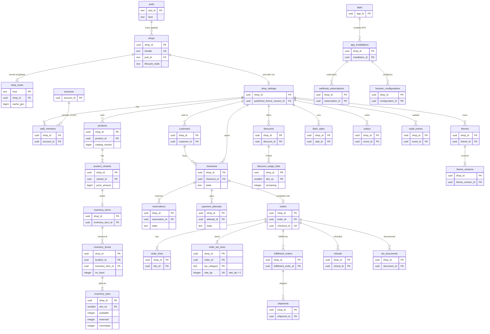
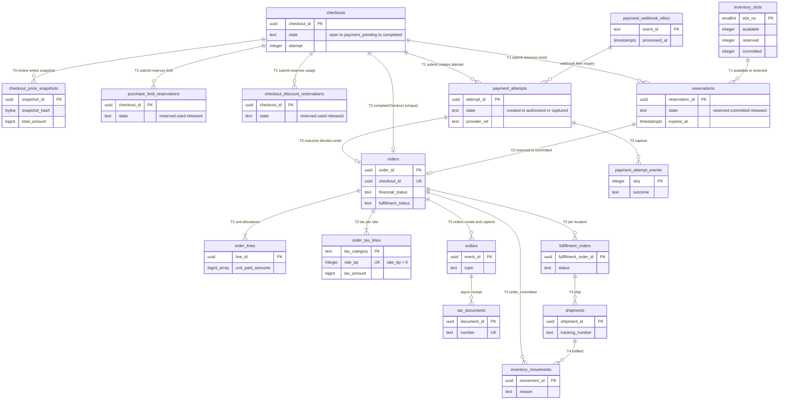

# Data model: Shopify

データモデルの正本。規約、置き場所、全体の ER 図、チェックアウトから配送までの道筋、横断の不変条件、決めたことを、ここに置く。領域ごとの表の目録（列・キー・索引・CHECK・RLS・分割・保持・量）と、Aurora の外の置き場所は [data-model/](data-model/) に置く。

- **列・制約・索引・置き場所の形の正本は、このファイルと `data-model/` の各ファイル**である。領域の文書は振る舞いの正本で、各文書の「data-model への項目」の節は提案の記録として残す。両者が食い違ったら、このデータモデルに合わせて領域の文書を直す。
- 実装の変更（開発リポジトリの `changes/`）でマイグレーションや形を変えるときは、同じ PR でここを更新する。移行の順は [delivery.md](delivery.md) の 5 節（広げる → 埋める → 縮める）、形の番号の順は同 6 節（読む側を先に）。
- 方針の元は [ADR-0002](../decisions/0002-pods-and-shop-placement.md)（ポッド、P1〜P5）、[ADR-0003](../decisions/0003-tenancy-and-rls.md)（テナントと RLS、X1〜X3）、[ADR-0004](../decisions/0004-inventory-reservation-model.md)（在庫）、[ADR-0005](../decisions/0005-checkout-state-machine-and-exactly-once-orders.md)（1 回の注文）、[ADR-0006](../decisions/0006-payments-via-providers.md)（決済の提供者）、[ADR-0066](../decisions/0066-encryption-and-key-layout.md)（暗号化）、[ADR-0068](../decisions/0068-data-classes-retention-and-operator-access.md)（保持）。
- 「S1 の量」は、S1（登録 10 万ショップ、稼働 5 万、注文 月 100 万、バリエーション 2,500 万、共有のポッド 4）の全ポッドの合計の**初期見積もり**である（共有のポッド 1 つはおよそ 4 分の 1）。元は [README.md](README.md) の 2 節と [capacity.md](capacity.md)。E18 の負荷試験で置き換える。
- 保持の期間の多くは**法務の確認待ち（L3・L4）**である。結論まで、表の「保持」は既定の値を書き、[security.md](security.md) の 6.2 節と `retention_policies` を正本にする。

2026-10-10 のデータモデルの工程で、索引だった文書を、表の目録と ER 図を持つ正本に書き直した（7 節）。

## 1. ファイルの構成

| ファイル | 領域 | 表の数 |
| --- | --- | --- |
| [data-model/global-directory-and-identity.md](data-model/global-directory-and-identity.md) | ショップ → ポッドの正本、ホストと世代、ライフサイクル、削除の作業、熱い集まり、スタッフのアカウント、セッション、組織と SSO、パートナー、署名の鍵、ポッドの `domains` | 19 |
| [data-model/shops-and-staff.md](data-model/shops-and-staff.md) | ポッドのショップの設定、スタッフの所属・役割・招待、協力者の依頼、顧客・住所・セッション | 9 |
| [data-model/catalog-and-media.md](data-model/catalog-and-media.md) | 商品、オプション、バリエーション、価格の履歴、メディア、公開、コレクション、売れた数、メタフィールド、商品の区分 | 14 |
| [data-model/pricing-taxes-and-invoices.md](data-model/pricing-taxes-and-invoices.md) | マーケット、為替・通貨・言語、税率、ショップの税の設定、注文と返金の税率ごとの値、文書と番号、登録番号 | 17 |
| [data-model/inventory.md](data-model/inventory.md) | 拠点と選び方、品目、拠点の行、枠の行、引き当て、移動の履歴、日次の写し、照合 | 10 |
| [data-model/flash-sales-and-queueing.md](data-model/flash-sales-and-queueing.md) | セールと段、許可証の使用、1 人あたりの上限、待合室の設定と監査 | 8 |
| [data-model/carts-and-checkouts.md](data-model/carts-and-checkouts.md) | チェックアウト、行、遷移、価格の写し、送信の冪等、最終確認画面の枠、保存したカート、郵便番号 | 9 |
| [data-model/discounts.md](data-model/discounts.md) | 割引、バージョン、コード、対象、使用の回数の枠・買い手ごと・引き当て・合計 | 8 |
| [data-model/payments.md](data-model/payments.md) | 決済の試行と結果、Webhook の inbox、照会の予定、提供者の設定、日次の突き合わせ | 6 |
| [data-model/orders-and-fulfillment.md](data-model/orders-and-fulfillment.md) | 注文、行、遷移、番号、配送の指示、配送、送料の表、配送の日時、運送会社の型・書き出し・取り込み・連携、通知のひな形 | 21 |
| [data-model/returns-and-refunds.md](data-model/returns-and-refunds.md) | 返品、返品の行と規則、返金、返す単位、返金の遷移 | 6 |
| [data-model/themes-and-storefront.md](data-model/themes-and-storefront.md) | テーマとバージョン、特定商取引法の表示、スクリプトの許可、ページ、メニュー、Storefront API のトークン、永続化したクエリ、リダイレクト | 9 |
| [data-model/search.md](data-model/search.md) | 同義語、検索の数え上げ、候補、おすすめ、索引の作り直し | 5 |
| [data-model/apps-and-api.md](data-model/apps-and-api.md) | 開発者、アプリ、バージョン、埋め込み、審査、定義の写し、導入、トークン、認可コード、冪等、一括の操作 | 12 |
| [data-model/functions.md](data-model/functions.md) | 関数、機械語、写し、関数の設定、実行の記録 | 5 |
| [data-model/webhooks.md](data-model/webhooks.md) | 購読、配信、事象の一覧 | 3 |
| [data-model/billing.md](data-model/billing.md) | プランの上限、購読、利用量、事業者への請求・行・請求の試み、開発者の取り分、アプリの購読・従量・1 回 | 11 |
| [data-model/security-audit-and-lifecycle.md](data-model/security-audit-and-lifecycle.md) | データの鍵、暗号化した列の形、監査ログと鎖、サポートのアクセス、顧客のデータの請求、保持・保全・削除の方針、運用者の監査 | 13 |
| [data-model/ops-and-pods.md](data-model/ops-and-pods.md) | ポッドと組、ショップの重さ、移し替え（停止の印、中継の窓、当てた LSN、行の数）、outbox と読み出しの位置、照合の不一致、移行、デプロイ、API のバージョン、DR、段の予定、レビュー、見張りの一覧 | 20 |
| [data-model/stores.md](data-model/stores.md) | Aurora の外：Valkey（ポッド・全体）、KeyValueStore、S3、SNS・SQS と事象の封筒、Webhook の本文と依頼、価格の写しの JSON、OpenSearch、関数の入出力、Loom の IR、エッジのキャッシュの鍵、トークンの形、AppConfig とログ | — |

合計：Aurora の 205 表。ポッドの DB は 146（`public` のテナントの表 126、`sys` の RLS の外の表 20）、全体の DB は 59。同じ名前で全体とポッドの両方にある参照のデータの表（`tax_rates`・`postal_codes`・`carrier_profiles`・`product_categories`）と `data_keys`・`schema_migrations` は、両方を数えた。ER 図は 22 個（領域ごとに 20 個、4 節の全体図 1 個、5 節の道筋 1 個）。

## 2. 置き場所

| 置き場所 | 中身 | テナントの分離 | 詳細 |
| --- | --- | --- | --- |
| ポッドの Aurora PostgreSQL 18（ポッドごと。大阪に Global Database） | ショップのデータの正本（商品、在庫、チェックアウト、注文、決済、テーマ、顧客、監査）、outbox、全体の写し | FORCE RLS と `SET LOCAL app.shop_id`。RLS の外は `sys` の 20 表だけ（3.3 節） | 3 節、各 `data-model/` |
| 全体の Aurora PostgreSQL 18（1 つ。大阪に Global Database） | ショップ → ポッド、ホストと世代、スタッフのアカウント、アプリの登録、プランと請求、参照のデータ、待合室の設定、運用 | ショップのデータを持たない（ID・ハンドル・額・数だけ）。サービスごとのスキーマとロール（3.1 節） | 各 `data-model/` |
| ポッドの Valkey | カート、トークンの写し、費用のバケット、セマフォ、表示の在庫、遮断器 | 鍵の先頭 `{<shop_id>}:`。失ってよい | [stores.md](data-model/stores.md) の 1.1 節 |
| 全体の Valkey | 待合室（`wr:{<sale_id>}:`）、identity（`id:`） | ショップのデータの値を持たない | 同 1.3 節 |
| CloudFront KeyValueStore | 熱い集まりのホスト → 振り分けの値と世代、`sys:` の値 | 値はショップの短い ID・ポッド・状態・世代だけ | 同 2 節 |
| S3 | メディア、テーマ、書き出し、一括の操作、送り状、関数の機械語、保持（Object Lock）、監査の写し | ショップのデータは `shops/<shop_id>/…`（ポッドに依らない） | 同 3 節 |
| SNS・SQS | outbox の事象、ジョブ、P3・P5、Webhook の送り | 事象は ID と数だけ。Webhook の本文は全体の SQS の保持の中だけ | 同 4・5 節 |
| OpenSearch（ポッドごと） | 商品の索引 | `routing = shop_id`、`shop_id` の term、返す前に確かめる | 同 7 節 |
| AppConfig、CloudWatch | `ops.*`・`release.*`、ログ | ID と数と理由のコードだけ | 同 12 節 |

## 3. 規約

### 3.1 DB とスキーマ

| DB | スキーマ | 中身 | RLS |
| --- | --- | --- | --- |
| ポッド | `public` | ショップのデータの表（126） | 全部 FORCE RLS（3.3 節） |
| ポッド | `sys` | RLS の外の 20 表（下の一覧）。ショップのデータの列を持たない | なし。ロールで絞る |
| 全体 | `directory` | `shops`、`shop_hosts`、`shop_lifecycle_events`、`shop_deletion_jobs`、`hotset_stats`、`pods`、`pod_groups`、`shop_load`、`shop_moves` | なし。`shop-directory`・`shop-mover`・`placement-planner` のロール |
| 全体 | `identity` | アカウント、セッション、組織、SSO、パートナー、監査、署名の鍵 | なし。`identity` のロール |
| 全体 | `registry` | 開発者、アプリ、バージョン、埋め込み、審査、関数、機械語 | 開発者の画面の経路だけ RLS（`developer_org_id`。D-2） |
| 全体 | `billing` | プランの上限、購読、利用量、請求、取り分 | なし。`billing` のロール |
| 全体 | `waiting_room` | `waiting_room_sales`、`flash_sale_audit` | なし。`waiting-room` のロール |
| 全体 | `ref` | 参照のデータ（為替、通貨、言語、税率、郵便番号、運送会社の型、商品の区分） | なし。読むのは全ロール、書くのは運用 |
| 全体 | `security` | データの鍵、保持・保全・削除の方針、運用者の監査 | なし。`security-admin` のロール |
| 全体 | `ops` | 移行、デプロイ、API のバージョン、DR、段の予定、レビュー、見張りの一覧、索引の作り直し | なし。`ops`・`pod-migrator` のロール |

**ポッドの `sys` の表**（ADR-0003 の一覧と注記の具体。D-1）：

| 区分（ADR-0003） | 表 |
| --- | --- |
| 移し替えの停止の印 | `shop_freeze` |
| 移し替えの表（注記） | `shop_relocations`、`shop_move_progress` |
| outbox の読み出しの位置 | `outbox_relay_positions`（D-7） |
| スキーマの移行の記録 | `schema_migrations` |
| 全体の写し（`*_replica`、P5） | `app_definitions_replica`、`app_functions_replica`、`plan_limits_replica`、`signing_keys_replica`、`currencies_replica`、`locales_replica`、`fx_rates_replica`、`retention_policies_replica`、`legal_holds_replica`、`redaction_policies_replica` |
| 全体の参照のデータの写し（P5） | `tax_rates`、`postal_codes`、`carrier_profiles`、`product_categories` |
| 列の暗号のデータの鍵 | `data_keys` |

- CI のスキーマの検査は、`public` の全表に `shop_id`（主キーの先頭）・FORCE RLS・下のポリシーがあること、`sys` の表がこの一覧と一致し、ショップのデータの列（買い手の値、商品・注文の値）を持たないこと、全表が移し替えの対象・削除の対象・保持の区分の目録に載ることを確かめる（[delivery.md](delivery.md) の 5.1 節）。

### 3.2 ID

| 種類 | 型 | 作り方 | 対象 |
| --- | --- | --- | --- |
| UUIDv7 | `uuid` | PostgreSQL 18 の `uuidv7()` | `shop_id` と、ほぼすべての行の ID。時刻の順に並び、索引の局所性がよい |
| グローバル ID | `text` | `gid://<brand>/<Type>/<uuid>` | Admin API・Storefront API・Webhook・関数の入力で外に出す ID（[ADR-0009](../decisions/0009-admin-api-graphql-and-cost-limits.md)）。DB に持たない（`audit_events.target_gid`・`webhook_events_index.resource_gid` だけ） |
| `shop_short` | `text`（22） | `shop_id` の 16 バイトの base64url | KeyValueStore の値、エッジのキャッシュの鍵。DB に持たない |
| ポッドの ID | `text`（3） | `p00`・`p01`・`x01`・`d01` | 再利用しない |
| ハンドル | `text` | 英小文字・数字・`-`、3〜40 文字 | 既定のドメイン。変えない。削除の後 1 年は再利用しない |
| 注文の番号 | `bigint` | `order_number_counters` から。1001 から | 表示の番号。欠番を許す（セールの塊）。識別は `order_id` |
| 文書の番号 | `text` | `<R\|INV\|RET\|COR>-<YYYY>-<8 桁>` | 欠番を許さない（D-32） |
| 秘密のハッシュ | `bytea`（32） | SHA-256（256 ビットの乱数なので塩なし） | アクセストークン、リフレッシュトークン、Storefront のトークン、`client_secret`、セッション、招待・認可コード |
| HMAC の索引 | `bytea`（32） | ショップごとの派生の鍵の HMAC-SHA256 | `email_hmac`・`phone_hmac`、1 人あたりの上限の鍵、割引の買い手の鍵 |

グローバル ID の `<Type>`（D-10。型の名前を本家に寄せる範囲は法務の確認待ち L9）：

| `<Type>` | 表 | `<Type>` | 表 |
| --- | --- | --- | --- |
| `Shop` | `shop_settings`（`shop_id`） | `Order` | `orders` |
| `Product` | `products` | `LineItem` | `order_lines` |
| `ProductVariant` | `product_variants` | `FulfillmentOrder` | `fulfillment_orders` |
| `ProductOption` | `product_options` | `Fulfillment` | `shipments` |
| `Media` | `product_media` | `Refund` | `refunds` |
| `Collection` | `collections` | `Return` | `returns` |
| `Metafield`・`MetafieldDefinition` | `metafields`・`metafield_definitions` | `Customer` | `customers` |
| `Market` | `markets` | `Checkout`・`CartLine` | `checkouts`・`checkout_lines` |
| `InventoryItem` | `inventory_items` | `Discount`・`DiscountCode` | `discounts`・`discount_codes` |
| `InventoryLevel` | `inventory_levels`（`<location_id>:<inventory_item_id>`） | `TaxDocument` | `tax_documents` |
| `Location` | `locations` | `Theme` | `themes` |
| `AppInstallation` | `app_installations` | `WebhookSubscription` | `webhook_subscriptions` |
| `BulkOperation` | `bulk_operations` | `FunctionConfiguration` | `function_configurations` |
| `AppSubscription` | `app_subscriptions` | `StaffMember` | `staff_members`（`account_id`） |

- グローバル ID は RLS の中でだけ引く（URL・引数のグローバル ID からショップを決めない。[ADR-0003](../decisions/0003-tenancy-and-rls.md)）。

### 3.3 テナントと RLS

**ポッドの `public` の表**（`shop_id` を持ち、主キーとすべての索引の先頭に置く。例外は 3.4 節の発見の索引だけ）：

```sql
ALTER TABLE <t> ENABLE ROW LEVEL SECURITY;
ALTER TABLE <t> FORCE ROW LEVEL SECURITY;
CREATE POLICY shop_read ON <t> FOR SELECT
  USING (shop_id = current_setting('app.shop_id')::uuid);
CREATE POLICY shop_write ON <t> FOR INSERT, UPDATE, DELETE
  USING      (shop_id = current_setting('app.shop_id')::uuid)
  WITH CHECK (shop_id = current_setting('app.shop_id')::uuid AND sys.shop_writable(shop_id));
```

- `current_setting` の `missing_ok` を使わない（`app.shop_id` がなければ失敗する）。
- `app.shop_id` は、ホスト名（エッジのヘッダーを `domains` で引き直す）、アクセストークン、スタッフのセッション、提供者の Webhook の URL のショップと秘密、ジョブのメッセージの `shop_id` からだけ決める。要求の本文・GraphQL の引数・クエリの文字列から取らない。
- 書き込みのトランザクションは `beginShopTx` で始め、`SET LOCAL app.shop_id` と `pg_advisory_xact_lock_shared(<shop の 64 ビットのハッシュ>)` を取る。`sys.shop_writable()` は `shop_freeze` に印のあるショップの書き込みを拒む（移し替えの停止。[ADR-0012](../decisions/0012-shop-mover-logical-decoding-and-cutover.md)）。
- アプリの DB のロールは表の持ち主でなく、`BYPASSRLS` を持たない。
- テナントの表への外部キーは `(shop_id, <id>)` の複合で張る（他のショップの行を指せない）。

**ポッドの中でショップをまたぐ経路**（ADR-0003 の X1〜X3。一覧にない経路を足すときは先に ADR-0003 を直す）：

| 経路 | 中身 | DB のロール | 触れる表 |
| --- | --- | --- | --- |
| X1 | システムの作業（引き当ての掃除、照合、照会、予約の公開、保持の削除、文書の作成）。ショップを 1 つずつ `SET LOCAL` して回す。対象のショップは発見の関数で引く（3.4 節） | `sweeper`・`reconciler`・`retention`・`workers` | 各テナントの表 |
| X2 | `relay` の outbox の読み出し | `relay`（`outbox` の SELECT と `UPDATE (relayed_at)` だけ、`BYPASSRLS`） | `outbox`、`sys.outbox_relay_positions` |
| X3 | `shop-mover` の読み出しと当て | `shop_mover`（公開・スロット、`session_replication_role = replica`） | 全テナントの表（`outbox` を除く）、`sys.shop_*` |

### 3.4 発見の索引（X1）

X1 の作業は「どのショップに仕事があるか」を、ショップを全部回さずに知る必要がある（ポッドに 1.25 万ショップ）。そこで、`shop_id` を先頭にしない部分索引を、決めた表にだけ置き、その索引を使うのは `sys` の `SECURITY DEFINER` の関数だけにする（D-6）。関数はショップの ID の集まりだけを返し、作業はショップごとに `SET LOCAL` して本体を読む。

| 関数 | 索引 | 作業 |
| --- | --- | --- |
| `sys.shops_with_expired_reservations()` | `reservations (expires_at) WHERE state = 'reserved'` | `reservation-sweeper`（1 分） |
| `sys.shops_with_pending_checkouts()` | `checkouts (submitted_at) WHERE state IN ('payment_pending','refund_required')` | `checkout-reconciler`（1 分） |
| `sys.shops_with_unprocessed_inbox()` | `payment_webhook_inbox (received_at) WHERE processed_at IS NULL` | inbox の処理のジョブ（1 秒） |
| `sys.shops_with_due_inquiries()` | `payment_inquiries (next_at)` | `payment-inquirer`（1 秒） |
| `sys.shops_with_due_publications()` | `product_publications (publish_at) WHERE publish_at > created_at` | 予約の公開（1 分） |
| `sys.shops_with_pending_refunds()` | `refunds (updated_at) WHERE state IN ('requested','unknown')` | `refund-worker`・照会 |
| `sys.shops_with_pending_deliveries()` | `webhook_deliveries (enqueued_at) WHERE state = 'pending'` | Webhook の入れ直し（1 分） |
| `sys.shops_with_untracked_shipments()` | `shipments (last_tracked_at) WHERE delivered_at IS NULL …` | 追跡の照会（6 時間） |
| `sys.shops_with_registration_checks()` | `invoice_registrations (next_check_at)` | 登録番号の照会 |
| `sys.shops_with_sale_steps()` | `flash_sales (starts_at) WHERE state IN (…)` | セールの段の機械 |
| `sys.shops_with_expired_submissions()` | `checkout_submissions (expires_at)` | 冪等の掃除 |
| `sys.shops_with_open_findings()` | `reconcile_findings (state, found_at) WHERE state = 'open'` | 調査の一覧 |

- どの関数も行の中身を返さない。CI はこの一覧の外の `shop_id` を先頭にしない索引を拒む。

### 3.5 全体とポッドの間（P1〜P5）

[ADR-0002](../decisions/0002-pods-and-shop-placement.md) の経路と、それぞれが動かす表：

| 経路 | 向き | 表・置き場所 |
| --- | --- | --- |
| P1 ディレクトリの読み出し | 全体 → エッジ・`edge-router`・ポッド | `shops`、`shop_hosts` → KeyValueStore、`domains`（ポッドの写し）、`shop_settings.lifecycle_state`・`plan`（写し） |
| P2 移し替え | ポッド → ポッド | `shop_moves`、`sys.shop_freeze`・`shop_relocations`・`shop_move_progress`、全テナントの表、Valkey の鍵 |
| P3 全体の集計 | ポッド → 全体（SNS → `global-aggregate-in`） | `billing_usage`、`shop_load`、`reindex_jobs` の結果、待合室のセールの設定と在庫の予算（`waiting_room_sales`、Valkey の `wr:{…}:budget`。D-16） |
| P4 スタッフの所属 | ポッド → 全体 | `staff_members` → `account_shops` |
| P5 全体の定義の写し | 全体 → ポッド（SNS `global-replica` → `replica-apply`） | `sys` の写しの 14 表（3.1 節） |

- 写しの行は `source_version`（または `version`）を持ち、ポッドは大きい番号の事象だけを当てる。写しの表は全ポッドに全部の行を持つ（ショップごとに絞らない。ショップのデータでないため）。
- ポッドの要求は写しだけを読み、全体の Aurora を直接読まない。全体の DB への外部キーは張らない（別の DB）。

### 3.6 金額

- 金額は整数の最小単位の `bigint`。列の名前は `*_amount`（行の配列は `unit_*_amounts`）。浮動小数点を使わない（[AGENTS.md](../../AGENTS.md)）。
- 金額を持つ行は通貨の列 `currency`（`text`、ISO 4217、`^[A-Z]{3}$`）を持つ。注文・チェックアウト・決済の試行・返金・マーケットの価格・請求がこれに当たる。行の子（`order_lines` など）は親の通貨に従い、列を持たない。
- 例外：バリエーションの価格（`product_variants.price_amount` など）は、ショップの基本の通貨（`shop_settings.base_currency`）を通貨とし、列に持たない。
- 通貨の小数の桁は `currencies.minor_exponent`（ISO 4217）。
- 率は基本点の整数（`*_bp`。1000 = 10%）か千分率の整数（`*_permille`）。為替だけは `numeric(20,10)`。換算は 10 進で計算し、最小単位へ half-even で 1 回、規則で 1 回丸める（[ADR-0015](../decisions/0015-markets-currencies-and-rounding.md)）。
- 割引の率の額は `floor(額 × percent_bp / 10000)`。按分は比の切り捨てと、残りを額の大きい順・ID の順に 1 ずつ（[ADR-0033](../decisions/0033-discount-allocation-and-rounding.md)）。
- 金額は税込み（日本の総額表示）。
- 外に出すとき：Admin API は `Money { amount: "3300", currencyCode: "JPY" }`（通貨の単位の 10 進の文字列）、関数の入力も 10 進の文字列、価格の写しと Webhook の本文の内部の値は最小単位の整数。

### 3.7 税

| 列 | 型 | 意味 | 置き場所 |
| --- | --- | --- | --- |
| `tax_category` | `text` | `standard_10`・`reduced_8`・`exempt`・`out_of_scope`（`export_zero` は MVP の後） | `products`、行、税の行 |
| `rate_bp` | `integer` | 税率の基本点（1000 = 10%、800 = 8%） | `tax_rates`、`order_lines`、税の行、価格の写し |
| `taxable_gross_amount` | `bigint` | 税込みの対価の合計（税率ごと） | `order_tax_lines`、`refund_tax_lines` |
| `tax_amount` | `bigint` | `round_mode(taxable × rate_bp / (10000 + rate_bp))` | 同上 |
| `rounding_mode` | `text` | `floor`（既定）・`half_up`・`ceil` | `shop_tax_settings`、`orders`、写し |
| `tax_rules_version` | `integer` | 税の規則のバージョン（税率の選び方、返金の方式） | `tax_rates`、`orders`、写し |

- **税率ごとに 1 回だけ丸める。** 行ごとの税額を持たない。注文の税率ごとの行は 1 つ（`UK (shop_id, order_id, rate_bp) WHERE rate_bp > 0`。D-5）。0% の区分（非課税・不課税）は区分ごとの行。
- 税率は送信の時刻の `tax_rates` から選び、写しと注文に値で写す（後の税率の変更で過去の注文は変わらない）。
- 返金の税は `independent`・`recompute` の両方を計算し、方式の印をつけて選んだ方を記録する（どちらを使うかは L4）。

### 3.8 時刻と単位

- 時刻は `timestamptz`（UTC で保存）。画面と文書はショップの時間帯（既定 `Asia/Tokyo`）。日の列（`day`、`snapshot_date`、`run_date`、文書の年、請求の月）は日本時間の暦。
- 期限は DB の `now()` で決める（引き当ての期限、トークンの期限）。アプリの時計を使わない。
- 列の名前：時刻は `_at`、期限は `expires_at`・`*_until`、日付は `date`。長さは単位を付ける（`_ms`・`_us`・`_s`・`_days`・`_g`・`_bytes`）。
- 数は `integer`（1 行 9,999 などの上限があるもの）か `bigint`（数え上げ、行の数）。

### 3.9 バージョンと番号

| 値 | 置き場所 | 進め方 | 使い方 |
| --- | --- | --- | --- |
| `catalog_version` | `products` | 商品を変えるトランザクションで 1 上げる（下げる更新を拒む） | outbox、検索の外部のバージョン、Webhook の `<brand>_version`（[ADR-0016](../decisions/0016-collection-membership-and-catalog-events.md)） |
| `order_version` | `orders` | 編集・遷移で 1 上げる | Admin API の比べ、Webhook の `<brand>_version` |
| `inventory_levels.version` | `inventory_levels` | 熱くない操作と、事象のまとめ（1 品目 1 秒 1 回）で上げる | Webhook の `<brand>_version`（在庫） |
| `discounts.version` | `discounts`・`discount_versions` | 変更のたびに 1 上げる | 写しの `id@version`、送信の確かめ |
| `checkouts.version`・カートの `version` | チェックアウト、Valkey | 比べて入れ替え | 並行の更新の検出 |
| `attempt` | `checkouts`、試行 | 決済の失敗・取り消しで 1 上げる（5 回まで） | 冪等キー `<checkout_id>:<attempt>:<op>` |
| `tax_rules_version` | 3.7 節 | 規則を変えるリリースで上げる | 過去の注文の再計算 |
| `loom_version` | テーマ | 消さない。足すだけ | 言語の意味（[ADR-0076](../decisions/0076-api-runtime-version-lifecycles.md)） |
| `loom_ir_version` | `theme_versions`、IR の頭 | レンダラーは今と 1 つ前を読む | IR の形 |
| `api_version` | 購読、関数、`api_versions` | `YYYY-MM`、12 か月 | Admin API・Webhook・関数 |
| `cache_gen`・`product_page_gen`・`bucket_gens` | `shop_hosts` | 上げるだけ（トリガー） | エッジのキャッシュの鍵 |
| `source_version` | 写しの表、`account_shops`、`domains` | 元の事象の番号 | 古い事象を捨てる |
| 事象の封筒の `v`、P5・P3 の `v` | SNS・SQS | 読む側を先に出してから上げる | 1 つ前と互換（[ADR-0075](../decisions/0075-pod-wave-rollout-and-cross-pod-migrations.md)） |

- **お金・在庫・税の規則をフラグにしない。** どれもコードのバージョンとして出す（[AGENTS.md](../../AGENTS.md)）。

### 3.10 分割・保持・削除

| 表 | 分割（S1） | DB に置く期間 | その後 |
| --- | --- | --- | --- |
| `inventory_movements` | `created_at` の月 | 13 か月（L3 で見直す） | 分割を `DROP` |
| `inventory_daily_snapshots` | `snapshot_date` の日 | 3 日（D-35） | `DROP` |
| `audit_events` | `at` の月 | 90 日（プラス 1 年）。S3 に 1 年（L3） | `DROP` |
| `identity_audit_events`・`operator_audit_events` | `at` の月 | 1 年（L3） | `DROP` |
| `outbox` | `created_at` の日 | 全部送って 1 日 | `DROP` |
| `webhook_deliveries`・`webhook_events_index` | `event_at` の日 | 7 日 | `DROP` |
| `function_runs` | `run_at` の日 | 7 日（入力の本体は 24 時間） | `DROP` |
| `search_query_stats` | `day` の月 | 90 日 | `DROP` |
| `shop_load` | `day` の月 | 90 日 | `DROP` |
| 分割しない表 | — | 各表の「保持」 | 日次の作業（`retention_policies` を読む。`legal_holds` の対象を飛ばす） |

- 分割した表の主キーと一意の制約は分割の鍵を含める。分割した表へは外部キーを張らない（論理の参照）。分割は `pg_partman` で先に作る（日 14 個、月 3 個）。
- 重複を除く一意の制約が要る表（`payment_webhook_inbox`、`queue_pass_redemptions`、`api_idempotency`）は分割しない（日をまたぐ重複を除けないため）。
- **論理の削除の列を持たない**（`deleted_at` で残さない）。消すものは行を消す。履歴は追記だけの表（`*_events`、`inventory_movements`、`audit_events`）と監査ログが持つ。例外：
  - 状態で表すもの：`customers.state = 'redacted'`（個人のデータの列を消し、行は匿名の ID として残す）、`shops` の墓標、`webhook_subscriptions.state = 'disabled'`（止めて消さない）。
  - 不変の文書：`tax_documents` は `retained_until` まで消さない。
- **追記だけの表**：`checkout_events`、`order_events`、`refund_events`、`payment_attempt_events`、`inventory_movements`、`audit_events`、`identity_audit_events`、`operator_audit_events`、`shop_lifecycle_events`、`checkout_price_snapshots`、`discount_versions`、`theme_versions`（IR の入れ替えを除く）、`tax_documents`（`retained_until` を除く）、`app_versions`、`merchant_invoice_lines`。ロールに UPDATE を与えないか、トリガーで拒む。
- **ショップの削除**（[ADR-0013](../decisions/0013-shop-lifecycle-and-data-deletion.md)）：閉店から 90 日で `deleting`。エッジ → ポッドの DB（表ごとに 1 万行ずつ。保持の対象は先に保持のバケットへ写す）→ Valkey → OpenSearch → S3（大阪も）→ 全体の行を墓標に → アプリへ `shop/redact`。範囲と期間は L3・L4。

### 3.11 暗号化

[ADR-0066](../decisions/0066-encryption-and-key-layout.md)、[security.md](security.md) の 5 節。

| 鍵 | 使う場所 |
| --- | --- |
| `kms-pod-<id>-storage` | ポッドの Aurora・Valkey・SQS・OpenSearch の保存時 |
| `kms-pod-<id>-pii` | D1 の列（`data_keys.purpose = 'pii'`）、HMAC の索引の鍵の元、顧客のデータの開示の S3 |
| `kms-pod-<id>-secrets` | 提供者・運送会社の認証の情報（`purpose = 'secrets'`） |
| `kms-global-storage` | 全体の Aurora・S3（メディア、ショップのデータ、関数）、Webhook の署名の秘密、待合室の種 |
| `kms-identity` | TOTP の秘密、SSO の秘密 |
| `kms-sign-identity`・`kms-sign-functions` | 入場の主張・導入の JWT・セッションのトークンの署名、関数の機械語の署名（ECC P-256） |
| `kms-archive` | 保持のバケット、log-archive |

**列の暗号**（`*_ciphertext`。`v1|<key_id>|<nonce>|<ciphertext>`、AES-256-GCM、AAD は `shop_id`・表・列・行の ID）：

| 表 | 列 |
| --- | --- |
| `customers` | `email_ciphertext`、`phone_ciphertext`、`name_ciphertext`、`note_ciphertext` |
| `customer_addresses` | `address_ciphertext` |
| `checkouts` | `email_ciphertext`、`phone_ciphertext`、`shipping_address_ciphertext` |
| `orders` | `email_ciphertext`、`phone_ciphertext`、`shipping_address_ciphertext`、`note_ciphertext` |
| `fulfillment_orders` | `shipping_address_ciphertext` |
| `tax_documents` | `addressee_ciphertext`（D-36） |
| `staff_invitations` | `email_ciphertext` |
| `shop_payment_providers` | `credentials_ciphertext`、`webhook_secret_ciphertext` |
| `shop_carrier_accounts` | `credentials_ciphertext` |
| 全体 `apps` | `webhook_secret_ciphertext`（`kms-global-storage`） |
| 全体 `account_credentials`・`sso_connections` | `totp_secret_ciphertext`、`client_secret_ciphertext`（`kms-identity`） |
| 全体 `waiting_room_sales` | `seed_ciphertext` |

- **HMAC の索引の列**（`*_hmac`）：`customers`・`orders`・`checkouts` の `email_hmac`・`phone_hmac`、`staff_invitations.email_hmac`。完全一致の検索だけに使う。
- **ハッシュだけを持つ秘密**：トークン、`client_secret`、セッション、招待・認可コード、回復のコード（SHA-256）。パスワードは Argon2id。
- **カード番号（PAN）・セキュリティコードはどの表・置き場所にもない**（[ADR-0006](../decisions/0006-payments-via-providers.md)）。持つのは提供者の参照、ブランド、下 4 桁だけ。
- 移し替えでは `shop-mover` が元の鍵で開き先の鍵で包み直し、HMAC の索引を作り直す。`pii`・`secrets` の Decrypt を人のロールに与えない。

### 3.12 命名と型

- 表は英語の複数形の `snake_case`、列は `snake_case`、参照は `<単数形>_id`。全体の写しは `<元の名前>_replica`（参照のデータの 4 表は ADR-0003 の注記のとおり同じ名前）。
- 状態の列：注文の軸は `status`・`financial_status`・`fulfillment_status`（画面と API の言葉）、ほかは `state`。値は小文字の `snake_case`。
- 列挙は `text` と `CHECK (… IN (…))`（PostgreSQL の enum を使わない。値を足すマイグレーションを広げる段だけにするため）。
- 形の決まった入れ子で検索しないもの（`rules`、`definition`、`body`、`config`、`results`）は `jsonb`。形は開発リポジトリの Zod で検証してから書く。
- 配列は上限の小さい集合（タグ、スコープ、権限、単位の按分）だけ。
- 主体の列：`actor_type`・`actor_id`、作った人は `created_by`・`approved_by`。

## 4. 全体の ER 図

領域をまたぐ主な関係だけを描く。列は主キーと主な列だけで、詳細は各領域の図にある。

- 全体の DB とポッドの DB の間の線（`shops` → `shop_settings` など）は、別の DB をまたぐ論理の参照で、外部キーを張らない（3.5 節の P1〜P5）。
- 子の側の参照の列が NULL を許すもの（任意の参照）も `||--o{` で描き、各領域の図の注記で「任意」と書く（Mermaid の書き方を 5 つの形に限るため）。



- `shops ||--o| shop_settings`：全体の 1 行とポッドの 0 か 1 行（P1 の写し。作成の失敗の間は 0）。`product_variants ||--o| inventory_items` は常に 1 つ作るが、作成のトランザクションの中だけ 0（遅延の外部キー）。`accounts` → `staff_members`、`apps` → `app_installations` も全体からポッドへの論理の参照。
- `checkouts ||--o| orders`：`orders.checkout_id` は一意で、1 つのチェックアウトから注文は 0 か 1（[ADR-0005](../decisions/0005-checkout-state-machine-and-exactly-once-orders.md)）。

## 5. チェックアウトから配送までの道筋

送信、`completeCheckout`、確定、決済、配送で、どの表のどの行が、どのトランザクションで書かれるかを概念の図にする。線の名前の数字はトランザクションの順（T1 送信、T2 `completeCheckout`、T3 売上の確定、T4 配送）。



| 段 | トランザクション | 書く行 | 守るもの |
| --- | --- | --- | --- |
| T0 確認 | 1 つ | `checkout_price_snapshots`（追記）、`checkouts.current_snapshot_id` | 最終確認画面は写しだけから描く |
| T1 送信 | 1 つ（`createSession` はコミットの後） | ロックの順：`checkouts`（`FOR UPDATE`）→ `purchase_limit_reservations`・カウンター → `checkout_discount_reservations`・枠 → `reservations`・`inventory_slots`（`(location_id, inventory_item_id, slot_no)` の順）→ `payment_attempts`（`created`）→ `checkouts.state = payment_pending`・`checkout_events` | 売り越さない（`available >= 0`）、割引・1 人の上限を超えない、`snapshot_hash` の一致 |
| 提供者 | トランザクションの外 | `createSession` の後に `payment_attempts.provider_ref`・`session_open`。Webhook は `payment_webhook_inbox` に一意で入れ、照会（`getResult`・`findByReference`）で結果を確かめる | 冪等キー `<checkout_id>:<attempt>:session`、PAN に触れない |
| T2 `completeCheckout` | 1 つ（照会はトランザクションの外） | `checkouts`（`FOR UPDATE`）→ DT-CHK-001 → `orders`（`checkout_id` 一意）・`order_lines`・`order_tax_lines` → `reservations` を `committed`・枠の `reserved → committed`・`inventory_movements`（`order_committed`）→ 割引・1 人の上限を `used`（取り直せなければ `over_limit_reasons`）→ `fulfillment_orders` → `outbox`（`orders/create`、`payment.capture_requested`）→ `checkouts.state = completed` | 1 回の注文、確定と戻しはどちらか一方、決済だけ済んだ状態を作らない |
| T3 売上の確定 | `capture-worker` のトランザクション | `payment_attempts`（`captured`）・`payment_attempt_events`・`orders.financial_status = paid`・`captured_amount` | 冪等キー `…:capture`、確定は 1 回 |
| T4 配送 | 1 つ | `fulfillment_orders`（`FOR UPDATE`）→ `shipments`・`shipment_lines` → `order_lines.fulfilled_qty` → 拠点の行の `on_hand`・枠の `committed` → `inventory_movements`（`fulfilled`）→ 軸 → `outbox` | (I1) を保つ、同じ追跡の番号は 1 つ |
| 非同期 | outbox から | `tax_documents`（`(shop_id, order_id, kind)` で一意）、Webhook、通知、検索 | 文書は写しから作り、税額を計算し直さない |

- 掃除（`reservation-sweeper`）は T1 の引き当てを `reserved → released` にし、割引・1 人の上限の引き当ても同じトランザクションで戻す。T2 と掃除は `WHERE state = 'reserved'` の条件つきの更新で、どちらか一方だけが勝つ。
- `checkout-reconciler` は 5 分を超えた `payment_pending` で T2 を呼ぶ。提供者で成功して 15 分を超えて注文も返金もないものは呼び出し（`payment-order-mismatch`）。

## 6. 横断の不変条件

| 不変条件 | 守り方（DB・形式・試験） | 根拠 |
| --- | --- | --- |
| **売り越さない**：`deny` の品目で、全枠の `available >= 0`。`on_hand = Σslot(available + reserved + committed) + unavailable` | 枠の行の CHECK `NOT policy_deny OR available >= 0`、`reserved >= 0`、`committed >= 0`。条件つきの更新 `WHERE available >= n`。(I1) は照合の R1 と性質ベーステスト。Valkey・待合室の数は目安で、引き当ての成否は DB だけで決める | [ADR-0004](../decisions/0004-inventory-reservation-model.md)、[ADR-0020](../decisions/0020-inventory-slot-counters-and-reservation-sweep.md) |
| **確定した数を掃除で戻さない** | `reservations` の遷移は `WHERE state = 'reserved'` の条件つきの更新だけ。`committed`・`released` からの更新をトリガーで拒む | [ADR-0004](../decisions/0004-inventory-reservation-model.md) |
| **枠の操作は合計を変えない** | 直し・寄せ集め・まとめは 1 つのトランザクションの組の更新（枠の番号の順にロック） | [ADR-0021](../decisions/0021-inventory-slot-probing-and-rebalance.md) |
| **1 つのチェックアウトに 1 つの注文** | `orders` の UK `(shop_id, checkout_id)`。違反は既存の注文を返す成功。注文は `completeCheckout` だけが作る（lint）。`payment_attempt_id` も一意 | [ADR-0005](../decisions/0005-checkout-state-machine-and-exactly-once-orders.md) |
| **決済だけ済んで注文がない状態を残さない** | `checkout-reconciler`（1 分、5 分超の `payment_pending`）、`payment_webhook_inbox`（一意、2 分超の未処理）、`payment_inquiries`（24 時間で呼び出し）、日次の突き合わせ P1〜P4。`refund_required` は返金の処理へ。見張り P（15 分）は `reconcile_findings` へ | [ADR-0005](../decisions/0005-checkout-state-machine-and-exactly-once-orders.md)、[ADR-0029](../decisions/0029-checkout-completion-decision-table.md)、[ADR-0036](../decisions/0036-payment-webhook-inbox-and-inquiry-schedule.md) |
| **金額の一致**：最終確認画面・決済・注文の金額が同じ | 写しの `snapshot_hash`（送信で一致を求める）、`payment_attempts.amount = 写しの合計`、`orders.total_amount` の CHECK（部分の和）、DT-CHK-001 の行 5（不一致は注文を作らない）、見張り M | [ADR-0030](../decisions/0030-price-snapshot-and-final-confirmation.md) |
| **提供者への要求は冪等** | 冪等キー `<checkout_id>:<attempt>:<op>`・`<refund_id>:refund`・`<invoice_id>:charge:<attempt>`（列から決まる）。`unknown` の間は同じキーで照会だけ | [ADR-0006](../decisions/0006-payments-via-providers.md)、[ADR-0044](../decisions/0044-returns-state-and-restock.md) |
| **割引の使用の回数の上限** | `discount_usage_slots` の CHECK `remaining >= 0`、`discount_customer_usage` の CHECK `reserved + used <= limit_qty`。決済済みで取り直せない分は `overage` と `over_limit_reasons`（上限の外の数として残す） | [ADR-0034](../decisions/0034-discount-usage-counters.md) |
| **1 人あたりの上限** | `purchase_limit_counters` の CHECK `reserved + used <= limit_qty`、鍵は正規化した値の HMAC（元の値を持たない） | [ADR-0026](../decisions/0026-bot-defense-and-purchase-limits.md) |
| **税は税率ごとに 1 回だけ丸める** | 行ごとの税額の列を持たない。`order_tax_lines`・`refund_tax_lines` は PK `(…, tax_category)`、UK `(…, rate_bp) WHERE rate_bp > 0`。文書は `order_tax_lines` から作り、計算し直さない。`tax-ref` との日次の抜き取り | [ADR-0017](../decisions/0017-consumption-tax-calculation-and-rounding.md)、[ADR-0018](../decisions/0018-invoice-documents-and-receipts.md) |
| **文書は不変、番号は抜けない** | `tax_documents` の UPDATE を拒むトリガー、`tax_document_sequences` を同じトランザクションで 1 増やす、`(shop_id, number)` 一意 | [ADR-0018](../decisions/0018-invoice-documents-and-receipts.md) |
| **返金は確定の額を超えない** | 返金の作成で `orders` を `FOR UPDATE`、和を確かめる。`orders.refunded_amount <= captured_amount` の CHECK。返す単位は `refund_lines` で 1 回 | [ADR-0043](../decisions/0043-refund-calculation-from-unit-allocations.md) |
| **割引の按分は決定的** | 単位の配列（`unit_*_amounts`）を写しと注文に持ち、按分の順は額と ID だけで決まる。参照の実装 `discount-ref` との性質ベーステスト | [ADR-0033](../decisions/0033-discount-allocation-and-rounding.md) |
| **PAN をどこにも持たない** | カード番号の列を作らない。`payment_webhook_inbox.body` は保存の前に個人のデータを除く。ログの型は許した欄だけ。CI の走査（Luhn の通る 13〜19 桁）で表・ログ・S3 の書き出しに 0 | [ADR-0006](../decisions/0006-payments-via-providers.md)、[ADR-0067](../decisions/0067-checkout-script-integrity-and-card-testing.md) |
| **`shop_id` は認証の文脈からだけ、すべての鍵の先頭** | FORCE RLS（3.3 節）、Valkey の `{<shop_id>}:`、S3 の `shops/<shop_id>/`、エッジの鍵の `<shop_short>`、OpenSearch の `routing` と term。鍵を作る関数は `ShopId` を最初の引数に取るものだけ（lint） | [ADR-0003](../decisions/0003-tenancy-and-rls.md)、[ADR-0050](../decisions/0050-edge-cache-keys-and-generations.md) |
| **移し替えに耐える鍵**：ショップの行・鍵・オブジェクトは移し替えで同じ名前のまま動く | ポッドを鍵に入れない（S3 は動かさない、Valkey の鍵は同じ名前で写す）。全テナントの表の主キーの先頭が `shop_id`（公開の行の絞り込みとレプリカ識別）。`shop_row_counts` と変わった行の照合。暗号文は包み直す | [ADR-0012](../decisions/0012-shop-mover-logical-decoding-and-cutover.md)、[ADR-0066](../decisions/0066-encryption-and-key-layout.md) |
| **移し替えの停止の中は書かない** | `sys.shop_writable()` を RLS の `WITH CHECK` に置く。停止は排他のアドバイザリーロックと `shop_freeze` | [ADR-0012](../decisions/0012-shop-mover-logical-decoding-and-cutover.md) |
| **Webhook の署名** | `X-<Brand>-Hmac-Sha256 = base64(HMAC-SHA256(秘密, 生の本文))`。秘密は `apps.webhook_secret_ciphertext`（2 つまで、入れ替えの 24 時間は両方で署名）。試験のベクトル | [ADR-0061](../decisions/0061-webhook-delivery-and-signing.md) |
| **Webhook は少なくとも 1 回、重複は ID で除ける** | `webhook_deliveries` の UK（購読 × 事象）、`X-<Brand>-Webhook-Id` は送り直しで同じ、`<brand>_version` は単調。本文は保存しない | [ADR-0061](../decisions/0061-webhook-delivery-and-signing.md)、[ADR-0062](../decisions/0062-webhook-egress-and-payload-custody.md) |
| **キャッシュの世代は下がらない** | `shop_hosts` の世代の列を下げる更新を拒むトリガー。同じショップの全ホストで同じ値（1 つの関数） | [ADR-0050](../decisions/0050-edge-cache-keys-and-generations.md) |
| **個人の値をキャッシュに入れない** | キャッシュする種類のテンプレートが `customer`・`cart`・非公開のメタフィールドを読めば翻訳のエラー（IR の `cacheable`）。顧客・注文のメタフィールドは `storefront_access = 'none'` だけ（CHECK） | [ADR-0047](../decisions/0047-loom-data-access-and-prefetch.md)、[ADR-0051](../decisions/0051-dynamic-islands-and-uncached-personal-data.md) |
| **監査ログは欠けず、書き換えられない** | 変更と同じトランザクションで書く。ロールは INSERT だけ。ショップの鎖（`audit_chain_heads` で直列）。S3 の写しの欠けの検査 | [ADR-0064](../decisions/0064-permissions-roles-and-audit-log.md) |
| **全体の DB はショップのデータを持たない** | 全体の表は ID・ハンドル・額・数だけ。Webhook の本文は全体の SQS の保持の中だけ。スキーマの検査 | [ADR-0002](../decisions/0002-pods-and-shop-placement.md)、[ADR-0062](../decisions/0062-webhook-egress-and-payload-custody.md) |

## 7. この工程で決めたこと（2026-10-10）

領域の文書と ADR の間で、名前・列・置き場所が決まっていなかったところを、推奨の案で決めた。ADR の決定は変えていない。アーキテクチャに関わる 2 件（D-6 の発見の索引、D-16 の経路）は推奨の案で決め、[ADR-0003](../decisions/0003-tenancy-and-rls.md)・[ADR-0002](../decisions/0002-pods-and-shop-placement.md) に注記した。D-8 の写しの表とあわせて、[README.md](README.md) の 6 節の「決定（2026-10-10、データモデル）」に書いた。

| # | 決めたこと | 理由 |
| --- | --- | --- |
| D-1 | ポッドの DB は `public`（テナントの表）と `sys`（RLS の外の 20 表）。全体の DB はサービスごとのスキーマ（`directory`・`identity`・`registry`・`billing`・`waiting_room`・`ref`・`security`・`ops`） | ADR-0003 の一覧を表の名前で具体にし、CI で照らせるようにする |
| D-2 | 全体の DB の RLS は、`registry` の開発者の画面の経路だけ（`developer_org_id`）。ほかはサービスのロールとスキーマの権限で分ける | ADR-0003 の「所有者の条件で RLS」を、人の画面が直接読む経路だけに絞る |
| D-3 | ポッドの側のショップの 1 行 `shop_settings` を置き、`published_theme_version_id`、ライフサイクルとプランの写し、基本の通貨、時間帯、注文の番号の飾り、自動の待合室の設定を集めた | 領域の文書の `shops.published_theme_version_id` は全体の表を指していた。data-model の 5 節の持ち越しを閉じた |
| D-4 | 在庫の方針（`deny`・`continue`・`untracked`）と重さの正本はバリエーション（ADR-0014）。枠の行に写しの `policy_deny` を持ち、CHECK `NOT policy_deny OR available >= 0` にした。`inventory_items` は方針と重さを持たない | 2 つの領域の文書が同じ値を 2 か所に持っていた。CHECK は他の表を見られないので、枠の行に印が要る |
| D-5 | 税率の列は全部 `rate_bp`（基本点）。注文・返金の税の行の主キーは `tax_category`、正の税率は `rate_bp` の一意。価格の写しの JSON も `rate_bp` | `tax_rate`・`rate`・`rate_bp` が混ざっていた。0% の区分（非課税・不課税）を分けつつ、正の税率で 1 回の丸めを DB で守る |
| D-6 | X1 の発見の索引（`shop_id` を先頭にしない部分索引）を決めた表にだけ置き、`sys` の `SECURITY DEFINER` の関数がショップの ID だけを返す（3.4 節）。ADR-0003 の「索引の先頭に `shop_id`」の例外として ADR-0003 に注記した | 1 秒〜1 分ごとの作業が 1.25 万ショップを全部回さずに済む。行の中身はショップの文脈でだけ読む。領域の文書が既にこの形の索引を置いていた |
| D-7 | 汎用の `outbox`（日の分割）と、`sys.outbox_relay_positions`（8 区画の貸し出し）。送ったかは `outbox.relayed_at` | ADR-0003 の「outbox の読み出しの位置」を表にする。同じショップの順を区画の中で守る |
| D-8 | P5 の写しに `fx_rates_replica`・`currencies_replica`・`locales_replica`・`signing_keys_replica`・`app_functions_replica`・`retention_policies_replica`・`legal_holds_replica`・`redaction_policies_replica` を足した | ポッドが換算・入場の主張・関数の実行・保持の作業で全体の DB を読まないため。ADR-0003 の「`*_replica`」の区分に入る |
| D-9 | 宣言の購読は、導入とアプリのバージョンの更新の時に、ショップごとの `webhook_subscriptions`（`source = 'declared'`）へ展開する | fanout が 1 つの表だけを引く。必須の話題の購読を必ず作れる |
| D-10 | グローバル ID の `<Type>` と表の対応を決めた（3.2 節） | 外に出す ID の形を 1 つにする |
| D-11 | `customers`・`customer_addresses` の最小の形と、買い手のログインのコードを Valkey に置くことを決めた | data-model の 5 節の持ち越し。顧客の行がなく、注文・削除の請求・保護のデータの置き場所がなかった |
| D-12 | `canary_runs` は canary のアカウントの S3 の JSONL と AMP の指標にし、DB の表にしない | 見張りは本番と独立のアカウントで動く（ADR-0073）。本番の DB に依らない |
| D-13 | 金額は `*_amount bigint` と行の `currency`、基本の通貨の価格は `shop_settings.base_currency`、率は `*_bp`・`*_permille`、為替だけ `numeric(20,10)` | 3.6 節。浮動小数点を使わない規則を列の形にする |
| D-14 | `discount_targets` の主キーに `role`（`applies`・`buy`・`get`）を足した | `buy_x_get_y` の X と Y を同じ表に持つ |
| D-15 | チェックアウトの D1 は 30 日で消し、行は終わりの状態から 90 日で消す。`orders.checkout_id`・`snapshot_id` は論理の参照（外部キーを張らない） | 注文は写しを持つ。放棄したチェックアウトの D1 の保持（ADR-0068）と一意の制約を両立する |
| D-16 | 全体の `waiting_room_sales` を置き、ポッドのセールの設定と在庫の予算（`U`・`R`、5 秒ごと）を P3 の事象で受ける | 待合室が全体の面にあり、ポッドの DB を直接読めない。P3 に含め、ADR-0002 に注記した |
| D-17 | `tax_rules_version`・`rounding_mode` は `orders` に 1 つだけ持つ（`order_tax_lines` に持たない） | 1 つの注文で同じ値 |
| D-18 | `payment_inquiries` の主キーに `target_type` を足した | 確定・取り消し・返金の照会が同じ試行の ID を持ちうる |
| D-19 | 置き場所のなかった表を最小の形で足した：`organization_shops`、`staff_invitations`、`developer_members`、`app_reviews`、`merchant_invoice_charges`、`notification_templates`、`pages`、`menus`、`shipping_profile_members`、`shipping_zone_prefectures`、`audit_chain_heads`、`signing_keys` | 領域の文書の振る舞いが参照するが、表がなかった |
| D-20 | 分割する表と期間（3.10 節） | 大きな表の保持を `DROP` で行う |
| D-21 | 一時の表の保持：引き当て・割引の引き当て 30 日、送信の冪等・Admin API の冪等 24 時間、認可コード 1 日、許可証の使用 セールの後 30 日、inbox 30 日 | 照合と調査に足り、量を抑える |
| D-22 | Valkey の鍵の名前（[stores.md](data-model/stores.md) の 1 節）。領域の文書の `payment_attempt_limits`・`pii_read_counters`・`payment_circuit_states` は Valkey の鍵 `{<shop_id>}:pal:…`・`{<shop_id>}:pii:…`・`{<shop_id>}:pcb:…` | 名前の決まっていない鍵があった |
| D-23 | S3 のバケットとキー（同 3 節） | 置き場所ごとの鍵と保持を決める |
| D-24 | SNS・SQS の話題とキュー、事象の封筒、P3・P5 の事象の形（同 4 節） | 全体とポッドの間の受け渡しの形を 1 つにする |
| D-25 | Webhook の送りの依頼の形（同 5.3 節） | ポッドと全体の間の約束 |
| D-26 | `checkout` ⇄ `function-runner` の枠の頭の欄（同 8.1 節） | ADR-0058 の枠を欄まで決める |
| D-27 | Loom の IR のファイルの形（`LOOMIR`、決定的な CBOR、zstd。同 9 節）。読み手は頭のショップを確かめる | ADR-0007 は「命令の列と定数の表」だけを決めていた |
| D-28 | KeyValueStore のシステムの鍵 `sys:kid:<kid>`・`sys:kid:current`・`sys:sale:<shop_short>` | 許可証の鍵とセールの印の鍵の名前がなかった |
| D-29 | `shop_hosts.tenant_id` を `cf_tenant_id` にした | ショップがテナントの体系で、CloudFront の配信のテナントと紛れる |
| D-30 | `function_artifacts` の主キーに `app_version_id` を足した | 関数の ID はアプリのバージョンをまたいで同じ |
| D-31 | `product_options`・`product_option_values` の主キーは ID、位置は遅延の一意の制約 | 並べ替えで主キーが変わらないようにする |
| D-32 | 文書の番号の接頭辞 `R`・`INV`・`RET`・`COR` | 種類ごとの連番を見分ける。`T`（登録番号）と紛れない |
| D-33 | 1 人あたりの上限は `scope_id`（セールの全体はセールの ID、品目ごとは品目の ID）と、作った時点の `limit_qty` の CHECK。超えた決済済みの分は `overage` | 上限を DB で守り、超過を数として残す |
| D-34 | `webhook_deliveries` の分割の鍵は事象の時刻 `event_at`、購読 × 事象の一意 | fanout のやり直しが日をまたいでも同じ分割に入り、重複を除ける |
| D-35 | `inventory_daily_snapshots` は 3 日だけ置く | R3 は直近の写しだけを使う。量（約 3,000 万行/日）を抑える |
| D-36 | 適格請求書の宛名は `tax_documents.addressee_ciphertext`（列の暗号）に置き、`body` に入れない | 不変の文書でも D1 を平文で持たない |
| D-37 | `orders.payment_attempt_id`（一意）と `refunds.payment_attempt_id` を足した | 注文と返金がどの決済に属するかを列で持つ |
| D-38 | `shops.provisioning_state` を `lifecycle_state` と分けた | 作成の失敗（7.1 節の `provisioning_failed`）はライフサイクルのステートマシン（ADR-0013）にない |
| D-39 | 監査の鎖は `audit_chain_heads` の行で直列にする | 共有のアドバイザリーロックは直列にしない。鎖の頭が要る |
| D-40 | `inventory_levels.version` は熱くない操作と事象のまとめ（1 品目 1 秒 1 回）だけが上げる | 確定で拠点の行を書くと熱い行になる（ADR-0020） |
| D-41 | `refunds` は `order_id` か `checkout_id` のどちらか 1 つ、DT-RET-001 の動作を `operation` に持つ | 注文のないチェックアウトの返金と、取り消し・減額を同じ表で扱う |

領域の文書の直し（この工程）：

| 文書 | 直したこと |
| --- | --- |
| [storefront-themes.md](storefront-themes.md) | 7.2 節と 12 節の `shops.published_theme_version_id` を `shop_settings.published_theme_version_id` に（D-3） |
| [inventory-and-reservations.md](inventory-and-reservations.md) | 14 節の `inventory_items`（方針と重さはバリエーション）と `inventory_slots`（`policy_deny`）の行（D-4） |
| [taxes-and-invoices.md](taxes-and-invoices.md) | 10 節の `order_tax_lines`・`refund_tax_lines` の主キーと列、`tax_documents` の宛名の列、`tax_rates` の列（D-5・D-17・D-36） |
| [returns-and-refunds.md](returns-and-refunds.md) | 10 節の `refund_tax_lines` の主キー（`tax_rate` を `tax_category`・`rate_bp` に。D-5） |
| [cart-and-checkout.md](cart-and-checkout.md) | 6.2 節の写しの例の `tax_rate`・`rate` を `rate_bp` に（D-5） |
| [shops-and-pods.md](shops-and-pods.md) | 14 節の `shops`（`provisioning_state`）と `shop_hosts`（`cf_tenant_id`）の行（D-29・D-38） |
| [functions-sandbox.md](functions-sandbox.md) | 12 節の `function_artifacts` の主キー（D-30） |
| [discounts-engine.md](discounts-engine.md) | 14 節の `discount_targets` の主キー（D-14） |
| [payments-integration.md](payments-integration.md) | 14 節の `payment_inquiries` の主キー（D-18） |
| [webhooks.md](webhooks.md) | 10 節の `webhook_deliveries` の主キーと分割の鍵（D-34） |
| [flash-sales-and-queueing.md](flash-sales-and-queueing.md) | 13 節の `purchase_limit_counters` の主キーと、`waiting_room_sales` の行（D-16・D-33） |
| [merchant-admin-and-staff.md](merchant-admin-and-staff.md) | 13 節の `organizations` の主キーの名前、`organization_shops`・`staff_invitations`・`audit_chain_heads` の行（D-19・D-39） |
| [catalog-and-pricing.md](catalog-and-pricing.md) | 15 節の `product_options`・`product_option_values` の主キー（D-31） |
| [README.md](README.md) | 冒頭と 7 節の data-model の行。6 節に「決定（2026-10-10、データモデル）」 |
| [../README.md](../README.md) | 文書の一覧の data-model の行 |
| ADR の注記 | [ADR-0002](../decisions/0002-pods-and-shop-placement.md)（P3 に待合室への受け渡し。D-16）、[ADR-0003](../decisions/0003-tenancy-and-rls.md)（X1 の発見の索引の表と規則。D-6）。決定は変えていない |

## 8. 段階ごとの変化

| 段階 | 変化 |
| --- | --- |
| S1 | ポッドの Aurora 6（共有 4・隔離 1・見張り 1）。共有のポッド 1 つで約 400 GB（最大は `order_lines`・`inventory_movements`・`audit_events`・`product_variants`）。全体の Aurora 1（`db.r8g.xlarge`）。写しの表は全ポッドに全部の行 |
| S2 | ポッド 40（組 4）。全体の Aurora の読み出しの写しを増やす。`webhook_deliveries`・`function_runs` の量がポッドの数で分かれる。専用のポッドのショップは索引と分割の期間を見直す |
| S3 | ポッド 300。`shop-directory` の読み出しの写しをポッドの組ごとに置く。海外のリージョンのショップ（リージョンに固定）では、写しの表と参照のデータをリージョンごとに配る。`export_zero` の税の区分、外貨のマーケットの広い利用 |

## 9. 持ち越し

| 項目 | いつ・どう決めるか |
| --- | --- |
| 保持の期間（チェックアウト・注文の D1、監査ログ、文書・注文の金額の保存、移動の履歴、検索の数え上げ） | 法務の L3・L4。結論まで既定の値（3.10 節、`retention_policies`） |
| 返金の税の方式、返還インボイスの記載、手数料・送料の税の区分 | 法務の L4。表は両方の値を持つ |
| `inventory_daily_snapshots` の量（約 3,000 万行/日）と、変わった行だけを写す形 | E5 の `inventory-movements` で測る |
| `audit_events` の量（約 50 万行/日の見積もり）と、鎖の直列の待ち | E17 の `audit-log-table-and-archive` で測る |
| 枠の数（32）と `discount_usage_slots` の枠（16）の行の更新の上限 | E5 の前の `inventory-hot-row-poc` |
| `shop_row_counts` のトリガーの書き込みの費用（大きな表の挿入ごと） | E2 の前の `shop-move-poc`。重ければ停止の中の数え上げを索引だけの数えに替える |
| グローバル ID の型の名前を本家に寄せる範囲 | 法務の L9 |
| ブログ・記事、ギフトカード・ストアクレジット・ポイント、交換、SCIM の表 | MVP の後の Epic（L5 を含む） |
