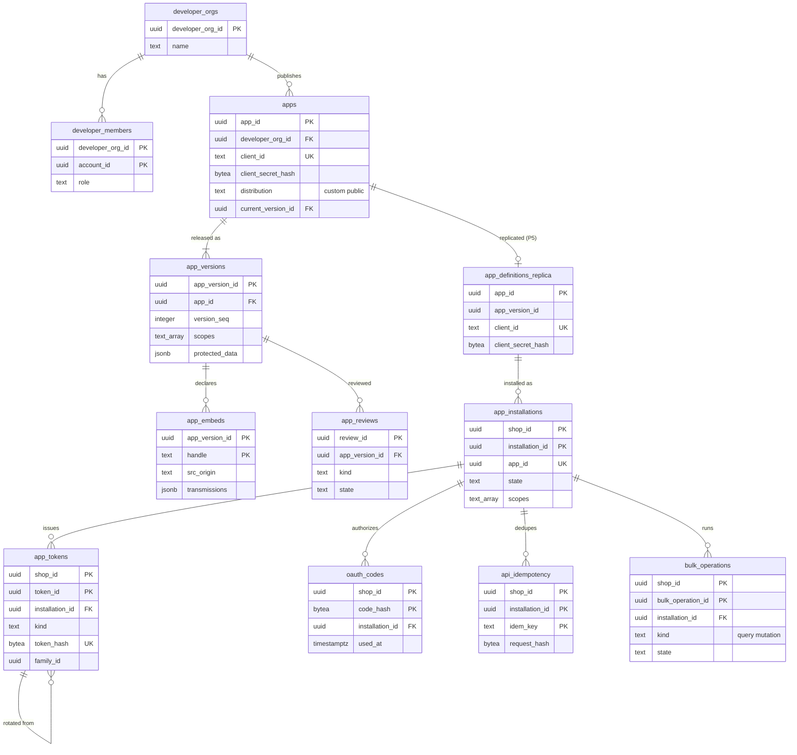

# Data model: アプリと Admin API

[data-model.md](../data-model.md) の一部。規約はそちらの 3 節に従う。振る舞いは [app-platform-and-apis.md](../app-platform-and-apis.md)（4〜7・9 節）を正とする。決定は [ADR-0009](../../decisions/0009-admin-api-graphql-and-cost-limits.md)（Admin API、費用、一括の操作）、[ADR-0054](../../decisions/0054-oauth-install-and-expiring-tokens.md)（OAuth、期限つきのトークン）、[ADR-0055](../../decisions/0055-scopes-and-protected-customer-data.md)（スコープと保護のデータ）、[ADR-0056](../../decisions/0056-admin-embedding-and-session-tokens.md)（埋め込み）。課金は [billing.md](billing.md)、関数は [functions.md](functions.md)、Webhook は [webhooks.md](webhooks.md)。

| 表 | 置き場所 | 書く |
| --- | --- | --- |
| `developer_orgs`、`developer_members`、`apps`、`app_versions`、`app_embeds`、`app_reviews` | 全体 `registry` | `app-registry` |
| `app_definitions_replica` | ポッド `sys`（P5） | `workers`（P5 の当て） |
| `app_installations`、`app_tokens`、`oauth_codes` | ポッド `public` | `admin-api`（OAuth） |
| `api_idempotency`、`bulk_operations` | ポッド `public` | `admin-api`、`workers`（一括の操作） |

- 全体の `registry` の表は、開発者の画面の経路だけ RLS（`developer_org_id = current_setting('app.developer_org_id')::uuid`）を付ける（D-2）。審査と P5 の配りは `app-registry` のシステムのロールで読む。
- `developer_members`・`app_reviews` はこの工程で最小の形を決めた（D-19）。
- アクセストークン・リフレッシュトークン・`client_secret`・Storefront のトークンは 256 ビットの乱数で、SHA-256 のハッシュだけを持つ（[security.md](../security.md) の 5.4 節）。

## 1. ER 図

- `apps` → `app_definitions_replica`、写し → `app_installations` は別の DB をまたぐ（写しへの外部キーは張らない。導入の作成で写しの存在を確かめる）。
- `app_tokens` の自分への線は、リフレッシュトークンの入れ替えの元（`rotated_from`、任意）。
- `developer_members.account_id` は全体の `identity.accounts` を指す（同じ全体の DB の別のスキーマ。外部キーを張る）。

## 2. 表

### 2.1 `developer_orgs`・`developer_members`（全体 `registry`）

| `developer_orgs` の列 | 型 | NULL | 既定 | 説明 |
| --- | --- | --- | --- | --- |
| `developer_org_id` | `uuid` | NOT NULL | `uuidv7()` | |
| `name` | `text` | NOT NULL | — | |
| `contact_email` | `text` | NOT NULL | — | Webhook の停止・トークンの漏れの知らせの宛先 |
| `created_at` | `timestamptz` | NOT NULL | `now()` | |

| `developer_members` の列 | 型 | NULL | 既定 | 説明 |
| --- | --- | --- | --- | --- |
| `developer_org_id`・`account_id` | `uuid` | NOT NULL | — | |
| `role` | `text` | NOT NULL | `'member'` | `admin`・`member` |
| `joined_at` | `timestamptz` | NOT NULL | `now()` | |

- キー：`developer_members` PK `(developer_org_id, account_id)`、FK → `developer_orgs`・`identity.accounts`。支払いの先（L5）は持たない。S1 の量：組織 数千、メンバー 数万。

### 2.2 `apps`（全体 `registry`）

| 列 | 型 | NULL | 既定 | 説明 |
| --- | --- | --- | --- | --- |
| `app_id` | `uuid` | NOT NULL | `uuidv7()` | |
| `developer_org_id` | `uuid` | NOT NULL | — | |
| `handle` | `text` | NOT NULL | — | |
| `name` | `text` | NOT NULL | — | |
| `client_id` | `text` | NOT NULL | — | 公開の ID |
| `client_secret_hash` | `bytea` | NOT NULL | — | SHA-256 |
| `webhook_secret_ciphertext` | `text[]` | NOT NULL | — | Webhook の署名の秘密（今と前の 2 つまで。`kms-global-storage` の封筒の暗号） |
| `webhook_secret_rotated_at` | `timestamptz` | NULL | — | 前の秘密は 24 時間で消す |
| `distribution` | `text` | NOT NULL | — | `custom`・`public` |
| `custom_shop_id` | `uuid` | NULL | — | `custom` の 1 つのショップ |
| `current_version_id` | `uuid` | NULL | — | 最新の公開したバージョン |
| `state` | `text` | NOT NULL | `'active'` | `active`・`suspended`（`ops.app_suspended` と同じ効き）・`delisted` |
| `created_at`・`updated_at` | `timestamptz` | NOT NULL | `now()` | |

- キー：PK `app_id`。UK `client_id`。UK `(developer_org_id, handle)`。FK → `developer_orgs`、`app_versions`（`current_version_id`、`DEFERRABLE`）。
- CHECK：`cardinality(webhook_secret_ciphertext) BETWEEN 1 AND 2`、`distribution = 'public' OR custom_shop_id IS NOT NULL`。
- RLS：開発者の経路だけ（上の注記）。S1 の量：約 1 万行。

### 2.3 `app_versions`（全体 `registry`）

不変のアプリのバージョン。スコープを増やすバージョンは、事業者の再承認まで増やした分を効かせない。

| 列 | 型 | NULL | 既定 | 説明 |
| --- | --- | --- | --- | --- |
| `app_version_id` | `uuid` | NOT NULL | `uuidv7()` | |
| `app_id` | `uuid` | NOT NULL | — | |
| `version_seq` | `integer` | NOT NULL | — | |
| `app_url` | `text` | NOT NULL | — | 導入の入口、埋め込みの起点 |
| `redirect_uris` | `text[]` | NOT NULL | — | 完全一致だけ |
| `scopes` | `text[]` | NOT NULL | — | `read_products` の形 |
| `protected_data` | `jsonb` | NOT NULL | `'{"level":0}'` | 段階（0〜2）、段階 2 の項目（`NAME`・`EMAIL`・`PHONE`・`ADDRESS`）、申請の理由 |
| `webhook_declarations` | `jsonb` | NOT NULL | `'[]'` | 宣言の購読（話題、送り先、API のバージョン、絞り込み、項目の選択） |
| `billing_plans` | `jsonb` | NOT NULL | `'[]'` | 課金の計画（表示用。実際の購読はポッドの行） |
| `released_at` | `timestamptz` | NULL | — | |
| `created_at` | `timestamptz` | NOT NULL | `now()` | |

- キー：PK `app_version_id`。UK `(app_id, version_seq)`。FK → `apps`。UPDATE を拒む（`released_at` を入れる 1 回を除く）。
- 関数は `app_functions`（[functions.md](functions.md)）、埋め込みは `app_embeds` に持つ。S1 の量：約 10 万行。

### 2.4 `app_embeds`（全体 `registry`）

アプリの埋め込み（ストアフロントのスクリプト）の配信元と、送信先と目的の宣言（[ADR-0048](../../decisions/0048-storefront-scripts-csp-and-external-transmission.md)）。

| 列 | 型 | NULL | 既定 | 説明 |
| --- | --- | --- | --- | --- |
| `app_version_id` | `uuid` | NOT NULL | — | |
| `handle` | `text` | NOT NULL | — | |
| `kind` | `text` | NOT NULL | — | `script`・`block` |
| `src_origin` | `text` | NOT NULL | — | CSP の `script-src` に入る起点 |
| `script_url` | `text` | NOT NULL | — | |
| `category` | `text` | NOT NULL | — | `required`・`analytics`・`ads` |
| `transmissions` | `jsonb` | NOT NULL | — | 送信先と目的の一覧（外部送信の公表。L6） |

- キー：PK `(app_version_id, handle)`。FK → `app_versions`。S1 の量：数万行。

### 2.5 `app_reviews`（全体 `registry`）

公開のアプリの一覧への掲載と、保護のデータの段階 2 の審査（[ADR-0055](../../decisions/0055-scopes-and-protected-customer-data.md)）。

| 列 | 型 | NULL | 既定 | 説明 |
| --- | --- | --- | --- | --- |
| `review_id` | `uuid` | NOT NULL | `uuidv7()` | |
| `app_version_id` | `uuid` | NOT NULL | — | |
| `kind` | `text` | NOT NULL | — | `listing`・`protected_data_level2` |
| `state` | `text` | NOT NULL | `'pending'` | `pending`・`approved`・`rejected` |
| `declarations` | `jsonb` | NOT NULL | — | 保持の期間、削除の依頼への対応、暗号化の宣言 |
| `reviewer_id` | `text` | NULL | — | 運用者 |
| `notes` | `text` | NULL | — | |
| `created_at`・`decided_at` | `timestamptz` | — | — | |

- キー：PK `review_id`。UK `(app_version_id, kind) WHERE state <> 'rejected'`。段階 2 の承認は `release.protected-data-level2` の裏（L3）。S1 の量：数万行。

### 2.6 `app_definitions_replica`（ポッド `sys`、P5）

トークンの発行とスコープの判定に要る列だけの写し（[ADR-0010](../../decisions/0010-shop-routing-hot-set-and-custom-domains.md)）。ショップのデータの列を持たない。

| 列 | 型 | NULL | 既定 | 説明 |
| --- | --- | --- | --- | --- |
| `app_id` | `uuid` | NOT NULL | — | |
| `app_version_id` | `uuid` | NOT NULL | — | 最新のバージョン |
| `client_id` | `text` | NOT NULL | — | |
| `client_secret_hash` | `bytea` | NOT NULL | — | 定数時間で比べる |
| `name`・`app_url` | `text` | NOT NULL | — | |
| `redirect_uris` | `text[]` | NOT NULL | — | |
| `scopes` | `text[]` | NOT NULL | — | |
| `protected_data` | `jsonb` | NOT NULL | — | |
| `frame_origin` | `text` | NOT NULL | — | 管理画面の `frame-src` |
| `embed_origins` | `text[]` | NOT NULL | `'{}'` | ストアフロントの CSP |
| `webhook_declarations` | `jsonb` | NOT NULL | — | 導入の時に購読の行へ展開する（D-9） |
| `distribution` | `text` | NOT NULL | — | |
| `custom_shop_id` | `uuid` | NULL | — | |
| `state` | `text` | NOT NULL | — | |
| `source_version` | `bigint` | NOT NULL | — | 全体の配りの番号。小さい事象を捨てる |
| `replicated_at` | `timestamptz` | NOT NULL | `now()` | |

- キー：PK `app_id`。UK `client_id`。RLS：なし（`sys`）。全ポッドに全アプリの行（S1 で約 1 万行）。

### 2.7 `app_installations`（ポッド）

導入。状態：`pending`・`active`・`suspended`・`uninstalled`・`redacted`。

| 列 | 型 | NULL | 既定 | 説明 |
| --- | --- | --- | --- | --- |
| `shop_id`・`installation_id` | `uuid` | NOT NULL | `installation_id` は `uuidv7()` | |
| `app_id` | `uuid` | NOT NULL | — | |
| `app_version_id` | `uuid` | NOT NULL | — | 承認したバージョン |
| `state` | `text` | NOT NULL | `'pending'` | |
| `scopes` | `text[]` | NOT NULL | — | 承認したスコープ |
| `protected_data` | `jsonb` | NOT NULL | `'{"level":0}'` | 承認した段階と項目 |
| `first_party` | `boolean` | NOT NULL | `false` | 自社のアプリ（管理画面）。同じ費用とバケットを使う |
| `approved_by` | `uuid` | NULL | — | `apps_manage` のスタッフ |
| `installed_at`・`uninstalled_at` | `timestamptz` | NULL | — | |
| `redact_due_at` | `timestamptz` | NULL | — | 削除の 48 時間後に `shop/redact` を送る |
| `updated_at` | `timestamptz` | NOT NULL | `now()` | |

- キー：PK `(shop_id, installation_id)`。UK `(shop_id, app_id)`。
- CHECK：`state IN (…)`、`state <> 'uninstalled' OR uninstalled_at IS NOT NULL`。
- 削除の 1 つのトランザクション：導入を `uninstalled`、トークンを全部取り消し、購読を消し、関数の設定を外し、outbox に `app/uninstalled`（Valkey の写しは 5 秒以内に消す）。
- 保持：`redacted` の 30 日後に消す。S1 の量：約 30 万行。

### 2.8 `app_tokens`（ポッド）

| 列 | 型 | NULL | 既定 | 説明 |
| --- | --- | --- | --- | --- |
| `shop_id`・`token_id` | `uuid` | NOT NULL | `token_id` は `uuidv7()` | |
| `installation_id` | `uuid` | NOT NULL | — | |
| `kind` | `text` | NOT NULL | — | `offline_access`（1 時間）・`online_access`（1 時間、スタッフ）・`admin_ui`（自社のアプリ、15 分）・`refresh`（90 日） |
| `token_hash` | `bytea` | NOT NULL | — | SHA-256 |
| `family_id` | `uuid` | NOT NULL | — | 同じ導入の一式（再利用の検出で一式を取り消す） |
| `staff_account_id` | `uuid` | NULL | — | オンラインのトークン |
| `scopes` | `text[]` | NOT NULL | — | 発行の時の効く範囲（オンラインはスコープと権限の交わりを実行の時に計算） |
| `expires_at` | `timestamptz` | NOT NULL | — | |
| `rotated_from` | `uuid` | NULL | — | 入れ替えの元のリフレッシュトークン |
| `used_at` | `timestamptz` | NULL | — | リフレッシュトークンの使用（2 回目は盗難の印） |
| `revoked_at` | `timestamptz` | NULL | — | |
| `revoke_reason` | `text` | NULL | — | `uninstalled`・`reuse_detected`・`leak_report`・`staff_removed`・`code_reuse` |
| `created_at` | `timestamptz` | NOT NULL | `now()` | |

- キー：PK `(shop_id, token_id)`。UK `token_hash`（ショップをまたいで一意）。要求は URL のホストのショップで `SET LOCAL app.shop_id` してからハッシュで引く。別のショップのトークンは RLS で見えず 0 行になり 401（[ADR-0003](../../decisions/0003-tenancy-and-rls.md) の「URL のショップと一致しなければ 401」と同じ結果）。FK → `app_installations`（`ON DELETE CASCADE`）。
- 索引：`(shop_id, family_id) WHERE revoked_at IS NULL` — 一式の取り消し。`(expires_at)` — 掃除。
- CHECK：`kind IN (…)`、`octet_length(token_hash) = 32`、`kind NOT IN ('online_access','admin_ui') OR staff_account_id IS NOT NULL`。
- 読み出しは Valkey の写し（`{<shop_id>}:tok:<hash>`、60 秒）を先に見る。保持：期限か取り消しの 1 日後に消す。S1 の量：約 300 万行。

### 2.9 `oauth_codes`（ポッド）

| 列 | 型 | NULL | 既定 | 説明 |
| --- | --- | --- | --- | --- |
| `shop_id` | `uuid` | NOT NULL | — | |
| `code_hash` | `bytea` | NOT NULL | — | |
| `installation_id` | `uuid` | NOT NULL | — | |
| `redirect_uri` | `text` | NOT NULL | — | |
| `scopes` | `text[]` | NOT NULL | — | |
| `staff_account_id` | `uuid` | NOT NULL | — | 承認した人 |
| `expires_at` | `timestamptz` | NOT NULL | `now() + interval '60 seconds'` | |
| `used_at` | `timestamptz` | NULL | — | 2 回目の使用で、このコードから出したトークンを全部取り消す |
| `issued_family_id` | `uuid` | NULL | — | |

- キー：PK `(shop_id, code_hash)`。FK → `app_installations`。保持：1 日。S1 の量：数千行。

### 2.10 `api_idempotency`（ポッド）

Admin API のミューテーションの `Idempotency-Key`（24 時間）。

| 列 | 型 | NULL | 既定 | 説明 |
| --- | --- | --- | --- | --- |
| `shop_id`・`installation_id` | `uuid` | NOT NULL | — | |
| `idem_key` | `text` | NOT NULL | — | 255 文字まで |
| `request_hash` | `bytea` | NOT NULL | — | 本文の SHA-256（違えば `IDEMPOTENCY_CONFLICT`） |
| `response` | `jsonb` | NOT NULL | — | |
| `created_at` | `timestamptz` | NOT NULL | `now()` | |
| `expires_at` | `timestamptz` | NOT NULL | `now() + interval '24 hours'` | |

- キー：PK `(shop_id, installation_id, idem_key)`。索引：`(expires_at)` — 掃除。保持：24 時間。S1 の量：約 1,000 万行（24 時間分）。

### 2.11 `bulk_operations`（ポッド）

状態：`created`・`running`・`completed`・`failed`・`canceled`。24 時間で止める。

| 列 | 型 | NULL | 既定 | 説明 |
| --- | --- | --- | --- | --- |
| `shop_id`・`bulk_operation_id` | `uuid` | NOT NULL | `bulk_operation_id` は `uuidv7()` | |
| `installation_id` | `uuid` | NOT NULL | — | |
| `kind` | `text` | NOT NULL | — | `query`・`mutation` |
| `state` | `text` | NOT NULL | `'created'` | |
| `query` | `text` | NOT NULL | — | |
| `input_s3_key` | `text` | NULL | — | 書き込みの JSONL |
| `s3_key` | `text` | NULL | — | 結果 `shops/<shop_id>/bulk/<id>.jsonl` |
| `cursor` | `jsonb` | NULL | — | 再開の位置 |
| `row_count` | `bigint` | NOT NULL | `0` | |
| `error_code` | `text` | NULL | — | `TIMEOUT` など |
| `created_at`・`started_at`・`completed_at` | `timestamptz` | — | — | |
| `url_expires_at` | `timestamptz` | NULL | — | 7 日（顧客を含む結果は 1 時間） |

- キー：PK `(shop_id, bulk_operation_id)`。UK `(shop_id, installation_id, kind) WHERE state IN ('created','running')`（アプリとショップの組ごとに読み出し 1・書き込み 1）。
- 保持：30 日（結果は 7 日）。S1 の量：約 50 万行。
