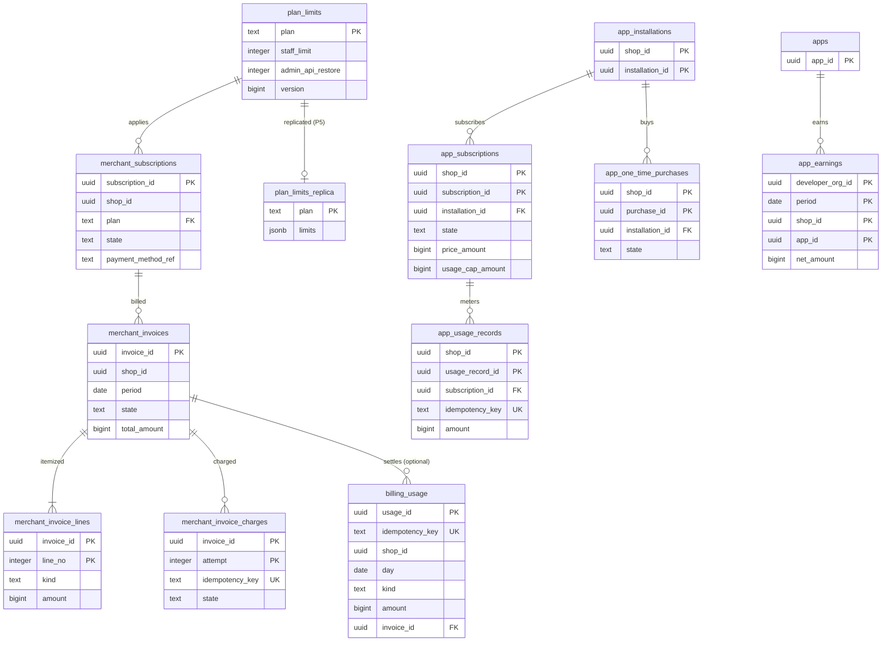

# Data model: 事業者への請求とアプリの課金

[data-model.md](../data-model.md) の一部。規約はそちらの 3 節に従う。振る舞いは [merchant-admin-and-staff.md](../merchant-admin-and-staff.md)（8 節）と [app-platform-and-apis.md](../app-platform-and-apis.md)（8 節）を正とする。決定は [ADR-0057](../../decisions/0057-app-billing.md)（アプリの課金）、[ADR-0065](../../decisions/0065-merchant-billing-plans-and-usage.md)（プラン、利用量、事業者への請求）。

| 表 | 置き場所 | 書く |
| --- | --- | --- |
| `plan_limits`、`merchant_subscriptions`、`billing_usage`、`merchant_invoices`、`merchant_invoice_lines`、`merchant_invoice_charges`、`app_earnings` | 全体 `billing` | `billing` |
| `plan_limits_replica` | ポッド `sys`（P5） | `workers` |
| `app_subscriptions`、`app_usage_records`、`app_one_time_purchases` | ポッド `public` | `admin-api`（作成・承認）、`workers`（期間の更新、日次の利用量の P3） |

- 全体の表はショップの ID と額と数だけを持つ（ショップの商品・顧客のデータでない）。
- 金額は JPY の整数。本システムの請求の税の扱いとインボイスの形、アプリの代金の受け取りと開発者への支払いの法的な位置づけは法務の確認待ち（L4・L5）。支払いの実行は L5 まで手で行い、表は台帳の締めまで。
- `merchant_invoice_charges` はこの工程で足した（冪等キー `<invoice_id>:charge:<attempt>` の請求の試みの置き場所。D-19）。

## 1. ER 図

- `merchant_invoices` → `billing_usage` は任意の参照：締めの前の利用量は請求に属さない（`invoice_id` が NULL）。締めで 1 つの請求に結ぶ。
- `merchant_subscriptions.shop_id`・`merchant_invoices.shop_id` は全体の `directory.shops` を指す（同じ全体の DB。外部キーを張る）。
- ポッドの `app_subscriptions` などから全体の `billing_usage` へは P3（SNS の利用量の事象）で、外部キーの関係はない。

## 2. 表

### 2.1 `plan_limits`（全体 `billing`）・`plan_limits_replica`（ポッド `sys`）

プランの上限の正本（[ADR-0065](../../decisions/0065-merchant-billing-plans-and-usage.md)）。値は [shops-and-pods.md](../shops-and-pods.md) の 11 節と [ADR-0009](../../decisions/0009-admin-api-graphql-and-cost-limits.md)。

| 列 | 型 | NULL | 既定 | 説明 |
| --- | --- | --- | --- | --- |
| `plan` | `text` | NOT NULL | — | `basic`・`advanced`・`plus` |
| `monthly_price_amount` | `bigint` | NOT NULL | — | PM が決める |
| `staff_limit` | `integer` | NOT NULL | — | 5・15・1,000 |
| `admin_api_restore`・`admin_api_capacity` | `integer` | NOT NULL | — | 100・1,000、200・2,000、1,000・10,000 |
| `admin_api_shop_total_restore` | `integer` | NOT NULL | — | 回復の 5 倍 |
| `storefront_rate`・`storefront_burst` | `integer` | NOT NULL | — | 元への要求のトークンバケット |
| `checkout_concurrency` | `integer` | NOT NULL | — | 50・50・100 |
| `checkout_create_rate`・`checkout_create_burst` | `integer` | NOT NULL | — | |
| `db_concurrency` | `integer` | NOT NULL | — | 8・12・24 |
| `job_concurrency` | `integer` | NOT NULL | — | 4・8・16 |
| `products_limit` | `integer` | NOT NULL | — | |
| `features` | `text[]` | NOT NULL | `'{}'` | `sso`、`organizations`、`reports` |
| `version` | `bigint` | NOT NULL | — | P5 の写しの番号 |

- キー：PK `plan`。写しは `plan`・`limits jsonb`（上の列の値）・`version`・`replicated_at`。隔離のポッドの値はプランでなくポッドの設定（AppConfig）で上書きする。S1 の量：3 行。

### 2.2 `merchant_subscriptions`（全体 `billing`）

| 列 | 型 | NULL | 既定 | 説明 |
| --- | --- | --- | --- | --- |
| `subscription_id` | `uuid` | NOT NULL | `uuidv7()` | |
| `shop_id` | `uuid` | NOT NULL | — | |
| `plan` | `text` | NOT NULL | — | |
| `state` | `text` | NOT NULL | `'trialing'` | `trialing`・`active`・`past_due`・`cancelled` |
| `provider` | `text` | NULL | — | 本システムの請求の決済の提供者 |
| `provider_customer_ref` | `text` | NULL | — | 提供者の顧客の参照（カード番号を持たない） |
| `payment_method_ref` | `text` | NULL | — | 預けた支払いの手段の参照 |
| `pending_plan` | `text` | NULL | — | 下げる変更（次の締めから） |
| `current_period_start` | `date` | NOT NULL | — | |
| `started_at`・`cancelled_at` | `timestamptz` | — | — | |

- キー：PK `subscription_id`。UK `(shop_id) WHERE state <> 'cancelled'`。FK → `plan_limits`、`directory.shops`。
- 変更は同じトランザクションで `directory.shops.plan` の写しを更新する。ポッドの `shop_settings.plan` へは `shop/lifecycle` と同じ事象で写す。S1 の量：約 10 万行。

### 2.3 `billing_usage`（全体 `billing`）

ポッドの日次の利用量（アプリの課金、従量）。P3 の事象を冪等キーで重複を除いて入れる。

| 列 | 型 | NULL | 既定 | 説明 |
| --- | --- | --- | --- | --- |
| `usage_id` | `uuid` | NOT NULL | `uuidv7()` | |
| `idempotency_key` | `text` | NOT NULL | — | `<shop_id>:<day>:<kind>:<ref>` |
| `shop_id` | `uuid` | NOT NULL | — | |
| `day` | `date` | NOT NULL | — | 日本時間 |
| `kind` | `text` | NOT NULL | — | `app_subscription`・`app_usage`・`app_one_time`・`plan_proration` |
| `ref_id` | `uuid` | NULL | — | ポッドの購読・記録の ID |
| `app_id` | `uuid` | NULL | — | |
| `quantity` | `bigint` | NOT NULL | `1` | |
| `amount` | `bigint` | NOT NULL | — | |
| `currency` | `text` | NOT NULL | `'JPY'` | |
| `source_pod_id` | `text` | NOT NULL | — | |
| `invoice_id` | `uuid` | NULL | — | 締めで結ぶ。締めの後に届いた事象は翌月 |
| `received_at` | `timestamptz` | NOT NULL | `now()` | |

- キー：PK `usage_id`。UK `idempotency_key`。索引：`(shop_id, day)` — 締め（領域の文書の `(shop_id, period)`）。`(invoice_id)`。
- CHECK：`amount >= 0`。保持：法令の保存の期間（L4）。S1 の量：約 300 万行/年。

### 2.4 `merchant_invoices`・`merchant_invoice_lines`（全体 `billing`）

毎月 1 日 03:00 の締め。行は不変で、直しは訂正の行を足す。

| `merchant_invoices` の列 | 型 | NULL | 既定 | 説明 |
| --- | --- | --- | --- | --- |
| `invoice_id` | `uuid` | NOT NULL | `uuidv7()` | |
| `shop_id` | `uuid` | NOT NULL | — | |
| `period` | `date` | NOT NULL | — | 月の初日 |
| `number` | `text` | NOT NULL | — | 本システムの請求の番号 |
| `state` | `text` | NOT NULL | `'open'` | `open`・`paid`・`past_due`・`uncollectible` |
| `subtotal_amount`・`tax_amount`・`total_amount` | `bigint` | NOT NULL | — | 税の扱いは L4 |
| `currency` | `text` | NOT NULL | `'JPY'` | |
| `issued_at`・`due_at` | `timestamptz` | NOT NULL | — | |
| `paid_at` | `timestamptz` | NULL | — | |
| `unpaid_days_excluding_outage` | `integer` | NOT NULL | `0` | 未払い 14 日で `frozen`（提供者の障害の日は数えない） |

| `merchant_invoice_lines` の列 | 型 | NULL | 既定 | 説明 |
| --- | --- | --- | --- | --- |
| `invoice_id` | `uuid` | NOT NULL | — | |
| `line_no` | `integer` | NOT NULL | — | |
| `kind` | `text` | NOT NULL | — | `plan`・`plan_proration`・`app_subscription`・`app_usage`・`app_one_time`・`correction` |
| `ref_id` | `uuid` | NULL | — | |
| `description` | `text` | NOT NULL | — | |
| `amount` | `bigint` | NOT NULL | — | 訂正は負を許す |
| `corrects_line_no` | `integer` | NULL | — | |

- キー：`merchant_invoices` PK `invoice_id`、UK `(shop_id, period)`、UK `number`。`merchant_invoice_lines` PK `(invoice_id, line_no)`、FK → `merchant_invoices`。
- CHECK：`total_amount = subtotal_amount + tax_amount`、`kind <> 'correction' OR corrects_line_no IS NOT NULL`。行の UPDATE・DELETE を拒む。
- 保持：法令の保存の期間（ショップの削除の後も残す。L4）。S1 の量：請求 約 5 万行/月、行 約 20 万行/月。

### 2.5 `merchant_invoice_charges`（全体 `billing`）

請求の試み（1・3・7 日に再試行）。

| 列 | 型 | NULL | 既定 | 説明 |
| --- | --- | --- | --- | --- |
| `invoice_id` | `uuid` | NOT NULL | — | |
| `attempt` | `integer` | NOT NULL | — | |
| `idempotency_key` | `text` | NOT NULL | — | `<invoice_id>:charge:<attempt>` |
| `state` | `text` | NOT NULL | `'sent'` | `sent`・`succeeded`・`failed`・`unknown` |
| `provider_ref` | `text` | NULL | — | |
| `failure_reason` | `text` | NULL | — | |
| `provider_outage` | `boolean` | NOT NULL | `false` | 未払いの日数に数えない |
| `attempted_at` | `timestamptz` | NOT NULL | `now()` | |

- キー：PK `(invoice_id, attempt)`。UK `idempotency_key`。FK → `merchant_invoices`。S1 の量：約 7 万行/月。

### 2.6 `app_earnings`（全体 `billing`）

開発者の取り分の台帳（ショップの ID と額だけ）。月次で締める。

| 列 | 型 | NULL | 既定 | 説明 |
| --- | --- | --- | --- | --- |
| `developer_org_id` | `uuid` | NOT NULL | — | |
| `period` | `date` | NOT NULL | — | 月の初日 |
| `shop_id`・`app_id` | `uuid` | NOT NULL | — | |
| `gross_amount`・`fee_amount`・`net_amount` | `bigint` | NOT NULL | — | |
| `currency` | `text` | NOT NULL | `'JPY'` | |
| `state` | `text` | NOT NULL | `'open'` | `open`・`closed`・`paid_manually` |

- キー：PK `(developer_org_id, period, shop_id, app_id)`。FK → `registry.developer_orgs`、`registry.apps`。CHECK：`net_amount = gross_amount - fee_amount`。S1 の量：約 20 万行/月。

### 2.7 `app_subscriptions`（ポッド）

アプリの定額の購読（30 日）と従量の上限。状態：`pending`・`active`・`declined`・`expired`・`frozen`・`cancelled`。

| 列 | 型 | NULL | 既定 | 説明 |
| --- | --- | --- | --- | --- |
| `shop_id`・`subscription_id` | `uuid` | NOT NULL | `subscription_id` は `uuidv7()` | |
| `installation_id` | `uuid` | NOT NULL | — | |
| `app_id` | `uuid` | NOT NULL | — | |
| `name` | `text` | NOT NULL | — | |
| `price_amount` | `bigint` | NOT NULL | — | 30 日ごと |
| `currency` | `text` | NOT NULL | `'JPY'` | |
| `trial_days` | `integer` | NOT NULL | `0` | |
| `usage_cap_amount` | `bigint` | NULL | — | 従量の期間の上限の額 |
| `state` | `text` | NOT NULL | `'pending'` | |
| `confirmation_expires_at` | `timestamptz` | NOT NULL | — | 作成から 48 時間 |
| `approved_by` | `uuid` | NULL | — | `apps_billing` のスタッフ |
| `current_period_start`・`current_period_end` | `timestamptz` | NULL | — | |
| `created_at`・`updated_at` | `timestamptz` | NOT NULL | `now()` | |

- キー：PK `(shop_id, subscription_id)`。FK → `app_installations`。UK `(shop_id, installation_id) WHERE state IN ('active','frozen')`（有効な購読は 1 つ）。
- CHECK：`price_amount >= 0`、`usage_cap_amount IS NULL OR usage_cap_amount > 0`、`state IN (…)`。S1 の量：約 20 万行。

### 2.8 `app_usage_records`（ポッド）

| 列 | 型 | NULL | 既定 | 説明 |
| --- | --- | --- | --- | --- |
| `shop_id`・`usage_record_id` | `uuid` | NOT NULL | `usage_record_id` は `uuidv7()` | |
| `subscription_id` | `uuid` | NOT NULL | — | |
| `idempotency_key` | `text` | NOT NULL | — | アプリが付ける |
| `amount` | `bigint` | NOT NULL | — | |
| `description` | `text` | NOT NULL | — | |
| `period_start` | `timestamptz` | NOT NULL | — | 属する期間 |
| `created_at` | `timestamptz` | NOT NULL | `now()` | |

- キー：PK `(shop_id, usage_record_id)`。UK `(shop_id, subscription_id, idempotency_key)`。FK → `app_subscriptions`。
- 上限：期間の和が `usage_cap_amount` を超える記録は拒む（購読の行を `FOR UPDATE` で取って確かめる）。CHECK：`amount > 0`。保持：2 年。S1 の量：約 500 万行/年。

### 2.9 `app_one_time_purchases`（ポッド）

| 列 | 型 | NULL | 既定 | 説明 |
| --- | --- | --- | --- | --- |
| `shop_id`・`purchase_id` | `uuid` | NOT NULL | `purchase_id` は `uuidv7()` | |
| `installation_id` | `uuid` | NOT NULL | — | |
| `name` | `text` | NOT NULL | — | |
| `price_amount` | `bigint` | NOT NULL | — | |
| `currency` | `text` | NOT NULL | `'JPY'` | |
| `state` | `text` | NOT NULL | `'pending'` | `pending`・`active`（承認）・`declined`・`expired` |
| `approved_by` | `uuid` | NULL | — | |
| `created_at`・`decided_at` | `timestamptz` | — | — | |

- キー：PK `(shop_id, purchase_id)`。FK → `app_installations`。S1 の量：数十万行。
