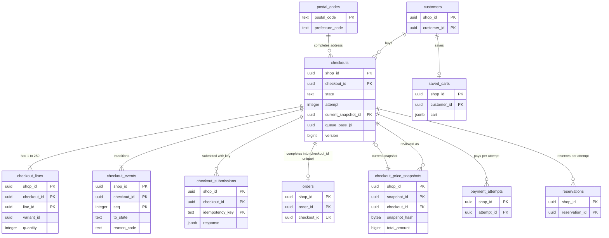

# Data model: カートとチェックアウト

[data-model.md](../data-model.md) の一部。規約はそちらの 3 節に従う。振る舞いは [cart-and-checkout.md](../cart-and-checkout.md)（4〜10 節）を正とする。決定は [ADR-0005](../../decisions/0005-checkout-state-machine-and-exactly-once-orders.md)（状態の機械と 1 回の注文）、[ADR-0028](../../decisions/0028-cart-storage-in-valkey.md)（カートは Valkey）、[ADR-0029](../../decisions/0029-checkout-completion-decision-table.md)（完了の決定表）、[ADR-0030](../../decisions/0030-price-snapshot-and-final-confirmation.md)（価格の写し）、[ADR-0031](../../decisions/0031-checkout-admission-limits.md)（入口の上限）。カートの値（Valkey）と価格の写しの JSON の形は [stores.md](stores.md)。

| 表 | 置き場所 | 書く |
| --- | --- | --- |
| `checkouts`、`checkout_lines`、`checkout_events`、`checkout_price_snapshots`、`checkout_submissions` | ポッド `public` | `checkout`（`packages/checkout` の `transition()` だけが状態を書く）、`workers`（`checkout-reconciler`） |
| `final_confirmation_fields` | ポッド `public` | `admin-api`（L1 の確認の後） |
| `saved_carts` | ポッド `public` | `workers`（30 分ごとの写し） |
| `postal_codes` | 全体 `ref`、ポッド `sys`（P5 の参照のデータの写し） | 本システムの運用 |

- カートの正本は Valkey（`{<shop_id>}:cart:<cart_token>`、14 日）。ログインした買い手のカートだけ 30 分ごとに `saved_carts` へ写す。
- 買い手の個人のデータ（メール、電話、住所、氏名）は列の暗号（[ADR-0066](../../decisions/0066-encryption-and-key-layout.md)）。都道府県は拠点の選び方と送料と保護のデータの段階 0 に使うので、暗号化しない列にも持つ。

## 1. ER 図

- `orders.checkout_id` は一意なので、チェックアウトから注文は 0 か 1（`||--o|`）。注文 → チェックアウトは論理の参照で、外部キーを張らない（チェックアウトは保持の期限で消す。D-15）。
- `checkouts.current_snapshot_id` → `checkout_price_snapshots` は任意の参照（`DEFERRABLE` の外部キー）。
- `customers` → `checkouts` は任意（ログインしていない買い手は NULL）。`postal_codes` は補完の材料で、論理の参照。

## 2. 表

### 2.1 `checkouts`

状態：`open`・`payment_pending`・`completed`・`refund_required`・`refunded`・`expired`・`abandoned`（[ADR-0005](../../decisions/0005-checkout-state-machine-and-exactly-once-orders.md)）。

| 列 | 型 | NULL | 既定 | 説明 |
| --- | --- | --- | --- | --- |
| `shop_id`・`checkout_id` | `uuid` | NOT NULL | `checkout_id` は `uuidv7()` | |
| `state` | `text` | NOT NULL | `'open'` | |
| `attempt` | `integer` | NOT NULL | `1` | 決済の失敗・取り消しで 1 上げる。1 チェックアウト 5 回まで（カードテストの守り） |
| `cart_token_hash` | `bytea` | NOT NULL | — | 写しの元のカートの鍵の SHA-256 |
| `customer_id` | `uuid` | NULL | — | |
| `email_ciphertext` | `text` | NULL | — | D1 |
| `email_hmac` | `bytea` | NULL | — | 1 人あたりの上限・割引の買い手の鍵 |
| `phone_ciphertext` | `text` | NULL | — | D1 |
| `shipping_address_ciphertext` | `text` | NULL | — | 郵便番号・市区町村・番地・建物・氏名・電話（D1） |
| `shipping_prefecture_code` | `text` | NULL | — | 段階 0。拠点と送料 |
| `delivery_method_handle` | `text` | NULL | — | 送料の表の方法 |
| `delivery_date` | `date` | NULL | — | 配送の日時の指定 |
| `delivery_time_slot` | `text` | NULL | — | 運送会社の型の値 |
| `discount_codes` | `text[]` | NOT NULL | `'{}'` | 正規化したコード（商品・注文 5、送料 1） |
| `payment_method` | `text` | NULL | — | 選んだ手段（`card`・`konbini` など） |
| `market_id` | `uuid` | NOT NULL | — | |
| `currency` | `text` | NOT NULL | — | 表示と支払いの通貨 |
| `locale` | `text` | NOT NULL | — | |
| `fx_rate_id` | `uuid` | NULL | — | カートに入れた時の率（`converted` のとき） |
| `current_snapshot_id` | `uuid` | NULL | — | 今の価格の写し。確認の前の段の変更で NULL |
| `queue_pass_jti` | `uuid` | NULL | — | セールの許可証 |
| `sale_id` | `uuid` | NULL | — | |
| `version` | `bigint` | NOT NULL | `1` | 段の更新の比べて入れ替え |
| `submitted_at` | `timestamptz` | NULL | — | 送信（`payment_pending` への遷移）の時刻。照合の 5 分・60 分の起点 |
| `completed_at` | `timestamptz` | NULL | — | |
| `pii_purged_at` | `timestamptz` | NULL | — | D1 の列を消した時刻 |
| `created_at`・`updated_at` | `timestamptz` | NOT NULL | `now()` | |

- キー：PK `(shop_id, checkout_id)`。FK `(shop_id, current_snapshot_id)` → `checkout_price_snapshots`（`DEFERRABLE INITIALLY DEFERRED`）。
- 索引：
  - `(shop_id, state, updated_at)` — 領域の文書の索引。照合（5 分超の `payment_pending`、7 日の `open`）。
  - `(submitted_at) WHERE state IN ('payment_pending','refund_required')` — `checkout-reconciler` の発見（X1 の発見の索引。D-6）。
  - `(shop_id, customer_id, created_at) WHERE customer_id IS NOT NULL` — 買い手の進行中のチェックアウト。
- CHECK：
  - `state IN (…)`、`attempt BETWEEN 1 AND 5`
  - `state = 'open' OR submitted_at IS NOT NULL`
  - `state <> 'completed' OR completed_at IS NOT NULL`
  - `shipping_prefecture_code IS NULL OR shipping_prefecture_code ~ '^(0[1-9]|[1-3][0-9]|4[0-7])$'`
  - `pii_purged_at IS NULL OR (email_ciphertext IS NULL AND phone_ciphertext IS NULL AND shipping_address_ciphertext IS NULL)`
- トリガー：`state` の更新は `transition()` の関数の中だけ（セッションの変数 `app.checkout_transition = on` を確かめる）。`attempt` を下げる更新を拒む。
- 保持（D-15）：D1 の列は、放棄・期限切れから 30 日、完了・返金から 30 日で消す（注文は写しを持つ）。行は終わりの状態（`completed`・`refunded`・`expired`・`abandoned`）から 90 日で消す（子の行も消える）。L3 の確認待ち。
- RLS：テナントの表。S1 の量：約 300 万行/月、保持の内で約 1,000 万行。

### 2.2 `checkout_lines`

| 列 | 型 | NULL | 既定 | 説明 |
| --- | --- | --- | --- | --- |
| `shop_id`・`checkout_id`・`line_id` | `uuid` | NOT NULL | `line_id` は `uuidv7()` | |
| `variant_id` | `uuid` | NOT NULL | — | |
| `inventory_item_id` | `uuid` | NULL | — | 数えない品目は NULL |
| `quantity` | `integer` | NOT NULL | — | 1〜9,999 |
| `attributes` | `jsonb` | NOT NULL | `'{}'` | 行の属性（10 個・合計 4 KB） |
| `position` | `smallint` | NOT NULL | — | |

- キー：PK `(shop_id, checkout_id, line_id)`。FK → `checkouts`（`ON DELETE CASCADE`）。UK `(shop_id, checkout_id, position)`。
- CHECK：`quantity BETWEEN 1 AND 9999`、`pg_column_size(attributes) <= 4096`。1 チェックアウト 250 行（トリガー）。
- バリエーションへの外部キーは張らない（カートの後に消えたバリエーションは送信で拒む）。S1 の量：チェックアウトの 2.5 倍。

### 2.3 `checkout_events`

遷移の記録（追記だけ）。

| 列 | 型 | NULL | 既定 | 説明 |
| --- | --- | --- | --- | --- |
| `shop_id`・`checkout_id` | `uuid` | NOT NULL | — | |
| `seq` | `integer` | NOT NULL | — | チェックアウトの中の番号 |
| `from_state`・`to_state` | `text` | NOT NULL | — | |
| `event` | `text` | NOT NULL | — | `submit`・`payment_failed`・`buyer_cancel`・`complete`・`refund_required`・`refunded`・`expire`・`abandon` |
| `reason_code` | `text` | NULL | — | `purchase_limit_exceeded`・`discount_unavailable`・`out_of_stock`・`amount_mismatch` など |
| `dt_row` | `smallint` | NULL | — | 使った DT-CHK-001 の行（1〜11） |
| `attempt` | `integer` | NOT NULL | — | |
| `trigger` | `text` | NOT NULL | — | `buyer`・`redirect`・`webhook`・`reconciler`・`sweeper`・`staff` |
| `at` | `timestamptz` | NOT NULL | `now()` | |

- キー：PK `(shop_id, checkout_id, seq)`。FK → `checkouts`（`ON DELETE CASCADE`）。UPDATE をロールに与えない。
- CHECK：`dt_row IS NULL OR dt_row BETWEEN 1 AND 11`。保持：チェックアウトと同じ。S1 の量：チェックアウトの 3 倍。

### 2.4 `checkout_price_snapshots`

確認の段ごとの価格の写し（追記だけ）。正規の JSON とそのハッシュ（[ADR-0030](../../decisions/0030-price-snapshot-and-final-confirmation.md)）。

| 列 | 型 | NULL | 既定 | 説明 |
| --- | --- | --- | --- | --- |
| `shop_id`・`snapshot_id` | `uuid` | NOT NULL | `snapshot_id` は `uuidv7()` | |
| `checkout_id` | `uuid` | NOT NULL | — | |
| `attempt` | `integer` | NOT NULL | — | |
| `body` | `jsonb` | NOT NULL | — | 正規の JSON（[stores.md](stores.md) の 6 節の形）。個人のデータを含めない |
| `body_canonical` | `bytea` | NOT NULL | — | ハッシュを取ったバイト列（キーの順を固定した UTF-8）。`jsonb` は順を保たないので別に持つ |
| `snapshot_hash` | `bytea` | NOT NULL | — | `SHA-256(body_canonical)` |
| `total_amount` | `bigint` | NOT NULL | — | 決済の金額 |
| `currency` | `text` | NOT NULL | — | |
| `tax_rules_version` | `integer` | NOT NULL | — | |
| `rounding_mode` | `text` | NOT NULL | — | |
| `discount_refs` | `text[]` | NOT NULL | `'{}'` | `<discount_id>@<version>` |
| `catalog_versions` | `jsonb` | NOT NULL | — | 行の商品の `catalog_version`（送信の時の価格の確かめ） |
| `created_at` | `timestamptz` | NOT NULL | `now()` | |

- キー：PK `(shop_id, snapshot_id)`。FK `(shop_id, checkout_id)` → `checkouts`（`ON DELETE CASCADE`）。
- 索引：`(shop_id, checkout_id, created_at)`。
- CHECK：`octet_length(snapshot_hash) = 32`、`total_amount >= 0`。UPDATE を拒む（トリガー）。
- 保持：チェックアウトと同じ（注文は値と `snapshot_hash` を写す）。S1 の量：チェックアウトの 1.5 倍。

### 2.5 `checkout_submissions`

送信の冪等（[cart-and-checkout.md](../cart-and-checkout.md) の 5.3 節）。

| 列 | 型 | NULL | 既定 | 説明 |
| --- | --- | --- | --- | --- |
| `shop_id`・`checkout_id` | `uuid` | NOT NULL | — | |
| `idempotency_key` | `text` | NOT NULL | — | ブラウザが作る UUIDv4 |
| `attempt` | `integer` | NOT NULL | — | |
| `request_hash` | `bytea` | NOT NULL | — | `snapshot_hash` と本文の SHA-256 |
| `response_status` | `smallint` | NOT NULL | — | |
| `response` | `jsonb` | NOT NULL | — | リダイレクトの URL か入力部品の値（カード番号を含まない） |
| `expires_at` | `timestamptz` | NOT NULL | `now() + interval '24 hours'` | |

- キー：PK `(shop_id, checkout_id, idempotency_key)`。FK → `checkouts`（`ON DELETE CASCADE`）。
- 索引：`(expires_at)` — 掃除（X1 の発見の索引）。保持：24 時間。S1 の量：約 10 万行。

### 2.6 `final_confirmation_fields`

最終確認画面の枠の値（[ADR-0030](../../decisions/0030-price-snapshot-and-final-confirmation.md)）。出す事項・文言・配置は法務の確認待ち（L1）。関数・アプリは変えられない。

| 列 | 型 | NULL | 既定 | 説明 |
| --- | --- | --- | --- | --- |
| `shop_id` | `uuid` | NOT NULL | — | |
| `field` | `text` | NOT NULL | — | `quantity`・`price`・`payment_timing_method`・`delivery_timing`・`application_period`・`withdrawal_cancellation` |
| `source` | `text` | NOT NULL | — | `snapshot`（写しから）・`setting`（ショップの設定の文） |
| `value` | `jsonb` | NULL | — | `setting` の文の値 |
| `updated_by` | `uuid` | NULL | — | |
| `updated_at` | `timestamptz` | NOT NULL | `now()` | |

- キー：PK `(shop_id, field)`。CHECK：`field IN (…)`、`source = 'setting' OR value IS NULL`。S1 の量：約 60 万行。

### 2.7 `saved_carts`

ログインした買い手のカートの写し（Valkey の失効への備え。30 分ごと）。

| 列 | 型 | NULL | 既定 | 説明 |
| --- | --- | --- | --- | --- |
| `shop_id`・`customer_id` | `uuid` | NOT NULL | — | |
| `cart` | `jsonb` | NOT NULL | — | Valkey のカートの値（[stores.md](stores.md) の 1.2 節の形） |
| `cart_version` | `bigint` | NOT NULL | — | 写した時のカートの `version` |
| `saved_at` | `timestamptz` | NOT NULL | `now()` | |

- キー：PK `(shop_id, customer_id)`。FK → `customers`（`ON DELETE CASCADE`）。保持：14 日（カートと同じ）。S1 の量：約 50 万行。

### 2.8 `postal_codes`（全体 `ref`、ポッド `sys` の写し）

郵便番号 → 都道府県・市区町村（補完の助け）。元のデータの選定と使用の条件は E6 で確かめる（**未検証**）。

| 列 | 型 | NULL | 既定 | 説明 |
| --- | --- | --- | --- | --- |
| `postal_code` | `text` | NOT NULL | — | 7 桁 |
| `prefecture_code` | `text` | NOT NULL | — | |
| `city` | `text` | NOT NULL | — | |
| `town` | `text` | NOT NULL | `''` | 町域（ないときは空の文字列） |
| `version` | `bigint` | NOT NULL | — | |

- キー：PK `(postal_code, prefecture_code, city, town)`（同じ番号に複数の町がある）。索引：`(postal_code)`。CHECK：`postal_code ~ '^[0-9]{7}$'`。S1 の量：約 12 万行。
