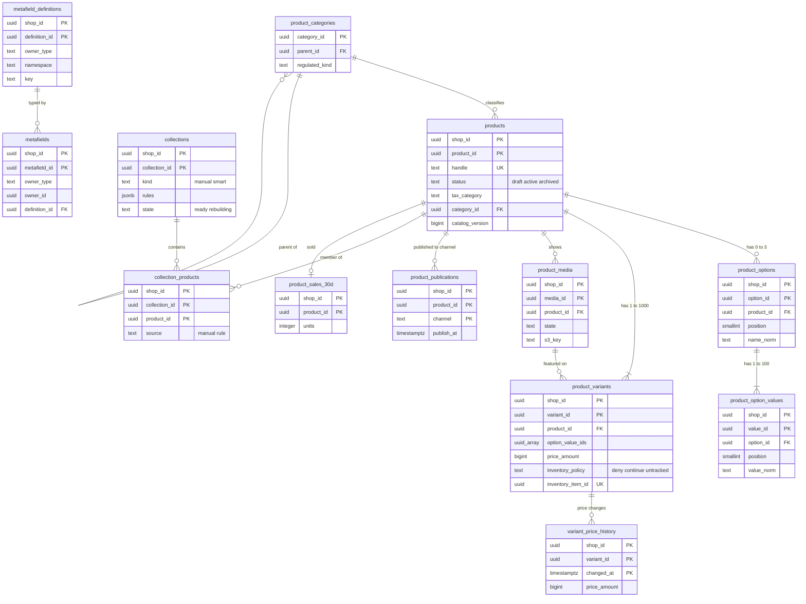

# Data model: カタログとメディア

[data-model.md](../data-model.md) の一部。規約はそちらの 3 節に従う。振る舞いは [catalog-and-pricing.md](../catalog-and-pricing.md)（4〜8・10〜12 節）を正とする。決定は [ADR-0014](../../decisions/0014-product-variant-option-model.md)（商品・オプション・バリエーション）、[ADR-0016](../../decisions/0016-collection-membership-and-catalog-events.md)（コレクションの所属、`catalog_version`）。価格のマーケット・為替は [pricing-taxes-and-invoices.md](pricing-taxes-and-invoices.md)。

| 表 | 置き場所 | 書く |
| --- | --- | --- |
| `products`、`product_options`、`product_option_values`、`product_variants`、`variant_price_history`、`product_media`、`product_publications` | ポッド `public` | `admin-api`（`packages/catalog`） |
| `collections`、`collection_products` | ポッド `public` | `admin-api`、`workers`（`collection_rebuild`） |
| `metafield_definitions`、`metafields` | ポッド `public` | `admin-api` |
| `product_sales_30d` | ポッド `public` | `workers`（日次） |
| `product_categories` | 全体 `ref`、ポッド `sys`（P5 の参照のデータの写し） | 本システムの運用 |

- バリエーションの価格の通貨はショップの `shop_settings.base_currency`（列に持たない。3.6 節の例外）。
- 商品・バリエーション・オプション・メディア・公開・所属を変えるトランザクションは、`products.catalog_version` を 1 上げ、outbox に事象を 1 つ書く（[ADR-0016](../../decisions/0016-collection-membership-and-catalog-events.md)）。

## 1. ER 図

- `product_variants` → `inventory_items` は 1 対 1 で、[inventory.md](inventory.md) の図にある。
- `metafields.owner_id` は `owner_type` で先の表が分かれる多態の参照（商品、バリエーション、コレクション、顧客、注文、ショップ）。DB の外部キーを張らず、所有者の削除の関数が同じトランザクションで消す。`definition_id` は任意の参照（定義のない値を許す）。
- `product_categories` は全体の参照のデータで、ポッドの `sys` の写しへの `products.category_id` の外部キーは張らない（写しの入れ替えで行が消えうる。存在はアプリで確かめる）。
- `product_media` → `product_variants`（代表の画像）は任意の参照。

## 2. 表

### 2.1 `products`

| 列 | 型 | NULL | 既定 | 説明 |
| --- | --- | --- | --- | --- |
| `shop_id`・`product_id` | `uuid` | NOT NULL | `product_id` は `uuidv7()` | |
| `handle` | `text` | NOT NULL | — | URL の名前。小文字、255 文字まで |
| `title` | `text` | NOT NULL | — | 255 文字まで |
| `body_html` | `text` | NOT NULL | `''` | 許可の一覧で安全化した HTML。512 KB まで |
| `product_type`・`vendor` | `text` | NULL | — | |
| `tags` | `text[]` | NOT NULL | `'{}'` | 250 まで、1 つ 255 文字 |
| `status` | `text` | NOT NULL | `'draft'` | `draft`・`active`・`archived` |
| `tax_category` | `text` | NOT NULL | `'standard_10'` | `standard_10`・`reduced_8`・`exempt`・`out_of_scope`（`export_zero` は MVP の後） |
| `category_id` | `uuid` | NULL | — | 商品の区分（`product_categories`） |
| `regulated_license` | `jsonb` | NULL | — | 区分の `regulated_kind` に対する許可の番号の入力（L10 の確認待ち。入力の欄だけ） |
| `complementary_product_ids` | `uuid[]` | NOT NULL | `'{}'` | 合わせて買う商品の手の選択（10 まで。[search.md](search.md) の 2.4 節） |
| `catalog_version` | `bigint` | NOT NULL | `1` | 商品ごとに単調に増える。Webhook の `<brand>_version`、検索の外部のバージョン |
| `created_at`・`updated_at` | `timestamptz` | NOT NULL | `now()` | |

- キー：PK `(shop_id, product_id)`。UK `(shop_id, handle)`。FK なし（`category_id` は上の注記）。
- 索引：`(shop_id, status, updated_at)` — 管理画面の一覧、予約の公開。`(shop_id, title text_pattern_ops)` — 管理画面の前方一致。`USING gin (shop_id, tags)`（btree_gin）— タグ。
- CHECK：`status IN (…)`、`tax_category IN (…)`、`cardinality(tags) <= 250`、`cardinality(complementary_product_ids) <= 10`、`octet_length(body_html) <= 524288`。
- トリガー：`catalog_version` を下げる・同じに保つ更新を拒む（`NEW > OLD` だけ）。ハンドルの変更で `url_redirects` に 301 の行を足す（同じトランザクション）。
- 削除：物理の削除（注文は写しを持つ）。outbox の `products/delete` に `catalog_version + 1` を載せる。1 ショップ 10 万（トリガー、`ops.catalog_limits` で引き上げ）。
- RLS：テナントの表。S1 の量：約 500 万行。

### 2.2 `product_options`・`product_option_values`

| `product_options` の列 | 型 | NULL | 既定 | 説明 |
| --- | --- | --- | --- | --- |
| `shop_id`・`option_id` | `uuid` | NOT NULL | `option_id` は `uuidv7()` | |
| `product_id` | `uuid` | NOT NULL | — | |
| `position` | `smallint` | NOT NULL | — | 1〜3 |
| `name` | `text` | NOT NULL | — | 表示の名前 |
| `name_norm` | `text` | NOT NULL | — | NFKC と小文字 |

| `product_option_values` の列 | 型 | NULL | 既定 | 説明 |
| --- | --- | --- | --- | --- |
| `shop_id`・`value_id` | `uuid` | NOT NULL | `value_id` は `uuidv7()` | |
| `option_id` | `uuid` | NOT NULL | — | |
| `position` | `smallint` | NOT NULL | — | 1〜100 |
| `value` | `text` | NOT NULL | — | |
| `value_norm` | `text` | NOT NULL | — | |

- キー：`product_options` PK `(shop_id, option_id)`、FK `(shop_id, product_id)` → `products`（`ON DELETE CASCADE`）、UK `(shop_id, product_id, position) DEFERRABLE INITIALLY DEFERRED`（並べ替え）、UK `(shop_id, product_id, name_norm)`。`product_option_values` PK `(shop_id, value_id)`、FK → `product_options`（`ON DELETE CASCADE`）、UK `(shop_id, option_id, position) DEFERRABLE INITIALLY DEFERRED`、UK `(shop_id, option_id, value_norm)`。
- CHECK：`position BETWEEN 1 AND 3`、`position BETWEEN 1 AND 100`。
- 領域の文書の主キー `(shop_id, product_id, position)` は一意の制約にし、主キーは ID にした（D-31。並べ替えで主キーが変わらないように）。
- S1 の量：オプション 約 750 万行、値 約 2,000 万行。

### 2.3 `product_variants`

| 列 | 型 | NULL | 既定 | 説明 |
| --- | --- | --- | --- | --- |
| `shop_id`・`variant_id` | `uuid` | NOT NULL | `variant_id` は `uuidv7()` | |
| `product_id` | `uuid` | NOT NULL | — | |
| `option_value_ids` | `uuid[]` | NOT NULL | `'{}'` | オプションの位置の順。長さ = オプションの数 |
| `price_amount` | `bigint` | NOT NULL | — | 基本の通貨の最小単位、税込み |
| `compare_at_amount` | `bigint` | NULL | — | 比較の価格（表示は L2 の確認待ち） |
| `compare_at_basis` | `text` | NULL | — | `former_price`・`msrp` |
| `compare_at_basis_from`・`compare_at_basis_to` | `date` | NULL | — | 自店の過去の価格の販売の期間 |
| `sku`・`barcode` | `text` | NULL | — | 255 文字。一意を強制しない |
| `weight_g` | `integer` | NOT NULL | `0` | 重さの帯の送料 |
| `requires_shipping` | `boolean` | NOT NULL | `true` | |
| `inventory_policy` | `text` | NOT NULL | `'deny'` | `deny`・`continue`・`untracked`（[ADR-0014](../../decisions/0014-product-variant-option-model.md)。在庫の枠の `policy_deny` の元。D-4） |
| `inventory_item_id` | `uuid` | NOT NULL | — | 1 対 1 |
| `featured_media_id` | `uuid` | NULL | — | 代表の画像 |
| `position` | `integer` | NOT NULL | — | |
| `created_at`・`updated_at` | `timestamptz` | NOT NULL | `now()` | |

- キー：PK `(shop_id, variant_id)`。FK `(shop_id, product_id)` → `products`。UK `(shop_id, product_id, option_value_ids)`（[ADR-0014](../../decisions/0014-product-variant-option-model.md)）。UK `(shop_id, inventory_item_id)`。FK `(shop_id, inventory_item_id)` → `inventory_items`（`DEFERRABLE INITIALLY DEFERRED`。同じトランザクションで作る）。
- 索引：`(shop_id, sku)` — 管理画面と CSV の引き。`(shop_id, barcode)`。
- CHECK：`price_amount >= 0`、`compare_at_amount IS NULL OR compare_at_amount >= 0`、`weight_g >= 0`、`inventory_policy IN (…)`、`compare_at_basis IS NULL OR compare_at_basis IN ('former_price','msrp')`。
- トリガー：1 商品 1,000 まで。オプションの値の削除で在庫の `on_hand > 0` か `committed > 0` の品目を消す変更を拒む（在庫の関数で確かめる）。価格・比較の価格の変更で `variant_price_history` に行を足す。`inventory_policy` の変更は `packages/inventory` の `set_policy()` を同じトランザクションで呼び、枠の `policy_deny` を揃える（`deny` へは全枠の `available >= 0` が要る）。
- RLS：テナントの表。S1 の量：約 2,500 万行（ポッドあたり 625 万）。

### 2.4 `variant_price_history`

自店の過去の価格の履歴（2 年）。比較の価格の根拠の確かめに使う。

| 列 | 型 | NULL | 既定 | 説明 |
| --- | --- | --- | --- | --- |
| `shop_id`・`variant_id` | `uuid` | NOT NULL | — | |
| `changed_at` | `timestamptz` | NOT NULL | `now()` | |
| `price_amount` | `bigint` | NOT NULL | — | 変更の後の値 |
| `compare_at_amount` | `bigint` | NULL | — | |
| `compare_at_basis` | `text` | NULL | — | |
| `actor_type`・`actor_id` | `text` | NULL | — | |

- キー：PK `(shop_id, variant_id, changed_at)`。バリエーションの削除の後も残す（外部キーを張らない）。
- 保持：2 年（日次のジョブ）。S1 の量：約 2,000 万行/年。

### 2.5 `product_media`

| 列 | 型 | NULL | 既定 | 説明 |
| --- | --- | --- | --- | --- |
| `shop_id`・`media_id` | `uuid` | NOT NULL | `media_id` は `uuidv7()` | 中身が変われば新しい ID（URL は不変） |
| `product_id` | `uuid` | NOT NULL | — | |
| `kind` | `text` | NOT NULL | — | `image`・`video` |
| `s3_key` | `text` | NOT NULL | — | `shops/<shop_id>/media/<media_id>/original` |
| `content_sha256` | `bytea` | NULL | — | |
| `state` | `text` | NOT NULL | `'uploaded'` | `uploaded`・`processing`・`ready`・`failed` |
| `failure_reason` | `text` | NULL | — | 理由のコード |
| `alt` | `text` | NULL | — | 512 文字まで |
| `width`・`height` | `integer` | NULL | — | |
| `duration_ms` | `integer` | NULL | — | 動画 |
| `position` | `integer` | NOT NULL | — | |
| `created_at` | `timestamptz` | NOT NULL | `now()` | |

- キー：PK `(shop_id, media_id)`。FK `(shop_id, product_id)` → `products`（`ON DELETE CASCADE`）。UK `(shop_id, product_id, position) DEFERRABLE INITIALLY DEFERRED`。
- CHECK：`kind IN (…)`、`state IN (…)`、`s3_key LIKE 'shops/' || shop_id::text || '/media/%'`（キーにショップを入れる不変条件）。1 商品 250 まで（トリガー）。
- 削除：行の削除で S3 のオブジェクトを消す作業を outbox で起こす。S1 の量：約 1,500 万行。

### 2.6 `product_publications`

販売のチャネルへの公開。見える条件：`status = 'active'` かつ公開の行があり、`publish_at <= 要求の開始の時刻`。

| 列 | 型 | NULL | 既定 | 説明 |
| --- | --- | --- | --- | --- |
| `shop_id`・`product_id` | `uuid` | NOT NULL | — | |
| `channel` | `text` | NOT NULL | — | `online_store`・`headless:<app_id>` |
| `publish_at` | `timestamptz` | NOT NULL | `now()` | 予約の公開 |
| `created_at` | `timestamptz` | NOT NULL | `now()` | |

- キー：PK `(shop_id, product_id, channel)`。FK → `products`（`ON DELETE CASCADE`）。
- 索引：`(publish_at) WHERE publish_at > created_at` — 1 分ごとの予約の公開の発見（X1 の発見の索引。D-6）。
- CHECK：`channel = 'online_store' OR channel ~ '^headless:[0-9a-f-]{36}$'`。S1 の量：約 600 万行。

### 2.7 `collections`・`collection_products`

[ADR-0016](../../decisions/0016-collection-membership-and-catalog-events.md)。

| `collections` の列 | 型 | NULL | 既定 | 説明 |
| --- | --- | --- | --- | --- |
| `shop_id`・`collection_id` | `uuid` | NOT NULL | `collection_id` は `uuidv7()` | |
| `handle` | `text` | NOT NULL | — | |
| `title` | `text` | NOT NULL | — | |
| `body_html` | `text` | NOT NULL | `''` | |
| `kind` | `text` | NOT NULL | — | `manual`・`smart` |
| `rules` | `jsonb` | NULL | — | 条件の並び（60 まで。`{column, relation, condition}`） |
| `disjunctive` | `boolean` | NOT NULL | `false` | `any` なら真 |
| `sort_order` | `text` | NOT NULL | `'manual'` | `manual`・`best_selling`・`title_asc`・`title_desc`・`price_asc`・`price_desc`・`created_desc` |
| `state` | `text` | NOT NULL | `'ready'` | `ready`・`rebuilding` |
| `rebuild_generation` | `bigint` | NOT NULL | `0` | 新しい条件の変更で上げ、古いジョブを止める |
| `rebuild_cursor` | `uuid` | NULL | — | ジョブの再開の印（最後の `product_id`） |
| `image_media_id` | `uuid` | NULL | — | |
| `version` | `bigint` | NOT NULL | `1` | Webhook の `<brand>_version` |
| `created_at`・`updated_at` | `timestamptz` | NOT NULL | `now()` | |

| `collection_products` の列 | 型 | NULL | 既定 | 説明 |
| --- | --- | --- | --- | --- |
| `shop_id`・`collection_id`・`product_id` | `uuid` | NOT NULL | — | |
| `source` | `text` | NOT NULL | — | `manual`・`rule` |
| `position` | `integer` | NULL | — | `manual` の並び |
| `added_at` | `timestamptz` | NOT NULL | `now()` | |

- キー：`collections` PK `(shop_id, collection_id)`、UK `(shop_id, handle)`。`collection_products` PK `(shop_id, collection_id, product_id)`、FK → 両方（`ON DELETE CASCADE`）。
- 索引：`collection_products (shop_id, product_id)` — 商品の所属（商品の保存の評価、検索の `collections`）。`(shop_id, collection_id, position)` — 手動の並び。
- CHECK：`kind = 'smart'` なら `rules IS NOT NULL AND jsonb_array_length(rules) BETWEEN 1 AND 60`、`kind = 'manual'` なら `rules IS NULL`。条件のコレクションは 1 ショップ 5,000（トリガー）。
- 条件の変更は `shop_settings.collections_version` を上げる（同じトランザクション）。
- S1 の量：コレクション 約 100 万行、所属 約 3,000 万行。

### 2.8 `product_sales_30d`

直近 30 日の売れた数（日次）。`best_selling` の並びと検索の `sales_30d`。

| 列 | 型 | NULL | 既定 | 説明 |
| --- | --- | --- | --- | --- |
| `shop_id`・`product_id` | `uuid` | NOT NULL | — | |
| `units` | `integer` | NOT NULL | `0` | |
| `computed_on` | `date` | NOT NULL | — | |

- キー：PK `(shop_id, product_id)`。商品の削除で消す（外部キー、`ON DELETE CASCADE`）。S1 の量：売れた商品だけ 約 200 万行。

### 2.9 `metafield_definitions`・`metafields`

[catalog-and-pricing.md](../catalog-and-pricing.md) の 7 節。

| `metafield_definitions` の列 | 型 | NULL | 既定 | 説明 |
| --- | --- | --- | --- | --- |
| `shop_id`・`definition_id` | `uuid` | NOT NULL | `definition_id` は `uuidv7()` | |
| `owner_type` | `text` | NOT NULL | — | `product`・`variant`・`collection`・`customer`・`order`・`shop` |
| `namespace`・`key` | `text` | NOT NULL | — | アプリの名前空間は `app--<app_id>--<名前>` |
| `type` | `text` | NOT NULL | — | `single_line_text`・`integer`・`decimal`・`boolean`・`date`・`url`・`color`・`money`・`weight`・`json`・`product_reference`・`file_reference` と、それぞれの `list.` |
| `validations` | `jsonb` | NOT NULL | `'{}'` | 最小・最大、正規表現、選択肢 |
| `storefront_access` | `text` | NOT NULL | `'none'` | `public`・`none`（顧客・注文は `none` だけ） |
| `app_access` | `text` | NULL | — | アプリの名前空間：`merchant_read`・`hidden` |
| `filterable` | `boolean` | NOT NULL | `false` | 検索の `metafields_kv` に入れる |
| `created_at` | `timestamptz` | NOT NULL | `now()` | |

| `metafields` の列 | 型 | NULL | 既定 | 説明 |
| --- | --- | --- | --- | --- |
| `shop_id`・`metafield_id` | `uuid` | NOT NULL | `metafield_id` は `uuidv7()` | |
| `owner_type` | `text` | NOT NULL | — | |
| `owner_id` | `uuid` | NOT NULL | — | ショップのときは `shop_id` |
| `definition_id` | `uuid` | NULL | — | |
| `namespace`・`key`・`type` | `text` | NOT NULL | — | |
| `value` | `jsonb` | NOT NULL | — | 64 KB まで（JSON は 128 KB） |
| `updated_at` | `timestamptz` | NOT NULL | `now()` | |

- キー：定義 PK `(shop_id, definition_id)`、UK `(shop_id, owner_type, namespace, key)`。値 PK `(shop_id, metafield_id)`、UK `(shop_id, owner_type, owner_id, namespace, key)`、FK `(shop_id, definition_id)` → 定義（任意）。
- CHECK：`storefront_access = 'none' OR owner_type NOT IN ('customer','order')`（[ADR-0047](../../decisions/0047-loom-data-access-and-prefetch.md)）、`pg_column_size(value) <= 131072`。1 所有者 200 の値、1 所有者の種類 256 の定義（トリガー）。
- アプリの導入の削除の後、アプリの名前空間の値は 30 日残す（日次のジョブが消す）。
- S1 の量：定義 約 50 万行、値 約 3,000 万行。

### 2.10 `product_categories`（全体 `ref`、ポッド `sys` の写し）

本システムの商品の区分の木（3 段）。ショップのデータでない参照のデータ（ADR-0003 の注記の「全体の参照のデータの写し」）。

| 列 | 型 | NULL | 既定 | 説明 |
| --- | --- | --- | --- | --- |
| `category_id` | `uuid` | NOT NULL | — | |
| `parent_id` | `uuid` | NULL | — | |
| `path` | `text` | NOT NULL | — | `food/beverage/alcohol` の形（子孫の判定） |
| `depth` | `smallint` | NOT NULL | — | 1〜3 |
| `name_ja`・`name_en` | `text` | NOT NULL | — | |
| `regulated_kind` | `text` | NULL | — | `alcohol`・`pharmaceutical`・`cosmetics`・`food`・`secondhand`（L10 の確認待ち。印だけ） |
| `suggested_tax_category` | `text` | NULL | — | 勧める税の区分 |
| `version` | `bigint` | NOT NULL | — | 写しの番号 |

- キー：PK `category_id`。FK `parent_id` → `product_categories`。UK `path`。CHECK：`depth BETWEEN 1 AND 3`。
- 写しは同じ列と `replicated_at`。S1 の量：数千行。
