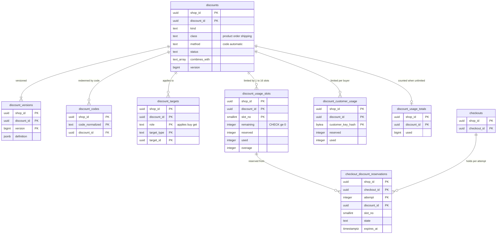

# Data model: 割引

[data-model.md](../data-model.md) の一部。規約はそちらの 3 節に従う。振る舞いは [discounts-engine.md](../discounts-engine.md)（4〜10 節）を正とする。決定は [ADR-0032](../../decisions/0032-discount-classes-order-and-combination.md)（種別、順序、組み合わせ）、[ADR-0033](../../decisions/0033-discount-allocation-and-rounding.md)（按分と端数）、[ADR-0034](../../decisions/0034-discount-usage-counters.md)（使用の回数）。

| 表 | 置き場所 | 書く |
| --- | --- | --- |
| `discounts`、`discount_versions`、`discount_codes`、`discount_targets` | ポッド `public` | `admin-api`（`discounts_write`） |
| `discount_usage_slots`、`discount_customer_usage`、`checkout_discount_reservations` | ポッド `public` | `checkout`（送信・`completeCheckout`）、`workers`（`reservation-sweeper`、セールの枠の分割） |
| `discount_usage_totals` | ポッド `public` | `workers`（非同期の数え上げ） |

- 率は基本点の整数（`percent_bp`、1500 = 15%）で持ち、計算は `floor(額 × percent_bp / 10000)`。浮動小数点を使わない（3.6 節）。
- 按分の結果（単位ごとの `product_discount`・`order_discount`・`paid_amount`）は価格の写しと注文の行に持つ（[orders-and-fulfillment.md](orders-and-fulfillment.md) の 2.2 節）。この領域の表には持たない。

## 1. ER 図

- `discount_targets.target_id` は `target_type`（`product`・`variant`・`collection`）で先の表が分かれる多態の参照。外部キーを張らず、対象の削除で行を消す（同じトランザクション）。
- `checkout_discount_reservations` → `discount_usage_slots` は `(discount_id, slot_no)` の参照で、上限なしの割引では NULL（任意）。`checkouts` へは論理の参照。

## 2. 表

### 2.1 `discounts`

| 列 | 型 | NULL | 既定 | 説明 |
| --- | --- | --- | --- | --- |
| `shop_id`・`discount_id` | `uuid` | NOT NULL | `discount_id` は `uuidv7()` | 同じ額の候補の順の決め手（ID の昇順） |
| `title` | `text` | NOT NULL | — | 写しと画面に出す名前 |
| `kind` | `text` | NOT NULL | — | `amount_off_product`・`buy_x_get_y`・`amount_off_order`・`free_shipping`・`app_function` |
| `class` | `text` | NOT NULL | — | `product`・`order`・`shipping` |
| `method` | `text` | NOT NULL | — | `code`・`automatic` |
| `value_type` | `text` | NULL | — | `fixed_per_unit`・`fixed_per_line`・`fixed_order`・`percentage`・`free`（関数は NULL） |
| `amount` | `bigint` | NULL | — | 額（基本の通貨の最小単位） |
| `percent_bp` | `integer` | NULL | — | 率（基本点） |
| `bxgy` | `jsonb` | NULL | — | `buy_x_get_y` の X の数か額、Y の数と率 |
| `shipping_rules` | `jsonb` | NULL | — | 送料の割引の配送の方法の絞り込み、送料の上限 |
| `min_subtotal_amount` | `bigint` | NULL | — | 最低の金額（税込み） |
| `min_quantity` | `integer` | NULL | — | 最低の数 |
| `customer_eligibility` | `jsonb` | NOT NULL | `'{"all":true}'` | すべて、ログインした買い手のタグ（MVP） |
| `combines_with` | `text[]` | NOT NULL | `'{}'` | `{product, order, shipping}` の部分集合 |
| `usage_limit_total` | `integer` | NULL | — | 全体の上限（NULL は上限なし） |
| `usage_limit_per_customer` | `integer` | NULL | — | 買い手ごと |
| `function_id` | `uuid` | NULL | — | `app_function` の関数（全体の `app_functions` の ID。論理の参照） |
| `starts_at` | `timestamptz` | NOT NULL | — | |
| `ends_at` | `timestamptz` | NULL | — | |
| `status` | `text` | NOT NULL | `'scheduled'` | `active`・`scheduled`・`expired`・`disabled` |
| `version` | `bigint` | NOT NULL | `1` | 変更のたびに 1 上げる。写しは `id@version` |
| `created_at`・`updated_at` | `timestamptz` | NOT NULL | `now()` | |

- キー：PK `(shop_id, discount_id)`。
- 索引：`(shop_id, status, starts_at)` — 領域の文書の索引。有効な自動の割引の候補（`WHERE method = 'automatic'` の部分索引も置く）。
- CHECK：
  - 値の一覧（`kind`・`class`・`method`・`status`・`value_type`）
  - `kind` と `class` の組（`amount_off_product`・`buy_x_get_y` は `product`、`amount_off_order` は `order`、`free_shipping` は `shipping`）
  - `percent_bp IS NULL OR percent_bp BETWEEN 1 AND 10000`、`amount IS NULL OR amount > 0`
  - `combines_with <@ ARRAY['product','order','shipping']`
  - `kind <> 'app_function' OR function_id IS NOT NULL`
  - `ends_at IS NULL OR ends_at > starts_at`
- トリガー：`version` を上げるたびに `discount_versions` に定義の写しを足す。有効な自動の割引は 1 ショップ 25（アプリの割引を含む）、定義は 2 万まで。
- 注文の取り消し・返品で使用の回数を戻さない（本システムの既定）。S1 の量：約 200 万行。

### 2.2 `discount_versions`

定義のバージョンの写し（追記だけ）。価格の写しの `discount_refs` が参照する。

| 列 | 型 | NULL | 既定 | 説明 |
| --- | --- | --- | --- | --- |
| `shop_id`・`discount_id` | `uuid` | NOT NULL | — | |
| `version` | `bigint` | NOT NULL | — | |
| `definition` | `jsonb` | NOT NULL | — | `discounts` の行と対象の一覧の写し |
| `created_at` | `timestamptz` | NOT NULL | `now()` | |

- キー：PK `(shop_id, discount_id, version)`。FK → `discounts`（`ON DELETE CASCADE`）。保持：割引の削除まで。S1 の量：約 600 万行。

### 2.3 `discount_codes`

| 列 | 型 | NULL | 既定 | 説明 |
| --- | --- | --- | --- | --- |
| `shop_id` | `uuid` | NOT NULL | — | |
| `code_normalized` | `text` | NOT NULL | — | NFKC と大文字（大文字と小文字を区別しない） |
| `code` | `text` | NOT NULL | — | 表示の形 |
| `discount_id` | `uuid` | NOT NULL | — | |
| `created_at` | `timestamptz` | NOT NULL | `now()` | |

- キー：PK `(shop_id, code_normalized)`（ショップの中で一意）。FK → `discounts`（`ON DELETE CASCADE`）。索引：`(shop_id, discount_id)`。
- 1 つの割引で 10 万（一括の作成）。S1 の量：約 2,000 万行。

### 2.4 `discount_targets`

| 列 | 型 | NULL | 既定 | 説明 |
| --- | --- | --- | --- | --- |
| `shop_id`・`discount_id` | `uuid` | NOT NULL | — | |
| `role` | `text` | NOT NULL | `'applies'` | `applies`（対象）・`buy`（X）・`get`（Y）。D-14 |
| `target_type` | `text` | NOT NULL | — | `product`・`variant`・`collection` |
| `target_id` | `uuid` | NOT NULL | — | |

- キー：PK `(shop_id, discount_id, role, target_type, target_id)`。FK `(shop_id, discount_id)` → `discounts`（`ON DELETE CASCADE`）。索引：`(shop_id, target_type, target_id)` — 対象の削除で消す、商品の割引の候補の引き。
- 領域の文書の主キーに `role` を足した（`buy_x_get_y` の X と Y を同じ表で持つため。D-14）。S1 の量：約 500 万行。

### 2.5 `discount_usage_slots`

全体の使用の回数の上限。`remaining` を CHECK で守る（[ADR-0034](../../decisions/0034-discount-usage-counters.md)）。上限なしの割引は行を持たない。

| 列 | 型 | NULL | 既定 | 説明 |
| --- | --- | --- | --- | --- |
| `shop_id`・`discount_id` | `uuid` | NOT NULL | — | |
| `slot_no` | `smallint` | NOT NULL | `0` | 0〜15（既定 1 枠、セールの準備で 16） |
| `remaining` | `integer` | NOT NULL | — | |
| `reserved` | `integer` | NOT NULL | `0` | |
| `used` | `integer` | NOT NULL | `0` | |
| `overage` | `integer` | NOT NULL | `0` | 決済済みで取り直せず超えた数 |

- キー：PK `(shop_id, discount_id, slot_no)`。FK → `discounts`（`ON DELETE CASCADE`）。
- CHECK：`remaining >= 0`、`reserved >= 0`、`used >= 0`、`overage >= 0`、`slot_no BETWEEN 0 AND 15`。
- 不変条件：`Σslot(remaining + reserved + used) = usage_limit_total`（上限の変更は差を枠 0 の `remaining` に足す。照合で確かめる）。枠の選び方・直し・まとめは在庫と同じ（[ADR-0021](../../decisions/0021-inventory-slot-probing-and-rebalance.md)）。
- S1 の量：上限つきの割引だけ 約 50 万行。

### 2.6 `discount_customer_usage`

買い手ごとの上限。買い手の鍵は、ログインした買い手の ID、なければ正規化したメールの HMAC（[ADR-0026](../../decisions/0026-bot-defense-and-purchase-limits.md) の規則）。

| 列 | 型 | NULL | 既定 | 説明 |
| --- | --- | --- | --- | --- |
| `shop_id`・`discount_id` | `uuid` | NOT NULL | — | |
| `customer_key_hash` | `bytea` | NOT NULL | — | HMAC-SHA256（ショップごとの鍵） |
| `reserved` | `integer` | NOT NULL | `0` | |
| `used` | `integer` | NOT NULL | `0` | |
| `overage` | `integer` | NOT NULL | `0` | |
| `limit_qty` | `integer` | NOT NULL | — | 作った時点の `usage_limit_per_customer` |

- キー：PK `(shop_id, discount_id, customer_key_hash)`。FK → `discounts`（`ON DELETE CASCADE`）。
- CHECK：`reserved >= 0`、`used >= 0`、`reserved + used <= limit_qty`。S1 の量：約 1,000 万行。

### 2.7 `checkout_discount_reservations`

送信で、写しに入った割引ごとの引き当て。期限は在庫の引き当てと同じで、戻しは在庫の掃除と同じトランザクション。

| 列 | 型 | NULL | 既定 | 説明 |
| --- | --- | --- | --- | --- |
| `shop_id`・`checkout_id` | `uuid` | NOT NULL | — | |
| `attempt` | `integer` | NOT NULL | — | |
| `discount_id` | `uuid` | NOT NULL | — | |
| `slot_no` | `smallint` | NULL | — | 上限なしは NULL |
| `customer_key_hash` | `bytea` | NULL | — | 買い手ごとの上限のあるとき |
| `state` | `text` | NOT NULL | `'reserved'` | `reserved`・`used`・`released` |
| `over_limit` | `boolean` | NOT NULL | `false` | 取り直せず `overage` に足した |
| `expires_at` | `timestamptz` | NOT NULL | — | |
| `order_id` | `uuid` | NULL | — | |
| `created_at` | `timestamptz` | NOT NULL | `now()` | |

- キー：PK `(shop_id, checkout_id, attempt, discount_id)`。FK `(shop_id, discount_id, slot_no)` → `discount_usage_slots`（任意）。
- 索引：`(shop_id, expires_at) WHERE state = 'reserved'` — 掃除。
- CHECK：`state IN (…)`、`state <> 'used' OR order_id IS NOT NULL`。
- 保持：30 日（在庫の引き当てと同じ。D-21）。S1 の量：約 100 万行。

### 2.8 `discount_usage_totals`

上限なしの割引の使用の数（非同期。outbox の `orders/create` から数える）。

| 列 | 型 | NULL | 既定 | 説明 |
| --- | --- | --- | --- | --- |
| `shop_id`・`discount_id` | `uuid` | NOT NULL | — | |
| `used` | `bigint` | NOT NULL | `0` | |
| `last_event_id` | `uuid` | NULL | — | 数えた最後の事象（重複の除き） |
| `updated_at` | `timestamptz` | NOT NULL | `now()` | |

- キー：PK `(shop_id, discount_id)`。FK → `discounts`（`ON DELETE CASCADE`）。S1 の量：約 150 万行。
