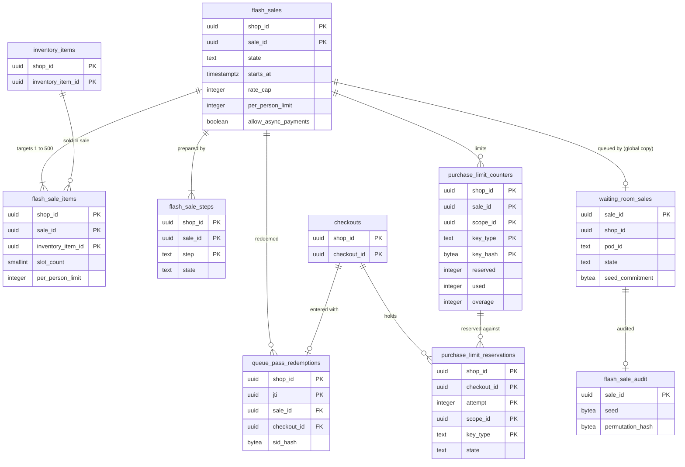

# Data model: フラッシュセールと待合室

[data-model.md](../data-model.md) の一部。規約はそちらの 3 節に従う。振る舞いは [flash-sales-and-queueing.md](../flash-sales-and-queueing.md)（4〜9 節）を正とする。決定は [ADR-0024](../../decisions/0024-waiting-room-ordering-and-admission-rate.md)（並びと受け入れの速さ）、[ADR-0025](../../decisions/0025-queue-pass-tokens.md)（許可証）、[ADR-0026](../../decisions/0026-bot-defense-and-purchase-limits.md)（1 人あたりの上限）、[ADR-0027](../../decisions/0027-flash-sale-preparation-and-surge-auto-queue.md)（準備と自動の待合室）。待合室の Valkey の鍵と許可証の形は [stores.md](stores.md)。

| 表 | 置き場所 | 書く |
| --- | --- | --- |
| `flash_sales`、`flash_sale_items`、`flash_sale_steps` | ポッド `public` | `admin-api`（`flash_sales_manage`）、`workers`（段の機械） |
| `queue_pass_redemptions` | ポッド `public` | `checkout` |
| `purchase_limit_counters`、`purchase_limit_reservations` | ポッド `public` | `checkout`、`workers`（`reservation-sweeper`） |
| `waiting_room_sales`、`flash_sale_audit` | 全体 `waiting_room` | `waiting-room`（ポッドの事象を受けて書く） |

- 全体の 2 つの表はショップのデータ（買い手・注文）を持たない。持つのはセールの ID、ショップの ID、時刻、数、種と並べ替えのハッシュだけ（[ADR-0002](../../decisions/0002-pods-and-shop-placement.md)）。
- ポッドから全体の `waiting-room` へのセールの設定と在庫の予算の数の受け渡しの経路は P3（各ポッドが SNS へ出したものを全体で集める）に含める（[ADR-0002](../../decisions/0002-pods-and-shop-placement.md) の 2026-10-10 の注記、D-16）。

## 1. ER 図

- `flash_sales` → `waiting_room_sales` は別の DB の写し（同じ `sale_id`）。外部キーを張らない。
- `queue_pass_redemptions`・`purchase_limit_reservations` → `checkouts` は論理の参照（チェックアウトは保持で消える）。
- `purchase_limit_reservations` → `purchase_limit_counters` は `(sale_id, scope_id, key_type, key_hash)` の参照で、外部キーを張る（同じポッドの表）。

## 2. 表

### 2.1 `flash_sales`

セールの予定と段の機械（`registered → prepared → queueing → open → closing → closed → settled`、`cancelled`）。

| 列 | 型 | NULL | 既定 | 説明 |
| --- | --- | --- | --- | --- |
| `shop_id`・`sale_id` | `uuid` | NOT NULL | `sale_id` は `uuidv7()` | |
| `name` | `text` | NOT NULL | — | |
| `kind` | `text` | NOT NULL | `'scheduled'` | `scheduled`（登録）・`surge`（予定にない急増の自動の待合室） |
| `state` | `text` | NOT NULL | `'registered'` | 上の 8 つ |
| `starts_at`・`ends_at` | `timestamptz` | NOT NULL | — | 予定。`surge` は有効にした時刻と NULL にしない仮の終わり |
| `rate_cap` | `integer` | NOT NULL | `100` | 受け入れの上限（人/秒）。`ops.waiting_room_admit_rate` で下げられる |
| `k_permille` | `integer` | NOT NULL | `1500` | 離脱を見込む倍率 `k`（千分率。1.5） |
| `q_permille` | `integer` | NOT NULL | `1200` | 1 人あたりの平均の数 `q`（千分率。1.2） |
| `per_person_limit` | `integer` | NULL | — | セールの全体の 1 人あたりの上限（1〜99） |
| `allow_async_payments` | `boolean` | NOT NULL | `false` | コンビニ払い・銀行振込を出すか |
| `challenge_enabled` | `boolean` | NOT NULL | `true` | 待合室の入口の WAF の Challenge・CAPTCHA |
| `pass_ttl_s` | `integer` | NOT NULL | `900` | 許可証の期限 |
| `slot_count` | `smallint` | NOT NULL | `32` | 在庫の枠の数の既定 |
| `discount_slot_count` | `smallint` | NOT NULL | `16` | 割引の使用の回数の枠 |
| `isolation_pod_id` | `text` | NULL | — | 移す先の隔離のポッド |
| `move_id` | `uuid` | NULL | — | 全体の `shop_moves` の ID（論理の参照） |
| `expected_visitors` | `integer` | NULL | — | 隔離のポッドの段の決定 |
| `created_by` | `uuid` | NULL | — | |
| `created_at`・`updated_at` | `timestamptz` | NOT NULL | `now()` | |
| `closed_at`・`settled_at` | `timestamptz` | NULL | — | |

- キー：PK `(shop_id, sale_id)`。
- 索引：`(shop_id, state, starts_at)` — 段の機械の次の作業。`(starts_at) WHERE state IN ('registered','prepared','queueing')` — 段の機械の発見（X1 の発見の索引。D-6）。
- CHECK：`state IN (…)`、`kind IN (…)`、`ends_at > starts_at`、`rate_cap BETWEEN 0 AND 100000`、`slot_count BETWEEN 1 AND 64`、`discount_slot_count BETWEEN 1 AND 16`、`per_person_limit IS NULL OR per_person_limit BETWEEN 1 AND 99`。
- トリガー：段の遷移は図の辺だけ。同じショップに `state IN ('prepared','queueing','open','closing')` のセールは 1 つ。
- 保持：`settled` の後 2 年（事業者の振り返り）。S1 の量：年 数千行。

### 2.2 `flash_sale_items`

| 列 | 型 | NULL | 既定 | 説明 |
| --- | --- | --- | --- | --- |
| `shop_id`・`sale_id`・`inventory_item_id` | `uuid` | NOT NULL | — | |
| `slot_count` | `smallint` | NOT NULL | — | この品目の枠の数（既定はセールの値） |
| `per_person_limit` | `integer` | NULL | — | 品目ごとの 1 人あたりの上限 |
| `initial_available` | `integer` | NULL | — | 分割の時点の数（振り返り） |

- キー：PK `(shop_id, sale_id, inventory_item_id)`。FK → `flash_sales`（`ON DELETE CASCADE`）、`inventory_items`。
- 1 セール 500 品目まで（トリガー）。品目はバリエーションの `inventory_policy = 'deny'` だけ（トリガーで確かめる）。S1 の量：年 数十万行。

### 2.3 `flash_sale_steps`

`prepared` に進むための作業の記録。

| 列 | 型 | NULL | 既定 | 説明 |
| --- | --- | --- | --- | --- |
| `shop_id`・`sale_id` | `uuid` | NOT NULL | — | |
| `step` | `text` | NOT NULL | — | `move_to_isolation`・`split_slots`・`split_discount_slots`・`waiting_room_config`・`waf_rules`・`cache_warm`・`function_preload`・`merge_slots`・`reconcile` |
| `state` | `text` | NOT NULL | `'pending'` | `pending`・`running`・`done`・`failed`・`waiting_approval` |
| `scheduled_at` | `timestamptz` | NOT NULL | — | 3 日前、24 時間前、1 時間前など |
| `started_at`・`finished_at` | `timestamptz` | NULL | — | |
| `result_code` | `text` | NULL | — | |
| `details` | `jsonb` | NOT NULL | `'{}'` | 数と ID だけ |

- キー：PK `(shop_id, sale_id, step)`。FK → `flash_sales`（`ON DELETE CASCADE`）。保持：セールと同じ。

### 2.4 `queue_pass_redemptions`

許可証の 1 回だけの使用（[ADR-0025](../../decisions/0025-queue-pass-tokens.md)）。

| 列 | 型 | NULL | 既定 | 説明 |
| --- | --- | --- | --- | --- |
| `shop_id` | `uuid` | NOT NULL | — | |
| `jti` | `uuid` | NOT NULL | — | 許可証の ID |
| `sale_id` | `uuid` | NOT NULL | — | |
| `checkout_id` | `uuid` | NOT NULL | — | 作ったチェックアウト |
| `sid_hash` | `bytea` | NOT NULL | — | セッションの cookie の値の SHA-256 の先頭 16 バイト |
| `redeemed_at` | `timestamptz` | NOT NULL | `now()` | |

- キー：PK `(shop_id, jti)`（一意。2 回目は同じ `sid_hash` なら既存のチェックアウトへ、違えば 403）。FK `(shop_id, sale_id)` → `flash_sales`。
- 索引：`(shop_id, checkout_id)` — 送信の時の `jti` の確かめ。
- CHECK：`octet_length(sid_hash) = 16`。保持：セールの `settled` の後 30 日（D-21）。S1 の量：1 セール 数千〜数万行。

### 2.5 `purchase_limit_counters`

1 人あたりの上限の数え上げ。識別の鍵ごとに在庫と同じ引き当て・確定・戻しをする（[ADR-0026](../../decisions/0026-bot-defense-and-purchase-limits.md)）。

| 列 | 型 | NULL | 既定 | 説明 |
| --- | --- | --- | --- | --- |
| `shop_id`・`sale_id` | `uuid` | NOT NULL | — | |
| `scope_id` | `uuid` | NOT NULL | — | セールの全体の上限は `sale_id`、品目ごとの上限は `inventory_item_id`（D-33） |
| `key_type` | `text` | NOT NULL | — | `email`・`address`・`phone`・`payment_fingerprint` |
| `key_hash` | `bytea` | NOT NULL | — | 正規化した値の HMAC-SHA256（ショップごとの鍵）。元の値を置かない |
| `limit_qty` | `integer` | NOT NULL | — | 作った時点の上限 |
| `reserved` | `integer` | NOT NULL | `0` | |
| `used` | `integer` | NOT NULL | `0` | |
| `overage` | `integer` | NOT NULL | `0` | 決済済みで取り直せなかった数 |

- キー：PK `(shop_id, sale_id, scope_id, key_type, key_hash)`。FK `(shop_id, sale_id)` → `flash_sales`。
- CHECK：`reserved >= 0`、`used >= 0`、`overage >= 0`、`reserved + used <= limit_qty`（上限を DB で守る。超えた決済済みの分は `overage` に足す）、`octet_length(key_hash) = 32`。
- 引き当ては `UPDATE … SET reserved = reserved + $n WHERE … AND reserved + used + $n <= limit_qty`（行がなければ `INSERT … ON CONFLICT DO UPDATE` の同じ条件）。
- 保持：セールの `settled` の後 90 日（重複の検出の報告の後。L3 の確認待ち）。S1 の量：1 セール 最大 数十万行。

### 2.6 `purchase_limit_reservations`

チェックアウトの試行ごとの、1 人あたりの上限の引き当て。

| 列 | 型 | NULL | 既定 | 説明 |
| --- | --- | --- | --- | --- |
| `shop_id`・`checkout_id` | `uuid` | NOT NULL | — | |
| `attempt` | `integer` | NOT NULL | — | |
| `scope_id` | `uuid` | NOT NULL | — | |
| `key_type` | `text` | NOT NULL | — | |
| `sale_id` | `uuid` | NOT NULL | — | |
| `key_hash` | `bytea` | NOT NULL | — | |
| `qty` | `integer` | NOT NULL | — | |
| `state` | `text` | NOT NULL | `'reserved'` | `reserved`・`used`・`released` |
| `over_limit` | `boolean` | NOT NULL | `false` | 取り直せず超過で注文を作った |
| `expires_at` | `timestamptz` | NOT NULL | — | 在庫の引き当てと同じ |
| `order_id` | `uuid` | NULL | — | |
| `created_at` | `timestamptz` | NOT NULL | `now()` | |

- キー：PK `(shop_id, checkout_id, attempt, scope_id, key_type)`。FK `(shop_id, sale_id, scope_id, key_type, key_hash)` → `purchase_limit_counters`。
- 索引：`(shop_id, expires_at) WHERE state = 'reserved'` — 在庫の掃除と同じトランザクションの戻し。`(shop_id, sale_id, key_type, key_hash)` — セールの後の重複の検出の報告。
- CHECK：`qty >= 1`、`state IN (…)`、`state <> 'used' OR order_id IS NOT NULL`。
- 保持：カウンターと同じ。

### 2.7 `waiting_room_sales`（全体 `waiting_room`）

`waiting-room` がセールの間に読む設定と状態。ポッドの `flash_sales` の写しで、ショップのデータを持たない。この工程で置き場所を決めた（D-16）。

| 列 | 型 | NULL | 既定 | 説明 |
| --- | --- | --- | --- | --- |
| `sale_id` | `uuid` | NOT NULL | — | ポッドと同じ ID |
| `shop_id` | `uuid` | NOT NULL | — | 許可証の `shop_id` の確かめ |
| `pod_id` | `text` | NOT NULL | — | 在庫の予算の事象の出どころ |
| `kind` | `text` | NOT NULL | — | `scheduled`・`surge` |
| `state` | `text` | NOT NULL | — | `queueing`・`open`・`closing`・`closed`（ポッドの段の写し） |
| `starts_at`・`ends_at` | `timestamptz` | NOT NULL | — | |
| `rate_cap`・`k_permille`・`q_permille` | `integer` | NOT NULL | — | |
| `pass_ttl_s` | `integer` | NOT NULL | — | |
| `seed_commitment` | `bytea` | NULL | — | `SHA-256(seed)`。開始の前に公開 |
| `seed_ciphertext` | `text` | NULL | — | 開始の時刻まで秘密の種（`kms-global-storage` の封筒の暗号）。開始で `flash_sale_audit.seed` に平文を写す |
| `source_version` | `bigint` | NOT NULL | — | ポッドの事象の番号 |
| `updated_at` | `timestamptz` | NOT NULL | `now()` | |

- キー：PK `sale_id`。索引：`(shop_id, state)`。
- 動いている値（`seq`、`theta`、`admitted_through`、`F`、予算 `B`）は Valkey の `wr:{<sale_id>}:…` に置き、この表に持たない（失ってよい。閉じる側に倒す）。
- 保持：`closed` の後 30 日。S1 の量：年 数千行。

### 2.8 `flash_sale_audit`（全体 `waiting_room`）

開始の時刻の並べ替えの公平さを示す記録（[ADR-0024](../../decisions/0024-waiting-room-ordering-and-admission-rate.md)）。

| 列 | 型 | NULL | 既定 | 説明 |
| --- | --- | --- | --- | --- |
| `sale_id` | `uuid` | NOT NULL | — | |
| `shop_id` | `uuid` | NOT NULL | — | |
| `seed_commitment` | `bytea` | NOT NULL | — | 開始の前に出した `SHA-256(seed)` |
| `seed` | `bytea` | NULL | — | 開始の時刻に公開した種（32 バイト） |
| `pre_count` | `integer` | NULL | — | 開始の前の券の数 |
| `permutation_hash` | `bytea` | NULL | — | 並べ替えた `v` の集まりの SHA-256 |
| `admission_summary` | `jsonb` | NOT NULL | `'{}'` | 受け入れの数の時系列の要約（10 秒ごと） |
| `created_at`・`finalized_at` | `timestamptz` | — | — | |

- キー：PK `sale_id`。CHECK：`seed IS NULL OR sha256(seed) = seed_commitment`（約束と公開の値の一致を DB で確かめる）。追記と最後の 1 回の更新だけ。
- 保持：2 年。S1 の量：年 数千行。
