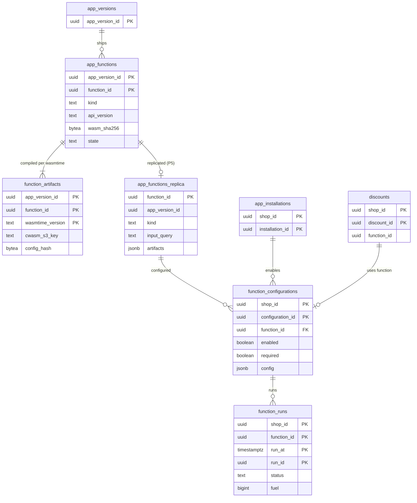

# Data model: 関数

[data-model.md](../data-model.md) の一部。規約はそちらの 3 節に従う。振る舞いは [functions-sandbox.md](../functions-sandbox.md)（4〜10 節）を正とする。決定は [ADR-0008](../../decisions/0008-extension-sandbox-wasm.md)（砂場）、[ADR-0058](../../decisions/0058-function-io-contract.md)（入出力の約束）、[ADR-0059](../../decisions/0059-function-publish-compile-and-distribution.md)（公開・翻訳・配り）、[ADR-0060](../../decisions/0060-function-invocation-budget-and-failure-defaults.md)（予算と失敗）。`checkout` と `function-runner` の間の枠、入出力の JSON、S3 の機械語の置き場所は [stores.md](stores.md) の 8 節。

| 表 | 置き場所 | 書く |
| --- | --- | --- |
| `app_functions`、`function_artifacts` | 全体 `registry` | `app-registry`、翻訳のワーカー |
| `app_functions_replica` | ポッド `sys`（P5） | `workers`（P5 の当て） |
| `function_configurations` | ポッド `public` | `admin-api`（`write_functions`、`settings_write`） |
| `function_runs` | ポッド `public` | `checkout`（実行の記録） |

- 関数の ID（`function_id`）はアプリの中の関数ごとに安定で、アプリのバージョンをまたいで同じ。バージョンごとの中身は `(app_version_id, function_id)` の行に持つ。
- `app_functions_replica` はこの工程で足した（`checkout` が関数の種類・入力のクエリ・機械語の置き場所を全体の DB を読まずに引くため。P5。D-8）。

## 1. ER 図

- `app_functions_replica` → `function_configurations` は `function_id` の参照。写しは `sys` で、外部キーを張らない（設定の作成で写しの存在を確かめる）。
- `function_runs` は分割した表で外部キーを張らない。`discounts.function_id` は関数の割引の定義（論理の参照）。

## 2. 表

### 2.1 `app_functions`（全体 `registry`）

| 列 | 型 | NULL | 既定 | 説明 |
| --- | --- | --- | --- | --- |
| `app_version_id` | `uuid` | NOT NULL | — | |
| `function_id` | `uuid` | NOT NULL | — | アプリの中で安定 |
| `app_id` | `uuid` | NOT NULL | — | |
| `handle` | `text` | NOT NULL | — | アプリの中の名前 |
| `kind` | `text` | NOT NULL | — | `product_discount`・`order_discount`・`shipping_discount`・`delivery_customization`・`payment_customization`・`cart_validation` |
| `api_version` | `text` | NOT NULL | — | `YYYY-MM`。公開の時に固定、12 か月 |
| `input_query` | `text` | NOT NULL | — | 3,000 バイト・費用 30 まで |
| `input_query_cost` | `integer` | NOT NULL | — | |
| `wasm_sha256` | `bytea` | NOT NULL | — | |
| `wasm_s3_key` | `text` | NOT NULL | — | `functions/<app>/<function>/<version>/module.wasm` |
| `size_bytes` | `integer` | NOT NULL | — | 256 KiB まで |
| `state` | `text` | NOT NULL | `'validating'` | `validating`・`ready`・`rejected` |
| `reject_reason` | `text` | NULL | — | `forbidden_import`・`feature_not_allowed`・`too_large`・`memory_too_large`・`input_query_invalid` |
| `created_at` | `timestamptz` | NOT NULL | `now()` | |

- キー：PK `(app_version_id, function_id)`。UK `(app_version_id, handle)`。FK → `app_versions`。
- CHECK：`size_bytes <= 262144`、`octet_length(input_query) <= 3000`、`input_query_cost <= 30`、`kind IN (…)`。S1 の量：数万行。

### 2.2 `function_artifacts`（全体 `registry`）

Wasmtime のバージョンごとの機械語と署名。90 日残す。

| 列 | 型 | NULL | 既定 | 説明 |
| --- | --- | --- | --- | --- |
| `app_version_id`・`function_id` | `uuid` | NOT NULL | — | |
| `wasmtime_version` | `text` | NOT NULL | — | |
| `config_hash` | `bytea` | NOT NULL | — | Wasmtime の設定のハッシュ |
| `cwasm_s3_key` | `text` | NOT NULL | — | `functions/<app>/<function>/<version>/<wasmtime>.cwasm` |
| `sig_s3_key` | `text` | NOT NULL | — | 同じ道の `.sig` |
| `cwasm_sha256` | `bytea` | NOT NULL | — | 署名の対象（SHA-256 ＋ Wasmtime のバージョン ＋ 設定のハッシュ） |
| `created_at` | `timestamptz` | NOT NULL | `now()` | |

- キー：PK `(app_version_id, function_id, wasmtime_version)`。領域の文書の `(function_id, wasmtime_version)` にアプリのバージョンを足した（関数の ID はバージョンをまたいで同じなので、主キーにバージョンが要る。D-30）。FK → `app_functions`。
- 保持：新しいバージョンに替わってから 90 日。S1 の量：数万行。

### 2.3 `app_functions_replica`（ポッド `sys`、P5）

| 列 | 型 | NULL | 既定 | 説明 |
| --- | --- | --- | --- | --- |
| `function_id` | `uuid` | NOT NULL | — | |
| `app_id`・`app_version_id` | `uuid` | NOT NULL | — | 最新の `ready` のバージョン |
| `kind`・`api_version`・`input_query` | `text` | NOT NULL | — | |
| `wasm_sha256` | `bytea` | NOT NULL | — | 枠の頭の `module_digest` |
| `artifacts` | `jsonb` | NOT NULL | — | Wasmtime のバージョン → `.cwasm`・`.sig` のキー（並べ替えの間は 2 つ） |
| `state` | `text` | NOT NULL | — | |
| `source_version` | `bigint` | NOT NULL | — | |
| `replicated_at` | `timestamptz` | NOT NULL | `now()` | |

- キー：PK `function_id`。RLS：なし（`sys`）。ショップのデータの列を持たない。S1 の量：数千行。

### 2.4 `function_configurations`（ポッド）

| 列 | 型 | NULL | 既定 | 説明 |
| --- | --- | --- | --- | --- |
| `shop_id`・`configuration_id` | `uuid` | NOT NULL | `configuration_id` は `uuidv7()` | |
| `function_id` | `uuid` | NOT NULL | — | |
| `installation_id` | `uuid` | NOT NULL | — | |
| `kind` | `text` | NOT NULL | — | 写しの種類（段の集め方） |
| `enabled` | `boolean` | NOT NULL | `true` | |
| `required` | `boolean` | NOT NULL | `false` | カートの検証だけ。必須の失敗は決めた文言で送信を止める |
| `config` | `jsonb` | NOT NULL | `'{}'` | 事業者の設定（16 KB まで。入力の `FunctionConfiguration.metafield`） |
| `input_debug_until` | `timestamptz` | NULL | — | 入力を残す同意（24 時間で切れる。L3） |
| `created_at`・`updated_at` | `timestamptz` | NOT NULL | `now()` | |

- キー：PK `(shop_id, configuration_id)`。UK `(shop_id, function_id)`。FK `(shop_id, installation_id)` → `app_installations`（`ON DELETE CASCADE`）。
- CHECK：`required = false OR kind = 'cart_validation'`、`pg_column_size(config) <= 16384`。`input_debug_until` を今から 24 時間より先にする更新はトリガーで拒む（CHECK は `now()` を使えない）。
- トリガー：段ごとに種類あたり 5、段の合計 10 まで（有効な行）。S1 の量：約 20 万行。

### 2.5 `function_runs`（ポッド）

実行の記録（成功は 1% の抜き取り、失敗は全部。ショップと関数ごとに 1 分 100 件まで）。

| 列 | 型 | NULL | 既定 | 説明 |
| --- | --- | --- | --- | --- |
| `shop_id`・`function_id` | `uuid` | NOT NULL | — | |
| `run_at` | `timestamptz` | NOT NULL | `now()` | 分割の鍵 |
| `run_id` | `uuid` | NOT NULL | `uuidv7()` | 枠の頭の `invocation_id` |
| `configuration_id` | `uuid` | NOT NULL | — | |
| `checkout_id` | `uuid` | NULL | — | |
| `status` | `text` | NOT NULL | — | `ok`・`fuel_exhausted`・`memory_exceeded`・`trap`・`output_too_large`・`input_too_large`・`module_unavailable`・`host_error`・`INVALID_OUTPUT`・`BUDGET_EXCEEDED` |
| `blame` | `text` | NOT NULL | — | `function`・`system` |
| `fuel` | `bigint` | NULL | — | |
| `duration_us` | `integer` | NULL | — | |
| `input_hash` | `bytea` | NOT NULL | — | 入力の JSON の SHA-256 |
| `input` | `jsonb` | NULL | — | 同意のある 24 時間だけ。保護のデータの項目を除く |
| `output` | `jsonb` | NULL | — | 20 KiB まで |
| `log` | `text` | NULL | — | 1 KiB まで |
| `sampled` | `boolean` | NOT NULL | — | 成功の抜き取りか |

- キー：PK `(shop_id, function_id, run_at, run_id)`。索引：`(shop_id, status, run_at)` — 開発者の画面と事業者の失敗の数。
- 分割：`run_at` の日。保持：7 日（分割を `DROP`）。入力の本体は 24 時間で NULL にする（日次でなく 1 時間ごとの作業）。
- S1 の量：約 300 万行（7 日分。初期見積もり）。
