# Data model: 全体のディレクトリとアカウント

[data-model.md](../data-model.md) の一部。規約はそちらの 3 節に従う。振る舞いは [shops-and-pods.md](../shops-and-pods.md)（5・6・9 節）と [merchant-admin-and-staff.md](../merchant-admin-and-staff.md)（4 節）を正とする。決定は [ADR-0010](../../decisions/0010-shop-routing-hot-set-and-custom-domains.md)（振り分け、熱い集まり、P5）、[ADR-0013](../../decisions/0013-shop-lifecycle-and-data-deletion.md)（ライフサイクル）、[ADR-0063](../../decisions/0063-staff-identity-2fa-sso-and-collaborators.md)（アカウント、SSO、協力者）。

| 表 | 置き場所 | 書く |
| --- | --- | --- |
| `shops`、`shop_hosts`、`shop_lifecycle_events`、`shop_deletion_jobs`、`hotset_stats` | 全体 `directory` | `shop-directory`（P1 の正本） |
| `accounts`、`account_credentials`、`admin_sessions`、`account_shops`、`identity_audit_events` | 全体 `identity` | `identity`。`account_shops` は P4 の写し |
| `organizations`、`organization_domains`、`organization_shops`、`sso_connections` | 全体 `identity` | `identity` |
| `partner_orgs`、`partner_members` | 全体 `identity` | `identity` |
| `signing_keys` | 全体 `identity` | `identity`（鍵の入れ替えの作業） |
| `domains` | ポッド `public`（RLS） | `workers`（`shop-directory` の事象を当てる） |
| `signing_keys_replica` | ポッド `sys`（RLS の外、P5） | `workers`（P5 の当て） |

- 全体の表はショップのデータ（商品・注文・買い手の値）を持たない。持つのはショップの ID・ハンドル・ホスト・状態と、スタッフのアカウント（事業者の人の値）だけ（[ADR-0002](../../decisions/0002-pods-and-shop-placement.md)）。
- スタッフのメールアドレスは全体の `identity` に置く。これは買い手の個人のデータ（D1）でなく、認証の情報（D3）とアカウントの連絡先として扱う（[security.md](../security.md) の 6.1 節）。

## 1. ER 図

```mermaid
erDiagram
    shops ||--|{ shop_hosts : "served at"
    shops ||--o{ shop_lifecycle_events : "transitions"
    shops ||--o{ shop_deletion_jobs : "deleted by steps"
    shop_hosts ||--o| hotset_stats : "counted"
    accounts ||--o{ shops : "owns"
    accounts ||--o{ account_credentials : "registers"
    accounts ||--o{ admin_sessions : "signs in"
    accounts ||--o{ account_shops : "belongs to (P4 copy)"
    shops ||--o{ account_shops : "listed in"
    organizations ||--o{ organization_domains : "verifies"
    organizations ||--o{ organization_shops : "groups"
    shops ||--o| organization_shops : "grouped by"
    organizations ||--o{ sso_connections : "federates"
    partner_orgs ||--o{ partner_members : "has"
    accounts ||--o{ partner_members : "is"
    accounts ||--o{ identity_audit_events : "audited"
    shops ||--o{ domains : "pod side copy"
    signing_keys ||--o| signing_keys_replica : "replicated (P5)"

    shops {
        uuid shop_id PK
        text handle UK
        text pod_id FK
        text lifecycle_state
        text plan
        uuid owner_account_id FK
    }
    shop_hosts {
        text host PK
        uuid shop_id FK
        text kind "default custom"
        boolean is_primary
        text status
        bigint cache_gen
        text cache_mode "shop fine"
    }
    shop_lifecycle_events {
        uuid shop_id PK
        timestamptz at PK
        text from_state
        text to_state
        text reason_code
    }
    shop_deletion_jobs {
        uuid shop_id PK
        smallint step PK
        text state
    }
    hotset_stats {
        text host PK
        bigint requests_5m
        bigint requests_14d
    }
    accounts {
        uuid account_id PK
        text email_normalized UK
        text status
    }
    account_credentials {
        uuid account_id PK
        uuid credential_id PK
        text kind "passkey totp recovery_code"
    }
    admin_sessions {
        uuid session_id PK
        bytea session_hash UK
        uuid account_id FK
    }
    account_shops {
        uuid account_id PK
        uuid shop_id PK
        text handle
    }
    organizations {
        uuid organization_id PK
        boolean sso_required
    }
    organization_domains {
        uuid organization_id PK
        text domain PK
        timestamptz verified_at
    }
    organization_shops {
        uuid shop_id PK
        uuid organization_id FK
    }
    sso_connections {
        uuid organization_id PK
        uuid connection_id PK
        text protocol "saml oidc"
    }
    partner_orgs {
        uuid partner_id PK
        text name
    }
    partner_members {
        uuid partner_id PK
        uuid account_id PK
        text role
    }
    identity_audit_events {
        uuid event_id PK
        timestamptz at PK
        uuid account_id
        text action
    }
    signing_keys {
        text kid PK
        text purpose
        text state
    }
    signing_keys_replica {
        text kid PK
        jsonb public_jwk
    }
    domains {
        uuid shop_id PK
        text host PK
        boolean is_primary
    }
```

- `shops` → `domains` は全体からポッドへの写しで、DB の外部キーは張らない（別の DB）。`accounts` → `shops`（所有者）、`account_shops`・`organization_shops` の `shop_id` も同じ全体の DB の中の参照で、外部キーを張る。
- `organization_shops` は 1 つのショップを 0 か 1 つの組織に結ぶ（`shop_id` が主キー）。
- `signing_keys` → `signing_keys_replica` は P5 の写し（別の DB）。

## 2. 表

### 2.1 `shops`（全体 `directory`）

ショップ → ポッドの正本とライフサイクル。定義元：[shops-and-pods.md](../shops-and-pods.md) の 5.1・7.1・9 節。

| 列 | 型 | NULL | 既定 | 説明 |
| --- | --- | --- | --- | --- |
| `shop_id` | `uuid` | NOT NULL | `uuidv7()` | テナントの ID。全ポッドの表の `shop_id` と同じ値 |
| `handle` | `text` | NOT NULL | — | 既定のドメインの名前。`^[a-z0-9][a-z0-9-]{1,38}[a-z0-9]$`。変えない |
| `pod_id` | `text` | NOT NULL | — | 今のポッド（`p01`、`x01` など） |
| `lifecycle_state` | `text` | NOT NULL | `'trial'` | `trial`・`active`・`frozen`・`closed`・`deleting`・`deleted` |
| `provisioning_state` | `text` | NOT NULL | `'provisioning'` | `provisioning`・`ready`・`failed`（7.1 節の `provisioning_failed`） |
| `plan` | `text` | NOT NULL | `'basic'` | `basic`・`advanced`・`plus`（正本は `billing.merchant_subscriptions`。写し） |
| `owner_account_id` | `uuid` | NOT NULL | — | 所有者（`accounts`） |
| `freeze_reason_code` | `text` | NULL | — | `unpaid`・`terms_violation`・`legal_request`（後の 2 つの判断は L8・L10） |
| `is_canary` | `boolean` | NOT NULL | `false` | 見張りのショップ。課金・SLO から除く |
| `trial_ends_at` | `timestamptz` | NULL | — | 開設から 14 日 |
| `frozen_at`・`closed_at`・`deleted_at` | `timestamptz` | NULL | — | 状態に入った時刻。削除の期限の起点 |
| `created_at`・`updated_at` | `timestamptz` | NOT NULL | `now()` | |

- キー：PK `shop_id`。UK `handle`（墓標の行を含む。削除の後 1 年は再利用しない）。FK `pod_id` → `pods`、`owner_account_id` → `accounts`。
- 索引：`(pod_id, lifecycle_state)` — ポッドのショップの一覧（偏りの直し、削除の作業）。`(lifecycle_state, closed_at) WHERE lifecycle_state = 'closed'` — 90 日の削除の候補。
- CHECK：`lifecycle_state IN (…)`、`plan IN (…)`、`lifecycle_state <> 'frozen' OR frozen_at IS NOT NULL`、`lifecycle_state <> 'closed' OR closed_at IS NOT NULL`。
- トリガー：遷移は [ADR-0013](../../decisions/0013-shop-lifecycle-and-data-deletion.md) の図の辺だけを許す（関数 `directory.transition_shop()` だけが書き、同じトランザクションで `shop_lifecycle_events` を書く）。
- RLS：なし（全体。`shop-directory` のロールだけが書く。`edge-router` は読み出しの写しを読む）。
- 保持・削除：`deleted` の後は墓標（`shop_id`・`handle`・`deleted_at` 以外を NULL か既定に戻す）。墓標は 1 年の後に消す（[shops-and-pods.md](../shops-and-pods.md) の 9.1 節の段 6）。
- S1 の量：10 万行（登録）。

### 2.2 `shop_hosts`（全体 `directory`）

ホスト → ショップと、エッジのキャッシュの世代。定義元：[shops-and-pods.md](../shops-and-pods.md) の 5・6 節、[storefront-api-and-caching.md](../storefront-api-and-caching.md) の 5・7 節。

| 列 | 型 | NULL | 既定 | 説明 |
| --- | --- | --- | --- | --- |
| `host` | `text` | NOT NULL | — | 小文字、末尾の `.` なし。512 バイトまで（KeyValueStore の鍵の上限） |
| `shop_id` | `uuid` | NOT NULL | — | |
| `kind` | `text` | NOT NULL | — | `default`（`<handle>.<brand>.<domain>`）・`custom` |
| `is_primary` | `boolean` | NOT NULL | `false` | 主のホスト。主でないものは KeyValueStore の値が `state = r` |
| `status` | `text` | NOT NULL | `'pending'` | `pending`・`active`・`failed`・`detached` |
| `cf_tenant_id` | `text` | NULL | — | CloudFront の配信のテナントの ID（独自のドメインのショップだけ） |
| `cert_status` | `text` | NULL | — | `requested`・`issued`・`failed`・`expiring` |
| `cert_expires_at` | `timestamptz` | NULL | — | 30 日前から日次で知らせる |
| `dns_checked_at` | `timestamptz` | NULL | — | 日次の DNS の確かめ |
| `in_hotset` | `boolean` | NOT NULL | `false` | KeyValueStore の熱い集まりに入っている |
| `hotset_pinned` | `boolean` | NOT NULL | `false` | 固定の枠（セール・隔離・移し替え中・プラス、`ops.hotset_pinned_hosts`） |
| `cache_gen` | `bigint` | NOT NULL | `1` | 全体の世代（KeyValueStore の値は 36 進） |
| `cache_mode` | `text` | NOT NULL | `'shop'` | `shop`・`fine` |
| `product_page_gen` | `bigint` | NULL | — | `fine` だけ。`pgen` |
| `bucket_gens` | `integer[]` | NULL | — | `fine` だけ。64 要素 |
| `gen_bumped_at` | `timestamptz` | NULL | — | `fine` の `gen` を 10 秒に 1 回までにする判定 |
| `created_at`・`updated_at` | `timestamptz` | NOT NULL | `now()` | |

- キー：PK `host`。FK `shop_id` → `shops`。UK `(shop_id) WHERE kind = 'default'`、UK `(shop_id) WHERE is_primary`。
- 索引：`(shop_id)` — ショップの全ホスト（世代を全ホストで同じに上げる）。`(in_hotset, hotset_pinned)` — 入れ替えの作業。`(cert_expires_at) WHERE kind = 'custom'` — 証明書の期限。
- CHECK：`kind IN (…)`、`status IN (…)`、`cache_mode IN ('shop','fine')`、`cache_mode = 'shop' OR (product_page_gen IS NOT NULL AND cardinality(bucket_gens) = 64)`、`cache_gen >= 1`。
- トリガー：`cache_gen`・`product_page_gen`・`bucket_gens` の各要素を下げる更新を拒む。世代の更新は関数 `directory.bump_cache_gen(shop_id, …)` で、そのショップの全ホストの行を同じ値にする（不変条件「同じショップの全ホストの世代は同じ」）。
- 1 ショップの独自のドメインは 10 まで（トリガー）。RLS：なし。保持：ショップの削除の段 1 で消す。S1 の量：約 15 万行（独自のドメインを持つショップ 40〜60%）。

### 2.3 `shop_lifecycle_events`（全体 `directory`）

ライフサイクルの遷移の記録（追記だけ）。定義元：[shops-and-pods.md](../shops-and-pods.md) の 9 節。

| 列 | 型 | NULL | 既定 | 説明 |
| --- | --- | --- | --- | --- |
| `shop_id` | `uuid` | NOT NULL | — | |
| `at` | `timestamptz` | NOT NULL | `now()` | |
| `from_state`・`to_state` | `text` | NOT NULL | — | |
| `reason_code` | `text` | NOT NULL | — | `plan_selected`・`unpaid_14d`・`terms_violation`・`legal_request`・`owner_closed`・`trial_expired`・`frozen_60d`・`reopened`・`retention_elapsed`・`deletion_done` |
| `actor_type` | `text` | NOT NULL | — | `owner`・`system`・`operator`・`legal` |
| `actor_id` | `text` | NULL | — | アカウント・運用者の ID |

- キー：PK `(shop_id, at)`。FK `shop_id` → `shops`。UPDATE・DELETE をロールに与えない。
- 保持：ショップの墓標と同じ（L3 の確認待ち）。S1 の量：約 30 万行/年。

### 2.4 `shop_deletion_jobs`（全体 `directory`）

削除の作業の段ごとの進み具合。定義元：[shops-and-pods.md](../shops-and-pods.md) の 9.1 節。

| 列 | 型 | NULL | 既定 | 説明 |
| --- | --- | --- | --- | --- |
| `shop_id` | `uuid` | NOT NULL | — | |
| `step` | `smallint` | NOT NULL | — | 1 エッジ、2 ポッドの DB、3 Valkey、4 OpenSearch、5 S3、6 全体の行、7 アプリへ `shop/redact` |
| `state` | `text` | NOT NULL | `'pending'` | `pending`・`running`・`done`・`failed` |
| `cursor` | `jsonb` | NULL | — | 再開の位置（表の名前と最後の主キー） |
| `rows_deleted` | `bigint` | NOT NULL | `0` | |
| `retained_copied_at` | `timestamptz` | NULL | — | 保持の対象を保持のバケットへ写した時刻（段 2 の前） |
| `started_at`・`finished_at` | `timestamptz` | NULL | — | |

- キー：PK `(shop_id, step)`。CHECK：`step BETWEEN 1 AND 7`。30 日で `done` にならなければ Ops を呼ぶ（索引 `(state, started_at)`）。
- 保持：全部の段が `done` の後 1 年。S1 の量：数千行。

### 2.5 `hotset_stats`（全体 `directory`）

熱い集まりの入れ替えの材料。定義元：[shops-and-pods.md](../shops-and-pods.md) の 5.1 節。

| 列 | 型 | NULL | 既定 | 説明 |
| --- | --- | --- | --- | --- |
| `host` | `text` | NOT NULL | — | |
| `requests_5m` | `bigint` | NOT NULL | `0` | `edge-router` が中継した直近 5 分の数 |
| `requests_14d` | `bigint` | NOT NULL | `0` | CloudFront の標準のログの日次の集計 |
| `value_bytes` | `integer` | NOT NULL | — | KeyValueStore の鍵と値の大きさ（`fine` は 260 前後） |
| `updated_at` | `timestamptz` | NOT NULL | `now()` | |

- キー：PK `host`、FK → `shop_hosts`（`ON DELETE CASCADE`）。索引：`(requests_14d)` — 外す順。保持：ホストと同じ。S1 の量：約 15 万行。

### 2.6 `accounts`（全体 `identity`）

人ごとのスタッフのアカウント。定義元：[merchant-admin-and-staff.md](../merchant-admin-and-staff.md) の 4.1 節。

| 列 | 型 | NULL | 既定 | 説明 |
| --- | --- | --- | --- | --- |
| `account_id` | `uuid` | NOT NULL | `uuidv7()` | |
| `email` | `text` | NOT NULL | — | 受けたままの表記 |
| `email_normalized` | `text` | NOT NULL | — | 小文字・NFKC。ログインの引き |
| `display_name` | `text` | NULL | — | |
| `password_hash` | `text` | NULL | — | Argon2id。パスキーと SSO だけの人は NULL |
| `status` | `text` | NOT NULL | `'active'` | `active`・`locked`・`disabled` |
| `locale` | `text` | NOT NULL | `'ja'` | |
| `created_at`・`last_login_at` | `timestamptz` | — | — | |

- キー：PK `account_id`。UK `email_normalized`。CHECK：`password_hash IS NULL OR password_hash LIKE '$argon2id$%'`、`status IN (…)`。
- RLS：なし。`identity` のロールだけ。保持：どのショップ・パートナーにも属さなくなって 1 年で消す（L3 の確認待ち）。S1 の量：約 15 万行。

### 2.7 `account_credentials`（全体 `identity`）

パスキー、TOTP、回復のコード。[ADR-0063](../../decisions/0063-staff-identity-2fa-sso-and-collaborators.md)。

| 列 | 型 | NULL | 既定 | 説明 |
| --- | --- | --- | --- | --- |
| `account_id` | `uuid` | NOT NULL | — | |
| `credential_id` | `uuid` | NOT NULL | `uuidv7()` | |
| `kind` | `text` | NOT NULL | — | `passkey`・`totp`・`recovery_code` |
| `webauthn_credential_id` | `bytea` | NULL | — | パスキーの ID |
| `public_key` | `bytea` | NULL | — | COSE の公開鍵 |
| `sign_count` | `bigint` | NOT NULL | `0` | |
| `totp_secret_ciphertext` | `text` | NULL | — | `kms-identity` の封筒の暗号 |
| `code_hash` | `bytea` | NULL | — | 回復のコードの SHA-256（1 回だけ） |
| `used_at` | `timestamptz` | NULL | — | 回復のコードの使用 |
| `created_at`・`last_used_at` | `timestamptz` | — | — | |

- キー：PK `(account_id, credential_id)`。FK → `accounts`（`ON DELETE CASCADE`）。UK `(webauthn_credential_id) WHERE kind = 'passkey'`。
- CHECK：種類ごとの必須の列（`passkey` は `webauthn_credential_id`・`public_key`、`totp` は `totp_secret_ciphertext`、`recovery_code` は `code_hash`）。回復のコードは 1 アカウント 10（トリガー）。
- S1 の量：約 200 万行（回復のコードを含む）。

### 2.8 `admin_sessions`（全体 `identity`）

管理画面のセッション。無操作 12 時間、最長 14 日。[merchant-admin-and-staff.md](../merchant-admin-and-staff.md) の 4.2 節。

| 列 | 型 | NULL | 既定 | 説明 |
| --- | --- | --- | --- | --- |
| `session_id` | `uuid` | NOT NULL | `uuidv7()` | 入場の主張の `sid` |
| `session_hash` | `bytea` | NOT NULL | — | Cookie の値の SHA-256 |
| `account_id` | `uuid` | NOT NULL | — | |
| `amr` | `text[]` | NOT NULL | — | `passkey`・`pwd`・`otp`・`sso` |
| `auth_time` | `timestamptz` | NOT NULL | — | 再確認（5 分）の判定 |
| `organization_id` | `uuid` | NULL | — | SSO で入ったときの組織 |
| `device_label`・`ua_family` | `text` | NULL | — | 新しい端末の知らせ |
| `ip_hash` | `bytea` | NULL | — | 日ごとの鍵の HMAC の先頭 8 バイト |
| `last_seen_at`・`idle_expires_at`・`absolute_expires_at` | `timestamptz` | NOT NULL | — | |
| `revoked_at` | `timestamptz` | NULL | — | |

- キー：PK `session_id`。UK `session_hash`。FK `account_id` → `accounts`。索引：`(account_id) WHERE revoked_at IS NULL` — 一斉の取り消し。`(absolute_expires_at)` — 掃除。
- 期限か取り消しの 1 日後に消す。S1 の量：約 10 万行。読み出しは Valkey の写し（`id:sess:<session_hash>`、60 秒）を先に見る。

### 2.9 `account_shops`（全体 `identity`、P4 の写し）

アカウントの属するショップの一覧。判定に使わない（入場の判定はポッドの `staff_members`）。[ADR-0063](../../decisions/0063-staff-identity-2fa-sso-and-collaborators.md)。

| 列 | 型 | NULL | 既定 | 説明 |
| --- | --- | --- | --- | --- |
| `account_id` | `uuid` | NOT NULL | — | |
| `shop_id` | `uuid` | NOT NULL | — | |
| `handle` | `text` | NOT NULL | — | 表示の名前 |
| `kind` | `text` | NOT NULL | — | `owner`・`staff`・`collaborator` |
| `source_version` | `bigint` | NOT NULL | — | ポッドの事象の番号（`staff_members.membership_version`）。小さい事象を捨てる |
| `updated_at` | `timestamptz` | NOT NULL | `now()` | |

- キー：PK `(account_id, shop_id)`。FK → `accounts`、`shops`。索引：`(shop_id)` — ショップの削除で消す。
- 書き手はポッドの outbox の `staff/membership_changed` を受けた `identity` だけ。S1 の量：約 20 万行。

### 2.10 `organizations`・`organization_domains`・`organization_shops`（全体 `identity`）

複数のショップを持つ事業者の組織と、確かめたドメイン、結び付けたショップ。[merchant-admin-and-staff.md](../merchant-admin-and-staff.md) の 4.3 節。

| `organizations` の列 | 型 | NULL | 既定 | 説明 |
| --- | --- | --- | --- | --- |
| `organization_id` | `uuid` | NOT NULL | `uuidv7()` | 領域の文書の `org_id` |
| `name` | `text` | NOT NULL | — | |
| `sso_required` | `boolean` | NOT NULL | `false` | 「SSO を必須」 |
| `trust_idp_mfa` | `boolean` | NOT NULL | `false` | IdP の多要素の認証を信頼する |
| `jit_default_role_key` | `text` | NULL | — | JIT の既定の役割（`roles.managed_key`） |
| `created_at` | `timestamptz` | NOT NULL | `now()` | |

| `organization_domains` の列 | 型 | NULL | 既定 | 説明 |
| --- | --- | --- | --- | --- |
| `organization_id` | `uuid` | NOT NULL | — | |
| `domain` | `text` | NOT NULL | — | 小文字 |
| `txt_token_hash` | `bytea` | NOT NULL | — | DNS の TXT に置く値のハッシュ |
| `verified_at` | `timestamptz` | NULL | — | |

| `organization_shops` の列 | 型 | NULL | 既定 | 説明 |
| --- | --- | --- | --- | --- |
| `shop_id` | `uuid` | NOT NULL | — | |
| `organization_id` | `uuid` | NOT NULL | — | |
| `approved_by` | `uuid` | NOT NULL | — | 所有者のアカウント |
| `created_at` | `timestamptz` | NOT NULL | `now()` | |

- キー：`organizations` PK `organization_id`。`organization_domains` PK `(organization_id, domain)`、UK `(domain) WHERE verified_at IS NOT NULL`（確かめたドメインは 1 つの組織だけ）。`organization_shops` PK `shop_id`、FK → `organizations`・`shops`、索引 `(organization_id)`。
- `organization_shops` はこの工程で足した（D-19。「ショップを組織に結び付ける」の置き場所がなかった）。S1 の量：組織 数千、ドメイン 数千、ショップの結び付け 数万。

### 2.11 `sso_connections`（全体 `identity`）

IdP の設定。[ADR-0063](../../decisions/0063-staff-identity-2fa-sso-and-collaborators.md)。

| 列 | 型 | NULL | 既定 | 説明 |
| --- | --- | --- | --- | --- |
| `organization_id` | `uuid` | NOT NULL | — | |
| `connection_id` | `uuid` | NOT NULL | `uuidv7()` | |
| `protocol` | `text` | NOT NULL | — | `saml`・`oidc` |
| `config` | `jsonb` | NOT NULL | — | エンティティの ID、メタデータの URL、発行者、`client_id`（秘密を含めない） |
| `client_secret_ciphertext` | `text` | NULL | — | OIDC の秘密（`kms-identity`） |
| `state` | `text` | NOT NULL | `'draft'` | `draft`・`active`・`disabled` |
| `created_at`・`updated_at` | `timestamptz` | NOT NULL | `now()` | |

- キー：PK `(organization_id, connection_id)`。UK `(organization_id) WHERE state = 'active'`（有効な IdP は 1 つ）。S1 の量：数百行。

### 2.12 `partner_orgs`・`partner_members`（全体 `identity`）

パートナー（制作会社・運用代行）とメンバー。[merchant-admin-and-staff.md](../merchant-admin-and-staff.md) の 4.4 節。

| `partner_orgs` の列 | 型 | NULL | 既定 | 説明 |
| --- | --- | --- | --- | --- |
| `partner_id` | `uuid` | NOT NULL | `uuidv7()` | |
| `name` | `text` | NOT NULL | — | |
| `created_at` | `timestamptz` | NOT NULL | `now()` | |

| `partner_members` の列 | 型 | NULL | 既定 | 説明 |
| --- | --- | --- | --- | --- |
| `partner_id`・`account_id` | `uuid` | NOT NULL | — | |
| `role` | `text` | NOT NULL | `'member'` | `admin`・`member` |
| `joined_at` | `timestamptz` | NOT NULL | `now()` | |
| `removed_at` | `timestamptz` | NULL | — | 外れると全ショップの協力者の所属を外す（P5 の知らせ） |

- キー：`partner_members` PK `(partner_id, account_id)`、FK → `partner_orgs`・`accounts`。S1 の量：組織 数千、メンバー 数万。

### 2.13 `identity_audit_events`（全体 `identity`）

アカウントの事象（ログイン、失敗、2 段階の認証の変更、パスキーの追加、セッションの取り消し、SSO の設定）。形は `audit_events` と同じ（[security-audit-and-lifecycle.md](security-audit-and-lifecycle.md) の 2.3 節）。

| 列 | 型 | NULL | 既定 | 説明 |
| --- | --- | --- | --- | --- |
| `event_id` | `uuid` | NOT NULL | `uuidv7()` | |
| `at` | `timestamptz` | NOT NULL | `now()` | 分割の鍵 |
| `account_id` | `uuid` | NULL | — | 失敗したログインで未確定なら NULL |
| `organization_id` | `uuid` | NULL | — | |
| `action` | `text` | NOT NULL | — | `account.login_succeeded` の形 |
| `details` | `jsonb` | NOT NULL | `'{}'` | 理由のコード・方式。パスワード・コードを入れない |
| `ip_hash` | `bytea` | NULL | — | |
| `prev_hash`・`hash` | `bytea` | NOT NULL | — | アカウント・日ごとの鎖 |

- キー：PK `(event_id, at)`。索引：`(account_id, at)` — アカウントの履歴。分割：`at` の月。追記だけ。
- 保持：1 年（log-archive の S3 に写す。L3 の確認待ち）。S1 の量：約 300 万行/月。

### 2.14 `signing_keys`（全体 `identity`）・`signing_keys_replica`（ポッド `sys`）

本システムの ES256 の署名の鍵の公開の部分（入場の主張、導入の JWT、埋め込みのセッションのトークン）。秘密の鍵は KMS の外に出さない（[ADR-0066](../../decisions/0066-encryption-and-key-layout.md)）。ポッドは写しで入場の主張を確かめる（P5。D-8）。

| 列 | 型 | NULL | 既定 | 説明 |
| --- | --- | --- | --- | --- |
| `kid` | `text` | NOT NULL | — | |
| `purpose` | `text` | NOT NULL | — | `entry_assertion`・`app_install`・`session_token` |
| `kms_key_id` | `text` | NOT NULL | — | 全体だけ（`kms-sign-identity`）。写しに持たない |
| `public_jwk` | `jsonb` | NOT NULL | — | JWKS に載せる値 |
| `state` | `text` | NOT NULL | `'next'` | `next`・`current`・`retired` |
| `not_before`・`not_after` | `timestamptz` | NOT NULL | — | 90 日で入れ替え、2 つを同時に載せる |

- キー：PK `kid`。UK `(purpose) WHERE state = 'current'`。写しは `kid`・`purpose`・`public_jwk`・`not_before`・`not_after`・`replicated_at` だけ。S1 の量：数十行。

### 2.15 `domains`（ポッド `public`）

ホスト → ショップのポッドの側の確かめ（[ADR-0003](../../decisions/0003-tenancy-and-rls.md) の `shop_id` の決め方）。

| 列 | 型 | NULL | 既定 | 説明 |
| --- | --- | --- | --- | --- |
| `shop_id` | `uuid` | NOT NULL | — | |
| `host` | `text` | NOT NULL | — | |
| `kind` | `text` | NOT NULL | — | `default`・`custom` |
| `is_primary` | `boolean` | NOT NULL | `false` | |
| `status` | `text` | NOT NULL | — | `active` 以外の行は要求を受けない |
| `source_version` | `bigint` | NOT NULL | — | `shop-directory` の事象の番号 |

- キー：PK `(shop_id, host)`。UK `host`（一意の制約は RLS に依らず効く）。
- 確かめ方：エッジの `x-<brand>-shop-id` で `SET LOCAL app.shop_id` し、`WHERE host = $host` が 1 行を返すときだけ通す（別のショップの行は RLS で見えず 0 行 → 拒否）。
- RLS：テナントの表。移し替えで移る。S1 の量：約 15 万行（全ポッドの合計）。
