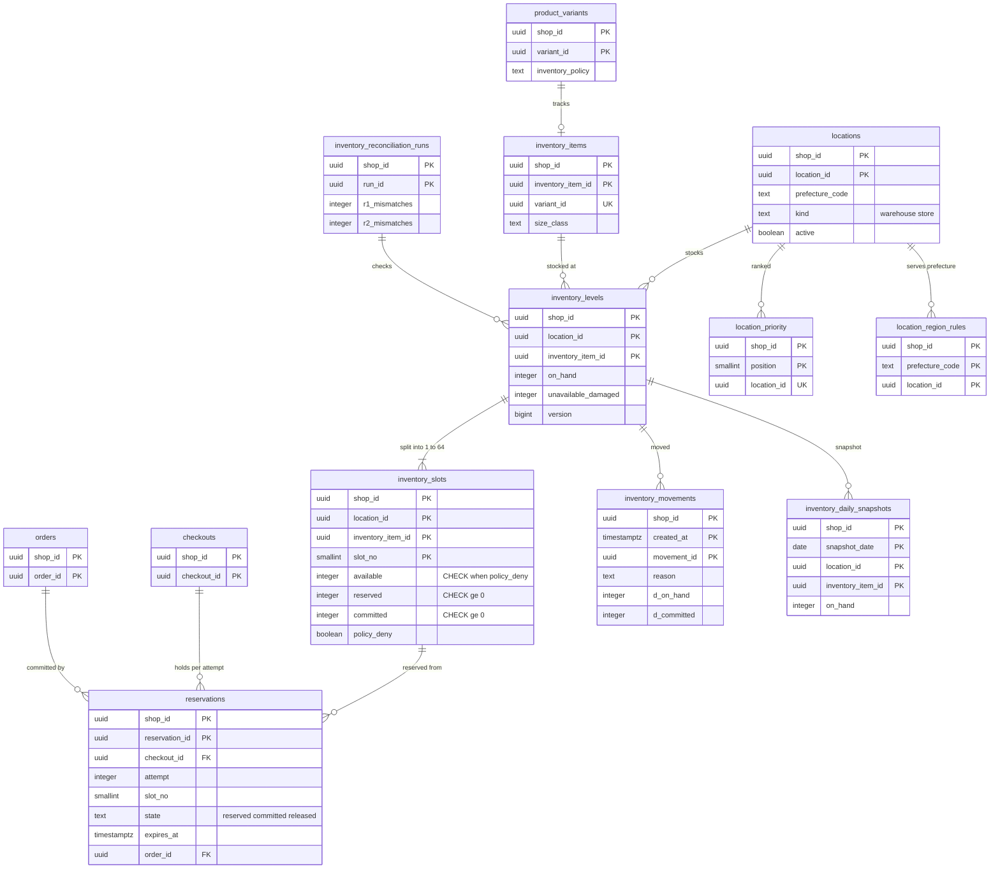

# Data model: 在庫と引き当て

[data-model.md](../data-model.md) の一部。規約はそちらの 3 節に従う。振る舞いは [inventory-and-reservations.md](../inventory-and-reservations.md)（4〜10 節）を正とする。決定は [ADR-0004](../../decisions/0004-inventory-reservation-model.md)（引き当て・確定・戻し、枠）、[ADR-0020](../../decisions/0020-inventory-slot-counters-and-reservation-sweep.md)（枠の数と掃除）、[ADR-0021](../../decisions/0021-inventory-slot-probing-and-rebalance.md)（枠の選び方と直し）、[ADR-0022](../../decisions/0022-location-selection-and-lock-order.md)（拠点の選び方とロックの順）、[ADR-0023](../../decisions/0023-inventory-movements-ledger-and-reconciliation.md)（移動の履歴と照合）。

| 表 | 置き場所 | 書く |
| --- | --- | --- |
| `locations`、`location_priority`、`location_region_rules` | ポッド `public` | `admin-api` |
| `inventory_items`、`inventory_levels`、`inventory_slots`、`reservations`、`inventory_movements` | ポッド `public` | `packages/inventory` の関数だけ（`checkout`、`admin-api`、`workers` の `reservation-sweeper`・`inventory-rebalancer`） |
| `inventory_daily_snapshots`、`inventory_reconciliation_runs` | ポッド `public` | `workers`（日次・毎時の照合） |

- 在庫の正本はこの表の行で、Valkey・待合室・キャッシュの数は目安（[ADR-0004](../../decisions/0004-inventory-reservation-model.md)）。
- 外に見せる数は枠の和で読む。ビュー `inventory_level_totals(shop_id, location_id, inventory_item_id, on_hand, available, reserved, committed, unavailable)` を置く（`security_invoker`、RLS が効く）。

## 1. ER 図

- `product_variants ||--o| inventory_items`：品目はバリエーションと 1 対 1 で常に作る。0 になるのは作成のトランザクションの中だけ（遅延の外部キー）。
- `reservations` → `inventory_slots` は `(location_id, inventory_item_id, slot_no)` の論理の参照（枠のまとめで枠が消えたら枠 0 と読む。[ADR-0021](../../decisions/0021-inventory-slot-probing-and-rebalance.md)）。外部キーを張らない。`checkouts`・`orders` への参照も論理（チェックアウトは保持で消える。`order_id` は任意）。
- `inventory_movements`・`inventory_daily_snapshots` は分割した表で、外部キーを張らない。
- `inventory_reconciliation_runs` → `inventory_levels` は「照合で見た」の意味の論理の関係（不一致の ID は `findings` に持つ）。

## 2. 表

### 2.1 `locations`

| 列 | 型 | NULL | 既定 | 説明 |
| --- | --- | --- | --- | --- |
| `shop_id`・`location_id` | `uuid` | NOT NULL | `location_id` は `uuidv7()` | |
| `name` | `text` | NOT NULL | — | |
| `kind` | `text` | NOT NULL | `'warehouse'` | `warehouse`・`store` |
| `prefecture_code` | `text` | NOT NULL | — | JIS X 0401 |
| `address` | `jsonb` | NOT NULL | — | 事業者の拠点の住所（買い手の値でない。D2） |
| `active` | `boolean` | NOT NULL | `true` | |
| `created_at`・`updated_at` | `timestamptz` | NOT NULL | `now()` | |

- キー：PK `(shop_id, location_id)`。UK `(shop_id, name)`。1 ショップ 20 まで（MVP、トリガー）。
- 削除：`on_hand <> 0` か `committed <> 0` の行がある拠点は消せない（`active = false` にする）。S1 の量：約 15 万行。

### 2.2 `location_priority`・`location_region_rules`

拠点の選び方の材料（[ADR-0022](../../decisions/0022-location-selection-and-lock-order.md)）。

| `location_priority` の列 | 型 | NULL | 既定 | 説明 |
| --- | --- | --- | --- | --- |
| `shop_id` | `uuid` | NOT NULL | — | |
| `position` | `smallint` | NOT NULL | — | 1 から |
| `location_id` | `uuid` | NOT NULL | — | |

| `location_region_rules` の列 | 型 | NULL | 既定 | 説明 |
| --- | --- | --- | --- | --- |
| `shop_id` | `uuid` | NOT NULL | — | |
| `prefecture_code` | `text` | NOT NULL | — | |
| `location_id` | `uuid` | NOT NULL | — | この都道府県へ出せる拠点。都道府県に行がなければ全拠点 |

- キー：`location_priority` PK `(shop_id, position)`、UK `(shop_id, location_id)`（`DEFERRABLE`）、FK → `locations`。`location_region_rules` PK `(shop_id, prefecture_code, location_id)`、FK → `locations`（`ON DELETE CASCADE`）。
- S1 の量：それぞれ数十万行。

### 2.3 `inventory_items`

バリエーションと 1 対 1 の品目。バリエーションの作成と同じトランザクションで作る。

| 列 | 型 | NULL | 既定 | 説明 |
| --- | --- | --- | --- | --- |
| `shop_id`・`inventory_item_id` | `uuid` | NOT NULL | `inventory_item_id` は `uuidv7()` | |
| `variant_id` | `uuid` | NOT NULL | — | |
| `size_class` | `smallint` | NULL | — | サイズの帯の送料（60・80・100・…） |
| `cost_amount` | `bigint` | NULL | — | 仕入れの値（`internal`。キャッシュの世代を上げない） |
| `created_at`・`updated_at` | `timestamptz` | NOT NULL | `now()` | |

- キー：PK `(shop_id, inventory_item_id)`。UK `(shop_id, variant_id)`。FK `(shop_id, variant_id)` → `product_variants`（`DEFERRABLE INITIALLY DEFERRED`、`ON DELETE CASCADE`）。
- 方針（`deny`・`continue`・数えない）はバリエーションの `inventory_policy` が正本で、この表に持たない（[ADR-0014](../../decisions/0014-product-variant-option-model.md)。D-4）。重さもバリエーションの `weight_g`。
- CHECK：`size_class IS NULL OR size_class IN (60, 80, 100, 120, 140, 160, 180, 200)`、`cost_amount IS NULL OR cost_amount >= 0`。S1 の量：約 2,500 万行。

### 2.4 `inventory_levels`

拠点 × 品目の行。`on_hand` と `unavailable` の内訳を持つ。熱くない操作（配送、入荷、調整、返品の戻し）だけが書く（[ADR-0020](../../decisions/0020-inventory-slot-counters-and-reservation-sweep.md)）。

| 列 | 型 | NULL | 既定 | 説明 |
| --- | --- | --- | --- | --- |
| `shop_id`・`location_id`・`inventory_item_id` | `uuid` | NOT NULL | — | |
| `on_hand` | `integer` | NOT NULL | `0` | 拠点に物としてある数 |
| `unavailable_damaged` | `integer` | NOT NULL | `0` | |
| `unavailable_qc` | `integer` | NOT NULL | `0` | |
| `unavailable_safety` | `integer` | NOT NULL | `0` | |
| `slot_count` | `smallint` | NOT NULL | `1` | 今の枠の数（1〜64） |
| `version` | `bigint` | NOT NULL | `1` | Webhook の `<brand>_version`（在庫） |
| `updated_at` | `timestamptz` | NOT NULL | `now()` | |

- キー：PK `(shop_id, location_id, inventory_item_id)`。FK → `locations`、`inventory_items`（`ON DELETE CASCADE`）。
- 索引：`(shop_id, inventory_item_id)` — 品目の全拠点の和（拠点の選び方の読み出し、照合の R1）。
- CHECK：`unavailable_* >= 0`、`slot_count BETWEEN 1 AND 64`。`on_hand` は `continue` の品目で負になりうるので CHECK を置かない。
- 不変条件 (I1)：`on_hand = Σslot(available + reserved + committed) + unavailable`。行をまたぐので CHECK にできず、照合の R1 と性質ベーステストで守る（[inventory-and-reservations.md](../inventory-and-reservations.md) の 4.2 節）。
- `version` は、拠点の行を書く熱くない操作（配送、入荷、調整、返品の戻し）が 1 上げる。熱い操作（引き当て・確定・戻し）は拠点の行に触れない（[ADR-0020](../../decisions/0020-inventory-slot-counters-and-reservation-sweep.md)）。代わりに、`inventory_levels/update` の事象をまとめる作業（1 品目 1 秒 1 回）が、出す時に `version` を 1 上げてから数を読む（1 秒 1 回なので熱くならない）。
- S1 の量：約 3,000 万行（品目 × 平均 1.2 拠点）。

### 2.5 `inventory_slots`

枠の行。`available`・`reserved`・`committed` を持つ（[ADR-0020](../../decisions/0020-inventory-slot-counters-and-reservation-sweep.md)）。

| 列 | 型 | NULL | 既定 | 説明 |
| --- | --- | --- | --- | --- |
| `shop_id`・`location_id`・`inventory_item_id` | `uuid` | NOT NULL | — | |
| `slot_no` | `smallint` | NOT NULL | `0` | 0〜63 |
| `available` | `integer` | NOT NULL | `0` | 売れる数 |
| `reserved` | `integer` | NOT NULL | `0` | 引き当て中の数 |
| `committed` | `integer` | NOT NULL | `0` | 注文に入った未配送の数 |
| `policy_deny` | `boolean` | NOT NULL | `true` | バリエーションの `inventory_policy = 'deny'` の写し。`set_policy()` だけが書く（D-4） |
| `updated_at` | `timestamptz` | NOT NULL | `now()` | |

- キー：PK `(shop_id, location_id, inventory_item_id, slot_no)`。FK `(shop_id, location_id, inventory_item_id)` → `inventory_levels`（`ON DELETE CASCADE`）。
- CHECK：
  - `reserved >= 0 AND committed >= 0`（I3）
  - `NOT policy_deny OR available >= 0`（I2。売り越さない）
  - `slot_no BETWEEN 0 AND 63`
- 索引：主キーだけ（枠の選び方の `ORDER BY available DESC LIMIT 3` は 1 品目 64 行までの走査）。
- 書き方：引き当て `available − n, reserved + n`（`WHERE … AND available >= n`）、確定 `reserved − n, committed + n`、戻し `reserved − n, available + n`。どれも 1 つの枠の行だけ。`lock_timeout = 100ms`。ロックの順は `(location_id, inventory_item_id, slot_no)` の昇順。
- `policy_deny` を `false → true` にする更新は、全枠で `available >= 0` のときだけ通る（CHECK が守る）。
- 数えない品目（`untracked`）は行を持たない。S1 の量：約 3,000 万行＋セールの品目の枠（1 品目 32）。

### 2.6 `reservations`

引き当ての行。状態は `reserved`・`committed`・`released` の 3 つだけ（[ADR-0004](../../decisions/0004-inventory-reservation-model.md) の注記）。

| 列 | 型 | NULL | 既定 | 説明 |
| --- | --- | --- | --- | --- |
| `shop_id`・`reservation_id` | `uuid` | NOT NULL | `reservation_id` は `uuidv7()` | |
| `checkout_id` | `uuid` | NOT NULL | — | |
| `attempt` | `integer` | NOT NULL | — | チェックアウトの試行 |
| `checkout_line_id` | `uuid` | NOT NULL | — | |
| `location_id`・`inventory_item_id` | `uuid` | NOT NULL | — | |
| `slot_no` | `smallint` | NOT NULL | — | 枠のまとめの後は枠 0 と読む |
| `qty` | `integer` | NOT NULL | — | 1〜9,999 |
| `state` | `text` | NOT NULL | `'reserved'` | `reserved`・`committed`・`released` |
| `expires_at` | `timestamptz` | NOT NULL | — | DB の `now()` ＋ 15 分（セールのショップは 10 分） |
| `committed_at`・`released_at` | `timestamptz` | NULL | — | |
| `release_reason` | `text` | NULL | — | `expired`・`abandoned`・`payment_failed`・`retaken` |
| `order_id` | `uuid` | NULL | — | 確定した注文 |
| `created_at` | `timestamptz` | NOT NULL | `now()` | |

- キー：PK `(shop_id, reservation_id)`。外部キーなし（上の注記）。
- 索引：
  - `(shop_id, checkout_id, attempt)` — 確定・戻し（`completeCheckout`、放棄）。
  - `(expires_at) WHERE state = 'reserved'` — `reservation-sweeper` の発見（X1 の発見の索引。関数 `sys.shops_with_expired_reservations()` がショップの ID だけを返す。D-6）。
  - `(shop_id, expires_at) WHERE state = 'reserved'` — ショップの中の掃除（`ORDER BY expires_at LIMIT 500 FOR UPDATE SKIP LOCKED`）。
  - `(shop_id, location_id, inventory_item_id) WHERE state = 'reserved'` — 照合の R4。
- CHECK：
  - `qty BETWEEN 1 AND 9999`
  - `state IN (…)`
  - `state <> 'committed' OR (committed_at IS NOT NULL AND order_id IS NOT NULL)`
  - `state <> 'released' OR (released_at IS NOT NULL AND release_reason IS NOT NULL)`
- 遷移：`reserved → committed` と `reserved → released` は、どちらも `WHERE state = 'reserved'` の条件つきの更新で、1 行が変わったときだけ枠の数を動かす（どちらか一方だけが勝つ）。トリガーで `committed`・`released` からの更新を拒む。
- 保持：`committed`・`released` の行は 30 日で消す（照合と調査に足りる。D-21）。S1 の量：約 400 万行（30 日分）。

### 2.7 `inventory_movements`

移動の履歴（追記だけ。[ADR-0023](../../decisions/0023-inventory-movements-ledger-and-reconciliation.md)）。確定は書き、引き当てと戻しは書かない。

| 列 | 型 | NULL | 既定 | 説明 |
| --- | --- | --- | --- | --- |
| `shop_id` | `uuid` | NOT NULL | — | |
| `created_at` | `timestamptz` | NOT NULL | `now()` | 分割の鍵 |
| `movement_id` | `uuid` | NOT NULL | `uuidv7()` | |
| `location_id`・`inventory_item_id` | `uuid` | NOT NULL | — | |
| `reason` | `text` | NOT NULL | — | `order_committed`・`fulfilled`・`order_cancelled`・`damaged_at_pick`・`received`・`adjusted`・`state_changed`・`return_restock`・`return_damaged`・`transfer_out`・`transfer_in`・`reconciliation_fix` |
| `d_on_hand`・`d_available`・`d_committed`・`d_unavailable` | `integer` | NOT NULL | `0` | 差分 |
| `ref_type` | `text` | NULL | — | `order`・`shipment`・`return`・`adjustment`・`transfer`・`reconciliation_run` |
| `ref_id` | `uuid` | NULL | — | |
| `actor_type` | `text` | NOT NULL | — | `staff`・`app`・`system` |
| `actor_id` | `text` | NULL | — | |

- キー：PK `(shop_id, created_at, movement_id)`（分割の鍵を含める）。
- 索引：`(shop_id, inventory_item_id, created_at)` — 事業者の画面の時刻の順、照合の R3。
- CHECK：`reason IN (…)`、`NOT (d_on_hand = 0 AND d_available = 0 AND d_committed = 0 AND d_unavailable = 0)`。
- 分割：`created_at` の月（`pg_partman`）。UPDATE・DELETE をロールに与えない。
- 保持：13 か月で分割を `DROP`（L3 の後に見直す）。S1 の量：約 600 万行/月。

### 2.8 `inventory_daily_snapshots`

日次の `on_hand` の写し（照合の R3 の起点）。

| 列 | 型 | NULL | 既定 | 説明 |
| --- | --- | --- | --- | --- |
| `shop_id` | `uuid` | NOT NULL | — | |
| `snapshot_date` | `date` | NOT NULL | — | 日本時間の日。分割の鍵 |
| `location_id`・`inventory_item_id` | `uuid` | NOT NULL | — | |
| `on_hand` | `integer` | NOT NULL | — | |
| `unavailable` | `integer` | NOT NULL | — | 内訳の和 |
| `taken_at` | `timestamptz` | NOT NULL | — | 写しのスナップショットの時刻（R3 の起点） |

- キー：PK `(shop_id, snapshot_date, location_id, inventory_item_id)`。
- 分割：`snapshot_date` の日。保持：3 日で `DROP`（R3 は直近の写しだけを使う。D-35）。
- S1 の量：約 3,000 万行/日（初期見積もり。E5 の `inventory-movements` で、変わった行だけを写す形にするかを測る）。

### 2.9 `inventory_reconciliation_runs`

照合（毎時、セールのショップは 5 分）の結果。不一致の明細は `reconcile_findings`（[ops-and-pods.md](ops-and-pods.md) の 2.11 節）にも行を残す。

| 列 | 型 | NULL | 既定 | 説明 |
| --- | --- | --- | --- | --- |
| `shop_id`・`run_id` | `uuid` | NOT NULL | `run_id` は `uuidv7()` | |
| `kind` | `text` | NOT NULL | — | `hourly`・`sale_5m`・`sale_final` |
| `snapshot_lsn` | `pg_lsn` | NULL | — | `REPEATABLE READ` の 1 つのスナップショットの位置 |
| `r1_mismatches`・`r2_mismatches`・`r3_mismatches`・`r4_mismatches` | `integer` | NOT NULL | `0` | |
| `findings` | `jsonb` | NOT NULL | `'[]'` | 不一致の拠点・品目の ID と差（数だけ。上限 1,000 件） |
| `state` | `text` | NOT NULL | `'running'` | `running`・`ok`・`mismatch`・`failed` |
| `started_at`・`finished_at` | `timestamptz` | NULL | — | |

- キー：PK `(shop_id, run_id)`。索引：`(shop_id, started_at)`。
- 保持：90 日。S1 の量：照合はショップのうち在庫を持つものだけ毎時（約 3 万ショップ）で、約 6,500 万行/90 日になる。ショップごとの行は不一致か、日に 1 回の要約だけを残す（毎時の `ok` は残さない）。残る量は約 300 万行。
