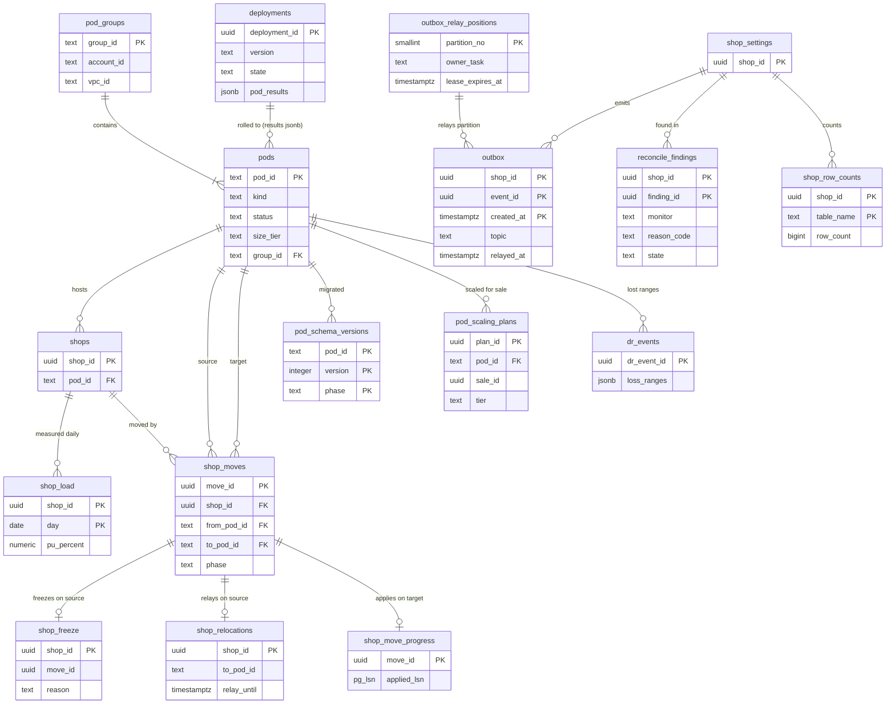

# Data model: ポッド・移し替え・outbox・運用

[data-model.md](../data-model.md) の一部。規約はそちらの 3 節に従う。振る舞いは [shops-and-pods.md](../shops-and-pods.md)（4・7・8 節）、[infrastructure.md](../infrastructure.md)、[capacity.md](../capacity.md)、[delivery.md](../delivery.md)（4〜6 節）、[observability.md](../observability.md)（5 節）を正とする。決定は [ADR-0011](../../decisions/0011-shop-placement-and-rebalancing.md)（置き場所）、[ADR-0012](../../decisions/0012-shop-mover-logical-decoding-and-cutover.md)（移し替え）、[ADR-0071](../../decisions/0071-osaka-dr-and-stage-up-criteria.md)（DR）、[ADR-0073](../../decisions/0073-correctness-monitors-and-independent-canary.md)（正しさの見張り）、[ADR-0074](../../decisions/0074-pod-size-tiers-and-pre-scaling.md)（ポッドの段）、[ADR-0075](../../decisions/0075-pod-wave-rollout-and-cross-pod-migrations.md)（波と移行）、[ADR-0076](../../decisions/0076-api-runtime-version-lifecycles.md)（API のバージョン）。

| 表 | 置き場所 | 書く |
| --- | --- | --- |
| `pods`、`pod_groups`、`shop_load`、`shop_moves` | 全体 `directory` | `shop-directory`、`placement-planner`、`shop-mover` |
| `shop_freeze`、`shop_relocations`、`shop_move_progress` | ポッド `sys`（RLS の外） | `shop-mover`（X3）、ポッドの入口のミドルウェアは読むだけ |
| `shop_row_counts` | ポッド `public` | 行を足す・消すトリガー |
| `outbox` | ポッド `public` | 全部のドメインのパッケージ（変更と同じトランザクション）。読むのは `relay`（X2） |
| `outbox_relay_positions` | ポッド `sys` | `relay` |
| `reconcile_findings` | ポッド `public` | 照合の作業（R・P・M・I・S・A・C） |
| `schema_migrations` | ポッド `sys`・全体 `ops` | `pod-migrator` |
| `pod_schema_versions`、`deployments`、`api_versions`、`dr_events`、`pod_scaling_plans`、`capacity_reviews`、`watched_shops` | 全体 `ops` | `pod-migrator`、CD、Ops の道具 |

- `outbox_relay_positions` は ADR-0003 の RLS の外の表の「outbox の読み出しの位置」を表にしたもの（D-7）。
- `canary_runs`（見張りの結果）は canary のアカウント（大阪）の S3 の JSONL と AMP の指標に置き、DB の表にしない（D-12。[stores.md](stores.md) の 3 節）。

## 1. ER 図

- `shop_moves` → `shop_freeze`・`shop_relocations`・`shop_move_progress` は全体からポッドの `sys` への別の DB の関係（同じ `move_id`）。外部キーを張らない。
- `pods` から `shop_moves` への 2 本の線は元（`from_pod_id`）と先（`to_pod_id`）。
- `outbox` は日の分割の表で、外部キーを張らない。`outbox_relay_positions` → `outbox` は `hashtext(shop_id) mod 8 = partition_no` の論理の関係。

## 2. 表

### 2.1 `pod_groups`・`pods`（全体 `directory`）

| `pod_groups` の列 | 型 | NULL | 既定 | 説明 |
| --- | --- | --- | --- | --- |
| `group_id` | `text` | NOT NULL | — | `pg01` |
| `account_id` | `text` | NOT NULL | — | `prod-pods-NN` の AWS アカウント |
| `vpc_id` | `text` | NOT NULL | — | `/16` |
| `pod_count` | `integer` | NOT NULL | `0` | 10 まで |

| `pods` の列 | 型 | NULL | 既定 | 説明 |
| --- | --- | --- | --- | --- |
| `pod_id` | `text` | NOT NULL | — | 3 文字（`p00`・`p01`・`x01`・`d01`）。再利用しない |
| `kind` | `text` | NOT NULL | — | `shared`・`isolation`・`canary`・`dedicated` |
| `status` | `text` | NOT NULL | `'accepting'` | `accepting`・`full`・`draining` |
| `size_tier` | `text` | NOT NULL | — | `p-min`・`p-std`・`x-min`・`x-std`・`x-large`・`d-xl` |
| `group_id` | `text` | NOT NULL | — | |
| `region` | `text` | NOT NULL | `'apne1'` | 今動いているリージョン |
| `origin_ids` | `jsonb` | NOT NULL | — | 東京・大阪の CloudFront の元の ID（`sys:origins` の元） |
| `alb_origin_id` | `text` | NOT NULL | — | |
| `capacity_pu` | `integer` | NOT NULL | — | ポッドの単位（PU）の容量 |
| `utilization_percent` | `numeric(5,2)` | NOT NULL | `0` | 日次の `Σ shop_load` |
| `size_tier_history` | `jsonb` | NOT NULL | `'[]'` | 段の変更の履歴（時刻、元、先、理由） |
| `created_at` | `timestamptz` | NOT NULL | `now()` | |

- キー：`pod_groups` PK `group_id`。`pods` PK `pod_id`、FK `group_id` → `pod_groups`。
- CHECK：`pod_id ~ '^[pxd][0-9]{2}$'`、`kind IN (…)`、`status IN (…)`、`size_tier IN (…)`。S1 の量：6 行。

### 2.2 `shop_load`（全体 `directory`）

ショップの日次の重さ（P3 でポッドが出した数）。

| 列 | 型 | NULL | 既定 | 説明 |
| --- | --- | --- | --- | --- |
| `shop_id` | `uuid` | NOT NULL | — | |
| `day` | `date` | NOT NULL | — | |
| `pod_id` | `text` | NOT NULL | — | |
| `max_write_rows_per_hour` | `bigint` | NOT NULL | — | 直近 7 日の最大 |
| `max_requests_per_minute` | `bigint` | NOT NULL | — | |
| `data_bytes` | `bigint` | NOT NULL | — | |
| `pu_percent` | `numeric(8,4)` | NOT NULL | — | `max(…) × 100`。最初の 30 日は 0.01 |

- キー：PK `(shop_id, day)`。索引：`(pod_id, day)` — ポッドの使用率と偏りの直しの候補。
- 分割：`day` の月。保持：90 日。S1 の量：約 900 万行。

### 2.3 `shop_moves`（全体 `directory`）

移し替えの段と結果（[ADR-0012](../../decisions/0012-shop-mover-logical-decoding-and-cutover.md)）。`phase`：`planned`・`approved`・`copying`・`catching_up`・`verifying`・`freezing`・`cutover`・`relaying`・`cleanup_wait`・`done`・`failed`・`aborted`。

| 列 | 型 | NULL | 既定 | 説明 |
| --- | --- | --- | --- | --- |
| `move_id` | `uuid` | NOT NULL | `uuidv7()` | |
| `shop_id` | `uuid` | NOT NULL | — | |
| `from_pod_id`・`to_pod_id` | `text` | NOT NULL | — | |
| `reason` | `text` | NOT NULL | — | `rebalance`・`isolation_for_sale`・`return_after_sale`・`dedicated`・`rollback` |
| `phase` | `text` | NOT NULL | `'planned'` | |
| `slot_name` | `text` | NULL | — | `move_<move_id>` |
| `snapshot_lsn`・`full_verify_lsn`・`freeze_lsn` | `pg_lsn` | NULL | — | |
| `freeze_started_at`・`freeze_ended_at` | `timestamptz` | NULL | — | 停止の時間（p99 10 秒） |
| `freeze_attempts` | `smallint` | NOT NULL | `0` | 1 時間に 3 回まで |
| `verify_result` | `jsonb` | NULL | — | 表ごとの行の数とチェックサムの比べ（数とハッシュだけ） |
| `approved_by` | `text` | NULL | — | Ops |
| `schema_version` | `integer` | NOT NULL | — | 元と先で同じ（ADR-0075） |
| `started_at`・`finished_at` | `timestamptz` | NULL | — | |
| `failure_reason` | `text` | NULL | — | |

- キー：PK `move_id`。FK → `shops`、`pods`（2 つ）。索引：`(shop_id, started_at)`（領域の文書の索引）。UK `(shop_id) WHERE phase NOT IN ('done','failed','aborted')`（1 ショップに同時に 1 つ）。
- CHECK：`from_pod_id <> to_pod_id`、`phase IN (…)`。同時の移し替えは元のポッドで 2、全体で 4（作業の側で確かめる）。
- 保持：2 年。S1 の量：年 数千行。

### 2.4 `shop_freeze`（ポッド `sys`）

移し替えの停止の印。印のあるショップへの書き込みは `shop_writable()`（RLS のポリシーと同じ関数）で拒む（503、`Retry-After: 5`）。

| 列 | 型 | NULL | 既定 | 説明 |
| --- | --- | --- | --- | --- |
| `shop_id` | `uuid` | NOT NULL | — | |
| `move_id` | `uuid` | NOT NULL | — | |
| `reason` | `text` | NOT NULL | — | `move_freeze`・`moved_out`（切り替えの後、元の行を消すまでの読み出しの専用） |
| `at` | `timestamptz` | NOT NULL | `now()` | |

- キー：PK `shop_id`。書くのは `shop-mover` だけ（排他のアドバイザリーロックを取った同じトランザクション）。ショップのデータの列を持たない。S1 の量：同時に数行。

### 2.5 `shop_relocations`（ポッド `sys`）

移し出したショップの中継の窓（15 分、最大 24 時間）。元のポッドの入口のミドルウェアが読み、先のポッドの ALB へ 1 段だけ中継する。

| 列 | 型 | NULL | 既定 | 説明 |
| --- | --- | --- | --- | --- |
| `shop_id` | `uuid` | NOT NULL | — | |
| `move_id` | `uuid` | NOT NULL | — | |
| `to_pod_id` | `text` | NOT NULL | — | |
| `relay_until` | `timestamptz` | NOT NULL | — | |
| `rows_delete_after` | `timestamptz` | NOT NULL | — | 元の行を消す時刻（7 日後） |

- キー：PK `shop_id`。`relay_until` は作成から 24 時間以内（作る関数で確かめる。CHECK は `now()` を使えない）。窓の後も行は `rows_delete_after` まで残す（中継はしない）。S1 の量：数十行。

### 2.6 `shop_move_progress`（ポッド `sys`）

先のポッドで当てた LSN（当てと同じトランザクションで書く。再開を冪等にする）。

| 列 | 型 | NULL | 既定 | 説明 |
| --- | --- | --- | --- | --- |
| `move_id` | `uuid` | NOT NULL | — | |
| `shop_id` | `uuid` | NOT NULL | — | |
| `applied_lsn` | `pg_lsn` | NOT NULL | — | |
| `skipped_conflicts` | `bigint` | NOT NULL | `0` | 先にない行の UPDATE を捨てた数 |
| `updated_at` | `timestamptz` | NOT NULL | `now()` | |

- キー：PK `move_id`。移し替えの `done` の 7 日後に消す。

### 2.7 `shop_row_counts`（ポッド）

大きな表のショップごとの行の数（停止の中の「行の数の比べ」を数え上げなしで行う）。

| 列 | 型 | NULL | 既定 | 説明 |
| --- | --- | --- | --- | --- |
| `shop_id` | `uuid` | NOT NULL | — | |
| `table_name` | `text` | NOT NULL | — | `orders`・`order_lines`・`inventory_movements`・`audit_events`・`products`・`product_variants`・`customers` など大きな表 |
| `row_count` | `bigint` | NOT NULL | `0` | |

- キー：PK `(shop_id, table_name)`。各表の `INSERT`・`DELETE` のトリガー（文の単位の遷移の表で集計）が書く。熱い行にならないように、在庫の枠と引き当ての表は数えない（停止の中は変わった行の照合と在庫の不変条件で確かめる）。
- RLS：テナントの表（移し替えで移る）。S1 の量：約 100 万行。

### 2.8 `outbox`（ポッド）

ドメインの事象。変更と同じトランザクションで書き、`relay` が SNS へ送る（[ADR-0005](../../decisions/0005-checkout-state-machine-and-exactly-once-orders.md)、[ADR-0016](../../decisions/0016-collection-membership-and-catalog-events.md)）。

| 列 | 型 | NULL | 既定 | 説明 |
| --- | --- | --- | --- | --- |
| `shop_id` | `uuid` | NOT NULL | — | |
| `event_id` | `uuid` | NOT NULL | `uuidv7()` | `X-<Brand>-Event-Id` |
| `created_at` | `timestamptz` | NOT NULL | `now()` | 分割の鍵 |
| `topic` | `text` | NOT NULL | — | `orders/create`・`products/update`・`payment.capture_requested`・`refund.requested`・`shop/lifecycle`・`staff/membership_changed` など |
| `aggregate_type` | `text` | NOT NULL | — | `order`・`product`・`collection`・`inventory_level`・`checkout`・`refund` など |
| `aggregate_id` | `uuid` | NOT NULL | — | |
| `aggregate_version` | `bigint` | NULL | — | `catalog_version`・`order_version` など（使い手が古い事象を捨てる） |
| `payload` | `jsonb` | NOT NULL | `'{}'` | ID・数・変わった項目の種類・理由のコードだけ。個人のデータを入れない |
| `message_group` | `text` | NOT NULL | — | ジョブの FIFO のメッセージ グループ（既定は `shop_id`） |
| `relayed_at` | `timestamptz` | NULL | — | |

- キー：PK `(shop_id, event_id, created_at)`。
- 索引：`(created_at) WHERE relayed_at IS NULL` — `relay` の読み出し（X2。`relay` のロールは `outbox` の SELECT と `UPDATE (relayed_at)` だけ、`BYPASSRLS`）。`(shop_id, created_at) WHERE relayed_at IS NULL` — 移し替えの停止の中で、そのショップの未送信を送り切る。
- CHECK：`pg_column_size(payload) <= 8192`。
- 分割：`created_at` の日。保持：全部送って 1 日の後に分割を `DROP`。移し替えのコピーの対象から外す（停止の中で送り切るので、先へ写さない）。S1 の量：約 200 万行/日（`relayed_at IS NULL` の行は通常 数千）。

### 2.9 `outbox_relay_positions`（ポッド `sys`）

`relay` のタスクの持ち分（`hashtext(shop_id::text) & 7` の 8 つの区画）と貸し出し。ADR-0003 の「outbox の読み出しの位置」（D-7）。

| 列 | 型 | NULL | 既定 | 説明 |
| --- | --- | --- | --- | --- |
| `partition_no` | `smallint` | NOT NULL | — | 0〜7 |
| `owner_task` | `text` | NULL | — | ECS のタスクの ID |
| `lease_expires_at` | `timestamptz` | NULL | — | 10 秒。更新で延ばす |
| `last_relayed_at` | `timestamptz` | NULL | — | 最後に送った事象の `created_at`（遅れの指標） |

- キー：PK `partition_no`。CHECK：`partition_no BETWEEN 0 AND 7`。ショップのデータの列を持たない。区画の中の順は `created_at, event_id`（同じショップの順を守る）。

### 2.10 `schema_migrations`（ポッド `sys`・全体 `ops`）・`pod_schema_versions`（全体 `ops`）

| `schema_migrations` の列 | 型 | NULL | 既定 | 説明 |
| --- | --- | --- | --- | --- |
| `version` | `integer` | NOT NULL | — | |
| `phase` | `text` | NOT NULL | — | `expand`・`backfill`・`contract` |
| `name` | `text` | NOT NULL | — | |
| `checksum` | `bytea` | NOT NULL | — | 移行の文の SHA-256 |
| `applied_at` | `timestamptz` | NOT NULL | `now()` | |
| `duration_ms` | `integer` | NOT NULL | — | |

| `pod_schema_versions` の列 | 型 | NULL | 既定 | 説明 |
| --- | --- | --- | --- | --- |
| `pod_id` | `text` | NOT NULL | — | 全体の DB は `global` |
| `version` | `integer` | NOT NULL | — | |
| `phase` | `text` | NOT NULL | — | |
| `state` | `text` | NOT NULL | — | `applied`・`failed`・`backfill_done` |
| `applied_at` | `timestamptz` | NOT NULL | `now()` | |

- キー：`schema_migrations` PK `(version, phase)`。`pod_schema_versions` PK `(pod_id, version, phase)`。縮める段は、全ポッドで広げる段が当たり、全サービスが新しい形だけを使って 7 日の後（`pod-migrator` が確かめる）。

### 2.11 `reconcile_findings`（ポッド）

正しさの見張り（R 在庫、P 決済と注文、M 金額、I 分離、S スクリプト、A 監査ログ、C CHECK の違反）の不一致の行（[ADR-0073](../../decisions/0073-correctness-monitors-and-independent-canary.md)）。

| 列 | 型 | NULL | 既定 | 説明 |
| --- | --- | --- | --- | --- |
| `shop_id`・`finding_id` | `uuid` | NOT NULL | `finding_id` は `uuidv7()` | |
| `monitor` | `text` | NOT NULL | — | `R1`〜`R4`・`P`・`P1`〜`P4`・`M`・`I`・`S`・`A`・`C` |
| `target_type` | `text` | NOT NULL | — | `inventory_level`・`checkout`・`order`・`payment_attempt`・`refund`・`audit_day` |
| `target_id` | `text` | NOT NULL | — | ID だけ |
| `expected`・`actual` | `bigint` | NULL | — | 数 |
| `reason_code` | `text` | NOT NULL | — | |
| `severity` | `text` | NOT NULL | — | `SEV1`・`SEV2`・`ticket` |
| `state` | `text` | NOT NULL | `'open'` | `open`・`investigating`・`fixed`・`false_positive` |
| `found_at` | `timestamptz` | NOT NULL | `now()` | |
| `resolved_at` | `timestamptz` | NULL | — | |
| `resolution_ref` | `text` | NULL | — | 直しの調整の移動の行・起票の番号 |

- キー：PK `(shop_id, finding_id)`。索引：`(state, found_at) WHERE state = 'open'` — 調査の一覧（X1 の発見の索引）。
- 買い手の個人のデータを入れない（ID と数と理由のコードだけ）。保持：解決の後 1 年。S1 の量：0 が目標（数百行/年）。

### 2.12 `deployments`・`api_versions`（全体 `ops`）

| `deployments` の列 | 型 | NULL | 既定 | 説明 |
| --- | --- | --- | --- | --- |
| `deployment_id` | `uuid` | NOT NULL | `uuidv7()` | |
| `version` | `text` | NOT NULL | — | リリースのバージョン |
| `kind` | `text` | NOT NULL | — | `pods`・`global`・`edge_function`・`waf` |
| `state` | `text` | NOT NULL | — | `running`・`done`・`rolled_back`・`halted` |
| `current_wave` | `smallint` | NOT NULL | `0` | 0（`p00`）〜5 |
| `pod_results` | `jsonb` | NOT NULL | `'{}'` | ポッドごとの結果と、自動のロールバックの条件の値 |
| `approved_by` | `text` | NOT NULL | — | 作成者と別の Ops |
| `started_at`・`finished_at` | `timestamptz` | — | — | |

| `api_versions` の列 | 型 | NULL | 既定 | 説明 |
| --- | --- | --- | --- | --- |
| `api` | `text` | NOT NULL | — | `admin`・`storefront`・`functions` |
| `version` | `text` | NOT NULL | — | `YYYY-MM` |
| `rc_at`・`released_at`・`deprecated_at`・`unsupported_at` | `date` | NULL | — | 3 か月前、リリース、9 か月、12 か月 |

- キー：`deployments` PK `deployment_id`。`api_versions` PK `(api, version)`。S1 の量：数千行。

### 2.13 `dr_events`（全体 `ops`）

大阪への切り替えの記録と、失った範囲（[ADR-0071](../../decisions/0071-osaka-dr-and-stage-up-criteria.md)）。

| 列 | 型 | NULL | 既定 | 説明 |
| --- | --- | --- | --- | --- |
| `dr_event_id` | `uuid` | NOT NULL | `uuidv7()` | |
| `kind` | `text` | NOT NULL | — | `failover_to_osaka`・`failback_to_tokyo`・`drill` |
| `decided_by` | `text[]` | NOT NULL | — | IC と Ops の責任者 |
| `steps` | `jsonb` | NOT NULL | `'[]'` | 順の段と時刻 |
| `loss_ranges` | `jsonb` | NOT NULL | `'{}'` | ポッドごとの失った時刻の範囲 |
| `started_at`・`finished_at` | `timestamptz` | — | — | |

- キー：PK `dr_event_id`。保持：消さない。S1 の量：数十行。

### 2.14 `pod_scaling_plans`・`capacity_reviews`・`watched_shops`（全体 `ops`）

| `pod_scaling_plans` の列 | 型 | NULL | 既定 | 説明 |
| --- | --- | --- | --- | --- |
| `plan_id` | `uuid` | NOT NULL | `uuidv7()` | |
| `pod_id` | `text` | NOT NULL | — | |
| `sale_id` | `uuid` | NULL | — | |
| `tier` | `text` | NOT NULL | — | 決めた段 |
| `aurora_up_at`・`ecs_min_up_at`・`ecs_min_down_at`・`aurora_down_at` | `timestamptz` | NULL | — | 予定 |
| `results` | `jsonb` | NOT NULL | `'{}'` | 実際の時刻と結果 |

| `capacity_reviews` の列 | 型 | NULL | 既定 | 説明 |
| --- | --- | --- | --- | --- |
| `month` | `date` | NOT NULL | — | |
| `metrics` | `jsonb` | NOT NULL | — | 段階を上げる 6 指標の値（ポッドの組、`mtd-storefront` の要求、熱い集まり、全体の Aurora の CPU、最大のショップ、1 ショップのセールの注文） |
| `decision` | `text` | NULL | — | |
| `reviewed_by` | `text[]` | NOT NULL | — | Ops、PM |

| `watched_shops` の列 | 型 | NULL | 既定 | 説明 |
| --- | --- | --- | --- | --- |
| `shop_id` | `uuid` | NOT NULL | — | |
| `reason` | `text` | NOT NULL | — | `flash_sale`・`isolation_pod`・`gmv_top500` |
| `until` | `timestamptz` | NULL | — | |

- キー：`pod_scaling_plans` PK `plan_id`（FK → `pods`）。`capacity_reviews` PK `month`。`watched_shops` PK `(shop_id, reason)`。
- `watched_shops` は AppConfig へも配る（テレメトリーの `shop` のラベルの一覧。[ADR-0072](../../decisions/0072-telemetry-pipeline-and-shop-cardinality.md)）。S1 の量：それぞれ数百〜数千行。
