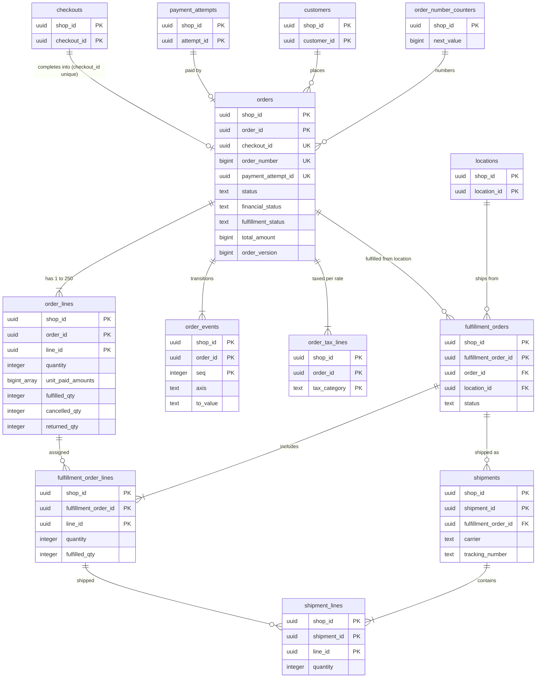
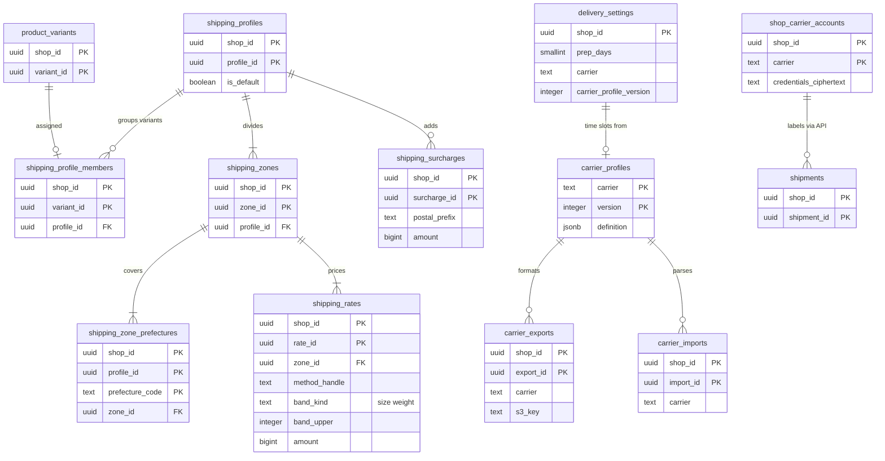

# Data model: 注文と配送

[data-model.md](../data-model.md) の一部。規約はそちらの 3 節に従う。振る舞いは [orders-and-fulfillment.md](../orders-and-fulfillment.md)（3〜9 節）を正とする。決定は [ADR-0005](../../decisions/0005-checkout-state-machine-and-exactly-once-orders.md)（`orders.checkout_id` の一意）、[ADR-0039](../../decisions/0039-order-status-axes-and-edits.md)（3 つの軸と編集、注文の番号）、[ADR-0040](../../decisions/0040-fulfillment-orders-and-partial-fulfillment.md)（配送の指示）、[ADR-0041](../../decisions/0041-shipping-rate-tables.md)（送料の表）、[ADR-0042](../../decisions/0042-carrier-integration-profiles.md)（運送会社の型）。

| 表 | 置き場所 | 書く |
| --- | --- | --- |
| `orders`、`order_lines`、`order_events`、`order_number_counters` | ポッド `public` | `checkout`（`completeCheckout`）、`admin-api`（`packages/orders` の遷移の関数） |
| `fulfillment_orders`、`fulfillment_order_lines`、`shipments`、`shipment_lines` | ポッド `public` | `checkout`（作成）、`admin-api`（`fulfillment_write`）、`workers`（追跡の取り込み、運送会社の API） |
| `shipping_profiles`、`shipping_profile_members`、`shipping_zones`、`shipping_zone_prefectures`、`shipping_rates`、`shipping_surcharges`、`delivery_settings` | ポッド `public` | `admin-api` |
| `carrier_exports`、`carrier_imports`、`shop_carrier_accounts` | ポッド `public` | `admin-api`、`workers` |
| `carrier_profiles` | 全体 `ref`、ポッド `sys`（P5 の参照のデータの写し） | 本システムの運用 |
| `notification_templates` | ポッド `public` | `admin-api` |

- 注文の金額は、送信で固定した価格の写しの写し（[ADR-0005](../../decisions/0005-checkout-state-machine-and-exactly-once-orders.md)）。注文は写しの値をそのまま持ち、計算し直さない（編集は同じ関数で全体を計算し直す）。
- 注文の買い手の個人のデータ（メール、電話、配送先、メモ）は列の暗号。都道府県は暗号化しない列にも持つ（段階 0）。

## 1. ER 図

### 1.1 注文と配送

- `checkouts ||--o| orders`：`orders.checkout_id` は一意で、1 つのチェックアウトから注文は 0 か 1（[ADR-0005](../../decisions/0005-checkout-state-machine-and-exactly-once-orders.md)）。チェックアウトは保持で消えるので、外部キーを張らない論理の参照（D-15）。`payment_attempt_id` も一意で 0 か 1。
- `customers` → `orders` は任意の参照（`completeCheckout` はメールの HMAC で顧客を引くか作るので通常は値がある。外部キーは張る。削除の請求の後も `customer_id` は残す）。
- `fulfillment_order_lines.line_id` は `order_lines` の行。`shipment_lines.line_id` は配送の指示の行と同じ注文の行の ID。

### 1.2 送料と運送会社

- `shipping_profile_members` にないバリエーションは既定のプロファイル（`is_default`）に属する（`||--o|`）。
- `shipping_zone_prefectures` の主キー `(profile_id, prefecture_code)` で「1 つのプロファイルの中で、都道府県は 1 つの地域」を DB で守る。
- `carrier_profiles` は全体の参照のデータで、ポッドの写しへの外部キーは張らない（`(carrier, version)` の論理の参照）。

## 2. 表

### 2.1 `orders`

| 列 | 型 | NULL | 既定 | 説明 |
| --- | --- | --- | --- | --- |
| `shop_id`・`order_id` | `uuid` | NOT NULL | `order_id` は `uuidv7()` | 注文の識別 |
| `checkout_id` | `uuid` | NOT NULL | — | 一意 |
| `payment_attempt_id` | `uuid` | NULL | — | 注文を作った試行。手で作る注文（MVP の後）は NULL |
| `order_number` | `bigint` | NOT NULL | — | 表示の番号（1001 から）。時刻の順でなく、欠番を許す |
| `customer_id` | `uuid` | NULL | — | |
| `snapshot_id` | `uuid` | NOT NULL | — | 価格の写し（論理の参照） |
| `snapshot_hash` | `bytea` | NOT NULL | — | |
| `currency` | `text` | NOT NULL | — | |
| `subtotal_amount` | `bigint` | NOT NULL | — | 単位の `paid_amount` の和（割引の後の商品） |
| `product_discount_amount`・`order_discount_amount` | `bigint` | NOT NULL | `0` | |
| `shipping_amount`・`shipping_discount_amount` | `bigint` | NOT NULL | `0` | |
| `fees_amount` | `bigint` | NOT NULL | `0` | 手数料 |
| `total_amount` | `bigint` | NOT NULL | — | 請求の合計 = 写しの合計 |
| `total_tax_amount` | `bigint` | NOT NULL | — | `Σ order_tax_lines.tax_amount` |
| `tax_rules_version` | `integer` | NOT NULL | — | 使った税の規則（D-17） |
| `rounding_mode` | `text` | NOT NULL | — | 使った丸めの方法 |
| `email_ciphertext`・`phone_ciphertext` | `text` | NULL | — | D1 |
| `email_hmac`・`phone_hmac` | `bytea` | NULL | — | 管理画面の完全一致 |
| `shipping_address_ciphertext` | `text` | NULL | — | D1 |
| `shipping_prefecture_code` | `text` | NULL | — | 段階 0 |
| `delivery_method_handle` | `text` | NULL | — | |
| `delivery_date` | `date` | NULL | — | |
| `delivery_time_slot` | `text` | NULL | — | |
| `note_ciphertext` | `text` | NULL | — | 注文のメモの自由記述（D1） |
| `status` | `text` | NOT NULL | `'open'` | `open`・`closed`・`cancelled` |
| `financial_status` | `text` | NOT NULL | — | `pending`・`authorized`・`paid`・`partially_refunded`・`refunded`・`voided`・`expired`・`capture_failed` |
| `fulfillment_status` | `text` | NOT NULL | `'unfulfilled'` | `unfulfilled`・`partially_fulfilled`・`fulfilled` |
| `capture_mode` | `text` | NOT NULL | — | 作成の時のショップの設定の写し |
| `captured_amount` | `bigint` | NOT NULL | `0` | |
| `refunded_amount` | `bigint` | NOT NULL | `0` | `succeeded` の返金の和 |
| `payment_due_at` | `timestamptz` | NULL | — | 非同期の手段 |
| `authorization_expires_at` | `timestamptz` | NULL | — | |
| `over_limit_reasons` | `text[]` | NOT NULL | `'{}'` | `discount_usage`・`purchase_limit`（決済済みで取り直せなかった。[ADR-0029](../../decisions/0029-checkout-completion-decision-table.md)） |
| `cancel_reason` | `text` | NULL | — | `customer`・`inventory`・`fraud`・`payment_expired`・`declined`・`other` |
| `sale_id` | `uuid` | NULL | — | |
| `market_id` | `uuid` | NOT NULL | — | |
| `fx_rate_id` | `uuid` | NULL | — | |
| `locale` | `text` | NOT NULL | — | |
| `order_version` | `bigint` | NOT NULL | `1` | 編集のたびに 1 上げる。Admin API の比べ、Webhook の `<brand>_version` |
| `retained_until` | `date` | NULL | — | 金額・税の記録の保存の期間の終わり（L4） |
| `anonymized_at` | `timestamptz` | NULL | — | 顧客の削除の請求で D1 の列を消した時刻 |
| `created_at`・`updated_at` | `timestamptz` | NOT NULL | `now()` | |
| `cancelled_at`・`closed_at` | `timestamptz` | NULL | — | |

- キー：PK `(shop_id, order_id)`。UK `(shop_id, checkout_id)`（**1 つのチェックアウトに 1 つの注文**。違反は既存の注文を返す成功）。UK `(shop_id, order_number)`。UK `(shop_id, payment_attempt_id) WHERE payment_attempt_id IS NOT NULL`。FK `(shop_id, customer_id)` → `customers`。
- 索引：`(shop_id, created_at)` — 一覧と既定の直近 60 日（`read_all_orders`）。`(shop_id, financial_status, payment_due_at) WHERE financial_status = 'pending'` — 支払いの期限。`(shop_id, email_hmac)`、`(shop_id, phone_hmac)` — 管理画面の検索。`(shop_id, status, closed_at)` — 30 日の自動の `closed`。
- CHECK：
  - 値の一覧（`status`・`financial_status`・`fulfillment_status`・`capture_mode`・`cancel_reason`）
  - 各額 `>= 0`、`total_amount = subtotal_amount + shipping_amount - shipping_discount_amount + fees_amount`
  - `captured_amount <= total_amount`、`refunded_amount <= GREATEST(captured_amount, 0)`（返金は確定の額を超えない）
  - `status <> 'cancelled' OR cancelled_at IS NOT NULL`
  - `financial_status <> 'pending' OR payment_due_at IS NOT NULL`
- トリガー：3 つの軸は `packages/orders` の遷移の関数だけが書く（`app.order_transition = on`）。`order_version` を下げる更新を拒む。`order_number` は変えない。
- 保持：D1 の列は顧客の削除の請求かショップの削除まで（[security.md](../security.md) の 6.2 節）。金額・税の行は `retained_until` まで（ショップの削除で保持のバケットへ写す。L3・L4 の確認待ち）。S1 の量：約 100 万行/月（年 1,250 万）。

### 2.2 `order_lines`

| 列 | 型 | NULL | 既定 | 説明 |
| --- | --- | --- | --- | --- |
| `shop_id`・`order_id`・`line_id` | `uuid` | NOT NULL | — | `line_id` はチェックアウトの行と同じ ID |
| `variant_id`・`product_id` | `uuid` | NULL | — | 削除の後も写しで残すので NULL を許す |
| `inventory_item_id` | `uuid` | NULL | — | |
| `title`・`variant_title`・`sku` | `text` | NULL | — | 写し（`title` は NOT NULL） |
| `quantity` | `integer` | NOT NULL | — | |
| `unit_price_amount` | `bigint` | NOT NULL | — | 税込みの単価 |
| `tax_category` | `text` | NOT NULL | — | |
| `rate_bp` | `integer` | NOT NULL | — | |
| `unit_product_discounts` | `bigint[]` | NOT NULL | — | 単位ごとの商品の割引（長さ = `quantity`） |
| `unit_order_discounts` | `bigint[]` | NOT NULL | — | 単位ごとの注文の割引の按分 |
| `unit_paid_amounts` | `bigint[]` | NOT NULL | — | `= 単価 − 両方`（[ADR-0033](../../decisions/0033-discount-allocation-and-rounding.md)） |
| `fulfilled_qty`・`cancelled_qty`・`returned_qty` | `integer` | NOT NULL | `0` | |
| `location_id` | `uuid` | NULL | — | 引き当てた拠点 |
| `requires_shipping` | `boolean` | NOT NULL | `true` | |
| `position` | `smallint` | NOT NULL | — | |

- キー：PK `(shop_id, order_id, line_id)`。FK → `orders`（`ON DELETE CASCADE`）。
- 索引：`(shop_id, inventory_item_id) WHERE fulfilled_qty + cancelled_qty < quantity` — 照合の R2（未配送の数の和）。`(shop_id, product_id, order_id)` — おすすめの共起の計算。
- CHECK：
  - `quantity BETWEEN 1 AND 9999`
  - `cardinality(unit_paid_amounts) = quantity AND cardinality(unit_product_discounts) = quantity AND cardinality(unit_order_discounts) = quantity`
  - `fulfilled_qty + cancelled_qty <= quantity`、`returned_qty <= fulfilled_qty`、各 `>= 0`
- `unit_paid_amounts[k] = unit_price_amount − unit_product_discounts[k] − unit_order_discounts[k]` は関数で作り、性質ベーステストで確かめる（配列の要素ごとの CHECK は置かない）。
- S1 の量：約 250 万行/月。

### 2.3 `order_events`

軸の遷移と編集の記録（追記だけ）。

| 列 | 型 | NULL | 既定 | 説明 |
| --- | --- | --- | --- | --- |
| `shop_id`・`order_id` | `uuid` | NOT NULL | — | |
| `seq` | `integer` | NOT NULL | — | |
| `axis` | `text` | NOT NULL | — | `status`・`financial`・`fulfillment`・`edit` |
| `from_value`・`to_value` | `text` | NULL | — | |
| `dt_row` | `smallint` | NULL | — | DT-ORD-001・DT-RET-001 の行 |
| `reason_code` | `text` | NULL | — | |
| `actor_type` | `text` | NOT NULL | — | `buyer`・`staff`・`app`・`system` |
| `actor_id` | `text` | NULL | — | |
| `order_version` | `bigint` | NOT NULL | — | 遷移の後の値 |
| `at` | `timestamptz` | NOT NULL | `now()` | |

- キー：PK `(shop_id, order_id, seq)`。FK → `orders`（`ON DELETE CASCADE`）。UPDATE をロールに与えない。S1 の量：約 500 万行/月。

### 2.4 `order_number_counters`

| 列 | 型 | NULL | 既定 | 説明 |
| --- | --- | --- | --- | --- |
| `shop_id` | `uuid` | NOT NULL | — | |
| `next_value` | `bigint` | NOT NULL | `1001` | |

- キー：PK `shop_id`。CHECK：`next_value >= 1`。トリガー：下げる更新を拒む。
- 通常は `completeCheckout` の中で 1 つ取る。セールの `open` の間は `checkout` のタスクが別のトランザクションで 20 ずつ塊を取る（欠番を許す。[ADR-0039](../../decisions/0039-order-status-axes-and-edits.md)）。S1 の量：10 万行。

### 2.5 `fulfillment_orders`

配送の指示。状態：`open`・`on_hold`・`in_progress`・`closed`・`cancelled`（[ADR-0040](../../decisions/0040-fulfillment-orders-and-partial-fulfillment.md)）。

| 列 | 型 | NULL | 既定 | 説明 |
| --- | --- | --- | --- | --- |
| `shop_id`・`fulfillment_order_id` | `uuid` | NOT NULL | `fulfillment_order_id` は `uuidv7()` | |
| `order_id` | `uuid` | NOT NULL | — | |
| `location_id` | `uuid` | NOT NULL | — | |
| `number` | `text` | NOT NULL | — | `<order_number>-<n>`（送り状の CSV と追跡の番号の取り込みの照合の鍵） |
| `status` | `text` | NOT NULL | — | 支払いが `pending` の注文は `on_hold` で作る |
| `hold_reason` | `text` | NULL | — | `awaiting_payment`・`merchant` |
| `shipping_address_ciphertext` | `text` | NULL | — | 写し（配送先の変更は最初の配送の前だけ） |
| `shipping_prefecture_code` | `text` | NULL | — | |
| `delivery_date`・`delivery_time_slot` | `date`・`text` | NULL | — | |
| `created_at`・`updated_at` | `timestamptz` | NOT NULL | `now()` | |

- キー：PK `(shop_id, fulfillment_order_id)`。UK `(shop_id, number)`。FK → `orders`（`ON DELETE CASCADE`）、`locations`。
- 索引：`(shop_id, order_id)`、`(shop_id, location_id, status)` — 拠点の作業の一覧（領域の文書の索引）。
- CHECK：`status IN (…)`、`status <> 'on_hold' OR hold_reason IS NOT NULL`。S1 の量：約 120 万行/月。

### 2.6 `fulfillment_order_lines`

| 列 | 型 | NULL | 既定 | 説明 |
| --- | --- | --- | --- | --- |
| `shop_id`・`fulfillment_order_id`・`line_id` | `uuid` | NOT NULL | — | `line_id` は注文の行 |
| `order_id` | `uuid` | NOT NULL | — | |
| `quantity` | `integer` | NOT NULL | — | |
| `fulfilled_qty`・`cancelled_qty` | `integer` | NOT NULL | `0` | |

- キー：PK `(shop_id, fulfillment_order_id, line_id)`。FK → `fulfillment_orders`（`ON DELETE CASCADE`）、`(shop_id, order_id, line_id)` → `order_lines`。
- CHECK：`quantity >= 1`、`fulfilled_qty + cancelled_qty <= quantity`。S1 の量：約 250 万行/月。

### 2.7 `shipments`・`shipment_lines`

配送（発送の単位）。作成のトランザクションで注文の行の `fulfilled_qty` を増やし、在庫の `committed` と `on_hand` を減らし、移動の行 `fulfilled` を書く。

| `shipments` の列 | 型 | NULL | 既定 | 説明 |
| --- | --- | --- | --- | --- |
| `shop_id`・`shipment_id` | `uuid` | NOT NULL | `shipment_id` は `uuidv7()` | |
| `fulfillment_order_id`・`order_id` | `uuid` | NOT NULL | — | |
| `carrier` | `text` | NOT NULL | — | `yamato` などの運送会社の名前（型の `carrier`） |
| `tracking_number` | `text` | NULL | — | |
| `label_s3_key` | `text` | NULL | — | `shops/<shop_id>/labels/<shipment_id>.pdf` |
| `tracking_status` | `text` | NULL | — | `accepted`・`in_transit`・`delivered`・`absent`・`returned` |
| `last_tracked_at` | `timestamptz` | NULL | — | 6 時間ごと、最大 14 日 |
| `delivered_at` | `timestamptz` | NULL | — | 返品の受付の期間の起点 |
| `created_by_type` | `text` | NOT NULL | — | `staff`・`app`・`csv_import`・`carrier_api` |
| `created_at` | `timestamptz` | NOT NULL | `now()` | |

| `shipment_lines` の列 | 型 | NULL | 既定 | 説明 |
| --- | --- | --- | --- | --- |
| `shop_id`・`shipment_id`・`line_id` | `uuid` | NOT NULL | — | |
| `fulfillment_order_id` | `uuid` | NOT NULL | — | |
| `quantity` | `integer` | NOT NULL | — | |

- キー：`shipments` PK `(shop_id, shipment_id)`、UK `(shop_id, carrier, tracking_number) WHERE tracking_number IS NOT NULL`（同じ追跡の番号の再作成は既存を返す）、FK → `fulfillment_orders`。`shipment_lines` PK `(shop_id, shipment_id, line_id)`、FK → `shipments`（`ON DELETE CASCADE`）、`(shop_id, fulfillment_order_id, line_id)` → `fulfillment_order_lines`。
- 索引：`(shop_id, order_id)`。`(last_tracked_at) WHERE delivered_at IS NULL AND tracking_number IS NOT NULL` — 追跡の照会の発見（X1 の発見の索引）。
- CHECK：`quantity >= 1`、`label_s3_key IS NULL OR label_s3_key LIKE 'shops/' || shop_id::text || '/labels/%'`。S1 の量：約 110 万行/月。

### 2.8 `shipping_profiles`・`shipping_profile_members`

| `shipping_profiles` の列 | 型 | NULL | 既定 | 説明 |
| --- | --- | --- | --- | --- |
| `shop_id`・`profile_id` | `uuid` | NOT NULL | `profile_id` は `uuidv7()` | |
| `name` | `text` | NOT NULL | — | |
| `is_default` | `boolean` | NOT NULL | `false` | |

| `shipping_profile_members` の列 | 型 | NULL | 既定 | 説明 |
| --- | --- | --- | --- | --- |
| `shop_id`・`variant_id` | `uuid` | NOT NULL | — | |
| `profile_id` | `uuid` | NOT NULL | — | |

- キー：`shipping_profiles` PK `(shop_id, profile_id)`、UK `(shop_id) WHERE is_default`。`shipping_profile_members` PK `(shop_id, variant_id)`（1 つのバリエーションは 1 つのプロファイル）、FK → `shipping_profiles`（`ON DELETE CASCADE`）・`product_variants`（`ON DELETE CASCADE`）。
- `shipping_profile_members` はこの工程で足した（「品目の集まり」の置き場所。D-19）。S1 の量：プロファイル 約 15 万行、所属 約 200 万行。

### 2.9 `shipping_zones`・`shipping_zone_prefectures`

| `shipping_zones` の列 | 型 | NULL | 既定 | 説明 |
| --- | --- | --- | --- | --- |
| `shop_id`・`zone_id` | `uuid` | NOT NULL | `zone_id` は `uuidv7()` | |
| `profile_id` | `uuid` | NOT NULL | — | |
| `name` | `text` | NOT NULL | — | 関東、九州など |

| `shipping_zone_prefectures` の列 | 型 | NULL | 既定 | 説明 |
| --- | --- | --- | --- | --- |
| `shop_id`・`profile_id` | `uuid` | NOT NULL | — | |
| `prefecture_code` | `text` | NOT NULL | — | |
| `zone_id` | `uuid` | NOT NULL | — | |

- キー：`shipping_zones` PK `(shop_id, zone_id)`、FK → `shipping_profiles`。`shipping_zone_prefectures` PK `(shop_id, profile_id, prefecture_code)`、FK → `shipping_zones`（`ON DELETE CASCADE`）。トリガー：`zone_id` の地域の `profile_id` と行の `profile_id` が同じ。
- 地域に入らない都道府県へは配送できない（チェックアウトで拒む）。S1 の量：地域 約 50 万行、都道府県の行 約 500 万行。

### 2.10 `shipping_rates`

| 列 | 型 | NULL | 既定 | 説明 |
| --- | --- | --- | --- | --- |
| `shop_id`・`rate_id` | `uuid` | NOT NULL | `rate_id` は `uuidv7()` | |
| `zone_id` | `uuid` | NOT NULL | — | |
| `method_handle` | `text` | NOT NULL | — | `standard`・`cool` など |
| `method_title` | `text` | NOT NULL | — | |
| `band_kind` | `text` | NOT NULL | — | `size`・`weight` |
| `band_upper` | `integer` | NOT NULL | — | サイズは 60・80・100…、重さは g |
| `amount` | `bigint` | NOT NULL | — | 税込み |
| `free_threshold_amount` | `bigint` | NULL | — | 割引の後の商品の小計で判定（送料の割引として扱う） |

- キー：PK `(shop_id, rate_id)`。UK `(shop_id, zone_id, method_handle, band_kind, band_upper)`。FK → `shipping_zones`（`ON DELETE CASCADE`）。
- CHECK：`band_kind IN (…)`、`band_upper > 0`、`amount >= 0`。S1 の量：約 300 万行。

### 2.11 `shipping_surcharges`

| 列 | 型 | NULL | 既定 | 説明 |
| --- | --- | --- | --- | --- |
| `shop_id`・`surcharge_id` | `uuid` | NOT NULL | `surcharge_id` は `uuidv7()` | |
| `profile_id` | `uuid` | NOT NULL | — | |
| `postal_prefix` | `text` | NOT NULL | — | 郵便番号の前方一致（1〜7 桁） |
| `amount` | `bigint` | NOT NULL | — | 箱ごとに足す |

- キー：PK `(shop_id, surcharge_id)`。UK `(shop_id, profile_id, postal_prefix)`。最長の一致を使う。CHECK：`postal_prefix ~ '^[0-9]{1,7}$'`、`amount >= 0`。S1 の量：約 100 万行。

### 2.12 `delivery_settings`

配送の日時の指定（[orders-and-fulfillment.md](../orders-and-fulfillment.md) の 8.2 節）。

| 列 | 型 | NULL | 既定 | 説明 |
| --- | --- | --- | --- | --- |
| `shop_id` | `uuid` | NOT NULL | — | |
| `date_selection_enabled` | `boolean` | NOT NULL | `false` | |
| `prep_days` | `smallint` | NOT NULL | `2` | |
| `min_days`・`max_days` | `smallint` | NOT NULL | `3`・`14` | |
| `holidays` | `date[]` | NOT NULL | `'{}'` | |
| `carrier`・`carrier_profile_version` | `text`・`integer` | NULL | — | 時間帯の一覧の元 |
| `payment_due_reminder_enabled` | `boolean` | NOT NULL | `true` | 支払いの期限の 24 時間前の案内 |

- キー：PK `shop_id`。CHECK：`min_days <= max_days`、`prep_days >= 0`。S1 の量：10 万行。

### 2.13 `carrier_profiles`（全体 `ref`、ポッド `sys` の写し）

運送会社の型（[ADR-0042](../../decisions/0042-carrier-integration-profiles.md)）。データとしてバージョンを足し、古いバージョンを消さない。

| 列 | 型 | NULL | 既定 | 説明 |
| --- | --- | --- | --- | --- |
| `carrier` | `text` | NOT NULL | — | |
| `version` | `integer` | NOT NULL | — | `yamato@1` の `1` |
| `definition` | `jsonb` | NOT NULL | — | 符号化、改行、見出し、区切り、列（名前、値の式、長さ、全角・半角、既定値）、時間帯、取り込みの列 |
| `created_at` | `timestamptz` | NOT NULL | `now()` | |

- キー：PK `(carrier, version)`。UPDATE を拒む。S1 の量：数十行。

### 2.14 `carrier_exports`・`carrier_imports`

| `carrier_exports` の列 | 型 | NULL | 既定 | 説明 |
| --- | --- | --- | --- | --- |
| `shop_id`・`export_id` | `uuid` | NOT NULL | `export_id` は `uuidv7()` | |
| `carrier`・`carrier_profile_version` | `text`・`integer` | NOT NULL | — | |
| `fulfillment_order_ids` | `uuid[]` | NOT NULL | — | 2,000 まで |
| `state` | `text` | NOT NULL | `'validating'` | `validating`・`invalid`・`ready`・`failed` |
| `validation_errors` | `jsonb` | NOT NULL | `'[]'` | 長さ・必須・符号化の誤りの行（ID と列の名前だけ） |
| `s3_key` | `text` | NULL | — | `shops/<shop_id>/carrier-exports/<export_id>.csv` |
| `row_count` | `integer` | NULL | — | |
| `created_by` | `uuid` | NOT NULL | — | |
| `created_at` | `timestamptz` | NOT NULL | `now()` | |

| `carrier_imports` の列 | 型 | NULL | 既定 | 説明 |
| --- | --- | --- | --- | --- |
| `shop_id`・`import_id` | `uuid` | NOT NULL | `import_id` は `uuidv7()` | |
| `carrier`・`carrier_profile_version` | `text`・`integer` | NOT NULL | — | |
| `source_s3_key`・`result_s3_key` | `text` | NULL | — | `shops/<shop_id>/imports/…` |
| `state` | `text` | NOT NULL | `'pending'` | `pending`・`running`・`done`・`failed` |
| `total_rows`・`succeeded_rows`・`failed_rows` | `integer` | NOT NULL | `0` | 5,000 行まで |
| `created_by` | `uuid` | NOT NULL | — | |
| `created_at`・`finished_at` | `timestamptz` | — | — | |

- キー：PK `(shop_id, export_id)`・`(shop_id, import_id)`。CHECK：`cardinality(fulfillment_order_ids) <= 2000`、`total_rows <= 5000`。
- 保持：90 日（S3 の CSV は 7 日）。S1 の量：それぞれ数十万行。

### 2.15 `shop_carrier_accounts`

運送会社の API の連携の設定。認証の情報は封筒の暗号（`kms-pod-<id>-secrets`）。

| 列 | 型 | NULL | 既定 | 説明 |
| --- | --- | --- | --- | --- |
| `shop_id` | `uuid` | NOT NULL | — | |
| `carrier` | `text` | NOT NULL | — | |
| `enabled` | `boolean` | NOT NULL | `true` | |
| `credentials_ciphertext` | `text` | NOT NULL | — | |
| `settings` | `jsonb` | NOT NULL | `'{}'` | 顧客のコード、請求先の番号など（秘密でない値） |
| `updated_at` | `timestamptz` | NOT NULL | `now()` | |

- キー：PK `(shop_id, carrier)`。S1 の量：数万行。

### 2.16 `notification_templates`

買い手への通知（注文の確認、発送、取り消し、支払いの期限の前）の文言のひな形を事業者が直したもの（[orders-and-fulfillment.md](../orders-and-fulfillment.md) の 9 節）。直していない種類は行を持たず、既定のひな形を使う。この工程で足した（D-19）。

| 列 | 型 | NULL | 既定 | 説明 |
| --- | --- | --- | --- | --- |
| `shop_id` | `uuid` | NOT NULL | — | |
| `kind` | `text` | NOT NULL | — | `order_confirmation`・`shipping_confirmation`・`order_cancelled`・`payment_due_reminder`・`refund_created` |
| `locale` | `text` | NOT NULL | — | |
| `subject` | `text` | NOT NULL | — | |
| `body_loom` | `text` | NOT NULL | — | Loom のテンプレート（64 KB まで。メールの文脈） |
| `loom_version` | `integer` | NOT NULL | — | |
| `updated_by` | `uuid` | NOT NULL | — | |
| `updated_at` | `timestamptz` | NOT NULL | `now()` | |

- キー：PK `(shop_id, kind, locale)`。宛先は注文の買い手とショップのスタッフだけ（宛先の列を持たない）。S1 の量：数十万行。
