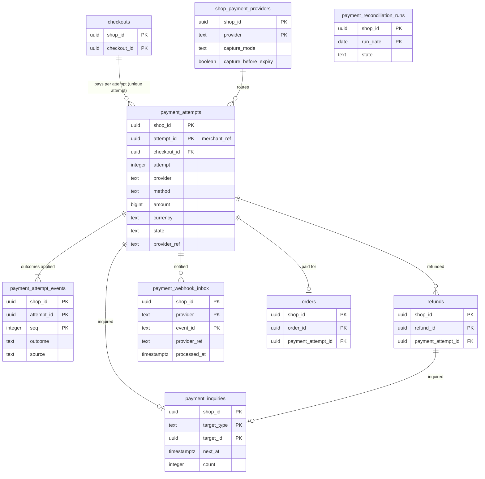

# Data model: 決済の連携

[data-model.md](../data-model.md) の一部。規約はそちらの 3 節に従う。振る舞いは [payments-integration.md](../payments-integration.md)（4〜10 節）を正とする。決定は [ADR-0006](../../decisions/0006-payments-via-providers.md)（提供者に任せる、カード番号に触れない）、[ADR-0035](../../decisions/0035-payment-attempt-states-and-result-normalization.md)（試行の状態と正規の結果）、[ADR-0036](../../decisions/0036-payment-webhook-inbox-and-inquiry-schedule.md)（inbox と照会の予定）、[ADR-0037](../../decisions/0037-async-payments-pending-orders.md)（非同期の決済）、[ADR-0038](../../decisions/0038-capture-timing-and-authorization-expiry.md)（確定の時点）。

| 表 | 置き場所 | 書く |
| --- | --- | --- |
| `payment_attempts`、`payment_attempt_events` | ポッド `public` | `checkout`（`packages/payments` の `applyOutcome()` だけが状態を書く）、`workers`（`capture-worker`、`payment-inquirer`、`async-payment-expirer`） |
| `payment_webhook_inbox` | ポッド `public` | `checkout`（受け口）、`workers`（処理のジョブ） |
| `payment_inquiries` | ポッド `public` | `workers`（`payment-inquirer`） |
| `shop_payment_providers` | ポッド `public` | `admin-api`（`payments_settings`、再確認） |
| `payment_reconciliation_runs` | ポッド `public` | `workers`（`payment-reconciliation-daily`） |

- **カード番号（PAN）・セキュリティコードを持つ列はない。** 持つのは提供者の参照の ID、正規の結果、理由のコード、提供者が返すブランドと下 4 桁だけ（[ADR-0006](../../decisions/0006-payments-via-providers.md)、[security.md](../security.md) の 7 節）。CI の走査で、どの表・ログにもカード番号の形（Luhn の通る 13〜19 桁）が現れないことを確かめる。
- 提供者の能力（`provider_capabilities`）はコードの定数で、表に持たない。
- 遮断器の状態は Valkey の `{<shop_id>}:pcb:<provider>:<method>`（失ってよい。[stores.md](stores.md) の 1.1 節）。

## 1. ER 図

- `payment_attempts` は `(shop_id, checkout_id, attempt)` で一意。1 つの試行から注文は 0 か 1（`orders.payment_attempt_id` は一意）。
- `payment_inquiries` の `target_id` は `target_type`（`attempt`・`refund`・`capture`）で先の表が分かれる多態の参照。外部キーを張らない。
- `payment_webhook_inbox` → `payment_attempts` は `provider_ref`・`merchant_ref` の論理の参照（受けた時点で試行が分からないことがある）。`checkouts` へも論理の参照（チェックアウトは保持で消える）。

## 2. 表

### 2.1 `payment_attempts`

決済の試行。状態：`created`・`session_open`・`authorized`・`captured`・`awaiting_payment`・`failed`・`canceled`・`expired`・`voided`・`auth_expired`（[payments-integration.md](../payments-integration.md) の 5.3 節）。

| 列 | 型 | NULL | 既定 | 説明 |
| --- | --- | --- | --- | --- |
| `shop_id`・`attempt_id` | `uuid` | NOT NULL | `attempt_id` は `uuidv7()` | 加盟店の参照の番号（`merchant_ref`）と同じ値 |
| `checkout_id` | `uuid` | NOT NULL | — | |
| `attempt` | `integer` | NOT NULL | — | チェックアウトの試行 |
| `provider` | `text` | NOT NULL | — | アダプターの名前 |
| `method` | `text` | NOT NULL | — | `card`・`konbini`・`bank_transfer`・`carrier`・`bnpl` |
| `amount` | `bigint` | NOT NULL | — | 価格の写しの合計 |
| `currency` | `text` | NOT NULL | — | |
| `snapshot_hash` | `bytea` | NOT NULL | — | 送信で固定した写し（金額の一致の確かめ） |
| `state` | `text` | NOT NULL | `'created'` | |
| `outcome` | `text` | NULL | — | 最後の正規の結果（`authorized`・`captured`・`awaiting_payment`・`processing`・`failed`・`canceled`・`expired`・`not_found`） |
| `reason_code` | `text` | NULL | — | 正規化した拒否・失敗の理由 |
| `provider_failure` | `boolean` | NOT NULL | `false` | 提供者の障害の理由か（遮断器に数える） |
| `provider_ref` | `text` | NULL | — | 提供者の参照の ID。`createSession` の時間切れでは NULL |
| `session_payload` | `jsonb` | NULL | — | リダイレクトの URL、入力部品の値、支払いの番号の表示の値（カード番号を含まない） |
| `authorized_amount`・`captured_amount` | `bigint` | NOT NULL | `0` | |
| `capture_planned_amount` | `bigint` | NULL | — | 確定の前の行の取り消しで減らした確定の予定の額 |
| `authorization_expires_at` | `timestamptz` | NULL | — | オーソリの時刻 ＋ `authorization_ttl` |
| `payment_due_at` | `timestamptz` | NULL | — | 非同期の手段の支払いの期限 |
| `card_brand`・`card_last4` | `text` | NULL | — | 提供者が返す値だけ（PAN でない） |
| `payment_fingerprint_hash` | `bytea` | NULL | — | 決済の手段の指紋の HMAC（1 人あたりの上限） |
| `created_at`・`updated_at` | `timestamptz` | NOT NULL | `now()` | |

- キー：PK `(shop_id, attempt_id)`。UK `(shop_id, checkout_id, attempt)`。
- 索引：`(shop_id, provider, provider_ref)` — Webhook と照会の引き（UK `WHERE provider_ref IS NOT NULL`）。`(shop_id, state, payment_due_at) WHERE state = 'awaiting_payment'` — `async-payment-expirer`。`(shop_id, authorization_expires_at) WHERE state = 'authorized'` — 期限の知らせと確定。
- CHECK：
  - `amount > 0`、`captured_amount <= authorized_amount OR method IN ('konbini','bank_transfer')`、`captured_amount >= 0`
  - `state IN (…)`、`card_last4 IS NULL OR card_last4 ~ '^[0-9]{4}$'`
  - `state NOT IN ('session_open','authorized','captured','awaiting_payment') OR provider_ref IS NOT NULL`
- トリガー：後戻り（`captured → authorized` など）の更新を拒む（`applyOutcome()` は捨てて警告の指標を数える）。
- 冪等キー（列に持たない。決まった形から作る）：`<checkout_id>:<attempt>:session`・`:capture`・`:void`。
- 保持：注文のある試行は注文と同じ。注文のない試行は 1 年（突き合わせと調査。L7 の確認待ち）。S1 の量：約 120 万行/月。

### 2.2 `payment_attempt_events`

結果の適用の記録（追記だけ）。

| 列 | 型 | NULL | 既定 | 説明 |
| --- | --- | --- | --- | --- |
| `shop_id`・`attempt_id` | `uuid` | NOT NULL | — | |
| `seq` | `integer` | NOT NULL | — | |
| `outcome` | `text` | NOT NULL | — | 正規の結果 |
| `provider_status` | `text` | NULL | — | 提供者の状態の名前（DT-PAY-001 の写しの元） |
| `dt_row` | `smallint` | NULL | — | 使った DT-PAY-001 の行 |
| `source` | `text` | NOT NULL | — | `session`・`redirect`・`webhook`・`inquiry`・`reconciler`・`capture`・`void` |
| `applied` | `boolean` | NOT NULL | — | 状態を変えたか（再適用・後戻りは偽） |
| `from_state`・`to_state` | `text` | NULL | — | |
| `at` | `timestamptz` | NOT NULL | `now()` | |

- キー：PK `(shop_id, attempt_id, seq)`。FK → `payment_attempts`（`ON DELETE CASCADE`）。保持：試行と同じ。S1 の量：試行の 3 倍。

### 2.3 `payment_webhook_inbox`

提供者の Webhook の重複の除き（[ADR-0036](../../decisions/0036-payment-webhook-inbox-and-inquiry-schedule.md)）。署名を確かめてから入れ、200 を返す。

| 列 | 型 | NULL | 既定 | 説明 |
| --- | --- | --- | --- | --- |
| `shop_id` | `uuid` | NOT NULL | — | URL のショップの ID（そのショップの秘密で署名を確かめた） |
| `provider` | `text` | NOT NULL | — | |
| `event_id` | `text` | NOT NULL | — | 提供者のイベントの ID |
| `event_type` | `text` | NOT NULL | — | |
| `provider_ref` | `text` | NULL | — | |
| `merchant_ref` | `uuid` | NULL | — | |
| `body` | `jsonb` | NOT NULL | — | 64 KB まで。保存の前に個人のデータ（メールなど）の項目を除く |
| `received_at` | `timestamptz` | NOT NULL | `now()` | |
| `processed_at` | `timestamptz` | NULL | — | |
| `process_attempts` | `integer` | NOT NULL | `0` | |
| `last_error_code` | `text` | NULL | — | |

- キー：PK `(shop_id, provider, event_id)`（重複は `ON CONFLICT DO NOTHING` で 200）。
- 索引：`(received_at) WHERE processed_at IS NULL` — 領域の文書の部分索引。処理のジョブと照合（2 分超）の発見（X1 の発見の索引。D-6）。`(shop_id, received_at) WHERE processed_at IS NULL` — ショップの中で 100 行ずつ `FOR UPDATE SKIP LOCKED`。
- CHECK：`pg_column_size(body) <= 65536`。
- 分割しない（主キーに分割の鍵を入れると、日をまたぐ重複を除けないため）。保持：30 日（日次のジョブが消す）。S1 の量：約 250 万行/月。

### 2.4 `payment_inquiries`

照会の予定（`processing`、窓の内の `not_found`、照会の失敗、返金・確定の結果不明）。5 秒、30 秒、2 分、5 分、10 分、以後 30 分ごと。24 時間で呼び出し。

| 列 | 型 | NULL | 既定 | 説明 |
| --- | --- | --- | --- | --- |
| `shop_id` | `uuid` | NOT NULL | — | |
| `target_type` | `text` | NOT NULL | — | `attempt`・`refund`・`capture`・`void` |
| `target_id` | `uuid` | NOT NULL | — | 試行か返金の ID |
| `next_at` | `timestamptz` | NOT NULL | — | |
| `count` | `integer` | NOT NULL | `0` | |
| `started_at` | `timestamptz` | NOT NULL | `now()` | 24 時間の起点 |
| `last_outcome` | `text` | NULL | — | |
| `paged_at` | `timestamptz` | NULL | — | 24 時間の呼び出し |

- キー：PK `(shop_id, target_type, target_id)`（領域の文書の `(shop_id, target_id)` に種類を足した。返金と確定の照会が同じ試行の ID を持ちうるため。D-18）。
- 索引：`(next_at)` — `payment-inquirer` が 1 秒ごとに読む（X1 の発見の索引。関数がショップの ID だけを返す。D-6）。
- 結果が確定したら行を消す。S1 の量：同時に数千行。

### 2.5 `shop_payment_providers`

ショップの提供者の設定。認証の情報はポッドの DB の封筒の暗号（`kms-pod-<id>-secrets`。[ADR-0066](../../decisions/0066-encryption-and-key-layout.md)）。

| 列 | 型 | NULL | 既定 | 説明 |
| --- | --- | --- | --- | --- |
| `shop_id` | `uuid` | NOT NULL | — | |
| `provider` | `text` | NOT NULL | — | |
| `enabled` | `boolean` | NOT NULL | `true` | |
| `test_mode` | `boolean` | NOT NULL | `false` | `trial` のショップは真だけ |
| `methods` | `text[]` | NOT NULL | — | 有効にした手段 |
| `credentials_ciphertext` | `text` | NOT NULL | — | API キー、加盟店の ID（`v1\|<key_id>\|<nonce>\|<ciphertext>`） |
| `webhook_secret_ciphertext` | `text` | NOT NULL | — | 提供者の Webhook の署名の秘密 |
| `capture_mode` | `text` | NOT NULL | `'automatic'` | `automatic`・`on_first_fulfillment`・`manual` |
| `capture_before_expiry` | `boolean` | NOT NULL | `true` | 期限の 24 時間前に残りを確定 |
| `fees` | `jsonb` | NOT NULL | `'{}'` | 手段ごとの手数料（コンビニ払い 330 円など。税の区分は L4） |
| `position` | `smallint` | NOT NULL | — | 手段の一覧の並び |
| `created_at`・`updated_at` | `timestamptz` | NOT NULL | `now()` | |

- キー：PK `(shop_id, provider)`。CHECK：`capture_mode IN (…)`、`methods <@ ARRAY['card','konbini','bank_transfer','carrier','bnpl']`。
- 変更は再確認（直近 5 分の 2 段階の認証）と監査の行を要る。S1 の量：約 15 万行。

### 2.6 `payment_reconciliation_runs`

日次の突き合わせ（P1〜P4）の結果。事業者の画面には出さない。

| 列 | 型 | NULL | 既定 | 説明 |
| --- | --- | --- | --- | --- |
| `shop_id` | `uuid` | NOT NULL | — | |
| `run_date` | `date` | NOT NULL | — | 日本時間の日 |
| `state` | `text` | NOT NULL | `'running'` | `running`・`ok`・`mismatch`・`failed` |
| `results` | `jsonb` | NOT NULL | `'{}'` | 提供者ごとの P1〜P4 の数と、不一致の試行・返金の ID |
| `started_at`・`finished_at` | `timestamptz` | NULL | — | |

- キー：PK `(shop_id, run_date)`。保持：13 か月。S1 の量：取引のあったショップだけ 約 3 万行/日、400 日で約 1,200 万行。不一致のない日の行は 30 日で消し、残すのは不一致の日だけにする（約 100 万行）。
