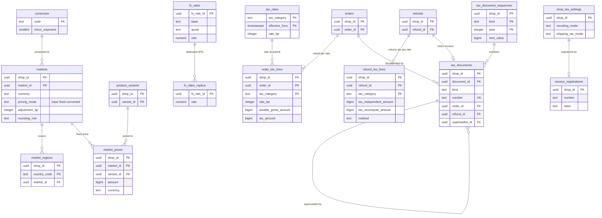

# Data model: マーケット・通貨・税・文書

[data-model.md](../data-model.md) の一部。規約はそちらの 3 節（特に 3.6 節の金額、3.7 節の税）に従う。振る舞いは [catalog-and-pricing.md](../catalog-and-pricing.md)（9 節）と [taxes-and-invoices.md](../taxes-and-invoices.md)（4〜7 節）を正とする。決定は [ADR-0015](../../decisions/0015-markets-currencies-and-rounding.md)（マーケットと丸め）、[ADR-0017](../../decisions/0017-consumption-tax-calculation-and-rounding.md)（税率ごとに 1 回の丸め）、[ADR-0018](../../decisions/0018-invoice-documents-and-receipts.md)（文書と番号）、[ADR-0019](../../decisions/0019-invoice-registration-number-verification.md)（登録番号）。

| 表 | 置き場所 | 書く |
| --- | --- | --- |
| `markets`、`market_regions`、`market_prices` | ポッド `public` | `admin-api` |
| `fx_rates`、`currencies`、`locales`、`tax_rates` | 全体 `ref` | 為替の取り込みの作業、本システムの運用 |
| `fx_rates_replica`、`currencies_replica`、`locales_replica`、`tax_rates` | ポッド `sys`（P5） | `workers` |
| `shop_tax_settings`、`invoice_registrations` | ポッド `public` | `admin-api`、`workers`（登録番号の照会） |
| `order_tax_lines` | ポッド `public` | `checkout`（`completeCheckout`）、`admin-api`（注文の編集） |
| `refund_tax_lines` | ポッド `public` | `admin-api`（返金の作成） |
| `tax_documents`、`tax_document_sequences` | ポッド `public` | `workers`（文書の作成のジョブ） |

- 外貨のマーケットの有効化は `release.markets-foreign-currency` の裏（[README.md](../README.md) の 6 節の仮の決定）。表と計算は MVP で作る。
- 法令の扱い（送料の区分、返金の方式、文書の記載、保存の期間）は法務の確認待ち（L4）。表は値を変えれば結論に合わせられる形にする。

## 1. ER 図

- `orders`・`refunds`・`product_variants` は他のファイルの表（列は主キーだけ描いた）。
- `tax_rates` → `order_tax_lines` は論理の参照（送信の時刻の税率を値として写す。外部キーを張らない）。`currencies` → `markets`、`fx_rates` → `fx_rates_replica` は別の DB の参照。
- `tax_documents` の `refund_id`・`supersedes_id` は任意の参照。

## 2. 表

### 2.1 `markets`

| 列 | 型 | NULL | 既定 | 説明 |
| --- | --- | --- | --- | --- |
| `shop_id`・`market_id` | `uuid` | NOT NULL | `market_id` は `uuidv7()` | |
| `handle` | `text` | NOT NULL | — | 鍵の材料の `<market>`（`jp`、`us` など。`^[a-z]{2}(-[a-z]{2})?$`） |
| `name` | `text` | NOT NULL | — | |
| `is_primary` | `boolean` | NOT NULL | `false` | 主のマーケット（日本、JPY）。1 つ |
| `enabled` | `boolean` | NOT NULL | `true` | 外貨は `release.markets-foreign-currency` の裏 |
| `currency` | `text` | NOT NULL | — | 表示と支払いの通貨 |
| `locales` | `text[]` | NOT NULL | — | 言語の一覧（先頭が既定） |
| `pricing_mode` | `text` | NOT NULL | `'base'` | `base`・`fixed`・`converted` |
| `adjustment_bp` | `integer` | NOT NULL | `0` | 調整の率（基本点。500 = 5%） |
| `rounding_rule` | `text` | NOT NULL | `'none'` | `none`・`whole`・`ends_99`・`ends_00_jpy10` |
| `path_prefix` | `text` | NULL | — | `/en-us/` |
| `created_at`・`updated_at` | `timestamptz` | NOT NULL | `now()` | |

- キー：PK `(shop_id, market_id)`。UK `(shop_id, handle)`。UK `(shop_id) WHERE is_primary`。
- CHECK：`pricing_mode IN (…)`、`rounding_rule IN (…)`、`adjustment_bp BETWEEN -5000 AND 10000`、`NOT is_primary OR pricing_mode = 'base'`。
- 変更は outbox の `markets/prices_changed`（キャッシュの世代を上げる）。S1 の量：約 10 万行（主のマーケットだけがほとんど）。

### 2.2 `market_regions`

| 列 | 型 | NULL | 既定 | 説明 |
| --- | --- | --- | --- | --- |
| `shop_id` | `uuid` | NOT NULL | — | |
| `country_code` | `text` | NOT NULL | — | ISO 3166-1 alpha-2 |
| `market_id` | `uuid` | NOT NULL | — | |

- キー：PK `(shop_id, country_code)`（1 つの国は 1 つのマーケット）。FK → `markets`（`ON DELETE CASCADE`）。S1 の量：約 15 万行。

### 2.3 `market_prices`

`fixed` のマーケットの固定の価格。ないバリエーションは `converted` に落ちる。

| 列 | 型 | NULL | 既定 | 説明 |
| --- | --- | --- | --- | --- |
| `shop_id`・`market_id`・`variant_id` | `uuid` | NOT NULL | — | |
| `amount` | `bigint` | NOT NULL | — | マーケットの通貨の最小単位 |
| `currency` | `text` | NOT NULL | — | マーケットの通貨と同じ（トリガーで確かめる） |
| `compare_at_amount` | `bigint` | NULL | — | |
| `updated_at` | `timestamptz` | NOT NULL | `now()` | |

- キー：PK `(shop_id, market_id, variant_id)`。FK → `markets`・`product_variants`（`ON DELETE CASCADE`）。CHECK：`amount >= 0`。S1 の量：数十万行。

### 2.4 `fx_rates`（全体 `ref`）・`fx_rates_replica`（ポッド `sys`）

日次（09:00 JST）の為替。消さない（[ADR-0015](../../decisions/0015-markets-currencies-and-rounding.md)）。ポッドはページの描画とチェックアウトの換算で写しを読む（P5 の「通貨の表」に含めた。D-8）。

| 列 | 型 | NULL | 既定 | 説明 |
| --- | --- | --- | --- | --- |
| `fx_rate_id` | `uuid` | NOT NULL | `uuidv7()` | ページ・カート・写しに持つ ID |
| `fetched_at` | `timestamptz` | NOT NULL | — | |
| `base`・`quote` | `text` | NOT NULL | — | `JPY` → `USD` |
| `rate` | `numeric(20,10)` | NOT NULL | — | 1 `base` あたりの `quote`。10 進。浮動小数点にしない |
| `provider` | `text` | NOT NULL | — | 選定の後に決める（E3） |

- キー：PK `fx_rate_id`。UK `(base, quote, fetched_at)`。索引：`(base, quote, fetched_at DESC)` — 最新の率。CHECK：`rate > 0`。
- 写しは同じ列と `replicated_at`。写しの保持は直近 400 日（24 時間を過ぎたカートの計算し直しと、注文の監査に足りる）。S1 の量：年 数千行。

### 2.5 `currencies`・`locales`（全体 `ref`）と写し（ポッド `sys`）

P5 の「言語と通貨の表」（[ADR-0010](../../decisions/0010-shop-routing-hot-set-and-custom-domains.md)）。

| `currencies` の列 | 型 | NULL | 既定 | 説明 |
| --- | --- | --- | --- | --- |
| `code` | `text` | NOT NULL | — | ISO 4217 |
| `minor_exponent` | `smallint` | NOT NULL | — | JPY 0、USD 2 |
| `symbol` | `text` | NOT NULL | — | |
| `enabled` | `boolean` | NOT NULL | `false` | 本システムで使える |

| `locales` の列 | 型 | NULL | 既定 | 説明 |
| --- | --- | --- | --- | --- |
| `code` | `text` | NOT NULL | — | `ja`、`en` |
| `name` | `text` | NOT NULL | — | |
| `enabled` | `boolean` | NOT NULL | `false` | |

- キー：PK `code`。CHECK：`minor_exponent BETWEEN 0 AND 4`。写しは同じ列と `replicated_at`（`currencies_replica`、`locales_replica`）。S1 の量：数百行。

### 2.6 `tax_rates`（全体 `ref`、ポッド `sys` の同じ名前の写し）

税の区分と税率。注文の作成の時刻でなく、送信の時刻（価格の写しを固定する時点）の税率を使う。写しの名前は ADR-0003 の注記に合わせて `tax_rates` のまま（`_replica` を付けない）。

| 列 | 型 | NULL | 既定 | 説明 |
| --- | --- | --- | --- | --- |
| `tax_category` | `text` | NOT NULL | — | `standard_10`・`reduced_8`・`exempt`・`out_of_scope`・`export_zero` |
| `effective_from` | `timestamptz` | NOT NULL | — | |
| `rate_bp` | `integer` | NOT NULL | — | 基本点。1000 = 10%、800 = 8%、0 |
| `tax_rules_version` | `integer` | NOT NULL | — | この行を足した規則のバージョン |

- キー：PK `(tax_category, effective_from)`。CHECK：`rate_bp BETWEEN 0 AND 10000`、`tax_category IN (…)`。
- 読み出しの失敗はチェックアウトの計算の失敗にする（推測の税率で続けない）。S1 の量：数十行。

### 2.7 `shop_tax_settings`

| 列 | 型 | NULL | 既定 | 説明 |
| --- | --- | --- | --- | --- |
| `shop_id` | `uuid` | NOT NULL | — | |
| `rounding_mode` | `text` | NOT NULL | `'floor'` | `floor`・`half_up`・`ceil`（選べることの扱いは L4） |
| `shipping_tax_category` | `text` | NOT NULL | `'standard_10'` | |
| `shipping_tax_mode` | `text` | NOT NULL | `'fixed'` | `fixed`・`proportional`（L4） |
| `fee_tax_category` | `text` | NOT NULL | `'standard_10'` | 手数料（コンビニ払いなど） |
| `document_display_name` | `text` | NOT NULL | — | 文書に出す名前 |
| `is_registered` | `boolean` | NOT NULL | `false` | 適格請求書発行事業者か（`invoice_registrations` が `verified` のときだけ真にできる） |
| `updated_at` | `timestamptz` | NOT NULL | `now()` | 方法の変更は、変更の後に送信したチェックアウトから効く |

- キー：PK `shop_id`。CHECK：値の一覧。トリガー：`is_registered = true` へは `invoice_registrations.state = 'verified'` が要る。S1 の量：10 万行。

### 2.8 `order_tax_lines`

注文の税率ごとの対価と税額（税の写し）。文書はここから値を取り、計算し直さない。

| 列 | 型 | NULL | 既定 | 説明 |
| --- | --- | --- | --- | --- |
| `shop_id`・`order_id` | `uuid` | NOT NULL | — | |
| `tax_category` | `text` | NOT NULL | — | |
| `rate_bp` | `integer` | NOT NULL | — | 送信の時刻の税率 |
| `taxable_gross_amount` | `bigint` | NOT NULL | — | 税込みの対価の合計（単位の `paid_amount` と送料・手数料の和） |
| `tax_amount` | `bigint` | NOT NULL | — | `round_mode(taxable × rate_bp / (10000 + rate_bp))`。唯一の丸め |

- キー：PK `(shop_id, order_id, tax_category)`。UK `(shop_id, order_id, rate_bp) WHERE rate_bp > 0`（正の税率は 1 注文に 1 行。税率ごとに 1 回の丸めを DB で守る）。FK → `orders`（`ON DELETE CASCADE`）。
- CHECK：`taxable_gross_amount >= 0`、`tax_amount >= 0`、`rate_bp > 0 OR tax_amount = 0`、`tax_amount <= taxable_gross_amount`。
- `tax_rules_version` と `rounding_mode` は注文の行（`orders`）に 1 つだけ持つ（D-17）。
- 注文の編集で書き直す（発行済みの文書は直さず、訂正の文書を出す）。保持：注文と同じ（`retained_until`、L4）。S1 の量：約 1,500 万行/年。

### 2.9 `refund_tax_lines`

返金の税率ごとの値。2 つの方式を両方計算し、選んだ方を記録する（[ADR-0043](../../decisions/0043-refund-calculation-from-unit-allocations.md)）。

| 列 | 型 | NULL | 既定 | 説明 |
| --- | --- | --- | --- | --- |
| `shop_id`・`refund_id` | `uuid` | NOT NULL | — | |
| `tax_category` | `text` | NOT NULL | — | |
| `rate_bp` | `integer` | NOT NULL | — | 元の注文の税率 |
| `taxable_gross_amount` | `bigint` | NOT NULL | — | 返す対価の合計 |
| `tax_independent_amount` | `bigint` | NOT NULL | — | `independent` の税額 |
| `tax_recompute_amount` | `bigint` | NOT NULL | — | `recompute` の税額 |
| `method` | `text` | NOT NULL | — | `independent`・`recompute`（試験の既定は `recompute`。本番は L4 の後） |
| `tax_amount` | `bigint` | NOT NULL | — | 選んだ方式の値 |

- キー：PK `(shop_id, refund_id, tax_category)`。UK `(shop_id, refund_id, rate_bp) WHERE rate_bp > 0`。FK → `refunds`（`ON DELETE CASCADE`）。
- CHECK：`method IN (…)`、`tax_amount = CASE method WHEN 'independent' THEN tax_independent_amount ELSE tax_recompute_amount END`、各額 `>= 0`。
- 保持：注文と同じ。S1 の量：約 100 万行/年。

### 2.10 `tax_documents`

レシート（適格簡易請求書）、適格請求書、返還インボイス、訂正の文書。挿入の後は不変（[ADR-0018](../../decisions/0018-invoice-documents-and-receipts.md)）。

| 列 | 型 | NULL | 既定 | 説明 |
| --- | --- | --- | --- | --- |
| `shop_id`・`document_id` | `uuid` | NOT NULL | `document_id` は `uuidv7()` | |
| `kind` | `text` | NOT NULL | — | `receipt`・`invoice`・`return_invoice`・`correction` |
| `number` | `text` | NOT NULL | — | `<接頭辞>-<YYYY>-<8 桁>`。接頭辞は `R`・`INV`・`RET`・`COR`（D-32） |
| `order_id` | `uuid` | NOT NULL | — | 元の注文 |
| `refund_id` | `uuid` | NULL | — | 返還インボイス |
| `supersedes_id` | `uuid` | NULL | — | 訂正の文書が置き換える文書 |
| `issued_at` | `timestamptz` | NOT NULL | `now()` | |
| `body` | `jsonb` | NOT NULL | — | 記載の値（正規の JSON）。宛名を含めない |
| `addressee_ciphertext` | `text` | NULL | — | 適格請求書の宛名（D1。列の暗号。D-36） |
| `body_hash` | `bytea` | NOT NULL | — | `SHA-256(正規の body)` |
| `renderer_version` | `text` | NOT NULL | — | PDF を描く道具のバージョン（PDF は保存しない） |
| `registration_number` | `text` | NULL | — | 発行の時点の登録番号（`verified` のときだけ） |
| `retained_until` | `date` | NULL | — | 法令の保存の期間の終わり（L4 の確認待ち） |

- キー：PK `(shop_id, document_id)`。UK `(shop_id, number)`。UK `(shop_id, order_id, kind) WHERE kind IN ('receipt','invoice')`（同じ注文に同じ種類を 2 回作らない）。UK `(shop_id, refund_id) WHERE kind = 'return_invoice'`。FK → `orders`、`refunds`（任意）、`tax_documents`（`supersedes_id`、任意）。
- CHECK：`kind = 'return_invoice'` なら `refund_id IS NOT NULL`、`kind = 'correction'` なら `supersedes_id IS NOT NULL`、`number ~ '^(R|INV|RET|COR)-[0-9]{4}-[0-9]{8}$'`、`octet_length(body_hash) = 32`。
- トリガー：`UPDATE` を拒む（例外は `retained_until` を延ばすだけの更新）。`DELETE` はショップの削除の作業（保持の対象は先に保持のバケットへ写す）と、保持の期限の作業だけ。適格請求書の発行は 1 注文 5 回まで（訂正を含む）。
- `superseded` の状態は列に持たず、`supersedes_id` から求める。
- 保持：`retained_until` まで（ショップの削除の後も保持のバケットに写して残す。L4）。S1 の量：約 1,300 万行/年。

### 2.11 `tax_document_sequences`

ショップ × 種類 × 年の連番。文書の挿入と同じトランザクションで 1 増やす（抜けを作らない）。

| 列 | 型 | NULL | 既定 | 説明 |
| --- | --- | --- | --- | --- |
| `shop_id` | `uuid` | NOT NULL | — | |
| `kind` | `text` | NOT NULL | — | |
| `year` | `integer` | NOT NULL | — | 日本時間の暦の年 |
| `next_value` | `bigint` | NOT NULL | `1` | |

- キー：PK `(shop_id, kind, year)`。CHECK：`next_value BETWEEN 1 AND 99999999`。トリガー：下げる更新を拒む。
- 注文の番号（`order_number_counters`）と違い、塊で取らない（欠番を許さない）。S1 の量：約 40 万行。

### 2.12 `invoice_registrations`

登録番号と照会の結果（[ADR-0019](../../decisions/0019-invoice-registration-number-verification.md)）。

| 列 | 型 | NULL | 既定 | 説明 |
| --- | --- | --- | --- | --- |
| `shop_id` | `uuid` | NOT NULL | — | |
| `number` | `text` | NOT NULL | — | `T` ＋ 13 桁 |
| `state` | `text` | NOT NULL | `'unverified'` | `unverified`・`verified`・`rejected`・`revoked` |
| `registered_name` | `text` | NULL | — | 公表サイトの名前 |
| `registered_on` | `date` | NULL | — | 登録の年月日 |
| `name_matches` | `boolean` | NULL | — | NFKC と空白の除去の比べ |
| `use_registered_name` | `boolean` | NOT NULL | `false` | 事業者が公表の名前を使うと選んだ |
| `checked_at`・`next_check_at` | `timestamptz` | NULL | — | 月次、障害のときは 24 時間ごと |
| `source_response_hash` | `bytea` | NULL | — | 照会の応答の SHA-256 |
| `reason_code` | `text` | NULL | — | `format_invalid`・`not_found`・`name_mismatch`・`revoked` |
| `updated_at` | `timestamptz` | NOT NULL | `now()` | |

- キー：PK `shop_id`。CHECK：`number ~ '^T[0-9]{13}$'`、`state IN (…)`。
- 索引：`(next_check_at)` — 照会の作業の発見（X1 の発見の索引。D-6）。S1 の量：約 5 万行。
