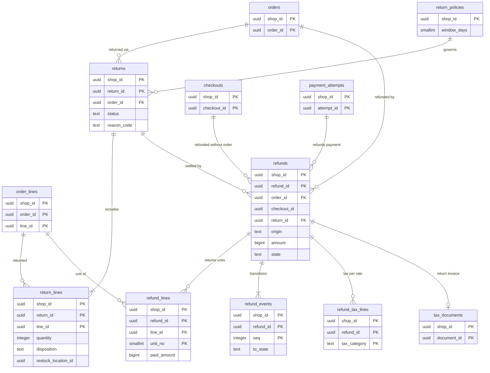

# Data model: 返品と返金

[data-model.md](../data-model.md) の一部。規約はそちらの 3 節に従う。振る舞いは [returns-and-refunds.md](../returns-and-refunds.md)（3〜8 節）を正とする。決定は [ADR-0043](../../decisions/0043-refund-calculation-from-unit-allocations.md)（単位の按分からの返金の額、税の 2 つの方式）、[ADR-0044](../../decisions/0044-returns-state-and-restock.md)（返品の状態と在庫への戻し、返金の状態）。返金の税率ごとの値（`refund_tax_lines`）は [pricing-taxes-and-invoices.md](pricing-taxes-and-invoices.md) の 2.9 節。

| 表 | 置き場所 | 書く |
| --- | --- | --- |
| `returns`、`return_lines` | ポッド `public` | `admin-api`、`storefront-renderer`（買い手の依頼。署名つきの URL） |
| `return_policies` | ポッド `public` | `admin-api` |
| `refunds`、`refund_lines`、`refund_events` | ポッド `public` | `admin-api`（`orders_refund`）、`checkout`（`refund_required`）、`workers`（`refund-worker`、`async-payment-expirer`） |

- 返金の和は確定の額を超えない（`orders` の行を `FOR UPDATE` で取ってから確かめる。[ADR-0043](../../decisions/0043-refund-calculation-from-unit-allocations.md)）。
- 冪等キーは `<refund_id>:refund`。`unknown` の間は同じキーで照会だけを行い、別のキーで送り直さない。

## 1. ER 図

- `refunds` は `order_id` か `checkout_id`（`refund_required` の注文のないチェックアウト）のどちらかを持つ。どちらも任意の参照で、`checkout_id` は論理の参照（チェックアウトは保持で消える）。`return_id` も任意。
- `return_policies` → `returns` は「ショップの規則」の論理の関係（`returns` は作成の時の受付の期限を写す）。

## 2. 表

### 2.1 `returns`

状態：`requested`・`approved`・`declined`・`in_transit`・`received`・`inspected`・`closed`・`cancelled`。

| 列 | 型 | NULL | 既定 | 説明 |
| --- | --- | --- | --- | --- |
| `shop_id`・`return_id` | `uuid` | NOT NULL | `return_id` は `uuidv7()` | |
| `order_id` | `uuid` | NOT NULL | — | |
| `status` | `text` | NOT NULL | — | 買い手の依頼は `requested`、事業者の作成は `approved` |
| `reason_code` | `text` | NOT NULL | — | ショップの理由の一覧の値 |
| `decline_reason` | `text` | NULL | — | |
| `return_carrier`・`return_tracking_number` | `text` | NULL | — | 返送の追跡 |
| `requested_by_type` | `text` | NOT NULL | — | `buyer`・`staff`・`app` |
| `requested_by_id` | `text` | NULL | — | |
| `window_ends_at` | `timestamptz` | NOT NULL | — | 受付の期限（作成の時の規則で計算） |
| `created_at`・`updated_at` | `timestamptz` | NOT NULL | `now()` | |
| `closed_at` | `timestamptz` | NULL | — | |

- キー：PK `(shop_id, return_id)`。FK → `orders`。索引：`(shop_id, order_id)`、`(shop_id, status, created_at)`。
- CHECK：`status IN (…)`、`status <> 'declined' OR decline_reason IS NOT NULL`。1 注文 20 まで（トリガー）。S1 の量：約 3 万行/月。

### 2.2 `return_lines`

| 列 | 型 | NULL | 既定 | 説明 |
| --- | --- | --- | --- | --- |
| `shop_id`・`return_id`・`line_id` | `uuid` | NOT NULL | — | `line_id` は注文の行 |
| `order_id` | `uuid` | NOT NULL | — | |
| `quantity` | `integer` | NOT NULL | — | |
| `unit_nos` | `smallint[]` | NULL | — | 返す単位の番号（番号の大きい方から。返金の作成で決める） |
| `disposition` | `text` | NULL | — | 検品の結果：`restock`・`damaged`・`no_restock` |
| `restock_location_id` | `uuid` | NULL | — | 既定は元の配送の拠点 |
| `reason_code` | `text` | NULL | — | |

- キー：PK `(shop_id, return_id, line_id)`。FK → `returns`（`ON DELETE CASCADE`）、`(shop_id, order_id, line_id)` → `order_lines`。
- CHECK：`quantity >= 1`、`unit_nos IS NULL OR cardinality(unit_nos) = quantity`、`disposition IS NULL OR disposition IN (…)`。
- トリガー：`Σ返品の数（取り消し・拒否を除く）≤ fulfilled_qty − returned_qty`（注文の行を `FOR UPDATE` で取って確かめる）。検品で `disposition` を決めると、同じトランザクションで在庫の拠点の行・枠 0・移動の行（`return_restock`・`return_damaged`）と、注文の行の `returned_qty` を書く。

### 2.3 `return_policies`

| 列 | 型 | NULL | 既定 | 説明 |
| --- | --- | --- | --- | --- |
| `shop_id` | `uuid` | NOT NULL | — | |
| `window_days` | `smallint` | NOT NULL | `30` | 配達から（1〜365） |
| `fallback_window_days` | `smallint` | NOT NULL | `35` | 配達日がないときの発送から |
| `excluded_product_ids` | `uuid[]` | NOT NULL | `'{}'` | 対象外の品目の印 |
| `reasons` | `text[]` | NOT NULL | — | 理由の一覧 |
| `buyer_requests_enabled` | `boolean` | NOT NULL | `true` | 買い手の依頼を受けるか |
| `updated_at` | `timestamptz` | NOT NULL | `now()` | |

- キー：PK `shop_id`。CHECK：`window_days BETWEEN 1 AND 365`。返品の特約の表示は L1。S1 の量：10 万行。

### 2.4 `refunds`

返金・取り消し。状態：`requested`・`sent`・`succeeded`・`failed`・`unknown`（[ADR-0044](../../decisions/0044-returns-state-and-restock.md)）。

| 列 | 型 | NULL | 既定 | 説明 |
| --- | --- | --- | --- | --- |
| `shop_id`・`refund_id` | `uuid` | NOT NULL | `refund_id` は `uuidv7()` | 冪等キー `<refund_id>:refund` の元 |
| `origin` | `text` | NOT NULL | — | `return`・`cancellation`・`checkout`（注文のない決済）・`late_payment`（取り消しの後の入金） |
| `order_id` | `uuid` | NULL | — | |
| `checkout_id` | `uuid` | NULL | — | `origin = 'checkout'` |
| `return_id` | `uuid` | NULL | — | |
| `payment_attempt_id` | `uuid` | NOT NULL | — | 返す決済 |
| `operation` | `text` | NOT NULL | — | DT-RET-001 の動作：`void`・`reduce_capture`・`refund`・`manual` |
| `amount` | `bigint` | NOT NULL | — | 返金の額 `R` |
| `currency` | `text` | NOT NULL | — | |
| `units_amount` | `bigint` | NOT NULL | `0` | 返す単位の `paid_amount` の和 |
| `shipping_refund_amount` | `bigint` | NOT NULL | `0` | 0〜元の送料（割引の後）− 既存の送料の返金 |
| `return_fee_amount` | `bigint` | NOT NULL | `0` | 返品の手数料（税の区分は L4） |
| `manual_amount_reason` | `text` | NULL | — | 事業者が額を手で入れたときの理由 |
| `state` | `text` | NOT NULL | `'requested'` | |
| `provider` | `text` | NULL | — | |
| `provider_ref` | `text` | NULL | — | |
| `failure_reason` | `text` | NULL | — | |
| `manual_settlement` | `jsonb` | NULL | — | `failed` の後に事業者が手で返した記録（方法、日付、額。口座の番号を持たない） |
| `requires_bank_account` | `boolean` | NOT NULL | `false` | `refund_requires_bank_account` の手段 |
| `created_by_type` | `text` | NOT NULL | — | `staff`・`app`・`system` |
| `created_by_id` | `text` | NULL | — | |
| `created_at`・`updated_at` | `timestamptz` | NOT NULL | `now()` | |
| `succeeded_at` | `timestamptz` | NULL | — | 返還インボイスの「返品・値引きの年月日」 |

- キー：PK `(shop_id, refund_id)`。FK → `orders`（任意）、`returns`（任意）、`payment_attempts`。
- 索引：`(shop_id, order_id)`、`(shop_id, checkout_id) WHERE checkout_id IS NOT NULL`（領域の文書の索引）。`(updated_at) WHERE state IN ('requested','unknown')` — `refund-worker` と照会の発見（X1 の発見の索引）。
- CHECK：
  - `(order_id IS NOT NULL) <> (checkout_id IS NOT NULL)`（どちらか 1 つ）
  - `origin <> 'checkout' OR checkout_id IS NOT NULL`
  - `amount >= 0`、`amount = units_amount + shipping_refund_amount - return_fee_amount OR manual_amount_reason IS NOT NULL`
  - `state IN (…)`、`operation IN (…)`、`state <> 'succeeded' OR succeeded_at IS NOT NULL`
- 上限：`Σ(succeeded・requested・sent・unknown の amount) ≤ 確定の額 − 取り消しで解放した分`。注文の行を `FOR UPDATE` で取ってから、作成の関数が確かめる（行をまたぐので CHECK にできない）。1 注文 50 まで。
- 作成のトランザクションで outbox に `refund.requested` を書く。成功で注文の `refunded_amount` と `financial_status` を同じトランザクションで直す。
- 保持：注文と同じ。S1 の量：約 5 万行/月。

### 2.5 `refund_lines`

返す単位。単位ごとの `paid_amount` は注文の行の配列から写す。

| 列 | 型 | NULL | 既定 | 説明 |
| --- | --- | --- | --- | --- |
| `shop_id`・`refund_id`・`line_id` | `uuid` | NOT NULL | — | |
| `unit_no` | `smallint` | NOT NULL | — | 行の中の 1 からの番号 |
| `order_id` | `uuid` | NOT NULL | — | |
| `paid_amount` | `bigint` | NOT NULL | — | |
| `tax_category` | `text` | NOT NULL | — | |
| `rate_bp` | `integer` | NOT NULL | — | |

- キー：PK `(shop_id, refund_id, line_id, unit_no)`。FK → `refunds`（`ON DELETE CASCADE`）、`(shop_id, order_id, line_id)` → `order_lines`。
- 一意：同じ単位を 2 回返さない。UK `(shop_id, order_id, line_id, unit_no)` は `failed` の返金の単位を再び返せないので置かず、作成の関数が `failed` 以外の返金の単位と重ならないことを確かめる（照合の M でも数える）。
- CHECK：`unit_no >= 1`、`paid_amount >= 0`。S1 の量：約 10 万行/月。

### 2.6 `refund_events`

返金の状態の遷移（追記だけ）。

| 列 | 型 | NULL | 既定 | 説明 |
| --- | --- | --- | --- | --- |
| `shop_id`・`refund_id` | `uuid` | NOT NULL | — | |
| `seq` | `integer` | NOT NULL | — | |
| `from_state`・`to_state` | `text` | NOT NULL | — | |
| `source` | `text` | NOT NULL | — | `worker`・`webhook`・`inquiry`・`staff` |
| `reason_code` | `text` | NULL | — | |
| `at` | `timestamptz` | NOT NULL | `now()` | |

- キー：PK `(shop_id, refund_id, seq)`。FK → `refunds`（`ON DELETE CASCADE`）。S1 の量：返金の 3 倍。
