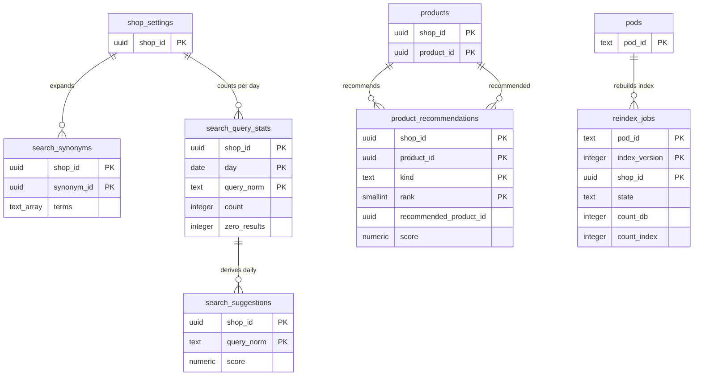

# Data model: 検索とおすすめ

[data-model.md](../data-model.md) の一部。規約はそちらの 3 節に従う。振る舞いは [search-and-recommendations.md](../search-and-recommendations.md)（4〜7 節）を正とする。決定は [ADR-0052](../../decisions/0052-search-index-per-pod-and-japanese-analysis.md)（ポッドごとの索引、日本語の解析）、[ADR-0053](../../decisions/0053-search-ranking-and-recommendations.md)（順位とおすすめ）。OpenSearch の索引の欄と文書の形は [stores.md](stores.md) の 7 節。

| 表 | 置き場所 | 書く |
| --- | --- | --- |
| `search_synonyms` | ポッド `public` | `admin-api` |
| `search_query_stats`、`search_suggestions`、`product_recommendations` | ポッド `public` | `storefront-api`（数え上げ）、`workers`（日次） |
| `reindex_jobs` | 全体 `ops` | `search-indexer` の作り直しの作業（ポッドの workers が結果を P3 で出す） |

- 検索の問い合わせは `packages/search` の `searchProducts(ctx, query)` だけが作る。`shop_id` の絞り込みと `routing` は `ctx` からだけ入れる。
- `search_query_stats.query_norm` は買い手が入れた文字なので、個人のデータが混じりうる。90 日で消し、候補は 7 日で 5 回以上の語だけにする（他の買い手に個人の検索の文字を出さない）。

## 1. ER 図

- `products` から `product_recommendations` への 2 本の線は、`product_id`（元）と `recommended_product_id`（先）。どちらも外部キーを張り、`ON DELETE CASCADE`。
- `search_query_stats` → `search_suggestions` は日次の計算の論理の関係。`reindex_jobs.shop_id` は全体の表のショップの ID（ポッドのデータを持たない）。

## 2. 表

### 2.1 `search_synonyms`

| 列 | 型 | NULL | 既定 | 説明 |
| --- | --- | --- | --- | --- |
| `shop_id`・`synonym_id` | `uuid` | NOT NULL | `synonym_id` は `uuidv7()` | |
| `terms` | `text[]` | NOT NULL | — | 正規化（NFKC、小文字）した語の集まり（例：`tシャツ`、`ティーシャツ`、`tee`） |
| `updated_at` | `timestamptz` | NOT NULL | `now()` | |

- キー：PK `(shop_id, synonym_id)`。索引：`USING gin (terms)`（`shop_id` は btree_gin で先頭）— 入力の語の引き。CHECK：`cardinality(terms) BETWEEN 2 AND 20`。1 ショップ 500 組（トリガー）。
- 問い合わせの時に展開する（索引を作り直さない）。S1 の量：約 50 万行。

### 2.2 `search_query_stats`

| 列 | 型 | NULL | 既定 | 説明 |
| --- | --- | --- | --- | --- |
| `shop_id` | `uuid` | NOT NULL | — | |
| `day` | `date` | NOT NULL | — | 日本時間の日。分割の鍵 |
| `query_norm` | `text` | NOT NULL | — | NFKC・小文字・空白の正規化。200 文字まで |
| `count` | `integer` | NOT NULL | `0` | |
| `zero_results` | `integer` | NOT NULL | `0` | |

- キー：PK `(shop_id, day, query_norm)`。数え上げは要求ごとでなく、`storefront-api` のタスクのメモリーで 1 分まとめて `INSERT … ON CONFLICT DO UPDATE`。
- 分割：`day` の月。保持：90 日（分割を `DROP`）。S1 の量：約 5,000 万行（90 日）。

### 2.3 `search_suggestions`

予測の検索の問い合わせの候補（日次）。

| 列 | 型 | NULL | 既定 | 説明 |
| --- | --- | --- | --- | --- |
| `shop_id` | `uuid` | NOT NULL | — | |
| `query_norm` | `text` | NOT NULL | — | 7 日で 5 回以上、結果が 1 件以上の語 |
| `score` | `numeric(10,4)` | NOT NULL | — | |
| `computed_on` | `date` | NOT NULL | — | |

- キー：PK `(shop_id, query_norm)`。索引：`(shop_id, query_norm text_pattern_ops)` — 前方一致。日次で入れ替える。S1 の量：約 300 万行。

### 2.4 `product_recommendations`

関連の商品（`related`、日次の `lift`）と合わせて買う商品（`complementary`、事業者の手の選択か `related` の上位 4）。

| 列 | 型 | NULL | 既定 | 説明 |
| --- | --- | --- | --- | --- |
| `shop_id`・`product_id` | `uuid` | NOT NULL | — | |
| `kind` | `text` | NOT NULL | — | `related`・`complementary` |
| `rank` | `smallint` | NOT NULL | — | 1〜20 |
| `recommended_product_id` | `uuid` | NOT NULL | — | |
| `score` | `numeric(12,4)` | NULL | — | `lift`（手の選択は NULL） |
| `source` | `text` | NOT NULL | — | `computed`・`manual`・`fallback_collection` |
| `computed_on` | `date` | NOT NULL | — | |

- キー：PK `(shop_id, product_id, kind, rank)`。UK `(shop_id, product_id, kind, recommended_product_id)`。FK → `products`（両方、`ON DELETE CASCADE`）。
- CHECK：`rank BETWEEN 1 AND 20`、`product_id <> recommended_product_id`。`count(A∧B) >= 3` は計算の側で守る。
- 手の選択の元は `products.complementary_product_ids`。S1 の量：約 5,000 万行（商品 500 万 × 平均 10）。

### 2.5 `reindex_jobs`（全体 `ops`）

索引の作り直しのショップごとの印（[search-and-recommendations.md](../search-and-recommendations.md) の 4.5 節）。ショップの値を持たず、件数だけを持つ。

| 列 | 型 | NULL | 既定 | 説明 |
| --- | --- | --- | --- | --- |
| `pod_id` | `text` | NOT NULL | — | |
| `index_version` | `integer` | NOT NULL | — | `products_v<n>` の `n` |
| `shop_id` | `uuid` | NOT NULL | — | |
| `state` | `text` | NOT NULL | `'pending'` | `pending`・`running`・`done`・`mismatch`・`failed` |
| `count_db` | `integer` | NULL | — | |
| `count_index` | `integer` | NULL | — | |
| `started_at`・`finished_at` | `timestamptz` | NULL | — | |

- キー：PK `(pod_id, index_version, shop_id)`。FK `pod_id` → `pods`。索引：`(pod_id, index_version, state)` — 別名を移す判定（全部が `done` かつ件数が一致）。
- 保持：別名を移した 30 日の後に消す。S1 の量：作り直し 1 回で 1.25 万行/ポッド。
