# Data model: 鍵・監査・データのライフサイクル

[data-model.md](../data-model.md) の一部。規約はそちらの 3 節（特に 3.11 節の暗号化、3.10 節の削除）に従う。振る舞いは [security.md](../security.md)（5・6・8 節）と [merchant-admin-and-staff.md](../merchant-admin-and-staff.md)（7・9 節）を正とする。決定は [ADR-0064](../../decisions/0064-permissions-roles-and-audit-log.md)（監査ログ）、[ADR-0066](../../decisions/0066-encryption-and-key-layout.md)（暗号化と鍵）、[ADR-0068](../../decisions/0068-data-classes-retention-and-operator-access.md)（データの区分、保持、運用者のアクセス）、[ADR-0013](../../decisions/0013-shop-lifecycle-and-data-deletion.md)（ショップの削除）。

| 表 | 置き場所 | 書く |
| --- | --- | --- |
| `data_keys` | ポッド `sys`・全体 `security` | 鍵の作業（月ごとに作る） |
| `audit_events`、`audit_chain_heads` | ポッド `public` | `packages/audit` の関数（変更と同じトランザクション。ロールは INSERT だけ）、`workers`（写し） |
| `support_access_grants` | ポッド `public` | `admin-api`（所有者・`staff_manage` の許可） |
| `customer_data_requests` | ポッド `public` | `admin-api`（`customers_export`・再確認）、`workers` |
| `retention_policies`、`legal_holds`、`redaction_policies`、`operator_audit_events` | 全体 `security` | 法務・Ops の道具、運用のワークフロー |
| `retention_policies_replica`、`legal_holds_replica`、`redaction_policies_replica` | ポッド `sys`（P5） | `workers` |

- 保持の期間の多くは法務の確認待ち（L3・L4）。値は `retention_policies` の行に持ち、結論で行を変える（コードを変えない）。
- 3 つの写しの表はこの工程で足した（ポッドの日次の保持の作業と削除の請求の処理が、全体の DB を読まずに表を読むため。P5。D-8）。

## 1. ER 図

```mermaid
erDiagram
    shop_settings ||--o{ audit_events : "audited"
    shop_settings ||--o| audit_chain_heads : "chain head and archive position"
    shop_settings ||--o{ support_access_grants : "grants"
    customers ||--o{ customer_data_requests : "requests"
    redaction_policies ||--o{ customer_data_requests : "scope by version"
    retention_policies ||--o| retention_policies_replica : "replicated (P5)"
    legal_holds ||--o| legal_holds_replica : "replicated (P5)"
    redaction_policies ||--o| redaction_policies_replica : "replicated (P5)"
    data_keys ||--o{ audit_events : "encrypts columns (example)"

    audit_events {
        uuid shop_id PK
        uuid event_id PK
        timestamptz at PK
        text actor_type
        text action
        text target_gid
        bytea prev_hash
        bytea hash
    }
    audit_chain_heads {
        uuid shop_id PK
        date chain_day
        bytea head_hash
        timestamptz archived_through
    }
    support_access_grants {
        uuid shop_id PK
        uuid grant_id PK
        text operator_id
        timestamptz expires_at
    }
    customer_data_requests {
        uuid shop_id PK
        uuid request_id PK
        uuid customer_id FK
        text kind "access erasure"
        text state
        integer policy_version
    }
    data_keys {
        text key_id PK
        text purpose
        text month
        bytea wrapped_key
        text state
    }
    retention_policies {
        text target PK
        integer retention_days
        text basis
    }
    retention_policies_replica {
        text target PK
        integer retention_days
    }
    legal_holds {
        uuid hold_id PK
        text scope
        uuid shop_id
        uuid customer_id
    }
    legal_holds_replica {
        uuid hold_id PK
        uuid shop_id
    }
    redaction_policies {
        integer policy_version PK
        text target_table PK
        text column_name PK
        text action
    }
    redaction_policies_replica {
        integer policy_version PK
        text target_table PK
        text column_name PK
    }
    operator_audit_events {
        uuid event_id PK
        timestamptz at PK
        text operator_id
        text action
        uuid shop_id
    }
    shop_settings {
        uuid shop_id PK
    }
    customers {
        uuid shop_id PK
        uuid customer_id PK
    }
```

- `data_keys` → 暗号化した列は、暗号文の頭の `<key_id>` で引く論理の参照（全部の D1・D3 の列。図は 1 つの例だけを描いた）。
- `redaction_policies` → `customer_data_requests` は、処理の時に使った `policy_version` の論理の参照（別の DB の表の写しを読む）。
- `legal_holds.customer_id` は ID だけ（ポッドの顧客の値を持たない）。

## 2. 表

### 2.1 `data_keys`（ポッド `sys`・全体 `security`）

列の暗号のデータの鍵（AES-256-GCM）。ポッド・月・用途ごとに作り、KMS で包んだものだけを置く（[ADR-0066](../../decisions/0066-encryption-and-key-layout.md)）。

| 列 | 型 | NULL | 既定 | 説明 |
| --- | --- | --- | --- | --- |
| `key_id` | `text` | NOT NULL | — | `<pod>-<purpose>-<yyyymm>-<n>`（全体は `global-…`） |
| `purpose` | `text` | NOT NULL | — | `pii`（D1）・`secrets`（提供者・運送会社の認証の情報）・`hmac_index`（HMAC の索引の鍵の元） |
| `month` | `text` | NOT NULL | — | `yyyy-mm` |
| `kms_key_arn` | `text` | NOT NULL | — | `kms-pod-<id>-pii` など |
| `wrapped_key` | `bytea` | NOT NULL | — | KMS で包んだデータの鍵 |
| `state` | `text` | NOT NULL | `'active'` | `active`（暗号化に使う）・`decrypt_only`・`retired` |
| `created_at` | `timestamptz` | NOT NULL | `now()` | |

- キー：PK `key_id`。UK `(purpose) WHERE state = 'active'`。RLS：なし（ADR-0003 の注記の RLS の外の表。ショップのデータの列を持たない）。
- 平文の鍵はタスクのメモリーに 1 時間まで。`pii`・`secrets` の Decrypt はアプリのタスクのロールと `shop-mover` だけ（人のロールに与えない）。
- 移し替え：暗号文はポッドの鍵に結び付くので、`shop-mover` が元の鍵で開き先の鍵で包み直し、HMAC の索引の列を作り直す。
- 消さない（古い暗号文を開くため。`retired` は暗号文が 0 になったことを確かめてから）。S1 の量：ポッドあたり 年 数十行。

### 2.2 暗号化した列の形

| 形 | 中身 |
| --- | --- |
| 暗号文の列（`*_ciphertext`、`text`） | `v1\|<key_id>\|<nonce の base64url>\|<ciphertext＋tag の base64url>` |
| AAD | `shop_id`・表の名前・列の名前・行の主キー（他のショップ・他の行への写し替えを検出する） |
| HMAC の索引の列（`*_hmac`、`bytea` 32） | 正規化した値の HMAC-SHA256。鍵は `hmac_index` の鍵から HKDF でショップごとに派生（他のショップの同じ値と同じにならない） |

- 対象：買い手の氏名・住所・電話・メール・注文のメモ・宛名（D1）、提供者・運送会社の認証の情報、SSO の秘密、TOTP の秘密（D3）。一覧は [data-model.md](../data-model.md) の 3.11 節。

### 2.3 `audit_events`（ポッド）

事業者の監査ログ（[ADR-0064](../../decisions/0064-permissions-roles-and-audit-log.md)）。変更と同じトランザクションで書く。

| 列 | 型 | NULL | 既定 | 説明 |
| --- | --- | --- | --- | --- |
| `shop_id` | `uuid` | NOT NULL | — | |
| `event_id` | `uuid` | NOT NULL | `uuidv7()` | |
| `at` | `timestamptz` | NOT NULL | `now()` | 分割の鍵 |
| `actor_type` | `text` | NOT NULL | — | `staff`・`collaborator`・`app`・`system`・`operator` |
| `actor_id` | `text` | NULL | — | |
| `action` | `text` | NOT NULL | — | `product.price_changed` の形 |
| `target_gid` | `text` | NULL | — | `gid://<brand>/<Type>/<uuid>` |
| `changes` | `jsonb` | NOT NULL | `'{}'` | 個人のデータでない項目は前後の値、個人のデータの項目は名前だけ |
| `request_id` | `text` | NULL | — | |
| `ip_hash` | `bytea` | NULL | — | ショップごとの鍵の HMAC |
| `device_kind` | `text` | NULL | — | |
| `prev_hash` | `bytea` | NOT NULL | — | ショップ・日の鎖の前の値（日の最初は前の日の最後の値） |
| `hash` | `bytea` | NOT NULL | — | `SHA-256(prev_hash ‖ 正規化した行の JSON)` |

- キー：PK `(shop_id, event_id, at)`。索引：`(shop_id, action, at)`（領域の文書の索引）。`(shop_id, at)` — 画面の時刻の順と写し。
- CHECK：`octet_length(hash) = 32`、`actor_type IN (…)`。ロールは INSERT だけ（UPDATE・DELETE を与えない）。
- 鎖の直列：`packages/audit` の関数は、同じトランザクションで `audit_chain_heads` のショップの行を `FOR UPDATE` で取り、`prev_hash` に今の頭を使い、頭を新しい `hash` に進める。ショップの監査の書き込みはこの行で直列になる（監査の対象は事業者・アプリ・運用者の変更で、買い手のチェックアウトは書かないので熱くならない）。
- 個人のデータの表示の記録は、同じ顧客・同じスタッフ・同じ日を 1 行にまとめる。
- 分割：`at` の月。保持：ポッド 90 日（プラスは 1 年）で分割を `DROP`。写しは log-archive の S3（Object Lock、1 年。L3）。移し替えで移る。S1 の量：約 50 万行/日（初期見積もり。90 日で約 4,500 万行）。

### 2.4 `audit_chain_heads`（ポッド）

ショップの鎖の頭と、log-archive への 1 時間ごとの写しの位置。欠けと重なりの検査に使う。この工程で足した（D-19）。

| 列 | 型 | NULL | 既定 | 説明 |
| --- | --- | --- | --- | --- |
| `shop_id` | `uuid` | NOT NULL | — | |
| `chain_day` | `date` | NOT NULL | — | 今の鎖の日（日本時間） |
| `head_hash` | `bytea` | NOT NULL | — | 最後の行の `hash`。日が変わっても続ける（前の日の最後の値が次の日の最初の `prev_hash`） |
| `head_event_id` | `uuid` | NULL | — | |
| `archived_through` | `timestamptz` | NULL | — | ここまでの時間を写した |
| `archived_last_event_id` | `uuid` | NULL | — | 写した最後の行 |
| `archived_day_head` | `bytea` | NULL | — | 写した日の最後の `hash`（S3 の `audit/chain/…` と同じ値） |
| `updated_at` | `timestamptz` | NOT NULL | `now()` | |

- キー：PK `shop_id`。CHECK：`octet_length(head_hash) = 32`。移し替えで移る。S1 の量：10 万行。

### 2.5 `support_access_grants`（ポッド）

運用者のサポートのアクセスの事業者の許可（72 時間、読み出しの専用、取り消し可）。

| 列 | 型 | NULL | 既定 | 説明 |
| --- | --- | --- | --- | --- |
| `shop_id`・`grant_id` | `uuid` | NOT NULL | `grant_id` は `uuidv7()` | |
| `granted_by` | `uuid` | NOT NULL | — | 許可したスタッフ |
| `operator_id` | `text` | NULL | — | 対象の運用者（NULL ならサポートの当番のだれか） |
| `case_ref` | `text` | NULL | — | 問い合わせの番号 |
| `expires_at` | `timestamptz` | NOT NULL | `now() + interval '72 hours'` | |
| `revoked_at` | `timestamptz` | NULL | — | |
| `created_at` | `timestamptz` | NOT NULL | `now()` | |

- キー：PK `(shop_id, grant_id)`。索引：`(shop_id, expires_at) WHERE revoked_at IS NULL`。許可・使用・取り消しは事業者の監査ログに出す。保持：1 年。S1 の量：数万行。

### 2.6 `customer_data_requests`（ポッド）

買い手からの開示・削除の請求の受け付けと進み具合（[merchant-admin-and-staff.md](../merchant-admin-and-staff.md) の 9 節。範囲と期限は L3）。

| 列 | 型 | NULL | 既定 | 説明 |
| --- | --- | --- | --- | --- |
| `shop_id`・`request_id` | `uuid` | NOT NULL | `request_id` は `uuidv7()` | |
| `customer_id` | `uuid` | NOT NULL | — | |
| `kind` | `text` | NOT NULL | — | `access`・`erasure` |
| `state` | `text` | NOT NULL | `'received'` | `received`・`processing`・`exported`・`completed`・`rejected` |
| `policy_version` | `integer` | NULL | — | 使った `redaction_policies` のバージョン |
| `export_s3_key` | `text` | NULL | — | `shops/<shop_id>/data-requests/<request_id>.json`（7 日） |
| `apps_notified_at` | `timestamptz` | NULL | — | `customers/data_request`・`customers/redact` を出した |
| `requested_by` | `uuid` | NOT NULL | — | 受け付けたスタッフ |
| `due_at` | `timestamptz` | NULL | — | |
| `created_at`・`completed_at` | `timestamptz` | — | — | |

- キー：PK `(shop_id, request_id)`。FK → `customers`。索引：`(shop_id, state, due_at)`。
- 法的な保全（`legal_holds_replica`）の対象の顧客は `erasure` を保留にする。保持：完了の後 3 年（L3）。S1 の量：数万行/年。

### 2.7 `retention_policies`（全体 `security`）・`retention_policies_replica`（ポッド `sys`）

区分・対象ごとの保持の期間（[security.md](../security.md) の 6.2 節）。

| 列 | 型 | NULL | 既定 | 説明 |
| --- | --- | --- | --- | --- |
| `target` | `text` | NOT NULL | — | `checkout_d1`・`cart`・`customer_session`・`bulk_export`・`app_log`・`audit_pod`・`audit_archive`・`aurora_backup`・`order_amounts` など |
| `data_class` | `text` | NOT NULL | — | `D1`〜`D4` |
| `retention_days` | `integer` | NULL | — | NULL は法令の期間（`retained_until`） |
| `basis` | `text` | NOT NULL | — | `default`・`legal_L3`・`legal_L4`（結論の反映） |
| `version` | `bigint` | NOT NULL | — | |
| `updated_by`・`updated_at` | — | — | — | |

- キー：PK `target`。写しは `target`・`retention_days`・`version`・`replicated_at`。S1 の量：数十行。

### 2.8 `legal_holds`（全体 `security`）・`legal_holds_replica`（ポッド `sys`）

法的な保全の印。削除・保持の作業は対象を飛ばす。設定は法務と Ops だけ（`operator_audit_events` に残す）。

| 列 | 型 | NULL | 既定 | 説明 |
| --- | --- | --- | --- | --- |
| `hold_id` | `uuid` | NOT NULL | `uuidv7()` | |
| `scope` | `text` | NOT NULL | — | `shop`・`customer` |
| `shop_id` | `uuid` | NOT NULL | — | |
| `customer_id` | `uuid` | NULL | — | `customer` のとき |
| `reason_ref` | `text` | NOT NULL | — | 照会の番号（中身は法務の記録） |
| `set_by` | `text` | NOT NULL | — | |
| `set_at` | `timestamptz` | NOT NULL | `now()` | |
| `released_at` | `timestamptz` | NULL | — | |

- キー：PK `hold_id`。索引：`(shop_id) WHERE released_at IS NULL`。CHECK：`scope = 'shop' OR customer_id IS NOT NULL`。
- 写しは全ポッドに有効な行だけ（`shop_id` で各ポッドが自分のショップの行を使う。ショップの値でなく ID だけ）。S1 の量：数百行。

### 2.9 `redaction_policies`（全体 `security`）・`redaction_policies_replica`（ポッド `sys`）

削除の請求で、どの表・列をどう消すか（L3 の結論で行を変える）。

| 列 | 型 | NULL | 既定 | 説明 |
| --- | --- | --- | --- | --- |
| `policy_version` | `integer` | NOT NULL | — | |
| `target_table` | `text` | NOT NULL | — | `customers`・`customer_addresses`・`orders`・`checkouts`・`tax_documents` など |
| `column_name` | `text` | NOT NULL | — | 行ごと消すときは `*` |
| `action` | `text` | NOT NULL | — | `null`・`delete_row`・`keep`（法令の保存の義務） |
| `basis` | `text` | NOT NULL | — | |
| `effective_from` | `timestamptz` | NOT NULL | — | |

- キー：PK `(policy_version, target_table, column_name)`。CHECK：`action IN (…)`。写しは同じ列。S1 の量：数百行。

### 2.10 `operator_audit_events`（全体 `security`）

運用者の操作（サポートのアクセス、Ops の手動の操作、break-glass、法的な保全の設定）。形は `audit_events` と同じ。

| 列 | 型 | NULL | 既定 | 説明 |
| --- | --- | --- | --- | --- |
| `event_id` | `uuid` | NOT NULL | `uuidv7()` | |
| `at` | `timestamptz` | NOT NULL | `now()` | 分割の鍵 |
| `operator_id` | `text` | NOT NULL | — | IAM Identity Center の利用者 |
| `action` | `text` | NOT NULL | — | `support.access`・`inventory.reconciliation_fix`・`shop.move_approved`・`shop.freeze`・`breakglass.session`・`legal_hold.set` |
| `shop_id` | `uuid` | NULL | — | |
| `target` | `text` | NULL | — | |
| `approvals` | `text[]` | NOT NULL | `'{}'` | 2 人の承認の主体 |
| `session_ref` | `text` | NULL | — | SSM のセッションの ID |
| `details` | `jsonb` | NOT NULL | `'{}'` | ID と数と理由のコードだけ |
| `prev_hash`・`hash` | `bytea` | NOT NULL | — | 日ごとの鎖 |

- キー：PK `(event_id, at)`。索引：`(shop_id, at)`、`(operator_id, at)`。分割：`at` の月。ロールは INSERT だけ。
- 保持：1 年（log-archive に写す。L3）。S1 の量：約 10 万行/月。
