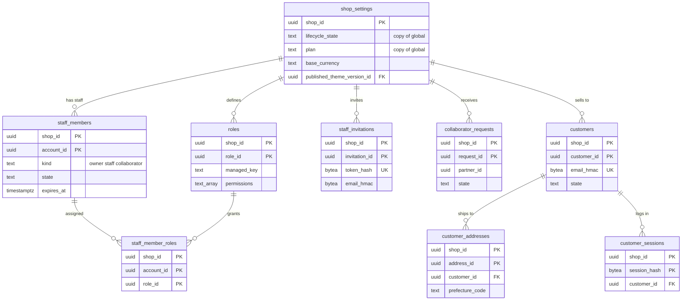

# Data model: ショップの設定・スタッフ・顧客

[data-model.md](../data-model.md) の一部。規約はそちらの 3 節に従う。振る舞いは [merchant-admin-and-staff.md](../merchant-admin-and-staff.md)（4・5・9・10 節）を正とする。決定は [ADR-0063](../../decisions/0063-staff-identity-2fa-sso-and-collaborators.md)（所属、協力者）、[ADR-0064](../../decisions/0064-permissions-roles-and-audit-log.md)（権限と役割）。

| 表 | 置き場所 | 書く |
| --- | --- | --- |
| `shop_settings` | ポッド `public` | `admin-api`、`workers`（`shop/lifecycle` の写し） |
| `staff_members`、`staff_member_roles`、`staff_invitations`、`roles`、`collaborator_requests` | ポッド `public` | `admin-api` |
| `customers`、`customer_addresses`、`customer_sessions` | ポッド `public` | `checkout`（作成・ログイン）、`admin-api` |

- `shop_settings` と `customers`・`customer_addresses` は、この工程で最小の形を決めた（D-3・D-11。[data-model.md](../data-model.md) の 7 節）。顧客のメモ・タグの細部は E6 の `customer-accounts` と E17 の `customer-data-requests` で広げる（広げる段の移行で足す）。

## 1. ER 図

- `staff_members.account_id` は全体の `accounts` を指すが、別の DB なので外部キーを張らない（論理の参照）。`collaborator_requests.partner_id` も同じ。
- `shop_settings.published_theme_version_id` → `theme_versions` は [themes-and-storefront.md](themes-and-storefront.md) の図にある（任意の参照）。

## 2. 表

### 2.1 `shop_settings`

ポッドの側のショップの 1 行。全体の `shops` の写しの値（ライフサイクル、プラン）と、ポッドのサービスが読むショップの設定を持つ。この工程で決めた（D-3）。[storefront-themes.md](../storefront-themes.md) の 7.2 節の `shops.published_theme_version_id` はこの表の列にした。

| 列 | 型 | NULL | 既定 | 説明 |
| --- | --- | --- | --- | --- |
| `shop_id` | `uuid` | NOT NULL | — | |
| `name` | `text` | NOT NULL | — | ショップの表示の名前（文書に出す名前は `shop_tax_settings.document_display_name`） |
| `lifecycle_state` | `text` | NOT NULL | — | 全体の `shops.lifecycle_state` の写し（outbox の `shop/lifecycle`）。DT-PERM-001 の行 1・5、チェックアウトの拒否 |
| `lifecycle_version` | `bigint` | NOT NULL | `0` | 写しの事象の番号。小さい事象を捨てる |
| `plan` | `text` | NOT NULL | — | 写し。`plan_limits_replica` を引く鍵 |
| `base_currency` | `text` | NOT NULL | `'JPY'` | 基本の通貨。バリエーションの価格の通貨 |
| `timezone` | `text` | NOT NULL | `'Asia/Tokyo'` | 文書の日付、テーマの `date` |
| `primary_locale` | `text` | NOT NULL | `'ja'` | |
| `published_theme_version_id` | `uuid` | NULL | — | 公開中のテーマのバージョン（[ADR-0046](../../decisions/0046-theme-structure-sections-and-publishing.md)） |
| `storefront_password_hash` | `text` | NULL | — | `trial` の間のパスワードの画面（Argon2id） |
| `order_number_prefix`・`order_number_suffix` | `text` | NOT NULL | `'#'`・`''` | 表示の番号の飾り（[orders-and-fulfillment.md](../orders-and-fulfillment.md) の 3.2 節） |
| `surge_auto_queue_enabled` | `boolean` | NOT NULL | `true` | 予定にない急増の自動の待合室（[ADR-0027](../../decisions/0027-flash-sale-preparation-and-surge-auto-queue.md)） |
| `low_stock_threshold` | `integer` | NULL | — | 「残りわずか」の閾値（既定は出さない。L2 の確認待ち） |
| `checkout_branding` | `jsonb` | NOT NULL | `'{}'` | チェックアウトの色・ロゴ・文言（[ADR-0067](../../decisions/0067-checkout-script-integrity-and-card-testing.md)。テーマで描かない） |
| `collections_version` | `bigint` | NOT NULL | `0` | 条件のコレクションの IR のメモリーのキャッシュを破棄する番号（[catalog-and-pricing.md](../catalog-and-pricing.md) の 5.2 節） |
| `collaborator_code_required` | `boolean` | NOT NULL | `false` | 協力者の依頼に 6 桁のコードを求める |
| `collaborator_code_hash` | `bytea` | NULL | — | |
| `created_at`・`updated_at` | `timestamptz` | NOT NULL | `now()` | |

- キー：PK `shop_id`。FK `(shop_id, published_theme_version_id)` → `theme_versions`（`DEFERRABLE`、任意）。
- CHECK：`lifecycle_state IN (…)`（全体と同じ値）、`base_currency ~ '^[A-Z]{3}$'`、`low_stock_threshold IS NULL OR low_stock_threshold BETWEEN 1 AND 999`。
- 書き手：ショップの作成（`shop-directory` の初期化の API がポッドへ 1 行を作る）、写しの事象、`admin-api`（`settings_write`）。公開のテーマの列の更新は `themes/publish` の outbox と同じトランザクション。
- RLS：テナントの表。保持：ショップの削除まで。S1 の量：10 万行。

### 2.2 `roles`・`staff_member_roles`

役割（権限の集まり）と割り当て。既定の 6 つ（`managed_key`）は中身をコードのバージョンで決め、行には持たない。[merchant-admin-and-staff.md](../merchant-admin-and-staff.md) の 5 節。

| `roles` の列 | 型 | NULL | 既定 | 説明 |
| --- | --- | --- | --- | --- |
| `shop_id`・`role_id` | `uuid` | NOT NULL | `role_id` は `uuidv7()` | |
| `name` | `text` | NOT NULL | — | |
| `managed_key` | `text` | NULL | — | `admin`・`products`・`orders`・`fulfillment`・`marketing`・`read_only`。独自の役割は NULL |
| `permissions` | `text[]` | NOT NULL | `'{}'` | 独自の役割の権限（`products_write` の形）。既定の役割は空 |
| `created_at`・`updated_at` | `timestamptz` | NOT NULL | `now()` | |

| `staff_member_roles` の列 | 型 | NULL | 既定 | 説明 |
| --- | --- | --- | --- | --- |
| `shop_id`・`account_id`・`role_id` | `uuid` | NOT NULL | — | |
| `granted_by` | `uuid` | NOT NULL | — | 割り当てたアカウント |
| `granted_at` | `timestamptz` | NOT NULL | `now()` | |

- キー：`roles` PK `(shop_id, role_id)`、UK `(shop_id, name)`、UK `(shop_id, managed_key) WHERE managed_key IS NOT NULL`。`staff_member_roles` PK `(shop_id, account_id, role_id)`、FK → `staff_members`・`roles`（`ON DELETE CASCADE`）。
- CHECK：`managed_key IS NULL OR cardinality(permissions) = 0`、権限の名前は `^[a-z_]+$`（一覧にあることは `packages/authz` で確かめる）。
- トリガー：独自の役割は 1 ショップ 30 まで。`staff_manage` の主体が自分の持たない権限を含む役割を割り当てる変更は、アプリの関数で拒む（DB では形だけ）。
- 変更のたびに Valkey のトークンの写し（`{<shop_id>}:tok:*` のそのスタッフの分）を消す（60 秒以内に効く）。
- RLS：テナントの表。S1 の量：役割 約 60 万行（既定 6 × 10 万＋独自）、割り当て 約 30 万行。

### 2.3 `staff_members`

ショップへの所属。入場の判定の正本（全体の `account_shops` は一覧の写し）。[ADR-0063](../../decisions/0063-staff-identity-2fa-sso-and-collaborators.md)。

| 列 | 型 | NULL | 既定 | 説明 |
| --- | --- | --- | --- | --- |
| `shop_id`・`account_id` | `uuid` | NOT NULL | — | |
| `kind` | `text` | NOT NULL | — | `owner`・`staff`・`collaborator` |
| `state` | `text` | NOT NULL | `'active'` | `active`・`suspended`・`expired` |
| `partner_id` | `uuid` | NULL | — | 協力者の所属元 |
| `collaborator_pii_allowed` | `boolean` | NOT NULL | `false` | 協力者に `customers_pii_read`・`customers_export` を明示に与えたか（DT-PERM-001 の行 7） |
| `expires_at` | `timestamptz` | NULL | — | 協力者は 180 日 |
| `last_used_at` | `timestamptz` | NULL | — | 協力者は 90 日の未使用で外す |
| `joined_at` | `timestamptz` | NOT NULL | `now()` | |
| `membership_version` | `bigint` | NOT NULL | `1` | P4 の事象の番号（`account_shops.source_version`） |

- キー：PK `(shop_id, account_id)`。UK `(shop_id) WHERE kind = 'owner'`（所有者は 1 人）。
- 索引：`(shop_id, kind, state)` — スタッフの数の上限（協力者を数えない）。`(shop_id, expires_at) WHERE kind = 'collaborator'` — 期限の掃除。
- CHECK：`kind IN (…)`、`kind <> 'collaborator' OR (partner_id IS NOT NULL AND expires_at IS NOT NULL)`、`kind = 'collaborator' OR NOT collaborator_pii_allowed`。
- トリガー：スタッフの数（`kind = 'staff'`）を `plan_limits_replica.staff_limit` で絞る。変更は outbox の `staff/membership_changed`（P4）と `audit_events` を同じトランザクションで書く。
- RLS：テナントの表。保持：外した行は消す（履歴は監査ログ）。S1 の量：約 20 万行。

### 2.4 `staff_invitations`

招待のリンク（1 回だけ、72 時間）。この工程で置き場所を決めた（D-19）。

| 列 | 型 | NULL | 既定 | 説明 |
| --- | --- | --- | --- | --- |
| `shop_id`・`invitation_id` | `uuid` | NOT NULL | `invitation_id` は `uuidv7()` | |
| `email_ciphertext` | `text` | NOT NULL | — | 招待した宛先（列の暗号。スタッフの連絡先だが、ポッドの表なので暗号化する） |
| `email_hmac` | `bytea` | NOT NULL | — | 重複の招待の検出 |
| `role_ids` | `uuid[]` | NOT NULL | — | 受けたときに付ける役割 |
| `token_hash` | `bytea` | NOT NULL | — | リンクの乱数の SHA-256 |
| `invited_by` | `uuid` | NOT NULL | — | |
| `expires_at` | `timestamptz` | NOT NULL | `now() + interval '72 hours'` | |
| `accepted_at`・`revoked_at` | `timestamptz` | NULL | — | |
| `accepted_account_id` | `uuid` | NULL | — | |

- キー：PK `(shop_id, invitation_id)`。UK `token_hash`。UK `(shop_id, email_hmac) WHERE accepted_at IS NULL AND revoked_at IS NULL`。
- 保持：期限か受け入れの 30 日後に消す。S1 の量：数万行。

### 2.5 `collaborator_requests`

パートナーのメンバーからの協力の依頼。[merchant-admin-and-staff.md](../merchant-admin-and-staff.md) の 4.4 節。

| 列 | 型 | NULL | 既定 | 説明 |
| --- | --- | --- | --- | --- |
| `shop_id`・`request_id` | `uuid` | NOT NULL | `request_id` は `uuidv7()` | |
| `partner_id`・`requester_account_id` | `uuid` | NOT NULL | — | |
| `requested_permissions` | `text[]` | NOT NULL | — | |
| `message` | `text` | NULL | — | 500 文字まで |
| `state` | `text` | NOT NULL | `'pending'` | `pending`・`approved`・`declined`・`expired` |
| `decided_by` | `uuid` | NULL | — | |
| `created_at`・`decided_at` | `timestamptz` | — | — | |

- キー：PK `(shop_id, request_id)`。UK `(shop_id, requester_account_id) WHERE state = 'pending'`。承認で `staff_members`（`kind = 'collaborator'`）を同じトランザクションで作る。
- 保持：決定の 90 日後に消す。S1 の量：数万行。

### 2.6 `customers`

ショップの買い手（ログインの有無に依らず、注文の相手）。この工程で最小の形を決めた（D-11）。個人のデータの列は列の暗号（[ADR-0066](../../decisions/0066-encryption-and-key-layout.md)）。

| 列 | 型 | NULL | 既定 | 説明 |
| --- | --- | --- | --- | --- |
| `shop_id`・`customer_id` | `uuid` | NOT NULL | `customer_id` は `uuidv7()` | |
| `state` | `text` | NOT NULL | `'enabled'` | `enabled`・`disabled`・`redacted` |
| `email_ciphertext` | `text` | NULL | — | D1 |
| `email_hmac` | `bytea` | NULL | — | 正規化したメールの HMAC（ショップごとの派生の鍵）。ログインと管理画面の完全一致 |
| `phone_ciphertext` | `text` | NULL | — | D1（E.164） |
| `phone_hmac` | `bytea` | NULL | — | |
| `name_ciphertext` | `text` | NULL | — | D1（姓・名・読みの JSON を暗号化） |
| `note_ciphertext` | `text` | NULL | — | 事業者のメモ（D1 の扱い） |
| `tags` | `text[]` | NOT NULL | `'{}'` | 保護のデータの段階 1 |
| `membership_tier` | `text` | NULL | — | 会員の区分（段階 1） |
| `orders_count` | `integer` | NOT NULL | `0` | 段階 1。注文の作成で 1 上げる |
| `total_spent_amount` | `bigint` | NOT NULL | `0` | 基本の通貨 |
| `created_at`・`updated_at` | `timestamptz` | NOT NULL | `now()` | |
| `redacted_at` | `timestamptz` | NULL | — | 削除の請求の処理の時刻 |

- キー：PK `(shop_id, customer_id)`。UK `(shop_id, email_hmac) WHERE email_hmac IS NOT NULL`。
- 索引：`(shop_id, phone_hmac)` — 電話の完全一致。`(shop_id, created_at)` — 一覧。`USING gin (tags)`（`shop_id` は btree_gin で先頭に）— タグの絞り込み。
- CHECK：`state <> 'redacted' OR (email_ciphertext IS NULL AND phone_ciphertext IS NULL AND name_ciphertext IS NULL AND note_ciphertext IS NULL AND email_hmac IS NULL AND phone_hmac IS NULL)`、`orders_count >= 0`。
- 削除の請求：個人のデータの列を NULL にし、`state = 'redacted'`。行と `customer_id` は残す（注文の金額・税の記録の匿名の顧客の ID。[merchant-admin-and-staff.md](../merchant-admin-and-staff.md) の 9 節。範囲は L3 の確認待ち、`redaction_policies`）。
- RLS：テナントの表。S1 の量：約 1,500 万行（初期見積もり）。

### 2.7 `customer_addresses`

顧客の住所。注文・チェックアウトの住所は各行に写す（この表を参照しない）。

| 列 | 型 | NULL | 既定 | 説明 |
| --- | --- | --- | --- | --- |
| `shop_id`・`address_id` | `uuid` | NOT NULL | `address_id` は `uuidv7()` | |
| `customer_id` | `uuid` | NOT NULL | — | |
| `address_ciphertext` | `text` | NOT NULL | — | 郵便番号・市区町村・番地・建物・氏名・電話の JSON（D1） |
| `prefecture_code` | `text` | NOT NULL | — | JIS X 0401 の 2 桁（段階 0。暗号化しない） |
| `is_default` | `boolean` | NOT NULL | `false` | |
| `created_at`・`updated_at` | `timestamptz` | NOT NULL | `now()` | |

- キー：PK `(shop_id, address_id)`。FK `(shop_id, customer_id)` → `customers`（`ON DELETE CASCADE`）。UK `(shop_id, customer_id) WHERE is_default`。
- CHECK：`prefecture_code ~ '^(0[1-9]|[1-3][0-9]|4[0-7])$'`。1 顧客 20 まで（トリガー）。
- 削除の請求で行を消す。S1 の量：約 1,500 万行。

### 2.8 `customer_sessions`

買い手のログインのセッション（ショップのホストの Cookie、30 日）。[merchant-admin-and-staff.md](../merchant-admin-and-staff.md) の 10 節。

| 列 | 型 | NULL | 既定 | 説明 |
| --- | --- | --- | --- | --- |
| `shop_id` | `uuid` | NOT NULL | — | |
| `session_hash` | `bytea` | NOT NULL | — | Cookie の値の SHA-256 |
| `customer_id` | `uuid` | NOT NULL | — | |
| `created_at` | `timestamptz` | NOT NULL | `now()` | |
| `expires_at` | `timestamptz` | NOT NULL | `now() + interval '30 days'` | |
| `revoked_at` | `timestamptz` | NULL | — | |

- キー：PK `(shop_id, session_hash)`。FK → `customers`（`ON DELETE CASCADE`）。索引：`(shop_id, customer_id)` — 一斉の取り消し。
- 1 回だけのログインのコード（6 桁、10 分、5 回まで）は DB に置かず、Valkey の `{<shop_id>}:clc:<email_hmac>` に置く（[stores.md](stores.md) の 1 節）。
- 保持：期限の 1 日後に消す（[ADR-0068](../../decisions/0068-data-classes-retention-and-operator-access.md) の 30 日）。S1 の量：約 300 万行。
