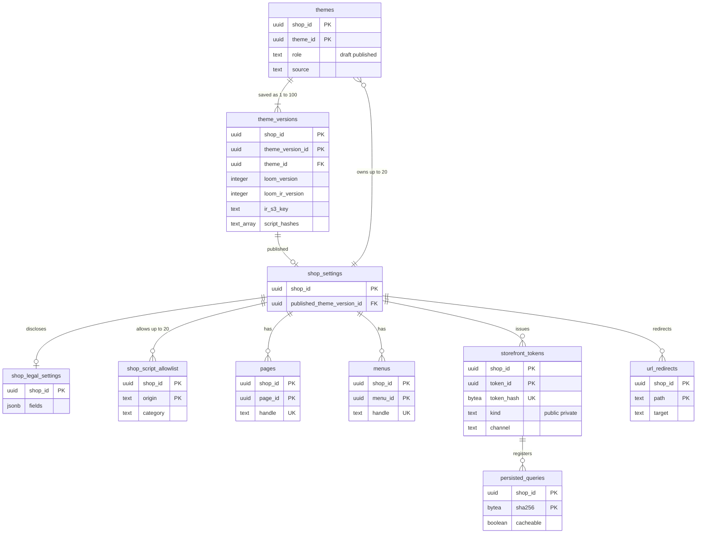

# Data model: テーマとストアフロント

[data-model.md](../data-model.md) の一部。規約はそちらの 3 節に従う。振る舞いは [storefront-themes.md](../storefront-themes.md)（7〜9 節）と [storefront-api-and-caching.md](../storefront-api-and-caching.md)（5〜9 節）を正とする。決定は [ADR-0046](../../decisions/0046-theme-structure-sections-and-publishing.md)（テーマの構成と公開）、[ADR-0048](../../decisions/0048-storefront-scripts-csp-and-external-transmission.md)（スクリプトと外部送信）、[ADR-0049](../../decisions/0049-storefront-api-tokens-and-limits.md)（Storefront API のトークン）、[ADR-0050](../../decisions/0050-edge-cache-keys-and-generations.md)（キャッシュの鍵と世代）。Loom の翻訳の結果（IR）の形、テーマのファイルの S3 の置き場所、エッジのキャッシュの鍵は [stores.md](stores.md)。

| 表 | 置き場所 | 書く |
| --- | --- | --- |
| `themes`、`theme_versions` | ポッド `public` | `admin-api`（`themes_write`・`themes_code`）、`workers`（IR の翻訳し直し） |
| `shop_legal_settings`、`shop_script_allowlist` | ポッド `public` | `admin-api`（`legal_settings`・`settings_write`） |
| `pages`、`menus` | ポッド `public` | `admin-api` |
| `storefront_tokens`、`persisted_queries`、`url_redirects` | ポッド `public` | `admin-api`、`storefront-api`（永続化したクエリの登録） |

- 公開中のテーマは `shop_settings.published_theme_version_id`（[shops-and-staff.md](shops-and-staff.md) の 2.1 節。D-3）。
- `pages`・`menus` はこの工程で最小の形を決めた（テーマの `page` の drop とキャッシュの世代の事象「メニュー・ページ」の置き場所。D-19）。ブログと記事は MVP の後。

## 1. ER 図

- `theme_versions ||--o| shop_settings`：1 つのショップで公開中のバージョンは 1 つ。外部キーは `shop_settings` の側の任意の参照。
- `storefront_tokens` → `persisted_queries` は「登録した主体」の論理の関係（永続化したクエリはショップの単位で共有し、トークンの ID を持たない）。

## 2. 表

### 2.1 `themes`

| 列 | 型 | NULL | 既定 | 説明 |
| --- | --- | --- | --- | --- |
| `shop_id`・`theme_id` | `uuid` | NOT NULL | `theme_id` は `uuidv7()` | |
| `name` | `text` | NOT NULL | — | |
| `role` | `text` | NOT NULL | `'draft'` | `draft`・`published` |
| `source` | `text` | NOT NULL | — | `default_simple`・`default_brand`・`import`・`copy` |
| `latest_version_id` | `uuid` | NULL | — | 最新の保存 |
| `created_at`・`updated_at` | `timestamptz` | NOT NULL | `now()` | |

- キー：PK `(shop_id, theme_id)`。UK `(shop_id) WHERE role = 'published'`。1 ショップ 20 テーマ（トリガー）。
- `role` は `shop_settings.published_theme_version_id` の表示用の写しで、公開の関数が同じトランザクションで書く。公開中のテーマは消せない。S1 の量：約 30 万行。

### 2.2 `theme_versions`

不変のテーマのバージョン（保存ごと）。全ファイルの検査と翻訳を通ったときだけ作る。

| 列 | 型 | NULL | 既定 | 説明 |
| --- | --- | --- | --- | --- |
| `shop_id`・`theme_version_id` | `uuid` | NOT NULL | `theme_version_id` は `uuidv7()` | |
| `theme_id` | `uuid` | NOT NULL | — | |
| `seq` | `integer` | NOT NULL | — | テーマの中の番号 |
| `loom_version` | `integer` | NOT NULL | — | 言語の意味のバージョン（`theme.json`） |
| `loom_ir_version` | `integer` | NOT NULL | — | IR の形のバージョン |
| `files` | `jsonb` | NOT NULL | — | パス → 内容の SHA-256（中身は S3 の `shops/<shop_id>/theme-files/<sha256>`） |
| `total_bytes` | `integer` | NOT NULL | — | 50 MB まで |
| `ir_s3_key` | `text` | NOT NULL | — | `shops/<shop_id>/themes/<theme_version_id>/ir/v<loom_ir_version>.lir` |
| `ir_sha256` | `bytea` | NOT NULL | — | 読み手が確かめる |
| `ir_next_s3_key` | `text` | NULL | — | `loom_ir_version` を上げる時の翻訳し直しの IR（[delivery.md](../delivery.md) の 6.3 節） |
| `ir_next_compare` | `jsonb` | NULL | — | 抜き取りの比べの結果（出力と歩数の一致） |
| `script_hashes` | `text[]` | NOT NULL | `'{}'` | インラインのスクリプトの `'sha256-…'`（CSP） |
| `templates_meta` | `jsonb` | NOT NULL | — | テンプレートごとのキャッシュの可否と読み出しの費用の見積もり |
| `created_by` | `uuid` | NOT NULL | — | |
| `created_at` | `timestamptz` | NOT NULL | `now()` | |

- キー：PK `(shop_id, theme_version_id)`。UK `(shop_id, theme_id, seq)`。FK → `themes`（`ON DELETE CASCADE`）。
- CHECK：`total_bytes <= 52428800`、`ir_s3_key LIKE 'shops/' || shop_id::text || '/themes/%'`。
- トリガー：`ir_next_*` と、翻訳し直しが終わって `ir_s3_key`・`loom_ir_version`・`ir_sha256` を入れ替える更新だけを許す（関数 `promote_ir()`）。他の列の `UPDATE` を拒む。1 テーマ 100 バージョン（古いものから消す。公開中のものは消さない）。
- S1 の量：約 300 万行。

### 2.3 `shop_legal_settings`

特定商取引法の表示の項目（`shop.legal` の drop）。どの項目が要るか・省略の条件は法務の確認待ち（L1）。

| 列 | 型 | NULL | 既定 | 説明 |
| --- | --- | --- | --- | --- |
| `shop_id` | `uuid` | NOT NULL | — | |
| `fields` | `jsonb` | NOT NULL | `'{}'` | 事業者の名前、住所、電話番号、責任者、価格、送料、その他の費用、支払いの時期と方法、引き渡しの時期、返品の特約 |
| `disclose_on_request` | `boolean` | NOT NULL | `false` | 請求があれば遅滞なく開示する旨を選ぶ |
| `privacy_policy_html` | `text` | NULL | — | プライバシーの方針（ひな形は L3） |
| `external_transmission_html` | `text` | NULL | — | 外部送信の公表のページの文（L6） |
| `updated_by` | `uuid` | NULL | — | |
| `updated_at` | `timestamptz` | NOT NULL | `now()` | |

- キー：PK `shop_id`。事業者の値で、買い手の個人のデータでない（D2）。変更は `shop/update` の事象でキャッシュの世代を上げる。S1 の量：10 万行。

### 2.4 `shop_script_allowlist`

事業者の追加の配信元（20 まで）。CSP の `script-src` に入る。

| 列 | 型 | NULL | 既定 | 説明 |
| --- | --- | --- | --- | --- |
| `shop_id` | `uuid` | NOT NULL | — | |
| `origin` | `text` | NOT NULL | — | `https://` の起点だけ（パスなし） |
| `category` | `text` | NOT NULL | — | `required`・`analytics`・`ads`（同意の仕組みで止める単位） |
| `destination_purpose` | `text` | NULL | — | 外部送信の公表の一覧の「送信先と目的」 |
| `added_by` | `uuid` | NOT NULL | — | |
| `added_at` | `timestamptz` | NOT NULL | `now()` | |

- キー：PK `(shop_id, origin)`。CHECK：`origin ~ '^https://[a-z0-9.-]+(:[0-9]+)?$'`、`category IN (…)`。1 ショップ 20（トリガー）。S1 の量：約 20 万行。

### 2.5 `pages`・`menus`

| `pages` の列 | 型 | NULL | 既定 | 説明 |
| --- | --- | --- | --- | --- |
| `shop_id`・`page_id` | `uuid` | NOT NULL | `page_id` は `uuidv7()` | |
| `handle` | `text` | NOT NULL | — | |
| `title` | `text` | NOT NULL | — | |
| `body_html` | `text` | NOT NULL | `''` | 安全化した HTML |
| `template_suffix` | `text` | NULL | — | `page.legal` など |
| `published` | `boolean` | NOT NULL | `true` | |
| `version` | `bigint` | NOT NULL | `1` | |
| `updated_at` | `timestamptz` | NOT NULL | `now()` | |

| `menus` の列 | 型 | NULL | 既定 | 説明 |
| --- | --- | --- | --- | --- |
| `shop_id`・`menu_id` | `uuid` | NOT NULL | `menu_id` は `uuidv7()` | |
| `handle` | `text` | NOT NULL | — | `main-menu`、`footer` |
| `title` | `text` | NOT NULL | — | |
| `items` | `jsonb` | NOT NULL | `'[]'` | 入れ子 3 段までのリンク（種類と対象の ID か URL） |
| `version` | `bigint` | NOT NULL | `1` | |
| `updated_at` | `timestamptz` | NOT NULL | `now()` | |

- キー：PK `(shop_id, page_id)`・`(shop_id, menu_id)`。UK `(shop_id, handle)`（それぞれ）。変更は outbox の `navigation`・`shop/update` でキャッシュの世代を上げる。S1 の量：ページ 約 50 万行、メニュー 約 20 万行。

### 2.6 `storefront_tokens`

Storefront API のトークン（[ADR-0049](../../decisions/0049-storefront-api-tokens-and-limits.md)）。

| 列 | 型 | NULL | 既定 | 説明 |
| --- | --- | --- | --- | --- |
| `shop_id`・`token_id` | `uuid` | NOT NULL | `token_id` は `uuidv7()` | |
| `app_id` | `uuid` | NULL | — | ヘッドレスのアプリ（事業者が自分で作るものは NULL） |
| `kind` | `text` | NOT NULL | — | `public`（`<brand>_sf_`）・`private`（`<brand>_sfp_`） |
| `token_hash` | `bytea` | NOT NULL | — | SHA-256 |
| `channel` | `text` | NOT NULL | — | 販売のチャネル（`headless:<app_id>` か `online_store`） |
| `allowed_origins` | `text[]` | NOT NULL | `'{}'` | 公開のトークンの `Origin` の許可 |
| `scopes` | `text[]` | NOT NULL | — | `unauthenticated_read_products` など |
| `created_at` | `timestamptz` | NOT NULL | `now()` | |
| `last_used_at`・`revoked_at` | `timestamptz` | NULL | — | |

- キー：PK `(shop_id, token_id)`。UK `token_hash`（ショップをまたいで一意。要求はトークンのショップとホストのショップを比べる）。
- CHECK：`kind IN (…)`、`octet_length(token_hash) = 32`。S1 の量：約 5 万行。

### 2.7 `persisted_queries`

| 列 | 型 | NULL | 既定 | 説明 |
| --- | --- | --- | --- | --- |
| `shop_id` | `uuid` | NOT NULL | — | |
| `sha256` | `bytea` | NOT NULL | — | クエリの本文の SHA-256 |
| `query` | `text` | NOT NULL | — | |
| `cacheable` | `boolean` | NOT NULL | — | `cart`・`customer` と買い手のトークンを使わないとき真（エッジで 60 秒） |
| `cost` | `integer` | NOT NULL | — | 見積もりの費用 |
| `created_at`・`last_used_at` | `timestamptz` | — | — | |

- キー：PK `(shop_id, sha256)`。1 ショップ 1 万（トリガー）。保持：90 日使われなければ消す。S1 の量：約 50 万行。

### 2.8 `url_redirects`

| 列 | 型 | NULL | 既定 | 説明 |
| --- | --- | --- | --- | --- |
| `shop_id` | `uuid` | NOT NULL | — | |
| `path` | `text` | NOT NULL | — | 正規化したパス |
| `target` | `text` | NOT NULL | — | パスか同じショップの URL |
| `status` | `smallint` | NOT NULL | `301` | `301`・`302` |
| `source` | `text` | NOT NULL | `'manual'` | `manual`・`auto_handle_change` |
| `created_at` | `timestamptz` | NOT NULL | `now()` | |

- キー：PK `(shop_id, path)`。CHECK：`status IN (301, 302)`、`path <> target`。1 ショップ 10 万（トリガー）。
- 描く前に元で引く（Valkey の `{<shop_id>}:redirects` に 5 分）。S1 の量：約 1,000 万行。
