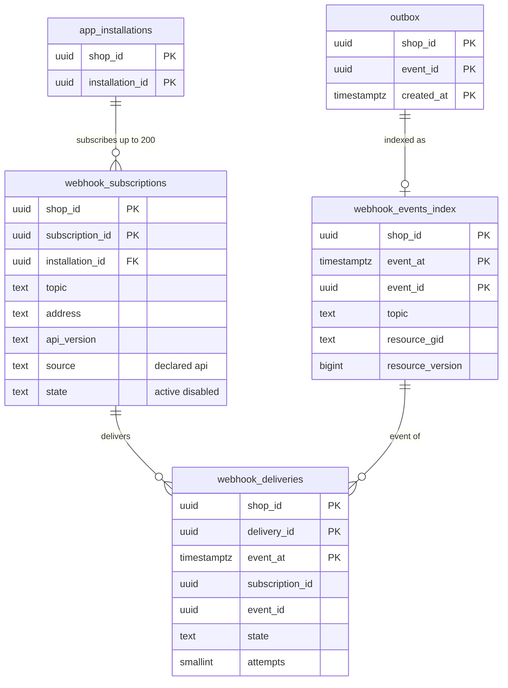

# Data model: Webhook

[data-model.md](../data-model.md) の一部。規約はそちらの 3 節に従う。振る舞いは [webhooks.md](../webhooks.md)（4〜7 節）を正とする。決定は [ADR-0061](../../decisions/0061-webhook-delivery-and-signing.md)（配信と署名）、[ADR-0062](../../decisions/0062-webhook-egress-and-payload-custody.md)（egress と本文の預かり）。本文・ヘッダー・SQS の依頼の形は [stores.md](stores.md) の 5 節。署名の秘密は全体の `apps.webhook_secret_ciphertext`（[apps-and-api.md](apps-and-api.md) の 2.2 節）。

| 表 | 置き場所 | 書く |
| --- | --- | --- |
| `webhook_subscriptions` | ポッド `public` | `admin-api`（API の購読）、`workers`（宣言の購読の展開） |
| `webhook_deliveries` | ポッド `public` | `workers`（fanout、結果の当て） |
| `webhook_events_index` | ポッド `public` | `workers`（fanout） |

- 本文はポッドも全体も保存しない。ポッドは状態だけ、全体の `webhook-dispatcher` は SQS の保持の中で運ぶだけ（[ADR-0062](../../decisions/0062-webhook-egress-and-payload-custody.md)、ADR-0002 の注記）。
- 宣言の購読（アプリのバージョンの `webhook_declarations`）は、導入とバージョンの更新の時に、ショップごとの行（`source = 'declared'`）へ展開する（D-9）。fanout は 1 つの表だけを引く。

## 1. ER 図

- `webhook_deliveries`・`webhook_events_index` は日の分割の表で、外部キーを張らない（`subscription_id`・`event_id` は論理の参照）。
- `outbox` → `webhook_events_index` は同じ `event_id`（`X-<Brand>-Event-Id`）。outbox の行は送った 1 日の後に消えるので論理の参照。

## 2. 表

### 2.1 `webhook_subscriptions`

| 列 | 型 | NULL | 既定 | 説明 |
| --- | --- | --- | --- | --- |
| `shop_id`・`subscription_id` | `uuid` | NOT NULL | `subscription_id` は `uuidv7()` | |
| `installation_id` | `uuid` | NOT NULL | — | |
| `app_id` | `uuid` | NOT NULL | — | 送りのキューの振り分け（アプリのハッシュ） |
| `topic` | `text` | NOT NULL | — | `orders/create` など（[webhooks.md](../webhooks.md) の 4.1 節） |
| `address` | `text` | NOT NULL | — | `https://`、443 だけ（作成の時に検査） |
| `api_version` | `text` | NOT NULL | — | 本文の形。支えを外れたら繰り上げる |
| `filter` | `text` | NULL | — | 512 文字まで |
| `include_fields` | `text[]` | NULL | — | 項目の選択（`id` と `<brand>_version` は常に入れる） |
| `source` | `text` | NOT NULL | — | `declared`・`api` |
| `declared_version_id` | `uuid` | NULL | — | 展開した元のアプリのバージョン |
| `state` | `text` | NOT NULL | `'active'` | `active`・`disabled` |
| `failing_since` | `timestamptz` | NULL | — | 最後の成功の後の最初の失敗 |
| `failed_count` | `integer` | NOT NULL | `0` | `failing_since` からの `failed` の配信の数 |
| `disabled_at` | `timestamptz` | NULL | — | 48 時間・10 件で止める（消さない） |
| `created_at`・`updated_at` | `timestamptz` | NOT NULL | `now()` | |

- キー：PK `(shop_id, subscription_id)`。UK `(shop_id, app_id, topic, address)`（アプリ、ショップ、話題、送り先で一意）。FK → `app_installations`（`ON DELETE CASCADE`）。
- 索引：`(shop_id, topic) WHERE state = 'active'` — fanout の引き。
- CHECK：`source IN (…)`、`state IN (…)`、`address ~ '^https://[^/:]+(:443)?/'`、`state <> 'disabled' OR disabled_at IS NOT NULL`、`char_length(filter) <= 512`。1 つの導入で 200 まで（トリガー）。
- 必須の話題（`customers/data_request`・`customers/redact`・`shop/redact`）は、導入のときにアプリの登録の送り先へ `declared` の行を必ず作る。S1 の量：約 300 万行。

### 2.2 `webhook_deliveries`

配信の状態（本文を持たない）。状態：`pending`・`delivered`・`failed`・`unknown`。

| 列 | 型 | NULL | 既定 | 説明 |
| --- | --- | --- | --- | --- |
| `shop_id` | `uuid` | NOT NULL | — | |
| `delivery_id` | `uuid` | NOT NULL | `uuidv7()` | `X-<Brand>-Webhook-Id`。送り直しで同じ |
| `event_at` | `timestamptz` | NOT NULL | — | 事象の時刻（outbox の `created_at`）。分割の鍵（D-34） |
| `subscription_id` | `uuid` | NOT NULL | — | |
| `event_id` | `uuid` | NOT NULL | — | |
| `topic` | `text` | NOT NULL | — | |
| `app_id` | `uuid` | NOT NULL | — | |
| `state` | `text` | NOT NULL | `'pending'` | |
| `attempts` | `smallint` | NOT NULL | `0` | 1〜9 |
| `next_attempt_at` | `timestamptz` | NULL | — | 依頼の `not_before` |
| `last_status` | `smallint` | NULL | — | HTTP の状態のコード |
| `last_error_code` | `text` | NULL | — | `timeout`・`tls`・`dns`・`redirect`・`blocked_address` |
| `last_latency_ms` | `integer` | NULL | — | |
| `enqueued_at` | `timestamptz` | NULL | — | 全体の SQS に入れた時刻（`pending` の拾い直し） |
| `delivered_at` | `timestamptz` | NULL | — | |
| `created_at` | `timestamptz` | NOT NULL | `now()` | |

- キー：PK `(shop_id, delivery_id, event_at)`。UK `(shop_id, subscription_id, event_id, event_at)`（購読 × 事象で 1 つ。fanout のやり直しは `ON CONFLICT DO NOTHING`。分割の鍵を事象の時刻にしたので、やり直しが日をまたいでも同じ分割に入る）。
- 索引：`(shop_id, subscription_id, created_at)` — `webhookDeliveries` の読み出しと停止の判定。`(enqueued_at) WHERE state = 'pending'` — 1 分ごとの入れ直し（X1 の発見の索引）。
- CHECK：`state IN (…)`、`attempts BETWEEN 0 AND 9`、`state <> 'delivered' OR delivered_at IS NOT NULL`。
- 分割：`event_at` の日。保持：7 日（分割を `DROP`）。S1 の量：約 3,000 万行（7 日分）。

### 2.3 `webhook_events_index`

事象の一覧（照合の一覧、`events(…)` の Admin API。7 日）。本文を持たない。

| 列 | 型 | NULL | 既定 | 説明 |
| --- | --- | --- | --- | --- |
| `shop_id` | `uuid` | NOT NULL | — | |
| `event_at` | `timestamptz` | NOT NULL | — | 分割の鍵 |
| `event_id` | `uuid` | NOT NULL | — | |
| `topic` | `text` | NOT NULL | — | |
| `resource_gid` | `text` | NOT NULL | — | `gid://<brand>/Order/<uuid>` |
| `resource_version` | `bigint` | NOT NULL | — | `<brand>_version` |
| `required_scope` | `text` | NULL | — | 一覧をスコープで絞る |

- キー：PK `(shop_id, event_at, event_id)`。索引：`(shop_id, topic, event_at)` — 話題で絞った一覧。
- 分割：`event_at` の日。保持：7 日。S1 の量：約 1,500 万行（7 日分）。
