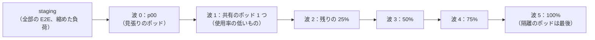
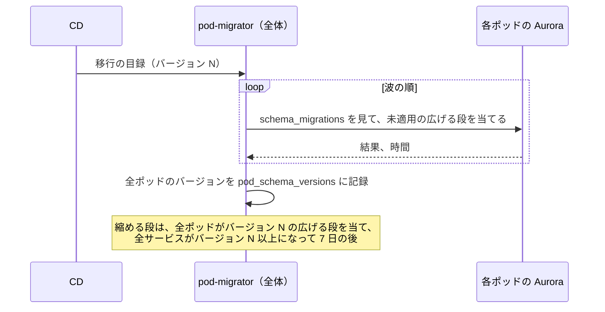

# Delivery: Shopify

CI/CD（TypeScript のサービスと Rust の `function-runner`）、成果物とフラグ、ポッドごとの段階のデプロイと自動のロールバック、全体の面とエッジの関数と WAF の出し方、全ポッドにまたがるスキーマの変更、API のバージョン（四半期）の寿命、テーマの言語（`loom_version`・`loom_ir_version`）と関数の API と Wasmtime のバージョンの出し方を決める。リリースの方針（デプロイとリリースの分け方、時間帯と凍結、自動のロールバックの条件）の正本は [runbooks/](../runbooks/README.md) の 3 節で、この文書はその実装を書く。

| ADR | 決定 |
| --- | --- |
| [0075](../decisions/0075-pod-wave-rollout-and-cross-pod-migrations.md) | デプロイは、staging → 見張りのポッド `p00` → 共有のポッド 1 つ → 残りのポッドを 25% ずつ、の波で出し、各波 30 分の自動のロールバックの条件を見る。スキーマの変更は、広げる段と縮める段に分け、`pod-migrator` が同じ波の順で全ポッドに当てる。縮める段は、全ポッドの全サービスが新しい形だけを使ってから 7 日の後にだけ行う。移し替えは、元と先のスキーマのバージョンが同じときだけ動く |
| [0076](../decisions/0076-api-runtime-version-lifecycles.md) | Admin API・Storefront API・Webhook の本文・関数の API は、同じ四半期の日付のバージョン（`YYYY-MM`）を持ち、12 か月支える。支えを外したバージョンの要求は、支えている最も古いバージョンで答え（繰り上げ）、ヘッダーで知らせる。テーマの言語は `loom_version` を消さずに足し、`loom_ir_version` を上げるときは、公開中のテーマを背景で翻訳し直してから、新しいレンダラーを出す。Wasmtime を上げるときは、全モジュールを翻訳し直し、記録した入力で出力と燃料を比べてから出す |

前提：トランクベース開発と Conventional Commits（[リポジトリ共通の ADR-0002](../../../../docs/decisions/0002-trunk-based-development.md)）、お金・在庫・税の規則をフラグにしない（[AGENTS.md](../../AGENTS.md)）、Admin API の四半期のバージョン（[ADR-0009](../decisions/0009-admin-api-graphql-and-cost-limits.md)）、関数の事前の翻訳と署名（[ADR-0059](../decisions/0059-function-publish-compile-and-distribution.md)）。アカウントと Terraform は [infrastructure.md](infrastructure.md)、品質の関門は [quality.md](../quality.md) にある。

## 1. 変更からマージまで

- `<system>/<YYMMDD-slug>` のブランチ、変更ごとの worktree、PR の CI が緑で Dev のレビュー、`main` へ直接 push しない（リポジトリ共通の ADR-0002）。
- **人がレビューして確定する契約**（[roadmap.md](../roadmap.md) の「契約を先に固定する」）のファイルは、CODEOWNERS でテックリードと QA の承認を要る：チェックアウトの状態と完了の決定表、在庫の不変条件、税の端数処理、割引の組み合わせ、Loom の文法と IR、関数の入出力と上限、Admin API のスキーマの写し（SDL）と費用の指示、Webhook の署名、アダプターの契約、KeyValueStore の値の形（[shops-and-pods.md](shops-and-pods.md) の 5.2 節）、権限の一覧（[merchant-admin-and-staff.md](merchant-admin-and-staff.md) の 5.1 節）。
- 試験のベクトルの期待する値を変える PR は QA の承認を要る（[quality.md](../quality.md) の 2.3 節）。

## 2. CI

### 2.1 PR の CI（必須）

| 段 | TypeScript（サービス、管理画面、エッジの関数） | Rust（`function-runner`） |
| --- | --- | --- |
| 形と静的な検査 | `pnpm lint`、`pnpm typecheck`。lint：`eval`・`new Function`・`vm` の禁止、`SET`（`LOCAL` なし）の禁止、`beginShopTx` の外の書き込みのトランザクションの禁止、パッケージをまたぐ表の書き込みの禁止、監査の行のない変更の禁止、ログの関数の外の出力の禁止 | `cargo fmt --check`、`cargo clippy -D warnings`、`cargo deny`（ライセンス、本家の実装の禁止） |
| 依存の検査 | 本家の Liquid とその移植、本家の SDK・CLI の禁止の一覧（[ADR-0001](../decisions/0001-platform-and-stack.md)）、既知の脆弱性 | 同左 |
| 単体・表駆動・試験のベクトル | Vitest（`--changed`） | `cargo nextest` |
| 性質ベース | fast-check 2,000 試行 | proptest 2,000 試行 |
| 参照の実装・シミュレーター | `inventory-ref`・`tax-ref`・`discount-ref`、`checkout-sim` 1 万の場面（触れたとき） | — |
| ファジング・脱出 | `loom-fuzz` 5 分（`packages/loom` に触れたとき） | `sandbox-escape-suite`（触れたとき） |
| 結合 | Testcontainers（PostgreSQL、Valkey）、LocalStack | 同左 |
| スキーマ | 表の目録の検査（全表に `shop_id`・FORCE RLS・移し替えの対象・削除の対象・保持の区分）、移行の形の検査（5 節） | — |
| API の契約 | 支えている全バージョンの SDL の写しとの比べ（壊す変更の検出）、費用・スコープ・権限の指示の抜けの lint | — |
| エッジの関数 | `fn-route` の大きさ 10 KB 以下、`packages/edge-keys` の試験のベクトル（関数と元で同じ結果） | — |
| 管理画面 | バンドルの大きさ（殻 250 KB・画面 100 KB、gzip）、Lighthouse の予算（[merchant-admin-and-staff.md](merchant-admin-and-staff.md) の 6.1 節） | — |
| IaC | `terraform plan` と OPA・Checkov（[infrastructure.md](infrastructure.md) の 6 節） | — |
| テストの緩和の検出 | 削除・`.skip`・期待値の変更を差分から見つけ、QA の承認を求める | 同左（`#[ignore]`） |
| 要件の追跡 | テスト名の `REQ-*`・`PROP-*`・`DT-*` と spec の照合 | 同左 |

- PR の CI を 20 分以内に収める（Turborepo と sccache のキャッシュ）。

### 2.2 夜間の CI

| 中身 | 規模 |
| --- | --- |
| 性質ベース | 各 20 万試行。在庫は並行度 200・枠 64 |
| `checkout-sim` | 100 万の場面 |
| `loom-fuzz`、`cargo-fuzz` | 各 1 時間 |
| 障害の注入 | 提供者の模型、DB のフェイルオーバー、Valkey の停止、移し替えの各段の停止 |
| 縮めた負荷 | フラッシュセールの場面（[capacity.md](capacity.md) の 8 節の 1/10） |
| E2E | Playwright の全部 |
| Wasmtime の更新の候補 | 新しい Wasmtime で全モジュールの記録した入力を再生（6.4 節） |

## 3. 成果物とフラグ

### 3.1 成果物

| 成果物 | 形 | 置き場所 |
| --- | --- | --- |
| サービスのイメージ | コンテナ（ARM64）、署名（cosign 相当の署名とイメージの digest の固定） | ECR（東京・大阪） |
| 管理画面・テーマの既定の資産 | 内容のハッシュの名前の静的なファイル | S3（`cdn`） |
| エッジの関数 | `fn-route` のコード（バージョンの番号つき） | CloudFront Functions |
| スキーマの移行 | 番号つきの SQL と移行の目録 | イメージに同梱 |
| チェックアウトのスクリプトの目録 | リリースごとの URL とハッシュの一覧（[ADR-0067](../decisions/0067-checkout-script-integrity-and-card-testing.md)） | S3 |
| API のスキーマの写し | バージョンごとの SDL | リポジトリ |

### 3.2 フラグ

- AWS AppConfig。`release.*`（kebab-case、未完成の振る舞い。100% の後 30 日で消す）と `ops.*`（snake_case、運用の止めるだけのスイッチ）。
- `release.*` の対象の絞り込みは、ショップ・ポッド・プランの単位（AppConfig の設定の中のショップの一覧と割合）。割合はショップ ID のハッシュで決める（同じショップは同じ側）。
- お金・在庫・税の規則（引き当ての遷移、チェックアウトの状態の機械、税の計算、割引の適用の順序）はフラグにしない（[AGENTS.md](../../AGENTS.md)）。コードのバージョンとして出し、正しさの見張り（[observability.md](observability.md) の 5 節）で見る。
- AppConfig の設定の変更も、波（4.1 節）と同じ順で出す（AppConfig のデプロイの方針：段階の割合と見張りのアラームでの戻し）。

## 4. デプロイ

ADR-0075。デプロイの承認は Ops（作成者と別の人）。時間帯と凍結は [runbooks/](../runbooks/README.md) の 3.1 節。

### 4.1 ポッドの波

- 各波の後に 30 分（波 0 は 60 分）、自動のロールバックの条件（4.4 節）を見る。条件に当たれば、その波を戻し、後の波を止める。
- **隔離のポッド**は最後の波に置く。予定したセールの前後 24 時間は、そのポッドを波から外す（凍結。[runbooks/](../runbooks/README.md) の 3.1 節）。
- ポッドの中の順（[runbooks/](../runbooks/README.md) の 3 節）：移行（広げる段）→ `workers`・`relay` → `checkout`・`admin-api`・`storefront-api` → `storefront-renderer`。サービスは ECS のローリング（最小の健全 100%、最大 200%）と、ALB のターゲットの健全の確かめ。
- 1 つのデプロイの全体の時間は、S1（6 ポッド）で 4〜5 時間。S2 からは、波の中のポッドを並行に出す（25% ずつのまま）。
- 古いバージョンと新しいバージョンが同時に動く（ポッドの間、ポッドの中のローリングの間）。全体の面とポッドの間の事象（SNS・SQS の本文）と API は、1 つ前のバージョンと互換に保つ（読む側を先に出す）。

### 4.2 全体の面

- 全体の面のサービスは、staging → 本番（ローリング）で、ポッドの波の前に出す（ポッドが新しい全体の API を使うことがあるため。読む側が先）。
- `identity`・`shop-directory`・`edge-router` は、ブルー・グリーン（ALB のターゲットグループの重みを 10% → 50% → 100%、各 15 分）。

### 4.3 エッジの関数と WAF

- マルチテナントの配信は CloudFront の継続のデプロイ（ステージングの配信）を使えない（[Multi-tenant distributions](https://docs.aws.amazon.com/AmazonCloudFront/latest/DeveloperGuide/distribution-config-options.html) の「Unsupported features」、2026-10-10 に確認）。そこで、見張りの配信 `mtd-canary`（見張りのショップの独自のドメインのテナントだけを持つマルチテナントの配信）に新しい `fn-route` を先に出し、`canary` の全見張り（[observability.md](observability.md) の 5.1 節）が 60 分緑なら、`mtd-storefront` に出す。
- 関数は CloudFront Functions の `DEVELOPMENT` の段で試験の API（試験のベクトルの要求）を通してから `LIVE` にする。
- 関数の戻しは、前のバージョンのコードを `LIVE` に出し直す（数分。**未検証**の伝わりの時間）。
- WAF の規則は、新しい規則を `Count` の動作で 24 時間出し、誤検出を見てから `Block`・`Challenge` にする。

### 4.4 自動のロールバック

[runbooks/](../runbooks/README.md) の 3 節の条件を、波ごとの新旧の比べで判定する。

| 条件 | 判定（波の 30 分、新しいバージョンのポッド） |
| --- | --- |
| チェックアウトの 5xx | 前の波の前の 1 時間の 2 倍、かつ 0.1% 以上 |
| 確定の p99 | 2 秒以上 |
| 在庫の照合の不一致、重複の注文、決済済みで注文なしの増加 | 1 件 |
| ストアフロントの 5xx | 2 倍、かつ 0.1% 以上 |
| テンプレートの上限の超過 | 2 倍 |
| 関数の失敗（本システムの原因） | 0.01% 以上 |
| 鍵の材料の不一致（[storefront-api-and-caching.md](storefront-api-and-caching.md) の 10 節） | 1 件 |

- ロールバック：まずフラグで戻す。次に 1 つ前のイメージ（移行は広げる段だけなので、前のバージョンが今の DB で動く）。

### 4.5 `function-runner`

- `checkout` のタスクの隣のコンテナなので、`checkout` と同じ波で出る。Wasmtime のバージョンを変えるデプロイは、6.4 節の手順の後にだけ出す。
- セキュリティの修正の Wasmtime の更新は、7 日以内（[ADR-0008](../decisions/0008-extension-sandbox-wasm.md)）。凍結の間も、修正として出せる。

## 5. スキーマの変更

ADR-0075。

### 5.1 広げる段と縮める段

| 段 | 許す変更 | 当てる時 |
| --- | --- | --- |
| 広げる | 表・列の追加（null を許すか既定の値）、索引の追加（`CREATE INDEX CONCURRENTLY`）、制約の追加（`NOT VALID` → 後で `VALIDATE`）、新しい列への書き込みの開始 | デプロイの最初（波ごと） |
| 埋める | 既存の行の新しい列の埋め（ショップごとに 1 万行ずつ、夜間、DB の負荷で速さを下げる） | `workers` の作業。全ポッドで終わったことを `pod-migrator` が記録 |
| 縮める | 列・表の削除、古い列への書き込みの停止、制約の厳しくする変更 | 全ポッドの全サービスが新しい形だけを使い、7 日たってから |

- 移行の文は `lock_timeout = 2s`・`statement_timeout = 15min` で当て、ロックを取れなければ再試行する（5 回、指数の待ち）。テーブルの書き換えの要る変更（列の型の変更）は、新しい列を足して埋め、切り替える形にする。
- 新しい表は、`shop_id` を主キーの先頭に、FORCE RLS とポリシー、移し替えの対象、削除の対象、保持の区分を、同じ移行の中で持つ（CI の表の目録の検査）。

### 5.2 `pod-migrator`

- 移行は全体の `pod-migrator` が、ポッドごとの DB の移行のロール（表の持ち主）で当てる。アプリのロールは DDL を持たない。
- 全体の Aurora の移行は、`pod-migrator` が先に当てる（全体の面のデプロイの前）。
- **移し替えとの関係**：`shop-mover` は、元と先のポッドの `pod_schema_versions` が同じときだけ移し替えを始め、移し替えの間、両方のポッドの移行を止める（移行の文が公開の表を変えないように）。
- ポッドの追加（[infrastructure.md](infrastructure.md) の 6 節）は、今のバージョンまでの移行を全部当ててから `accepting` にする。

## 6. バージョンの出し方

ADR-0076。

### 6.1 一覧

| もの | 形 | 寿命 | 変え方 |
| --- | --- | --- | --- |
| Admin API | `YYYY-MM`（1・4・7・10 月） | 12 か月 | スキーマの変換の層（[ADR-0009](../decisions/0009-admin-api-graphql-and-cost-limits.md)） |
| Storefront API | 同じ日付 | 12 か月 | 同上 |
| Webhook の本文 | 購読の API のバージョン | 同上 | 本文はそのバージョンのスキーマで作る（[webhooks.md](webhooks.md)） |
| 関数の API（入力のスキーマと出力の形） | 同じ日付 | 12 か月 | 種類ごとのスキーマ（[functions-sandbox.md](functions-sandbox.md)） |
| `loom_version`（言語の意味） | 整数 | 消さない | 新しい振る舞いは新しい番号で足す（[ADR-0007](../decisions/0007-theme-language-design.md)） |
| `loom_ir_version`（IR の形） | 整数 | レンダラーは今と 1 つ前を読む | 6.3 節 |
| Wasmtime | 固定のバージョンと設定のハッシュ | 2 つを並べる間だけ | 6.4 節 |

### 6.2 API の四半期の寿命

| 時期 | 中身 |
| --- | --- |
| リリースの 3 か月前 | リリースの候補（`YYYY-MM-rc`）を開発者に出す。SDL の差分と移行の案内 |
| リリース | 安定。新しい機能はこのバージョンから |
| リリースの 9 か月後 | 非推奨：応答に `X-<Brand>-Api-Version-Deprecated`、開発者に知らせ、使っているアプリとショップの一覧を開発者の画面に出す |
| リリースの 12 か月後 | 支えを外す。そのバージョンの要求は、支えている最も古いバージョンで答え（繰り上げ）、`X-<Brand>-Api-Version` に実際のバージョンを返す |

- 同じ時に支えるバージョンは 4〜5。変換の層は、支えている各バージョンの SDL の写しを契約の試験で固定する。
- 本家のバージョンの寿命と繰り上げの振る舞いは、ここでは公式の資料で確かめていない（**未検証**）。

### 6.3 テーマの言語

- `loom_version`：テーマの `theme.json` に書く。新しいフィルター・タグ・意味の変更は新しい番号で足し、古い番号の振る舞いを試験のベクトルで固定したまま残す。テーマは事業者が番号を上げるまで古い意味で動く。
- `loom_ir_version`：レンダラーは今の番号と 1 つ前の番号の IR を読む。IR の形を上げるときの順：
  1. 新しい翻訳器と、両方の IR を読むレンダラーを出す（全ポッドの波）。
  2. 背景の作業が、公開中と予約の公開のテーマのバージョンを新しい IR に翻訳し直す（ショップごと、夜間、`theme_versions.ir_s3_key` を足す）。翻訳し直した IR で、記録した要求の抜き取りを描き、出力と歩数を古い IR と比べる（一致しなければ止めて Dev に知らせる）。
  3. 全ポッドで翻訳し直しが終わったら、古い IR を読まないレンダラーを出す。
- 編集の画面の下書きは、開いた時に翻訳し直す。

### 6.4 関数の API と Wasmtime

- 関数の API のバージョンは関数ごとに公開の時に固定し、12 か月支える。支えを外すときは、開発者に新しいバージョンでの公開を求め、外した後は、その関数を「失敗」の扱い（種類ごとの効果なし。[ADR-0008](../decisions/0008-extension-sandbox-wasm.md)）にする前に、事業者と開発者に 90 日前から知らせる。
- Wasmtime を上げるときの順（[ADR-0059](../decisions/0059-function-publish-compile-and-distribution.md)）：
  1. 新しい Wasmtime で全モジュールを翻訳し直し、署名し、Wasmtime のバージョンのキーで S3 に並べて置く。
  2. 記録した入力（関数ごとに最大 100、事業者の同意の範囲。個人のデータを除く）で、新旧の出力と燃料を比べる。出力の違いは 0 であること。燃料の違いが上限の 10% を超える関数、新しいバージョンで上限を超える関数は、開発者に知らせ、移行を止めるか Dev が判断する。
  3. 新しい `function-runner` を `checkout` の波で出す。波の間、古いポッドは古いキー、新しいポッドは新しいキーを読む。
  4. 全ポッドの後、古いキーの機械語を 90 日残して消す。

## 7. ホットフィックス

- 修正だけの PR は、同じ CI を通し、波 0 → 波 1 の後、残りを 1 つの波で出せる（Ops の判断）。凍結の間も出せる。
- お金・在庫・注文の不一致の修正は、修正の後に正しさの見張りの照合をやり直し、0 を確かめる。

## 8. 指標

| 指標 | 目標 |
| --- | --- |
| PR の CI の時間 | p90 20 分 |
| マージからポッドの全部までの時間 | 平日の 1 日の中 |
| 変更の失敗の割合（ロールバック・ホットフィックス） | 5% 未満 |
| 自動のロールバックの検出から戻りまで | 10 分 |
| `release.*` の 100% の後 30 日を超えて残るフラグ | 0 |

## 9. テストと性質

- **PROP-DLV-001（移行の互換）**：任意の広げる段の移行について、1 つ前のバージョンのサービスの全結合テストが、移行の後の DB で緑（前のバージョンが今の DB で動く）。
- **PROP-DLV-002（API の繰り上げ）**：支えを外したバージョンの任意の有効なクエリが、繰り上げの先のバージョンで、型の誤りでなく答えるか、決めたエラー（`VERSION_RETIRED_FIELD`）を返す。
- **PROP-DLV-003（IR の翻訳し直し）**：任意のテンプレートと値で、新旧の IR の出力と歩数が同じ（[storefront-themes.md](storefront-themes.md) の性質と同じ試験のベクトル）。
- 波の試験（staging）：わざと壊したイメージ（チェックアウトの 5xx、照合の不一致）で、波 0 で止まり、戻る。

## 10. Story の候補

| Epic | Story | 中身 |
| --- | --- | --- |
| E1 | `ci-pipeline-baseline` | 2 節 |
| E1 | `flags-appconfig` | 3.2 節 |
| E1 | `pod-wave-deploy` | 4.1・4.4 節（ADR-0075） |
| E1 | `pod-migrator` | 5 節（ADR-0075。PROP-DLV-001） |
| E12 | `edge-function-canary-distribution` | 4.3 節 |
| E14 | `api-version-lifecycle` | 6.2 節（ADR-0076。PROP-DLV-002） |
| E11 | `loom-ir-retranslation` | 6.3 節（ADR-0076。PROP-DLV-003） |
| E15 | `wasmtime-upgrade-pipeline` | 6.4 節（ADR-0076） |

## 11. 未解決の問い

### 決定（2026-10-10、既定案）

- **波**：staging → `p00` → 1 ポッド → 25% ずつ、隔離のポッドは最後（ADR-0075）。
- **移行**：広げる・埋める・縮める、縮めるは 7 日の後、`pod-migrator`、移し替えは同じバージョンの間だけ（ADR-0075）。
- **API**：四半期、12 か月、繰り上げ（ADR-0076）。
- **Loom**：`loom_version` は足すだけ、IR は翻訳し直してから（ADR-0076）。
- **Wasmtime**：全モジュールの翻訳し直しと記録した入力の比べ（ADR-0076）。
- **エッジの関数**：見張りの配信 `mtd-canary` を先に。

### 持ち越し

| 問い | いつ・どう決めるか |
| --- | --- |
| エッジの関数の `LIVE` の伝わりの時間と戻しの時間 | `edge-cache-generation-poc` と同じ測り方（**未検証**） |
| 本家の API のバージョンの寿命と繰り上げ | 公式の資料で確かめる（**未検証**） |
| 関数の記録した入力の同意の範囲 | **法務の確認待ち：L3** |

## 12. data-model への項目

| 表・置き場所 | 中身 | 節 |
| --- | --- | --- |
| `schema_migrations`（各ポッド・全体） | 適用した移行の番号、段、時刻 | 5 |
| `pod_schema_versions`（全体） | ポッドごとのバージョン、広げる段・縮める段の状態 | 5.2 |
| `deployments`（全体） | デプロイ、波、ポッドごとの結果、ロールバック | 4 |
| `api_versions`（全体） | バージョン、リリース・非推奨・支えを外す日 | 6.2 |
| `theme_versions` に足す列 | 翻訳し直しの IR の S3 のキーと比べの結果 | 6.3 |
| S3 | `functions/<app>/<version>/<wasmtime>/<module>.cwasm` | 6.4 |

## 出典

いずれも 2026-10-10 に確認。

- AWS, [Understand how multi-tenant distributions work](https://docs.aws.amazon.com/AmazonCloudFront/latest/DeveloperGuide/distribution-config-options.html)：マルチテナントの配信は継続のデプロイを使えない
- AWS, [AWS AppConfig deployment strategies](https://docs.aws.amazon.com/appconfig/latest/userguide/appconfig-creating-deployment-strategy.html)
- PostgreSQL, [CREATE INDEX](https://www.postgresql.org/docs/18/sql-createindex.html)（`CONCURRENTLY`）、[ALTER TABLE](https://www.postgresql.org/docs/18/sql-altertable.html)（`NOT VALID`）
