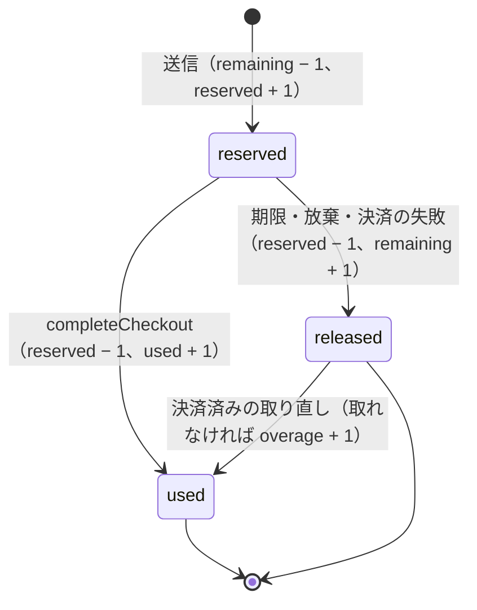

# Discounts Engine: Shopify

割引のエンジンを決める。割引の種類と対象、条件、組み合わせとスタックの規則、適用の順序、按分と端数、税込みの価格での計算、使用の回数の上限、自動の割引、関数の割引との合わせを扱う。

前提となる決定は次のとおり。

- 割引の計算は決定的にする。同じカート・同じ割引の集まりから、同じ結果（適用の順序、按分、端数の割り振り）を出す（[AGENTS.md](../../AGENTS.md)、[quality.md](../quality.md) の 2.2.1 節 C）
- 金額は税込みの整数の最小単位。税は税率ごとに 1 回だけ丸める（`taxes-and-invoices.md`。法務の確認待ち L4）
- 関数の割引は WebAssembly の砂場で提案を作り、失敗は「その関数の割引なし」（[ADR-0008](../decisions/0008-extension-sandbox-wasm.md)）
- 全体の上限つきのコードの回数は、在庫と同じ枠の方式（[ADR-0005](../decisions/0005-checkout-state-machine-and-exactly-once-orders.md)）
- 結果は価格の写しに入る（[cart-and-checkout.md](cart-and-checkout.md) の 6 節）

この文書で決めたことは次の ADR にある。

| ADR | 決定 |
| --- | --- |
| [0032](../decisions/0032-discount-classes-order-and-combination.md) | 商品・注文・送料の 3 つの種別、商品 → 注文 → 送料の順。両立は印の両側の一致。買い手の割引の合計が最大の集まりを、決めた探索と同点の規則で選ぶ |
| [0033](../decisions/0033-discount-allocation-and-rounding.md) | 税込みの整数。商品の率は行で 1 回、注文の率は小計で 1 回切り捨て。按分の端数は行の額の大きい順、単位は番号の小さい順。単位ごとの支払いの額を残す |
| [0034](../decisions/0034-discount-usage-counters.md) | 使用の回数は在庫と同じ形の数え上げ（枠つき）で、送信で引き当て、完了で確定、期限で戻す |

## 1. 範囲

- 扱う：
  - 割引の種類（額、率、送料無料、まとめ買い）、対象（商品、コレクション、注文の全体、送料）
  - 条件（期間、最低の金額・数、買い手の区分）
  - コードと自動の割引
  - 組み合わせの規則と選び方、適用の順序
  - 計算、按分、端数
  - 使用の回数の上限（全体、買い手ごと）
  - 関数の割引の提案の合わせ
- 扱わない：
  - 税額の計算（`taxes-and-invoices.md`）。ここでは税率ごとの対価を渡すまで
  - 関数の入出力と砂場（`functions-sandbox.md`）
  - 割引の表示の文言と条件（法務の確認待ち L2。storefront-themes の領域）
  - ギフトカード・ポイント（MVP の後。法務の確認待ち L5）
  - 返品のときの割引の扱い（[returns-and-refunds.md](returns-and-refunds.md) の 5 節。取り戻さない）

## 2. 要件

| 要件 | 目標 | NFR |
| --- | --- | --- |
| 正しさ | 割引の按分・合計の、参照の計算 `discount-ref` との差 0 円 | NFR-013、K6 |
| 決定性 | 割引の入力の順序・ハッシュの表の順序に依らず同じ結果 | quality.md の 2.2.1 節 C |
| 速さ | カート 250 行・候補の割引 30 で、割引の計算 p99 100ms（関数の時間を除く） | NFR-001 |
| 上限の正しさ | 使用の回数の上限を、決済済みの取り直しの失敗を除いて超えない | 9 節 |

## 3. 本家の形（確かめたこと）

[Discount combinations](https://help.shopify.com/en/manual/discounts/discount-combinations)（2026-10-10 に確認）：

- 商品の割引 → 注文の割引 → 送料の割引の順に適用する。注文の割引は商品の割引の後の小計に掛かる。
- 注文の率の割引は、それぞれ元の小計で計算する（10% と 20% は合わせて 30%）。率と額の注文の割引を組み合わせると、率が先、額が後。
- 送料の割引は 1 つの注文に 1 つだけ。
- 組み合わせの可否は種別の組で決まり、一部（商品と注文、注文と注文）は条件を満たすショップだけ、同じ行への複数の商品の割引は Plus だけ。
- 自動の割引はアプリの割引を含めて有効なもの 25 まで。1 つの注文のコードは、商品・注文の割引 5 つ、送料の割引 1 つまで。
- 両立しない割引の候補のうちどれを選ぶか、按分の端数の規則は、確かめられなかった（**未検証**）。

本家との違い（本システムの選択）：

| 項目 | 本家 | 本システム |
| --- | --- | --- |
| 同じ行に複数の商品の割引 | Plus のショップだけ | MVP は持たない（1 行 1 つ） |
| 別の行の商品の割引どうし | 組み合わせの設定に従う（未検証） | 常に両立 |
| 組み合わせの可否の条件 | ショップの条件による | すべてのショップで同じ規則 |

## 4. 割引の定義

### 4.1 種類

| 種類 | 種別 | 値 | 対象 |
| --- | --- | --- | --- |
| `amount_off_product` | `product` | 額（単位あたり・行あたり）か率 | 商品・バリエーション・コレクション |
| `buy_x_get_y` | `product` | X の数（か額）と、Y の数と率（100% で無料） | X と Y の商品・コレクション |
| `amount_off_order` | `order` | 額か率 | 注文の全体（対象の商品の絞り込みあり） |
| `free_shipping` | `shipping` | 無料、額、率 | 送料（配送の方法の絞り込み、送料の上限） |
| `app_function` | 関数の型で決まる | 関数の提案 | 関数の提案（[ADR-0008](../decisions/0008-extension-sandbox-wasm.md)） |

### 4.2 共通の属性

- `discount_id`（UUIDv7）、`version`（変更のたびに +1。写しは `id@version` を持つ）、方式（`code`・`automatic`）、コード（ショップの中で一意、大文字小文字を区別しない）。
- 期間（`starts_at`・`ends_at`）、状態（`active`・`scheduled`・`expired`・`disabled`）。
- 条件：最低の金額（税込み）か最低の数、買い手の区分（すべて、ログインした買い手のタグ。MVP）。
- 組み合わせの印 `combines_with ⊆ {product, order, shipping}`。
- 使用の回数の上限：全体（なし・N 回）、買い手ごと（なし・1 回・N 回）。

## 5. 組み合わせと選び方（[ADR-0032](../decisions/0032-discount-classes-order-and-combination.md)）

### 5.1 両立の決定表 DT-DSC-001

| # | 割引 a | 割引 b | 条件 | → 両立 |
| --- | --- | --- | --- | --- |
| 1 | `product` | `product` | 同じ行が対象 | いいえ（行ごとに 1 つ） |
| 2 | `product` | `product` | 対象の行が重ならない | はい |
| 3 | `product` | `order` | `order ∈ a.combines_with` かつ `product ∈ b.combines_with` | はい |
| 4 | `product` | `order` | 上のどちらかが成り立たない | いいえ |
| 5 | `order` | `order` | 両方が `order` を含む | はい |
| 6 | `order` | `order` | どちらかが含まない | いいえ |
| 7 | `product`・`order` | `shipping` | 両側の印が互いの種別を含む | はい |
| 8 | `product`・`order` | `shipping` | どちらかが含まない | いいえ |
| 9 | `shipping` | `shipping` | — | いいえ（1 つだけ） |
| 10 | 関数の提案 | 任意 | 関数の割引の定義の種別と印で 1〜9 を当てる | 1〜9 に従う |

- 1 つの割引の集まりは、すべての組が両立するときだけ使える。

### 5.2 選び方

```
candidates = 有効な自動の割引（≤ 25）∪ 入力したコード（商品・注文 ≤ 5、送料 ≤ 1）∪ 関数の提案
  → 期間・状態・買い手の区分・対象の行の有無で絞る（最低の条件は 5.3 節で、適用の直前に見る）
orderCands = order 種別の候補を、単独で適用したときの額の大きい順に上位 8（同じ額は ID の昇順）
shipCands  = shipping 種別の候補の上位 2 と「なし」
for S ⊆ orderCands（S の中が両立）:
  for sh ∈ shipCands（S と両立）:
    行ごとに、S ∪ {sh} と両立する product の候補のうち、その行の額が最大のもの（同じ額は ID の昇順）
    6 節の順で計算する。条件を満たさない割引を含む計画は捨てる
    score = 商品・注文・送料の割引の合計
best = score が最大。同じなら割引の数が少ない方。同じなら、ID を昇順に並べた列の辞書順で小さい方
```

- 計画の数は最大 `2^8 × 3 = 768`。行 250 で、1 計画あたり行の数に比例する計算になる。
- 条件を満たさない割引を含む計画を捨てても、それを除いた部分集合の計画が別にあるので、漏れない。
- 行ごとに最大の商品の割引を選ぶのは、商品の割引 `x` を増やすと、注文の率の割引が `p × x` だけ減るが、`p < 1` なので合計は増えるため。送料の無料の閾値をまたぐときは、計画ごとに計算するので、閾値を割る選択も比べられる。
- 参照の実装 `discount-ref` は、割引 6 つまでで、すべての部分集合（行ごとの商品の割引の選び方を含む）を並べて評価する。性質 PROP-DSC-004 で一致を確かめる。

### 5.3 条件の判定の時点

| 割引 | 最低の金額・数を見る小計 |
| --- | --- |
| `product`（最低の数・金額） | 対象の行の元の価格の小計 |
| `order` | 商品の割引の後の、対象の行の小計 |
| `shipping` | 注文の割引の後の、商品の小計 |

## 6. 適用の順序と計算（[ADR-0033](../decisions/0033-discount-allocation-and-rounding.md)）

すべて税込みの円。`floor` は 0 への切り捨て（値は 0 以上）。

1. **商品の割引**（行ごと）
   - 率：`floor(行の合計 × 率)`。行の合計 = 単価 × 数。
   - 額（単位あたり）：`min(額 × 数, 行の合計)`。額（行あたり）：`min(額, 行の合計)`。
   - まとめ買い：Y の対象の単位を、単価の安い順（同じなら行の ID、単位の番号の順）に Y の数だけ選び、選んだ単位ごとに `floor(単価 × 率)` を足す。
2. **注文の率の割引**：対象の行の、商品の割引の後の小計 `S1` に対し、各率 `p_i` で `floor(S1 × p_i)` を計算して足す。合計は `S1` を超えない。
3. **注文の額の割引**：率の後の残り `S1 − 率の額` を上限に、額を引く（複数なら ID の昇順に）。
4. **注文の割引の按分**：7 節。
5. **送料の割引**：送料（[orders-and-fulfillment.md](orders-and-fulfillment.md) の 6 節の額）に対し、無料・額・率（`floor`）。送料の割引は送料にだけ掛かり、商品の行に按分しない。

## 7. 按分と端数

### 7.1 行への按分

注文の割引の合計 `D` を、対象の行の額 `a_i`（商品の割引の後）の比で配る。

```
base_i = floor(D × a_i / Σa)
r = D − Σbase_i                 （0 ≤ r < 行の数）
行の額 a_i の大きい順（同じなら行の ID の昇順）に、先頭の r 行へ 1 ずつ足す
```

### 7.2 単位への按分

行の割引の額 `d`（商品の割引と、注文の割引の按分の、それぞれ別に）を、数 `n` の単位へ配る。

```
各単位に floor(d / n)、余り d mod n を、単位の番号 1, 2, ... の順に 1 ずつ足す
paid_k = 単価 − product_discount_k − order_discount_k
```

- 単位ごとの 3 つの値を、写しと注文の行に残す（[cart-and-checkout.md](cart-and-checkout.md) の 6.2 節）。返金はこの値から決まる（[returns-and-refunds.md](returns-and-refunds.md) の 5 節）。

### 7.3 税率ごとの対価

- 税率ごとの対価 = その税率の単位の `paid` の和 ＋（10% の）送料と手数料（割引の後）。
- 税額は、税率ごとの対価から 1 回だけ丸める（`taxes-and-invoices.md`）。割引は対価を通して税額に効く。税額の側で割引を按分し直さない。

## 8. 例：組み合わせ、丸め、税込みの価格

### 8.1 カートと割引

| 行 | 品目 | 単価（税込み） | 数 | 税率 | 行の合計 |
| --- | --- | --- | --- | --- | --- |
| L1 | T シャツ | 3,300 | 2 | 10% | 6,600 |
| L2 | 焼き菓子 | 1,080 | 3 | 8% | 3,240 |
| L3 | マグ | 2,200 | 1 | 10% | 2,200 |
| | | | | 小計 | 12,040 |

配送の方法 `standard` の送料 880 円（10%）。

| 割引 | 種別 | 方式 | 中身 | `combines_with` |
| --- | --- | --- | --- | --- |
| D1 | `product` | 自動 | T シャツ 15% | `order`、`shipping` |
| D2 | `order` | コード | 1,000 円引き（10,000 円以上） | `product`、`shipping` |
| D3 | `order` | 自動 | 8% 引き | `product`、`shipping` |
| D4 | `shipping` | 自動 | 送料無料（10,000 円以上） | `product`、`order` |

D2 と D3 は、どちらも `order` を含まないので両立しない（DT-DSC-001 の行 6）。

### 8.2 計画の比べ

| 計画 | 商品 | 注文 | 送料 | 合計 |
| --- | --- | --- | --- | --- |
| {D1, D2, D4} | 990 | 1,000 | 880 | **2,870** |
| {D1, D3, D4} | 990 | 884 | 880 | 2,754 |
| {D1, D2} | 990 | 1,000 | 0 | 1,990 |
| {D1, D3} | 990 | 884 | 0 | 1,874 |
| {D1, D4} | 990 | 0 | 880 | 1,870 |

→ {D1, D2, D4} を選ぶ。D2 が 800 円引きなら、{D1, D2, D4} は 2,670 で、{D1, D3, D4} の 2,754 が選ばれる。

### 8.3 計算

1. D1：L1 `floor(6,600 × 0.15) = 990`。単位へ 495・495。
2. 商品の割引の後：L1 5,610、L2 3,240、L3 2,200。`S1 = 11,050`（D2 の条件 10,000 以上を満たす）。
3. D2 の按分（`D = 1,000`）：

| 行 | `a_i` | `1,000 × a_i / 11,050` | `base` | 端数の配り | 按分 |
| --- | --- | --- | --- | --- | --- |
| L1 | 5,610 | 507.69 | 507 | +1（額が最大） | 508 |
| L2 | 3,240 | 293.21 | 293 | | 293 |
| L3 | 2,200 | 199.09 | 199 | | 199 |
| 計 | 11,050 | | 999 | `r = 1` | 1,000 |

4. 単位への按分：L1 は 508 → 254・254。L2 は 293 → 98・98・97（余り 2 を単位 1・2 へ）。L3 は 199。
5. 単位の支払いの額：L1 2,551・2,551、L2 982・982・983、L3 2,001。
6. D4 の条件：注文の割引の後の商品の小計 `11,050 − 1,000 = 10,050 ≥ 10,000` → 送料 880 円を 0 円に。
7. 税率ごとの対価：10% は `2,551 × 2 + 2,001 = 7,103`、8% は `982 + 982 + 983 = 2,947`。合計 10,050 円。
8. 税額（税率ごとに 1 回、切り捨て。方法はショップの設定、法務の確認待ち L4）：10% `floor(7,103 × 10 / 110) = 645`、8% `floor(2,947 × 8 / 108) = 218`。

### 8.4 丸めの時点で変わる額

| 比べ | 本システムの規則 | 別の規則 | 差 |
| --- | --- | --- | --- |
| D3（8%）を注文で 1 回か、行ごとか | `floor(11,050 × 0.08) = 884` | 行ごと：`floor(5,610 × 0.08) + floor(3,240 × 0.08) + floor(2,200 × 0.08) = 448 + 259 + 176 = 883` | 1 円 |
| 10% の税を税率ごとに 1 回か、行ごとか | `floor(7,103 / 11) = 645` | 行ごと：`floor(5,102 / 11) + floor(2,001 / 11) = 463 + 181 = 644` | 1 円 |

- どちらも、本システムは「1 回だけ丸める」側を使う。表示した割引の率と額、インボイスの税額が、合計から計算し直した値と一致する。

## 9. 使用の回数（[ADR-0034](../decisions/0034-discount-usage-counters.md)）



- 全体の上限：`discount_usage_slots` の `remaining` を `CHECK (remaining >= 0)` で守る。枠は既定 1、セールの準備で 16（[flash-sales-and-queueing.md](flash-sales-and-queueing.md) の 4 節）。枠の選び方は在庫と同じ（[inventory-and-reservations.md](inventory-and-reservations.md) の 6.2 節）。
- 買い手ごとの上限：`discount_customer_usage`（買い手の鍵のハッシュ）の `reserved + used ≤ 上限`。
- 戻しは在庫の掃除と同じトランザクション（[inventory-and-reservations.md](inventory-and-reservations.md) の 5.4 節）。
- 送信で上限に当たったら、その割引を外して写しを作り直し、`409 discount_unavailable` と新しい写しを返す。買い手は新しい金額を確かめてから送信する。
- 注文の取り消し・返品で、使用の回数を戻さない（本システムの既定。本家は**未検証**）。

## 10. 関数の割引との合わせ

1. `checkout` が関数の入力（入力のクエリで決めたカートの値）を作り、`function-runner` で動かす。
2. 提案を検証する：対象の行がカートにある、額が 0 以上で行の額以下、率が 0〜100%、種別が関数の割引の定義と一致。外れた提案は捨て、関数のログに理由を書く。
3. 通った提案を、関数の割引の定義の `discount_id`・種別・`combines_with` を持つ候補として 5.2 節に入れる。
4. 関数の失敗・上限の超過・1 段の予算（50ms）の超過は「その関数の割引なし」。
- 関数の提案の額は、関数の出力の値をそのまま使い、本システムで丸め直さない（整数の円で返させる）。

## 11. 表示

- 写しは、適用した割引の名前・額と、行ごとの割引を持つ。画面は写しの値をそのまま出す。
- 割引の前の価格（二重価格）と、割引の表示の条件は法務の確認待ち（L2）。本システムは値を返し、文言と出し方は storefront-themes の領域で、L2 の後に決める。

## 12. 障害のときの振る舞い

| 障害 | 影響 | 振る舞い |
| --- | --- | --- |
| 関数の失敗 | 関数の割引が付かない | 10 節。チェックアウトは続く |
| 割引の定義の変更（確認と送信の間） | 写しと違う | 送信でバージョンを確かめ、409 と新しい写し（[cart-and-checkout.md](cart-and-checkout.md) の 6 節） |
| 数え上げの枠の熱い行 | 送信の遅れ | 枠 16、`lock_timeout` 100ms で次の枠 |
| 候補が多すぎる（注文の割引 9 以上） | 9 番目以降を選ばない | 事業者の画面で警告。決定性は保つ |

## 13. 上限

| 対象 | 値 |
| --- | --- |
| 有効な自動の割引 | 25（アプリの割引を含む） |
| 1 注文のコード | 商品・注文 5、送料 1 |
| 選び方の注文の割引の候補、送料の候補 | 8、2 |
| ショップの割引の定義 | 2 万（有効と予定の合計） |
| コードの数（1 つの割引） | 10 万（一括の作成） |
| 使用の回数の枠 | 1〜16 |

## 14. data-model への項目

| 表・置き場 | 中身 | 主キー・索引 | 節 |
| --- | --- | --- | --- |
| `discounts` | 種類、種別、方式、値、対象、条件、期間、状態、`combines_with`、上限、`version` | `(shop_id, discount_id)`、`(shop_id, status, starts_at)` | 4 |
| `discount_versions` | 定義のバージョンの写し（写しが参照する） | `(shop_id, discount_id, version)` | 4.2 |
| `discount_codes` | コード（正規化）、割引 | `(shop_id, code_normalized)` 一意 | 4.2 |
| `discount_targets` | 対象の商品・バリエーション・コレクション | `(shop_id, discount_id, target_type, target_id)` | 4.1 |
| `discount_usage_slots` | `remaining`、`reserved`、`used`、`overage` | `(shop_id, discount_id, slot_no)` | 9 |
| `discount_customer_usage` | 買い手の鍵のハッシュ、`reserved`、`used` | `(shop_id, discount_id, customer_key_hash)` | 9 |
| `checkout_discount_reservations` | チェックアウト、試行、割引、枠、状態、期限 | `(shop_id, checkout_id, attempt, discount_id)` | 9 |
| `discount_usage_totals` | 上限なしの割引の使用の数（非同期） | `(shop_id, discount_id)` | 9 |

## 15. テスト

- **PROP-DSC-001（決定性）**：候補の入力の順序・行の順序を入れ替えても、選ぶ割引・行ごと・単位ごとの額が同じ。
- **PROP-DSC-002（上下の限界）**：行の割引の合計は 0 以上で行の合計以下。注文の合計は 0 以上。単位の `paid` は 0 以上。
- **PROP-DSC-003（按分の保存）**：注文の割引の按分の和が割引の額と一致。単位の和が行の割引と一致。端数は 7 節の順。
- **PROP-DSC-004（参照との一致）**：割引 6 つまでで、`discount-ref` の全組み合わせの評価と同じ結果。
- **PROP-DSC-005（単調）**：組み合わせのできる割引を 1 つ足しても、買い手の支払う合計が増えない。
- **PROP-DSC-006（使用の回数）**：任意の並行の送信・完了・期限切れで、`used − overage ≤ 上限`。`overage > 0` は決済済みの取り直しの失敗のときだけ。
- **表駆動**：DT-DSC-001 の全行、5.3 節の条件の時点の表。
- **試験のベクトル**：8 節の例（計画の比べ、按分、単位、税）。
- **生成器**：[quality.md](../quality.md) の 2.2.1 節 C（行 1〜250、税の区分の混ざり、関数の提案）。

## 16. Story の候補

| Epic | Story | 中身 |
| --- | --- | --- |
| E7 | `discount-types` | 4 節 |
| E7 | `discount-codes-and-automatic` | 4.2 節、9 節（ADR-0034。PROP-DSC-006） |
| E7 | `discount-combination-rules` | 5〜7 節（ADR-0032・0033。DT-DSC-001） |
| E7 | `discount-reference-and-props` | 15 節（PROP-DSC-001〜005、`discount-ref`） |
| E7 | `discount-function-merge`（新しい Story の提案） | 10 節 |
| E7 | `discount-display` | 11 節。法務の確認待ち（L2） |

## 17. 未解決の問い

### 決定

2026-10-10 の既定案。

- **順序と組み合わせ**：商品 → 注文 → 送料、両側の印、得の最大と同点の規則（ADR-0032）。
- **丸め**：商品の率は行で 1 回、注文の率は小計で 1 回。按分の端数は行の額の順、単位は番号の順（ADR-0033）。
- **使用の回数**：引き当て・確定・戻し、枠 16（ADR-0034）。
- **取り消し・返品で使用の回数を戻さない**。
- **同じ行の複数の商品の割引**：MVP は持たない。

### 持ち越し

| 問い | いつ・どう決めるか |
| --- | --- |
| 割引の表示（二重価格、割引の率の出し方） | 法務の確認待ち（L2） |
| 割引の後の対価の税の端数処理の方法の選択 | 法務の確認待ち（L4）。`taxes-and-invoices.md` |
| 候補の上位 8 の値（性能と網羅のつり合い） | E7 の性能の試験 |
| 本家の両立しない割引の選び方、按分の規則、取り消しで回数を戻すか | 公式の資料で確かめられなかった（**未検証**） |
| 本家との違い（3 節の表） | 統合の工程で architecture/README.md の 1.4 節に足す |
