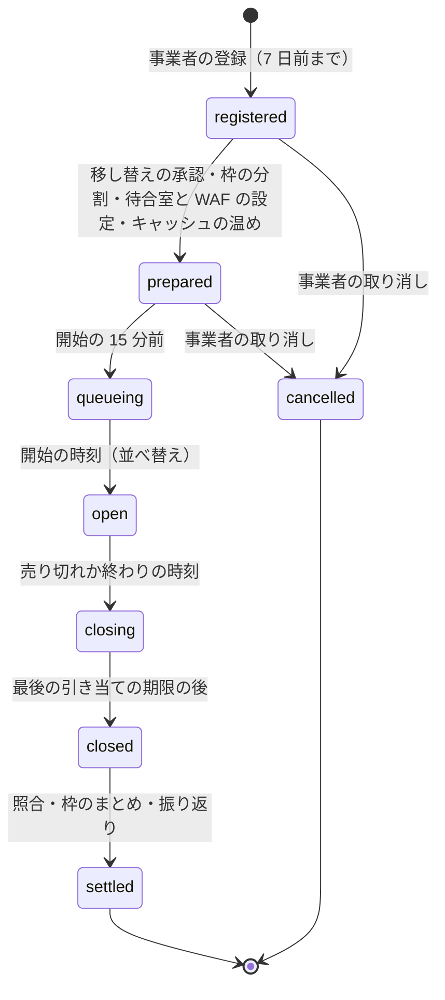
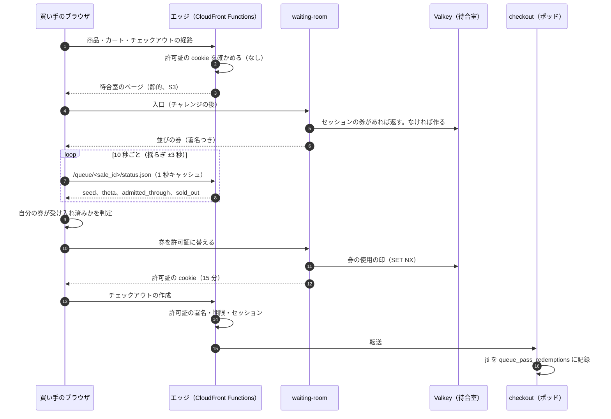
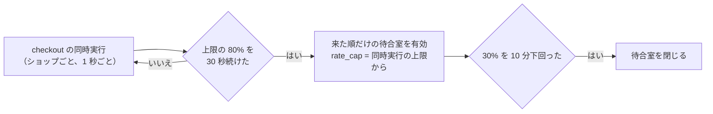

# Flash Sales and Queueing: Shopify

フラッシュセールを決める。セールの予定と段、待合室（並び、受け入れの速さ、売り切れの知らせ）、許可証、ボット対策、1 人あたりの数の上限、隔離のポッドへの前もっての移し替え、予定にない急増の自動の待合室を扱う。

前提となる決定は次のとおり。

- 待合室・Valkey の数は目安で、引き当ての成否は必ず DB で決める。待合室が壊れても売り越さない（[ADR-0004](../decisions/0004-inventory-reservation-model.md)）
- エッジの CloudFront Functions が許可証を確かめ、`waiting-room` が全体の面で列と許可証を持つ（[architecture/README.md](README.md) の 1.2 節）。自前の待合室、開始の前は乱数・以後は来た順（同 6 節）
- ショップごとのチェックアウトの同時実行の上限（既定 50、隔離のポッド 500）（[ADR-0003](../decisions/0003-tenancy-and-rls.md)）
- 運用の段と止める条件は [runbooks/](../runbooks/README.md) の 5 節。この文書は仕組みを決める

この文書で決めたことは次の ADR にある。

| ADR | 決定 |
| --- | --- |
| [0024](../decisions/0024-waiting-room-ordering-and-admission-rate.md) | 開始の前の到着は開始の時刻に暗号の乱数で並べ、以後は来た順。受け入れは 1 つの数を進め、速さは在庫の予算と p99 の AIMD で決める。買い手は 1 秒キャッシュした状態をエッジから読む |
| [0025](../decisions/0025-queue-pass-tokens.md) | 許可証は HMAC-SHA256 の短い値（ショップ・セール・セッション・期限 15 分・一意の ID）。エッジは状態なしで確かめ、チェックアウトの作成で一意の ID を DB に記録する |
| [0026](../decisions/0026-bot-defense-and-purchase-limits.md) | ボット対策は WAF・待合室の入口のチャレンジ・許可証・1 人あたりの上限の 4 層。上限は正規化した識別の値のハッシュごとの数え上げで、在庫と同じ引き当てと確定 |
| [0027](../decisions/0027-flash-sale-preparation-and-surge-auto-queue.md) | セールの予定を状態の機械にし、準備の作業の起点にする。予定にない急増は、チェックアウトの同時実行が上限の 80% を 30 秒続けたら、来た順だけの待合室を自動で有効にする |

## 1. 範囲

- 扱う：
  - セールの予定（開始の時刻、対象の品目、在庫、1 人あたりの上限、想定の来訪者）と段
  - 待合室：入口、並びの券、開始の時刻の並べ替え、受け入れの速さ、状態の知らせ、売り切れ
  - 許可証：形、確かめ、1 回だけ、鍵の回し
  - ボット対策：WAF の規則、チャレンジ、1 人あたりの上限、重複の検出の報告
  - 隔離のポッドへの前もっての移し替えの依頼、枠の分割とまとめの依頼
  - 予定にない急増の自動の待合室
- 扱わない：
  - 枠の行と引き当ての手順（[inventory-and-reservations.md](inventory-and-reservations.md)）
  - チェックアウトの入口の上限の実装（[cart-and-checkout.md](cart-and-checkout.md) の 9 節）
  - ショップの移し替えの仕組み（`shops-and-pods.md`）
  - エッジのキャッシュの鍵（`storefront-api-and-caching.md`）
  - 抽選の販売（MVP の後。景品表示法などの扱いは法務の確認待ち L2）

## 2. 要件

| 要件 | 目標 | NFR |
| --- | --- | --- |
| 待ちの規模 | 1 つのセールで 20 万人の待ち（S1） | NFR-002 |
| 受け入れの後 | 許可証の発行から 1 秒以内にチェックアウトへ入れる | NFR-002 |
| 注文の速さ | 1 ショップ 100 件/秒、全体 200 件/秒の注文を NFR-001 の中で | NFR-001、NFR-002、K4 |
| 売り越しなし | 待合室・Valkey の障害でも 0 | NFR-004 |
| 隣人 | 同じポッドの他のショップの NFR-001・NFR-003 を満たす | NFR-008 |
| 抜け道 | 許可証なしでチェックアウトの作成・送信が 0 件通る | quality.md の 2.2.1 節 H |
| 公平 | 開始の前の到着の順は、開始の後の順に影響しない | 6 節の決定 |

## 3. 本家の形（確かめたこと）

- フラッシュセールのボット対策は Plus の機能で、対象は 500 商品まで、1 回 60 分まで、チャレンジ（reCAPTCHA・hCaptcha）を選べる（[Bot protection](https://help.shopify.com/en/manual/checkout-settings/bot-protection)、2026-10-10 に確認）。
- 本家は Plus の紹介で、ボット対策と、販売の予定の自動化を挙げる（[Campaigns and flash sales](https://www.shopify.com/plus/solutions/flash-sales)、2026-10-10 に確認。売り込みの資料で、仕組みは書いていない）。
- 本家の待合室（チェックアウトの列）の並びの規則、受け入れの速さの決め方、1 人あたりの上限の数え方は、公式の資料で確かめられなかった（**未検証**）。本システムの規則を使う。

## 4. セールの予定と段（[ADR-0027](../decisions/0027-flash-sale-preparation-and-surge-auto-queue.md)）

- 対象の品目は `deny` の方針だけ（[inventory-and-reservations.md](inventory-and-reservations.md) の 8 節）。対象は 1 セール 500 品目まで（本家の上限に寄せた）。
- `prepared` に進むための作業：

| 作業 | 起点 | 失敗のとき |
| --- | --- | --- |
| 隔離のポッドへの移し替え | 3 日前に `shop-mover` へ依頼。実行は Ops の承認 | 24 時間前に未承認なら Ops を呼ぶ |
| 枠の分割（既定 32） | 24 時間前 | 再試行。できなければ Ops を呼ぶ |
| 割引の使用の回数の枠（16） | 同上 | 同上（[discounts-engine.md](discounts-engine.md) の 9 節） |
| 待合室の設定（`rate_cap`、許可証の期限） | 同上 | 同上 |
| WAF の規則（対象のショップの速さの上限、チャレンジ） | 同上 | 同上 |
| キャッシュの温め（商品のページ、待合室のページ） | 1 時間前 | 警告だけ |
| 非同期の決済の手段を隠す（`allow_async_payments = false` が既定） | 登録の時 | — |

- 段の作業の結果を `flash_sale_steps` に記録し、[runbooks/](../runbooks/README.md) の 5.1 節の確認を画面で見せる。

## 5. 待合室（[ADR-0024](../decisions/0024-waiting-room-ordering-and-admission-rate.md)）

### 5.1 流れ

### 5.2 並びの券

- 券の本体：`sale_id`、`ticket_id`（`waiting-room` が作る UUIDv7。買い手は選べない）、`sid_hash`、`group`（`pre`・`post`）、`seq`（`post` だけ）、`iat`。HMAC-SHA256 で署名する（許可証と別の鍵）。
- 1 つのセッションには 1 つの券だけを出す。同じセッションの再入場は同じ券を返す（Valkey の `wr:{sale}:sid:{sid_hash}`）。
- `queueing` の段（開始の 15 分前から開始まで）の到着は `group = pre`。開始の後は `group = post` と、`seq = INCR wr:{sale}:seq`。

### 5.3 開始の時刻の並べ替え（公平な受け入れ）

開始の前の到着を、到着の速さの競争にしないため、開始の時刻に乱数で並べる。全員の番号を配ると 15 万件の問い合わせが要るので、番号の代わりに、券ごとの乱数の値と閾値で受け入れを決める。

1. `prepared` の段で、`waiting-room` は 32 バイトの秘密の種 `seed` を CSPRNG で作る。`SHA-256(seed)` を開始の前に状態の JSON で公開する（後から種を変えていないことを示す約束）。
2. 開始の時刻に `seed` を公開する。各 `pre` の券の値は `v = HMAC-SHA256(seed, ticket_id)` の先頭 8 バイトを 2^64 で割った `[0, 1)` の数。券の ID は開始の前に決まり、種は開始の時刻まで秘密なので、誰も自分の `v` を前もって選べない。
3. `waiting-room` は `pre` の券の `v` を並べ替えて持つ（15 万件で数十 ms）。受け入れた `pre` の数 `a` に対して、閾値 `theta` を「`v` の小さい方から `a` 番目の値」にする。
4. 買い手のブラウザは `seed` から自分の `v` を WebCrypto で計算し、`v < theta` なら受け入れ済みと判定する。判定は目安で、券の交換のときに `waiting-room` が同じ計算で確かめる。
5. `pre` を全員受け入れたら（`theta = 1`）、`post` を `seq` の順に受け入れる（`admitted_through` を進める）。

- 種と、並べ替えた値の集まりのハッシュを、監査の記録（`flash_sale_audit`）に残す。事業者の問い合わせに、公平さを示せる。

### 5.4 受け入れの速さ

`rate = min(rate_cap, budget_rate, aimd_rate)`（1 秒ごとに計算）。

| 項 | 決め方 | 既定 |
| --- | --- | --- |
| `rate_cap` | `ops.waiting_room_admit_rate`（ショップごと）。下げるのは即時、上げるのは事業者と合意 | S1 100 人/秒 |
| 在庫の予算 `B` | `ceil((U + R) × k / q) − F`。`U = Σavailable`、`R = Σreserved`（5 秒ごとに DB の読み出しの写しから）、`q` は 1 人あたりの平均の数（登録の値、なければ 1.2）、`k` は離脱を見込む倍率、`F` は発行して終わっていない許可証の数（未使用・チェックアウトの途中） | `k = 1.5` |
| `budget_rate` | `max(0, B) / 10`（10 秒で予算を使い切る速さ） | — |
| `aimd_rate` | 開始の時に `rate_cap / 2`。10 秒ごとに、ショップのチェックアウトの p99 ≤ 1 秒なら +10、> 1 秒なら ×0.7 | — |

- `F` は、許可証の発行で +1、チェックアウトの完了・放棄・`expired`、許可証の期限切れ（未使用）で −1。`waiting-room` は `checkout` の outbox の事象（`checkout.completed`・`checkout.released`）で数える。
- 離脱すると、引き当ては戻って `U` が増え `R` が減る（和は同じ）。`F` が 1 減るので、予算が 1 増え、1 人を補う。
- 完了すると、`R` が `q` 減り、`F` が 1 減る。`k / q × q = k = 1.5 > 1` なので、予算は 0.5 減る。売れた分だけ、待合室は入れる人を絞っていく。

### 5.5 例：在庫 3,000、20 万人の待ち

前提：開始の前の到着 15 万人（`pre`）、開始の後 5 万人（`post`）。`q = 1.2`、`k = 1.5`、`rate_cap = 100`。チェックアウトの p99 は 1 秒以下で推移。転換 70%。

| 時刻 | 受け入れの速さ | 受け入れの累計 | 予算 `B` | メモ |
| --- | --- | --- | --- | --- |
| 開始 | 50（`aimd` の初め） | 0 | `ceil(3,000 × 1.5 / 1.2) − 0 = 3,750` | `seed` を公開。`pre` から `theta` を上げる |
| 10 秒 | 60 | 500 | 3,250 | |
| 20 秒 | 70 | 1,100 | 2,650 | |
| 30 秒 | 80 | 1,800 | 1,950 | |
| 40 秒 | 90 | 2,600 | 1,150 | |
| 50 秒 | 100（`rate_cap`） | 3,500 | 250 | `budget_rate = 25` が効き始める |
| 60 秒 | 約 25 | 約 3,750 | 約 0 | 受け入れが止まる |
| 2〜5 分 | 0〜数人/秒 | 約 3,750＋補充 | 0 前後 | 完了で予算が減り、離脱で増える |
| 約 12 分 | 0 | — | — | 2,500 人ほどの完了（3,000 個）と、離脱の戻りの売り直しの後、`U = 0`、`R = 0` → 売り切れ |

- 売り切れの時点で、`theta` は 3,750 / 150,000 = 0.025 前後で止まる。残りの `pre`（約 14.6 万人）と `post` の全員に、状態の JSON の `sold_out = true` で売り切れを示す。
- 受け入れた 3,750 人のうち、1 人あたりの平均が 1.2 個より少なければ、在庫が残る。残れば予算が正のまま、受け入れが続く。

### 5.6 売り切れと再開

| `U` | `R` | 状態の JSON | 受け入れ |
| --- | --- | --- | --- |
| > 0 | 任意 | 通常 | 予算の範囲で続ける |
| 0 | > 0 | `waiting_for_returns = true`（「在庫が戻る可能性があります」） | 止める。戻りで `U > 0` になれば再開 |
| 0 | 0 | `sold_out = true` | 止める。`closing` へ |

- `closing` の後も、最後の引き当ての期限（10 分）まで待合室のページを出す。期限の後に `closed` にし、エッジの許可証の確かめを外す。

## 6. 許可証（[ADR-0025](../decisions/0025-queue-pass-tokens.md)）

- 形：`<kid>.<本体>.<署名>`（base64url）。本体は `shop_id`、`sale_id`、`sid_hash`、`iat`、`exp`（`iat` ＋ 15 分）、`jti`。
- エッジの確かめ（CloudFront Functions）：`kid` で KeyValueStore の鍵を引き、HMAC を比べる（定数時間の比べ）。`exp`、`shop_id`（ホストのショップ）、`sid_hash`（cookie のセッション）を確かめる。どれかが外れたら待合室のページ。
- `checkout` の確かめ：作成で同じ確かめをし、`queue_pass_redemptions` に `(shop_id, jti)` を入れる。

| 場面 | 結果 |
| --- | --- |
| 1 回目の作成 | 作成。`jti` を記録 |
| 同じセッションの 2 回目の作成 | 既存のチェックアウトへ戻す |
| 別のセッションが同じ許可証を使う | エッジで `sid_hash` の不一致 → 待合室。cookie を写した場合も同じ |
| 許可証の期限の後の送信 | 作成から 15 分以内なら受ける。以後は待合室へ |
| 許可証なしで Storefront API のカートからチェックアウトを作る | セールの対象のショップの `open` の間は、`checkout` が許可証を求めて 403 |

- 鍵の回し：7 日ごと。KeyValueStore に今と次の 2 つを置き、発行は今の鍵、確かめは両方。

## 7. ボット対策（[ADR-0026](../decisions/0026-bot-defense-and-purchase-limits.md)）

| 層 | 場所 | 中身 | 既定 |
| --- | --- | --- | --- |
| 1 | エッジ（AWS WAF） | Bot Control（targeted）、IP ごとの速さの上限 | 待合室の入口 1 IP 5 分 100 件、チェックアウトの経路 1 IP 1 分 30 件 |
| 2 | 待合室の入口 | WAF の Challenge か CAPTCHA の動作 | セールの設定で有効（既定 有効） |
| 3 | エッジとチェックアウト | 許可証（6 節） | セールの間は必須 |
| 4 | 送信 | 1 人あたりの上限（8 節） | セールの登録の値 |

- 速さの上限の値は、NAT の後ろの多数の買い手（携帯の回線）を誤って止めないように、セールの後の振り返りで直す。値は WAF の規則のデータで持つ。
- 外部のチャレンジの提供者は E13 の選定で比べる（候補の能力は未確認）。

## 8. 1 人あたりの上限

### 8.1 数え方

- セールの登録で、品目ごとか、セールの全体で、1 人あたりの数の上限 `L` を決める。
- 送信で、次の識別の鍵ごとに、`purchase_limit_counters` の数を引き当てる。どれか 1 つでも `L` を超えたら送信を拒む（`422 purchase_limit_exceeded`）。

| 鍵の種類 | 正規化 | 備考 |
| --- | --- | --- |
| メールアドレス | 小文字、`+` の後ろを除く | |
| 配送先 | 郵便番号＋都道府県＋市区町村＋番地。全角を半角、漢数字の番地を数字、ハイフンの統一、建物の名前と部屋の番号を除く | 同じ番地の別の部屋を同じと数える |
| 電話番号 | E.164 | |
| 決済の手段の指紋 | 提供者が返す値 | 返す提供者だけ |

- ハッシュは HMAC-SHA256（ショップごとの鍵）。元の値を数え上げの行とログに置かない。
- 引き当て・確定・戻しは在庫と同じ（送信で `reserved`、`completeCheckout` で `used`、期限で戻す）。決済が済んだ後に取り直せなくても注文を作り、超過の印を付ける（[cart-and-checkout.md](cart-and-checkout.md) の 7 節）。

### 8.2 例

上限 `L = 2`（セールの全体）。

| 送信 | メール | 配送先 | 結果 |
| --- | --- | --- | --- |
| A：2 個 | `taro+1@example.jp` | 東京都港区芝公園 4-2-8 Aビル 101 | 受ける（メール 2、配送先 2） |
| B：1 個 | `Taro@example.jp` | 東京都港区芝公園四丁目２番８号 Bビル 202 | 拒む（メールの正規化で同じ、配送先の正規化でも同じ。どちらも 2 + 1 > 2） |
| C：1 個（A が 10 分で期限切れの後） | `taro@example.jp` | 同上 | 受ける（A の引き当てが戻り、0 + 1） |

### 8.3 重複の検出の報告

- セールの後（`settled`）、注文の識別の鍵のハッシュの重なり（同じ配送先に 5 件以上など）を、事業者の画面に候補として出す。自動で取り消さない。取り消しは事業者が判断する。

## 9. 準備と終わり

- **隔離のポッド**：セールのショップは、前もって隔離のポッド（S1 で 1 つ）に移す。隔離のポッドは、チェックアウトの同時実行の上限 500、Aurora の大きいインスタンスを持つ（`shops-and-pods.md`、`capacity.md`）。
- **枠**：24 時間前に分割（[inventory-and-reservations.md](inventory-and-reservations.md) の 6.5 節）。`closed` の後にまとめる。
- **終わり**：`closed` の後、照合（在庫の R1〜R4 をそのショップで 5 分ごと → 最後に 1 回）、1 人あたりの上限の超過の印の一覧、決済と注文の照合の結果を、事業者の画面に出す。
- **元のポッドへ戻す**：7 日の間に事業者の対応が落ち着いたら、Ops が判断する（[runbooks/](../runbooks/README.md) の 5.3 節）。

## 10. 予定にない急増

- `rate_cap` は `同時実行の上限 ÷ 送信から完了までの平均の秒数`（既定 50 ÷ 5 秒 = 10 人/秒）から始め、AIMD で上げる。
- 在庫の予算は、セールの登録がないので使わない（全品目が対象になるため）。
- 事業者はショップの設定で自動の有効化を切れる。切っても、[cart-and-checkout.md](cart-and-checkout.md) の 9 節の上限は効く。

## 11. 障害のときの振る舞い

| 障害 | 影響 | 振る舞い |
| --- | --- | --- |
| 待合室の Valkey の停止 | 券の発行・交換ができない | 閉じる側に倒す。新しい許可証を出さない。発行済みの許可証は署名だけで確かめるので使える。売り越しはない |
| `waiting-room` の停止 | 同上 | 同上。状態の JSON はエッジの古いキャッシュ（`stale-if-error` 60 秒）の後、エラーの表示 |
| 受け入れの速さの誤り（入れすぎ） | チェックアウトの混雑 | ショップの同時実行の上限が 429 を返す。AIMD が速さを下げる |
| 在庫の数の読み出しの遅れ | 予算の誤り | 5 秒以上古い値は使わず、`budget_rate = 0`。売り越しはない（DB で決める） |
| 鍵の漏えい | 許可証の偽造 | `kid` を無効にし、新しい鍵で発行し直す。チェックアウトの `jti` の記録と、1 人あたりの上限が残る |
| 種の漏えい（開始の前） | `pre` の順の予測 | 券の ID は買い手が選べないので、予測しても順は変えられない。種を作り直し、約束のハッシュを出し直す |
| ボットの急増 | 待合室の入口の負荷 | WAF の規則を強める（[runbooks/](../runbooks/README.md) の 5.2 節） |

## 12. 上限

| 対象 | 値 |
| --- | --- |
| 1 セールの対象の品目 | 500 |
| 1 セールの待ち | 20 万人（S1） |
| 状態の JSON のキャッシュ、問いの間隔 | 1 秒、10 秒（±3 秒） |
| 許可証の期限、作成の後の送信の猶予 | 15 分、15 分 |
| 鍵の回し | 7 日 |
| 受け入れの速さ | `rate_cap`（S1 100 人/秒）、`k = 1.5` |
| WAF の速さの上限 | 待合室の入口 1 IP 5 分 100 件、チェックアウト 1 IP 1 分 30 件 |
| 自動の待合室 | 同時実行の上限の 80% を 30 秒で有効、30% を 10 分で解除 |
| 1 人あたりの上限 | セールの登録の値（1〜99） |

## 13. data-model への項目

| 表・置き場 | 中身 | 主キー・索引 | 節 |
| --- | --- | --- | --- |
| `flash_sales`（ポッド） | 開始・終わりの時刻、状態、`rate_cap`、`k`、`q`、1 人あたりの上限、`allow_async_payments`、チャレンジの有無 | `(shop_id, sale_id)` | 4 |
| `flash_sale_items`（ポッド） | 対象の品目、枠の数、品目ごとの上限 | `(shop_id, sale_id, inventory_item_id)` | 4、8 |
| `flash_sale_steps`（ポッド） | 段の作業と結果 | `(shop_id, sale_id, step)` | 4 |
| `queue_pass_redemptions`（ポッド） | `jti`、チェックアウト、セッションのハッシュ、時刻 | `(shop_id, jti)` 一意 | 6 |
| `purchase_limit_counters`（ポッド） | 上限の範囲（`scope_id`：セールの全体か品目）、鍵の種類、鍵のハッシュ、`limit_qty`、`reserved`、`used`、`overage` | `(shop_id, sale_id, scope_id, key_type, key_hash)`（[data-model.md](data-model.md) の D-33） | 8 |
| `purchase_limit_reservations`（ポッド） | チェックアウト、鍵、数、状態、期限 | `(shop_id, checkout_id, attempt, key_type)` | 8 |
| `flash_sale_audit`（全体） | 種の約束のハッシュ、公開した種、並べ替えのハッシュ、受け入れの記録の要約 | `(sale_id)` | 5.3 |
| `waiting_room_sales`（全体） | `waiting-room` が読むセールの設定と状態（ポッドの `flash_sales` の写し。ショップのデータを持たない） | `(sale_id)` | 5（[data-model.md](data-model.md) の D-16） |
| Valkey（全体、待合室） | `wr:{sale}:sid:{sid_hash}`（券）、`wr:{sale}:seq`、`wr:{sale}:pre`（`v` の並び）、`wr:{sale}:admitted`、`wr:{sale}:used:{ticket_id}` | 失ってよい（閉じる側に倒す） | 5 |
| KeyValueStore | 許可証の鍵（`kid` → 鍵）、セールの有効の印（ショップ → `sale_id`） | — | 6 |
| S3 | 待合室のページ（静的） | — | 5.1 |

- `flash_sale_audit` は全体の面に置くが、ショップのデータ（買い手・注文）を持たない（[ADR-0002](../decisions/0002-pods-and-shop-placement.md)）。

## 14. テスト

- **PROP-FLS-001（公平）**：`pre` の到着の順序と時刻を任意に入れ替えても、同じ種なら同じ受け入れの順。異なる種の多数の試行で、順位の分布が一様（χ² 検定、夜間）。
- **PROP-FLS-002（受け入れの単調）**：`theta` と `admitted_through` は減らない。`post` は `pre` を全員受け入れた後にだけ受け入れる。
- **PROP-FLS-003（許可証は 1 回）**：任意の並行の作成で、1 つの `jti` から作られるチェックアウトは 1 つ。
- **PROP-FLS-004（1 人あたりの上限）**：任意の並行の送信・完了・期限切れで、1 つの鍵の `used − overage ≤ L`。`overage > 0` は決済済みの取り直しの失敗のときだけ。
- **PROP-FLS-005（売り越しなし）**：待合室・Valkey の任意の障害の場面で PROP-INV-001 が成り立つ。
- **表駆動**：4 節のセールの状態の遷移、5.6 節の売り切れの表、6 節の許可証の場面の表、8.1 節の正規化の試験のベクトル。
- **負荷**：[quality.md](../quality.md) の 2.2.1 節 H の全場面（20 万人、ボット 20%、待合室を通らない経路、Valkey の停止）。
- **試験のベクトル**：許可証の署名、`v` の計算（種と券の ID から）。

## 15. Story の候補

| Epic | Story | 中身 |
| --- | --- | --- |
| E13 | `flash-sale-scheduling` | 4 節（ADR-0027。状態の機械、準備の作業） |
| E13 | `waiting-room` | 5 節（ADR-0024。PROP-FLS-001・002） |
| E13 | `queue-pass-tokens` | 6 節（ADR-0025。PROP-FLS-003） |
| E13 | `bot-defense` | 7 節（WAF、チャレンジ） |
| E13 | `purchase-limits`（新しい Story の提案） | 8 節（ADR-0026。PROP-FLS-004） |
| E13 | `surge-auto-queue`（新しい Story の提案） | 10 節（ADR-0027） |
| E13 | `isolation-pod-moves` | 9 節 |
| E13 | `flash-sale-load-tests` | 14 節の負荷 |

## 16. 未解決の問い

### 決定

2026-10-10 の既定案。

- **並び**：開始の前は種の約束つきの乱数（券ごとの値と閾値）、以後は来た順（ADR-0024）。
- **受け入れ**：在庫の予算（`k = 1.5`）と p99 の AIMD と `rate_cap` の最小（ADR-0024）。
- **許可証**：HMAC、状態なしのエッジ、DB の `jti`（ADR-0025）。
- **1 人あたりの上限**：4 種の鍵、送信で引き当て（ADR-0026）。
- **非同期の決済**：セールの品目では既定で出さない（[payments-integration.md](payments-integration.md) の 9 節）。
- **自動の待合室**：同時実行の 80% を 30 秒（ADR-0027）。

### 持ち越し

| 問い | いつ・どう決めるか |
| --- | --- |
| `k`・`q` の既定、AIMD の幅 | E13 の負荷試験と、最初のセールの振り返り |
| CloudFront Functions で HMAC を確かめる時間 | E13 の `queue-pass-tokens` で測る（未検証） |
| 外部のチャレンジの提供者 | E13 の選定の Story |
| 抽選の販売 | MVP の後。法務の確認待ち（L2） |
| 配送先の正規化の精度（同じ番地の別の部屋） | 最初のセールの重複の検出の報告で見直す |
| 本家の待合室の並びと受け入れの規則 | 公式の資料で確かめられなかった（**未検証**） |
