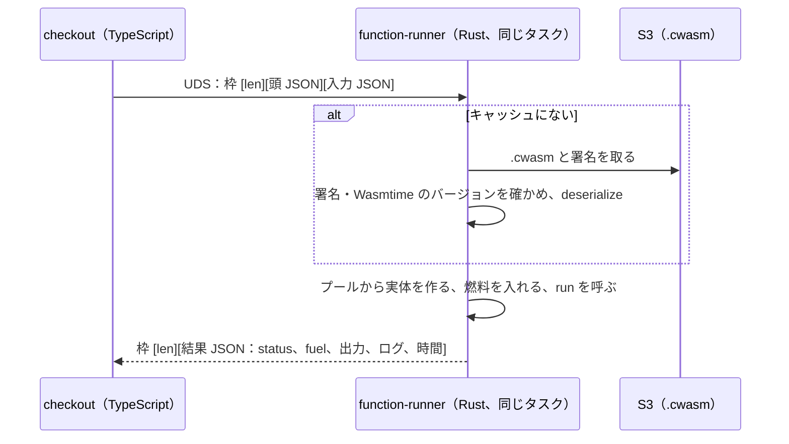
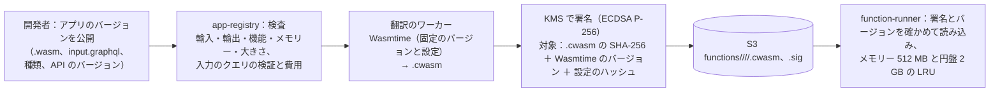

# Functions Sandbox: Shopify

アプリの関数（WebAssembly）の種類と入出力の契約、入力のクエリ、モジュールの約束（輸入・輸出）、`checkout` と `function-runner` の間の約束、上限、呼ぶ順序と予算、失敗のときの決まった結果、モジュールの公開・検査・事前の翻訳・署名・配り、関数のログと再現を決める。

前提となる決定は、関数は WebAssembly のモジュールで、`checkout` の隣の Rust のプロセスの Wasmtime で、燃料 1,000 万・線形メモリー 10 MB・入力 128 KB・出力 20 KB などの上限で動かし、WASI を渡さず、失敗は種類ごとの「効果なし」にすること（[ADR-0008](../decisions/0008-extension-sandbox-wasm.md)）、Rust のホストは共通の基盤からの外れ（[ADR-0001](../decisions/0001-platform-and-stack.md)）、関数の割引は割引のエンジンの組み合わせの規則で合わせること（[discounts-engine.md](discounts-engine.md)）。要件は NFR-012（関数 1 回 p99 5ms、1 段の合計 p99 50ms、上限の超過でチェックアウトが落ちない）と NFR-001（チェックアウトの段 p99 500ms）。法務の確認待ちは L1（関数が最終確認画面に出す事項を変えないこと）と L3（関数の入力の買い手のデータ）。この文書で決めたことは次の ADR にある。

| ADR | 決定 |
| --- | --- |
| [0058](../decisions/0058-function-io-contract.md) | 関数の入出力は UTF-8 の JSON。入力は関数ごとの入力のクエリ（チェックアウトの入力のスキーマへの GraphQL の部分集合）の結果、出力は種類ごとの JSON スキーマ。モジュールの輸入は `<brand>_io` の 3 つ（`input_read`、`output_write`、`log`）と、標準入出力の道具のための `fd_read(0)`・`fd_write(1, 2)` だけ。`checkout` と `function-runner` は UNIX ドメインソケットの上で、長さを先に置いた枠（頭の JSON ＋本体）でやり取りする |
| [0059](../decisions/0059-function-publish-compile-and-distribution.md) | 関数はアプリのバージョンの一部として公開し、`app-registry` がモジュールを検査し（輸入の一覧、輸出、メモリーとテーブルの宣言、大きさ、使える機能）、固定した Wasmtime のバージョンと設定で `.cwasm` に事前に翻訳し、KMS（ECDSA P-256）で署名して S3 に置く。`function-runner` は署名とバージョンを確かめた機械語だけを読み、メモリーとローカルの円盤の LRU に持つ。Wasmtime を上げるときは、全モジュールを新しいバージョンで翻訳し直してから出す |
| [0060](../decisions/0060-function-invocation-budget-and-failure-defaults.md) | 1 段の関数は（種類の順、導入の時刻、関数の ID）の決めた順で、同時に最大 4 つまで並べて呼び、結果は決めた順で合わせる。1 段の合計の予算は 50ms。失敗の理由（燃料、メモリー、トラップ、出力の大きさ、出力の不正、予算の超過、本システムの障害）ごとに種類の決まった結果を返し、チェックアウトは続く。「必須」のカートの検証の関数の失敗は送信を止める。本システムの原因の失敗は 1 回だけ試し直す。実行の記録（入力のハッシュ、出力、燃料、理由、ログ）を 7 日残す |

## 1. 範囲

- 扱う：
  - 関数の種類（割引、配送のカスタマイズ、決済の手段のカスタマイズ、カートの検証）と、各々の入出力
  - 入力のクエリと、入力のスキーマ、スコープと保護のデータ
  - モジュールの約束（輸入、輸出、メモリー）と、ホストとの約束
  - 上限と、200 行を超えるカートの広げ方
  - 呼ぶ順序、並べ方、予算、失敗の結果
  - 公開、検査、事前の翻訳、署名、配り、バージョン
  - 関数の設定（事業者が関数ごとに持つ値）
  - 実行の記録、ログ、開発者の道具、再現
- 扱わない：
  - 割引の組み合わせの規則と按分（[discounts-engine.md](discounts-engine.md)）。この文書は関数の提案を検証して渡すところまで
  - 配送の方法と送料の計算（[orders-and-fulfillment.md](orders-and-fulfillment.md)）、決済の手段の一覧（[payments-integration.md](payments-integration.md)）
  - チェックアウトの状態の機械（[cart-and-checkout.md](cart-and-checkout.md)）
  - `function-runner` のコンテナの IAM・ネットワークの全体（`security.md`、`infrastructure.md`）

## 2. 本家の形（確かめたこと）

いずれも 2026-10-10 に確認。

| 項目 | 内容 | 出典 |
| --- | --- | --- |
| 形と上限 | WebAssembly に翻訳できる言語で書く（Rust を推す）。モジュール 256 kB、線形メモリー 10,000 kB、スタック 512 kB、命令の数 1,100 万、入力 128 kB、出力 20 kB（カートの 200 行まで。それより多いと比例して広がる）。入力のクエリは 3,000 バイト・費用 30 まで | [Shopify Functions](https://shopify.dev/docs/api/functions) |
| 種類 | 割引、配送のカスタマイズ、決済のカスタマイズ、カートの変換、カートとチェックアウトの検証などの API | 同上 |

- 本家の関数の失敗のときのチェックアウトの振る舞い、関数どうしの順序、入出力の符号化の細部は、公式の資料で確かめていない（**未検証**）。本システムの値を使う。
- 本家の SDK・CLI・ひな形は使わない（[ADR-0001](../decisions/0001-platform-and-stack.md)）。

## 3. 要件

| 要件 | 目標 | NFR・基準 |
| --- | --- | --- |
| 1 回の速さ | 関数 1 回（実体化＋実行）p99 5ms | NFR-012 |
| 1 段の合計 | p99 50ms | NFR-012 |
| 落ちない | 上限の超過・トラップ・不正な出力で、チェックアウトが落ちない | NFR-012、K9 |
| 決定性 | 同じモジュール・同じ入力で、同じ出力と同じ燃料 | [ADR-0008](../decisions/0008-extension-sandbox-wasm.md) |
| 砂場 | 砂場の外への到達 0 件 | K9 |
| 本システムの原因の失敗 | 0.01% 未満 | [quality.md](../quality.md) の 4.1 節 |

## 4. 入力のクエリと入力

ADR-0058。

- 関数は、公開の時に入力のクエリ（`input.graphql`）を持つ。クエリは、チェックアウトの入力のスキーマ（種類ごと。本システムが定義し、関数の API のバージョン `YYYY-MM` で固定）への GraphQL の部分集合で、3,000 バイト・費用 30 まで（費用は [app-platform-and-apis.md](app-platform-and-apis.md) の 5.3 節の計算で、コネクションの `n` はスキーマの最大で数える）。
- 入力のスキーマの主な型：

| 型 | 主なフィールド |
| --- | --- |
| `Cart` | `lines`（250 まで）、`cost`（小計、合計の見積もり）、`buyerIdentity`、`deliveryGroups`、`attribute(key)` |
| `CartLine` | `id`、`quantity`、`cost.amountPerQuantity`、`merchandise`（`ProductVariant`） |
| `ProductVariant` | `id`、`sku`、`product { id, productType, vendor, hasTag(tag), inCollection(id) }`、`metafield(ns, key)` |
| `BuyerIdentity` | `customer { id, hasTag(tag), numberOfOrders }`（段階 1）、`email`・`phone`（段階 2。[app-platform-and-apis.md](app-platform-and-apis.md) の 6 節） |
| `DeliveryGroup` | `deliveryAddress { provinceCode, countryCode, zip }`（`zip` は段階 2 の `ADDRESS`）、`deliveryOptions` |
| `PaymentMethod` | `id`、`name`、`kind` |
| `Localization` | `market`、`language` |
| `FunctionConfiguration` | `metafield(ns, key)`（事業者の設定の値。下） |

- 入力の作り方：`checkout` が、クエリを入力のスキーマで実行して JSON を作る（DB を読まない。チェックアウトの今のカートと、カートの読み出しの時に読んだ値から作る）。保護のデータの承認のない項目は `null`。
- 入力の JSON は 128 KB まで（カートの行が 200 を超えたら比例して広げる。6 節）。超えたら関数を呼ばずに `INPUT_TOO_LARGE` の失敗にする。
- **関数の設定**：事業者は、関数ごとに設定（アプリの管理画面で作る JSON、16 KB まで）を持ち、関数は入力の `FunctionConfiguration.metafield` で読む。例：「10 個以上で 15% 引き」の閾値と率。

例（割引の関数の入力のクエリと入力）：

```graphql
query Input {
  cart {
    lines { id quantity cost { amountPerQuantity { amount currencyCode } }
            merchandise { ... on ProductVariant { id product { hasTag(tag: "bulk-ok") } } } }
  }
  discount { metafield(namespace: "$app", key: "config") { jsonValue } }
}
```

```json
{
  "cart": { "lines": [
    { "id": "gid://<brand>/CartLine/1", "quantity": 12,
      "cost": { "amountPerQuantity": { "amount": "550", "currencyCode": "JPY" } },
      "merchandise": { "id": "gid://<brand>/ProductVariant/0192…", "product": { "hasTag": true } } },
    { "id": "gid://<brand>/CartLine/2", "quantity": 1,
      "cost": { "amountPerQuantity": { "amount": "3300", "currencyCode": "JPY" } },
      "merchandise": { "id": "gid://<brand>/ProductVariant/0193…", "product": { "hasTag": false } } } ] },
  "discount": { "metafield": { "jsonValue": { "minQuantity": 10, "percent": "15" } } }
}
```

- 金額は 10 進の文字列（最小単位でない、通貨の単位の値）で渡す。JSON の数で渡さない（言語の浮動小数点の解釈の差を避ける）。

## 5. 出力と種類

ADR-0058、ADR-0060。

| 種類 | 出力（JSON） | 検証 | 失敗のときの結果 |
| --- | --- | --- | --- |
| 割引（商品・注文・送料） | `{ "discounts": [ { "targets": [ { "cartLine": { "id", "quantity?" } } \| { "orderSubtotal": {} } \| { "deliveryGroup": { "id" } } ], "value": { "percentage": "15" } \| { "fixedAmount": { "amount": "100", "appliesToEachItem": false } }, "message": "まとめ買い 15%" } ], "strategy": "FIRST" \| "MAXIMUM" \| "ALL" }` | 対象がカートにある、率 0〜100、額 0 以上で対象の価格以下、`message` 100 文字、提案 25 まで | その関数の割引なし |
| 配送のカスタマイズ | `{ "operations": [ { "hide": { "deliveryOptionHandle" } } \| { "rename": { "deliveryOptionHandle", "title" } } \| { "move": { "deliveryOptionHandle", "index" } } ] }` | 対象が一覧にある、全部を隠せない（1 つは残す）、`title` 60 文字 | 変更なし |
| 決済の手段のカスタマイズ | `{ "operations": [ { "hide": { "paymentMethodId" } } \| { "move": { "paymentMethodId", "index" } } ] }` | 対象が一覧にある、全部を隠せない | 変更なし |
| カートの検証 | `{ "errors": [ { "localizedMessage": "…", "target": "cart" \| "cart.lines[0].quantity" } ] }` | `localizedMessage` 200 文字、10 件まで | 既定は通す。「必須」の関数は決めた文言で送信を止める |

例（4 節の入力に対する出力）：

```json
{ "discounts": [ { "targets": [ { "cartLine": { "id": "gid://<brand>/CartLine/1" } } ],
                   "value": { "percentage": "15" }, "message": "まとめ買い 15%" } ],
  "strategy": "FIRST" }
```

- `checkout` は出力を JSON スキーマで検証し、外れたら `INVALID_OUTPUT` の失敗にする。額の値は、対象の行の価格を超えれば価格に切る（[ADR-0008](../decisions/0008-extension-sandbox-wasm.md)）。率の割引の額の丸め（円未満）は [discounts-engine.md](discounts-engine.md) の規則。
- 関数は、最終確認画面に出す事項（分量、価格、支払いの時期と方法、引き渡しの時期など）を隠せない。配送・決済の手段の名前の変更は、提供者・運送会社が出す必須の表示を消せない（`title` の変更は表示の名前だけで、手段の説明・手数料の表示は本システムが出す）。範囲の確定は法務の確認待ち（L1）。

## 6. モジュールの約束と上限

ADR-0058。

### 6.1 輸入と輸出

```text
export "run"           : () -> ()                       必須。1 回呼ぶ
export "memory"        : memory                          必須。最大 160 ページ（10 MiB）以下を宣言
import "<brand>_io" "input_read"   : (ptr: i32, cap: i32) -> i32
        入力の全長を返す。cap >= 全長なら ptr に写す。cap < 全長なら何も写さない
import "<brand>_io" "output_write" : (ptr: i32, len: i32) -> i32
        出力の続きを足す。合計が上限を超えたら -1 を返し、以後の書き込みも -1（実行の後で OUTPUT_TOO_LARGE）
import "<brand>_io" "log"          : (ptr: i32, len: i32) -> ()
        ログ（合計 1 KB まで。超えた分は捨て、切った印を残す）
import "wasi_snapshot_preview1" "fd_read"  : fd 0 だけ。input_read と同じ中身
import "wasi_snapshot_preview1" "fd_write" : fd 1 は output_write、fd 2 は log と同じ
import "wasi_snapshot_preview1" "proc_exit": 0 は正常の終わり、他はトラップとして扱う
```

- 上のほかの輸入（時計、乱数、ファイル、ソケット、環境変数、引数、`fd_*` の他の番号）は、公開の時の検査で拒む。
- 使える WebAssembly の機能：MVP の命令、bulk memory、multi-value、sign-ext、nontrapping float-to-int、reference types（テーブル 4・1 万要素まで）、SIMD（128 ビット、決定的なもの）。threads・relaxed SIMD・memory64・例外の処理は拒む。

### 6.2 上限

[ADR-0008](../decisions/0008-extension-sandbox-wasm.md) の値（`wasm-function-poc` で見直す）。

| 対象 | 既定（行 200 まで） | 行 n > 200 のとき |
| --- | --- | --- |
| 燃料 | 1,000 万 | `1,000 万 × ⌈n / 200⌉` |
| 線形メモリー | 10 MiB（実体化の時に最大で確保） | 同じ |
| スタック | 512 KiB | 同じ |
| モジュール | 256 KiB（`.wasm`） | — |
| 入力 | 128 KiB | `128 KiB × ⌈n / 200⌉` |
| 出力 | 20 KiB | `20 KiB × ⌈n / 200⌉` |
| ログ | 1 KiB | 同じ |

- カートの行は 250 まで（[cart-and-checkout.md](cart-and-checkout.md)）なので、係数は最大 2。
- 燃料は Wasmtime の `consume_fuel` で数え、ホストの関数（`input_read` など）の呼び出しは、写したバイト数 ÷ 64 の燃料を引く。

## 7. `checkout` と `function-runner` の約束

ADR-0058。



- 枠：4 バイトの長さ（ビッグエンディアン）＋頭の JSON（`invocation_id`、`function_id`、`module_digest`、`fuel_limit`、`input_limit`、`output_limit`）＋区切り＋入力の本体。
- 応答の `status`：`ok`、`fuel_exhausted`、`memory_exceeded`、`trap`（理由の種類）、`output_too_large`、`input_too_large`、`module_unavailable`、`host_error`。
- `function-runner` は出力の JSON の中身を解釈しない（検証は `checkout`）。ホストを小さく保つため。
- 接続は `checkout` のプロセスごとに 8 本の持続の接続。`function-runner` はタスクあたり同時 16 の実体（プーリングのアロケーター、各 10 MiB ＋ 余白）。

## 8. 呼ぶ順序、予算、失敗

ADR-0060。

### 8.1 順序と並べ方

- 段ごとに呼ぶ関数を集める（カートの段：割引・カートの検証、配送の段：配送のカスタマイズ・送料の割引、決済の段：決済の手段のカスタマイズ）。
- 並びは（種類の決めた順、導入の時刻、関数の ID）。同じ段の関数は互いの出力を見ない（全部が同じ入力を受ける）ので、最大 4 つまで同時に呼んでよい。結果は並びの順で合わせ、終わった順に依らない。
- 1 段に呼ぶ関数は種類ごとに 5 つまで、段の合計で 10 まで（ショップの設定で有効にできる数の上限）。

### 8.2 予算

- 1 段の合計の壁の時計の予算 50ms。予算の残りが、次の関数の過去の p99 の 2 倍より小さければ、その関数を呼ばずに `BUDGET_EXCEEDED` の失敗にする。
- 予算は本システムの安全網で、関数の上限は燃料で決まる（同じ入力なら同じ所で止まる）。予算での失敗は、関数の開発者の誤りでなく本システムの容量の問題として数える。

### 8.3 失敗の結果

| 理由 | 誰の原因 | 試し直し | 結果 |
| --- | --- | --- | --- |
| `fuel_exhausted`、`memory_exceeded`、`trap`、`output_too_large`、`input_too_large`、`INVALID_OUTPUT` | 関数 | しない（決定的なので同じ結果） | 5 節の表の「失敗のときの結果」 |
| `module_unavailable`、`host_error`、接続の失敗 | 本システム | 1 回（同じ予算の中） | 同上。数えて警告 |
| `BUDGET_EXCEEDED` | 本システム | しない | 同上 |

- **必須のカートの検証**：事業者が「必須」にした検証の関数の失敗は、送信を止め、決めた文言（「現在ご注文を受け付けられません。時間をおいてお試しください」）を出す。本システムの原因の失敗が続くと、その事業者のチェックアウトが止まり続けるので、Ops は `ops.functions_required_fail_open`（ショップか全体の単位）で一時的に「通す」に倒せる（倒した時間を記録し、事業者に知らせる）。
- 割引の関数の失敗は、その関数の割引なしでチェックアウトを続け、買い手には他の割引の結果を出す。最終確認画面の金額は送信の時の価格の写しで固定する（[ADR-0005](../decisions/0005-checkout-state-machine-and-exactly-once-orders.md)）。送信の後に関数を呼び直さない。

### 8.4 例

カートの段に、割引の関数 D1（アプリ A）、D2（アプリ B）、検証の関数 V1（必須）がある。

| 関数 | 結果 | 時間 |
| --- | --- | --- |
| D1 | `ok`、15% の提案 | 1.8ms |
| D2 | `fuel_exhausted`（1,000 万） | 4.1ms |
| V1 | `ok`、エラーなし | 0.9ms |

- 合わせた結果：D1 の提案を割引のエンジンへ、D2 は「割引なし」、V1 は通過。合計の壁の時計は並べたので 4.1ms 前後。
- D2 の開発者の画面に、`fuel_exhausted`、燃料 1,000 万、入力のハッシュ、ログを出す。事業者の画面には「アプリ B の割引が動きませんでした」を数で出す。

## 9. 公開と配り

ADR-0059。



- 翻訳のワーカーは、ネットワークのない隔離したタスクで動かす（翻訳器への悪意の入力に備える）。
- 署名の鍵は KMS の外に出さない。`function-runner` は公開鍵だけを持つ。
- **バージョン**：関数のバージョンはアプリのバージョンに従う。導入したショップは、アプリの最新のバージョンの関数を使う。開発者は前のバージョンへ戻せる（`.cwasm` を残す。90 日）。
- **Wasmtime の更新**：新しいバージョンで全モジュールを翻訳し直し（S3 のキーに Wasmtime のバージョン）、`function-runner` の新しいイメージは新しいキーを読む。両方のキーを並べて置くので、段階のデプロイの間も両方が動く。セキュリティの修正は 7 日以内に出す（[ADR-0008](../decisions/0008-extension-sandbox-wasm.md)）。
- **先読み**：フラッシュセールの前に、対象のショップの関数を `function-runner` に読み込ませる（[flash-sales-and-queueing.md](flash-sales-and-queueing.md) の手順）。

## 10. 実行の記録と開発者の道具

- 実行の記録（`function_runs`）：関数、ショップ、時刻、`status`、燃料、時間、入力のハッシュ、出力（20 KB まで）、ログ（1 KB）。7 日。開発者の画面と Admin API（`functionRuns`）で読む。
- 入力の本体は既定で残さない。事業者が「デバッグのため入力を残す」を有効にしたとき（24 時間で自動で切れる）だけ、保護のデータの項目を除いた入力を残す（法務の確認待ち L3）。
- 記録は、成功を 1% の抜き取り、失敗は全部（ショップと関数ごとに 1 分 100 件まで）。
- **再現**：開発者の道具（自前の CLI、`<brand>-fn`）は、本システムと同じ Wasmtime のバージョンと設定、同じ燃料の数え方で、ローカルで関数を動かす。残した入力（または開発者が作った入力）で、本番と同じ燃料と出力になる。
- Rust のひな形と、入力のクエリから Rust の型を作る生成器を用意する（自前。本家のものを使わない）。

## 11. 失敗のしかた

| 事象 | 振る舞い |
| --- | --- |
| `function-runner` のコンテナの停止 | ECS が再起動。その間の呼び出しは `host_error` で、8.3 節の結果。タスクの健康の検査で `function-runner` も見る |
| S3 の障害 | キャッシュにある関数は動く。ない関数は `module_unavailable` |
| 署名の不一致・Wasmtime のバージョンの不一致 | 読み込まない（`module_unavailable`）。セキュリティの事象として数える |
| Wasmtime の詰まり（epoch の安全網の 50ms） | 止めて `host_error`。本システムの障害として数える |
| 関数の失敗の急増（1 つのアプリ） | 開発者とショップに知らせる。本システムは自動で外さない（事業者の判断）。失敗の割合が 1 時間 50% を超えた関数は、事業者の画面で強く警告 |

## 12. data-model への項目

| 表・保存 | 中身 | 節 |
| --- | --- | --- |
| `app_functions`（全体） | `(app_version_id, function_id)`、`kind`、`api_version`、`input_query`、`wasm_sha256`、`size`、`state`（検査中・可・拒否と理由） | 9 |
| `function_artifacts`（全体） | `(function_id, wasmtime_version)`、`cwasm_s3_key`、`sig_s3_key`、`config_hash` | 9 |
| `function_configurations`（ポッド） | `(shop_id, id)`、`function_id`、`enabled`、`required`（検証だけ）、`config jsonb`、`created_at` | 4、8.3 |
| `function_runs`（ポッド） | `(shop_id, function_id, run_at, id)`、`status`、`fuel`、`duration_us`、`input_hash`、`input`（同意のときだけ）、`output`、`log`。日の分割で 7 日 | 10 |
| S3 | `functions/<app>/<function>/<version>/<wasmtime>.cwasm`、`.sig` | 9 |

## 13. テストと性質

- **PROP-FN-001（決定性）**：任意の生成したモジュールと入力で、2 回の実行の出力・燃料・`status` が同じ（[quality.md](../quality.md) の 2.2.1 節 F）。
- **PROP-FN-002（落ちない）**：任意のモジュール（`sandbox-escape-suite`）と入力で、`function-runner` のプロセスが落ちず、決めた `status` を返し、`checkout` は 5 節の失敗の結果で続く。
- **PROP-FN-003（合わせの順序）**：同じ段の関数の終わる順を入れ替えても、合わせた結果が同じ。
- **PROP-FN-004（入力の範囲）**：任意の入力のクエリとスコープ・保護のデータの承認で、入力に承認のない項目の値が入らない。
- **DT-FN-001**：種類 × 失敗の理由 × 必須か → 結果の表（5・8.3 節）。
- 脱出の試験：WASI の他の関数、殻にない輸入、無限のループ、メモリーの伸長の繰り返し、スタックの溢れ、テーブルの外の呼び出し、境界の読み書き、巨大な出力、不正な UTF-8・JSON、256 KiB を超えるモジュール、壊したモジュール、改ざんした `.cwasm`、別の Wasmtime のバージョンの `.cwasm`（[quality.md](../quality.md) の 2.2.1 節 F）。
- 契約の試験：枠の形（長さ、頭、本体）の試験のベクトル。
- PoC（`wasm-function-poc`）：実体化と実行の時間、燃料 1,000 万の実際の時間（目安で数 ms）、1 タスクの同時の数、`.cwasm` の読み込みの時間。

## 14. Story の候補

| Epic | Story | 中身 |
| --- | --- | --- |
| E15 | `wasm-function-poc` | 6.2・7 節の値の測定 |
| E15 | `function-runner` | 6・7 節（ADR-0058。PROP-FN-001・002） |
| E15 | `function-publish-and-compile` | 9 節（ADR-0059） |
| E15 | `function-types-discount-delivery-payment-validation` | 5・8 節（ADR-0060。PROP-FN-003、DT-FN-001）。画面への影響は法務：L1 |
| E15 | `function-input-queries` | 4 節（PROP-FN-004）。保護のデータは法務：L3 |
| E15 | `sandbox-escape-suite` | 13 節の脱出の試験 |
| E15 | `function-dev-tooling` | 10 節 |

## 15. 未解決の問い

### 決定（2026-10-10、既定案）

- **符号化**：JSON（ADR-0058）。二進の形（MessagePack など）は、速さが要ると `wasm-function-poc` で分かったときに、新しい API のバージョンで足す。
- **並べ方**：同じ段の関数は互いの出力を見ず、最大 4 並び（ADR-0060）。
- **試し直し**：本システムの原因だけ 1 回（ADR-0060）。
- **必須の検証の失敗**：送信を止める（ADR-0008 のとおり）。Ops の `fail_open` の逃げ道を持つ。
- **配り**：署名つきの `.cwasm`、Wasmtime のバージョンごとのキー（ADR-0059）。

### 持ち越し

| 問い | いつ・どう決めるか |
| --- | --- |
| 燃料・時間の上限の値、同時の実体の数 | `wasm-function-poc` |
| 関数が変えてよい画面の範囲（配送・決済の手段の名前） | **法務の確認待ち：L1** |
| 入力の買い手のデータ、入力の記録の保持 | **法務の確認待ち：L3** |
| カートの変換・拠点の振り分けの関数 | MVP の後（[roadmap.md](../roadmap.md) の延期の一覧） |
| 本家の失敗のときの振る舞い、順序 | 公式の資料で確かめられなかった（**未検証**のまま） |

## 出典

いずれも 2026-10-10 に確認。

- Shopify Dev, [Shopify Functions](https://shopify.dev/docs/api/functions)：上限と種類
- Bytecode Alliance, [Wasmtime](https://docs.wasmtime.dev/)：燃料（`consume_fuel`）、プーリングのアロケーター、事前の翻訳
- W3C, [WebAssembly Core Specification](https://www.w3.org/TR/wasm-core-2/)
