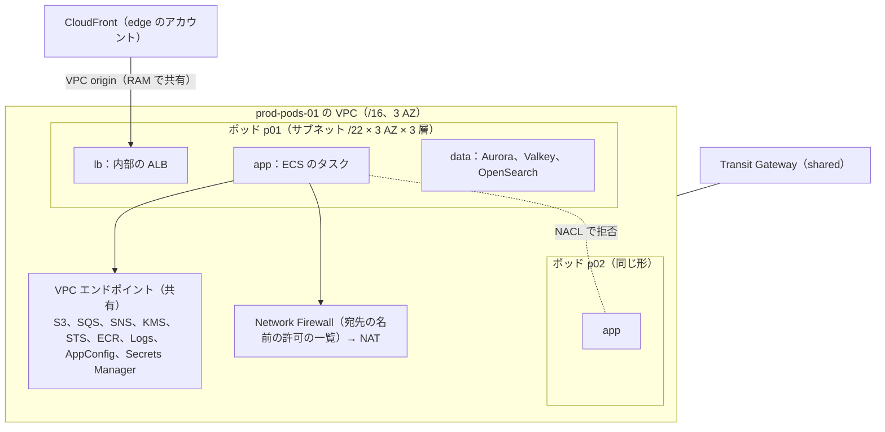
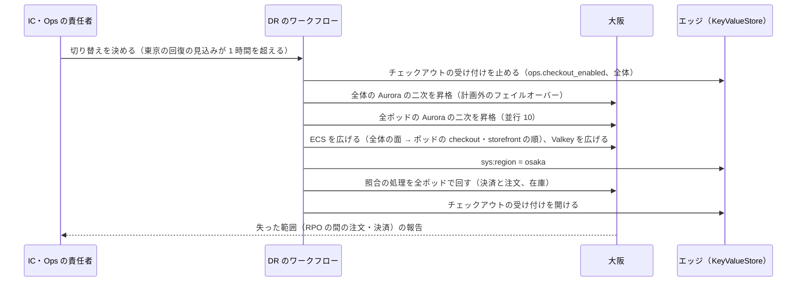

# Infrastructure: Shopify

AWS のアカウントとネットワーク、エッジ（CloudFront・WAF・CloudFront Functions・KeyValueStore）、ポッドの Terraform のモジュール（Aurora、Valkey、SQS、OpenSearch、ECS）、全体の面（`shop-directory`、`identity`、`app-registry`、`billing` など）、外への送信、大阪への DR、段階を上げる基準、1 ショップ・1 注文・ストアフロントの 100 万要求あたりの原価を決める。

前提となる決定は、ポッドを完全なセルにすること（[ADR-0002](../decisions/0002-pods-and-shop-placement.md)）、共通の基盤（[ADR-0001](../decisions/0001-platform-and-stack.md)）、エッジの振り分けの表を熱い集まりと `edge-router` にすること（[ADR-0010](../decisions/0010-shop-routing-hot-set-and-custom-domains.md)）、ポッドの種類（[ADR-0011](../decisions/0011-shop-placement-and-rebalancing.md)）、Webhook の隔離した egress（[ADR-0062](../decisions/0062-webhook-egress-and-payload-custody.md)）、鍵の配置（[ADR-0066](../decisions/0066-encryption-and-key-layout.md)）。要件は NFR-005（AZ の障害で RPO 0、リージョンの障害で RPO 1 分・RTO 1 時間）、NFR-007、NFR-008。この文書で決めたことは次の ADR にある。

| ADR | 決定 |
| --- | --- |
| [0069](../decisions/0069-accounts-network-and-pod-groups.md) | 本番は、全体の面のアカウントと、ポッドの組（10 ポッドまで）ごとのアカウントに分ける。ポッドの組は 1 つの VPC を持ち、ポッドごとにサブネットとセキュリティグループと NACL を分け、ポッドの間の通信を NACL で拒む。全体の面とポッドの組は Transit Gateway でつなぎ、経路は `edge-router`・`shop-mover`・`relay` の向きに絞る。ポッドのサービスはインターネットへの経路を持たず、決済の提供者・運送会社への送信は、ポッドの組ごとの Network Firewall（宛先の名前の許可の一覧）を通す |
| [0070](../decisions/0070-edge-distributions-waf-and-origin-selection.md) | ストアフロントとチェックアウトと Admin API は 1 つのマルチテナントの配信（`mtd-storefront`）と 1 つの viewer request の関数で受け、関数が KeyValueStore の値からポッドの元（アカウントをまたいで共有した VPC origin）を選ぶ。ポッドの ID → 元の ID の対応と、東京・大阪の切り替えも KeyValueStore の値で持つ。WAF の Bot Control とアカウントの乗っ取りの防止は、チェックアウト・カート・待合室の入口・ログインの経路に絞る |
| [0071](../decisions/0071-osaka-dr-and-stage-up-criteria.md) | 大阪は、全ポッドと全体の Aurora Global Database の二次（読み出し 1 台）、S3 の写し、ECR・KMS・AppConfig の写し、ECS のサービスの定義（タスク 0。全体の面の一部だけ 1）を持つウォームスタンバイにする。切り替えは、Aurora の二次の昇格、ECS の拡大、KeyValueStore の `sys:region` の書き換えの順で、IC と Ops の責任者が決める。段階を上げる基準は、ポッドの数・エッジの要求・KeyValueStore・全体の Aurora の 4 つで見て、上限の 60% で準備を始める |

負荷と台数の根拠は [capacity.md](capacity.md)、CI とデプロイは [delivery.md](delivery.md)、計測の経路は [observability.md](observability.md)、暗号化と運用者のアクセスは [security.md](security.md) にある。「初期見積もり」は負荷試験と PoC の前の仮の値である。AWS の仕様で確かめていないものは「未検証」と書く。

## 1. AWS アカウント

ADR-0069。

| アカウント | OU | 中身 |
| --- | --- | --- |
| management | Root | Organizations、SCP、IAM Identity Center、請求 |
| security | Security | GuardDuty・Security Hub・Inspector の委任管理者 |
| log-archive | Security | 組織の CloudTrail、Config、VPC フローログ、監査ログの写し（Object Lock。[merchant-admin-and-staff.md](merchant-admin-and-staff.md) の 7 節）、保持の対象の文書（[shops-and-pods.md](shops-and-pods.md) の 10 節）。大阪へ写す |
| shared | Infrastructure | ECR（東京・大阪へ写す）、Route 53（`<brand>.<domain>`）、Transit Gateway、Terraform の状態のバケット |
| edge | Infrastructure | CloudFront（マルチテナントの配信、管理画面、資産の CDN）、WAF、CloudFront Functions、KeyValueStore、ACM（us-east-1） |
| observability | Infrastructure | AMP、Managed Grafana、CloudWatch のまとめ、アラートの送り先（[observability.md](observability.md) の 1 節） |
| canary | Infrastructure | 外からの見張り（`canary`）。本番と別の資格情報で、外から本番を叩く（[quality.md](../quality.md) の 2.2 節） |
| prod-global | Workloads/Prod | 全体の面（5 節）、Webhook の egress |
| prod-pods-01 〜 | Workloads/Prod | ポッドの組。1 つのアカウントに 10 ポッドまで。S1 は `prod-pods-01` に 6 ポッド（`p00`〜`p04`、`x01`） |
| staging | Workloads/NonProd | 本番と同じ形の全体の面と、ポッドの組 1 つ（`p00`・`p01`・`x01` を小さく）。負荷試験と DR の訓練のときだけ広げる |
| dev | Workloads/NonProd | 開発 |

- **ポッドの組のアカウント**：アカウントの既定の上限（Aurora のクラスタの数、ENI、Fargate の vCPU）と、障害・誤操作の範囲を、10 ポッドに閉じる。S2（40 ポッド）で 4〜5 アカウント、S3（300 ポッド）で 30 アカウント。
- **SCP**（Workloads の OU）：東京（ap-northeast-1）・大阪（ap-northeast-3）以外のリージョンを禁止する（CloudFront・WAF・ACM・IAM の us-east-1 を除く）。CloudTrail・Config・GuardDuty の停止、KMS の鍵の削除の予約と無効化、Object Lock の解除、バケットのバージョニングの停止を、break-glass の外に禁止する。
- データの所在（東京・大阪）は [intent.md](../intent.md) の制約。法令上の所在の約束は法務の確認待ち（L3）。

## 2. ネットワーク

ADR-0069。

### 2.1 ポッドの組の VPC

| サブネット（ポッドごと） | 置くもの | 入る側 | 出る側 |
| --- | --- | --- | --- |
| `lb` | 内部の ALB | CloudFront の VPC origin、Transit Gateway（`edge-router`、中継の窓の元のポッド） | 同じポッドの `app` |
| `app` | ECS のタスク | 同じポッドの `lb` | 同じポッドの `data`、VPC エンドポイント、Network Firewall（許可の一覧）、他のポッドの `lb`（中継の窓だけ。[shops-and-pods.md](shops-and-pods.md) の 8.5 節） |
| `data` | Aurora、Valkey、OpenSearch | 同じポッドの `app`、Transit Gateway（`shop-mover`） | なし |

- ポッドの間は NACL で拒む。例外は、`app` → 他のポッドの `lb` の 443（中継の窓。要求は ALB の規則で `x-<brand>-relayed` を要る）だけ。
- VPC エンドポイントは VPC（ポッドの組）で共有し、ポッドごとに持たない（インターフェースのエンドポイントの時間の課金を、ポッドの数で掛けないため）。
- アドレス：ポッドの組の VPC は `/16`、ポッドごとに `/22` を 9 つ（3 層 × 3 AZ）。1 つの VPC に 10 ポッド。

### 2.2 全体の面とポッドの組

- Transit Gateway（shared のアカウント）に、全体の面の VPC と各ポッドの組の VPC をつなぐ。経路の表は次だけを通す。

| 向き | 元 | 先 | 用途 |
| --- | --- | --- | --- |
| 全体 → ポッド | `edge-router` | ポッドの `lb` の 443 | 熱い集まりにないホストの中継（[ADR-0010](../decisions/0010-shop-routing-hot-set-and-custom-domains.md)） |
| 全体 → ポッド | `shop-mover` | ポッドの `data` の 5432 | 移し替え（[ADR-0012](../decisions/0012-shop-mover-logical-decoding-and-cutover.md)） |
| ポッドの組 ↔ ポッドの組 | ポッドの `app` | 他の組のポッドの `lb` の 443 | 中継の窓（組をまたぐ移し替えのとき） |

- SNS・SQS による全体とポッドの事象（P3・P5、Webhook の依頼）は、AWS の API（VPC エンドポイント）を通り、Transit Gateway を通らない。

### 2.3 入口とホスト名

| ホスト名 | 入口 | 元 |
| --- | --- | --- |
| `<handle>.<brand>.<domain>`、独自のドメイン | `mtd-storefront`（マルチテナントの配信、接続のグループ） | ポッドの ALB（VPC origin）、`edge-router`、S3（静的なページ、待合室のページ） |
| `connect.<brand>.<domain>` | 同じ接続のグループの経路の端点を指す名前 | — |
| `admin.<brand>.<domain>` | 標準の配信 | S3（管理画面の資産）、`identity` の ALB（VPC origin） |
| `cdn.<brand>.<domain>` | 標準の配信 | S3（テーマの資産、商品のメディア、画像の変換） |
| `queue.<brand>.<domain>` | `mtd-storefront` の経路 | `waiting-room`（[flash-sales-and-queueing.md](flash-sales-and-queueing.md)） |

- **独自のドメインの頂点（apex）**：接続のグループに Anycast の固定の IP の一覧を結び、事業者は頂点に A レコードでその IP を書く（Route 53 を使う事業者は別名のレコード）。Anycast の固定の IP の一覧の料金と、マルチテナントの配信での使い方の細部は**未検証**（E2 の `custom-domains-and-tls` で確かめる）。
- **VPC origin**：ポッドの ALB は内部の ALB で、ポッドの組のアカウントが VPC origin を作り、AWS RAM で edge のアカウントに共有する（アカウントをまたぐ VPC origin は 2025 年 11 月から使える。下の出典）。VPC origin はアカウントあたり 25（引き上げ可）で、S1 は 8（ポッド 6、`edge-router`、`identity`）。

### 2.4 外への送信

| 送信 | 経路 | 宛先の制限 |
| --- | --- | --- |
| 決済の提供者の API、運送会社の API | ポッドの組の Network Firewall → NAT | 許可の一覧の名前（TLS の SNI）だけ。一覧は IaC で持ち、提供者の追加で足す |
| メール（買い手への通知） | VPC エンドポイント（SES の API） | — |
| Webhook、CSV の取り込みの画像の URL | 全体の面の egress のサブネット（固定の IP の NAT、AZ ごと） | [ADR-0062](../decisions/0062-webhook-egress-and-payload-custody.md) の宛先の検査（公開の IP、解決の結果に固定、リダイレクトを追わない） |
| SSO の IdP のメタデータ・JWKS | 全体の面の Network Firewall → NAT | 組織が登録した IdP の名前を許可の一覧へ自動で足す |
| `function-runner` | なし | モジュールの S3 の読み出しだけ（VPC エンドポイント） |

- `storefront-renderer`・`storefront-api`・`admin-api` のタスクのセキュリティグループは、Network Firewall への出口を持たない。外へ出られるのは `checkout`（提供者）と `workers`（提供者、運送会社）だけ（[security.md](security.md) の 3.7 節）。
- Network Firewall の料金と、TLS の SNI での許可の一覧の振る舞いは**未検証**（E1 の `aws-accounts-and-network` で確かめる）。

## 3. エッジ

ADR-0070。

### 3.1 配信

| 配信 | 種類 | 関数（viewer request） | WAF の web ACL |
| --- | --- | --- | --- |
| `mtd-storefront` | マルチテナント。テナント：既定のドメインのワイルドカード 1、独自のドメインのショップごと | `fn-route`（KeyValueStore `kvs-route`） | `waf-storefront` |
| `mtd-canary` | マルチテナント。見張りのショップの独自のドメインのテナントだけ。新しい関数を先に出す（[delivery.md](delivery.md) の 4.3 節） | `fn-route` の次のバージョン | `waf-storefront` |
| `admin` | 標準 | なし | `waf-admin` |
| `cdn` | 標準 | `fn-image`（画像の変換の引数の正規化） | `waf-cdn`（速さの上限だけ） |

- `fn-route` は 1 つの関数で、次を行う：ホストで KeyValueStore を引く（[shops-and-pods.md](shops-and-pods.md) の 5.2 節）→ `state` の処理（301、凍結・閉店のページ）→ 待合室の許可証の確かめ（[ADR-0025](../decisions/0025-queue-pass-tokens.md)）→ キャッシュの鍵の材料（[ADR-0050](../decisions/0050-edge-cache-keys-and-generations.md)）→ 元の選択（`selectRequestOriginById`）。関数の大きさの上限 10 KB（下の出典）に収める（`packages/edge-keys` と振り分けの共通のコードを圧縮して置く）。
- **元の選択**：KeyValueStore の `sys:origins` の値（ポッドの ID → 元の ID の一覧、`sys:region`）を引き、`<pod>-<region>` の元を選ぶ。熱い集まりにないホストは `edge-router-<region>`。
- Origin Shield は東京で有効にする（[storefront-api-and-caching.md](storefront-api-and-caching.md) の 4.3 節）。

### 3.2 WAF

| 規則 | 範囲 | 動作 |
| --- | --- | --- |
| AWS の管理の規則（共通、既知の悪い入力、IP の評判） | 全部 | ブロック |
| 速さの上限（IP ごと） | ストアフロント 5 分 2,000、チェックアウトの送信 1 分 30、待合室の入口 5 分 100（[flash-sales-and-queueing.md](flash-sales-and-queueing.md) の 12 節）、Storefront API 5 分 5,000 | ブロック・チャレンジ |
| Bot Control（共通） | `/checkouts/`、`/cart`、待合室の入口、`/account/login`、Storefront API のカートのミューテーション | ラベル付け、確かなボットはブロック |
| Bot Control（標的型） | フラッシュセールの間の対象のショップのチェックアウトと待合室の入口（[ADR-0026](../decisions/0026-bot-defense-and-purchase-limits.md)） | チャレンジ |
| アカウントの乗っ取りの防止（ATP） | `admin.<brand>.<domain>` のログインの経路 | ブロック・チャレンジ |
| チェックアウトの自動のチャレンジ | `ops.checkout_challenge` のショップ（[security.md](security.md) の 3.4 節） | チャレンジ |

- Bot Control を、キャッシュに当たる経路に掛けない。要求の 5% 前後に絞る（[capacity.md](capacity.md) の 6 節の費用）。
- WAF の規則の変更は、凍結の時間帯と承認（[runbooks/](../runbooks/README.md) の 3.1 節）に従う。

### 3.3 エッジの上限（S1）

| 対象 | AWS の既定（下の出典） | S1 の使用 | 対応 |
| --- | --- | --- | --- |
| 配信あたりの要求 | 25 万/秒 | 最大 10 万/秒（`mtd-storefront`） | S2 の前に引き上げを申請（天井は**未検証**） |
| 配信あたりの転送 | 150 Gbps | 最大 40 Gbps（10 万/秒 × 50 KB） | 同上 |
| 配信あたりの元 | 100 | 9 | S3 の前に引き上げ |
| マルチテナントの配信のテナント | アカウントあたり 1 万 | 2〜3 万 | E2 の前に引き上げ（[shops-and-pods.md](shops-and-pods.md) の 6.2 節） |
| VPC origin | アカウントあたり 25 | 8 | S2 の前に引き上げ |
| KeyValueStore | 5 MB、関数に 1 つ | 4 MB を上限に使う | [ADR-0010](../decisions/0010-shop-routing-hot-set-and-custom-domains.md) |

## 4. ポッドの構成

ADR-0069。ポッドは Terraform のモジュール `pod` から作る（[ADR-0002](../decisions/0002-pods-and-shop-placement.md)）。大きさの段は [capacity.md](capacity.md) の 4・5 節。

| 部品 | 構成 |
| --- | --- |
| Aurora PostgreSQL | 書き込み 1、読み出し 1 以上（別の AZ）。I/O-Optimized。`rds.logical_replication = 1`（移し替え）、`rds.force_ssl = 1`。Global Database で大阪へ。自動のバックアップ 35 日。Aurora PostgreSQL 18 の提供の時期は**未検証**（[ADR-0001](../decisions/0001-platform-and-stack.md) の前提。提供までは 17 で始め、メジャーの更新の手順で上げる） |
| ElastiCache（Valkey） | クラスタモード、主 1・写し 1 の 1 シャード（S1）。転送中と保存の暗号化 |
| OpenSearch | ポッドに 1 つのドメイン、3 AZ、データのノード 3、専用のマスター 3（[search-and-recommendations.md](search-and-recommendations.md)） |
| SQS・SNS | ポッドの話題とキュー（outbox の行き先、ジョブ、P3・P5）。ショップの公平のためのメッセージ グループ（[ADR-0003](../decisions/0003-tenancy-and-rls.md)） |
| ECS（Fargate、ARM64） | `storefront-renderer`、`storefront-api`、`checkout`（隣に `function-runner`）、`admin-api`、`workers`、`relay` |
| ALB | 内部、`lb` のサブネット、VPC origin |
| KMS | `kms-pod-<id>-storage`・`pii`・`secrets`（[ADR-0066](../decisions/0066-encryption-and-key-layout.md)） |

- AZ の障害：Aurora は別の AZ の読み出しへ自動でフェイルオーバー（30 秒前後）。Valkey は写しへ。ECS は残る 2 AZ で広げる。各サービスは、2 AZ でピークを受けられるタスクの数を最小に持つ（平常の使用率 2/3 以下）。RPO 0 は Aurora の共有のストレージ（3 AZ に 6 つの写し）による。

## 5. 全体の面

`prod-global` のアカウント。全体の Aurora（I/O-Optimized、書き込み 1・読み出し 1、Global Database）と、全体の Valkey（待合室、`identity` のセッション）を持つ。

| サービス | 役割 | 止まったとき |
| --- | --- | --- |
| `shop-directory` | ショップ・ホスト・ポッドの正本、KeyValueStore への配り、熱い集まり、ライフサイクル（[shops-and-pods.md](shops-and-pods.md)） | 熱い集まりのショップは売れ続ける |
| `edge-router` | 熱い集まりにないホストの中継 | 集まりにないホストが 503 |
| `identity` | スタッフのアカウント、ログイン、SSO、入場の主張（[merchant-admin-and-staff.md](merchant-admin-and-staff.md)） | 新しいログインができない。発行済みのトークンは 15 分使える |
| `app-registry` | アプリ、OAuth の定義、関数のモジュール、P5 の配り（[app-platform-and-apis.md](app-platform-and-apis.md)） | 新しい導入・公開ができない。導入済みのアプリはポッドの写しで動く |
| `billing` | プラン、利用量、請求（[ADR-0065](../decisions/0065-merchant-billing-plans-and-usage.md)） | 締めが遅れる |
| `waiting-room` | 待合室の列と許可証（[flash-sales-and-queueing.md](flash-sales-and-queueing.md)） | 閉じる側に倒す |
| `shop-mover` | 移し替え | 移し替えが止まる（再開できる） |
| `webhook-dispatcher` | Webhook の配信（[webhooks.md](webhooks.md)） | 配信が遅れる（SQS に溜まる） |
| `cache-invalidator`、`search-indexer`、`notifier` | 非同期（[architecture/README.md](README.md) の 1.2 節） | 反映が遅れる |

- `cache-invalidator`・`search-indexer`・`notifier` は、ポッドのキューを読むので、ポッドの組のアカウントの中に、ポッドごとのサービスとして置く（[architecture/README.md](README.md) の 1.2 節の「非同期」の箱を、ポッドの中に置く形にした）。
- `webhook-dispatcher` は本文を保存しない（SQS の保持の中だけ。[ADR-0062](../decisions/0062-webhook-egress-and-payload-custody.md)）。

## 6. Terraform とポッドの追加

開発リポジトリの `infra/` に置く。状態ファイルは shared のバケット（東京、大阪へ写す）。

| ルートモジュール | 中身 | 変更の承認 |
| --- | --- | --- |
| `org/`、`security/` | Organizations、SCP、Identity Center、GuardDuty、log-archive | Ops の責任者＋セキュリティの担当 |
| `shared/` | ECR、Route 53、Transit Gateway | Ops |
| `edge/` | 配信、関数、KeyValueStore（中身は `shop-directory` が書く）、WAF、ACM | Ops（WAF の規則は `security:sensitive`） |
| `global/<region>` | 全体の面 | Ops。状態を持つ資源の削除・置き換えは CI で拒む |
| `pod-group/<group>/<region>` | VPC、エンドポイント、Network Firewall、NAT | Ops |
| `pod/<pod_id>/<region>` | 4 節の部品（モジュール `pod`、大きさの段の変数） | Ops。Aurora・Valkey・OpenSearch の削除は CI で拒む |

- **ポッドの追加**：`pods` の表に `provisioning` で行を作る → `pod/<pod_id>` を plan・apply（東京と大阪）→ スキーマの移行を今のバージョンまで当てる（[delivery.md](delivery.md) の 5 節）→ 全サービスを今のイメージで出す → 見張りのショップを 1 つ作って試しの購入 → VPC origin を共有し `sys:origins` に足す → `accepting`。目標 1 時間（Aurora の作成の時間が支配。**初期見積もり**）。
- plan のポリシー検査（OPA・Checkov）で、次を拒む：ポッドの `app` のサブネットの経路に IGW・Network Firewall を経ない NAT、`storefront-renderer`・`admin-api` のセキュリティグループの外への出口、人のロールに `pii`・`secrets` の鍵の Decrypt、Aurora の `rds.force_ssl` が 0、ポッドの間の NACL の許可（中継の 443 を除く）。

## 7. 大阪と DR

ADR-0071。

### 7.1 平常の構成

| 部品 | 大阪の平常 |
| --- | --- |
| 全ポッドと全体の Aurora | Global Database の二次（読み出し 1 台、ポッドは最小の型） |
| ECS | サービスの定義とタスクの定義（イメージは ECR の写し）。ポッドのサービスはタスク 0、全体の面の `shop-directory`・`identity`・`edge-router` は 1 |
| Valkey | 各ポッドに最小の空のクラスタ（切り替えで広げる）。カートは引き継がない（[ADR-0028](../decisions/0028-cart-storage-in-valkey.md)） |
| OpenSearch | なし。切り替えの後に Aurora から索引を作り直す（数時間。その間の検索は Aurora の名前の前方一致に落とす） |
| S3 | メディア、テーマ、保持の対象、log-archive の写し（CRR）。ショップの削除の作業は大阪の写しも明示に消す（[shops-and-pods.md](shops-and-pods.md) の 9.1 節） |
| KMS、ECR、AppConfig、Secrets Manager | 複数のリージョンの鍵、写し、同じ構成 |
| エッジ | 同じ配信。`sys:origins` に大阪の元（VPC origin）を持つ |

### 7.2 リージョンの障害（NFR-005）

- **RPO 1 分**：Aurora Global Database の複製の遅れ（通常 1 秒未満。`AuroraGlobalDBRPOLag` 10 秒が 5 分で呼び出し。[runbooks/](../runbooks/README.md) の 4 節）。
- **RTO 1 時間**：昇格（数分）、ECS の拡大（S1 で数百のタスク。Fargate の大阪で起こせる量は**未検証**。半年ごとの DR の訓練で測る）、OpenSearch の作り直しを待たない。
- **決済の後始末**：東京の最後の 1 分に決済が済み、注文の行が大阪に届いていないチェックアウトは、照合の処理（[ADR-0005](../decisions/0005-checkout-state-machine-and-exactly-once-orders.md)）が提供者の照会で見つけ、決定表で注文を作るか返金する。チェックアウトの行も届いていないものは、提供者の日次の突き合わせ（`payment-reconciliation-daily`）で見つけ、返金する。
- 東京へ戻すのは計画作業で、Global Database の管理された切り替え（switchover）で行う。

## 8. 段階を上げる基準

ADR-0071。月次のキャパシティのレビュー（[capacity.md](capacity.md) の 7 節）で見る。準備に 1 四半期かかる前提で、上限の 60% で始める。

| 指標 | 上限（想定） | 準備を始める | 準備の中身 |
| --- | --- | --- | --- |
| 共有のポッドの数 | 1 つのポッドの組に 10、1 つの全体の Aurora の書き込み | 6 ポッドの組 | 次のポッドの組のアカウント |
| `mtd-storefront` の要求 | 25 万/秒（既定） | 15 万/秒 | 引き上げの申請。足りなければ、独自のドメインのテナントを 2 つ目のマルチテナントの配信へ分ける |
| KeyValueStore の熱い集まり | 4 MB | 固定の枠を除いて 3.5 MB が 4 週続く | 熱い集まりの入れる条件の見直し、`edge-router` の中継の遅れの改善 |
| 全体の Aurora の書き込みの CPU（ピークの p95） | 70% | 50% が 4 週 | `shop-directory` の読み出しを、ポッドの組ごとの読み出しの写しへ（[architecture/README.md](README.md) の 2 節の S3） |
| 最大のショップの大きさ | 共有のポッドの 25% | 15% | 専用のポッド（[ADR-0011](../decisions/0011-shop-placement-and-rebalancing.md)） |
| 1 ショップのフラッシュセールの注文 | 隔離のポッドの容量（[capacity.md](capacity.md) の 5 節） | 60% | 隔離のポッドの大きさの段を上げる、在庫の枠を増やす |

- S2 への移り：上の 6 指標のうち 2 つが準備の基準を超えたら、S2 の計画（ポッドの組のアカウントの追加、エッジの引き上げ、全体の読み出しの写し）を PM と Ops が始める。

## 9. 単位あたりの原価

[capacity.md](capacity.md) の 6 節の月の原価（S1、本番、約 18.7 万 USD/月、±40%）を割り振った値。1 USD = 150 円は本システムの想定。

| 単位 | 原価 | 大きい項目 |
| --- | --- | --- |
| ストアフロント 100 万要求（エッジ） | 約 5.2 USD（約 780 円） | エッジの転送（61%）、CloudFront の要求（24%）、WAF（13%） |
| 注文 1 件（チェックアウトの経路） | 約 0.012 USD（約 2 円） | ポッドの `checkout`・`workers`・Aurora の書き込みの按分 |
| 稼働のショップ 1 つ・月 | 約 3.7 USD（約 560 円） | 全体の原価 ÷ 稼働のショップ 5 万 |
| 登録のショップ 1 つ・月 | 約 1.9 USD（約 280 円） | 全体の原価 ÷ 登録のショップ 10 万 |

- 注文あたりの原価は小さく、原価のほとんどはストアフロントのエッジ（転送と要求）である。キャッシュの当たりの割合は、元の原価にはほとんど効かず、エッジの原価は要求の数と応答の大きさで決まる。画像の大きさ（変換と形式）と、CloudFront の価格の交渉（大口の割引）が主な手段になる（交渉の値は**未検証**）。
- ポッドの最小の構成は、共有のポッドで月 約 5,700 USD（約 85 万円）で、[architecture/README.md](README.md) の 2.1 節の「1 ポッド月 100 万円以下」に収まる。隔離のポッドは、大きさを上げている間は月 約 8,000 USD 相当の速さで費用がかかる。

## 10. Story の候補

| Epic | Story | 中身 |
| --- | --- | --- |
| E1 | `aws-accounts-and-network` | 1 節と 2 節（ADR-0069）。Network Firewall の確かめ |
| E1 | `pod-terraform-module` | 4 節と 6 節のモジュール `pod`、ポッドの追加の手順 |
| E1 | `global-plane-baseline` | 5 節 |
| E1 | `edge-baseline` | 3 節（ADR-0070）。関数の 10 KB、VPC origin の共有 |
| E1 | `osaka-warm-standby` | 7.1 節（ADR-0071） |
| E2 | `custom-domains-and-tls` | 2.3 節の Anycast の固定の IP の確かめ |
| E14 | `webhook-egress` | 2.4 節（[webhooks.md](webhooks.md) と共同） |
| E18 | `dr-failover-drill` | 7.2 節（半年ごと） |
| E18 | `cost-baseline` | 9 節を請求の実績で置き換える |

## 11. 未解決の問い

### 決定（2026-10-10、既定案）

- **アカウント**：全体の面とポッドの組（10 ポッドまで）に分ける（ADR-0069）。
- **ネットワーク**：ポッドの組の VPC、ポッドごとのサブネットと NACL、Transit Gateway、Network Firewall の許可の一覧（ADR-0069）。
- **エッジ**：1 つのマルチテナントの配信と 1 つの関数、VPC origin、KeyValueStore での元と地域の切り替え、Bot Control を絞る（ADR-0070）。
- **DR**：大阪のウォームスタンバイ、昇格 → 拡大 → `sys:region`（ADR-0071）。
- **段階**：6 指標、60% で準備（ADR-0071）。
- **非同期の部品**：`cache-invalidator`・`search-indexer`・`notifier` はポッドの中（5 節）。

### 持ち越し

| 問い | いつ・どう決めるか |
| --- | --- |
| エッジの配信あたりの要求・転送・テナントの上限の天井 | S2 の前に AWS に確かめる（**未検証**） |
| Anycast の固定の IP の一覧の料金と、マルチテナントの配信での頂点のドメインの受け方 | E2 の `custom-domains-and-tls`（**未検証**） |
| Network Firewall の料金と SNI の許可の一覧の振る舞い | E1 の `aws-accounts-and-network`（**未検証**） |
| 大阪で ECS のタスクを起こせる量と時間 | `dr-failover-drill`（**未検証**） |
| Aurora PostgreSQL 18 の提供の時期 | E1 の `aurora-rls-baseline`（**未検証**） |
| CloudFront の大口の価格 | Ops と PM（**未検証**） |
| データの所在の法令上の約束 | **法務の確認待ち：L3** |

## 12. data-model への項目

| 表・置き場所 | 中身 | 節 |
| --- | --- | --- |
| `pods`（全体）に足す列 | `account_id`、`group_id`、`region`、`origin_ids`（東京・大阪） | 4、6 |
| `pod_groups`（全体） | アカウント、VPC、ポッドの数 | 1、2 |
| `dr_events`（全体） | 切り替えの記録、失った範囲（ポッドごとの時刻の範囲） | 7.2 |
| KeyValueStore | `sys:origins`（ポッド → 元の ID）、`sys:region` | 3.1、7.2 |
| AppConfig | `ops.checkout_enabled`（全体・ポッド・ショップ） | 7.2 |

## 出典

いずれも 2026-10-10 に確認・取得。

- AWS, [Amazon CloudFront quotas](https://docs.aws.amazon.com/AmazonCloudFront/latest/DeveloperGuide/cloudfront-limits.html)：配信あたり 25 万要求/秒・150 Gbps、元 100、VPC origin 25、関数 10 KB、KeyValueStore 5 MB・関数に 1 つ、テナント 1 万・マルチテナントの配信 20・接続のグループ 100、CSP のヘッダー 1,783 文字
- AWS, [Introducing cross-account support for Amazon CloudFront VPC origins](https://aws.amazon.com/blogs/networking-and-content-delivery/introducing-cross-account-support-for-amazon-cloudfront-virtual-private-cloud-vpc-origins)、[Working with shared resources in CloudFront](https://docs.aws.amazon.com/AmazonCloudFront/latest/DeveloperGuide/sharing-resources.html)：VPC origin を AWS RAM で他のアカウントへ共有できる
- AWS, [Helper methods for origin modification](https://docs.aws.amazon.com/AmazonCloudFront/latest/DeveloperGuide/helper-functions-origin-modification.html)
- AWS, [Understand how multi-tenant distributions work](https://docs.aws.amazon.com/AmazonCloudFront/latest/DeveloperGuide/distribution-config-options.html)：接続のグループ、Anycast の固定の IP の一覧は接続のグループの設定
- AWS Price List の公開の価格（ap-northeast-1）：単価は [capacity.md](capacity.md) の出典
