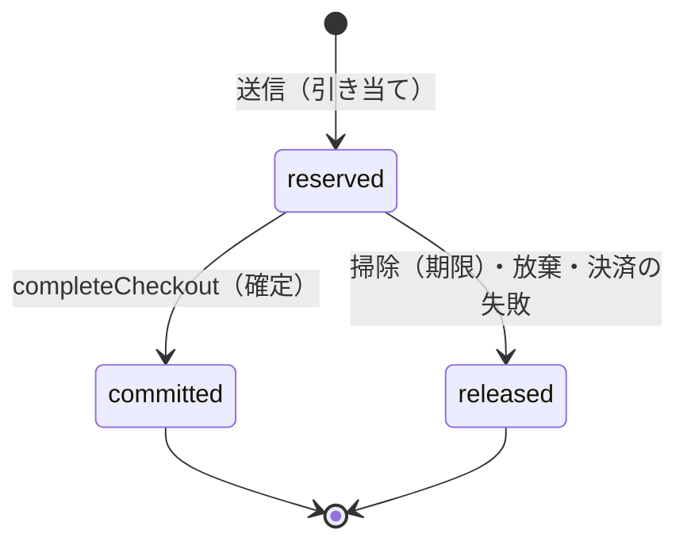
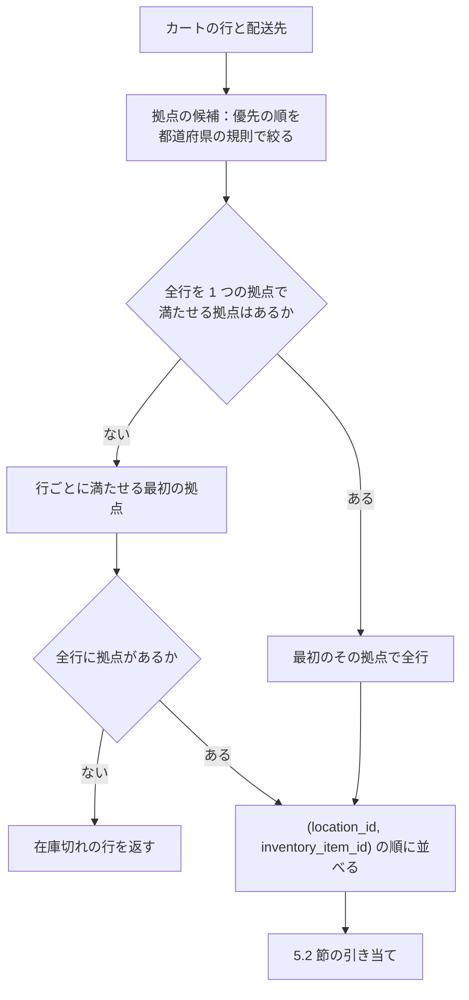

# Inventory and Reservations: Shopify

在庫を決める。拠点、在庫の数と状態、引き当て・確定・戻し、期限と掃除、熱い品目の枠の行と直し、拠点の選び方、移動の履歴、照合を扱う。

前提となる決定は次のとおり。

- 在庫の正本は拠点 × 品目の Aurora の行。支払いの開始（送信）で期限つきの引き当て、注文の作成で確定。`deny` の品目は CHECK 制約で守る。熱い品目は枠の行に分ける。期限は通常 15 分、フラッシュセールのショップは 10 分。枠は既定 1、セールの品目 32（[ADR-0004](../decisions/0004-inventory-reservation-model.md)）
- 確定は `completeCheckout` の 1 つのトランザクションの中で行う（[ADR-0005](../decisions/0005-checkout-state-machine-and-exactly-once-orders.md)）
- 掃除の処理はポッドの中のショップをまたぐ X1 の経路で動く（[ADR-0003](../decisions/0003-tenancy-and-rls.md)）
- 待合室の受け入れは残りの在庫から決める（[flash-sales-and-queueing.md](flash-sales-and-queueing.md)）。完了の決定表の「取り直し」は [cart-and-checkout.md](cart-and-checkout.md) の 7 節

この文書で決めたことは次の ADR にある。

| ADR | 決定 |
| --- | --- |
| [0020](../decisions/0020-inventory-slot-counters-and-reservation-sweep.md) | 枠の行に `available`・`reserved`・`committed` を持ち、拠点の行は `on_hand`・`unavailable` だけ。期限切れの引き当ては 1 分ごとの掃除が `FOR UPDATE SKIP LOCKED` で 500 行ずつ戻す |
| [0021](../decisions/0021-inventory-slot-probing-and-rebalance.md) | 最初の枠はハッシュ、失敗したら残りの多い枠を 3 つ試す。1 つの枠で足りなければ寄せ集める。直しは 2 つの枠の間の移しだけ。セールの後にまとめる |
| [0022](../decisions/0022-location-selection-and-lock-order.md) | 全行を 1 つで満たせる最初の拠点、なければ行ごとの最初の拠点。ロックは `(location_id, inventory_item_id)` の順 |
| [0023](../decisions/0023-inventory-movements-ledger-and-reconciliation.md) | 数を変える操作は追記の移動の行に書く（引き当て・戻しを除く）。毎時の照合 R1〜R4 |

## 1. 範囲

- 扱う：
  - 拠点（倉庫、店舗）と拠点の優先の順
  - 品目（inventory item）ごとの在庫の方針（`deny`・`continue`・数えない）
  - 数の持ち方と不変条件
  - 引き当て・確定・戻し、期限と掃除
  - 配送・キャンセル・入荷・調整・拠点の間の移動が動かす数
  - 熱い品目の枠の行、枠の選び方、直し、まとめ
  - 拠点の選び方とロックの順
  - 移動の履歴、照合
  - ストアフロントに出す在庫の数（目安）
- 扱わない：
  - 待合室・許可証・ボット対策（[flash-sales-and-queueing.md](flash-sales-and-queueing.md)）
  - チェックアウトの状態と完了の決定表（[cart-and-checkout.md](cart-and-checkout.md)）
  - 配送の指示と配送（[orders-and-fulfillment.md](orders-and-fulfillment.md)）。ここでは配送が動かす数だけを決める
  - 返品の検品（[returns-and-refunds.md](returns-and-refunds.md)）。ここでは戻しが動かす数だけを決める
  - 「残りわずか」の表示の既定（法務の確認待ち L2。storefront-themes の領域）

## 2. 要件

| 要件 | 目標 | NFR |
| --- | --- | --- |
| 売り越しなし | `deny` の品目で、`Σslot.committed` が `on_hand − unavailable` を超えた件数 0。Valkey・待合室・キャッシュの障害のときも 0 | NFR-004、K1 |
| 引き当ての速さ | 引き当て 1 回（1 行）p99 50ms。カート 10 行で p99 120ms | NFR-001 |
| 熱い品目 | 1 品目に 1 ショップ 100 件/秒（S1）。S2 500、S3 2,000 | NFR-002 |
| 戻しの遅れ | 期限から戻しまで p99 2 分 | 売れる在庫の遅れ（売り越しにはならない） |
| 照合 | 毎時の照合の不一致 0 | NFR-004 |
| 決定性 | 同じ操作の列から、同じ数（拠点の選び方を含む） | quality.md の 2.2.1 節 A |

## 3. 本家の形（確かめたこと）

- 手元の数（on_hand）は、available・committed・reserved・damaged・safety_stock・quality_control の和。committed は注文の作成と配送で本家が動かす（[Manage inventory quantities and states](https://shopify.dev/docs/apps/build/orders-fulfillment/inventory-management-apps/manage-quantities-states)、2026-10-10 に確認）。
- 注文の振り分けの後、拠点ごとに 1 つ以上の配送の指示を作る（[FulfillmentOrderAssignedLocation](https://shopify.dev/docs/api/admin-graphql/latest/objects/fulfillmentorderassignedlocation)、2026-10-10 に確認）。
- チェックアウトの途中で在庫を押さえる時点と期限、熱い品目の行の持ち方は、公式の資料で確かめられなかった（**未検証**）。本システムの値を使う。

## 4. 数の持ち方

### 4.1 行

| 行 | 鍵 | 数 |
| --- | --- | --- |
| 拠点の行 `inventory_levels` | `(shop_id, location_id, inventory_item_id)` | `on_hand`、`unavailable_damaged`、`unavailable_qc`、`unavailable_safety` |
| 枠の行 `inventory_slots` | `(shop_id, location_id, inventory_item_id, slot_no)` | `available`、`reserved`、`committed` |

- `unavailable = unavailable_damaged + unavailable_qc + unavailable_safety`。
- 外に見せる数は和で読む（ビュー `inventory_level_totals`）。`available = Σslot.available` など。
- 本家の `reserved` と `committed` の意味は、本システムでも同じに使う。本家の reserved（下書きの注文などの押さえ）とは押さえる時点が違いうる（未検証）。

### 4.2 不変条件

```
on_hand = Σslot(available + reserved + committed) + unavailable        … (I1)
deny の品目：すべての枠で available ≥ 0                                  … (I2)
すべての枠で reserved ≥ 0、committed ≥ 0                               … (I3)
```

- (I1) は、各トランザクションの後に成り立つ。数を変える関数（`packages/inventory`）は、(I1) を変えない組の更新だけを書く。
- (I2)・(I3) は CHECK 制約で守る（[ADR-0020](../decisions/0020-inventory-slot-counters-and-reservation-sweep.md)）。
- (I1) は CHECK 制約にできない（行をまたぐ）。照合の R1（10 節）と性質ベーステストで守る。

### 4.3 操作と数の動き

| 操作 | 枠の行 | 拠点の行 | 移動の行 |
| --- | --- | --- | --- |
| 引き当て | `available −n`、`reserved +n` | — | 書かない |
| 確定 | `reserved −n`、`committed +n` | — | `order_committed` |
| 戻し（期限・放棄・失敗） | `reserved −n`、`available +n` | — | 書かない |
| 配送 | `committed −n` | `on_hand −n` | `fulfilled` |
| 注文の取り消し（未配送） | `committed −n`、`available +n` | — | `order_cancelled` |
| ピッキングの破損 | `committed −n` | `unavailable_damaged +n` | `damaged_at_pick` |
| 入荷 | `available +n`（枠 0） | `on_hand +n` | `received` |
| 調整（増やす・減らす） | `available ±n`（枠の順） | `on_hand ±n` | `adjusted` |
| 状態の変更（売れる → 破損） | `available −n` | `unavailable_damaged +n` | `state_changed` |
| 返品の戻し | `available +n`（枠 0） | `on_hand +n` | `return_restock` |
| 返品の破損 | — | `on_hand +n`、`unavailable_damaged +n` | `return_damaged` |
| 拠点の間の移動（出す） | `available −n` | `on_hand −n` | `transfer_out` |
| 拠点の間の移動（受ける） | `available +n`（枠 0） | `on_hand +n` | `transfer_in` |
| 枠の直し・寄せ集め・まとめ | 枠の間で合計を変えない移し | — | 書かない |

- 減らす操作で `deny` の品目の `available` が足りなければ、CHECK 制約で失敗し、事業者に「引き当て中・注文済みの数を減らせない」と示す。手元の数を実際に減らすときは、先に注文を取り消すか、`continue` に変える。

## 5. 引き当て・確定・戻し

### 5.1 状態



- 引き当ての行 `reservations` の状態は、この 3 つだけ。配送・取り消しは注文の行と在庫の数で表し、引き当ての行の状態にしない（[ADR-0004](../decisions/0004-inventory-reservation-model.md) の図の `fulfilled`・`restocked` は、注文の側の状態として持つ）。
- `reserved → committed` と `reserved → released` は、どちらも `WHERE state = 'reserved'` の条件つきの更新で、1 行が変わったときだけ枠の数を動かす。どちらか一方だけが勝つ。

### 5.2 引き当て（送信のトランザクションの中）

```sql
-- per line, after location selection (7) and sorting by (location_id, inventory_item_id)
SET LOCAL lock_timeout = '100ms';
UPDATE inventory_slots
   SET available = available - $n, reserved = reserved + $n
 WHERE shop_id = $shop AND location_id = $loc AND inventory_item_id = $item
   AND slot_no = $s AND available >= $n;           -- 0 rows → next slot (6.2)
INSERT INTO reservations (id, shop_id, checkout_id, attempt, location_id,
       inventory_item_id, slot_no, qty, state, expires_at)
VALUES (uuidv7(), $shop, $co, $attempt, $loc, $item, $s, $n, 'reserved',
        now() + $ttl);
```

- `$ttl` は 15 分（セールのショップは 10 分）。時刻は DB の `now()` で決め、アプリの時計を使わない。
- `continue` の品目は `available >= $n` の条件を外す。数えない品目は引き当てない。
- 1 つの行でも取れなければ、トランザクションを戻し、取れない行を在庫切れとして返す（[ADR-0022](../decisions/0022-location-selection-and-lock-order.md)）。
- `lock_timeout` で待ちを切り、次の枠を試す。熱い品目の 1 つの枠の長い待ちで、送信の p99 が崩れない。

### 5.3 確定（`completeCheckout` の中）

```sql
UPDATE reservations SET state = 'committed', committed_at = now(), order_id = $order
 WHERE checkout_id = $co AND attempt = $attempt AND state = 'reserved'
RETURNING location_id, inventory_item_id, slot_no, qty;
-- for each returned row:
UPDATE inventory_slots SET reserved = reserved - $qty, committed = committed + $qty
 WHERE ... AND slot_no = $slot_no;
```

- 返った行の数が引き当てた行の数より少なければ、掃除が先に戻した行がある。完了の決定表の行 8・9 に進み、取り直しを試す（[cart-and-checkout.md](cart-and-checkout.md) の 7 節）。
- 取り直しは 5.2 節と同じ手順で、元の枠 → 他の枠 → 他の拠点の順に試し、成功したら同じトランザクションで確定する（引き当ての行を `committed` で直接作る）。

### 5.4 戻しと掃除

`reservation-sweeper`（ポッドごと、1 分ごと）の 1 回の処理：

```sql
-- per shop (SET LOCAL app.shop_id), loop until fewer than 500 rows
WITH picked AS (
  SELECT id FROM reservations
   WHERE state = 'reserved' AND expires_at < now() - interval '30 seconds'
   ORDER BY expires_at LIMIT 500 FOR UPDATE SKIP LOCKED)
UPDATE reservations r SET state = 'released', released_at = now(), release_reason = 'expired'
  FROM picked WHERE r.id = picked.id AND r.state = 'reserved'
RETURNING r.location_id, r.inventory_item_id, r.slot_no, r.qty;
-- aggregate returned rows by slot, then one UPDATE per slot:
UPDATE inventory_slots SET reserved = reserved - $sum, available = available + $sum WHERE ...;
```

- 戻した数を枠ごとに足してから枠を更新する。500 行でも、枠の更新は多くて枠の数（64）回で済む。
- 割引の使用の回数と 1 人あたりの上限の引き当ても、同じトランザクションで戻す（[discounts-engine.md](discounts-engine.md) の 9 節、[flash-sales-and-queueing.md](flash-sales-and-queueing.md) の 8 節）。
- チェックアウトが `payment_pending` で、提供者の結果が不明の間も、期限で戻す。決済が後で済めば、完了の決定表の行 8・9 で取り直す。
- 放棄（買い手の取り消し）と決済の失敗は、チェックアウトの遷移の関数が同じ戻しの関数を即時に呼ぶ（`release_reason = 'abandoned' | 'payment_failed'`）。
- 掃除の遅れの指標：`reserved` で期限を 5 分過ぎた行の最古の年齢。5 分を超えたら ticket。

### 5.5 配送とキャンセル

- 配送は、品目の `committed` を持つ枠を枠の番号の順に減らす。`committed` は枠ごとの和にしか意味がないので、どの枠から減らしても (I1) は変わらない（[ADR-0020](../decisions/0020-inventory-slot-counters-and-reservation-sweep.md)）。
- セールの後のまとめ（6.5 節）の後は枠 0 だけになる。

## 6. 熱い品目の枠

### 6.1 なぜ枠に分けるか

1 行の更新は、行のロックで直列になる。送信のトランザクションが行のロックを持つ時間を 5ms とすると、1 行で受けられるのは 200 件/秒が上限で、そこに引き当て・確定・戻しが合わせて集まる。

| 1 品目の負荷（S1） | 1 行 | 32 枠（1 枠あたり） |
| --- | --- | --- |
| 引き当て | 100 件/秒 | 3.1 件/秒 |
| 確定（転換 70%） | 70 件/秒 | 2.2 件/秒 |
| 戻し（30%、10 分後） | 30 件/秒（まとめて 1 分ごと） | 1 回/分（枠ごとにまとめる） |
| ロックの使用の割合（5ms） | 85% 以上（待ちが急に伸びる） | 3% |

- 値は見込みで、`inventory-hot-row-poc` で測る（枠 1・8・32・64）。

### 6.2 枠の選び方（[ADR-0021](../decisions/0021-inventory-slot-probing-and-rebalance.md)）

1. `s0 = hash(checkout_id) mod N`（`hash` は xxHash64、決定的）。`s0` を条件つきで減らす。
2. 0 行なら、`available >= n` の枠を `available` の多い順に 3 つ読み（ロックなし）、順に試す。
3. 3 つとも 0 行なら、和を読む。和が `n` 以上なら 2 を 1 回だけやり直す。それでも取れず、1 つの枠で足りないなら寄せ集める（6.4 節）。和が `n` 未満なら在庫切れ。

### 6.3 例：在庫 3,000 の 1 品目に 1 ショップ 100 件/秒

前提：枠 32、1 人 1 個、転換 70%、離脱 30%、期限 10 分、待合室の受け入れ 100 人/秒。

1. **分割**：セールの準備で、3,000 を 32 枠に配る。`3,000 = 32 × 93 + 24` なので、枠 0〜23 が 94、枠 24〜31 が 93。
2. **開始の後 90〜120 秒**：受け入れた買い手が送信を始め、引き当てが 100 件/秒で来る。各枠は 1 秒に 3 件ほど減る。`s0` の枠は一様に散るので、30 秒ほどで全枠の `available` が 0 に近づく。
3. **終盤**：残り 5 個が枠 3（2 個）・枠 17（1 個）・枠 29（2 個）にある。`s0 = 8` の買い手は枠 8 で 0 行。上位 3 つの読み出しで `[3, 29, 17]` を得て、枠 3 で取れる。往復は更新 2 回・読み出し 1 回。
4. **売り切れ**：全枠の `available = 0`。`reserved = 3,000`。待合室は「戻りを待つ」を示し、受け入れを止める（予算 `B ≤ 0`）。
5. **確定**：決済の済んだ 2,100 件が確定する。`reserved = 900`、`committed = 2,100`。
6. **戻し**：離脱の 900 件は、引き当ての 10 分 30 秒後から 1 分ごとの掃除で戻る。1 回の掃除で数百行（期限の分布に従う）を 500 行ずつ取り、枠ごとに足して戻す。`available` が 900 に戻り、待合室の予算が正になって受け入れを再開する（[flash-sales-and-queueing.md](flash-sales-and-queueing.md) の 5 節）。
7. **2 回目の波**：900 個を、同じ手順で売る。以後、戻りが尽きるまで繰り返す。

不変条件の確かめ（手順 5 の後）：`on_hand = 3,000`、`Σavailable = 0`、`Σreserved = 900`、`Σcommitted = 2,100`、`unavailable = 0`。和は 3,000 で (I1) が成り立つ。

### 6.4 寄せ集めと直し

- **寄せ集め**：和は足りるが 1 つの枠で足りないとき、同じトランザクションで、`available > 0` の枠を枠の番号の順にロックし、最も多い枠へ寄せてから取る。例：2 個を求め、枠 5 と枠 11 に 1 個ずつ → 枠 5・11 をロック → 枠 11 の 1 個を枠 5 へ → 枠 5 から 2 個を取る。
- **直し**：枠が 0 になったら、`inventory-rebalancer` へ依頼（Valkey のリスト。失っても次の 0 で再び依頼が出る）。最も多い枠 `a` から `floor(a.available / 2)` を 0 の枠へ移す。2 つの更新を 1 つのトランザクションで、枠の番号の順にロックする。
- 戻しは引き当てた枠へ戻すので、戻りが多い枠と空の枠ができる。直しはこれを均す。

### 6.5 枠の数の変更とまとめ

| 操作 | 手順 |
| --- | --- |
| 分割（1 → N） | 枠 1〜N−1 を 0 で作り、枠 0 の `available` を均等に配る（余りは小さい番号から）。1 つのトランザクション |
| まとめ（N → 1） | 枠 1〜N−1 の 3 つの数を枠 0 へ足し、行を消す。1 つのトランザクション。引き当ての行の `slot_no` が消えた枠を指すときは枠 0 と読む |
| 増やす（N → M） | 新しい枠を 0 で作り、直しで配る |
| 減らす（N → M） | 消す枠の数を枠 0 へ足して消す |

- まとめはセールの `closed` の後（最後の引き当ての期限の後）に行う（[flash-sales-and-queueing.md](flash-sales-and-queueing.md) の 9 節）。

## 7. 拠点の選び方（[ADR-0022](../decisions/0022-location-selection-and-lock-order.md)）



例：ショップの拠点は、東京倉庫（優先 1）・大阪店（優先 2）。配送先は福岡県。カートは T シャツ ×2、マグ ×1。

| 品目 | 東京倉庫 `available` | 大阪店 `available` |
| --- | --- | --- |
| T シャツ | 5 | 3 |
| マグ | 0 | 4 |

- 全行を満たす拠点：東京倉庫はマグが 0、大阪店は T シャツ 3 ≥ 2、マグ 4 ≥ 1 → 大阪店で全行を引き当てる。
- 大阪店の T シャツが 1 なら、全行を満たす拠点がない。行ごとに、T シャツは東京倉庫、マグは大阪店。配送は 2 つに分かれる。
- 和の読み出しはロックを取らないので、読み出しの後に他の買い手が取ることがある。そのときは 5.2 節の更新が 0 行になり、6.2 節の手順に入る。全枠で取れなければ、拠点の選び方を 1 回だけやり直す。

## 8. 在庫の方針

| 方針 | 枠の CHECK | 引き当て | 待合室・表示 |
| --- | --- | --- | --- |
| `deny`（売り越さない） | `available >= 0` | 条件つき | 残りの和で受け入れを決める |
| `continue`（在庫切れでも売る） | なし | 条件なし（負を許す） | 受け入れは `rate_cap` だけで決める |
| 数えない（`tracked = false`） | 行なし | しない | 在庫を見ない |

- 方針の変更（`continue` → `deny`）は、`available < 0` の枠があると CHECK を付けられない。変更の前に、負の数を事業者に示し、入荷か注文の取り消しで 0 以上にしてから変える。
- フラッシュセールの品目は `deny` だけを許す（[flash-sales-and-queueing.md](flash-sales-and-queueing.md) の 3 節）。

## 9. 移動の履歴（[ADR-0023](../decisions/0023-inventory-movements-ledger-and-reconciliation.md)）

- `inventory_movements` は追記だけ。4.3 節の表の「移動の行」の理由のコードで書く。
- 事業者の画面と Admin API は、移動の行を時刻の順に見せる。引き当てと戻しは引き当ての行から見せる。
- 一括の調整（CSV の取り込み、Admin API の一括の操作）も、同じ関数を 1 行ずつ通す。1 回の一括は 1,000 行ずつのトランザクションに分ける。

## 10. 照合

毎時（ポッドごと）、セールの間は 5 分ごと（そのショップだけ）：

| # | 比べるもの | 不一致のとき |
| --- | --- | --- |
| R1 | 品目ごとに (I1) | page。品目の販売を止める（`ops.inventory_item_sales_enabled`）候補 |
| R2 | `Σslot.committed` と、未配送・未取り消しの注文の行の数の和 | page |
| R3 | `on_hand` と、日次の写し＋その後の移動の行の差分の和 | ticket |
| R4 | `Σslot.reserved` と、`state = 'reserved'` の引き当ての行の数の和 | ticket（掃除の取りこぼしの疑い） |

- 照合は読み出しの写し（Aurora の読み取りのインスタンス）で、`REPEATABLE READ` の 1 つのスナップショットの中で行う。
- 直しは調整の操作（理由 `reconciliation_fix`）だけ。直しの前に原因を調べる（[oversell-or-paid-without-order.md](../runbooks/oversell-or-paid-without-order.md)）。

## 11. 表示の数（目安）

- ストアフロントの在庫の部品は、`Σavailable` を Valkey に 5 秒キャッシュして返す（storefront-api-and-caching の領域）。表示は目安で、引き当ての成否は DB で決める。
- 「残り N 個」「残りわずか」の表示の既定は、法務の確認待ち（L2）。本システムは数（`available` の和）と、ショップの設定の閾値を返すだけにする。

## 12. 障害のときの振る舞い

| 障害 | 影響 | 振る舞い |
| --- | --- | --- |
| Aurora の書き込みの交代（送信の途中） | 送信のトランザクションが戻る | 買い手の送信は冪等キーで再試行（[cart-and-checkout.md](cart-and-checkout.md) の 5 節）。引き当ての行は残らないので、二重の引き当てにならない |
| Aurora の書き込みの交代（確定の途中） | `completeCheckout` が戻る | 照合の処理が再び呼ぶ。引き当ては `reserved` のまま（期限の後は取り直し） |
| Valkey の停止 | 表示の数と直しの依頼のキューが失われる | 表示は「在庫あり・なし」だけを DB の読み出しの写しから返す。直しは次の 0 で再び依頼。売り越しはない |
| 掃除の処理の停止 | 期限の過ぎた引き当てが戻らない | 売れる在庫が遅れる（売り越しにはならない）。最古の年齢 5 分で ticket、15 分で page |
| 熱い枠のロックの待ち | 送信の遅れ | `lock_timeout` 100ms で次の枠へ |
| CHECK 違反 | `deny` の品目の更新の失敗 | 呼び出しの側の誤り。指標 `inventory_check_violation` を数え、0 でなければ ticket |
| 長いトランザクション | 枠のロックを持ち続ける | 送信の文の時間切れ 2 秒、`idle_in_transaction_session_timeout` 5 秒 |

## 13. 上限

| 対象 | 値 |
| --- | --- |
| ショップあたりの拠点 | 20（MVP） |
| 1 つの送信で引き当てる行 | 250（カートの行の上限） |
| 1 行の数 | 9,999 |
| 枠の数 | 1〜64（運用で変えるのはセールごとの値） |
| 引き当ての期限 | 15 分、フラッシュセールのショップ 10 分 |
| 掃除の間隔、1 回の行の数 | 1 分、500 行ずつ |
| 掃除の猶予 | 期限の 30 秒後から |
| `lock_timeout`（引き当て） | 100ms |
| 一括の調整のトランザクション | 1,000 行ずつ |
| 移動の行の保持 | 13 か月（法務の L3 の後に見直す） |

## 14. data-model への項目

| 表・置き場 | 中身 | 主キー・索引 | 節 |
| --- | --- | --- | --- |
| `locations` | 名前、住所の都道府県、種類（倉庫・店舗）、有効 | `(shop_id, location_id)` | 7 |
| `location_priority` | 拠点の優先の順 | `(shop_id, position)` | 7 |
| `location_region_rules` | 都道府県 → 使える拠点 | `(shop_id, prefecture_code, location_id)` | 7 |
| `inventory_items` | 品目、方針（`deny`・`continue`）、`tracked`、重さ、`size_class` | `(shop_id, inventory_item_id)` | 8 |
| `inventory_levels` | `on_hand`、`unavailable_*`、バージョン | `(shop_id, location_id, inventory_item_id)` | 4.1 |
| `inventory_slots` | `available`、`reserved`、`committed`、CHECK | `(shop_id, location_id, inventory_item_id, slot_no)` | 4.1、6 |
| `reservations` | チェックアウト、試行、拠点、品目、枠、数、状態、期限、注文 | `(shop_id, reservation_id)`、`(shop_id, checkout_id, attempt)`、部分索引 `(expires_at) WHERE state = 'reserved'` | 5 |
| `inventory_movements`（月ごとに分割） | 理由のコード、差分、参照、主体 | `(shop_id, created_at, movement_id)`、`(shop_id, inventory_item_id, created_at)` | 9 |
| `inventory_daily_snapshots` | 日次の `on_hand` の写し | `(shop_id, snapshot_date, location_id, inventory_item_id)` | 10 |
| `inventory_reconciliation_runs` | 照合の結果、不一致の行 | `(shop_id, run_id)` | 10 |
| Valkey | `{<shop_id>}:inv:avail:<item>`（表示の数、5 秒）、`sys:inv:rebalance:<pod>`（直しの依頼。ポッドの単位の運用の鍵） | 失ってよい | 6.4、11 |

## 15. テスト

- **PROP-INV-001（売り越しなし）**：任意の並行の操作の列で、`deny` の品目の `Σcommitted + Σreserved ≤ on_hand − unavailable`（[quality.md](../quality.md) の 2.2.1 節 A）。
- **PROP-INV-002（不変条件）**：各トランザクションの後に (I1)〜(I3)。
- **PROP-INV-003（一方だけが勝つ）**：同じ引き当てへの確定と掃除の並行で、`committed` か `released` のどちらか一方だけ。確定した数は掃除で動かない。
- **PROP-INV-004（枠の操作は和を変えない）**：任意の直し・寄せ集め・分割・まとめを、引き当てと並行に流しても、品目の 3 つの数の和が変わらない。
- **PROP-INV-005（照合）**：任意の操作の列の後に R1〜R4 が成り立つ。
- **PROP-INV-006（参照との一致）**：注文に入った数の合計が、参照の実装 `inventory-ref`（1 つのロックで直列）に同じ列を流したときに受け付けられる数を超えない。
- **PROP-INV-007（拠点の選び方）**：任意のカートと拠点の在庫で、選ぶ拠点が参照の規則と一致し、並行度 200 でデッドロックが 0。
- **表駆動**：4.3 節の操作の表の全行（数の動き）、8 節の方針の表。
- **負荷**：6.3 節の場面（在庫 3,000、枠 32、100 件/秒）で売り越し 0、引き当ての p99 50ms（E5 の `load-generator`、E13）。
- **障害の注入**：送信・確定の途中の Aurora の交代、掃除の停止、Valkey の停止。

## 16. Story の候補

| Epic | Story | 中身 |
| --- | --- | --- |
| E5 | `inventory-hot-row-poc` | 6.1 節の見込みを測る（枠 1・8・32・64、`lock_timeout`） |
| E5 | `locations` | 7 節（拠点、優先の順、都道府県の規則） |
| E5 | `inventory-levels-and-states` | 4 節（ADR-0020。PROP-INV-002） |
| E5 | `reservations-and-commit` | 5 節（ADR-0020。PROP-INV-001・003） |
| E5 | `inventory-slots` | 6 節（ADR-0021。PROP-INV-004） |
| E5 | `inventory-location-selection`（新しい Story の提案） | 7 節（ADR-0022。PROP-INV-007） |
| E5 | `inventory-movements`（新しい Story の提案） | 9 節（ADR-0023） |
| E5 | `inventory-reference-and-props` | 15 節（PROP-INV-001〜007、`inventory-ref`） |
| E5 | `inventory-reconciliation` | 10 節（PROP-INV-005） |
| E5 | `load-generator` | 6.3 節の場面 |

## 17. 未解決の問い

### 決定

2026-10-10 の既定案。

- **数の置き場所**：`available`・`reserved`・`committed` を枠に、`on_hand`・`unavailable` を拠点の行に（ADR-0020）。
- **掃除**：1 分ごと、30 秒の猶予、500 行ずつ、枠ごとにまとめて更新（ADR-0020）。
- **枠の選び方**：ハッシュ → 上位 3 つ → 寄せ集め（ADR-0021）。
- **拠点**：全行を 1 つで満たす拠点を優先。行を拠点で分けない（ADR-0022）。
- **履歴と照合**：引き当て・戻しを除く移動の行。R1〜R4（ADR-0023）。
- **`unavailable` の内訳**：破損・検品中・安全在庫の 3 つ。

### 持ち越し

| 問い | いつ・どう決めるか |
| --- | --- |
| 枠の数の既定（32）と 1 枠の更新の上限、ロックの時間 5ms の見込み | E5 の前の `inventory-hot-row-poc` |
| 「残り N 個」の表示の既定 | 法務の確認待ち（L2） |
| 移動の行の保持の期限 | 法務の確認待ち（L3）の後、security の領域 |
| 本家の引き当ての時点と期限 | 公式の資料で確かめられなかった（**未検証**） |
