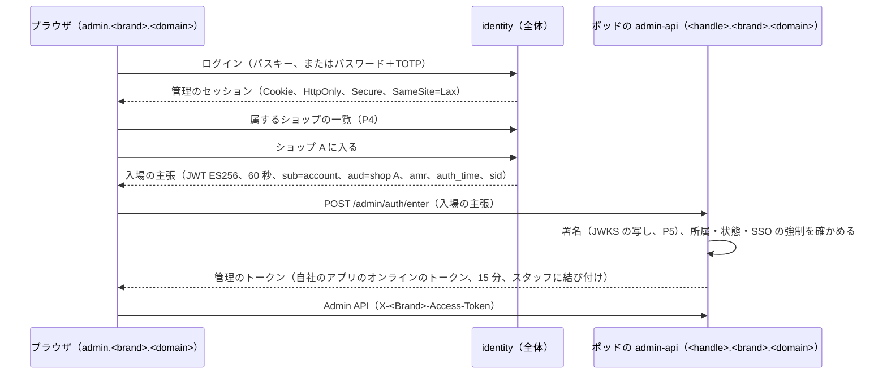
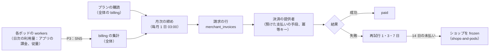

# Merchant Admin and Staff: Shopify

管理画面、スタッフのアカウントとログイン、2 段階の認証、SSO、協力者（パートナー）のアカウント、権限と役割、監査ログ、本システムから事業者への請求（プラン）、買い手のアカウント、ショップの開設の審査と顧客のデータの請求の枠を決める。

前提となる決定は、`identity`（全体の面）がスタッフのアカウントを持ち、ショップの中の権限は各ポッドが持つこと（[architecture/README.md](README.md) の 1.2 節）、スタッフのアカウントから属するショップの一覧を引く経路 P4（[ADR-0002](../decisions/0002-pods-and-shop-placement.md)）、管理画面は自社のアプリとして Admin API だけを使い、費用の上限も同じに当てること（[ADR-0009](../decisions/0009-admin-api-graphql-and-cost-limits.md)）、管理画面の `shop_id` はスタッフのセッションと選んだショップから決めること（[ADR-0003](../decisions/0003-tenancy-and-rls.md)）。要件は NFR-007（管理画面 月間 99.9%）、NFR-008（分離）、NFR-009（Admin API）。法務の確認待ちは L3（顧客のデータの削除）、L4（本システムの請求のインボイス）、L8・L10（開設の審査）。この文書で決めたことは次の ADR にある。

| ADR | 決定 |
| --- | --- |
| [0063](../decisions/0063-staff-identity-2fa-sso-and-collaborators.md) | スタッフのアカウントは `identity`（全体）に 1 つだけ持ち、2 段階の認証（パスキーか TOTP。SMS は使わない）を全員に必須にする。ショップへの入場は、`identity` が署名した 60 秒の入場の主張を、ショップのポッドが所属を確かめて管理のトークンに替える形にする。SSO（SAML 2.0・OIDC）は、ドメインを確かめた組織の単位で持つ。協力者は、パートナーの組織のアカウントが、事業者の承認で期限つきの所属を得る |
| [0064](../decisions/0064-permissions-roles-and-audit-log.md) | 権限は細かい名前の一覧にし、役割はその集まりにする。所属と役割はポッドの DB に持ち、Admin API のフィールドとミューテーションごとに要る権限をスキーマの指示で持つ。監査ログは変更と同じトランザクションでポッドの `audit_events` に追記だけで書き、ショップと日ごとのハッシュの鎖を付け、1 時間ごとに S3 の Object Lock（1 年）へ写す |
| [0065](../decisions/0065-merchant-billing-plans-and-usage.md) | 本システムから事業者への請求は、全体の面の `billing` が持つ。プランの月額、アプリの課金（[ADR-0057](../decisions/0057-app-billing.md)）、従量の利用量を、ポッドが出した利用量の事象（経路 P3）から月次に締め、決済の提供者に預けた支払いの手段で請求する。未払いは 1・3・7 日に再試行し、14 日でショップを `frozen` にする |

ショップの開設とライフサイクルは [shops-and-pods.md](shops-and-pods.md)、アプリのスコープと埋め込みは [app-platform-and-apis.md](app-platform-and-apis.md)、暗号化と運用者のアクセスは [security.md](security.md)、監査ログの置き場所の全体は [infrastructure.md](infrastructure.md) にある。

## 1. 範囲

- 扱う：
  - 管理画面の構成と速さの予算
  - スタッフのアカウント、招待、ログイン、セッション、2 段階の認証、パスワードの扱い
  - SSO（組織の単位）
  - 協力者（パートナー・制作会社）のアカウント
  - 権限の一覧、役割、所属、判定
  - 監査ログ（記録、置き場所、画面、書き出し）
  - 本システムから事業者への請求（プラン、利用量、未払い）
  - 買い手のアカウント（ストアフロントのログイン）
  - ショップの開設の審査と、顧客のデータの開示・削除の請求の枠（法務の確認待ち）
- 扱わない：
  - アプリの OAuth とスコープ（[app-platform-and-apis.md](app-platform-and-apis.md)）。オンラインのトークンは、この文書の権限と交わる
  - 運用者（社内）のショップへのアクセス（[security.md](security.md) の 8 節）
  - 個人のデータの暗号化と保持の期間（[security.md](security.md) の 5・6 節）

## 2. 要件

| 要件 | 目標 | NFR・基準 |
| --- | --- | --- |
| 可用性 | 管理画面と Admin API 月間 99.9% | NFR-007 |
| ログイン | ログイン（2 段階の認証を含む、利用者の操作を除く）p95 1 秒 | 本システムの目標 |
| 速さの予算 | 6 節 | 本システムの目標 |
| 分離 | スタッフは属するショップの、権限の範囲のデータだけ。協力者は承認した権限だけ | NFR-008、[quality.md](../quality.md) の 2.2.1 節 G |
| 監査 | 変更の操作の監査ログの欠け 0。改ざんの検出 | [quality.md](../quality.md) の 5 節（E17） |
| 権限の効き | 所属の削除・役割の変更から、トークンが使えなくなるまで 60 秒以内 | 本システムの目標 |
| 請求 | 請求の額と利用量の記録の不一致 0 | NFR-013 |

## 3. 本家の形（確かめたこと）

- 本家のスタッフの権限の一覧、協力者のアカウントの流れ、2 段階の認証の方式、SSO の提供の形、プランごとのスタッフの数、監査ログの保持は、この確認では公式の資料で見ていない（**未検証**）。本システムの値を使う。名前と画面の形を本家にどこまで似せてよいかは法務の確認待ち（L9）。

## 4. スタッフのアカウントとログイン

ADR-0063。

### 4.1 アカウント

- `identity`（全体の面）に、人ごとに 1 つのアカウント（`accounts`）を持つ。1 つのアカウントは複数のショップに属しうる。アカウントはショップのデータを持たない。
- ログインの方法：
  - パスキー（WebAuthn）を勧める。
  - メールアドレスとパスワード。パスワードは 12 文字以上、漏えいした値の一覧（k-匿名の照会）と比べて拒む。保存は Argon2id（メモリー 64 MiB、反復 3、並列 1。**初期値**、ログインの p95 で見直す）。
  - SSO（4.3 節）。
- **2 段階の認証は全員に必須**：パスキー、または TOTP（RFC 6238、30 秒、6 桁、前後 1 つの窓）。SMS は使わない（SIM の乗っ取り）。回復のコード 10 個（1 回だけ、ハッシュで保存）。パスキーでのログインは 2 段階の認証を満たす。
- 招待：所有者か `staff_manage` を持つスタッフが、メールアドレスと役割で招待する。招待のリンクは 1 回だけ、72 時間。受けた人は、既存のアカウントでログインするか、新しく作る。

### 4.2 セッションとショップへの入場

- `identity` は、ショップの所属の正本を持たない。所属の一覧（`account_shops`、ショップ ID とハンドルだけ）は、ポッドが所属の変更を outbox で出し、`identity` が写す（P4 の写し）。入場の判定は、ポッドが自分の DB の所属で行う（写しの遅れで権限を広げない）。
- 管理のトークンは 15 分で切れ、管理画面は 10 分ごとに入場をやり直す（管理のセッションが生きている間）。所属の削除・役割の変更・セッションの取り消しは、ポッドのトークンの写し（Valkey、60 秒）を消し、次の要求から効く。
- 管理のセッション：無操作 12 時間、最長 14 日。新しい端末・新しい国からのログインは、所有者とその人にメールで知らせる。
- **再確認**（直近 5 分以内の 2 段階の認証を要る操作）：スタッフの権限の変更、所有者の移転、ドメイン・決済の提供者の設定、顧客のデータの書き出し、アプリの導入と課金の承認、ショップの閉店。
- ログインの試みの上限：アカウントごとに 15 分 10 回、IP ごとに 15 分 100 回。超えたら、待ちとチャレンジ（[security.md](security.md) の 3.3 節）。

### 4.3 SSO

- **組織**：複数のショップを持つ事業者は、`identity` の組織（`organizations`）を作り、ショップを組織に結び付ける（所有者の承認）。SSO は組織の単位で、プラスのプランのショップを持つ組織に出す。
- **ドメインの確認**：組織はメールのドメインを DNS の TXT レコードで確かめる。確かめたドメインのアカウントは、組織の SSO の対象になる。
- **方式**：SAML 2.0（署名した応答と主張、`InResponseTo` と 5 分の有効の窓、再利用の拒否）と OpenID Connect（認可コード＋PKCE、`nonce`、`id_token` の署名）。IdP のメタデータと JWKS は、許可の一覧の外への通信の経路で取る（[infrastructure.md](infrastructure.md) の 2.4 節）。
- **強制**：組織が「SSO を必須」にすると、対象のドメインのアカウントは、パスワードでショップに入れない。ただし所有者は、IdP の障害に備えて、パスワード＋2 段階の認証の非常の入口を持つ（使うと組織の管理者に知らせ、監査ログに残す）。
- 2 段階の認証は IdP に任せられる（組織の設定で「IdP の多要素の認証を信頼する」）。信頼しない設定では、本システムの 2 段階の認証を重ねる。
- 利用者の自動の作成（JIT）は、組織が決めた既定の役割で行う。SCIM は MVP の後。

### 4.4 協力者（パートナー）

- パートナー（制作会社・運用代行）は、`identity` のパートナーの組織と、そのメンバーのアカウントを持つ。
- **依頼**：パートナーのメンバーが、ショップのハンドルと求める権限を出して依頼する。ショップの所有者（か `staff_manage`）が承認すると、所属（`kind = collaborator`）ができる。事業者は、依頼に 6 桁の協力者のコードを要求する設定にできる（勝手な依頼の防止）。
- **制限**：所有者だけの操作（所有者の移転、閉店、プランの変更、決済の提供者の設定）と、`customers_pii_read`・`customers_export` は、事業者が明示に選ばない限り与えない。協力者はスタッフの数に数えない。
- **期限**：既定の期限 180 日。事業者は延長・取り消しができる。最後の利用から 90 日使わない所属は自動で外す。
- パートナーの組織を外れたメンバーの所属は、組織の管理者の操作で全ショップから外れる（`identity` が各ポッドへ outbox ではなく、ポッドへの知らせの事象 P5 で配る）。

### 4.5 所有者

- ショップの所有者は 1 人。所有者の移転は、移す先のスタッフの承認と、所有者の再確認と、移した後 72 時間の取り消しの窓（旧所有者へのメール）で行う。
- 所有者のアカウントを失ったとき（2 段階の認証の喪失）の回復は、本人の確認の手順（サポート、書類の確認）で行う。手順の細部は E17 で決める。

## 5. 権限と役割

ADR-0064。

### 5.1 権限の一覧（MVP）

| 区分 | 権限 | 中身 |
| --- | --- | --- |
| 商品 | `products_read`、`products_write` | 商品、バリエーション、コレクション、メディア、メタフィールド |
| 在庫 | `inventory_read`、`inventory_write` | 拠点ごとの数の調整、移動 |
| 注文 | `orders_read`、`orders_write`、`orders_refund`、`orders_all_history` | 注文の編集・キャンセル、返金、60 日より古い注文 |
| 配送 | `fulfillment_write` | 配送の指示、送り状、追跡 |
| 顧客 | `customers_read`、`customers_pii_read`、`customers_write`、`customers_export` | 顧客の一覧（ID と集計）、氏名・住所・連絡先、編集、書き出し |
| 割引 | `discounts_read`、`discounts_write` | 割引とコード |
| フラッシュセール | `flash_sales_manage` | セールの登録と取り消し |
| テーマ | `themes_write`、`themes_code` | テーマの編集と公開、`.loom` の直接の編集（[storefront-themes.md](storefront-themes.md)） |
| アプリ | `apps_manage`、`apps_billing` | アプリの導入・削除、課金の承認（[app-platform-and-apis.md](app-platform-and-apis.md)） |
| 設定 | `settings_write`、`domains_manage`、`payments_settings`、`taxes_settings`、`legal_settings` | ショップの設定、ドメイン、決済の提供者、税、特定商取引法の表示の欄 |
| スタッフ | `staff_manage` | 招待、役割の割り当て、協力者の承認 |
| 監査・報告 | `audit_read`、`reports_read`、`data_export` | 監査ログ、売上の報告、データの書き出し |

- 所有者だけの操作（権限にしない）：所有者の移転、閉店と再開、プランの変更、組織への結び付け。
- 権限は Admin API のフィールドとミューテーションに、スキーマの指示（`@requiresPermission`）で付ける。アプリのスコープ（[ADR-0055](../decisions/0055-scopes-and-protected-customer-data.md)）と同じ仕組みで実行の前に検査する。オンラインのトークンは、アプリのスコープとスタッフの権限の交わりで効く。

### 5.2 役割

| 既定の役割 | 権限 |
| --- | --- |
| 管理者 | 所有者だけの操作を除く全部 |
| 商品担当 | 商品、在庫、割引の読み出し、テーマの読み出し |
| 注文担当 | 注文（返金を除く）、配送、顧客の読み出しと氏名・住所 |
| 配送担当 | 注文の読み出し、配送、顧客の氏名・住所 |
| マーケティング | 商品の読み出し、割引、フラッシュセール、報告 |
| 閲覧のみ | `*_read`（`customers_pii_read` を除く） |

- 事業者は独自の役割を作れる（1 ショップ 30 まで）。スタッフは複数の役割を持て、権限は和になる。
- スタッフの数の上限：ベーシック 5、アドバンス 15、プラス 1,000（本システムの値）。

### 5.3 判定の規則（DT-PERM-001 の草案）

上から順に評価し、最初に一致した行を採用する。

| # | 条件 | → 結果 |
| --- | --- | --- |
| 1 | ショップのライフサイクルが `deleting`・`deleted` | 拒否 |
| 2 | 所属がない・期限切れ・停止 | 拒否 |
| 3 | 組織が SSO を必須にし、入場の主張の `amr` が SSO でない（所有者の非常の入口を除く） | 拒否 |
| 4 | 操作が所有者だけのもので、主体が所有者でない | 拒否 |
| 5 | ショップが `frozen`・`closed` で、操作が書き込み（支払いの画面、書き出し、再開を除く） | 拒否 |
| 6 | 操作が再確認の対象で、`auth_time` が 5 分より前 | 再確認を求める |
| 7 | 主体が協力者で、権限が `customers_pii_read`・`customers_export` で、事業者が明示に与えていない | 拒否 |
| 8 | 役割の和に、操作の要る権限がすべてある | 許可 |
| 9 | それ以外 | 拒否 |

- `staff_manage` を持つスタッフは、自分の持たない権限を他人に与えられない（権限の昇格の防止）。所有者を除く。

## 6. 管理画面

- React（TypeScript）の SPA。資産は S3 と CloudFront（`admin.<brand>.<domain>`）、データは Admin API だけ（[ADR-0009](../decisions/0009-admin-api-graphql-and-cost-limits.md)）。自社のアプリとしてのバケットを使う。
- 管理画面の CSP：`default-src 'self'`、`script-src 'self'`（インラインなし）、`connect-src` は `https://*.<brand>.<domain>`、`frame-src` は導入したアプリの起点の一覧（[app-platform-and-apis.md](app-platform-and-apis.md) の 7 節）、`frame-ancestors 'none'`。

### 6.1 速さの予算

| 対象 | 予算 | 測り方 |
| --- | --- | --- |
| 最初の JavaScript（殻） | gzip で 250 KB 以下。画面ごとの分割 100 KB 以下 | CI のバンドルの大きさの検査（[delivery.md](delivery.md) の 2 節） |
| LCP | p75 2.5 秒（日本、中位のスマートフォン、4G 相当） | 実ユーザーの計測（[observability.md](observability.md) の 4 節） |
| INP | p75 200ms | 同上 |
| 一覧の画面（注文・商品 50 件）の Admin API | p95 300ms、費用 100 以下 | サーバーの計測 |
| 詳細の画面（注文 1 件） | Admin API p95 200ms | 同上 |
| 保存（ミューテーション） | p95 500ms | 同上 |

- 一覧の画面のクエリは、費用 100 以下に収める（スキーマの写しの CI で、画面のクエリの費用を数えて超えたら落とす）。
- 管理画面の検索（注文番号、顧客のメール、電話）は Aurora の索引で行う。メール・電話は暗号化した列なので、正規化した値の HMAC（ショップごとの鍵の派生。[security.md](security.md) の 5.3 節）の索引で完全一致だけを引く。部分一致は商品の名前・注文番号・タグだけ。

## 7. 監査ログ

ADR-0064。

### 7.1 記録するもの

| 区分 | 例 | 置き場所 |
| --- | --- | --- |
| ショップの変更 | 商品・価格・在庫の調整・注文の編集・返金・割引・テーマの公開・設定・ドメイン・決済の設定 | ポッドの `audit_events` |
| 権限 | 招待、所属、役割、協力者の承認、所有者の移転 | 同上 |
| 個人のデータへのアクセス | 顧客の詳細（氏名・住所）の表示、書き出し、一括の操作での顧客の読み出し | 同上 |
| アプリ | 導入、削除、スコープの更新、課金の承認 | 同上 |
| アカウント | ログイン、失敗、2 段階の認証の変更、パスキーの追加、セッションの取り消し、SSO の設定 | 全体の `identity_audit_events` |
| 運用者 | サポートのアクセス、Ops の手動の操作（在庫の直し、移し替え、凍結） | 全体の `operator_audit_events`（[security.md](security.md) の 8 節） |

- 行の中身：`event_id`（UUIDv7）、`shop_id`、主体（種類：スタッフ・協力者・アプリ・システム・運用者、ID）、`action`（`product.price_changed` の形）、対象のグローバル ID、変更（個人のデータでない項目は前後の値、個人のデータの項目は項目の名前だけ）、要求の ID、IP のハッシュ（ショップごとの鍵の HMAC）、端末の種類、時刻、`prev_hash`、`hash`。
- **欠けを作らない**：ショップの変更の監査の行は、変更と同じトランザクションで書く（`packages/audit` の関数。outbox と同じ形）。変更の関数が監査の行を書かずにコミットできないことを、lint と結合テストで確かめる。
- **追記だけ**：アプリの DB のロールは `audit_events` に INSERT だけを持つ。ハッシュの鎖はショップ・日ごとに、`hash = SHA-256(prev_hash ‖ 行の正規化した JSON)`。日の終わりの最後の値を S3 の写しに記録する。
- 個人のデータの表示の記録は、同じ顧客・同じスタッフ・同じ日の重複を 1 行にまとめる（行の数を抑える）。

### 7.2 置き場所と保持

| 置き場所 | 保持 | 用途 |
| --- | --- | --- |
| ポッドの `audit_events`（月の区分） | 90 日（プラスは 1 年） | 管理画面の監査ログの画面、Admin API の読み出し（`audit_read`） |
| log-archive の S3（Object Lock、コンプライアンスの形） | 1 年（法務の確認待ち L3 で見直す） | 改ざんの検出、調査、法令の照会 |

- ポッドの `workers` が 1 時間ごとに、前の時間の行を JSONL（ショップ・時間ごと）で log-archive のバケットへ写す（[infrastructure.md](infrastructure.md) の 1 節、E1 の `audit-log-table-and-archive`）。写した最後の `event_id` を記録し、欠けと重なりを検査する。
- 移し替え（[shops-and-pods.md](shops-and-pods.md) の 8 節）で `audit_events` も移る（ショップのデータの表）。

## 8. 本システムから事業者への請求

ADR-0065。

### 8.1 プラン

| プラン | 月額（税の扱いは法務の確認待ち L4） | 主な違い |
| --- | --- | --- |
| ベーシック | 本システムの値（PM が決める） | スタッフ 5、Admin API の回復 100/秒 |
| アドバンス | 同上 | スタッフ 15、回復 200/秒、報告 |
| プラス | 同上 | スタッフ 1,000、回復 1,000/秒、SSO、組織、フラッシュセールの待合室の優先の運用 |

- プランの上限（スタッフの数、Admin API のバケット、ショップごとの上限の値。[shops-and-pods.md](shops-and-pods.md) の 11 節）は `plan_limits`（全体）を正本にし、P5 でポッドへ写す。
- 金額は JPY の整数。価格の値は PM が決め、[capacity.md](capacity.md) の 6 節の 1 ショップあたりの原価を下回らない。

### 8.2 締めと請求

- 事業者の支払いの手段（カード）は、決済の提供者の顧客として預け、本システムは提供者の参照の ID だけを持つ（[ADR-0006](../decisions/0006-payments-via-providers.md)。カード番号に触れない）。
- 利用量の事象は（ショップ、日、種類、冪等キー）で一意にし、全体の集計で重複を除く。締めの後に届いた事象は翌月の請求に載せる。
- 請求の行は不変にし、直しは訂正の行を足す。本システム自身のインボイス（登録番号、税率ごとの税額）の形は法務の確認待ち（L4。[taxes-and-invoices.md](taxes-and-invoices.md)）。
- アプリの課金の代金と開発者の取り分は [ADR-0057](../decisions/0057-app-billing.md) のとおり。開発者への支払いの実行は法務の L5 の確認まで自動にしない。
- プランの変更は日割りにする（上げは即時、下げは次の締めから）。

## 9. ショップの開設の審査と顧客のデータの請求（枠）

- **開設の審査**：開設の後、非同期に危険の確かめ（禁止の品目の語の一致、事業者の情報の不足、支払いの手段の不正の印）を行い、印の付いたショップを人の確認の列に入れる。確認の結果で `frozen` にできる（[shops-and-pods.md](shops-and-pods.md) の 9 節）。何を審査するか、取引デジタルプラットフォームに当たるときの開示の請求・出品の停止の要請への手順は法務の確認待ち（L8・L10）。
- **顧客のデータの請求**：事業者が、買い手からの開示・削除の請求を管理画面で受け付ける。
  - 開示：顧客の行、注文、住所を JSON にまとめ、期限つきの URL（7 日）で事業者に渡す。導入したアプリへ `customers/data_request` を送る。
  - 削除：顧客の個人のデータの列（氏名、住所、電話、メール、メモ）を消し、注文の金額・税の記録は匿名の顧客 ID で残す。アプリへ `customers/redact` を送る。保持の義務のある記録（[shops-and-pods.md](shops-and-pods.md) の 10 節）は残す。
  - 何を残し、いつまでに消すか、本システムが委託先か、の判断は法務の確認待ち（L3）。仕組みは、削除の範囲を表（`redaction_policies`）で持ち、法務の結論で表を変える形にする。

## 10. 買い手のアカウント

- ショップごとの買い手のアカウント（`customers` の行に結び付く）。MVP は、メールの 1 回だけのコード（6 桁、10 分、5 回まで）でログインし、パスワードを持たない。
- セッションはショップのホストの Cookie（HttpOnly、Secure、SameSite=Lax、30 日）。キャッシュする経路に Cookie を渡さない（[ADR-0051](../decisions/0051-dynamic-islands-and-uncached-personal-data.md)）。アカウントのページと島だけがセッションを読む。
- ログインの試みの上限：メールごとに 1 時間 5 回のコードの送信、IP ごとに 1 時間 50 回。コードの総当たりは 5 回で無効。
- ログインした買い手のカートの扱いは [ADR-0028](../decisions/0028-cart-storage-in-valkey.md)。

## 11. 障害のときの振る舞い

| 障害 | 影響 | 振る舞い |
| --- | --- | --- |
| `identity` の停止 | 新しいログインと入場ができない | 発行済みの管理のトークン（15 分）は使える。管理画面は「再ログインできない」を示す。ストアフロントとチェックアウトに影響しない |
| IdP の障害 | SSO の組織のスタッフが入れない | 所有者の非常の入口（4.3 節） |
| 監査の S3 への写しの遅れ | 改ざんの検出の遅れ | ポッドの行は残る。6 時間の遅れで呼び出し |
| 請求の提供者の障害 | 請求の失敗 | 再試行。提供者の障害による失敗は未払いの日数に数えない |

## 12. 上限（まとめ）

| 対象 | 値 |
| --- | --- |
| 招待のリンク | 72 時間、1 回 |
| 管理のセッション | 無操作 12 時間、最長 14 日 |
| 入場の主張、管理のトークン | 60 秒、15 分 |
| 再確認 | 5 分 |
| ログインの試み | アカウント 15 分 10 回、IP 15 分 100 回 |
| 協力者の期限、未使用での外し | 180 日、90 日 |
| 独自の役割 | 1 ショップ 30 |
| スタッフ | 5・15・1,000（プラン） |
| 監査ログ | ポッド 90 日（プラス 1 年）、S3 1 年 |
| 未払いから凍結 | 14 日（再試行 1・3・7 日） |

## 13. data-model への項目

| 表・置き場所 | 中身 | 主キー・索引 | 節 |
| --- | --- | --- | --- |
| `accounts`（全体） | アカウント、メール、パスワードのハッシュ、状態 | `account_id`、`email` 一意 | 4.1 |
| `account_credentials`（全体） | パスキー（公開鍵、署名の回数）、TOTP の秘密（KMS で包む）、回復のコードのハッシュ | `(account_id, credential_id)` | 4.1 |
| `admin_sessions`（全体） | セッション、端末、作成、最後の利用、`amr` | `session_id`、`account_id` | 4.2 |
| `account_shops`（全体、P4 の写し） | アカウント → ショップ ID・ハンドル | `(account_id, shop_id)` | 4.2 |
| `organizations`・`organization_domains`・`organization_shops`・`sso_connections`（全体） | 組織、確かめたドメイン、結び付けたショップ、IdP の設定 | `organization_id` | 4.3 |
| `partner_orgs`・`partner_members`（全体） | パートナーの組織とメンバー | `partner_id` | 4.4 |
| `staff_members`（ポッド） | `(shop_id, account_id)`、`kind`（`owner`・`staff`・`collaborator`）、状態、期限、最後の利用 | `(shop_id, account_id)` | 4、5 |
| `staff_invitations`（ポッド） | 招待のリンク（トークンのハッシュ、宛先の暗号文、役割、72 時間） | `(shop_id, invitation_id)` | 4.1 |
| `roles`・`staff_member_roles`（ポッド） | 役割と権限の一覧、割り当て | `(shop_id, role_id)` | 5.2 |
| `collaborator_requests`（ポッド） | 依頼、求めた権限、状態 | `(shop_id, request_id)` | 4.4 |
| `audit_events`（ポッド、月の区分） | 7.1 節の行 | `(shop_id, event_id, at)`、`(shop_id, action, at)` | 7 |
| `audit_chain_heads`（ポッド） | ショップの鎖の頭（直列にする）と S3 への写しの位置 | `(shop_id)` | 7（[data-model.md](data-model.md) の D-39） |
| `identity_audit_events`・`operator_audit_events`（全体） | アカウント・運用者の監査 | `event_id` | 7.1 |
| `plan_limits`（全体）・`plan_limits_replica`（ポッド） | プランの上限 | `plan` | 8.1 |
| `merchant_subscriptions`・`billing_usage`・`merchant_invoices`・`merchant_invoice_lines`（全体） | 購読、利用量（冪等キー）、請求と行 | `(shop_id, period)` | 8.2 |
| `customer_sessions`（ポッド） | 買い手のセッションのハッシュ、期限 | `(shop_id, session_hash)` | 10 |
| `redaction_policies`（全体）、`customer_data_requests`（ポッド） | 削除の範囲、請求と進み具合 | `(shop_id, request_id)` | 9 |
| S3（log-archive） | `audit/shops/<shop_id>/<yyyy>/<mm>/<dd>/<hh>.jsonl`（ポッドに依らない）、日ごとの鎖の最後の値 | — | 7.2 |

## 14. テストと性質

- **DT-PERM-001**：5.3 節の表の全行を表駆動テストで確かめる。
- **PROP-STAFF-001（昇格なし）**：任意の役割の割り当ての操作の列で、`staff_manage` のスタッフが、自分の持たない権限を持つ所属を作れない。
- **PROP-STAFF-002（交わり）**：任意のアプリのスコープとスタッフの権限で、オンラインのトークンで読めるフィールドは、両方が許すものの部分集合。
- **PROP-STAFF-003（取り消しの効き）**：所属の削除の後 60 秒を過ぎた要求は、どのトークンでも拒まれる。
- **PROP-AUDIT-001（欠けなし）**：任意のミューテーションの列（失敗とロールバックを含む）で、コミットした変更と監査の行が 1 対 1。ロールバックした変更の監査の行は残らない。
- **PROP-AUDIT-002（鎖）**：任意の 1 行の書き換え・削除・挿入を、ハッシュの鎖の検証が見つける。
- **PROP-BILL-001（請求）**：任意の利用量の事象の列（重複、遅れ、順の入れ替え）で、請求の額が利用量の事象の重複を除いた和と一致する。
- 漏れの経路（[quality.md](../quality.md) の 2.2.1 節 G の「管理画面」）：他のショップの所属のアカウントの入場の主張、期限切れの協力者、SSO の必須を回避したパスワードのログイン。
- E2E（Playwright）：招待 → 2 段階の認証の登録 → 入場 → 権限の範囲の画面、協力者の依頼と承認、SSO（模型の IdP）。
- 速さの予算：CI のバンドルの大きさと、Lighthouse の予算（[delivery.md](delivery.md) の 2 節）。

## 15. Story の候補

| Epic | Story | 中身 |
| --- | --- | --- |
| E17 | `admin-shell` | 6 節、CSP、速さの予算 |
| E17 | `staff-accounts-and-invites` | 4.1・4.2 節（ADR-0063。PROP-STAFF-003） |
| E17 | `permissions-and-roles` | 5 節（ADR-0064。DT-PERM-001、PROP-STAFF-001・002） |
| E17 | `sso` | 4.3 節（ADR-0063） |
| E17 | `collaborator-accounts` | 4.4 節（ADR-0063） |
| E17 | `audit-trail` | 7 節（ADR-0064。PROP-AUDIT-001・002） |
| E1 | `audit-log-table-and-archive` | 7.2 節の写し |
| E17 | `merchant-billing` | 8 節（ADR-0065。PROP-BILL-001）。本システムのインボイスは法務：L4 |
| E17 | `customer-data-requests` | 9 節。法務：L3 |
| E2 | `shop-onboarding-review` | 9 節。法務：L8・L10 |
| E6 | `customer-accounts` | 10 節 |
| E17 | `leak-path-tests` | 14 節の漏れの経路 |

## 16. 未解決の問い

### 決定（2026-10-10、既定案）

- **2 段階の認証**：全員に必須、パスキーか TOTP、SMS なし（ADR-0063）。
- **入場**：`identity` の 60 秒の入場の主張を、ポッドが所属を確かめて 15 分の管理のトークンに替える（ADR-0063）。
- **SSO**：組織の単位、SAML 2.0 と OIDC、プラスのプラン（ADR-0063）。
- **権限**：細かい権限の一覧と役割、所属はポッド、スキーマの指示で判定（ADR-0064）。
- **監査ログ**：同じトランザクションの追記、ハッシュの鎖、S3 の Object Lock 1 年（ADR-0064）。
- **請求**：全体の `billing`、P3 の利用量、月次の締め、14 日で凍結（ADR-0065）。
- **買い手のログイン**：メールの 1 回だけのコード。

### 持ち越し

| 問い | いつ・どう決めるか |
| --- | --- |
| プランの価格 | PM（[capacity.md](capacity.md) の 6 節の原価を下回らない） |
| 本システムの請求のインボイスと税の扱い | **法務の確認待ち：L4** |
| 顧客のデータの削除の範囲と期限、監査ログの保持の期間 | **法務の確認待ち：L3** |
| 開設の審査の項目と手順 | **法務の確認待ち：L8・L10** |
| 管理画面とスタッフの権限の名前・見た目をどこまで本家に似せてよいか | **法務の確認待ち：L9** |
| 所有者の回復の本人の確認の手順 | E17 の `staff-accounts-and-invites` |
| SCIM | MVP の後 |

## 出典

いずれも 2026-10-10 に確認。

- W3C, [Web Authentication Level 3](https://www.w3.org/TR/webauthn-3/)（パスキー）
- IETF, [RFC 6238](https://www.rfc-editor.org/rfc/rfc6238)（TOTP）、[RFC 9106](https://www.rfc-editor.org/rfc/rfc9106)（Argon2）、[RFC 7636](https://www.rfc-editor.org/rfc/rfc7636)（PKCE）
- OASIS, [SAML 2.0](https://docs.oasis-open.org/security/saml/v2.0/)、OpenID Foundation, [OpenID Connect Core 1.0](https://openid.net/specs/openid-connect-core-1_0.html)
- NIST, [SP 800-63B](https://pages.nist.gov/800-63-4/sp800-63b.html)（漏えいした値の一覧との比較、SMS の扱い）
