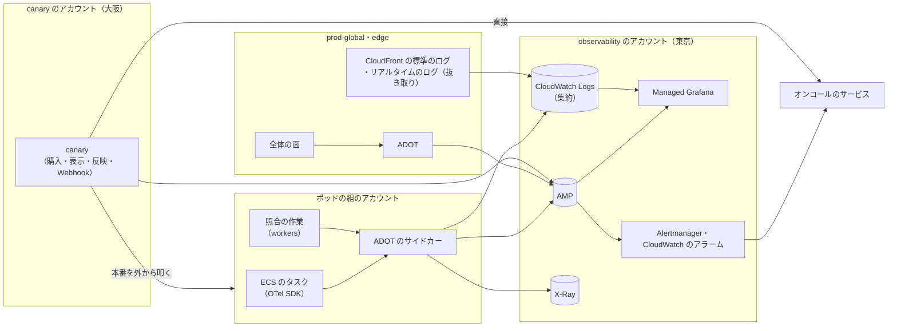

# Observability: Shopify

ログ・メトリクス・トレースの経路、ショップとポッドのラベルと系列の数の抑え方、runbooks の SLI の計測、正しさの見張り（売り越しの照合、決済済みで注文なしの照合、応答とキャッシュの監査、税の再計算、チェックアウトのスクリプトの目録）、外からの見張り（`canary`）、実ユーザーの計測、フラッシュセールのショップごとのダッシュボード、アラートを決める。SLO の値とアラートの一覧の正本は [runbooks/](../runbooks/README.md) で、この文書はその計測と実装を書く。

前提：個人のデータをログに出さない（[AGENTS.md](../../AGENTS.md)）、OpenTelemetry（ADOT）→ CloudWatch・AMP・Managed Grafana（[architecture/README.md](README.md) の 4 節）、品質の判定基準と本番での検証（[quality.md](../quality.md) の 4 節）。この文書で決めたことは次の ADR にある。

| ADR | 決定 |
| --- | --- |
| [0072](../decisions/0072-telemetry-pipeline-and-shop-cardinality.md) | 計測は ADOT から、メトリクスは observability のアカウントの AMP、ログは各アカウントの CloudWatch Logs（集約は observability のアカウント）、トレースは X-Ray へ送る。`shop_id` のラベルは、直近 5 分に要求のあったショップの、チェックアウトと元のストアフロントの粗い分布の 2 つの指標と、見張りの一覧（セール・隔離のポッド・上位 500）のショップの全指標にだけ付ける。トレースは尾での抜き取り（1%、エラーと遅いものは全部、見張りの一覧のショップは全部） |
| [0073](../decisions/0073-correctness-monitors-and-independent-canary.md) | 正しさ（売り越し、決済と注文、分離、金額、チェックアウトのスクリプト、監査ログの鎖）を、照合の作業が数を出す SLI にし、1 件でアラートにする。外からの見張り `canary` は大阪の canary のアカウントから、本番と別の資格情報で、見張りのショップで購入・表示・反映・Webhook を確かめ、アラートを observability のアカウントを経ずに直接オンコールへ送る |

アカウントと経路は [infrastructure.md](infrastructure.md)、セキュリティの事象は [security.md](security.md)、フラッシュセールの運用の段は [runbooks/](../runbooks/README.md) の 5 節にある。

## 1. 全体の流れ

- メトリクスは AMP（Prometheus の形）、ログは CloudWatch Logs（JSON、各アカウントの 30 日、observability のアカウントへの集約と S3 の写し 90 日）、トレースは X-Ray（ADOT の形で送る）。
- ダッシュボードは Managed Grafana（AMP、CloudWatch、X-Ray をデータの元にする）。
- `canary` は東京の障害でも動くように大阪に置き、アラートを observability のアカウントを通さずにオンコールのサービスへ直接送る（ADR-0073）。

## 2. 計装の規則

ADR-0072。

### 2.1 個人のデータを出さない

- ログ・トレース・メトリクスのラベルに、氏名、住所、電話、メール、決済の情報、IP（そのまま）を書かない。ID と数と理由のコードだけ。IP は日ごとの鍵の HMAC の先頭 8 バイトだけ（ボットの調査用）。
- ログの関数（`packages/obs`）は、型で許した欄だけを出す（任意の文字列の欄を持たない）。GraphQL の引数と要求の本文はログに出さない。
- 走査：ログの抜き取り（1 時間ごと、1%）を、メール・電話・郵便番号と住所・カード番号（Luhn）の形で走査し、見つけたら 1 件でチケット（[security.md](security.md) の 1 節）。

### 2.2 ラベル

| ラベル | 付ける指標 | 値の数 |
| --- | --- | --- |
| `pod`、`service`、`az`、`version` | 全部 | 小さい |
| `route`（決めた経路の名前。URL そのものでない） | 要求の指標 | 50 前後 |
| `plan` | 要求の指標 | 3 |
| `shop`（短い ID） | 下の 2 つの指標（直近 5 分に要求のあったショップだけ）と、見張りの一覧のショップの全指標 | S1 のポッドあたり、5 分に 2,000〜5,000（**初期見積もり**） |
| `app`（アプリの ID） | Admin API・Webhook・関数の指標 | 導入の多い上位 200、他は `other` |

- `shop` を付ける指標は次の 2 つだけ（隣人の影響の SLI のため）：`checkout_request_seconds`（バケット 0.25・0.5・1・1.5・3・+Inf）と `storefront_origin_seconds`（0.1・0.25・0.5・1.2・+Inf）。直近 5 分に要求のないショップの系列は出さない。
- **見張りの一覧**（`watched_shops`）：セールの `registered` から `settled` までのショップ、隔離のポッドのショップ、GMV の上位 500。全指標に `shop` を付け、トレースを全部残す。一覧は `shop-directory` が持ち、AppConfig で配る。
- AMP の活動中の系列の上限（既定の値は**未検証**）に対し、S1 で 300 万系列以下を見込む。

### 2.3 トレース

- W3C の Trace Context。エッジは `x-<brand>-request-id` を付け、元で trace の ID に結ぶ。
- 尾での抜き取り（ADOT のゲートウェイ）：通常 1%、エラー（5xx、`completeCheckout` の決定表の行 5・9、照合の呼び出し）と遅いもの（経路ごとの p99 を超えるもの）は全部、見張りの一覧のショップは全部。
- スパンの属性は `shop`、`checkout_id`、`order_id`（ID だけ）、決定表の行の番号、関数の ID と燃料。

### 2.4 ログの欄

`ts`、`level`、`service`、`pod`、`shop`、`trace_id`、`request_id`、`route`、`status`、`duration_ms`、`reason_code`、`ids`（決めた ID の欄の組）。`reason_code` は決めた一覧（`packages/obs/reasons`）からだけ取る。

## 3. SLI の計測

[runbooks/](../runbooks/README.md) の 1 節の SLI と、計測の場所。

| SLI | 良いイベント・計測 | 場所 |
| --- | --- | --- |
| チェックアウトの可用性 | `checkout_requests_total{outcome}`。在庫切れ・待合室の待ち・提供者の拒否は `outcome` で分けて数えない | `checkout` |
| チェックアウトの確定の速さ | `complete_checkout_seconds`（提供者の時間を除く：提供者の呼び出しのスパンの時間を引いた値） | `checkout` |
| チェックアウトの段の速さ | `checkout_request_seconds{route}`（カート、配送先、送料と税） | `checkout` |
| ストアフロントの可用性 | CloudFront の標準のログの 5xx の割合（ショップ・ポッドの別は関数の付けた欄で） | エッジ |
| ストアフロントの TTFB | `canary`（東京・大阪の地点、当たり・外れ）と実ユーザーの計測（4 節） | 外 |
| 管理画面と Admin API の可用性・速さ | `admin_api_requests_total`、`admin_api_seconds{cost_bucket}`（費用 100 以下を分ける） | `admin-api` |
| 売り越し | 在庫の照合の不一致の数（5 節の R） | `workers` |
| 注文の一回性 | 重複の注文の数（`orders.checkout_id` の一意の違反の試みは成功として数え、別に数える）、決済済みで注文も返金もない 15 分超の数 | `workers` の照合 |
| 金額の一致 | 価格の写し・注文・決済の金額の不一致、税の再計算の不一致 | `workers` |
| 分離 | 応答とキャッシュの監査の不一致 | `canary`・`workers` |
| 隣人の影響 | `checkout_request_seconds{shop}` からのショップごとの p99（10 分の窓）が NFR-001 を外れたショップの割合 | AMP の記録の規則 |
| キャッシュの無効化 | `canary` が見張りのショップの価格を変え、表示に出るまでの秒 | `canary` |
| Webhook の配信 | 事象の時刻から最初の試みまで（`webhook_first_attempt_seconds`） | `webhook-dispatcher` |
| 関数の実行 | `function_runs_total{result}`。本システムの原因（ホストの異常、epoch の安全網）を分ける | `function-runner` |
| 検索 | `search_seconds` | `storefront-api` |

- バーンレートは、AMP の記録の規則で 5 分・30 分・1 時間・6 時間・3 日の比を作り、runbooks の条件（1 時間 14.4 倍・6 時間 6 倍で呼び出し、3 日 1 倍でチケット）で Alertmanager が判定する。
- 見張りのショップは SLO の計算から除く（`shop` の値で除く。見張りのショップは `p00` にいる）。

## 4. 実ユーザーの計測

- ストアフロント：既定のテーマの計測のスクリプト（本システムの CDN の 1 本。[ADR-0048](../decisions/0048-storefront-scripts-csp-and-external-transmission.md)）が、TTFB・LCP・INP・CLS を、1% の抜き取りで、同じ起点の `/_<brand>/rum` へ送る。中身は、値、ページの種類、キャッシュの当たり（`x-cache` の値）、端末の種類（大まかな区分）、ショップ。IP と Cookie を保存しない。外部送信の公表の扱いは法務の確認待ち（L6）。
- 管理画面：同じ形で 10% の抜き取り。速さの予算（[merchant-admin-and-staff.md](merchant-admin-and-staff.md) の 6.1 節）を画面ごとに見る。
- 受け口は `storefront-api` の 1 つの経路で、集計（分ごと、ショップ・ページの種類ごとの分布）だけを AMP に入れる。生の値は保存しない。

## 5. 正しさの見張り

ADR-0073。どれも照合の作業が「不一致の数」を出し、0 が目標。1 件でアラート（重さは [runbooks/](../runbooks/README.md) の 1 節）。

| 見張り | 中身 | 頻度 | 出す数 |
| --- | --- | --- | --- |
| R：在庫の照合 | 拠点 × 品目の不変条件、`committed` と未配送の注文の行の和、`deny` の `available >= 0`（[inventory-and-reservations.md](inventory-and-reservations.md)） | 毎時。フラッシュセールのショップは 5 分 | `inventory_reconcile_mismatches` |
| P：決済と注文 | 提供者で成功、本システムで `completed`・`refunded` でない 15 分超。重複の注文の試み（[ADR-0005](../decisions/0005-checkout-state-machine-and-exactly-once-orders.md)） | 1 分（照合の処理）、日次（提供者の取引の一覧） | `paid_without_order_15m`、`duplicate_order_attempts` |
| M：金額 | 価格の写しの合計・注文の合計・決済の金額の一致。税の再計算の抜き取り（1%、`tax-ref`） | 注文ごと（作成の時）、日次 | `amount_mismatches`、`tax_recalc_mismatches` |
| I：分離 | `canary` が 2 つの見張りのショップのホストで同じパスを引き、他方の印（ショップごとの隠した値）が出ないこと。エッジと元の応答の抜き取り（ショップの ID と鍵の材料の比べ。値は記録しない） | 5 分、1 時間 | `tenant_audit_mismatches` |
| S：チェックアウトのスクリプト | `canary` がチェックアウトのページのスクリプトの URL とハッシュを、リリースの目録と比べる（[ADR-0067](../decisions/0067-checkout-script-integrity-and-card-testing.md)） | 5 分 | `checkout_script_mismatches` |
| A：監査ログ | S3 の写しの欠けと、ショップ・日ごとのハッシュの鎖（[ADR-0064](../decisions/0064-permissions-roles-and-audit-log.md)） | 日次 | `audit_chain_breaks`、`audit_archive_gaps` |
| C：CHECK の違反 | `deny` の品目の `available >= 0` の違反の数（売り越しの試みが DB で止まった数） | 常時（`checkout` の数え上げ） | `inventory_check_violations`（急増は SEV2） |

- 照合の作業は、ショップの ID・品目の ID・数・理由のコードだけを出す（買い手の個人のデータを出さない）。不一致は `reconcile_findings`（ポッド）に行を残し、[quality.md](../quality.md) の 4.3 節の調査と起票に使う。

### 5.1 外からの見張り（`canary`）

| 見張り | 中身 | 頻度 |
| --- | --- | --- |
| 購入 | 見張りのショップで、カード（提供者の試験の環境）とコンビニ払い（模型）で買う。注文・Webhook・確認のメールを確かめる | 5 分 |
| 表示 | 見張りのショップの商品のページを、東京・大阪の地点から、当たり・外れで取る（TTFB） | 1 分 |
| 反映 | 見張りのショップの価格を Admin API で変え、表示に出るまでの秒を測る | 5 分 |
| Webhook | 見張りのアプリの受け口で、事象から受け取りまでの秒を測る | 5 分 |
| 分離・スクリプト | 5 節の I と S | 5 分 |
| 管理画面 | 見張りのスタッフのログイン（パスキーの模型）と一覧の画面 | 15 分 |

- `canary` は canary のアカウント（大阪）で動き、本番と別の資格情報（見張りのショップのスタッフ、見張りのアプリのトークン）を使う。

## 6. フラッシュセールのショップごとのダッシュボード

セールの `prepared` で自動で作り（Grafana の雛形、変数はショップとセール）、`settled` の 7 日後に消す。見張りの一覧に入るので、全指標に `shop` が付く。

| 区画 | 見るもの |
| --- | --- |
| 待合室 | 待ちの人数、受け入れの速さ（`rate_cap`・AIMD の値）、許可証の発行・使用・拒否、売り切れの表示 |
| チェックアウト | 段ごとの p99、確定の p99、同時実行と上限、429 の数、提供者の応答の時間と結果の分布 |
| 在庫 | 品目ごとの `available` の和、枠ごとの減り方、引き当ての失敗（在庫切れ）の率、CHECK の違反、照合（5 分） |
| 決済と注文 | 注文/秒、決済済みで注文なし、`refund_required` の数 |
| ボット | WAF のブロック・チャレンジ、1 人あたりの上限の超過の印、許可証の使い回しの検出 |
| 隣人 | 同じポッドの他のショップの p99 の分布（上位 1%）、ポッドの DB の CPU と接続 |

- [runbooks/](../runbooks/README.md) の 5.2 節の「見るもの」と同じ並び。1 時間前の確認（5.1 節）は、このダッシュボードの各区画に値が出ていることを確かめる。

## 7. アラート

- アラートの一覧と重さは [runbooks/](../runbooks/README.md) の 4 節が正本。すべてのアラートは手順の URL を注釈に持つ（CI で検査）。
- 呼び出し（page）は Alertmanager → オンコールのサービス。チケットは課題の管理へ。
- 上の経路が止まったときのために、`canary` の購入の失敗（3 回続けて）と、AMP への書き込みの止まり（observability のアカウントの外から見る：`canary` が AMP の最新の値の時刻を見る）を、`canary` から直接呼び出す（デッドマンスイッチ）。

## 8. 費用（初期見積もり）

| 項目 | 月（USD） |
| --- | --- |
| CloudWatch Logs（取り込みと保存） | 4,500 |
| AMP（取り込みの点と保存、問い） | 2,000 |
| X-Ray・Grafana・その他 | 1,500 |
| 合計 | 約 8,000（**未検証**。E1 の後の実績で置き換える） |

## 9. テストと性質

- **PROP-OBS-001（個人のデータなし）**：任意の要求（個人のデータの形の値を入れたもの）で、ログ・スパン・ラベルの出力に、その値が現れない（`packages/obs` の型と、出力の走査）。
- **PROP-OBS-002（系列の上限）**：任意の要求の分布で、`shop` を付ける指標の系列の数が、直近 5 分に要求のあったショップの数 × バケットの数を超えない。
- 結合：照合の作業に、わざと不一致を作った DB（在庫、決済の模型、金額）を与え、各見張りが 1 件を出す。
- 見張りのテスト：`canary` の各見張りを staging で回し、わざと壊した場合（キャッシュの鍵の欠け、チェックアウトへのスクリプトの追加）に検出する。

## 10. Story の候補

| Epic | Story | 中身 |
| --- | --- | --- |
| E1 | `observability-baseline` | 1・2 節（ADR-0072。PROP-OBS-001・002）、`canary` の骨格 |
| E6 | `checkout-reconciler` | 5 節の P |
| E5 | `inventory-reconciliation` | 5 節の R・C |
| E18 | `slo-dashboards-alerts` | 3・7 節 |
| E13 | `flash-sale-dashboards` | 6 節 |
| E12 | `rum-and-canary` | 4 節と 5.1 節（ADR-0073） |
| E17 | `audit-chain-verification` | 5 節の A |

## 11. 未解決の問い

### 決定（2026-10-10、既定案）

- **経路**：ADOT → AMP・CloudWatch Logs・X-Ray、observability のアカウントで集める（ADR-0072）。
- **ショップのラベル**：2 つの指標と見張りの一覧だけ（ADR-0072）。
- **トレース**：尾での抜き取り 1%、エラーと遅いものと見張りの一覧は全部（ADR-0072）。
- **正しさ**：照合の不一致の数を SLI にし、1 件でアラート（ADR-0073）。
- **見張り**：大阪の canary のアカウント、直接の呼び出し（ADR-0073）。

### 持ち越し

| 問い | いつ・どう決めるか |
| --- | --- |
| AMP の系列の上限と費用、CloudWatch Logs の費用 | E1 の `observability-baseline`（**未検証**） |
| 実ユーザーの計測の外部送信の扱い | **法務の確認待ち：L6** |
| ショップのラベルの系列の数の実際 | E18 の負荷試験 |

## 12. data-model への項目

| 表・置き場所 | 中身 | 節 |
| --- | --- | --- |
| `reconcile_findings`（ポッド） | 見張りの種類、ショップ、対象の ID、数、理由のコード、時刻、処理の状態 | 5 |
| `watched_shops`（全体）・AppConfig | 見張りの一覧と理由（セール、隔離、上位） | 2.2 |
| `canary_runs`（canary のアカウント） | 見張りの結果と時間 | 5.1 |
| CloudWatch Logs | 2.4 節の欄 | 2.4 |
| AMP の記録の規則 | バーンレート、ショップごとの p99 | 3 |

## 出典

いずれも 2026-10-10 に確認。

- W3C, [Trace Context](https://www.w3.org/TR/trace-context/)
- OpenTelemetry, [Tail Sampling Processor](https://github.com/open-telemetry/opentelemetry-collector-contrib/tree/main/processor/tailsamplingprocessor)
- Google, [Web Vitals](https://web.dev/articles/vitals)（LCP、INP、CLS の定義）
