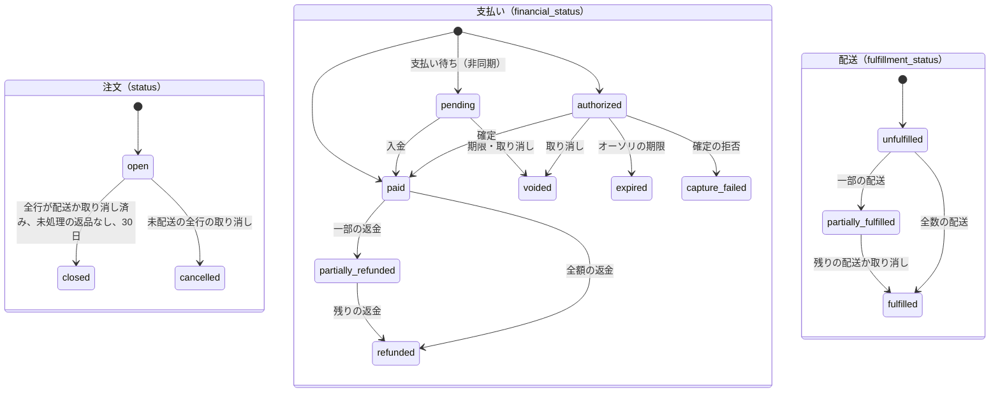
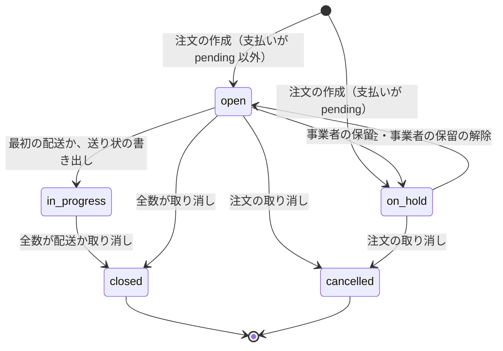

# Orders and Fulfillment: Shopify

注文と配送を決める。注文の作成と番号、注文の状態の 3 つの軸、編集とキャンセル、配送の指示と拠点、一部の配送、送料の表、配送の日時の指定、送り状の CSV と追跡の番号、運送会社の API、発送の通知を扱う。

前提となる決定は次のとおり。

- 注文は `completeCheckout` の 1 つのトランザクションで作る。`orders.checkout_id` は一意（[ADR-0005](../decisions/0005-checkout-state-machine-and-exactly-once-orders.md)、[cart-and-checkout.md](cart-and-checkout.md) の 7 節）
- 引き当てた拠点で確定する。配送は `committed` と `on_hand` を減らす（[ADR-0004](../decisions/0004-inventory-reservation-model.md)、[inventory-and-reservations.md](inventory-and-reservations.md) の 4.3 節）
- 単位ごとの支払いの額は価格の写しから注文の行に写す（[discounts-engine.md](discounts-engine.md) の 7 節）
- 売上の確定の時点は [payments-integration.md](payments-integration.md) の 8 節
- MVP は 3 社（ヤマト運輸、佐川急便、日本郵便）の送り状の CSV と、選定した 1 社の API（[architecture/README.md](README.md) の 6 節）

この文書で決めたことは次の ADR にある。

| ADR | 決定 |
| --- | --- |
| [0039](../decisions/0039-order-status-axes-and-edits.md) | 注文・支払い・配送の 3 つの軸。編集は減らす方向と配送先だけ。注文の番号はセールの間は 20 ずつの塊で取り、欠番を許す |
| [0040](../decisions/0040-fulfillment-orders-and-partial-fulfillment.md) | 拠点ごとの配送の指示を注文と同じトランザクションで作る。配送は指示の行の数の一部。拠点の変更は引き当て直し |
| [0041](../decisions/0041-shipping-rate-tables.md) | 送料はショップの表（地域 × 重さかサイズの帯）。最大の帯を超えたら箱の数を掛ける。無料の閾値は割引の後の小計。追加の料金は郵便番号の一覧 |
| [0042](../decisions/0042-carrier-integration-profiles.md) | 送り状の CSV の列の対応を、バージョンつきの運送会社の型のデータで持つ。API は 2 つの操作のアダプター。配送の日時は型の時間帯から |

## 1. 範囲

- 扱う：
  - 注文の作成（中身、番号）と状態
  - 編集（行の数を減らす・取り消す、配送先の変更）とキャンセル
  - 配送の指示（拠点ごと）、配送、一部の配送、保留、拠点の変更
  - 送料の表と計算
  - 配送の日時の指定
  - 送り状の CSV の書き出し、追跡の番号の取り込み、運送会社の API
  - 発送の通知
- 扱わない：
  - 返品と返金（[returns-and-refunds.md](returns-and-refunds.md)）
  - 決済の確定と取り消しの実行（[payments-integration.md](payments-integration.md)）
  - レシート（適格簡易請求書）（`taxes-and-invoices.md`。法務の確認待ち L4）
  - 外部の倉庫（フルフィルメントのサービス）の連携、拠点の選び方の関数（MVP の後）
  - 行の追加と差額の請求（MVP の後。[ADR-0039](../decisions/0039-order-status-axes-and-edits.md)）

## 2. 要件と本家の形

| 要件 | 目標 | NFR |
| --- | --- | --- |
| 注文の耐久性 | 確認の画面を出した注文の消失 0。AZ の障害で RPO 0 | NFR-005 |
| 一回性 | 1 つのチェックアウトの注文は 0 か 1 | NFR-006 |
| 金額 | 取り消し・編集の返金の額の、参照の計算との差 0 円 | NFR-013 |
| 送料の計算 | p99 50ms（チェックアウトの段の p99 500ms の中） | NFR-001 |
| 在庫 | 配送・取り消し・拠点の変更の後の在庫の不変条件 | NFR-004 |
| Admin API | 注文の変更のミューテーション p99 1.5 秒 | NFR-009 |

本家の形（2026-10-10 に確認）：

- 注文の振り分けの後、拠点ごとに 1 つ以上の配送の指示ができる。配送の指示は、開いた・予定・保留・進行中・閉じたなどの状態を持つ。拠点の変更は、未着手（開いた・予定・保留）の間にでき、一部の行だけを移すと配送の指示が分かれる（[FulfillmentOrderStatus](https://shopify.dev/docs/api/admin-graphql/latest/enums/FulfillmentOrderStatus)、[FulfillmentOrderAssignedLocation](https://shopify.dev/docs/api/admin-graphql/latest/objects/fulfillmentorderassignedlocation)）。
- 注文の支払いの状態は配送と別に持ち、オーソリの後に確定する（[Payment authorization and capture](https://help.shopify.com/en/manual/payments/payment-authorization)）。
- 注文の番号の振り方、送料の表の形、日本の運送会社の連携の形は、確かめられなかった（**未検証**）。

## 3. 注文の作成と状態（[ADR-0039](../decisions/0039-order-status-axes-and-edits.md)）

### 3.1 作成の中身

`completeCheckout` のトランザクションで次を書く（[cart-and-checkout.md](cart-and-checkout.md) の 7.1 節）：

- `orders`：`checkout_id`（一意）、表示の番号、写しの ID とハッシュ、合計、税率ごとの対価と税額、送料、手数料、通貨、買い手の連絡先と配送先（暗号化）、配送の方法と日時、3 つの軸の状態、`payment_due_at`・`authorization_expires_at`、`over_limit_reasons`。
- `order_lines`：品目、数、単価、税の区分、単位ごとの `product_discount`・`order_discount`・`paid_amount`（配列）、`fulfilled_qty`・`cancelled_qty`・`returned_qty`、引き当てた拠点。
- `fulfillment_orders` と行（5 節）。
- outbox：`orders/create`（Webhook、通知、検索の索引）、`payment.capture_requested`（確定の方式が `automatic` のとき）。

### 3.2 注文の番号

- 表示の番号は `order_number_counters`（ショップごと）から取る。既定の始まりは 1001、接頭辞と接尾辞はショップの設定。
- フラッシュセールの `open` の間は、`checkout` のタスクが 20 ずつの塊を取り、欠番を許す。1 ショップ 100 件/秒でも、数え上げの行の更新は 5 件/秒になる。

### 3.3 3 つの軸



- `fulfillment_status` は行の数から求める：全行で `fulfilled_qty + cancelled_qty = quantity` かつ `fulfilled_qty > 0` の行がある → `fulfilled`。どれかの行の `fulfilled_qty > 0` → `partially_fulfilled`。それ以外 → `unfulfilled`。
- 軸ごとに遷移の関数が書き、`order_events` に残す。outbox の話題は `orders/updated`・`orders/paid`・`orders/cancelled`・`orders/fulfilled`・`orders/partially_fulfilled`（webhooks の領域で話題の一覧を持つ）。

## 4. 編集とキャンセル

### 4.1 決定表 DT-ORD-001

上から順に評価する。「対象」は取り消す単位。単位は行の中の番号の大きい方から選ぶ（[ADR-0043](../decisions/0043-refund-calculation-from-unit-allocations.md)）。

| # | 支払い | 対象の単位 | 操作 | → お金 | → 在庫 |
| --- | --- | --- | --- | --- | --- |
| 1 | 任意 | 配送済み | 取り消し | 拒む（返品の流れへ） | — |
| 2 | `pending` | 未配送、全行 | 注文の取り消し | 支払いの番号の取り消し（`void`） | `committed → available` |
| 3 | `pending` | 未配送、一部 | 行の取り消し | 拒む（非同期の手段は額を変えられない。全体の取り消しか、入金の後に返金） | — |
| 4 | `authorized` | 未配送、全行 | 注文の取り消し | `void` | `committed → available` |
| 5 | `authorized` | 未配送、一部 | 行の取り消し | 確定の予定の額を減らす（確定の時に残りを解放） | `committed → available` |
| 6 | `paid`・`partially_refunded` | 未配送 | 注文・行の取り消し | 単位の `paid_amount` の和を返金（送料の返金は事業者が選ぶ） | `committed → available` |
| 7 | `expired`・`capture_failed`・`voided` | 未配送 | 注文・行の取り消し | なし | `committed → available` |
| 8 | 任意 | 未配送、ピッキングの破損 | 行の取り消し（破損） | 6 と同じか 5 と同じ | `committed → unavailable_damaged` |

- 取り消しの理由のコード：`customer`、`inventory`（欠品）、`fraud`、`payment_expired`、`declined`、`other`。
- 返金・取り消しの依頼は、返金の処理（[returns-and-refunds.md](returns-and-refunds.md) の 7 節）を通す。
- 返金の税の扱い（返還インボイス）は、返品と同じ規則（[returns-and-refunds.md](returns-and-refunds.md) の 6 節。法務の確認待ち L4）。

### 4.2 配送先の変更

- 最初の配送の作成の前だけ。配送の指示に写す。
- 送料・税は変えない。送料の差は、事業者が返金（送料の一部）か、何もしないかを選ぶ。
- 配送先の都道府県が拠点の地域の規則（[inventory-and-reservations.md](inventory-and-reservations.md) の 7 節）から外れても、拠点は変えない。事業者が 5.4 節の拠点の変更をする。

## 5. 配送の指示と配送（[ADR-0040](../decisions/0040-fulfillment-orders-and-partial-fulfillment.md)）

### 5.1 配送の指示の状態



- 配送の指示の行は、注文の行と拠点の組で、数を持つ。行の `fulfilled_qty + cancelled_qty ≤ quantity`。

### 5.2 配送の作成

1. 事業者（管理画面、Admin API、追跡の番号の取り込み、運送会社の API）が、配送の指示の行と数、運送会社、追跡の番号を指定する。
2. トランザクション：配送の指示を `FOR UPDATE` → 行の残りを確かめる → `shipments` と行を INSERT → 注文の行の `fulfilled_qty` を増やす → 在庫の `committed` と `on_hand` を減らす（`committed` のある枠を番号の順に）→ 移動の行 `fulfilled` → 軸の状態を求め直す → outbox（`fulfillments/create`、発送の通知）。
3. 同じ（運送会社、追跡の番号）の配送の再作成は、既存の配送を返す。

### 5.3 例：一部の配送

注文は [discounts-engine.md](discounts-engine.md) の 8 節のカート（合計 10,050 円、カード、確定の方式 `on_first_fulfillment`）。配送先は東京都。拠点は、T シャツと焼き菓子が東京倉庫、マグが大阪店（全行を満たす拠点がなかった）。

| 日 | 出来事 | 配送の指示 | 注文の行（配送・取り消し） | 在庫（その拠点の品目） | 支払い |
| --- | --- | --- | --- | --- | --- |
| 1 | 注文の作成 | FO-1 東京（L1×2、L2×3）`open`、FO-2 大阪（L3×1）`open` | すべて 0 | 東京：T シャツ `committed 2`、焼き菓子 `committed 3`。大阪：マグ `committed 1` | `authorized` 10,050 |
| 2 | ピッキングで焼き菓子 1 個の破損。事業者が 1 個を取り消す（DT-ORD-001 の行 8 → 5） | FO-1 の L2 は残り 2 | L2：`cancelled 1`（単位 3、983 円） | 焼き菓子 `committed 2`、`unavailable_damaged 1`（`on_hand` は変わらない） | 確定の予定の額 9,067 |
| 3 | FO-1 から発送（L1×2、L2×2）。追跡の番号を取り込み | FO-1 `closed` | L1：`fulfilled 2`、L2：`fulfilled 2` | T シャツ `committed 0`・`on_hand −2`、焼き菓子 `committed 0`・`on_hand −2` | 最初の発送で 9,067 を確定、983 を解放 → `paid` |
| 3 | 注文の配送の軸 | — | — | — | `partially_fulfilled` |
| 5 | FO-2 から発送（L3×1） | FO-2 `closed` | L3：`fulfilled 1` | マグ `committed 0`・`on_hand −1` | — |
| 5 | 注文の配送の軸 | — | — | — | `fulfilled` |
| 35 | 返品なしで 30 日 | — | — | — | 注文 `closed` |

- 2 日目の取り消しで、買い手に 983 円を請求しない。確定の前なので返金ではなく、確定の額を減らす。税の扱い（983 円は 8% の対価）は、確定の額に合わせて注文の税率ごとの集計を直す（`taxes-and-invoices.md`。法務の確認待ち L4）。
- 確定の方式が `automatic` なら、1 日目に 10,050 円を確定しており、2 日目は 983 円の返金になる（DT-ORD-001 の行 6）。

### 5.4 拠点の変更

- 未着手（`open`・`on_hold`）の配送の指示の行だけ。新しい拠点で引き当てて確定し、同じトランザクションで元の拠点の `committed` を `available` へ戻す。新しい拠点の在庫が足りなければ失敗を返す。
- 一部の行を移すと、新しい拠点の配送の指示を作る（既存の `open` の指示があればそこへ足す）。

## 6. 送料（[ADR-0041](../decisions/0041-shipping-rate-tables.md)）

### 6.1 表

- `shipping_profiles`：品目の集まり（既定の 1 つ。冷凍品などを別にできる）。
- `shipping_zones`：都道府県の集まり（47 都道府県のどれも、1 つのプロファイルの中で 1 つの地域に属する）。
- `shipping_rates`：方法（`standard`・`cool` など）、帯の種類（`size`・`weight`）、帯の上限（サイズは 60・80・100…、重さは g）、税込みの額、無料の閾値（任意）。
- `shipping_surcharges`：郵便番号の前方一致の一覧と額。中身は事業者が入れる。

### 6.2 計算

```
for each プロファイル p（カートの行の集まり）:
  zone = p の地域のうち、配送先の都道府県を含むもの（なければ配送できない）
  for each 方法 m:
    size 帯：max(品目の size_class) で帯を選ぶ
    weight 帯：Σ(重さ × 数) で帯を選ぶ。最大の帯を超えたら箱 = ceil(合計 / 最大の帯の上限)、額 = 最大の帯の額 × 箱
    追加の料金：郵便番号の前方一致の最長のもの（箱ごとに足す）
送料 = プロファイルごとの額の和（方法は買い手が選ぶ）
無料の閾値：割引の後の商品の小計（税込み）で判定し、送料の割引として扱う
```

### 6.3 例

あるショップの表（事業者の値の例）：

| 地域 | 都道府県 | 60 サイズ | 80 サイズ | 100 サイズ |
| --- | --- | --- | --- | --- |
| 関東 | 東京都・神奈川県・千葉県・埼玉県 ほか | 880 | 1,100 | 1,430 |
| 九州 | 福岡県 ほか | 1,100 | 1,320 | 1,650 |
| 沖縄 | 沖縄県 | 1,540 | 2,090 | 2,750 |

- 東京都へ、T シャツ（60）・焼き菓子（60）・マグ（60）→ 60 サイズ、880 円。無料の閾値 10,000 円（送料無料の割引 D4）を満たせば 0 円（[discounts-engine.md](discounts-engine.md) の 8 節）。
- 重さの帯（米のプロファイル、最大の帯 25 kg で 1,800 円）へ 10 kg × 3 袋 = 30 kg → 箱 `ceil(30 / 25) = 2`、3,600 円。
- 関数（配送のカスタマイズ）は方法を隠す・名前を変える・並べ替えるだけで、額は変えない。

## 7. 送り状の CSV と追跡（[ADR-0042](../decisions/0042-carrier-integration-profiles.md)）

### 7.1 運送会社の型

| 項目 | 中身 |
| --- | --- |
| 識別 | 運送会社、型のバージョン（`yamato@1` の形） |
| ファイル | 文字の符号化、改行、見出しの有無、区切り |
| 列 | 列の名前、値の式（例：`shipping_address.postal_code`、`fulfillment_order.number`）、長さの上限、全角・半角の変換、既定値 |
| 時間帯 | 値と表示の名前の一覧 |
| 取り込み | 追跡の番号の CSV の、配送の指示の番号の列と追跡の番号の列 |

- 3 社の型の中身（列、符号化、時間帯の値）は、各社の送り状の発行の道具の公式の資料で E9 の `carrier-csv` で確かめる（**未検証**）。型はデータとしてバージョンを足し、古いバージョンを消さない。
- 値の式は、決めた項目の読み出しと文字列の連結・切り出しだけを持つ小さな言語にする。外への通信、任意のコードの評価を持たない。

### 7.2 書き出しと取り込み

1. 事業者が配送の指示の集まりと型を選ぶ。
2. 書き出しの前の検査：長さの上限・必須の項目・文字の符号化で表せない文字（例：外字）を一覧で示す。黙って切らない。
3. CSV を S3（ショップのパス、期限つきの URL）に置く。配送の指示を `in_progress` にする。
4. 事業者が送り状の発行の道具で発行し、追跡の番号の CSV を取り込む。行ごとに 5.2 節の配送を作る（同じ追跡の番号は何もしない）。取り込みの結果（成功・失敗の行）を示す。

## 8. 運送会社の API と配送の日時の指定

### 8.1 API のアダプター

| 操作 | 意味 | 冪等 |
| --- | --- | --- |
| `createLabel(fulfillment_order, key)` | 送り状の発行。追跡の番号と送り状（PDF）を返す | `<fulfillment_order_id>:label:<n>` |
| `getTracking(trackingNumber)` | 配送の状況（受付、輸送中、配達済み、不在など） | — |

- 選定する 1 社の API の能力（冪等、追跡の通知）は E9 の `carrier-api-integration` で確かめる（**未検証**）。
- 追跡の照会は、配達済みでない配送について 6 時間ごと、最大 14 日。配達済みで `shipments.delivered_at` を書き、通知を出す。
- 外への通信は隔離した egress を通す（`infrastructure.md`）。認証の情報はポッドの DB に KMS の封筒の暗号で置く（[ADR-0066](../decisions/0066-encryption-and-key-layout.md)）。

### 8.2 配送の日時の指定

- ショップの設定：指定の可否、準備の日数（既定 2 日）、指定できる範囲（既定 3〜14 日後）、休業日、運送会社の型（時間帯の一覧）。
- チェックアウトの配送の方法の段で、日付と時間帯を選ばせる。指定なしも選べる。写しと注文、配送の指示に写す。
- 運送会社の時間帯の値は型から取る（**未検証**の値は E9 で確かめる）。

## 9. 通知

| 事象 | 宛先 | 中身 |
| --- | --- | --- |
| 注文の作成 | 買い手 | 注文の確認（写しの金額、支払い待ちなら支払いの案内） |
| 配送の作成 | 買い手 | 発送の知らせ（運送会社、追跡の番号、一部の配送なら残りの行） |
| 取り消し | 買い手 | 取り消しの知らせ（返金の額） |
| 支払いの期限の前（非同期） | 買い手 | 期限の 24 時間前の案内（ショップの設定で有効） |
| オーソリの期限の前 | 事業者 | 72 時間前、24 時間前（[payments-integration.md](payments-integration.md) の 8 節） |

- 通知は outbox → `notifier`。宛先は注文の買い手とショップのスタッフだけ（[quality.md](../quality.md) の 2.2.1 節 G）。文言は既定のひな形を事業者が直せる。

## 10. 障害と上限

### 10.1 障害のときの振る舞い

| 障害 | 影響 | 振る舞い |
| --- | --- | --- |
| 運送会社の API の障害 | 送り状を発行できない | CSV の書き出しに切り替えられる。追跡の照会は次の回 |
| 追跡の番号の CSV の誤り | 配送を作れない行 | 行ごとの結果を示す。成功した行だけ作る |
| 確定の失敗 | 売上が立たない | `capture_failed`。配送は止めない（事業者が判断） |
| 配送の作成と取り消しの競合 | 同じ単位の配送と取り消し | 配送の指示の行のロックで直列。後の側が残りの数で失敗 |
| 注文の番号の塊の取り忘れ（タスクの終了） | 欠番 | 許す（3.2 節） |

### 10.2 上限

| 対象 | 値 |
| --- | --- |
| 1 注文の行 | 250 |
| 1 注文の配送の指示 | 拠点の数（最大 20） |
| 1 回の CSV の書き出し | 配送の指示 2,000 |
| 1 回の追跡の番号の取り込み | 5,000 行 |
| 追跡の照会 | 6 時間ごと、最大 14 日 |
| 注文の番号の塊 | セールの間 20 |
| 配送の日時の範囲 | 既定 3〜14 日後 |
| `closed` までの日数 | 30 日 |

## 11. data-model への項目

| 表・置き場 | 中身 | 主キー・索引 | 節 |
| --- | --- | --- | --- |
| `orders` | 3.1 節の列、3 つの軸、`order_version` | `(shop_id, order_id)`、`(shop_id, checkout_id)` 一意、`(shop_id, order_number)` 一意、`(shop_id, created_at)` | 3 |
| `order_lines` | 単位ごとの按分（配列）、`fulfilled_qty`・`cancelled_qty`・`returned_qty`、拠点 | `(shop_id, order_id, line_id)` | 3.1 |
| `order_events` | 軸の遷移、理由のコード、主体 | `(shop_id, order_id, seq)` | 3.3 |
| `order_number_counters` | 次の番号 | `(shop_id)` | 3.2 |
| `fulfillment_orders` | 拠点、状態、配送先の写し、配送の日時 | `(shop_id, fulfillment_order_id)`、`(shop_id, order_id)`、`(shop_id, location_id, status)` | 5 |
| `fulfillment_order_lines` | 注文の行、数、配送・取り消しの数 | `(shop_id, fulfillment_order_id, line_id)` | 5 |
| `shipments` | 配送の指示、運送会社、追跡の番号、`delivered_at` | `(shop_id, shipment_id)`、`(shop_id, carrier, tracking_number)` 一意 | 5.2、8 |
| `shipment_lines` | 行と数 | `(shop_id, shipment_id, line_id)` | 5.2 |
| `shipping_profiles`・`shipping_zones`・`shipping_rates`・`shipping_surcharges` | 6.1 節 | `(shop_id, ...)` | 6 |
| `delivery_settings` | 8.2 節の設定 | `(shop_id)` | 8.2 |
| `carrier_profiles`（全体の参照のデータ、ポッドに写す） | 7.1 節、バージョン | `(carrier, version)` | 7 |
| `carrier_exports`・`carrier_imports` | 書き出し・取り込みの記録と結果 | `(shop_id, export_id)`、`(shop_id, import_id)` | 7.2 |
| `shop_carrier_accounts` | API の連携の設定、認証の情報（封筒の暗号。[ADR-0066](../decisions/0066-encryption-and-key-layout.md)） | `(shop_id, carrier)` | 8.1 |
| S3 | `shops/<shop_id>/carrier-exports/<export_id>.csv`、`shops/<shop_id>/labels/<shipment_id>.pdf`（ポッドに依らない） | 期限つきの URL | 7.2、8.1 |

## 12. テスト

- **PROP-ORD-001（行の数）**：任意の配送・取り消し・返品の列で、`fulfilled_qty + cancelled_qty ≤ quantity`、`returned_qty ≤ fulfilled_qty`。配送の軸が 3.3 節の規則と一致。
- **PROP-ORD-002（在庫との整合）**：配送で減らした `committed` の和が配送の数の和と一致し、在庫の不変条件（[inventory-and-reservations.md](inventory-and-reservations.md) の 4.2 節）が保たれる。照合の R2 が成り立つ。
- **PROP-ORD-003（送料の単調）**：行の重さ・数を増やしても、同じ方法の送料が減らない（無料の閾値を除く）。
- **PROP-ORD-004（取り消しの額）**：DT-ORD-001 の取り消しの額が、単位の `paid_amount` の和と一致し、返金の和が確定の額を超えない。
- **表駆動**：DT-ORD-001 の全行、5.1 節の遷移、6 節の帯の境目（上限ちょうど、1 g 超え）・閾値の境目・追加の料金の前方一致。
- **試験のベクトル**：運送会社の型ごとの書き出しの期待の CSV（生成したデータ）、5.3 節の例。
- **E2E**：注文 → 送り状の書き出し → 追跡の番号の取り込み → 発送の通知。

## 13. Story の候補

| Epic | Story | 中身 |
| --- | --- | --- |
| E9 | `order-lifecycle` | 3・4 節（ADR-0039。DT-ORD-001、PROP-ORD-001・004） |
| E9 | `fulfillment-orders` | 5 節（ADR-0040。PROP-ORD-002） |
| E9 | `shipping-rate-tables` | 6 節（ADR-0041。PROP-ORD-003） |
| E9 | `delivery-date-time` | 8.2 節 |
| E9 | `carrier-csv` | 7 節（ADR-0042） |
| E9 | `carrier-api-integration` | 8.1 節 |
| E9 | `shipping-notifications` | 9 節 |

## 14. 未解決の問い

### 決定

2026-10-10 の既定案。

- **注文の状態**：3 つの軸。編集は減らす方向と配送先だけ（ADR-0039）。
- **注文の番号**：通常は 1 つずつ、セールの間は 20 の塊、欠番を許す（ADR-0039）。
- **配送の指示**：拠点ごと、支払い待ちは `on_hold`（ADR-0040）。
- **送料**：ショップの表、帯、箱の数、閾値は割引の後（ADR-0041）。
- **運送会社**：データの型と、2 つの操作のアダプター（ADR-0042）。
- **取り消しで割引の使用の回数を戻さない**（[discounts-engine.md](discounts-engine.md) の 9 節）。

### 持ち越し

| 問い | いつ・どう決めるか |
| --- | --- |
| 3 社の CSV の形と時間帯の値 | E9 の `carrier-csv`（未検証） |
| API を連携する 1 社の選定 | E9 の `carrier-api-integration` |
| 確定の前の行の取り消しのときの税の集計の直し方 | 法務の確認待ち（L4）。`taxes-and-invoices.md` |
| 行の追加と差額の請求 | MVP の後 |
| 本家の注文の番号の振り方、送料の表の形 | 公式の資料で確かめられなかった（**未検証**） |
