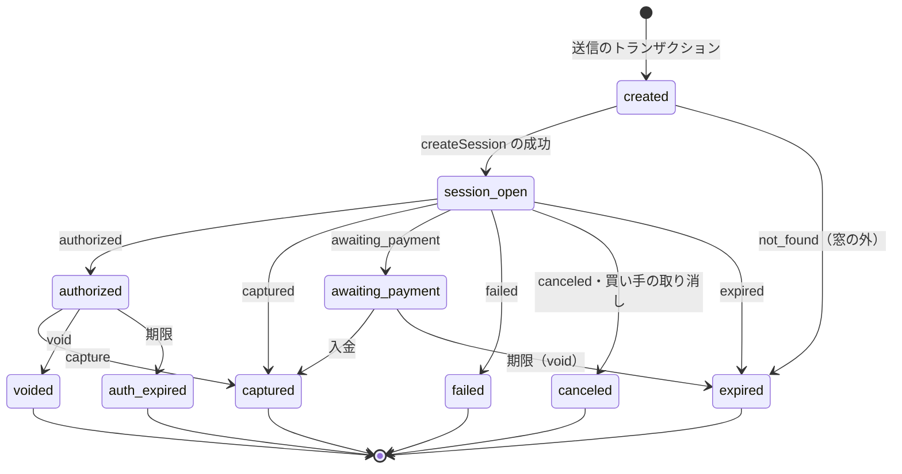
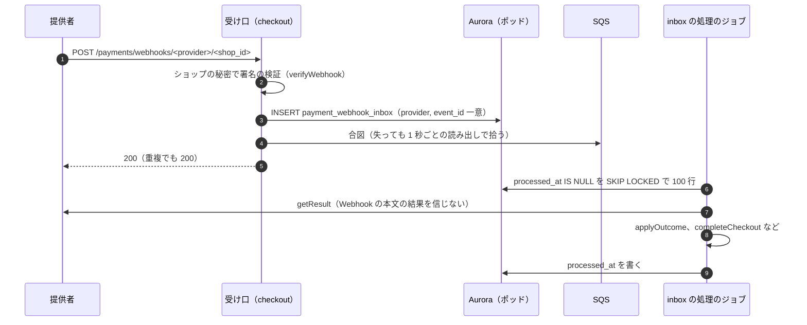
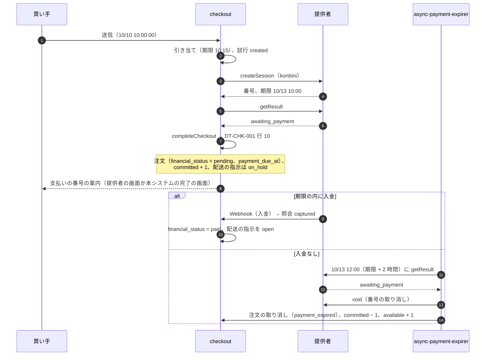

# Payments Integration: Shopify

決済の提供者との連携を決める。アダプターの契約、決済の試行の状態と結果の正規化、冪等キー、Webhook の inbox、結果の不明と照会、売上の確定とオーソリの期限、日本の決済手段（カード、コンビニ払い、銀行振込、キャリア決済、後払い）、日次の突き合わせ、提供者の選定の条件を扱う。

前提となる決定は次のとおり。

- 決済は外部の提供者に任せ、本システムはカード番号に触れない。アダプターの契約、冪等キー `<checkout_id>:<attempt>:<op>`（返金は `<refund_id>:refund`）、Webhook の inbox。照会の API と冪等を持たない提供者は選ばない（[ADR-0006](../decisions/0006-payments-via-providers.md)）
- 注文の作成と、決済だけ済んだ状態の解消は `completeCheckout` と完了の決定表 DT-CHK-001（[ADR-0005](../decisions/0005-checkout-state-machine-and-exactly-once-orders.md)、[cart-and-checkout.md](cart-and-checkout.md) の 7 節）
- 非同期の決済は番号の発行で支払い待ちの注文。売上の確定は既定で注文の作成と同時（[architecture/README.md](README.md) の 6 節）
- カード処理そのもの（保管、アクワイアラ、3D セキュア、台帳）は Stripe の題材の論点で、ここでは設計し直さない（[Stripe の payments.md](../../../stripe/docs/architecture/payments.md)）
- 決済の範囲の法令の当てはめは法務の確認待ち（L7）

この文書で決めたことは次の ADR にある。

| ADR | 決定 |
| --- | --- |
| [0035](../decisions/0035-payment-attempt-states-and-result-normalization.md) | 試行の行を提供者を呼ぶ前にコミット。試行の ID を加盟店の参照の番号にし、`findByReference` をアダプターの必須に。結果を 8 つの正規の結果に写す |
| [0036](../decisions/0036-payment-webhook-inbox-and-inquiry-schedule.md) | inbox は 1 秒ごとと SQS の合図で処理。照会は 5 秒・30 秒・2 分・5 分・10 分・以後 30 分ごとに 24 時間。手段ごとの遮断器 |
| [0037](../decisions/0037-async-payments-pending-orders.md) | コンビニ払い・銀行振込は番号の発行で支払い待ちの注文と確定。期限の 2 時間後に照会して取り消し。後の入金は返金。セールでは既定で出さない |
| [0038](../decisions/0038-capture-timing-and-authorization-expiry.md) | 確定は注文の作成の後のジョブ（既定）、最初の発送、手動。確定は 1 回。期限の 72・24 時間前に知らせ、24 時間前に自動で確定（既定） |

## 1. 範囲

- 扱う：
  - アダプターの契約と、提供者の能力の値
  - 決済の試行の状態、正規の結果、冪等キー
  - 決済のセッションの作成、リダイレクト、ホストした入力部品
  - Webhook の受け口と inbox、処理のジョブ
  - 結果の不明と照会の予定、遮断器
  - 売上の確定、取り消し、オーソリの期限
  - 日本の決済手段の流れ
  - 提供者との日次の突き合わせ
  - 提供者の選定の条件（決済の範囲の法令の当てはめは L7）
- 扱わない：
  - カード情報の保管、3D セキュアの実装、アクワイアラ、台帳、入金（Stripe の題材と各提供者）
  - 完了の決定表（[cart-and-checkout.md](cart-and-checkout.md) の 7 節）
  - 返金の額の計算と返品（[returns-and-refunds.md](returns-and-refunds.md)）。ここでは提供者への返金の依頼の契約だけ
  - 手数料（コンビニ払いの手数料）の税の区分（`taxes-and-invoices.md`。法務の確認待ち L4）
  - アプリの課金（`app-platform-and-apis.md`。法務の確認待ち L5）

## 2. 要件

| 要件 | 目標 | NFR |
| --- | --- | --- |
| 一回性 | 同じ冪等キーの要求は 1 回の効果。Webhook の重複・順序の入れ替えで効果は 1 回 | NFR-006 |
| 閉じる | 提供者で成功した決済のうち、15 分を超えて注文も返金もない件数 0 | NFR-006、K2 |
| カード番号 | 本システムのサーバー・ログ・DB にカード番号の形が現れた件数 0 | ADR-0006 |
| Webhook の受け付け | 受け口 p99 200ms、可用性 月間 99.95%（チェックアウトと同じ） | NFR-007 |
| 結果の速さ | `processing` の 90% が 1 分以内に確定 | NFR-001 |
| 突き合わせ | 日次の突き合わせの不一致は、翌営業日までに原因の分類 | runbooks の 6 節 |

## 3. 本家・提供者の形（確かめたこと）

- 本家の売上の確定は、チェックアウトでの自動（既定）、注文の全体の配送での自動（Plus は配送ごと）、手動の 3 つ。本家の決済のオーソリの期間は 7 日で、カードの種類で延びる場合がある。期限の 1 日前に知らせる設定がある（[Payment authorization and capture](https://help.shopify.com/en/manual/payments/payment-authorization)、2026-10-10 に確認）。
- Stripe の題材は、送る前に試行を記録し、結果不明を照会で確定する。キャプチャは 1 回だけ、一部のキャプチャの残りは解放する。日本の加盟店の JPY のカードの取引はオーソリを最長 30 日持てる（Stripe の本家の文書に基づく。[Stripe の payments.md](../../../stripe/docs/architecture/payments.md) の 5・7 節）。
- 日本の決済代行の各社の冪等の効き方、照会の API、Webhook の再送の規則は、選定の前で確かめていない（**未検証**）。

## 4. アダプターの契約

[ADR-0006](../decisions/0006-payments-via-providers.md) の操作に、`findByReference` を足す（[ADR-0035](../decisions/0035-payment-attempt-states-and-result-normalization.md)）。

| 操作 | 意味 | 冪等キー |
| --- | --- | --- |
| `createSession(attempt, amount, method, returnUrl, key)` | 決済のセッション。リダイレクトの URL か入力部品の値、支払いの番号（非同期の手段） | `<checkout_id>:<attempt>:session` |
| `getResult(providerRef)` | 正規の結果を返す | — |
| `findByReference(merchantRef)` | 加盟店の参照の番号（試行の ID）で照会し、`providerRef` と正規の結果を返す | — |
| `capture(providerRef, amount, key)` | 売上の確定（一部を含む、1 回） | `<checkout_id>:<attempt>:capture` |
| `void(providerRef, key)` | オーソリ・支払いの番号の取り消し | `<checkout_id>:<attempt>:void` |
| `refund(providerRef, amount, key)` | 返金（一部を含む、複数回） | `<refund_id>:refund` |
| `verifyWebhook(headers, body)` | 署名の検証、イベントの ID・種類・参照の取り出し | — |

アダプターの能力の値（`provider_capabilities`）：

| 値 | 意味 | 例 |
| --- | --- | --- |
| `methods` | 扱う手段 | `card`、`konbini`、`bank_transfer`、`carrier`、`bnpl` |
| `auth_and_capture_in_one` | セッションでの即時の確定を持つか | 真偽 |
| `authorization_ttl` | 手段・カードの区分ごとのオーソリの期限 | カード 7 日（提供者の値） |
| `lookup_consistency_window` | 作成したセッションが照会で見えるまで | 既定 5 分 |
| `partial_capture`、`multiple_refunds` | 一部の確定、複数の返金 | 真偽 |
| `refund_requires_bank_account` | 返金に買い手の口座が要る手段 | `konbini` など |
| `payment_method_fingerprint` | 決済の手段の指紋を返すか（1 人あたりの上限に使う） | 真偽 |

## 5. 試行の状態と結果の正規化（[ADR-0035](../decisions/0035-payment-attempt-states-and-result-normalization.md)）

### 5.1 正規の結果（`PaymentOutcome`）

| 結果 | 意味 |
| --- | --- |
| `authorized` | オーソリ済み、未確定 |
| `captured` | 売上の確定済み（非同期の手段の入金を含む） |
| `awaiting_payment` | 番号・振込先を発行、入金待ち |
| `processing` | 提供者で処理中（3D セキュアの途中、後払いの審査の保留を含む） |
| `failed` | 拒否・失敗（理由のコードつき） |
| `canceled` | 取り消し済み |
| `expired` | 支払いなしでセッション・番号の期限切れ |
| `not_found` | 参照の番号で見つからない |

### 5.2 写しの表 DT-PAY-001（例：Stripe の題材の PaymentIntent）

提供者ごとに同じ形の表をアダプターに置く。下は Stripe の題材の状態（[Stripe の payments.md](../../../stripe/docs/architecture/payments.md)）の写しの例。日本の決済代行の表は選定の後に足す。

| # | 提供者の状態 | 条件 | → 正規の結果 |
| --- | --- | --- | --- |
| 1 | `requires_capture` | — | `authorized` |
| 2 | `succeeded` | — | `captured` |
| 3 | `processing` | — | `processing` |
| 4 | `requires_action` | 次の動作が支払いの番号・振込先の表示 | `awaiting_payment` |
| 5 | `requires_action` | それ以外（3D セキュアの途中） | `processing` |
| 6 | `requires_payment_method` | 前の試みが失敗 | `failed` |
| 7 | `requires_payment_method`・`requires_confirmation` | 試みなし、セッションの期限の後 | `expired` |
| 8 | `canceled` | — | `canceled` |
| 9 | 照会で見つからない | 窓の内 | `processing`（DT-CHK-001 の行 3） |
| 10 | 照会で見つからない | 窓の外 | `expired` |

### 5.3 試行の状態

- 遷移は `packages/payments` の `applyOutcome(attempt, outcome)` だけが書く。同じ結果の再適用は何もしない。後戻り（`captured` → `authorized`）の結果は捨てて、警告の指標を数える（提供者の順序の入れ替え）。
- 返金は試行の状態にせず、`refunds` の和で見る（[returns-and-refunds.md](returns-and-refunds.md) の 7 節）。

## 6. Webhook の inbox（[ADR-0036](../decisions/0036-payment-webhook-inbox-and-inquiry-schedule.md)）

- 受け口の URL のショップの ID と、そのショップの秘密で署名を確かめる（[ADR-0003](../decisions/0003-tenancy-and-rls.md)）。確かめに失敗したら 400。本文は 64 KB まで。
- 本文は inbox に 30 日残し、個人のデータの列を持たない形で保存する（提供者の本文に買い手のメールアドレスがあれば、保存の前に除く）。

## 7. 照会の予定と遮断器

- **照会の予定**（`processing`、`not_found` の窓の内、照会の失敗）：5 秒、30 秒、2 分、5 分、10 分、以後 30 分ごと。24 時間で page。予定は `payment_inquiries`（次の時刻）に持ち、`payment-inquirer` が 1 秒ごとに読む。
- 照会の予定の 5 分・10 分の時点は、照合の処理（[cart-and-checkout.md](cart-and-checkout.md) の 8 節、送信から 5 分）と重なる。重なっても `completeCheckout` は冪等である。
- **遮断器**：（ショップ、提供者、手段）ごとに、直近 1 分で提供者の障害の失敗（時間切れ、5xx、提供者の障害の理由のコード）が 20 件以上かつ 50% 以上で開く。開いている間は手段を一覧から隠し、確認の段の写しにその手段を出さない。5 分後に半開き（10% を通す）。
- カードの拒否（残高の不足、不正の疑い）は遮断器で数えない。
- 遮断器が開いたら `payment-provider-outage` の ticket。全手段が閉じたら page（[runbooks/](../runbooks/README.md) の 4 節）。

## 8. 売上の確定とオーソリの期限（[ADR-0038](../decisions/0038-capture-timing-and-authorization-expiry.md)）

| 方式 | 確定の時点 | 額 |
| --- | --- | --- |
| `automatic`（既定） | 注文の作成の後、outbox の `payment.capture_requested` で `capture-worker` | 注文の合計 |
| `on_first_fulfillment` | 最初の配送の作成 | その時点の注文の残り（取り消した行を除く） |
| `manual` | 事業者の操作 | 事業者が入れた額（残り以下） |

- 確定は 1 回だけ。確定の前の行の取り消しは確定の額を減らし、残りは提供者が解放する（一部の確定を持たない提供者は、取り消しの後に新しい額で確定できないので、`void` と、事業者への「決済をやり直す」の知らせ。選定の条件で一部の確定を求める）。
- 期限：注文の `authorization_expires_at = オーソリの時刻 + authorization_ttl`。72 時間前と 24 時間前に事業者に知らせる。24 時間前に未確定で `capture_before_expiry` が有効（既定）なら、残りを確定する。
- 確定の結果不明は、同じ冪等キーで再送する。照会で確定するまで注文の `financial_status` を変えない（Stripe の題材の 7.5 節と同じ考え）。

### 例：最初の発送で確定

注文 10,050 円（[discounts-engine.md](discounts-engine.md) の 8 節）、カード、`on_first_fulfillment`、`authorization_ttl` 7 日。

| 日 | 出来事 | 確定 | 注文の `financial_status` |
| --- | --- | --- | --- |
| 1 日目 | オーソリ 10,050 円 | — | `authorized` |
| 2 日目 | 焼き菓子 1 個（983 円）を欠品で取り消し | — | `authorized`（確定の予定の額 9,067 円） |
| 3 日目 | 最初の発送（T シャツ 2、焼き菓子 2） | 9,067 円を確定。残り 983 円を解放 | `paid` |
| 5 日目 | マグを発送 | — | `paid` |

- 発送が 6 日目までなかったら、6 日目（期限の 24 時間前）に残りを確定する。

## 9. 日本の決済手段

### 9.1 流れの一覧

| 手段 | セッション | 正規の結果の流れ | 注文 | 期限 |
| --- | --- | --- | --- | --- |
| カード | ホストした入力部品（iframe）か決済ページ。3D セキュアは提供者 | `processing` → `authorized`／`captured` | オーソリで作成 | オーソリの期限（提供者の値） |
| コンビニ払い | 番号・払込票を発行 | `awaiting_payment` → `captured` | 番号の発行で支払い待ち | 支払いの期限（既定 3 日、提供者の設定） |
| 銀行振込 | 振込先（バーチャル口座）を発行 | `awaiting_payment` → `captured` | 同上 | 同上 |
| キャリア決済 | キャリアの認証へリダイレクト | `processing` → `authorized`／`captured` | 認証の成功で作成 | 提供者の値（未検証） |
| 後払い | 提供者の与信へリダイレクトか同期の与信 | `processing`（審査の保留）→ `authorized`／`failed` | 与信の成功で作成 | 提供者の値（未検証） |

- カードの入力は提供者の入力部品か決済ページだけ。チェックアウトのページの CSP（`frame-src`・`script-src`）を選んだ提供者のドメインに絞る（security の領域）。
- フラッシュセールの品目を含むチェックアウトでは、コンビニ払い・銀行振込を既定で出さない（[ADR-0037](../decisions/0037-async-payments-pending-orders.md)、[flash-sales-and-queueing.md](flash-sales-and-queueing.md) の 4 節）。

### 9.2 例：コンビニ払いの支払い待ちと在庫の確定

注文：商品 5,500 円、コンビニ払いの手数料 330 円（事業者の設定。税の区分は法務の確認待ち L4）、合計 5,830 円。支払いの期限 3 日。

| 時刻 | 在庫（その品目） | 注文 |
| --- | --- | --- |
| 送信の前 | `available 10`、`reserved 0`、`committed 0` | — |
| 10/10 10:00:00 送信 | `available 9`、`reserved 1` | — |
| 10/10 10:00:02 行 10 | `available 9`、`committed 1` | `pending` |
| 10/12 15:20 入金 | 同じ | `paid`、配送の指示 `open` |
| （入金なしの場合）10/13 12:00 | `available 10`、`committed 0` | `cancelled`（`payment_expired`） |

- 取り消しの後に入金の通知が来たら（例：10/13 13:10）、注文は戻さず、全額の返金を始める（[ADR-0037](../decisions/0037-async-payments-pending-orders.md)）。コンビニ払いの返金は `refund_requires_bank_account` の手段で、提供者の手順で買い手の口座を受ける。本システムは口座の番号を持たない。提供者がその手順を持たなければ、事業者が手で返す（注文に印を付けて示す）。
- 銀行振込の金額の過不足：不足は `pending` のまま事業者に示す。過剰は `paid` にし、差額を事業者に示す。

## 10. 日次の突き合わせ

`payment-reconciliation-daily`（ポッドごと、毎日 4 時）：

| # | 比べるもの | 不一致の分類 | 動作 |
| --- | --- | --- | --- |
| P1 | 提供者の成功の取引（照会の API の一覧か精算のファイル）に対応する試行・注文・返金があるか | 本システムに記録がない成功 | 試行を `findByReference` で引き、`completeCheckout`。試行もなければ page（SEV2 の候補） |
| P2 | 本システムの `captured` に対応する提供者の取引 | 提供者にない確定 | ticket。提供者に問い合わせ |
| P3 | 金額の一致（確定、返金） | 金額の差 | page |
| P4 | 返金の `succeeded` に対応する提供者の返金 | 提供者にない返金 | ticket |

- 結果は `payment_reconciliation_runs` に書き、事業者の画面（入金の確認）には出さない（入金は提供者の画面で見る。[ADR-0006](../decisions/0006-payments-via-providers.md)）。

## 11. 提供者の選定の条件

| 条件 | 必須 | 理由 |
| --- | --- | --- |
| 冪等キー（か、加盟店の参照の番号の重複の拒否） | 必須 | ADR-0006 |
| 照会の API（`providerRef` と加盟店の参照の番号の両方で） | 必須 | ADR-0035 |
| Webhook の署名 | 必須 | 6 節 |
| 一部の確定 | 必須 | 8 節 |
| 日本の決済手段（コンビニ払い、銀行振込、キャリア決済、後払い）の網羅 | 2 社の組で網羅 | 9 節 |
| 試験の環境 | 必須 | 契約の試験 |
| 決済の手段の指紋 | 望ましい | 1 人あたりの上限 |

- 候補（Stripe の題材の再構築したもの、日本の決済代行 2 社）の能力は未確認で、E8 の `payment-provider-selection` で確かめる。
- 本システムがカード番号を扱わない構成で、割賦販売法のカード番号等の取扱いの義務の対象にならないか、後払い・キャリア決済の提供者との契約の形は、法務の確認待ち（L7）。確認まで E8 の提供者の連携の Story を承認しない。

## 12. 障害のときの振る舞い

| 障害 | 影響 | 振る舞い |
| --- | --- | --- |
| `createSession` の時間切れ | セッションの有無が不明 | 試行は `created`。`findByReference` で照会（窓 5 分）。見つかれば続ける。窓の外で見つからなければ `expired` |
| 照会の API の障害 | 結果が確定しない | 予定どおり照会を続ける。誤って失敗にしない。24 時間で page |
| Webhook の遅れ・欠け | 完了の遅れ | リダイレクトの戻りと照合の処理で完了 |
| Webhook の署名の鍵の回しの誤り | 受け口が 400 | 提供者の再送に任せる。照会で閉じる。指標で検出 |
| 提供者の障害 | 手段が使えない | 遮断器（7 節） |
| 確定の失敗（拒否） | 売上が立たない | `capture_failed`。事業者に知らせる。注文は取り消さない |
| 返金の結果不明 | 二重の返金の恐れ | 同じキーで照会。別のキーで送り直さない（[returns-and-refunds.md](returns-and-refunds.md) の 7 節） |

## 13. 上限

| 対象 | 値 |
| --- | --- |
| Webhook の本文 | 64 KB |
| inbox の保持 | 30 日 |
| 照会の予定 | 5 秒・30 秒・2 分・5 分・10 分・30 分ごと、24 時間 |
| `lookup_consistency_window` の既定 | 5 分 |
| 遮断器 | 1 分に 20 件以上かつ 50% 以上、5 分で半開き |
| 非同期の支払いの期限の後の猶予 | 2 時間 |
| オーソリの期限の知らせ | 72 時間前、24 時間前 |

## 14. data-model への項目

| 表・置き場 | 中身 | 主キー・索引 | 節 |
| --- | --- | --- | --- |
| `payment_attempts` | チェックアウト、`attempt`、提供者、手段、金額、通貨、状態、`merchant_ref`、`provider_ref`、正規の結果、理由のコード、`authorization_expires_at` | `(shop_id, attempt_id)`、`(shop_id, checkout_id, attempt)` 一意、`(shop_id, provider, provider_ref)` | 5 |
| `payment_attempt_events` | 結果の適用の記録 | `(shop_id, attempt_id, seq)` | 5.3 |
| `payment_webhook_inbox` | 提供者、イベントの ID、種類、参照、本文（個人のデータを除く）、`processed_at` | `(shop_id, provider, event_id)` 一意、部分索引 `(received_at) WHERE processed_at IS NULL` | 6 |
| `payment_inquiries` | 試行・返金、次の時刻、回数 | `(shop_id, target_id)`、`(next_at)` | 7 |
| `payment_circuit_states`（Valkey、失ってよい） | （ショップ、提供者、手段）の失敗の数と状態 | `{<shop_id>}:pcb:<provider>:<method>` | 7 |
| `shop_payment_providers` | ショップの提供者の設定、認証の情報（封筒の暗号。[ADR-0066](../decisions/0066-encryption-and-key-layout.md)）、確定の方式、`capture_before_expiry` | `(shop_id, provider)` | 4、8 |
| `provider_capabilities`（コードの定数） | 4 節の能力の値 | — | 4 |
| `payment_reconciliation_runs` | P1〜P4 の結果 | `(shop_id, run_date)` | 10 |

- 注文の側の `financial_status`・`payment_due_at`・`authorization_expires_at` は [orders-and-fulfillment.md](orders-and-fulfillment.md) の 11 節。

## 15. テスト

- **PROP-PAY-001（試行は閉じる）**：`psp-sim` の任意の場面（セッションの作成の時間切れを含む）で、試行は有限の仮想の時間で終端の状態か `awaiting_payment` に着く。
- **PROP-PAY-002（Webhook の効果は 1 回）**：重複 0〜5 回、順序の入れ替え、リダイレクトとの競合で、`applyOutcome` と `completeCheckout` の効果が 1 回。
- **PROP-PAY-003（支払い待ち）**：支払い待ちの注文は、期限の後に `paid` か `cancelled` になり、`cancelled` なら在庫が戻る。取り消しの後の入金は返金に行き着く。
- **PROP-PAY-004（お金の保存）**：任意の取り消し・配送・返品の列で、確定の額 ＋ 解放の額 ＝ オーソリの額、返金の和 ≤ 確定の額。
- **表駆動**：DT-PAY-001（提供者ごと）、5.3 節の遷移、確定の方式 × 事象。
- **契約の試験**：アダプターごとに、同じ冪等キーの 2 回の `createSession`・`capture`・`refund` が 1 回の効果、`createSession` の時間切れの後の `findByReference`、全結果の `getResult`。
- **検査**：チェックアウトのページの CSP、ログとサーバーの要求の走査でカード番号の形（Luhn を通る 13〜19 桁）が 0（[ADR-0006](../decisions/0006-payments-via-providers.md)）。
- **障害の注入**：12 節の各行。

## 16. Story の候補

| Epic | Story | 中身 |
| --- | --- | --- |
| E8 | `payment-adapter-contract` | 4・5 節（ADR-0035。DT-PAY-001、契約の試験） |
| E8 | `payment-provider-selection` | 11 節。法務の確認待ち（L7） |
| E8 | `payment-webhook-inbox` | 6 節（ADR-0036。PROP-PAY-002） |
| E8 | `payment-inquiry-and-circuit-breaker`（新しい Story の提案） | 7 節（ADR-0036） |
| E8 | `card-payments` | 9.1 節、8 節（ADR-0038。PROP-PAY-004） |
| E8 | `konbini-and-bank-transfer` | 9.2 節（ADR-0037。PROP-PAY-003） |
| E8 | `carrier-billing-and-bnpl` | 9.1 節 |
| E8 | `refunds-and-voids` | 提供者への返金の依頼（[returns-and-refunds.md](returns-and-refunds.md) の 7 節と共有） |
| E8 | `payment-reconciliation-daily` | 10 節 |

## 17. 未解決の問い

### 決定

2026-10-10 の既定案。

- **試行と正規の結果**：送る前にコミット、`findByReference` を必須、8 つの正規の結果（ADR-0035）。
- **inbox と照会**：1 秒ごとの処理、段階の照会、手段ごとの遮断器（ADR-0036）。
- **非同期の手段**：番号の発行で注文と確定、期限 ＋ 2 時間、セールでは既定で出さない（ADR-0037）。
- **確定**：既定は作成の後のジョブ。最初の発送で確定を選べる。期限の 24 時間前の自動の確定（ADR-0038）。

### 持ち越し

| 問い | いつ・どう決めるか |
| --- | --- |
| 本システムの決済の範囲（割賦販売法）、後払い・キャリア決済の契約の形 | 法務の確認待ち（L7） |
| コンビニ払いの手数料の税の区分 | 法務の確認待ち（L4）。`taxes-and-invoices.md` |
| 提供者の候補の能力（冪等、照会、一部の確定、Webhook の再送） | E8 の `payment-provider-selection`（未検証） |
| キャリア決済・後払いの期限と確定の規則 | 同上（未検証） |
