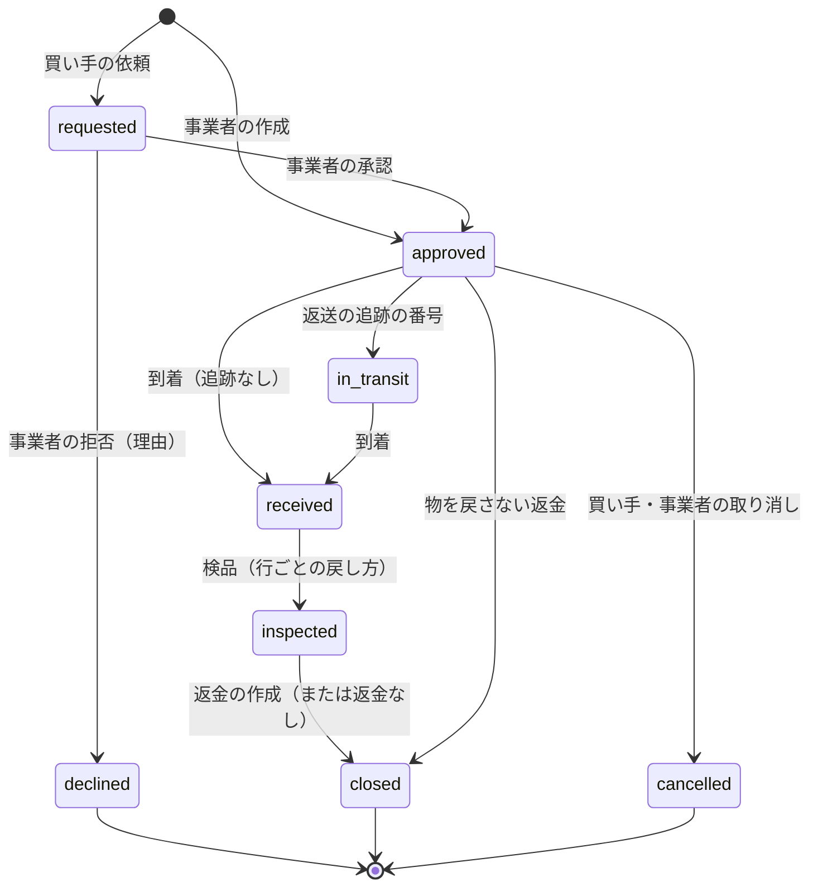
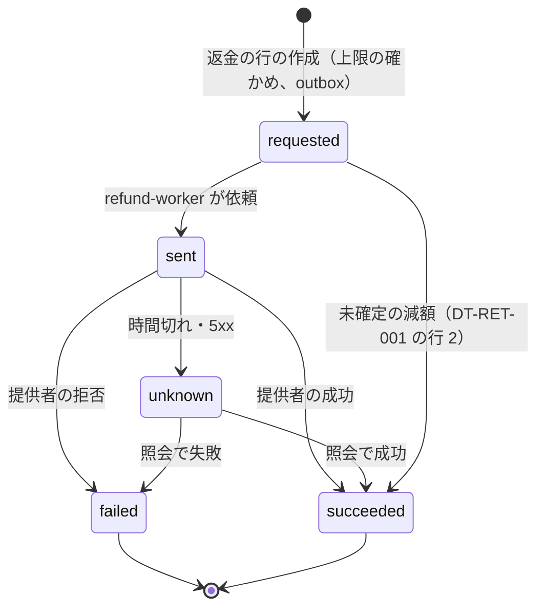

# Returns and Refunds: Shopify

返品と返金を決める。返品の受け付けと状態、検品と在庫への戻し、返金の額の計算（一部、送料、返品の手数料、割引）、返金の税（返還インボイスの元）、提供者への返金の依頼と結果の不明を扱う。返金は、返品のほかに、注文の行の取り消し、注文のないチェックアウトの返金（`refund_required`）、支払い待ちの取り消しの後の入金でも起き、すべてこの文書の返金の処理を通す。

前提となる決定は次のとおり。

- 単位ごとの支払いの額（`paid_amount`）を、写しと注文の行に残している（[ADR-0033](../decisions/0033-discount-allocation-and-rounding.md)、[discounts-engine.md](discounts-engine.md) の 7 節）
- 税は税率ごとに対価の合計から 1 回だけ丸める。返品の後の税の決め方と返還インボイスは法務の確認待ち（L4。`taxes-and-invoices.md`）
- 提供者への返金は冪等キー `<refund_id>:refund`（[ADR-0006](../decisions/0006-payments-via-providers.md)、[payments-integration.md](payments-integration.md)）
- 在庫の戻しの数の動きは [inventory-and-reservations.md](inventory-and-reservations.md) の 4.3 節

この文書で決めたことは次の ADR にある。

| ADR | 決定 |
| --- | --- |
| [0043](../decisions/0043-refund-calculation-from-unit-allocations.md) | 返金の額は返す単位の `paid_amount` の和＋送料の返金−返品の手数料。割引を取り戻さない。返金の税は差分と再計算の 2 方式を計算できる形にし、選択は法務の確認（L4）の後 |
| [0044](../decisions/0044-returns-state-and-restock.md) | 返品は受け付け → 承認 → 到着 → 検品 → 閉じるの状態の機械。検品で行ごとに戻し方。返金は別の行で、冪等キーと照会で確定。`refund_required` も同じ処理 |

## 1. 範囲

- 扱う：
  - 返品の受け付け（買い手の依頼、事業者の作成）、返品の規則（期間、対象）
  - 返品の状態、返送の追跡の番号
  - 検品と在庫への戻し（戻す・破損・戻さない）
  - 返金の額（単位、送料、返品の手数料）と上限
  - 返金の税の 2 方式の計算と記録
  - 返金の処理（提供者への依頼、取り消しとの分け、結果の不明）
  - 返還インボイスの元の値の枠
- 扱わない：
  - 返還インボイスの記載の事項と形（`taxes-and-invoices.md`。法務の確認待ち L4）
  - 交換（MVP の後。MVP は返品と新しい注文で代える）
  - ストアクレジットでの返金（MVP の後。法務の確認待ち L5）
  - 返品の特約の表示（法務の確認待ち L1。storefront-themes と [cart-and-checkout.md](cart-and-checkout.md) の 6.3 節）
  - チャージバック（提供者の側。本システムは提供者の通知を注文に印として写すだけ。payments-integration の範囲で MVP の後に詳しくする）

## 2. 要件と本家の形

| 要件 | 目標 | NFR |
| --- | --- | --- |
| 返金の額 | 参照の計算との差 0 円 | NFR-013、K6 |
| 上限 | 返金の和が確定の額を超えた件数 0 | NFR-013 |
| 一回性 | 1 つの返金の依頼で、提供者の返金は 1 回 | NFR-006 |
| 在庫 | 戻しの後の在庫の不変条件 | NFR-004 |
| 速さ | 返金の作成 p99 1.5 秒（提供者の時間を除く） | NFR-009 |

本家の形（2026-10-10 に確認）：

- 返品の操作として、返金（全額・一部）、返品（返送の送り状と追跡を任意で）、交換を持つ。買い手は注文の状況のページから、配達済みの品目の返品と未配送の品目の取り消しを依頼できる。返品と取り消しの規則（対象、期間）を事業者が決める（[Returns](https://help.shopify.com/en/manual/fulfillment/managing-orders/returns)）。
- 返品の状態の一覧、在庫への戻しの選択肢、送料・返品の手数料の扱い、返金の税の扱いは、確かめられなかった（**未検証**）。

## 3. 返品の状態（[ADR-0044](../decisions/0044-returns-state-and-restock.md)）



- 返品の行は、注文の行と数を持つ。`Σ返品の数（取り消し・拒否を除く）≤ fulfilled_qty − returned_qty`。
- 返品の規則（ショップの設定）：受付の期間（既定 配達から 30 日。配達日がなければ発送から 35 日）、対象外の品目（品目の印）、理由の一覧。
- 買い手の依頼は、注文の確認のメールの注文の状況のページ（署名つきの URL）から行う。買い手のアカウントは要らない。
- 返金は返品の状態と別の行（7 節）。事業者は、到着の前に返金を作ることもできる（返品の状態は変えない）。

## 4. 検品と在庫への戻し

| 戻し方 | 拠点の行 | 枠の行（枠 0） | 移動の行 | 注文の行 |
| --- | --- | --- | --- | --- |
| 戻す（`restock`） | `on_hand +n` | `available +n` | `return_restock` | `returned_qty +n` |
| 破損（`damaged`） | `on_hand +n`、`unavailable_damaged +n` | — | `return_damaged` | `returned_qty +n` |
| 戻さない（`no_restock`。物を受け取らない返金、廃棄） | — | — | 書かない | `returned_qty +n` |

- 戻し先の拠点は事業者が選ぶ（既定は元の配送の拠点）。
- 戻しは 1 つのトランザクションで、拠点の行と枠の行と移動の行を書く（[inventory-and-reservations.md](inventory-and-reservations.md) の 4.3 節）。
- フラッシュセールの品目の戻しは、セールの `closed` の後なら枠 0 に入る。`open` の間に戻ると、待合室の予算が増えて受け入れが再開しうる（[flash-sales-and-queueing.md](flash-sales-and-queueing.md) の 5.4 節）。

## 5. 返金の額（[ADR-0043](../decisions/0043-refund-calculation-from-unit-allocations.md)）

```
返す単位 = 行ごとに、まだ返していない単位のうち、単位の番号の大きい方から n 個
R = Σ 返す単位の paid_amount
  + 送料の返金（事業者が 0〜元の送料（割引の後）−既存の送料の返金 から選ぶ）
  − 返品の手数料（事業者が入れる税込みの額）
上限：R ≤ 確定の額（取り消しで解放した分を除く）− 既存の返金の和（failed・canceled を除く）
```

- 上限の確かめは、注文の行を `FOR UPDATE` で取ってから行う。並行の 2 つの返金で超えない。
- 割引を取り戻さない。返品で、注文の割引の条件（最低の金額）や送料の無料の閾値を下回っても、残りの単位の額を変えず、送料も請求しない。
- 返品の手数料は、返金の額から差し引く。手数料の税の区分（課税の対価か、別の扱いか）は法務の確認待ち（L4）。それまで、10% の課税の対価として返金の税の計算に入れる形にしておく。
- 返金の額を事業者が手で入れることもできる（理由つき）。そのときも上限を確かめ、単位の額との差を記録する（返還インボイスの対価は単位の額に基づく。差の扱いは L4）。

## 6. 返金の税

### 6.1 2 つの方式

| 方式 | 返金の税額（税率ごと） | 性質 |
| --- | --- | --- |
| 差分（D） | 返す単位の対価の税率ごとの和から計算し、1 回丸める | 返品だけを見て決まる。注文の残りの税額は、元の税額 − 返金の税額 |
| 再計算（C） | 元の税額 −（返品の後の注文の税率ごとの対価から計算した税額） | 注文の残りの税額が、残りの対価から計算した値と一致する |

- 両方を計算し、`refund_tax_lines` に方式の印をつけて、選んだ方を記録する。
- どちらを使うか、ショップが選べるか、返還インボイスに何を書くかは、法務の確認（L4）の後に決める。確認まで E10 の `refund-calculation` と `return-invoices` の spec を承認しない。開発の試験の既定は C。

### 6.2 例：返品と税の戻し

注文は [discounts-engine.md](discounts-engine.md) の 8 節（合計 10,050 円、確定済み）。税率ごとの対価と税額：10% 7,103 円・645 円、8% 2,947 円・218 円。

買い手が T シャツ 1 枚と焼き菓子 1 個を返品した。T シャツは戻す、焼き菓子は破損。送料の返金なし（元の送料は 0 円）。

1. 返す単位：L1 の単位 2（2,551 円）、L2 の単位 3（983 円）。
2. 返金の額 `R = 2,551 + 983 = 3,534` 円。上限 `10,050 − 0` 以下。
3. 返金の税：

| 税率 | 返す対価 | 差分（D） | 再計算（C）：返品の後の対価 → 税額 → 元との差 |
| --- | --- | --- | --- |
| 10% | 2,551 | `floor(2,551 × 10 / 110) = 231` | 4,552 → `floor(4,552 × 10 / 110) = 413` → `645 − 413 = 232` |
| 8% | 983 | `floor(983 × 8 / 108) = 72` | 1,964 → `floor(1,964 × 8 / 108) = 145` → `218 − 145 = 73` |
| 計 | 3,534 | 303 | 305 |

- 返金の額（3,534 円）はどちらの方式でも同じ。違うのは、返還インボイスに書く税額と、注文の残りの税額である。
- D では注文の残りの税額は `863 − 303 = 560` 円で、残りの対価（6,516 円）から計算した値（`413 + 145 = 558` 円）と 2 円違う。C では一致する。
- 在庫：東京倉庫の T シャツ `on_hand +1`・`available +1`、焼き菓子 `on_hand +1`・`unavailable_damaged +1`。
- 返品の手数料 550 円を差し引く場合：`R = 3,534 − 550 = 2,984` 円。手数料の税の扱いは L4 の確認の後に、6.1 節の表に行を足す。

## 7. 返金の処理

### 7.1 起点

| 起点 | 返金の行の作成 | 額 |
| --- | --- | --- |
| 返品 | 事業者（検品の後、または前） | 5 節 |
| 注文・行の取り消し（確定の後） | 取り消しの操作（[orders-and-fulfillment.md](orders-and-fulfillment.md) の 4 節） | 5 節（返す単位 = 取り消す単位） |
| `refund_required`（注文のないチェックアウト） | `completeCheckout` の決定表の行 5・6・9（[cart-and-checkout.md](cart-and-checkout.md) の 7.2 節） | 決済の全額 |
| 支払い待ちの取り消しの後の入金 | 期限の処理（[payments-integration.md](payments-integration.md) の 9.2 節） | 入金の全額 |

### 7.2 決定表 DT-RET-001（取り消しか返金か）

| # | 決済の状態 | → 動作 |
| --- | --- | --- |
| 1 | `authorized`（未確定）、全額 | `void` |
| 2 | `authorized`（未確定）、一部 | 確定の予定の額を減らす（確定の時に残りを解放）。提供者に送らない |
| 3 | `captured`、手段がカード・キャリア決済・後払い | `refund`（額） |
| 4 | `captured`、手段が `refund_requires_bank_account` の手段（コンビニ払いなど） | `refund`（提供者の口座の受け付けの手順）。手順を持たない提供者は、事業者が手で返す印 |
| 5 | `awaiting_payment` | `void`（番号の取り消し）。返金ではない |

### 7.3 返金の状態



- `refund-worker` は outbox の `refund.requested` で動き、冪等キー `<refund_id>:refund` で依頼する。`unknown` の間は、同じキーでの照会だけを行い、別のキーで送り直さない（[Stripe の payments.md](../../../stripe/docs/architecture/payments.md) の 7.5 節と同じ考え）。照会の予定は [payments-integration.md](payments-integration.md) の 7 節。
- `failed` は事業者に知らせ、事業者が別の方法（手で振り込む）を記録できる（`refunds.manual_settlement`）。
- 成功で、注文の `financial_status` を `partially_refunded`・`refunded` にし、outbox に `refunds/create` を書き、買い手に知らせる。
- `refund_required` のチェックアウトは、返金の成功で `refunded` にする。

## 8. 返還インボイスの枠（法務の確認待ち L4）

- 返金ごとに、返還インボイスの元の値を `refund_tax_lines` と返金の行から出せる形で持つ：返金の日、税率ごとの返す対価の和、税率ごとの返金の税額（選んだ方式）、元の注文の番号、ショップの登録番号の参照。
- 記載の事項、形、元のレシートとの関係、交付の方法は、`taxes-and-invoices.md` で法務の確認（L4）の後に決める。

## 9. 障害と上限

### 9.1 障害のときの振る舞い

| 障害 | 影響 | 振る舞い |
| --- | --- | --- |
| 提供者の返金の時間切れ | 二重の返金の恐れ | `unknown`。同じキーで照会だけ |
| 提供者の返金の拒否 | 返金できない | `failed`。事業者に知らせる。手での決済を記録できる |
| 並行の返金 | 上限を超える恐れ | 注文の行のロック。後の側は上限で失敗 |
| 返品の戻しと在庫の調整の競合 | 数の誤り | 在庫の関数のトランザクションと CHECK で守る |

### 9.2 上限

| 対象 | 値 |
| --- | --- |
| 返品の受付の期間 | 既定 配達から 30 日（ショップの設定、1〜365 日） |
| 1 注文の返金の数 | 50 |
| 1 注文の返品の数 | 20 |
| `unknown` の照会 | [payments-integration.md](payments-integration.md) の 7 節（24 時間で page） |

## 10. data-model への項目

| 表・置き場 | 中身 | 主キー・索引 | 節 |
| --- | --- | --- | --- |
| `returns` | 注文、状態、理由、返送の追跡の番号、作成の主体 | `(shop_id, return_id)`、`(shop_id, order_id)` | 3 |
| `return_lines` | 注文の行、数、単位の番号、戻し方、戻し先の拠点 | `(shop_id, return_id, line_id)` | 3、4 |
| `return_policies` | 受付の期間、対象外の品目の印、理由の一覧 | `(shop_id)` | 3 |
| `refunds` | 起点（返品、取り消し、チェックアウト、入金）、額、送料の返金、返品の手数料、状態、冪等キー、`provider_ref`、`manual_settlement` | `(shop_id, refund_id)`、`(shop_id, order_id)`、`(shop_id, checkout_id)` | 7 |
| `refund_lines` | 返す単位（行、単位の番号、`paid_amount`） | `(shop_id, refund_id, line_id, unit_no)` | 5 |
| `refund_tax_lines` | 税率、返す対価、D の税額、C の税額、選んだ方式 | `(shop_id, refund_id, tax_rate)` | 6 |
| `refund_events` | 状態の遷移 | `(shop_id, refund_id, seq)` | 7.3 |

## 11. テスト

- **PROP-RET-001（上限）**：任意の返品・取り消し・返金の列と並行で、返金の和 ≤ 確定の額。
- **PROP-RET-002（全額の保存）**：全単位を返し、送料を全額返したとき、返金の和 = 注文の合計（手数料なし）。
- **PROP-RET-003（税の 2 方式）**：D と C の税額が参照の実装 `tax-ref` と一致する。C では、返品の後の注文の残りの税額が、残りの対価から計算した値と一致する（[quality.md](../quality.md) の 2.2.1 節 D）。
- **PROP-RET-004（返金は 1 回）**：依頼の重複、時間切れ、照会の遅れで、提供者の返金は 1 回。
- **PROP-RET-005（在庫）**：返品の戻しの後に、在庫の不変条件と照合の R1〜R4 が成り立つ。
- **表駆動**：DT-RET-001、3 節の遷移、4 節の戻し方の表。
- **試験のベクトル**：6.2 節の例（差分と再計算、手数料あり）。

## 12. Story の候補

| Epic | Story | 中身 |
| --- | --- | --- |
| E10 | `returns` | 3 節（ADR-0044） |
| E10 | `refund-calculation` | 5・6 節（ADR-0043。PROP-RET-001〜003）。税の方式は法務の確認待ち（L4） |
| E10 | `restock-on-return` | 4 節（PROP-RET-005） |
| E10 | `return-invoices` | 8 節。法務の確認待ち（L4） |
| E8 | `refunds-and-voids` | 7 節（DT-RET-001。PROP-RET-004） |

## 13. 未解決の問い

### 決定

2026-10-10 の既定案。

- **返金の額**：単位の `paid_amount` の和。割引を取り戻さない（ADR-0043）。
- **返す単位**：単位の番号の大きい方から（ADR-0043）。
- **返品と返金**：別の行。返金の処理は 1 つ（ADR-0044）。
- **受付の期間**：既定 配達から 30 日。
- **交換**：MVP では持たない。

### 持ち越し

| 問い | いつ・どう決めるか |
| --- | --- |
| 返金の税の方式（D・C）、返還インボイスの記載 | 法務の確認待ち（L4） |
| 返品の手数料の税の区分 | 法務の確認待ち（L4） |
| 返品の特約の表示 | 法務の確認待ち（L1） |
| ストアクレジットでの返金 | MVP の後。法務の確認待ち（L5） |
| 本家の返品の状態・戻し方・送料と手数料の扱い | 公式の資料で確かめられなかった（**未検証**） |
