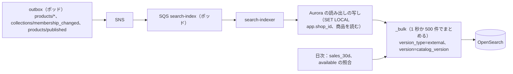

# Search and Recommendations: Shopify

ショップの中の商品の検索（日本語）、絞り込みと並べ替え、予測の検索、関連の商品（共起と人気）、OpenSearch の索引の形と更新、ショップの分離を決める。

前提となる決定は、検索は Amazon OpenSearch Service を汎用の部品として使い、順位付けとおすすめの規則は自前で持つこと（[ADR-0001](../decisions/0001-platform-and-stack.md)）、ショップを単位にポッドへ閉じること（[ADR-0002](../decisions/0002-pods-and-shop-placement.md)）、検索は RLS で守れないので鍵の先頭のショップと試験で守ること（[ADR-0003](../decisions/0003-tenancy-and-rls.md)）、カタログの変更の事象と `catalog_version`（[ADR-0016](../decisions/0016-collection-membership-and-catalog-events.md)）。要件は NFR-014（検索 p95 200ms、変更の反映 p95 30 秒）と NFR-008（他のショップの商品を出さない）。この文書で決めたことは次の ADR にある。

| ADR | 決定 |
| --- | --- |
| [0052](../decisions/0052-search-index-per-pod-and-japanese-analysis.md) | OpenSearch のドメインをポッドごとに 1 つ持ち、ポッドのショップの商品を 1 つの索引（別名つき）に入れ、`shop_id` で振り分け（routing）る。検索は `packages/search` の 1 つの関数だけが組み立て、必ず `shop_id` の絞り込みと振り分けを付け、結果の各件の `shop_id` を返す前に確かめる。日本語は Sudachi の形態素の解析（正規化した形）と ICU の正規化、未知の語のための 2-gram の欄、読みの欄を持つ。順序の入れ替えは `catalog_version` を外部のバージョンにして防ぐ |
| [0053](../decisions/0053-search-ranking-and-recommendations.md) | 順位は、欄ごとの重みの BM25 に、売れ行き（`log1p(直近 30 日の数)`）と在庫ありの係数を掛ける決めた式で付け、同じ得点は商品の ID の順にする。同義語はショップごとの表を、索引の解析器でなく、問い合わせの時の展開で使う。関連の商品は、直近 90 日の注文の共起の数（日次の計算）を主に、同じコレクションの人気で埋める |

## 1. 範囲

- 扱う：
  - 索引の形、欄、日本語の解析、同義語
  - 索引の更新（事象から索引へ）、作り直し
  - 検索の問い合わせ、絞り込み（ファセット）、並べ替え、ページング
  - 予測の検索（入力の途中の候補）
  - 関連の商品・合わせて買う商品
  - ショップの分離と、障害のときの振る舞い
- 扱わない：
  - 商品のデータ（[catalog-and-pricing.md](catalog-and-pricing.md)）
  - 検索の結果のページの描画とキャッシュ（[storefront-themes.md](storefront-themes.md)、[storefront-api-and-caching.md](storefront-api-and-caching.md)）
  - 管理画面の検索（注文・顧客の検索）。MVP は Aurora の索引で行う（`merchant-admin-and-staff.md`）
  - ショップをまたぐ検索（MVP の後。[roadmap.md](../roadmap.md) の延期の一覧）
  - 機械学習のおすすめ（MVP の後）

## 2. 事実（確かめたこと）

いずれも 2026-10-10 に確認。

| 項目 | 内容 | 出典 |
| --- | --- | --- |
| 日本語の解析 | Amazon OpenSearch Service は Japanese（kuromoji）Analysis と ICU Analysis を全ドメインに含む。Sudachi Analysis は任意の追加で、日本語に推す、と書く。Sudachi の辞書の差し替えは、次の blue/green の展開まで効かない。別名を使った索引の作り直しで替える方法がある | [Plugins by engine version](https://docs.aws.amazon.com/opensearch-service/latest/developerguide/supported-plugins.html) |

- 本家の商品の検索の方式（エンジン、日本語の扱い、順位）は、公式の資料で確かめていない（**未検証**）。

## 3. 要件

| 要件 | 目標 | NFR・基準 |
| --- | --- | --- |
| 検索の速さ | 検索の結果（24 件、ファセット 5 つ）p95 200ms（元で） | NFR-014 |
| 予測の検索 | p95 100ms | NFR-014 |
| 反映 | 商品の変更（作成、更新、公開、削除）が検索に出るまで p95 30 秒 | NFR-014 |
| 分離 | 他のショップの商品が、候補・結果・ファセットの数に出ない | NFR-008、[quality.md](../quality.md) の 2.2.1 節 G |
| 公開 | 販売のチャネルに公開していない商品を出さない | [catalog-and-pricing.md](catalog-and-pricing.md) の 8 節 |
| 決定性 | 同じ索引の状態・同じ問い合わせで、同じ順序 | ページングの重なりと抜けを防ぐ |

## 4. 索引

ADR-0052。

### 4.1 置き場所と形

- **ドメイン**：ポッドごとに 1 つ（S1 は 4＋隔離のポッド 1）。3 AZ、専用のマスター 3、データのノードはポッドの商品の数で決める（`capacity.md`）。ポッドの障害の範囲と、検索の障害の範囲を揃える。
- **索引**：ポッドに 1 つの商品の索引（`products_v<スキーマの番号>`）と別名 `products`。文書は商品ごとに 1 つ（バリエーションは配列の欄）。S1 のポッドあたり、商品およそ 125 万（バリエーション 625 万 ÷ 平均 5）。主のシャードは 12、写し 1（1 シャード 10〜30 GB の目安。`capacity.md` で見直す）。
- **振り分け**：`_routing = shop_id`。1 つのショップの商品は 1 つのシャードに集まり、検索は 1 シャードだけを読む。商品が 5 万を超えるショップは、`routing_partition_size = 4`（索引の作成の時の設定）の範囲で 4 シャードに広がる。設定は索引の単位なので、索引の作成の時に 4 で作り、小さなショップも 4 シャードの部分に入る。
- **文書の ID**：`<shop_id>:<product_id>`。

### 4.2 欄

| 欄 | 型・解析 | 用途 |
| --- | --- | --- |
| `shop_id` | keyword | 必ず絞る |
| `channels` | keyword の配列 | 公開した販売のチャネル（`online_store`、`headless:<app_id>`） |
| `status_visible_from` | date | `active` で公開した時刻（予約の公開） |
| `title` | text（`ja`）＋ 子の欄 `title.bigram`（2-gram）、`title.reading`（読み、カタカナ） | 検索、予測 |
| `body` | text（`ja`）、安全化した HTML から文字だけ | 検索（低い重み） |
| `vendor`、`product_type`、`tags`、`category_path` | keyword＋ `ja` の子の欄 | 絞り込み、検索 |
| `skus`、`barcodes` | keyword（正規化：NFKC、大文字） | 完全一致 |
| `options.<名前>` | keyword の配列（ショップごとのオプションの名前を `options_kv`（`名前=値`）の 1 つの keyword の配列で持つ。欄の名前の爆発を防ぐ） | ファセット |
| `price_min`、`price_max` | long（基本の通貨の最小単位） | 絞り込み、並べ替え |
| `available` | boolean（目安） | 絞り込み、順位の係数 |
| `sales_30d` | integer | 順位 |
| `collections` | keyword の配列（コレクションの ID） | コレクションの中の絞り込み |
| `metafields_kv` | keyword の配列（`ns.key=値`。定義で「絞り込みに使う」にしたものだけ） | ファセット |
| `created_at`、`published_at` | date | 並べ替え |
| `catalog_version` | long | 外部のバージョン |

- 索引の欄の数は、ショップに依らず固定（`options_kv`・`metafields_kv` の形で、ショップの値で欄が増えない）。

### 4.3 日本語の解析

```text
char_filter : icu_normalizer（NFKC。全角英数 → 半角、半角カナ → 全角）
tokenizer   : sudachi_tokenizer（split_mode: C、辞書：標準＋本システムの EC の語の追加辞書）
filters     : sudachi_normalizedform（表記の揺れの正規化）、sudachi_part_of_speech（助詞・助動詞・記号を除く）、
              sudachi_ja_stop、lowercase、長音の除去（末尾の「ー」を除く自前の規則）
title.bigram: icu_normalizer → ngram（2〜2）→ lowercase           ← 辞書にない語、ブランドの名前
title.reading: sudachi_tokenizer → sudachi_readingform（カタカナ）→ edge_ngram（1〜10）  ← 予測
search 時   : 同じ解析。ただし入力のひらがなを icu_transform（Hiragana-Katakana）で読みの欄に合わせる
```

- 例：「アイフォン ケース 手帳型」と「iPhoneケース てちょうがた」
  - `title`：「iPhone」「ケース」「手帳」「型」に分かれる（`normalizedform` で全角・半角の差を除く）。
  - 2 つ目の入力の「てちょうがた」は形態素では一致しないが、読みの欄（「テチョウガタ」）と 2-gram の欄で拾う。
- 本システムの追加辞書は、ショップごとに持たない（解析器は索引の単位）。ショップの固有の語は 2-gram と同義語の展開（5.3 節）で補う。
- 辞書の差し替えは、新しい索引（`products_v<n+1>`）を作り、作り直して別名を移す（4.5 節）。四半期に 1 回まで。

### 4.4 更新



- `search-indexer` は事象の中身を使わず、事象を受けたら商品を読み直して文書を作る（事象が欠けても、次の事象で正しい形になる）。
- 外部のバージョン（`catalog_version`）で書くので、古い事象が後に届いても、新しい文書を上書きしない。削除は、`catalog_version` を上げた削除の印の文書（`deleted: true`）で書き、日次で消す。
- 索引の `refresh_interval` は 1 秒。反映の時間 ≒ outbox の遅れ（p95 2 秒）＋まとめ（1 秒）＋refresh（1 秒）で、p95 30 秒に余裕がある。
- `available` と `sales_30d` は速く変わるので事象で更新せず、日次（`sales_30d`）と 15 分ごと（`available` の差分。在庫の領域の `inventory_levels/update` の事象をまとめる）で部分の更新をする。在庫の有無の絞り込みは目安で、買えるかどうかはチェックアウトで決まる。
- 予約の公開は、`status_visible_from` で問い合わせの時に絞る（ジョブを待たない）。

### 4.5 作り直し

1. 新しい索引（`products_v<n+1>`）を作る。
2. `search-indexer` を二重の書き込み（古い索引と新しい索引）にする。
3. ポッドの全ショップの商品を、ショップごとに読み直して新しい索引に入れる（`reindex_jobs`、ショップごとの印）。
4. ショップごとの件数を比べ、全部が合えば別名 `products` を新しい索引に移す。
5. 7 日の後に古い索引を消す。

## 5. 検索

### 5.1 問い合わせの組み立て

`packages/search` の `searchProducts(ctx, query)` だけが OpenSearch の問い合わせを作る。`ctx` は要求の `shop_id`・販売のチャネル・時刻を持ち、`query` は利用者の入力。

```json
{
  "query": {
    "function_score": {
      "query": {
        "bool": {
          "filter": [
            { "term": { "shop_id": "<ctx.shop_id>" } },
            { "term": { "channels": "<ctx.channel>" } },
            { "range": { "status_visible_from": { "lte": "<ctx.now>" } } },
            { "term": { "deleted": false } }
          ],
          "must": [ { "bool": { "should": [
            { "multi_match": { "query": "<q>", "fields": ["title^3", "vendor^2", "tags^2", "product_type^1.5", "body^0.5"], "type": "best_fields", "operator": "and" } },
            { "match": { "title.bigram": { "query": "<q>", "minimum_should_match": "75%", "boost": 1 } } },
            { "match": { "title.reading": { "query": "<q のカタカナ>", "boost": 0.8 } } },
            { "term": { "skus": { "value": "<q の正規化>", "boost": 10 } } }
          ], "minimum_should_match": 1 } } ]
        }
      },
      "functions": [
        { "field_value_factor": { "field": "sales_30d", "modifier": "log1p", "factor": 0.3, "missing": 0 } },
        { "filter": { "term": { "available": true } }, "weight": 1.2 }
      ],
      "score_mode": "multiply", "boost_mode": "multiply"
    }
  },
  "sort": [ "_score", { "product_id": "asc" } ],
  "routing": "<ctx.shop_id>",
  "size": 24, "track_total_hits": 10000
}
```

- `shop_id` の絞り込みと `routing` は、`ctx` からだけ入れる。利用者の入力から取らない。
- 返す前に、各件の `_source.shop_id` が `ctx.shop_id` と同じかを確かめ、違う件は捨てて数える（0 が目標。1 件でも出れば SEV1 の候補）。
- 入力は 200 文字まで。OpenSearch の問い合わせの文法（`query_string`）を使わない（利用者の入力を演算子として解釈しない）。

### 5.2 絞り込みと並べ替え

| 引数（ストアフロントの URL） | 意味 |
| --- | --- |
| `filter.v.option.<名前>=<値>` | オプションの値（`options_kv` の term） |
| `filter.p.vendor`、`filter.p.product_type`、`filter.p.tag` | 商品の項目 |
| `filter.v.price.gte`・`lte` | 価格（基本の通貨。外貨のマーケットは換算の逆で範囲を作る） |
| `filter.v.availability=1` | 在庫あり（目安） |
| `filter.p.m.<ns>.<key>` | メタフィールド |
| `sort_by` | `relevance`、`price-ascending`、`price-descending`、`created-descending`、`best-selling` |

- 絞り込みは 1 回 10 個まで、1 つの絞り込みの値は 20 まで。ファセット（集計）は、ショップの設定で選んだ 8 個まで、各 50 の値まで。
- ファセットの数は「他の絞り込みを効かせた数」（選んだファセットの自分の条件は除く）を `post_filter` と集計の `filter` で出す。
- ページングは 1 ページ 48 件まで、深さは 1 万件まで（それ以上は絞り込みを勧める）。コレクションのページの絞り込みも同じ関数（`collections` の term を足す）。

### 5.3 同義語と綴りの直し

- 同義語は、ショップごとの表（`search_synonyms`、500 組まで。例：`Tシャツ, ティーシャツ, tee`）。問い合わせの時に、入力の語が表にあれば、`should` に他の語を足す（索引を作り直さない）。
- 綴りの直し（「もしかして」）は MVP では持たない。結果が 0 件のときは、2-gram の欄だけの問い合わせ（`minimum_should_match: 50%`）で取り直し、「近い結果」として出す。

## 6. 予測の検索

- 入力の途中で、商品 6 件、コレクション 3 件、ページ 2 件、問い合わせの候補 4 件を返す。
- 商品とコレクションは、`title.reading`（前方の一致の edge_ngram）と `title`（`match_phrase_prefix`）を合わせて引く。
- 問い合わせの候補は、ショップの検索の記録から日次で作る人気の語（7 日で 5 回以上、結果が 1 件以上の語）。5 回の閾値は、個人の検索の文字が他の買い手に出ないための下限。
- Storefront API の `predictiveSearch(query, limit)` と、ストアフロントの `/search/suggest?q=`（エッジで 60 秒キャッシュ、鍵に `q`）で出す。
- 入力 1 文字から。2 文字未満のひらがな・カタカナだけの入力は、商品だけを返す。

## 7. 関連の商品

ADR-0053。

| 種類 | 作り方 | 更新 |
| --- | --- | --- |
| `related`（関連） | 直近 90 日の注文で、同じ注文に入った商品の組の数（共起の数）を、商品の人気で割った値（`lift`）の上位 20。足りなければ、同じコレクション（最も小さいもの）の `sales_30d` の上位で埋める。在庫切れと非公開を除く | 日次（`workers`、ポッドの読み出しの写しで SQL） |
| `complementary`（合わせて買う） | 事業者が商品ごとに手で選ぶ（10 まで）。なければ `related` の上位 4 | 保存の時 |

```text
lift(A,B) = count(A と B を含む注文) × N / (count(A を含む注文) × count(B を含む注文))
採用の条件 : count(A と B) >= 3（少数の注文から、特定の買い手の組み合わせを推測させない）
並び       : lift の降順、同じなら B の product_id の昇順
```

- 例：ショップの 90 日の注文 N = 10,000。お茶の葉 A が 500 件、急須 B が 200 件、両方が 60 件。`lift = 60 × 10,000 / (500 × 200) = 6.0`。マグカップ C が 2,000 件、A と C が 120 件なら `lift = 120 × 10,000 / (500 × 2,000) = 1.2`。A の関連は B が C より上。
- 結果は `product_recommendations`（ポッドの DB、商品ごとに 20 件）に置き、テーマの `recommendations` の drop と Storefront API の `productRecommendations` で読む（キャッシュしてよい）。
- 個人の閲覧の履歴に基づくおすすめは MVP で持たない（キャッシュの鍵が個人に依り、外部送信と個人の情報の論点が増えるため）。

## 8. 失敗のしかた

| 事象 | 振る舞い |
| --- | --- |
| OpenSearch のドメインの障害 | 検索と予測の検索は「一時的に使えない」の結果を返す（503 ではなく空の結果と理由のコード）。ストアフロントのコレクションの閲覧は DB で続く。チェックアウトの DB に検索を落とさない |
| 索引の遅れ（`search-indexer` の遅れ） | 古い結果が出る。キューの遅れを SLI にし、5 分を超えたら警告 |
| 結果に他のショップの件 | 返す前に捨てる。数を SEV1 の候補として呼び出す |
| 外部のバージョンの衝突 | 古い事象として捨てる（正常） |
| 作り直しの途中の障害 | 別名を移さない。ショップごとの印から再開 |
| 関連の商品の日次の計算の失敗 | 前日の結果を使う |

## 9. 上限

| 対象 | 上限 |
| --- | --- |
| 入力の長さ | 200 文字 |
| 絞り込み | 1 回 10、値 20 |
| ファセット | 8 個、各 50 の値 |
| ページ | 48 件、深さ 1 万件 |
| 同義語 | 1 ショップ 500 組 |
| ショップごとの検索の速さ | 元への要求のショップごとのバケット（[ADR-0003](../decisions/0003-tenancy-and-rls.md)）と、検索の専用の 1 秒 50 件（超えたら 429 か `THROTTLED`） |
| 文書の大きさ | 1 商品 1 MB（説明の文字を 100 KB で切る） |

## 10. data-model への項目

| 表・保存 | 中身 | 節 |
| --- | --- | --- |
| OpenSearch | ポッドごとのドメイン、索引 `products_v<n>`、別名 `products`。文書 ID `<shop_id>:<product_id>`、4.2 節の欄 | 4 |
| `search_synonyms` | `(shop_id, id)`、`terms text[]` | 5.3 |
| `search_query_stats` | `(shop_id, day, query_norm)`、`count`、`zero_results`。90 日 | 6 |
| `search_suggestions` | `(shop_id, query_norm)`、`score`。日次で作る | 6 |
| `product_recommendations` | `(shop_id, product_id, kind, rank)`、`recommended_product_id`、`score`、`computed_on` | 7 |
| `reindex_jobs` | `(pod, index_version, shop_id)`、`state`、`count_db`、`count_index` | 4.5 |
| SQS | `search-index`（ポッドごと） | 4.4 |

## 11. テストと性質

- **PROP-SRCH-001（分離）**：任意の 2 つ以上のショップの商品（同じ名前・SKU を含む）と任意の入力で、`searchProducts` の結果・予測・ファセットの数に、他のショップの商品が出ない。`ctx` を経ずに問い合わせを作るコードが lint で拒まれる（[quality.md](../quality.md) の 2.2.1 節 G）。
- **PROP-SRCH-002（反映の順序）**：任意の順序で届く同じ商品の事象の列の後、索引の文書は最大の `catalog_version` の DB の状態と一致する。
- **PROP-SRCH-003（公開）**：非公開・予約の公開の前・別のチャネルだけに公開の商品は、結果に出ない。
- **PROP-SRCH-004（決定性）**：同じ索引の状態と問い合わせで、順序が同じ。ページを続けて読むと、重なりも抜けもない。
- **PROP-REC-001（関連）**：`lift` の参照の実装（SQL でない素直な数え上げ）と、上位 20 が一致する。共起 3 未満の組は出ない。
- 日本語の解析の試験のベクトル：表記の揺れ（全角・半角、ひらがな・カタカナ、長音、旧字・新字、ブランドの英字とカナ）と期待する一致。
- 負荷（E16）：ポッドあたり 125 万商品、1 秒 500 件の検索で p95 200ms。

## 12. Story の候補

| Epic | Story | 中身 |
| --- | --- | --- |
| E16 | `search-index` | 4 節（ADR-0052。PROP-SRCH-002・003） |
| E16 | `search-and-filters` | 5 節（ADR-0053。PROP-SRCH-001・004） |
| E16 | `predictive-search` | 6 節 |
| E16 | `related-products` | 7 節（ADR-0053。PROP-REC-001） |

## 13. 未解決の問い

### 決定（2026-10-10、既定案）

- **ドメイン**：ポッドごとに 1 つ（ADR-0052）。
- **分離**：1 つの組み立ての関数、必ず絞り込みと振り分け、返す前の確かめ（ADR-0052）。
- **形態素の解析**：Sudachi（AWS が日本語に推す任意の追加）と 2-gram と読み（ADR-0052）。
- **順位**：BM25 × 売れ行き × 在庫の係数、同点は ID の順（ADR-0053）。
- **関連の商品**：共起の `lift`、共起 3 以上（ADR-0053）。

### 持ち越し

| 問い | いつ・どう決めるか |
| --- | --- |
| データのノードの大きさ、シャードの数 | `capacity.md`、E16 の負荷試験 |
| 追加辞書の語の集め方 | E16 の `search-index`。合成の商品と、事業者の同意のある検索の記録の集計から |
| 綴りの直し、個人に合わせたおすすめ、機械学習の順位 | MVP の後 |
| 本家の検索の方式 | 公式の資料で確かめられなかった（**未検証**のまま） |

## 出典

いずれも 2026-10-10 に確認。

- AWS, [Plugins by engine version in Amazon OpenSearch Service](https://docs.aws.amazon.com/opensearch-service/latest/developerguide/supported-plugins.html)：kuromoji・ICU は全ドメイン、Sudachi は任意の追加で日本語に推す
- OpenSearch, [Language analyzers](https://opensearch.org/docs/latest/analyzers/supported-analyzers/language-analyzers/)
