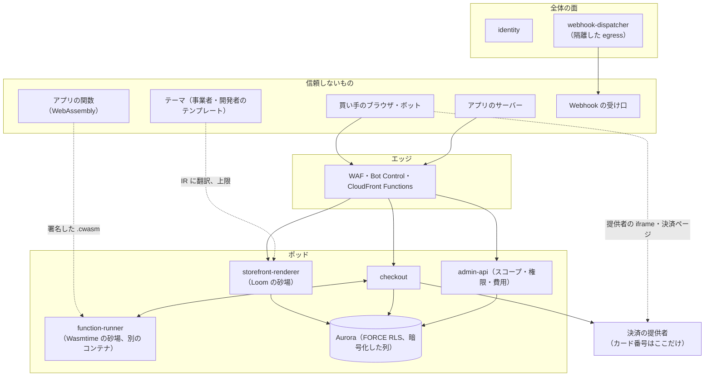
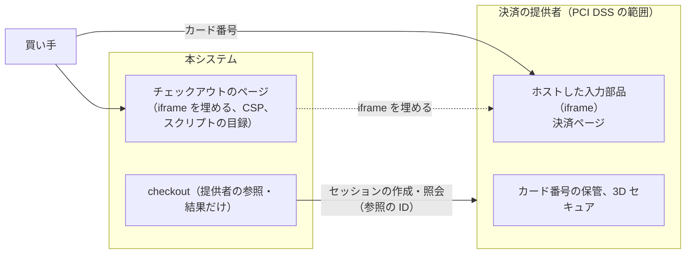

# Security: Shopify

脅威モデル（テーマとアプリによるチェックアウトのスキミング、悪意のあるアプリ、クレデンシャルスタッフィング、チェックアウトでのカードテスト、ボットの購入、砂場の脱出、Webhook などからの SSRF、Admin API でのデータの持ち出し）、ストアフロント・チェックアウト・管理画面の CSP、暗号化と鍵の配置、データの区分と保持と削除（法務の確認待ち L3 の枠）、PCI DSS の範囲の境界、社内の運用者のアクセス、脆弱性の管理とインシデントへの対応を決める。

前提となる決定は、カード番号に触れないこと（[ADR-0006](../decisions/0006-payments-via-providers.md)）、ショップの分離（[ADR-0003](../decisions/0003-tenancy-and-rls.md)）、テーマの言語の安全（[ADR-0007](../decisions/0007-theme-language-design.md)）、関数の砂場（[ADR-0008](../decisions/0008-extension-sandbox-wasm.md)）、Admin API の費用の上限（[ADR-0009](../decisions/0009-admin-api-graphql-and-cost-limits.md)）、スコープと保護のデータ（[ADR-0055](../decisions/0055-scopes-and-protected-customer-data.md)）、ストアフロントのスクリプトと CSP（[ADR-0048](../decisions/0048-storefront-scripts-csp-and-external-transmission.md)）、Webhook の egress（[ADR-0062](../decisions/0062-webhook-egress-and-payload-custody.md)）、ボット対策（[ADR-0026](../decisions/0026-bot-defense-and-purchase-limits.md)）。この文書で決めたことは次の ADR にある。

| ADR | 決定 |
| --- | --- |
| [0066](../decisions/0066-encryption-and-key-layout.md) | 鍵はポッドごと・用途ごとの KMS の鍵に分ける。買い手の個人のデータの列と、事業者の決済の提供者の認証の情報は、ポッドの DB に KMS の封筒の暗号（AES-256-GCM、データの鍵はポッド・月ごと）で置き、Secrets Manager はシステムの秘密だけに使う。完全一致の検索は、ショップごとに派生した鍵の HMAC の索引で行う。少ない回数の署名は KMS の非対称の鍵、多い回数の HMAC はメモリーに置く鍵（7 日で入れ替え）にする |
| [0067](../decisions/0067-checkout-script-integrity-and-card-testing.md) | チェックアウトのページはテーマで描かず、テーマ・アプリ・事業者のスクリプトを載せない。CSP は応答ごとの `nonce` と `strict-dynamic` なしの配信元の一覧（本システムの資産と、選んだ決済の提供者だけ）で強制する。アプリの計測は、DOM に触れない砂場の iframe へ事象だけを渡す。スクリプトの目録と変化の検出を見張りで回す。カードテストは、チェックアウト・IP・ショップの単位の支払いの試みの上限と、拒否の率の急増での自動のチャレンジで抑え、提供者の不正の検出と重ねる |
| [0068](../decisions/0068-data-classes-retention-and-operator-access.md) | データを 5 つの区分（カード・買い手の個人・事業者の業務・認証の情報・運用の計測）に分け、区分ごとに置き場所・暗号・ログへの出し方・保持の既定を決める。保持の期限は表（`retention_policies`）で持ち、法務の結論で表を変える。社内の運用者は、ショップのデータへの常のアクセスを持たず、2 人の承認の時間つきの入口と、事業者の許可したサポートのアクセスだけを使う |

アカウントとネットワークは [infrastructure.md](infrastructure.md)、スタッフの認証と監査ログは [merchant-admin-and-staff.md](merchant-admin-and-staff.md)、セキュリティの事象の計測は [observability.md](observability.md) にある。

## 1. 目標と前提

| 目標 | 基準 |
| --- | --- |
| カード番号が本システムに入らない | サーバー・ログ・DB・トレースの走査で、Luhn を通る 13〜19 桁の値 0（[ADR-0006](../decisions/0006-payments-via-providers.md)） |
| チェックアウトのページに、許可していないスクリプトが載らない | 見張りのスクリプトの目録の不一致 0、CSP の違反の報告の急増の検出 |
| 他のショップのデータが出ない | NFR-008、K8 |
| 砂場の外への到達 0 | K9、[quality.md](../quality.md) の 2.2.1 節 F |
| 外部のペンテストの High 以上 0 | E18 の合否 |
| 個人のデータのログへの混入 0 | ログの走査（[observability.md](observability.md) の 2 節） |

- 法令の判断（個人情報保護法の委託・第三者提供、漏えいの報告、割賦販売法のカード情報の保護）は、枠だけを書き、法務の確認待ち（L3・L7）とする。

## 2. 信頼境界

| 境界 | 守り |
| --- | --- |
| 買い手 → エッジ | WAF（共通の規則、IP の評判、速さの上限）、Bot Control（チェックアウトと待合室に絞る）、許可証（[ADR-0025](../decisions/0025-queue-pass-tokens.md)） |
| テーマ → レンダラー | 副作用のない言語、上限、既定のエスケープ（[ADR-0007](../decisions/0007-theme-language-design.md)、[ADR-0045](../decisions/0045-loom-grammar-and-contextual-escaping.md)） |
| アプリのサーバー → Admin API | OAuth、1 時間のトークン、スコープと保護のデータ、費用の上限（[ADR-0054](../decisions/0054-oauth-install-and-expiring-tokens.md)、[ADR-0055](../decisions/0055-scopes-and-protected-customer-data.md)） |
| 関数 → `function-runner` | 燃料・メモリー・入出力の上限、WASI なし、署名した機械語（[ADR-0008](../decisions/0008-extension-sandbox-wasm.md)、[ADR-0059](../decisions/0059-function-publish-compile-and-distribution.md)） |
| 本システム → 外の宛先 | 隔離した egress、宛先の検査（[ADR-0062](../decisions/0062-webhook-egress-and-payload-custody.md)、[infrastructure.md](infrastructure.md) の 2.4 節） |
| 買い手 → 決済の提供者 | 提供者の iframe・決済ページだけ。本システムは結果の照会だけ |

## 3. 脅威モデル

### 3.1 テーマ・アプリによるチェックアウトのスキミング

- **攻撃**：乗っ取ったスタッフのアカウント・悪意のアプリ・事業者のタグの管理の道具が、決済の画面にスクリプトを入れ、買い手の入力（カード、住所）を外へ送る。
- **守り**（ADR-0067）：
  - チェックアウトのページ（`/checkouts/…`）はテーマで描かない。テーマ・アプリの埋め込み・事業者の追加の配信元のスクリプトを載せない。見た目の変更は、ショップの設定（色、ロゴ、文言）と関数（[ADR-0008](../decisions/0008-extension-sandbox-wasm.md)）だけ。
  - CSP は応答ごとの `nonce`（チェックアウトはキャッシュしない）と配信元の一覧（本システムの資産の CDN、選んだ提供者のドメイン）で強制する（4 節）。
  - カードの入力は提供者の iframe だけ（[ADR-0006](../decisions/0006-payments-via-providers.md)）。同じ起点の制約で、ページのスクリプトは iframe の中を読めない。
  - アプリの計測（購入の完了の事象など）は、チェックアウトのページの砂場の iframe（`sandbox="allow-scripts"`、別の起点、`connect-src` はアプリの登録した送信先だけ）に、事象のデータ（スコープと保護のデータの範囲）を `postMessage` で渡す。iframe の中のスクリプトはページの DOM に触れない。外部送信の公表の扱いは法務の確認待ち（L6）。
  - 見張り（`canary`）が 5 分ごとにチェックアウトのページを描き、読み込んだスクリプトの URL とハッシュの目録を、リリースの目録と比べる（[observability.md](observability.md) の 5 節）。
- **ストアフロント**は事業者の自由度を残す。ADR-0048 の CSP（配信元の一覧とインラインのハッシュ）で、許可していない配信元を止める。ストアフロントにカードの入力はない。

### 3.2 悪意のあるアプリ

| 攻撃 | 守り |
| --- | --- |
| 必要以上のスコープを取る | 公開のアプリの審査（スコープの最小、保護のデータの理由）。導入の画面でスコープと保護のデータを項目ごとに示す（[ADR-0055](../decisions/0055-scopes-and-protected-customer-data.md)） |
| 顧客のデータを大量に読む | 費用の上限、一括の操作は同時に 1 つ、保護のデータの読み出しの量の見張り（3.8 節） |
| トークンの盗難・流出 | 1 時間のアクセストークン、入れ替えるリフレッシュトークンと再利用の検出（[ADR-0054](../decisions/0054-oauth-install-and-expiring-tokens.md)）、公開のリポジトリの走査の通報の口 |
| 関数で悪さをする | 砂場（3.6 節） |
| アプリの埋め込みで管理画面を騙す | iframe と定めたブリッジだけ、承認の画面は本システムが描く（[ADR-0056](../decisions/0056-admin-embedding-and-session-tokens.md)） |
| 発覚した後の止め方 | `ops.app_suspended`（アプリごと）で、トークン・Webhook・関数・埋め込みを全ショップで止める（`app-registry` から P5 で配る、5 分以内）。導入したショップに知らせる |

### 3.3 クレデンシャルスタッフィング

| 対象 | 守り |
| --- | --- |
| スタッフ（`identity`） | 2 段階の認証を全員に必須（パスキーか TOTP）、漏えいした値の拒否、アカウントと IP の試みの上限（[merchant-admin-and-staff.md](merchant-admin-and-staff.md) の 4 節）。ログインの経路にだけ、AWS WAF のアカウントの乗っ取りの防止の管理の規則（ATP）を付ける |
| 買い手 | パスワードを持たない（メールの 1 回だけのコード）。コードの送信の上限で、メールの爆撃を抑える |
| アプリの開発者 | 開発者のアカウントもスタッフと同じ `identity` の方式（2 段階の認証が必須） |

### 3.4 チェックアウトでのカードテスト

- **攻撃**：盗んだカードの番号の有効さを、小さな額の決済で大量に試す。事業者は提供者の手数料と、チャージバックの率の上昇で損をする。
- **守り**（ADR-0067）：

| 層 | 規則（既定） |
| --- | --- |
| 提供者 | 提供者の不正の検出と 3D セキュア（提供者の能力。選定の項目にする。[payments-integration.md](payments-integration.md)） |
| チェックアウト | 1 つのチェックアウトの支払いの試み 5 回まで（以後は新しいチェックアウト） |
| 買い手のセッション・IP | 失敗した支払いの試み、セッションごとに 1 時間 5 回、IP ごとに 1 時間 20 回。超えたら 1 時間、支払いの送信を拒む |
| ショップ | 直近 10 分の支払いの失敗の率が、直近 7 日の同じ時刻の 3 倍かつ 20 件以上で、そのショップの支払いの送信に WAF のチャレンジ（Challenge の動作）を自動で付ける（1 時間、Ops が延ばせる） |
| 形の検出 | 少額（ショップの平均の 10 分の 1 未満）の注文の、多数のカードでの試みを数え、事業者と Ops に知らせる |

- 失敗の理由（拒否のコード）は、提供者の正規化した値（[ADR-0035](../decisions/0035-payment-attempt-states-and-result-normalization.md)）を使う。カードの番号の一部も本システムは持たない（提供者の参照と、提供者が返すブランド・下 4 桁だけ）。

### 3.5 ボットの購入

- [flash-sales-and-queueing.md](flash-sales-and-queueing.md) と [ADR-0026](../decisions/0026-bot-defense-and-purchase-limits.md)（WAF・入口のチャレンジ・許可証・1 人あたりの上限の 4 層）。この文書は WAF の配置だけを持つ（[infrastructure.md](infrastructure.md) の 3 節）。
- WAF の Bot Control は、費用（要求あたりの課金）を抑えるため、キャッシュに当たる経路でなく、チェックアウト・カート・待合室の入口・ログインの経路に絞る（範囲を絞る文。[capacity.md](capacity.md) の 6 節）。

### 3.6 砂場の脱出

| 砂場 | 守り | 脱出したときの影響を小さくする |
| --- | --- | --- |
| テーマ（Loom） | 副作用のない IR、上限、`eval` の禁止（[ADR-0007](../decisions/0007-theme-language-design.md)） | レンダラーはポッドの読み出しの写しだけを読む DB のロール（RLS の中）。秘密を持たない |
| 関数（Wasmtime） | WASI なし、殻の輸入だけ、燃料とメモリーの上限、署名した機械語（[ADR-0008](../decisions/0008-extension-sandbox-wasm.md)） | `function-runner` のコンテナは root でない利用者、読み出しだけのルートのファイルシステム、Linux の権能をすべて落とす、IAM はモジュールの S3 の読み出しだけ、環境変数に秘密なし。同じタスクの `checkout` とはネットワークの名前空間を共有する（Fargate の awsvpc）ので、`checkout` の DB の資格情報はコンテナの環境でなく、`checkout` のプロセスだけが Secrets Manager から読む |

- Wasmtime のセキュリティの更新は 7 日以内に入れる（[ADR-0008](../decisions/0008-extension-sandbox-wasm.md)、[delivery.md](delivery.md) の 6 節）。

### 3.7 外への送信からの SSRF

利用者が宛先を決められる、外への送信の経路の一覧。どれも隔離した egress（[infrastructure.md](infrastructure.md) の 2.4 節）から、同じ宛先の検査（公開の IP だけ、名前の解決の結果に固定、リダイレクトを追わない。[ADR-0062](../decisions/0062-webhook-egress-and-payload-custody.md)）で送る。

| 経路 | 宛先を決める人 | 追加の制限 |
| --- | --- | --- |
| アプリの Webhook | アプリの開発者 | HTTPS・443 だけ（[webhooks.md](webhooks.md) の 6.3 節） |
| CSV の取り込みの画像の URL | 事業者 | HTTP(S)、1 枚 20 MB、応答の型が画像のものだけ、10 秒（[catalog-and-pricing.md](catalog-and-pricing.md)） |
| 運送会社の API | 本システム（選定した会社） | 許可の一覧の宛先だけ |
| SSO の IdP のメタデータ・JWKS | 組織の管理者 | 登録の時に許可の一覧へ足す。HTTPS だけ |
| 決済の提供者の API | 本システム | 許可の一覧の宛先だけ |

- ポッドのサービス（`storefront-renderer`、`checkout`、`admin-api`）は、インターネットへの経路を持たない。外への送信は、上の経路の担当の部品だけ。

### 3.8 Admin API でのデータの持ち出し

- **攻撃**：乗っ取ったスタッフのアカウント・アプリのトークンで、顧客の一覧と住所を大量に読む。
- **守り**：
  - 顧客の氏名・住所・連絡先は、スタッフは `customers_pii_read`、アプリは保護のデータの段階 2 の承認を要る（[merchant-admin-and-staff.md](merchant-admin-and-staff.md) の 5 節、[ADR-0055](../decisions/0055-scopes-and-protected-customer-data.md)）。
  - 顧客の書き出し（CSV、一括の操作）は `customers_export` と再確認を要り、所有者にメールで知らせ、監査ログに残す。
  - **量の見張り**：主体（スタッフ・アプリ）ごとに、保護のデータの項目を返した顧客の数を 1 時間の窓で数える（Valkey）。ショップの顧客の数の 20% か 1 万の小さい方を超えたら、その主体の保護のデータの読み出しを 1 時間止め（`ACCESS_DENIED`）、所有者と Ops に知らせる。事業者が解除できる（再確認）。
  - 一括の操作の結果の URL は 1 時間で切れ、ダウンロードを監査に残す。

### 3.9 ショップの漏れ

- [ADR-0003](../decisions/0003-tenancy-and-rls.md) の RLS、キャッシュの鍵（[ADR-0050](../decisions/0050-edge-cache-keys-and-generations.md)）、漏れの経路の表（[quality.md](../quality.md) の 2.2.1 節 G）。この文書は、漏れの疑いへの対応（10 節）を持つ。

### 3.10 社内の運用者と供給網

- 運用者は 8 節の入口だけを使う。
- 依存の検査（ライセンス、既知の脆弱性、本家の実装の禁止。[delivery.md](delivery.md) の 2 節）、コンテナのイメージの署名と ECR の走査（Amazon Inspector）、CI の OIDC の短い資格情報（長い鍵を持たない）。
- トークンの接頭辞（`<brand>_at_`、`<brand>_rt_`、`<brand>_sf_`、`<brand>_sfp_`）を GitHub のシークレットスキャンのパートナーに登録し、通報を受ける口（`/security/token-leak`）で取り消す（[リポジトリ共通の ADR-0006](../../../../docs/decisions/0006-brand-neutral-identifiers.md)）。

## 4. CSP

ADR-0067、[ADR-0048](../decisions/0048-storefront-scripts-csp-and-external-transmission.md)。

| ページ | `script-src` | `frame-src` | `connect-src` | `frame-ancestors` | その他 |
| --- | --- | --- | --- | --- | --- |
| ストアフロント（キャッシュする） | `'self'`、資産の CDN、アプリの埋め込みの配信元、事業者の許可の一覧、インラインのハッシュ（ADR-0048） | 動画の配信元の許可の一覧 | 島の経路、許可の一覧 | `'self'` | `nonce` を使わない |
| チェックアウト（キャッシュしない） | `'nonce-<応答ごと>'`、資産の CDN、選んだ提供者のスクリプトの配信元 | 選んだ提供者、アプリの計測の砂場の起点 | `'self'`、提供者の API | `'none'` | `form-action 'self'` と提供者、`base-uri 'none'`、`require-trusted-types-for 'script'` |
| アプリの計測の砂場 | 砂場の起点の資産、アプリの登録した計測の配信元 | なし | アプリの登録した送信先 | チェックアウトの起点だけ | `sandbox allow-scripts` |
| 管理画面 | `'self'` | 導入したアプリの起点（[ADR-0056](../decisions/0056-admin-embedding-and-session-tokens.md)） | `https://*.<brand>.<domain>` | `'none'` | — |

- 違反の報告は `report-to` で受け、ショップ・ページの種類ごとに数える（報告の本文は保存しない）。チェックアウトの違反は 1 件から Ops に知らせる。
- CloudFront の CSP のヘッダーの値は 1,783 文字まで（引き上げ可。[CloudFront quotas](https://docs.aws.amazon.com/AmazonCloudFront/latest/DeveloperGuide/cloudfront-limits.html)、2026-10-10 に確認）。ストアフロントの CSP は元の応答で付け、レスポンスヘッダーのポリシーで付けない（ショップごとに違うため）。
- 本システムの資産のスクリプトには Subresource Integrity（`integrity`）を付ける。

## 5. 暗号化と鍵

ADR-0066。

### 5.1 転送中

| 区間 | 方式 |
| --- | --- |
| 買い手 → CloudFront | TLS 1.2 以上（CloudFront のセキュリティの方針 `TLSv1.2_2021`）、HSTS（既定のドメイン。独自のドメインは事業者の設定） |
| CloudFront → ポッドの ALB（VPC origin） | TLS（ALB の証明書は ACM の内部の名前） |
| ALB → タスク | VPC の中の TLS（サービスごとの証明書） |
| タスク → Aurora、Valkey | TLS 必須（Aurora は `rds.force_ssl`、Valkey は転送中の暗号化） |
| 全体 ↔ ポッド（SNS・SQS） | AWS の API の TLS、SQS の保存の暗号化（KMS） |

### 5.2 保存時と鍵の配置

| 鍵（KMS） | 対象 | 置く場所 |
| --- | --- | --- |
| `kms-pod-<id>-storage` | ポッドの Aurora・Valkey・SQS・OpenSearch・EBS の保存の暗号化 | ポッドごと |
| `kms-pod-<id>-pii` | 買い手の個人のデータの列のデータの鍵を包む | ポッドごと |
| `kms-pod-<id>-secrets` | 事業者の決済の提供者・運送会社の認証の情報のデータの鍵を包む | ポッドごと |
| `kms-global-storage` | 全体の Aurora・Valkey・S3 | 全体 |
| `kms-identity` | TOTP の秘密、SSO の設定 | 全体 |
| `kms-sign-identity`（ECC P-256、署名） | 入場の主張、アプリの導入の JWT、セッションのトークン（[ADR-0054](../decisions/0054-oauth-install-and-expiring-tokens.md)） | 全体 |
| `kms-sign-functions`（ECC P-256、署名） | 関数の機械語の署名（[ADR-0059](../decisions/0059-function-publish-compile-and-distribution.md)） | 全体 |
| `kms-archive` | log-archive、保持のバケット | log-archive のアカウント |

- 鍵は東京と大阪の複数のリージョンの鍵（multi-Region keys）にし、大阪の写しを同じ鍵の ID で読む（[infrastructure.md](infrastructure.md) の 7 節）。
- 鍵の削除の予約と無効化は SCP で break-glass の外に禁止する（[infrastructure.md](infrastructure.md) の 1 節）。

### 5.3 列の暗号化

- **対象**：買い手の氏名、住所、電話番号、メールアドレス、注文のメモの自由記述（チェックアウト・注文・顧客の行。[cart-and-checkout.md](cart-and-checkout.md) の 10 節）、事業者の提供者・運送会社の認証の情報。
- **方式**：AES-256-GCM の封筒の暗号。データの鍵はポッド・月ごとに作り、KMS で包んで `data_keys` の表に置く。暗号文は `v1|<key_id>|<nonce>|<ciphertext>` の形で、関連のデータ（AAD）に `shop_id`・表・列・行の ID を入れる（他のショップの行への写し替えを検出する）。
- 平文のデータの鍵は、タスクのメモリーに 1 時間まで持つ（LRU）。KMS の呼び出しは鍵ごとに 1 時間 1 回ほど。
- **完全一致の検索**：メール・電話は正規化した値の HMAC-SHA256 を別の列に持つ。HMAC の鍵は、ポッドの索引の鍵（`kms-pod-<id>-pii` で包む）から HKDF でショップごとに派生する（他のショップの同じ値と同じ HMAC にならない）。
- **移し替え**（[shops-and-pods.md](shops-and-pods.md) の 8 節）：暗号文はポッドの鍵に結び付くので、`shop-mover` は先のポッドへ当てる前に、元の鍵で復号して先の鍵で暗号化し直す（`shop-mover` だけが両方のポッドの `pii`・`secrets` の鍵の Decrypt・Encrypt を持つ）。HMAC の索引はショップの鍵の派生の元が変わるので作り直す。
- 事業者の認証の情報は Secrets Manager に置かない（ショップの数だけの秘密の月額の費用と、取得の API の速さの上限のため）。[ADR-0006](../decisions/0006-payments-via-providers.md) の「Secrets Manager の参照で持つ」を、この封筒の暗号に置き換える。Secrets Manager は、システムの秘密（全体の DB の資格情報、待合室の許可証の HMAC の鍵、提供者のプラットフォームの鍵）だけに使う。

### 5.4 トークンと秘密

| もの | 保存 |
| --- | --- |
| アクセストークン・リフレッシュトークン・Storefront のトークン（256 ビットの乱数） | SHA-256 のハッシュ（遅いハッシュは要らない） |
| スタッフのパスワード | Argon2id |
| TOTP の秘密 | `kms-identity` で包む |
| 許可証の HMAC の鍵（[ADR-0025](../decisions/0025-queue-pass-tokens.md)） | Secrets Manager。CloudFront Functions へは KeyValueStore の鍵の値で配る（7 日で入れ替え、前の鍵を 15 分残す） |
| Webhook の署名の秘密（[ADR-0061](../decisions/0061-webhook-delivery-and-signing.md)） | `app-registry` が KMS で包む |

## 6. データの区分と保持

ADR-0068。

### 6.1 区分

| 区分 | 例 | 置き場所 | 暗号 | ログ・トレース |
| --- | --- | --- | --- | --- |
| D0 カード | カード番号、セキュリティコード | **持たない**（提供者だけ） | — | 出さない（走査で 0） |
| D1 買い手の個人 | 氏名、住所、電話、メール、IP | ポッドの DB の暗号化した列、S3 の書き出し（期限つき） | 列の暗号（5.3 節） | 出さない。IP はハッシュだけ |
| D2 事業者の業務 | 商品、価格、在庫、注文の金額、テーマ | ポッドの DB、S3 | 保存の暗号 | ID と数と理由のコード |
| D3 認証の情報 | パスワードのハッシュ、トークンのハッシュ、提供者の鍵、TOTP | 全体・ポッドの DB | ハッシュ・列の暗号 | 出さない |
| D4 運用の計測 | メトリクス、ログ、トレース、監査ログ | CloudWatch、AMP、S3 | 保存の暗号 | — |

### 6.2 保持の既定（法務の確認待ち L3・L4 で見直す）

| データ | 既定 | 消し方 |
| --- | --- | --- |
| 放棄したチェックアウトの D1 | 30 日 | 日次の作業で列を消す |
| 注文の D1 | 事業者の削除の請求か、ショップの削除まで | 顧客の削除（[merchant-admin-and-staff.md](merchant-admin-and-staff.md) の 9 節）、ショップの削除（[shops-and-pods.md](shops-and-pods.md) の 9.1 節） |
| 注文の D2（金額・税） | 法令の保存の期間（`retained_until`） | 保持の置き場所へ写し、期限で消す |
| カート（Valkey） | 14 日（[ADR-0028](../decisions/0028-cart-storage-in-valkey.md)） | 期限 |
| 買い手のセッション | 30 日 | 期限 |
| 一括の操作・書き出しの結果（S3） | 7 日 | ライフサイクル |
| アプリのログの D4 | 30 日（CloudWatch Logs）、S3 の写し 90 日 | 保持の設定 |
| 監査ログ | ポッド 90 日（プラス 1 年）、S3 1 年 | Object Lock の期限 |
| バックアップ（Aurora の自動） | 35 日 | 期限 |

- 保持の期間は `retention_policies` の表に持ち、作業はこの表を読む。法務の結論で表の値を変える（コードを変えない）。
- **法的な保全**（訴訟・捜査の照会）：ショップ・顧客の単位の保全の印（`legal_holds`）があれば、削除の作業はその対象を飛ばす。設定は法務と Ops だけ（監査に残す）。
- 本システムが事業者からの委託先か、アプリへの提供の扱い、漏えいの報告の義務を負う者と手順は法務の確認待ち（L3）。

## 7. PCI DSS の範囲の境界

- 本システムのサーバー・ログ・DB には、カード番号とセキュリティコードが入る経路がない（[ADR-0006](../decisions/0006-payments-via-providers.md)）。
- ただし、提供者の iframe を埋めるチェックアウトのページのスクリプトの管理は、PCI DSS v4.0.1 で決済のページのスクリプトに関する要件（6.4.3、11.6.1）の対象になりうる（解釈は**未検証**）。本システムは、その要件にあたる管理（スクリプトの目録と許可、変化の検出）を ADR-0067 で持つ。
- 本システムがどの評価の形（事業者の SAQ の支え、サービスの提供者としての評価）に当たるか、割賦販売法のカード情報の保護の義務の対象になるかは、QSA の確認と法務の確認待ち（L7）。

## 8. 社内の運用者のアクセス

ADR-0068。

| 入口 | 中身 | 承認 | 記録 |
| --- | --- | --- | --- |
| 通常 | ダッシュボード、ログ（D1 なし）、`ops.*` のフラグ、runbooks の手順のワークフロー（移し替え、凍結、在庫の照合のやり直し） | 役割（IAM Identity Center） | `operator_audit_events` |
| サポートのアクセス | ショップの管理画面を、事業者が許可したときだけ、読み出しの専用で見る | 事業者の許可（管理画面、72 時間、取り消し可） | 事業者の監査ログに出す |
| break-glass | ポッドの DB への直接の接続（SSM のセッション、読み出しのロール、RLS の中で `SET LOCAL app.shop_id`） | 2 人の承認、1 時間 | セッションの記録（SSM）、`operator_audit_events`、Ops の責任者への通知 |

- 運用者は、ショップのデータへの常のアクセスを持たない。D1 の列の復号の権限は、アプリのタスクのロールと `shop-mover` だけが持ち、人のロールに与えない（IaC の検査）。
- 開示の請求・捜査機関からの照会への応答は、法務と Ops が行う（[roadmap.md](../roadmap.md)）。手順は `legal-request.md`（法務の L3 の後）。

## 9. 脆弱性の管理と試験

| 活動 | 頻度・基準 |
| --- | --- |
| 依存の脆弱性の走査（npm、cargo） | PR と日次。Critical は 7 日、High は 30 日で直す |
| コンテナのイメージの走査（Inspector） | push と日次 |
| Wasmtime のセキュリティの更新 | 7 日以内（[ADR-0008](../decisions/0008-extension-sandbox-wasm.md)） |
| 外部のペンテスト（テーマ、関数、API、チェックアウト、管理画面） | E18 と年 1 回。High 以上 0 で GA |
| 砂場の脱出の試験、テーマのファジング | PR・夜間（[quality.md](../quality.md) の 2.2.1 節 E・F） |
| 脆弱性の報告の窓口 | GA の時に公開（`security.txt`）。報奨の制度は GA の後に検討 |

## 10. インシデントへの対応

| 事象 | 最初の動作 |
| --- | --- |
| 他のショップのデータの露出の疑い | エッジのキャッシュの全消去（世代の全上げ）、該当の経路のフラグの停止、`tenant-leak-response.md` |
| チェックアウトのスクリプトの目録の不一致 | 該当のショップのチェックアウトを止める（`ops.checkout_enabled`）、変更の出どころ（監査ログ）を調べる |
| アプリの悪用 | `ops.app_suspended`、トークンの全取り消し |
| スタッフのアカウントの乗っ取り | セッションとトークンの取り消し、所有者への連絡、監査ログの抽出 |
| カードテストの急増 | チャレンジの延長、提供者への連絡、事業者への連絡 |
| 鍵の漏えいの疑い | 鍵の入れ替え（許可証の鍵、Webhook の秘密、署名の鍵の順）、影響の範囲の抽出 |

- 漏えいの報告（個人情報保護委員会・本人への通知）の要否の判断と期限は法務の確認待ち（L3）。対応の中で、影響を受けたショップ・買い手の ID の一覧を、ID と数だけで作る手順を持つ。

## 11. テストと性質

- **PROP-SEC-001（カード番号の不在）**：生成した要求（カード番号の形の値を、住所・メモ・属性・GraphQL の引数に入れたもの）を全経路に流し、ログ・トレース・DB・S3 の走査で Luhn を通る値が 0（夜間）。
- **PROP-SEC-002（列の暗号の結び付き）**：任意の暗号文を他の行・他のショップの行に写すと、復号が失敗する（AAD）。
- **PROP-SEC-003（HMAC の分離）**：同じメールの値でも、ショップが違えば索引の値が違う。
- **PROP-SEC-004（チェックアウトのスクリプト）**：チェックアウトのページの HTML と CSP に、テーマ・アプリの埋め込み・事業者の配信元のスクリプトが現れない（任意のテーマとアプリの導入の組み合わせ）。
- **PROP-SEC-005（持ち出しの見張り）**：任意の読み出しの列で、閾値を超えた主体の保護のデータの読み出しが止まり、他の主体に影響しない。
- 結合：カードテストの上限（チェックアウト 5 回、セッション・IP の上限、ショップの自動のチャレンジ）、`ops.app_suspended` の 5 分以内の効き、SSRF の宛先（3.7 節の全経路）。
- IaC の検査：人のロールに `pii`・`secrets` の鍵の Decrypt がない。ポッドのサービスのサブネットにインターネットへの経路がない。`function-runner` のコンテナが root でなく、権能を落とし、読み出しだけのファイルシステム。
- 外部のペンテスト（E18）。

## 12. Story の候補

| Epic | Story | 中身 |
| --- | --- | --- |
| E1 | `kms-keys-and-column-encryption` | 5.2・5.3 節（ADR-0066。PROP-SEC-002・003） |
| E1 | `retention-policies-and-legal-holds` | 6 節（ADR-0068）。期間は法務：L3・L4 |
| E1 | `operator-access-and-break-glass` | 8 節（ADR-0068） |
| E6 | `checkout-csp-and-script-integrity` | 3.1 節と 4 節（ADR-0067。PROP-SEC-004） |
| E8 | `card-testing-controls` | 3.4 節（ADR-0067） |
| E14 | `app-abuse-controls` | 3.2・3.8 節（PROP-SEC-005） |
| E17 | `support-access-grants` | 8 節のサポートのアクセス |
| E18 | `pentest-external` | 9 節 |
| E18 | `pci-scope-review` | 7 節。法務：L7、QSA |

## 13. 未解決の問い

### 決定（2026-10-10、既定案）

- **鍵**：ポッド・用途ごとの KMS の鍵、列の封筒の暗号、事業者の認証の情報も DB の封筒の暗号（ADR-0066）。
- **チェックアウト**：テーマとアプリのスクリプトを載せない、`nonce` の CSP、計測は砂場の iframe（ADR-0067）。
- **カードテスト**：チェックアウト・セッション・IP・ショップの 4 つの上限と自動のチャレンジ（ADR-0067）。
- **データ**：5 つの区分、保持は表で持つ（ADR-0068）。
- **運用者**：常のアクセスなし、2 人の承認の break-glass、事業者の許可のサポートのアクセス（ADR-0068）。

### 持ち越し

| 問い | いつ・どう決めるか |
| --- | --- |
| 保持の期間、委託・第三者提供の扱い、漏えいの報告 | **法務の確認待ち：L3** |
| 本システムの PCI DSS の評価の形、割賦販売法の対象か | **法務の確認待ち：L7**、QSA の確認（PCI DSS の要件の解釈は**未検証**） |
| チェックアウトのアプリの計測の外部送信の公表と同意 | **法務の確認待ち：L6** |
| ショップごとの暗号化の鍵（顧客の持つ鍵） | MVP の後（[roadmap.md](../roadmap.md) の延期の一覧） |
| 提供者の不正の検出と 3D セキュアの能力 | E8 の `payment-provider-selection` |

## 14. data-model への項目

| 表・置き場所 | 中身 | 節 |
| --- | --- | --- |
| `data_keys`（ポッド・全体） | `key_id`、用途、月、KMS で包んだデータの鍵、状態 | 5.3 |
| 暗号化した列（ポッド） | `v1\|<key_id>\|<nonce>\|<ciphertext>`、HMAC の索引の列（`email_hmac`、`phone_hmac`） | 5.3 |
| `retention_policies`（全体）・`legal_holds`（全体） | 区分・対象ごとの期間、保全の印 | 6.2 |
| `support_access_grants`（ポッド） | ショップ、許可したスタッフ、期限、取り消し | 8 |
| `operator_audit_events`（全体） | 運用者の操作 | 8 |
| `payment_attempt_limits`（Valkey） | セッション・IP・チェックアウトの失敗の数 | 3.4 |
| `pii_read_counters`（Valkey） | 主体ごとの保護のデータの読み出しの数 | 3.8 |
| `checkout_script_manifest`（S3） | リリースごとのチェックアウトのスクリプトの目録 | 3.1 |
| AppConfig | `ops.app_suspended`、`ops.checkout_challenge`（ショップ） | 3.2、3.4 |

## 出典

いずれも 2026-10-10 に確認。

- AWS, [Amazon CloudFront quotas](https://docs.aws.amazon.com/AmazonCloudFront/latest/DeveloperGuide/cloudfront-limits.html)：CSP のヘッダーの値の長さ
- AWS, [AWS WAF Fraud Control account takeover prevention](https://docs.aws.amazon.com/waf/latest/developerguide/waf-atp.html)、AWS Price List（`awswaf`、ap-northeast-1、2026-10 の公開分）：ATP の管理の規則 月 10 USD と要求あたりの課金、Bot Control 100 万要求 1 USD、チャレンジ 100 万件 0.4 USD
- PCI Security Standards Council, [Document Library](https://www.pcisecuritystandards.org/document_library/)（PCI DSS v4.0.1。要件の解釈は**未検証**）
- W3C, [Content Security Policy Level 3](https://www.w3.org/TR/CSP3/)、[Trusted Types](https://www.w3.org/TR/trusted-types/)、[Subresource Integrity](https://www.w3.org/TR/SRI/)
- AWS, [Secrets Manager pricing](https://aws.amazon.com/secrets-manager/pricing/)（秘密ごとの月額の課金。単価は**未検証**）
