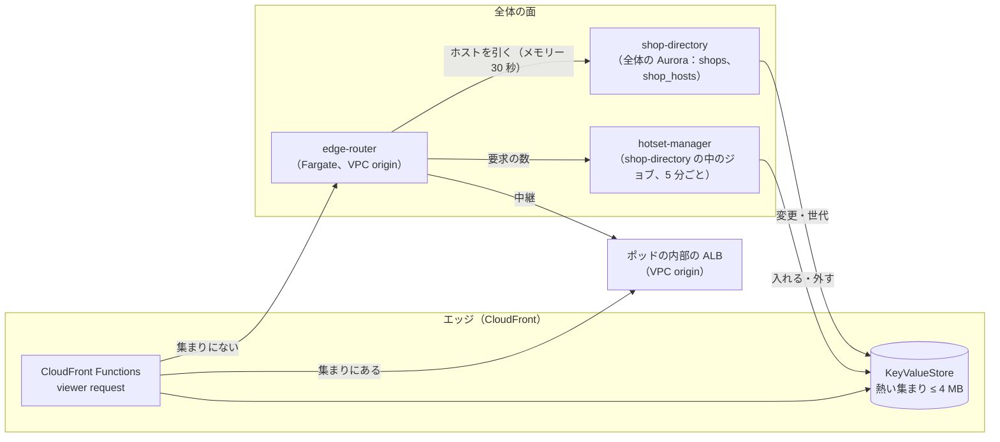
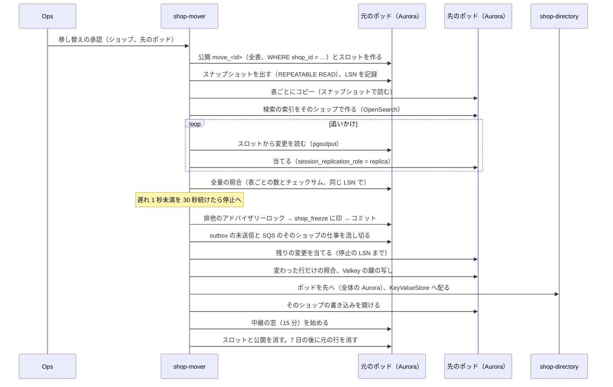
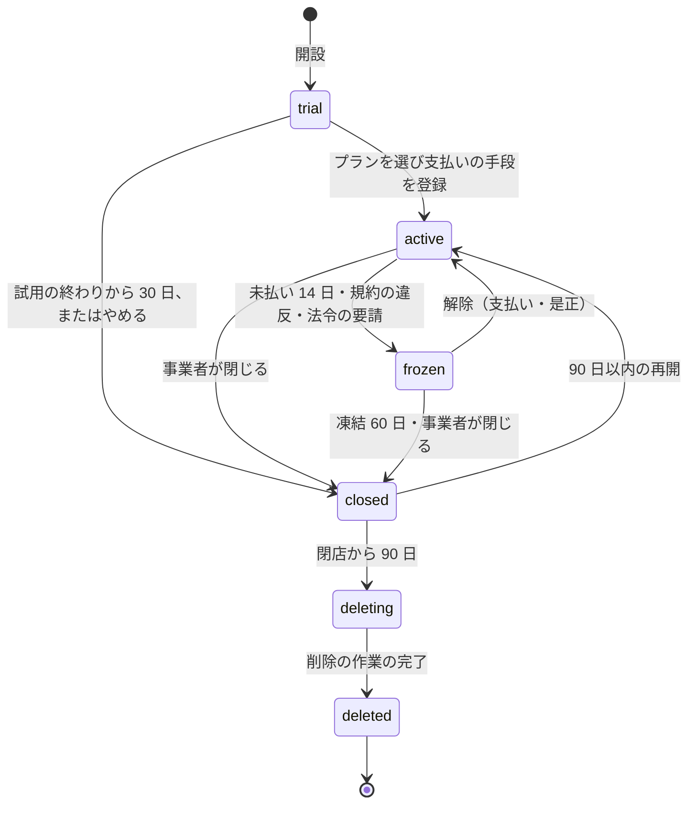

# Shops and Pods: Shopify

ショップの開設とプラン、ドメインと TLS、ポッドの構成、ショップの置き場所の選び方と偏りの直し、ショップの振り分けの表（`shop-directory` とエッジの KeyValueStore）、ショップの移し替え（`shop-mover`）、隔離のポッド、ショップのライフサイクル（試用・稼働・凍結・閉店・データの削除）、ポッドの中のうるさい隣人の上限を決める。

前提となる決定は、ショップを単位にポッド（完全なセル）へ置き、エッジが KeyValueStore でショップ → ポッドを引き、移し替えはコピー・論理デコードでの追いかけ・10 秒以内の書き込みの停止・ディレクトリの切り替えで行うこと（[ADR-0002](../decisions/0002-pods-and-shop-placement.md)）、ポッドの DB の全表に `shop_id` と FORCE RLS を置き、ポッドの中でショップごとの上限を置くこと（[ADR-0003](../decisions/0003-tenancy-and-rls.md)）。要件は NFR-007（可用性）、NFR-008（分離）、NFR-015（移し替えの停止 p99 10 秒、不一致 0）、K10（開店まで 10 分）。この文書で決めたことは次の ADR にある。

| ADR | 決定 |
| --- | --- |
| [0010](../decisions/0010-shop-routing-hot-set-and-custom-domains.md) | エッジの KeyValueStore は全ホストの表ではなく、要求の多いホストだけを持つ「熱い集まり」にし、4 MB を上限に `shop-directory` が入れ替える。集まりにないホストは、全体の面の `edge-router` が `shop-directory` で引いてポッドへ中継する。既定のドメインはワイルドカードの証明書、独自のドメインは CloudFront のマルチテナントの配信のテナントと、CloudFront が管理する証明書（HTTP の検証）で受ける。全体の面からポッドへの読み出しの写し（アプリの定義、プラン）を、ポッドをまたぐ経路 P5 として足す |
| [0011](../decisions/0011-shop-placement-and-rebalancing.md) | ポッドは種類（共有・隔離・見張り・専用）を持ち、容量を「ポッドの単位」で数える。新しいショップは、受け入れ中の共有のポッドのうち使用率の最も低いものへ置く。使用率 70% で受け入れを止め、85% で偏りの直しの移し替えを計画する。隔離のポッドは、予定したフラッシュセールのショップだけを置き、セールの前に大きさを上げてから移す |
| [0012](../decisions/0012-shop-mover-logical-decoding-and-cutover.md) | `shop-mover` は、ショップごとの行の絞り込みを持つ公開（`WHERE (shop_id = …)`）と専用の論理レプリケーションのスロットで変更を追いかける。停止は、全書き込みのトランザクションが取るショップの共有のアドバイザリーロックを、排他で取って印を書く形にする。照合は、停止の前の全量の照合と、停止の中の「変わった行だけ」の照合に分ける。切り替えの後の古いポッドは、15 分の間、そのショップの要求を新しいポッドへ中継する |
| [0013](../decisions/0013-shop-lifecycle-and-data-deletion.md) | ショップのライフサイクルを `trial`・`active`・`frozen`・`closed`・`deleting`・`deleted` のステートマシンにし、`shop-directory` が正本を持つ。閉店から 90 日はデータを残して再開でき、その後に削除の作業（ポッドの行、S3、検索、Valkey、全体の行）を進める。法令で残す文書（領収書・注文の記録・監査ログ）は、`retained_until` まで、削除の対象から外す |

運用の手順（隔離のポッドへの移し替えの段、移し替えの失敗）は [runbooks/](../runbooks/README.md) の 4・5 節、ポッドの大きさは [capacity.md](capacity.md)、ポッドの Terraform とネットワークは [infrastructure.md](infrastructure.md)、スタッフと請求は [merchant-admin-and-staff.md](merchant-admin-and-staff.md) にある。

## 1. 範囲

- 扱う：
  - ショップの開設、ハンドル（既定のドメインの名前）、プランとの関係
  - 既定のドメインと独自のドメイン、TLS の証明書の発行と更新
  - ポッドの種類と構成、ショップの置き場所の選び方、偏りの直し
  - `shop-directory`、エッジの振り分け（KeyValueStore の熱い集まり、`edge-router`）
  - ショップの移し替え（`shop-mover`）と、隔離のポッド
  - ショップのライフサイクルと、ショップの単位のデータの削除
  - ポッドの中のショップごとの上限の値
- 扱わない：
  - キャッシュの鍵と世代の番号（[storefront-api-and-caching.md](storefront-api-and-caching.md)）。この文書は KeyValueStore の値の全体の形を持ち、世代の欄はその文書が持つ
  - 待合室・許可証（[flash-sales-and-queueing.md](flash-sales-and-queueing.md)）。セールの段が隔離のポッドへの移し替えを依頼する
  - プランの料金と請求（[merchant-admin-and-staff.md](merchant-admin-and-staff.md)）
  - 個人のデータの保持の期間の全体（[security.md](security.md) の 6 節）
  - 開設の審査（法務の確認待ち L8・L10。[merchant-admin-and-staff.md](merchant-admin-and-staff.md) の 9 節）

## 2. 要件

| 要件 | 目標 | NFR・基準 |
| --- | --- | --- |
| 開店の速さ | 登録から最初の商品の公開まで 10 分以内（中央値）。ショップの作成の API は p95 3 秒 | K10 |
| 振り分けの速さ | 熱い集まりのホストは、エッジの関数の中で引き終える（関数の実行 1ms 未満の目安）。集まりにないホストの中継の上乗せ p95 20ms | NFR-003 |
| 振り分けの正しさ | 1 つのホストは 1 つのショップと 1 つのポッドに決まる。古い振り分けで、他のショップのデータを返さない | NFR-008 |
| 移し替え | 書き込みの停止 p99 10 秒、移した後のデータの不一致 0 | NFR-015 |
| 移し替えの安全 | 任意の段で止めても、二重の書き込みと取りこぼしがない。照合が合わなければ切り替えない | NFR-015、[quality.md](../quality.md) の 2.2.1 節 I |
| うるさい隣人 | 同じポッドの 1 ショップが割り当ての 10 倍を受けても、他のショップの NFR-001・NFR-003 を満たす | NFR-008 |
| 可用性 | `shop-directory` が止まっても、熱い集まりのショップは売れ続ける | NFR-007 |
| 削除 | 閉店の後の削除の期限（既定 90 日＋30 日）を過ぎて残るショップのデータ 0（保持の対象を除く） | 法務の確認待ち L3 |

## 3. 本家の形（確かめたこと）

いずれも 2026-10-10 に確認。

| 項目 | 内容 | 出典 |
| --- | --- | --- |
| ポッド | 完全に分けたデータストアの上のショップの集まり。アプリのサーバー・ジョブ・ロードバランサーは共有。1 つの要求は 1 つのポッドだけ。Sorting Hat が要求を振る。Pod Mover でポッドを 1 分ほどで別のデータセンターへ | [Pods Architecture](https://shopify.engineering/a-pods-architecture-to-allow-shopify-to-scale) |
| データの移し替え | MySQL の一部のデータを短い停止で移すライブラリ Ghostferry | [Ghostferry](https://github.com/Shopify/ghostferry) |

- 本家のショップの置き場所の選び方、ショップの単位の移し替えの停止の時間、試用の期間と閉店の後のデータの扱い、独自のドメインの証明書の発行の仕組みは、公式の資料で確かめていない（**未検証**）。本システムの値を使う。
- 本家の名前（ドメイン、ヘッダー）は使わない（[リポジトリ共通の ADR-0006](../../../../docs/decisions/0006-brand-neutral-identifiers.md)）。

AWS の仕様（いずれも 2026-10-10 に確認）：

| 項目 | 内容 | 出典 |
| --- | --- | --- |
| KeyValueStore | 鍵 512 バイト、値 1 KB、1 つの保存 5 MB、1 回の更新の API で 50 鍵か 3 MB、1 つの関数に結べる保存は 1 つ、アカウントあたり 200 | [CloudFront quotas](https://docs.aws.amazon.com/AmazonCloudFront/latest/DeveloperGuide/cloudfront-limits.html) |
| マルチテナントの配信 | 配信のテナントはアカウントあたり 10,000（引き上げ可）、マルチテナントの配信は 20、テナントあたりの別名 100。テナントは独自のドメインと、CloudFront が管理する ACM の証明書（HTTP の検証）を持てる | 同上、[Multi-tenant distributions](https://docs.aws.amazon.com/AmazonCloudFront/latest/DeveloperGuide/distribution-config-options.html)、[Managed certificates](https://docs.aws.amazon.com/AmazonCloudFront/latest/DeveloperGuide/managed-cloudfront-certificates.html) |
| 元の切り替え | CloudFront Functions（viewer request、JavaScript runtime 2.0）は `selectRequestOriginById()` で配信の中の元（VPC origin を含む）を選べる | [Helper methods for origin modification](https://docs.aws.amazon.com/AmazonCloudFront/latest/DeveloperGuide/helper-functions-origin-modification.html) |
| 行の絞り込み | PostgreSQL の公開は表ごとに `WHERE` の行の絞り込みを持てる。UPDATE・DELETE を出す公開の絞り込みは、レプリカ識別の列だけを使える。不変の組み込みの関数だけ | [Row filters](https://www.postgresql.org/docs/18/logical-replication-row-filter.html) |

## 4. ポッドの構成

ADR-0011。ポッドの中身は [ADR-0002](../decisions/0002-pods-and-shop-placement.md) のとおり（Aurora、Valkey、SQS、OpenSearch のドメイン、ECS のサービス、内部の ALB）。

### 4.1 種類

| 種類 | ID の形 | 置くショップ | S1 の数 | 大きさ（[capacity.md](capacity.md) の 4 節） |
| --- | --- | --- | --- | --- |
| 共有（`shared`） | `p01`〜 | 通常のショップ | 4 | 標準 |
| 隔離（`isolation`） | `x01`〜 | 予定したフラッシュセールのショップ（セールの 3 日前から後 7 日まで） | 1 | 大。セールの前に上げる |
| 見張り（`canary`） | `p00` | 見張りのショップ（`canary`）、社内のショップ、試しのショップ | 1 | 最小 |
| 専用（`dedicated`） | `d01`〜 | 1 つの大きなショップ（S2 から） | 0 | ショップごと |

- 見張りのポッド `p00` は、デプロイの段（[runbooks/](../runbooks/README.md) の 3 節の「見張りのショップのポッド」）のために足した。[architecture/README.md](README.md) の 2 節の「4（＋隔離 1）」に、最小の大きさの 1 つが加わる。
- 隔離のポッドは、セールのない間は空か、終わったセールのショップの戻り待ちだけになる。空の間は最小の大きさに縮める（[capacity.md](capacity.md) の 5 節）。
- ポッドの ID は 3 文字（KeyValueStore の値を短くするため）。一度使った ID を再利用しない。

### 4.2 ポッドの単位（容量の数え方）

ポッドの容量を、1 つの数「ポッドの単位（PU）」で数える。ショップの重さを PU で見積もり、ポッドの使用率を `Σ ショップの PU ÷ ポッドの PU` にする。

| 材料 | ショップの PU への寄与 | 共有のポッドの容量（S1、初期見積もり） |
| --- | --- | --- |
| 書き込み（直近 7 日の 1 時間の最大の DB の書き込みの行） | 1 万行/時 = 1 PU | 書き込み 400 万行/時 = 400 PU |
| 元への要求（直近 7 日の 1 分の最大のストアフロントと API の要求） | 1,000 件/分 = 1 PU | 15 万件/分 = 150 PU |
| データの大きさ（ポッドの DB の行の大きさ） | 1 GB = 1 PU | 400 GB = 400 PU |

- ショップの PU は 3 つの材料の比のうち最大の値を、ポッドの容量の比で表す（`max(書き込み/400万, 要求/15万, 大きさ/400GB) × 100` を % で持つ）。値は日次で `shop_load` に記録する。
- 新しいショップは、最初の 30 日は 0.01% として数える（ほとんどのショップは小さい）。
- 容量の値は初期見積もりで、E18 の負荷試験と `shop-move-poc` の後に直す。

## 5. ショップの振り分け

ADR-0010。

### 5.1 正本と配り



- **正本**：`shop-directory` の全体の Aurora に、`shops`（ショップ ID、ハンドル、ポッド、ライフサイクル、プラン）と `shop_hosts`（ホスト → ショップ、主のホストか、世代の欄）を持つ。
- **熱い集まり**：KeyValueStore には、直近の要求の多いホストだけを入れる。5 MB の保存に全ホストは入らない（S1 の登録 10 万ショップ、独自のドメインを足すとホストはそれより多い。1 ホストの鍵と値で 70〜90 バイト、`fine` の型は 260 バイト前後）。上限を 4 MB とし、3.5 MB を超えたら要求の少ないものから外す。
- **集まりにないホスト**：関数は元を `edge-router` に選ぶ。`edge-router` は `shop-directory` でホストを引き（メモリーに 30 秒、なければ全体の Aurora の読み出しの写し）、ポッドの ALB へ中継する。応答の `Cache-Control` の `s-maxage` を 10 秒に切り詰める（世代の番号なしでも NFR-011 の p95 10 秒に収める）。
- **入れる条件**：`edge-router` が中継したホストの要求が 5 分で 30 件を超えたら、次の回の入れ替えで入れる。セールの登録のあるショップ、隔離のポッドのショップ、移し替え中のショップ、プラスのプランのショップは、要求の数に依らず入れる（固定の枠、上限 1 MB）。
- **外す条件**：直近 14 日の要求が少ない順。CloudFront の標準のログ（S3）の日次の集計と、`edge-router` の数から決める。
- 同じ KeyValueStore には、ホストの他に、許可証の鍵（[ADR-0025](../decisions/0025-queue-pass-tokens.md)）などのシステムの値を置く（64 KB までを別に取っておく。4 MB の上限の内）。
- KeyValueStore の更新は 50 鍵ずつにまとめる（API の操作の単価が 1,000 回 1 USD のため。[capacity.md](capacity.md) の 6 節）。

### 5.2 KeyValueStore の値

[storefront-api-and-caching.md](storefront-api-and-caching.md) の 7 節の形を、この文書が全体として持つ。

```text
key   : <host>（小文字、末尾の . なし）     例 "tea-shop.<brand>.<domain>"、"www.tea-shop.jp"
value : v1|<shop_short>|<pod>|<state>|<gen>[|<pgen>|<fine_bucket_gens>]
        shop_short       : shop_id の 22 文字の base64url
        pod              : ポッドの ID（3 文字）
        state            : a（売っている）・p（パスワードの保護：試用・準備中）・f（凍結）・c（閉店）・r（正規のホストへ 301）
        gen 以降          : storefront-api-and-caching の 7 節
```

- `state = r` は、主でないホスト（独自のドメインを持つショップの既定のドメイン、`www` のない形など）。関数は主のホストへ 301 を返す。主のホストは値の後ろに足さず、`edge-router` で引く（301 は CloudFront でキャッシュする）。
- `f`・`c` は、関数が決めたページ（S3 の静的なページ）を返す。ただし Admin API（`/admin/api/`）は凍結の間も読み出しを通す（事業者のデータの書き出しのため。[ADR-0013](../decisions/0013-shop-lifecycle-and-data-deletion.md)）。
- `p` は、ストアフロントのパスワードの画面をポッドが描く（キャッシュしない）。
- 移し替え中（`moving`）は値に出さない。停止はポッドの DB の印で行い、エッジは関わらない（8 節）。

### 5.3 ポッドの側の確かめ

- 関数は `x-<brand>-shop-id`・`x-<brand>-pod-id`・`x-<brand>-route`（`kvs` か `router`）を付ける。ポッドの ALB は VPC origin で、CloudFront と `edge-router` の他から届かない（[infrastructure.md](infrastructure.md) の 2 節）。
- ポッドのサービスは、`x-<brand>-pod-id` が自分と違えば 421 を返す（[ADR-0002](../decisions/0002-pods-and-shop-placement.md)）。`x-<brand>-shop-id` は、ポッドの DB の `domains` の行でホストから引き直して一致を確かめる（[ADR-0003](../decisions/0003-tenancy-and-rls.md)）。
- 自分のポッドから移し出したショップの要求は、8.5 節の中継の窓の間だけ、新しいポッドへ中継する。

### 5.4 ポッドをまたぐ経路 P5

[ADR-0002](../decisions/0002-pods-and-shop-placement.md) の P1〜P4 に、次を足す（ADR-0010）。

- **P5：全体の面からポッドへの読み出しの写し。** ショップのデータでない全体の定義（アプリの定義 `app_definitions_replica`、プランの上限 `plan_limits_replica`、言語と通貨の表）を、全体の面が SNS で配り、各ポッドの `workers` が自分の DB の写しの表（RLS の外の「全体の写し」の区分）に当てる。ポッドの要求はこの写しだけを読み、全体の Aurora を直接読まない。
- 写しの表は `shop_id` を持たないので、[ADR-0003](../decisions/0003-tenancy-and-rls.md) の RLS の外の表の一覧に「全体の写し（`*_replica`）」を足す。ショップのデータの列を持たないことを、スキーマの検査で確かめる。
- [app-platform-and-apis.md](app-platform-and-apis.md) の 15 節の持ち越し（アプリの定義の写しの経路）は、この P5 で受ける。

## 6. ドメインと TLS

ADR-0010。

### 6.1 既定のドメイン

- 形は `<handle>.<brand>.<domain>`。ハンドルは英小文字・数字・`-`、3〜40 文字、先頭と末尾は英数字。予約の語（`admin`、`api`、`www`、`checkout`、`cdn`、`status`、`edge`、`mail`、本システムの部品の名前）と、既存のハンドルは拒む。
- ハンドルは開設の後に変えない。Admin API の入口（[ADR-0009](../decisions/0009-admin-api-graphql-and-cost-limits.md)）とアプリの導入の記録が、このホストを使うため。
- 既定のドメインは、マルチテナントの配信 `mtd-storefront` の 1 つのテナント（ワイルドカード `*.<brand>.<domain>`、共有の証明書）で受ける。ショップごとのテナントを作らない（テナントの数の上限のため）。

### 6.2 独自のドメイン

| 手順 | 中身 |
| --- | --- |
| 1. 追加 | 事業者が管理画面でドメインを足す（1 ショップ 10 まで）。`shop_hosts` に `pending` で入れる |
| 2. DNS | 事業者が `www.<domain>` を `connect.<brand>.<domain>`（接続のグループの経路の端点を指す本システムの名前）への CNAME にする。頂点（apex）は、接続のグループの Anycast の固定の IP の一覧への A レコード（[infrastructure.md](infrastructure.md) の 2.3 節） |
| 3. テナント | `shop-directory` が、そのショップの配信のテナント（`mtd-storefront` の子）を作り、別名にドメインを足し、CloudFront が管理する証明書を `ValidationTokenHost = cloudfront` で頼む |
| 4. 検証 | CloudFront が HTTP の検証の印を返し、ACM が証明書を出す。`shop-directory` が 5 分ごとに状態を見て、発行で `active` にする。72 時間で出なければ `failed` にし、事業者に DNS の直し方を見せる |
| 5. 主のホスト | 事業者が主のホストを選ぶ。主でないホストは `state = r`（301） |

- 1 ショップ 1 テナント（独自のドメインを持つショップだけ）。テナントの数は S1 で 2〜3 万の見込み（独自のドメインを持つ割合 40〜60% は本システムの想定）。アカウントの既定の上限 1 万を超えるので、E2 の前に引き上げを申請する。上限の天井は**未検証**（持ち越し）。
- 証明書の更新は CloudFront が行う（上の出典）。事業者が DNS を外すと更新が失敗するので、`shop-directory` が日次で DNS を引き、外れていたら事業者に知らせ、30 日で `shop_hosts` を `detached` にする。
- 他の CloudFront の資源で使われているドメインは足せない（上の出典）。事業者には前の提供者から外す手順を見せる。前のサイトを止めずに移す場合は、`ValidationTokenHost = self-hosted` の手順を案内する。

### 6.3 管理の画面と全体の入口

| ホスト | 入口 |
| --- | --- |
| `admin.<brand>.<domain>` | 管理画面（S3 の資産）と `identity`（ログイン）。標準の配信（[merchant-admin-and-staff.md](merchant-admin-and-staff.md)） |
| `<handle>.<brand>.<domain>/admin/api/…` | Admin API。ストアフロントと同じ振り分け（[ADR-0002](../decisions/0002-pods-and-shop-placement.md)） |
| `connect.<brand>.<domain>` | 独自のドメインの CNAME の先（接続のグループ） |
| `queue.<brand>.<domain>` | 待合室の状態（[flash-sales-and-queueing.md](flash-sales-and-queueing.md)） |

## 7. 置き場所の選び方と偏りの直し

ADR-0011。

### 7.1 新しいショップ

1. 種類 `shared` で、状態 `accepting` のポッドを選ぶ。
2. その中で使用率（4.2 節）の最も低いポッドへ置く。差が 5 ポイント以内なら、ショップの数の少ない方。
3. 使用率が 70% を超えたポッドは `accepting` を外す（`full`）。全部が `full` なら、新しいポッドを作る作業を起こす（Terraform のモジュール。[infrastructure.md](infrastructure.md) の 6 節）。作る間は、85% までのポッドで受ける。

- ショップの作成は `shop-directory` の 1 つの API で、全体の行の作成 → ポッドへの初期の行の作成（ショップ、既定の設定、所有者のスタッフの所属）→ 熱い集まりへの追加、の順に行う。ポッドの行の作成が失敗したら、全体の行を `provisioning_failed` にし、再試行する（冪等キーはショップ ID）。

### 7.2 偏りの直し

- 週次の `placement-planner` が、使用率が 85% を超えたポッドから、PU の大きい順に、移し替えの候補を作る。移す先は使用率の最も低い `shared` のポッド。1 回の計画で、1 ポッドから移す PU は 15% まで。
- 計画は Ops が承認する（[roadmap.md](../roadmap.md) の「エージェントに任せないこと」）。実行は平日 10〜16 時、1 ポッドから同時に 1 つ、全体で同時に 4 つまで。
- 1 つのショップが共有のポッドの容量の 25% を超え続けたら（4 週）、専用のポッドの候補にする（S2 から。S1 は隔離のポッドへの常駐で受ける）。

### 7.3 隔離のポッド

| いつ | 作業 | 持ち主 |
| --- | --- | --- |
| セールの登録（7 日前まで） | 想定の来訪者と在庫から、隔離のポッドの大きさの段（[capacity.md](capacity.md) の 5 節の `x-std`・`x-large`）を決める。同じ時間帯のセールが重なるときは、隔離のポッドの PU の合計を見る | `flash-sales-and-queueing` の段の機械 |
| 4 日前まで | 隔離のポッドの大きさを上げる（Aurora の読み出しの写しを大きいもので足し、切り替え。[capacity.md](capacity.md) の 5 節） | Ops |
| 3 日前まで | ショップを移す（8 節。Ops の承認、平日の昼） | Ops |
| セールの後 7 日 | 戻す（元のポッドか、使用率の最も低い共有のポッドへ）。隔離のポッドに次のセールがなければ縮める | Ops |

- 隔離のポッドに同時に置くショップは、S1 で 4 まで。同じ時刻に始まるセールは 2 まで（チェックアウトの同時実行の上限 500 を分け合うため）。
- 隔離のポッドの容量が足りないときは、2 つ目の隔離のポッド `x02` を作る（作るのに 1 時間。Terraform）。

## 8. ショップの移し替え（`shop-mover`）

ADR-0012。

### 8.1 段



### 8.2 追いかけ

- **公開**：移し替えごとに、ポッドの DB の全表（ショップのデータの表の目録。[ADR-0002](../decisions/0002-pods-and-shop-placement.md) の Confirmation）に `WHERE (shop_id = '<uuid>')` の行の絞り込みを付けた公開 `move_<move_id>` を作る。`shop_id` は全表の主キーの先頭にあり、レプリカ識別（主キー）に含まれるので、UPDATE・DELETE も絞り込める（3 節の出典）。
- **スロット**：移し替えごとに専用の論理レプリケーションのスロット（`pgoutput`）を作る。同時に動かす移し替えは、元のポッドで 2 まで（スロットが WAL を留めるため）。スロットの遅れが 20 GB を超えたら、移し替えを止めてスロットを消す（元の DB を守る）。
- **当て方**：先のポッドで `session_replication_role = replica` の接続から当てる（トリガーと outbox の書き込みを動かさない）。当てる順は元のコミットの順。同じ行の衝突（先にない行の UPDATE）は、コピーの位置より前の変更として捨て、数える。
- **コピー**：元のスナップショットを `pg_export_snapshot()` で出し、そのスナップショットで表ごとに `COPY (SELECT … WHERE shop_id = …)` で読む。スロットの作成と同じ位置から追いかけるので、コピーと追いかけの間の抜けと重なりがない。
- **大きなショップ**：コピーの速さの目安は 1 時間 50 GB（**初期見積もり**。`shop-move-poc` で測る）。コピーの間、元のポッドの読み出しの写しから読まないで、書き込みの方から読む（スナップショットの一貫のため）。元のポッドの DB の負荷を見て、コピーの並行の数（既定 4 表）を下げる。

### 8.3 停止

- **ショップの共有のロック**：ポッドの DB の書き込みのトランザクションは、最初に `SET LOCAL app.shop_id` と同じ関数（`beginShopTx`）で、`pg_advisory_xact_lock_shared(<shop_id の 64 ビットのハッシュ>)` を取る。読み出しだけのトランザクションは取らない。
- **停止の手順**：`shop-mover` は 1 つのトランザクションで、`pg_advisory_xact_lock(<同じハッシュ>)` を排他で取り（進行中のそのショップの書き込みのトランザクションが終わるのを待つ。待ちの上限 3 秒）、`shop_freeze` に印を書いてコミットする。印のあるショップへの書き込みは、RLS のポリシーと同じ関数（`shop_writable()`）で拒まれる（503、`Retry-After: 5`。[ADR-0002](../decisions/0002-pods-and-shop-placement.md)）。
- 待ちの上限を超えたら、印を書かずに停止をやめ、追いかけに戻る（1 時間に 3 回まで。超えたら移し替えを止めて Ops に知らせる）。長いトランザクション（一括の操作の書き込み）は、停止の 60 秒前から、そのショップの新しい一括の操作を始めない。
- 停止の中の段と目安の時間（S1、初期見積もり）：

| 段 | 目安 |
| --- | --- |
| ロックと印 | 0.1〜3 秒 |
| outbox の未送信のそのショップの行を `relay` が送り切る。SQS のそのショップのメッセージ グループの処理を止める | 1 秒 |
| 残りの変更を当てる | 0.5 秒（遅れ 1 秒未満から入るため） |
| 変わった行だけの照合 | 1〜3 秒 |
| Valkey の鍵（カート、セッション、費用のバケット）の写し | 1 秒 |
| ディレクトリの切り替えと、先の書き込みを開ける | 0.5 秒 |
| 合計 | 4〜9 秒（目標 p99 10 秒） |

### 8.4 照合

- **全量の照合**（停止の前）：元の同じスナップショットで先のコピーを読み比べられないので、先が元の LSN `L` まで当て終えた時点で、元を `L` の時点のスナップショット（`pg_export_snapshot` を `L` で出す）、先を当ての停止の中で読み、表ごとに行の数と、順に依らないチェックサム（`sum(hashtextextended(row::text, 0))`）を比べる。合わなければ、その表だけコピーし直す（3 回まで）。
- **変わった行だけの照合**（停止の中）：全量の照合の LSN から停止の LSN までに変わった行の主キーを、追いかけの流れから集めておき、その行だけを両方で読んで比べる。加えて、表ごとの行の数を比べる（数は索引で数える。大きな表は、ショップの行の数を `shop_row_counts` の数え上げで持つ）。
- 照合が合わなければ、切り替えない（8.6 節）。
- 在庫と未完了のチェックアウトは、変わった行の照合に加え、在庫の不変条件（[ADR-0004](../decisions/0004-inventory-reservation-model.md)）を先で計算し直して確かめる。

### 8.5 切り替えの後

- `shop-directory` の `shops.pod` を先に変え、熱い集まりの値を更新する（伝わるまでの時間は**未検証**。`edge-cache-generation-poc` と同じ測り方で `shop-move-poc` が測る）。
- **中継の窓**：伝わる前に元のポッドへ届いた要求のために、元のポッドの入口のミドルウェアは、移し出したショップ（`shop_relocations` の行）の要求を、15 分の間、先のポッドの ALB へ中継する（`x-<brand>-relayed: 1` を付け、二度は中継しない）。データに触れるのは先のポッドだけなので、「1 つの要求は 1 つのポッドのデータだけ」は保たれる。[ADR-0002](../decisions/0002-pods-and-shop-placement.md) の「421 で再送させる」を、ブラウザに見えない中継に置き換えた。`x-<brand>-pod-id` が自分と違う要求の 421 はそのまま残す。
- 元のポッドの行は、`shop_freeze` の印を残したまま 7 日置き（読み出しの専用）、その後にショップの単位の削除の作業（[ADR-0013](../decisions/0013-shop-lifecycle-and-data-deletion.md) と同じ作業）で消す。
- 先のポッドの検索の索引は、コピーの段で作り、切り替えの後に「索引を作ってから変わった商品」を作り直す（outbox の事象を当てていないため）。作り直しは 5 分以内（[search-and-recommendations.md](search-and-recommendations.md)）。
- S3 の置き場所はポッドに依らない（`shops/<shop_id>/…`。メディア、テーマ、書き出し、一括の操作の結果、サイトマップ、送り状）ので動かさない。

### 8.6 失敗と戻し

| いつ | 振る舞い |
| --- | --- |
| コピー・追いかけの途中 | スロットと公開を消し、先の行を削除の作業で消す。元は何も変わらない |
| 停止の中（切り替えの前） | 印を消して元の書き込みを開ける（元の停止の時間は伸びる）。先の行を消す。移し替えを `failed` にし、Ops に知らせる |
| 切り替えの後、7 日以内に問題 | 逆向きの移し替え（先 → 元）を、新しい移し替えとして最初からやり直す（元の行は古いので使わない）。緊急の時は Ops の判断で、同じ手順を優先で行う |
| `shop-mover` のプロセスの停止 | 移し替えの状態（`shop_moves.phase`、最後に当てた LSN）から再開する。当ては LSN で冪等（先の `shop_move_progress` に当てた LSN を同じトランザクションで書く） |
| 元のポッドの DB のフェイルオーバー | スロットはフェイルオーバーで失われうる。Aurora の論理レプリケーションの文書は、書き込みの交代の後にスロットが残るかを書いていない。AWS のブログ（Debezium の移行の記事）は、交代の後にスロットを作り直すと書き、PostgreSQL 17 の failover slots（`sync_replication_slots`）は Aurora で変えられないとする（**未検証**のまま、失う前提で設計する）。失ったら移し替えを最初からやり直す |

## 9. ショップのライフサイクル

ADR-0013。



| 状態 | ストアフロント | 管理画面・Admin API | チェックアウト | データ |
| --- | --- | --- | --- | --- |
| `trial`（14 日） | パスワードの保護（`p`） | すべて | 試しの決済だけ（提供者の試験の環境） | 保持 |
| `active` | 公開 | すべて | 可 | 保持 |
| `frozen` | 凍結のページ（`f`） | 読み出しと書き出しだけ。支払いの画面 | 不可（503 を出さず、凍結のページ） | 保持。Webhook の配信を止める |
| `closed` | 閉店のページ（`c`） | 所有者の読み出しと書き出し、再開 | 不可 | 保持（90 日） |
| `deleting` | なし（ホストを外す） | なし | なし | 削除の作業中 |
| `deleted` | なし | なし | なし | 保持の対象（10 節）だけ |

- 状態の遷移は `shop-directory` の 1 つの関数だけが書き、`shop_lifecycle_events` に理由のコードと主体を残す。ポッドへは outbox（`shop/lifecycle`）で知らせる。
- `frozen` の理由のうち「規約の違反・法令の要請」の判断と手順は法務の確認待ち（L8・L10）。仕組みは理由のコードと、解除の主体（Ops・法務）を持つ。
- 進行中のチェックアウトは、`frozen`・`closed` への遷移で新しい送信を拒み、`payment_pending` のものは `completeCheckout` を通す（決済済みの買い手を置き去りにしない。[ADR-0005](../decisions/0005-checkout-state-machine-and-exactly-once-orders.md)）。
- 支払い待ちの注文（コンビニ払い）が残るショップは、期限（既定 3 日）が過ぎるまで `deleting` に進めない。

### 9.1 削除の作業

| 段 | 対象 | 方法 |
| --- | --- | --- |
| 1 | エッジ | ホストを KeyValueStore と `shop_hosts` から外し、配信のテナントを消す。エッジのキャッシュは世代を上げて捨てる |
| 2 | ポッドの DB | 表ごとに、`shop_id` で 1 万行ずつ消す（夜間、ポッドの DB の負荷を見て速さを下げる）。保持の対象の行（10 節）は、保持の表へ写してから消す |
| 3 | Valkey | ショップの接頭辞の鍵を走査して消す |
| 4 | OpenSearch | 索引からショップの文書を消す |
| 5 | S3 | `shops/<shop_id>/` の接頭辞を、ライフサイクルの規則（削除の印のタグ）で消す。大阪の写しも消す（[infrastructure.md](infrastructure.md) の 7 節） |
| 6 | 全体の面 | `shops` の行を墓標（ID、ハンドル、削除の時刻）だけにする。ハンドルは 1 年再利用しない |
| 7 | アプリ | 導入していたアプリへ、ショップのデータの削除の依頼（`shop/redact`）を送る（[app-platform-and-apis.md](app-platform-and-apis.md) の 4.4 節） |

- 進み具合を `shop_deletion_jobs` に段ごとに記録し、段ごとに冪等にする。30 日で終わらなければ Ops を呼ぶ。
- バックアップ（Aurora の自動のバックアップ 35 日、スナップショット）からは、保持の期間の満了で消える。削除の請求の扱い（バックアップに残る期間を含む）は法務の確認待ち（L3。[security.md](security.md) の 6 節）。

## 10. 保持の対象（削除から外すもの）

| 対象 | 置き場所 | 期限 | 根拠 |
| --- | --- | --- | --- |
| 領収書（適格簡易請求書）と返還インボイスの写し | 全体の S3 の保持のバケット（Object Lock） | `retained_until`（法令の保存の期間） | 法務の確認待ち L4（[taxes-and-invoices.md](taxes-and-invoices.md)） |
| 注文の記録（金額、日時、税） | 同上（JSONL） | 同上 | 法務の確認待ち L4 |
| 本システムの監査ログ・事業者の監査ログ | log-archive（Object Lock） | 1 年（[merchant-admin-and-staff.md](merchant-admin-and-staff.md) の 8 節） | 法務の確認待ち L3 |
| 本システムの請求の記録 | 全体の Aurora | 法令の保存の期間 | 法務の確認待ち L4 |

- 保持の対象に、買い手の氏名・住所は、法令が求める範囲だけを残す（範囲は法務の確認待ち L3・L4）。

## 11. ポッドの中のショップごとの上限

[ADR-0003](../decisions/0003-tenancy-and-rls.md) の仕組みに、S1 の既定の値を決める。値はプランの上限（`plan_limits_replica`）から引き、Ops が `ops.shop_limit_overrides` でショップごとに上げ下げできる（記録を残す）。

| 対象 | ベーシック | アドバンス | プラス | 隔離のポッド |
| --- | --- | --- | --- | --- |
| ストアフロントの元への要求（トークンバケット、件/秒・溜め） | 50・500 | 100・1,000 | 300・3,000 | 1,500・15,000 |
| チェックアウトの同時実行 | 50 | 50 | 100 | 500 |
| チェックアウトの作成の速さ（件/秒・溜め） | 20・100（[ADR-0031](../decisions/0031-checkout-admission-limits.md)） | 20・100 | 40・200 | 待合室の `rate_cap` × 1.2 |
| DB の同時の接続（ショップのセマフォ） | 8 | 12 | 24 | 120 |
| Admin API の全アプリの合計の回復 | 500/秒 | 1,000/秒 | 5,000/秒 | 同じ（プランの値） |
| ジョブの同時の数（ショップのメッセージ グループ） | 4 | 8 | 16 | 32 |

- 文の時間切れは [ADR-0003](../decisions/0003-tenancy-and-rls.md) のとおり（ストアフロント 2 秒、Admin API 10 秒、ジョブ 60 秒）。
- 上限を超えた応答は、ストアフロントは古いキャッシュ（`stale-if-error`）、チェックアウトは 429 と `Retry-After`、Admin API は `THROTTLED`（[ADR-0009](../decisions/0009-admin-api-graphql-and-cost-limits.md)）。
- ポッドの全体の守り：ポッドの DB の書き込みの CPU が 80% を 5 分続けたら、`ops.admin_api_restore_factor` を自動で 0.5 にし（下げるだけ）、一括の操作の新規を止める。チェックアウトは下げない。

## 12. 障害のときの振る舞い

| 障害 | 影響 | 振る舞い |
| --- | --- | --- |
| `shop-directory`・全体の Aurora の停止 | ショップの作成・ドメインの追加・移し替え・熱い集まりの入れ替えが止まる | 熱い集まりのショップは KeyValueStore で売れ続ける。`edge-router` はメモリーの値（30 秒）の後、全体の Aurora の読み出しの写しを読む。それも止まれば、集まりにないホストは 503（キャッシュのあるページは `stale-if-error`） |
| `edge-router` の停止 | 集まりにないホストが届かない | 3 AZ に 3 タスク以上。止まれば集まりにないホストは 503。熱い集まりを 1 MB 広げる緊急の手順（固定の枠に要求の多い順で足す） |
| KeyValueStore の更新の失敗 | 新しいショップ・移し替えが伝わらない | `shop-directory` が再試行し、10 分を超えたら呼び出し。移し替えは中継の窓を延ばす（最大 24 時間） |
| 熱い集まりの 4 MB の超過 | 更新が拒まれる | 3.5 MB で外し始めるので起きない想定。起きたら固定の枠の外を要求の少ない順に外す |
| ポッドの障害（DB のフェイルオーバー） | そのポッドのショップの書き込みが 30 秒ほど止まる | 他のポッドに影響しない。移し替え中ならやり直し（8.6 節） |
| 移し替えの照合の不一致 | 切り替えない | 8.6 節。[shop-move.md](../runbooks/shop-move.md) の手順 |
| 証明書の更新の失敗 | 独自のドメインの TLS の期限切れ | 期限の 30 日前から日次で見て、事業者と Ops に知らせる。既定のドメインは止まらない |

## 13. 上限（まとめ）

| 対象 | 値 |
| --- | --- |
| ハンドル | 3〜40 文字、変更不可、削除の後 1 年は再利用しない |
| 独自のドメイン | 1 ショップ 10 |
| 熱い集まり | 4 MB（3.5 MB で外し始める）。固定の枠 1 MB |
| 入れる条件 | 5 分で 30 件 |
| `edge-router` の中継の `s-maxage` | 10 秒まで |
| ポッドの受け入れを止める使用率、偏りの直しの計画 | 70%、85% |
| 同時の移し替え | 元のポッドで 2、全体で 4 |
| スロットの遅れの上限 | 20 GB |
| 停止の待ちの上限、目標 | 3 秒、p99 10 秒 |
| 中継の窓 | 15 分（最大 24 時間） |
| 元の行を消すまで | 7 日 |
| 試用、閉店から削除まで、凍結から閉店まで | 14 日、90 日、60 日 |

## 14. data-model への項目

| 表・置き場所 | 中身 | 主キー・索引 | 節 |
| --- | --- | --- | --- |
| `shops`（全体） | `shop_id`、`handle`（一意）、`pod_id`、`lifecycle_state`、`provisioning_state`（作成の失敗。[data-model.md](data-model.md) の D-38）、`plan`、`owner_account_id`、`created_at`、`trial_ends_at`、`closed_at` | `shop_id`、`handle` 一意 | 5、9 |
| `shop_hosts`（全体） | `host`（一意）、`shop_id`、`kind`（`default`・`custom`）、`is_primary`、`status`（`pending`・`active`・`failed`・`detached`）、`cf_tenant_id`（CloudFront の配信のテナント。D-29）、`cert_status`、`in_hotset`、世代の欄（[storefront-api-and-caching.md](storefront-api-and-caching.md) の 12 節） | `host` | 5、6 |
| `pods`（全体） | `pod_id`、`kind`（`shared`・`isolation`・`canary`・`dedicated`）、`status`（`accepting`・`full`・`draining`）、`size_tier`、`alb_origin_id`、`capacity_pu` | `pod_id` | 4 |
| `shop_load`（全体） | 日次のショップの書き込み・要求・大きさと PU | `(shop_id, day)` | 4.2 |
| `hotset_stats`（全体） | ホストごとの 5 分・14 日の要求の数 | `host` | 5.1 |
| `shop_moves`（全体） | `move_id`、ショップ、元・先、`phase`、スロットの名前、LSN、停止の開始・終わり、照合の結果、承認者 | `move_id`、`(shop_id, started_at)` | 8 |
| `shop_lifecycle_events`（全体） | 遷移、理由のコード、主体 | `(shop_id, at)` | 9 |
| `shop_deletion_jobs`（全体） | 段ごとの進み具合 | `(shop_id, step)` | 9.1 |
| `shop_freeze`（ポッド、RLS の外） | `shop_id`、`move_id`、`reason`、`at` | `shop_id` | 8.3 |
| `shop_relocations`（ポッド、RLS の外） | 移し出したショップ、先のポッド、中継の窓の終わり | `shop_id` | 8.5 |
| `shop_move_progress`（ポッド、RLS の外） | 当てた LSN | `move_id` | 8.6 |
| `shop_row_counts`（ポッド） | 大きな表のショップごとの行の数 | `(shop_id, table_name)` | 8.4 |
| `*_replica`（ポッド、RLS の外の「全体の写し」） | `app_definitions_replica`、`plan_limits_replica` など | 写しの元の主キー | 5.4 |
| `domains`（ポッド） | ホスト → ショップ（ポッドの側の確かめ） | `(shop_id, host)`、`host` 一意 | 5.3 |
| KeyValueStore | 5.2 節の値 | ホスト | 5.2 |
| S3 | `shops/<shop_id>/…`（ポッドに依らない） | — | 8.5 |
| AppConfig | `ops.shop_limit_overrides`、`ops.hotset_pinned_hosts` | — | 11、12 |

## 15. テストと性質

- **PROP-POD-001（振り分けの関数）**：任意の `shop_hosts` の内容と熱い集まりの有無で、1 つのホストの振り分け（KeyValueStore の経路と `edge-router` の経路）が同じショップ・同じポッドに決まる。CloudFront Functions の JavaScript と `edge-router` の TypeScript が、同じ試験のベクトルを通す。
- **PROP-POD-002（熱い集まりの大きさ）**：任意の要求の列と入れ替えの列で、KeyValueStore の合計の大きさが 4 MB を超えない。固定の枠のホストは外れない。
- **PROP-MOVE-001（移し替えの一致）**：書き込みの負荷（1 秒 100 件の注文と在庫の更新）をかけたまま任意のショップを移し、移した後の表ごとの行の数・チェックサム・在庫の数・未完了のチェックアウトが一致する（[quality.md](../quality.md) の 2.2.1 節 I）。
- **PROP-MOVE-002（停止の安全）**：停止の印の後、元のポッドのそのショップへの書き込みがコミットされない。印の前に始まった書き込みは、すべて停止の LSN までに入る（共有のロックの性質）。
- **PROP-MOVE-003（再開の冪等）**：任意の段で `shop-mover` を止めて再開しても、二重の当てと取りこぼしがない。
- **PROP-MOVE-004（中継の一回）**：中継の窓の間、元のポッドに届いた要求は先のポッドで 1 回だけ処理され、中継は 1 段だけ。
- **DT-SHOP-001（ライフサイクル）**：9 節の状態 × 操作（ストアフロント、管理画面、Admin API、チェックアウトの送信、`completeCheckout`、Webhook の配信）の表を、表駆動テストで確かめる。
- 結合：他のショップのホスト・他のポッドの ID のヘッダーで、421・401 になる（[ADR-0002](../decisions/0002-pods-and-shop-placement.md)）。P5 の写しの表が `shop_id` の列を持たず、ショップのデータの列を持たない（スキーマの検査）。
- 障害の注入（夜間）：移し替えの各段での `shop-mover` の停止、元のポッドのフェイルオーバー、KeyValueStore の更新の失敗。
- PoC（`shop-move-poc`、E2 の前）：行の絞り込みの公開の追いかけの速さ、停止の段ごとの時間、Aurora のフェイルオーバーとスロット、KeyValueStore の伝わりの時間。

## 16. Story の候補

| Epic | Story | 中身 |
| --- | --- | --- |
| E2 | `shop-move-poc` | 8 節の測定（ADR-0012） |
| E2 | `shop-signup-and-plans` | 6.1 節のハンドル、7.1 節の作成、9 節の `trial`。開設の審査は法務：L8・L10 |
| E2 | `custom-domains-and-tls` | 6.2 節（ADR-0010） |
| E2 | `shop-directory-and-routing` | 5 節の正本・熱い集まり・`edge-router`・P5（ADR-0010。PROP-POD-001・002） |
| E2 | `shop-placement` | 4.2 節と 7 節（ADR-0011） |
| E2 | `shop-mover` | 8 節（ADR-0012。PROP-MOVE-001〜004） |
| E2 | `per-shop-limits` | 11 節 |
| E2 | `shop-lifecycle-and-deletion` | 9・10 節（ADR-0013。DT-SHOP-001）。保持の範囲は法務：L3・L4 |
| E13 | `isolation-pod-moves` | 7.3 節 |

## 17. 未解決の問い

### 決定（2026-10-10、既定案）

- **KeyValueStore**：全ホストでなく熱い集まり（4 MB）と `edge-router` の中継（ADR-0010）。
- **独自のドメイン**：マルチテナントの配信のテナントと、CloudFront が管理する証明書（ADR-0010）。
- **ポッドをまたぐ経路**：P5（全体からポッドへの読み出しの写し）を足す（ADR-0010）。
- **置き場所**：PU の使用率、70% で受け入れを止め、85% で偏りを直す（ADR-0011）。
- **移し替え**：行の絞り込みの公開、ショップの共有のアドバイザリーロックでの停止、2 段の照合、15 分の中継の窓（ADR-0012）。
- **ライフサイクル**：試用 14 日、閉店から 90 日で削除（ADR-0013）。
- **見張りのポッド** `p00` を足す（4.1 節）。

### 持ち越し

| 問い | いつ・どう決めるか |
| --- | --- |
| 配信のテナントの数の上限の天井（S2 で数十万） | E2 の前に AWS に確かめる（**未検証**）。足りなければ、独自のドメインの配信を複数のアカウントに分ける |
| KeyValueStore の伝わりの時間 | `shop-move-poc`・`edge-cache-generation-poc`（**未検証**） |
| Aurora のフェイルオーバーでの論理レプリケーションのスロットの扱い | `shop-move-poc`（**未検証**。公式の文書に記述がなく、失う前提で設計した。8.6 節） |
| コピーの速さ、停止の段ごとの時間、PU の容量の値 | `shop-move-poc`、E18 の負荷試験 |
| `frozen` の理由（規約の違反・法令の要請）の判断と手順、開設の審査 | **法務の確認待ち：L8・L10** |
| 削除の期限、保持の範囲、バックアップに残る期間 | **法務の確認待ち：L3・L4** |

## 出典

いずれも 2026-10-10 に確認。

- Shopify Engineering, [A Pods Architecture To Allow Shopify To Scale](https://shopify.engineering/a-pods-architecture-to-allow-shopify-to-scale)
- Shopify, [Ghostferry](https://github.com/Shopify/ghostferry)（本システムは使わない）
- AWS, [Amazon CloudFront quotas](https://docs.aws.amazon.com/AmazonCloudFront/latest/DeveloperGuide/cloudfront-limits.html)：KeyValueStore、マルチテナントの配信、配信、関数の上限
- AWS, [Understand how multi-tenant distributions work](https://docs.aws.amazon.com/AmazonCloudFront/latest/DeveloperGuide/distribution-config-options.html)、[Request certificates for your CloudFront distribution tenant](https://docs.aws.amazon.com/AmazonCloudFront/latest/DeveloperGuide/managed-cloudfront-certificates.html)：テナント、接続のグループ、HTTP の検証の証明書、自動の更新、ドメインは 1 つの資源にだけ結べる
- AWS, [Helper methods for origin modification](https://docs.aws.amazon.com/AmazonCloudFront/latest/DeveloperGuide/helper-functions-origin-modification.html)：`selectRequestOriginById()`、VPC origin
- PostgreSQL, [Row Filters](https://www.postgresql.org/docs/18/logical-replication-row-filter.html)：公開の行の絞り込みと、レプリカ識別の制約
- AWS, [Overview of PostgreSQL logical replication with Aurora](https://docs.aws.amazon.com/AmazonRDS/latest/AuroraUserGuide/AuroraPostgreSQL.Replication.Logical.html)：WAL は Aurora のストレージに置き、`pgoutput` で復号する。読み出しの写しからの論理デコードは Aurora で使えない。書き込みの交代の後のスロットの扱いは書いていない
- AWS Database Blog, [Migrate Amazon Aurora PostgreSQL across major versions with active Debezium CDC connectors using native logical replication](https://aws.amazon.com/blogs/database/migrate-amazon-aurora-postgresql-across-major-versions-with-active-debezium-cdc-connectors-using-native-logical-replication/)：交代の後にスロットを作り直す運用
