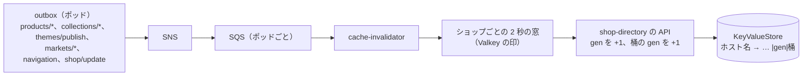

# Storefront API and Caching: Shopify

Storefront API（GraphQL、トークン、費用と上限、ボットの絞り込み）、エッジのキャッシュの鍵、世代の番号とキャッシュの無効化、在庫と価格とカートの動的な部品、SEO（サイトマップ、構造化データ、正規の URL、リダイレクト、`robots.txt`）を決める。

前提となる決定は、エッジ（CloudFront Functions と KeyValueStore）でホスト名からショップ・ポッドを引くこと（[ADR-0002](../decisions/0002-pods-and-shop-placement.md)）、ストアフロントの元への要求のショップごとのトークンバケットと `stale-if-error`（[ADR-0003](../decisions/0003-tenancy-and-rls.md)）、GraphQL の構文解析は graphql-js で費用の計算は自前（[ADR-0009](../decisions/0009-admin-api-graphql-and-cost-limits.md)）、東京の元で描いてエッジでキャッシュし、世代の番号で無効にすること（[architecture/README.md](README.md) の 6 節）、テンプレートの読み出しの形（[ADR-0047](../decisions/0047-loom-data-access-and-prefetch.md)）。要件は NFR-003（キャッシュに当たれば TTFB p95 80ms、外れれば p95 500ms、Storefront API p95 150ms）、NFR-008（分離）、NFR-011（変更の表示まで p95 10 秒・p99 60 秒）。この文書で決めたことは次の ADR にある。

| ADR | 決定 |
| --- | --- |
| [0049](../decisions/0049-storefront-api-tokens-and-limits.md) | Storefront API は `https://<shop-host>/api/<version>/graphql.json` に出し、公開のトークン（`<brand>_sf_`、ブラウザ向け、販売のチャネルに結び付く）と秘密のトークン（`<brand>_sfp_`、サーバー向け、`<Brand>-Buyer-Ip` を必須）を持つ。1 つのクエリの費用は 1,000 まで（Admin API と同じ計算）。買い手の通信に決まった量の上限は置かず、（ショップ、買い手の IP）の費用のバケット、カートとチェックアウトの作成の速さの上限、WAF の Bot Control で絞る。永続化したクエリの `GET` はエッジでキャッシュする |
| [0050](../decisions/0050-edge-cache-keys-and-generations.md) | キャッシュの鍵は 1 つの関数（`packages/edge-keys`）で（ショップ、世代、テーマのバージョン、マーケット、言語、正規化したパスとクエリ）から作る。世代の番号は、ホスト名の KeyValueStore の値に入れて配り、`cache-invalidator` がショップごとに 2 秒の窓でまとめて上げる。表示に関わる変更だけが世代を上げる。大きなショップ（`fine` の型）は、商品のページをハンドルのハッシュで 64 の桶に分け、桶ごとの世代を持つ |
| [0051](../decisions/0051-dynamic-islands-and-uncached-personal-data.md) | キャッシュする HTML に、カート・ログインした買い手・在庫の数を焼き込まない。それらは「島」（`/_<brand>/islands/…`）の小さな応答でブラウザが取る。在庫と価格の島はエッジで 5 秒キャッシュし、カートと買い手の島はキャッシュしない。キャッシュする経路では Cookie を元に渡さず、`Set-Cookie` のある応答はキャッシュしない |

## 1. 範囲

- 扱う：
  - Storefront API の入口、スキーマの範囲、トークン、費用と上限、ボットの絞り込み、キャッシュ
  - エッジのキャッシュの鍵、正規化、TTL、元の守り
  - 世代の番号、`cache-invalidator`、無効化の遅れの目標
  - 島（在庫・価格・カート・買い手の動的な部品）
  - SEO：サイトマップ、構造化データ、正規の URL、リダイレクト、`robots.txt`、`hreflang`
- 扱わない：
  - テンプレートの言語と描画（[storefront-themes.md](storefront-themes.md)）
  - ホスト名 → ショップ・ポッドの表と KeyValueStore の配り方の全体（`shops-and-pods.md`）。この文書は、その値に世代を足す
  - 待合室と許可証（[flash-sales-and-queueing.md](flash-sales-and-queueing.md)）
  - カートとチェックアウトの状態（[cart-and-checkout.md](cart-and-checkout.md)）。Storefront API のカートのミューテーションは、`checkout` の公開の関数を呼ぶだけ
  - WAF の全体の構成（`security.md`、`infrastructure.md`）

## 2. 事実（確かめたこと）

いずれも 2026-10-10 に確認。

| 項目 | 内容 | 出典 |
| --- | --- | --- |
| 本家の Storefront API | 公開のトークンと秘密のトークン。買い手の IP アドレスをヘッダーで渡し、IP の単位でボットを絞る。1 分あたりのチェックアウトの作成の数を絞り、超えると `200 Throttled` | [Storefront API](https://shopify.dev/docs/api/storefront) |
| 本家の上限 | 買い手の Storefront API の通信には決まった上限がない。ボット・クローラー・チェックアウトの作成を絞る | [API usage limits](https://shopify.dev/docs/api/usage/limits) |
| KeyValueStore | 鍵 512 バイト、値 1 KB、1 つの保存 5 MB、1 回の更新の API で 50 鍵か 3 MB、1 つの関数に結べる保存は 1 つ | [CloudFront quotas](https://docs.aws.amazon.com/AmazonCloudFront/latest/DeveloperGuide/cloudfront-limits.html) |
| CloudFront の無効化 | パスかタグで 1 秒 150、ワイルドカードは 1 秒 1 | 同上 |
| タグでの無効化 | 元の応答のヘッダーにタグ（1 オブジェクト 50 まで）を付け、`#タグ` で無効にする。配信ごとに `CacheTagConfig` で有効にする | [Invalidating content by cache tags](https://docs.aws.amazon.com/AmazonCloudFront/latest/DeveloperGuide/invalidation-by-tags.html) |

- KeyValueStore の更新が全エッジに届くまでの時間、タグでの無効化の完了までの時間は、上の文書に数値がない（**未検証**。`edge-cache-generation-poc` で測る）。
- 本家のストアフロントのキャッシュの鍵と無効化の仕組みは、公式の資料で確かめていない（**未検証**）。
- 本家のヘッダー・トークンの名前は使わず、`<Brand>`・`<brand>` で書く（[リポジトリ共通の ADR-0006](../../../../docs/decisions/0006-brand-neutral-identifiers.md)）。

## 3. 要件

| 要件 | 目標 | NFR・基準 |
| --- | --- | --- |
| 当たったページ | TTFB p95 80ms、p99 200ms | NFR-003 |
| 外れたページ | TTFB p95 500ms、p99 1.2 秒 | NFR-003 |
| Storefront API | 商品・コレクションの読み出し p95 150ms（キャッシュに外れても） | NFR-003 |
| 当たりの割合 | エッジで 90%（元への要求を 1/10 に） | [architecture/README.md](README.md) の 2 節 |
| 反映 | 価格・公開・テーマの変更が表示に出るまで p95 10 秒・p99 60 秒 | NFR-011 |
| 分離 | 鍵が違えばショップ・通貨・言語・テーマ・世代が違う。個人の値をキャッシュに入れない | NFR-008、[quality.md](../quality.md) の 2.2.1 節 G・J |
| 可用性 | 元の障害でも、キャッシュのあるページは返す | NFR-007 |

## 4. エッジのキャッシュの鍵

ADR-0050。

### 4.1 鍵の組み立て

CloudFront Functions（要求の受け取り）が次を行う。

1. ホスト名で KeyValueStore を引き、値 `v1|<shop_short>|<pod>|<state>|<gen>[|<pgen>|<桶の世代>]` を得る（7 節）。値がない（熱い集まりの外の）ホストは、元を全体の面の `edge-router` に選び、`edge-router` が `shop-directory` で引いてポッドへ中継する（[ADR-0010](../decisions/0010-shop-routing-hot-set-and-custom-domains.md)。中継した応答の `s-maxage` は 10 秒まで）。`state` が `f`・`c` なら決めたページを返す（[shops-and-pods.md](shops-and-pods.md) の 5.2 節）。
2. パスとクエリを正規化する（4.2 節）。
3. マーケットと言語を、パスの接頭辞（`/en-us/`）かマーケットの Cookie（`<brand>_market`）から決める。Cookie の値は許可の一覧（ショップの KVS の値には持てないので、形の検査だけ：`^[a-z]{2}(-[a-z]{2})?$`）で、元が正しくないと判断すれば主のマーケットで描き、`Vary` を使わずに正規化した値を鍵に入れる。
4. 鍵の材料を、CloudFront のキャッシュのポリシーの鍵（ヘッダー）として付ける：`x-<brand>-ck: <shop_short>.<gen>.<market>.<lang>`（`fine` の型の商品のページは `<shop_short>.p<pgen>.<bucket_gen>.<market>.<lang>`）。テーマのバージョンは世代に含める（テーマの公開で世代を上げる）。
5. ポッドの ALB へ送る。元は `x-<brand>-ck` を検証し（自分で同じ値を計算して比べる。違えば `Cache-Control: no-store` で返す）、描く。

- 鍵に入れないもの：買い手の IP、Cookie の全体、`User-Agent`（端末の種類で HTML を変えない。レスポンシブで書く）、`Accept-Language`（言語はパスか Cookie で明示）。
- 鍵の材料の組み立ては `packages/edge-keys` の 1 つの関数だけで行い、CloudFront Functions の JavaScript と元の TypeScript は同じ試験のベクトルを通す（ショップの区別のない鍵を作る関数を書かない。[AGENTS.md](../../AGENTS.md)）。

### 4.2 正規化

| 対象 | 規則 |
| --- | --- |
| パス | 小文字にしない（ハンドルは小文字で保存）。末尾の `/` を除く。`%` の符号化を正規化 |
| クエリの許可の一覧 | `page`、`sort_by`、`q`、`type`、`variant`、`filter.*`（[search-and-recommendations.md](search-and-recommendations.md)）、`view`、`section_id` |
| 許可の外 | 鍵から除き、元にも渡さない（`utm_*`・`gclid`・`fbclid` などの計測の値は、ブラウザの JavaScript が読む） |
| 並び | 名前の順に並べ、同じ名前の値は出た順 |
| 長さ | クエリ 1 KB まで。超えたら許可の一覧の中だけを残し、それでも超えれば 414 |

### 4.3 TTL と元の守り

| 対象 | `Cache-Control`（元の応答） |
| --- | --- |
| HTML（商品、コレクション、ページ、トップ） | `public, max-age=0, s-maxage=300, stale-while-revalidate=60, stale-if-error=86400` |
| 検索の結果のページ | `s-maxage=60`（鍵に `q` を含む） |
| アカウント・カートのページ | `private, no-store` |
| テーマの資産・メディア | `public, max-age=31536000, immutable`（内容のハッシュの URL） |
| 島（在庫・価格） | `public, s-maxage=5`（5 節） |
| 島（カート・買い手） | `private, no-store` |

- 世代で無効にするので、`s-maxage` は世代の伝わりの失敗のときの上限（最大 300＋60 秒の古さ）の役目を持つ。`edge-cache-generation-poc` の後に、当たりの割合のために 3,600 へ延ばすかを決める。
- CloudFront の Origin Shield（東京）を有効にし、同じ鍵の同時の外れをまとめる。世代を上げた直後の外れの集中は、Origin Shield と同じ鍵の要求のまとめで、元へは鍵ごとにほぼ 1 件になる。
- 元への要求は、ショップごとのトークンバケット（プランから。[ADR-0003](../decisions/0003-tenancy-and-rls.md)）を通る。超えたら 503 で返し、エッジは `stale-if-error` で古いページを返す。

## 5. 世代の番号と無効化

ADR-0050。

### 5.1 事象から世代へ



- **世代を上げる事象**：[catalog-and-pricing.md](catalog-and-pricing.md) の 12 節の事象のうち、変わった項目が `display`・`price`・`publication` のもの、テーマの公開、メニュー・ページ・ショップの設定の変更、為替の更新（`converted` のマーケットを持つショップ）。在庫の数の変化と `internal` の変更は上げない。
- **まとめ**：`cache-invalidator` は、ショップごとに最初の事象から 2 秒待ち、その間の事象を 1 回の上げにまとめる。1 ショップの世代の上げは 2 秒に 1 回まで。
- **書き込み**：世代は `shop-directory`（全体の Aurora）の `shop_hosts.cache_gen` に持ち、KeyValueStore へは `shop-directory` の配りの経路（50 鍵ずつの更新）で書く。ショップの独自のドメインが複数あれば、全ホストの値を同じ世代にする。
- **公開の取り消し・価格の誤りの直し**は、まとめの窓を待たない同期の経路（`urgent: true`）で上げる。

### 5.2 大きなショップの桶

- ショップの全体の世代を上げると、そのショップの全ページが外れる。商品の多いショップで商品の更新が続くと、当たりの割合が落ちる。
- 商品の数が 1 万を超え、かつ 1 時間の世代の上げが 60 回を超えたショップは、`fine` の型にする（Ops の判断で戻せる）。
- `fine` の型では、KeyValueStore の値に、商品のページの土台の世代 `pgen` と、64 の桶の世代（各 3 文字の 36 進、計 192 文字）を足す。
- 商品のページ（`/products/<handle>`）の鍵は、全体の世代 `gen` の代わりに、`pgen` と `fnv1a32(handle) mod 64` の桶の世代を使う（エッジは URL のハンドルしか知らないため）。他のページ（コレクション、トップ、検索）は `gen` を使う。
- 商品の `display`・`price` の変更は、その桶の世代と `gen` を上げ、`pgen` を上げない。他の商品のページは外れない。`gen` の上げは 10 秒に 1 回までにまとめる（コレクションのページの古さの上限は 10 秒＋伝わりの時間）。
- テーマの公開、ショップの設定・メニューの変更、為替の更新、ハンドルの変更は、`gen` と `pgen` の両方を上げる（全ページが外れる）。
- 1 KB の値の上限の中に収まる（ホスト名の他の値 60 バイト＋192 バイト）。

### 5.3 例

`fine` の型のショップ A（商品 5 万）で、事業者が商品 P の価格を 3,300 円から 2,980 円に変える。

| 時刻 | 事象 |
| --- | --- |
| t=0.0 秒 | Admin API の保存、outbox に `products/update`（`price`、`catalog_version=42`） |
| t=0.3 | `relay` が SNS へ。`cache-invalidator` が受け取り、2 秒の窓を始める |
| t=2.3 | 窓の終わり。`fnv1a32(P のハンドル) mod 64 = 17` の桶の世代を `1a3` → `1a4`、`gen` を `9k2` → `9k3`（直前の上げから 10 秒以上たっている）。`pgen` は `4b1` のまま |
| t=2.4 | `shop-directory` が KeyValueStore を更新 |
| t≈5〜8（未検証） | 全エッジに伝わる。P のページの鍵は `A.p4b1.1a4.jp.ja` に変わって外れ、元が新しい価格で描く。他の商品のページ（他の桶）は当たり続ける。コレクションのページは `A.9k3.jp.ja` で外れる |
| — | チェックアウトは常に DB の最新の価格で計算する（[ADR-0005](../decisions/0005-checkout-state-machine-and-exactly-once-orders.md)）。古いページから入ったカートでも、請求は 2,980 円 |

### 5.4 古さの上限

| 失敗 | 古さの上限 |
| --- | --- |
| なし | NFR-011（p95 10 秒・p99 60 秒） |
| `cache-invalidator` の遅れ | SQS の遅れの分。5 分を超えたら呼び出し |
| KeyValueStore の更新の失敗 | `s-maxage` の 300 秒＋`stale-while-revalidate` の 60 秒。`shop-directory` は更新を再試行する |
| 元の障害 | `stale-if-error` の 1 日。その間、価格の古いページが出うる（チェックアウトで正す） |

## 6. 島（動的な部品）

ADR-0051。

| 島 | 入口 | キャッシュ | 中身 |
| --- | --- | --- | --- |
| 在庫と価格 | `GET /_<brand>/islands/availability?v=<variant_ids>`（50 まで） | エッジ 5 秒（鍵：ショップ、マーケット、正規化した ID の並び） | バリエーションごとの「買える・残りわずか・在庫切れ」（目安）、今の価格 |
| カート | `GET /_<brand>/islands/cart` | なし | カートの行の数、合計 |
| 買い手 | `GET /_<brand>/islands/customer` | なし | ログインの有無、名前の頭文字 |

- キャッシュする HTML は、島の場所（`<brand-island data-kind="availability" data-variants="…">`）だけを持ち、値は既定のテーマの小さなスクリプトが取って埋める。JavaScript のない端末では、HTML の目安の値のまま表示し、カートに入れる操作は通常のフォームで動く。
- 在庫の島の値は目安で、売れるかどうかはチェックアウトの引き当てで決まる（[ADR-0004](../decisions/0004-inventory-reservation-model.md)）。「残りわずか」の閾値と表示の既定は法務の確認待ち（L2）。
- フラッシュセールの間、在庫の島は Valkey の目安の値（待合室が持つ残りの数）から返し、DB を読まない（[flash-sales-and-queueing.md](flash-sales-and-queueing.md)）。キャッシュは 1 秒にする。
- **Cookie**：キャッシュする経路の要求では、CloudFront のキャッシュのポリシーで Cookie を元に渡さない（マーケットの Cookie は Functions が鍵の材料に変えてから消す）。元は、キャッシュする経路で `Set-Cookie` を返さない（返したら CloudFront の設定で キャッシュしない、と試験で確かめる）。

## 7. KeyValueStore の値（この文書が足すもの）

ホスト名の値の全体の形は `shops-and-pods.md` が持つ。この文書は次の欄を足す。

```text
key   : <host>                                   例 "tea-shop.<brand>.<domain>"
value : v1|<shop_short>|<pod>|<state>|<gen>[|<pgen>|<fine_bucket_gens>]
        shop_short       : shop_id の短い表現（UUIDv7 の 22 文字の base64url）
        gen              : 全体の世代（36 進、最大 8 文字）
        pgen             : fine の型だけ。商品のページの土台の世代
        fine_bucket_gens : fine の型だけ。64 × 3 文字
```

- **大きさ**：1 つの KeyValueStore は 5 MB、1 つの関数に 1 つの保存しか結べない（2 節）。全ホストは入らないので、要求の多いホストだけを「熱い集まり」（4 MB まで）として置き、集まりにないホストは `edge-router` が中継する（[ADR-0010](../decisions/0010-shop-routing-hot-set-and-custom-domains.md)、[shops-and-pods.md](shops-and-pods.md) の 5.1 節）。集まりにないホストの世代は `edge-router` が `shop_hosts.cache_gen` から読み、鍵の材料に入れる。

## 8. Storefront API

ADR-0049。

### 8.1 入口とトークン

| 項目 | 決定 |
| --- | --- |
| 入口 | `POST https://<shop-host>/api/<version>/graphql.json`。永続化したクエリは `GET …/graphql.json?id=<sha256>&variables=<json>` |
| バージョン | Admin API と同じ `YYYY-MM`（[ADR-0009](../decisions/0009-admin-api-graphql-and-cost-limits.md)） |
| 公開のトークン | `X-<Brand>-Storefront-Access-Token: <brand>_sf_…`。ブラウザに置く前提で秘密でない。アプリ（ヘッドレスの販売のチャネル）ごと。許可した `Origin` の一覧を持てる |
| 秘密のトークン | `<Brand>-Storefront-Private-Token: <brand>_sfp_…`。サーバーからだけ。`<Brand>-Buyer-Ip` を必須にし、その IP で絞る。ハッシュで保存 |
| ショップの決め方 | ホスト名 → ショップ（エッジ）。トークンのショップと違えば 401（[ADR-0003](../decisions/0003-tenancy-and-rls.md)） |
| 見える商品 | トークンの販売のチャネルに公開した商品だけ（[catalog-and-pricing.md](catalog-and-pricing.md) の 8 節） |
| スコープ | `unauthenticated_read_products`、`unauthenticated_read_collections`、`unauthenticated_write_carts`、`unauthenticated_read_content`、`unauthenticated_read_customer_tags` の形。買い手の個人のデータは、買い手のアクセストークン（ログイン）があるときだけ（[app-platform-and-apis.md](app-platform-and-apis.md)） |

### 8.2 費用と上限

- 費用は Admin API と同じ計算（[app-platform-and-apis.md](app-platform-and-apis.md) の 5.3 節）。1 つのクエリの上限 1,000、超えたら `MAX_COST_EXCEEDED`。
- 買い手の通信は、全体の量の上限を置かない（本家に寄せる）。代わりに次を置く。

| 対象 | 上限 | 超えたとき |
| --- | --- | --- |
| （ショップ、買い手の IP）の費用 | 容量 2,000、回復 1 秒 200 | `THROTTLED`（HTTP 200、残りと回復の秒数） |
| カートの作成 | （ショップ、IP）1 分 30 | `THROTTLED` |
| チェックアウトへの送り | （ショップ、IP）1 分 10。フラッシュセールは許可証が要る | `THROTTLED`、`QUEUE_REQUIRED` |
| 秘密のトークンの要求で `<Brand>-Buyer-Ip` なし | — | 400 |
| WAF の速さの上限 | （IP）5 分 3,000 件（全ショップ合計） | 429（エッジ） |
| 元へのショップごとの量 | プランのトークンバケット | 503（エッジの古いキャッシュ） |

- 買い手の IP は、公開のトークンではエッジの見た IP、秘密のトークンではヘッダーの値。どちらも鍵のハッシュにだけ使い、ログに IP を書かない（IP は個人のデータとして扱う。`security.md`）。
- 秘密のトークンを持つサーバーが多くの買い手を代わりに送るので、秘密のトークンごとの合計の上限（回復 1 秒 2,000）も置く。

### 8.3 例：費用

```graphql
query CollectionPage($handle: String!) {
  collection(handle: $handle) {                  # オブジェクト 1
    title
    products(first: 24) {                         # 2 + 24 × 子
      nodes {
        id title handle                           # 商品 1
        priceRange { minVariantPrice { amount currencyCode } }   # オブジェクト 1 + 1
        featuredImage { url(transform: { maxWidth: 600 }) altText }   # 1
      }
    }
  }
}
```

子 1 つの費用は `商品 1 + priceRange 1 + minVariantPrice 1 + featuredImage 1 = 4`。`products` は `2 + 24 × 4 = 98`。全体は `1 + 98 = 99`。（ショップ、IP）のバケット 2,000 から 99 を引き、実際の商品が 10 件なら `2 + 10 × 4 = 42`、全体 43 で、差の 56 を返す。

### 8.4 Storefront API のキャッシュ

- 永続化したクエリの `GET` で、トークンが公開のもの、かつクエリが `cart`・`customer` と買い手のアクセストークンを使わないものだけ、エッジでキャッシュする（`s-maxage=60`、鍵に 4 節の材料と、クエリの ID と変数のハッシュ）。
- `POST` はキャッシュしない。
- 永続化したクエリの登録は、ヘッドレスのアプリの公開の時か、最初の `POST` の応答の後（同じハッシュの本文を受けて登録）。1 ショップ 1 万件。

## 9. SEO

| 項目 | 決定 |
| --- | --- |
| 正規の URL | 商品は `/products/<handle>`。コレクションの中の商品の URL（`/collections/<c>/products/<handle>`）は、正規の URL を `/products/<handle>` にする。マーケットのパスの接頭辞のページは、その接頭辞つきが正規 |
| `hreflang` | 有効なマーケット・言語ごとに出す。`x-default` は主のマーケット |
| リダイレクト | `url_redirects`（1 ショップ 10 万）。ハンドルを変えると、古いパスから 301 を自動で作る。描く前に元で引く（Valkey にショップごとの表を 5 分） |
| サイトマップ | `/sitemap.xml`（索引）と子（5,000 URL ずつ：商品、コレクション、ページ、記事）。`workers` が日次と変更の 10 分後にまとめて作り、S3 に置いてエッジで配る |
| 構造化データ | 既定のテーマが schema.org の `Product`・`Offer`・`BreadcrumbList` を JSON-LD で出す（`json` のフィルター）。`Offer.availability` は目安で、在庫の島と同じ値を使わない（キャッシュの値）ことを許す |
| `robots.txt` | 既定の内容（`/cart`、`/checkout`、`/account`、`/_<brand>/`、検索の結果を拒む）を、テーマの `robots.txt.loom` で上書きできる |
| 未公開・削除 | 404。削除した商品は 410 を 30 日 |
| プレビューのホスト | `noindex`、`X-Robots-Tag: noindex` |

## 10. 失敗のしかた

| 事象 | 振る舞い |
| --- | --- |
| 元（ポッド）の障害 | エッジは `stale-if-error` で 1 日まで古いページを返す。キャッシュのないページは障害のページ（静的、S3） |
| KeyValueStore の更新の失敗 | 5.4 節。`shop-directory` が再試行し、10 分を超えれば呼び出し |
| 世代の上げの嵐（一括の取り込み、アプリの連続の更新） | 2 秒の窓（`fine` は全体 10 秒）でまとめる。当たりの割合の低下をショップごとに見る |
| 島の元の障害 | 在庫の島はキャッシュのある間は古い値、なければ表示を出さない。カートの島は空の表示 |
| ボットの急増 | WAF の Bot Control、IP の上限、ショップごとの元の量。元が守られ、キャッシュに当たる買い手は影響を受けない |
| 鍵の材料の不一致（エッジと元の計算が違う） | 元は `no-store` で返し、数える（0 が目標。デプロイの順の誤りの検出） |

## 11. 上限（まとめ）

4.2・6・8.2・8.4・9 節のとおり。

## 12. data-model への項目

| 表・保存 | 中身 | 節 |
| --- | --- | --- |
| `shop_hosts`（全体）に足す列 | `cache_gen bigint`、`cache_mode`（`shop`・`fine`）、`product_page_gen bigint`、`bucket_gens int[64]` | 5、7 |
| `storefront_tokens` | `(shop_id, id)`、`app_id`、`kind`（公開・秘密）、`token_hash`、`channel`、`allowed_origins`、`scopes`、`revoked_at` | 8.1 |
| `persisted_queries` | `(shop_id, sha256)`、`query`、`cacheable`、`created_at` | 8.4 |
| `url_redirects` | `(shop_id, path)`、`target`、`status` | 9 |
| S3 | `shops/<shop_id>/sitemaps/…`（ポッドに依らない） | 9 |
| Valkey | `{<shop_id>}:ci:window`（まとめの印）、`{<shop_id>}:sfrl:<ip_hash>`（費用のバケット）、`{<shop_id>}:redirects` | 5、8.2、9 |
| KeyValueStore | ホスト名 → 7 節の値 | 7 |

## 13. テストと性質

- **PROP-EDGE-001（鍵の単射）**：任意の 2 つの要求で、ショップ・世代・桶の世代・マーケット・言語・正規化したパスとクエリのどれかが違えば、鍵が違う（[quality.md](../quality.md) の 2.2.1 節 J）。CloudFront Functions の実装と TypeScript の実装が、同じ試験のベクトルで同じ鍵を出す。
- **PROP-EDGE-002（正規化の冪等）**：正規化を 2 回かけても同じ。許可の外の引数は鍵に影響しない。
- **PROP-EDGE-003（世代の単調）**：任意の事象の列と再試行で、ホストの世代は減らない。表示に関わる事象のあと、最後の事象から窓＋1 回の配りの後に、世代は事象の前より大きい。
- **PROP-EDGE-004（個人の値なし）**：キャッシュする経路の応答に、`Set-Cookie`、買い手の名前、カートの中身が出ない（生成した買い手のセッションで要求し、HTML を走査）。
- **PROP-SFAPI-001（費用）**：任意のクエリで、見積もりが実際の費用以上（Admin API と同じ性質）。
- 合成の見張り：価格の変更から表示の変更までの時間を、見張りのショップで 5 分ごとに測る（NFR-011）。
- 漏れ：別のショップのホストで同じパスを引いても他方の内容が返らない。公開のトークンを他のショップのホストで使うと 401。未公開の商品が Storefront API と HTML に出ない。
- 負荷（E12）：エッジ 10 万件/秒の模型、世代の上げ（1 秒 100 ショップ）で当たりの割合と元の負荷を測る。
- PoC（`edge-cache-generation-poc`）：KeyValueStore の更新の伝わりの時間（p95・p99）、タグでの無効化の完了の時間を比べる。

## 14. Story の候補

| Epic | Story | 中身 |
| --- | --- | --- |
| E12 | `edge-cache-generation-poc` | 5 節の伝わりの時間、タグでの無効化との比べ |
| E12 | `storefront-api` | 8 節（ADR-0049。PROP-SFAPI-001） |
| E12 | `edge-cache-keys` | 4 節（ADR-0050。PROP-EDGE-001・002） |
| E12 | `cache-invalidation` | 5 節（ADR-0050。PROP-EDGE-003） |
| E12 | `dynamic-inventory-widget` | 6 節（ADR-0051。PROP-EDGE-004）。残りの表示は法務：L2 |
| E12 | `seo-basics` | 9 節 |

## 15. 未解決の問い

### 決定（2026-10-10、既定案）

- **トークン**：公開と秘密の 2 種類、秘密は買い手の IP を必須（ADR-0049）。
- **買い手の上限**：全体の量は絞らず、（ショップ、IP）の費用と作成の速さで絞る（ADR-0049）。
- **無効化**：世代の番号を主にし、大きなショップは 64 の桶（ADR-0050）。CloudFront のタグでの無効化は、PoC で比べる候補。
- **まとめの窓**：2 秒（`fine` の全体は 10 秒）。
- **個人の値**：島で取り、HTML に焼き込まない（ADR-0051）。

### 持ち越し

| 問い | いつ・どう決めるか |
| --- | --- |
| 世代の伝わりの時間、`s-maxage` を延ばすか、タグでの無効化に替えるか | `edge-cache-generation-poc` |
| 在庫の島の「残りわずか」の表示 | **法務の確認待ち：L2** |
| 本家のキャッシュの鍵・無効化の仕組み | 公式の資料で確かめられなかった（**未検証**のまま） |

## 出典

いずれも 2026-10-10 に確認。

- Shopify Dev, [Storefront API](https://shopify.dev/docs/api/storefront)、[API usage limits](https://shopify.dev/docs/api/usage/limits)
- AWS, [Amazon CloudFront quotas](https://docs.aws.amazon.com/AmazonCloudFront/latest/DeveloperGuide/cloudfront-limits.html)：KeyValueStore と無効化の上限
- AWS, [Invalidating content by cache tags](https://docs.aws.amazon.com/AmazonCloudFront/latest/DeveloperGuide/invalidation-by-tags.html)
- IETF, [RFC 9111](https://www.rfc-editor.org/rfc/rfc9111)（HTTP のキャッシュ）、[RFC 5861](https://www.rfc-editor.org/rfc/rfc5861)（`stale-while-revalidate`・`stale-if-error`）
