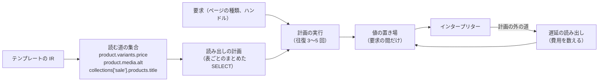
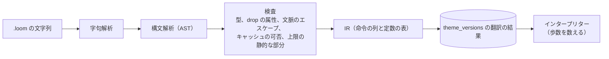
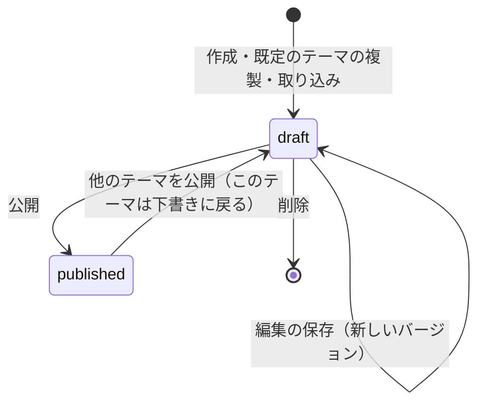
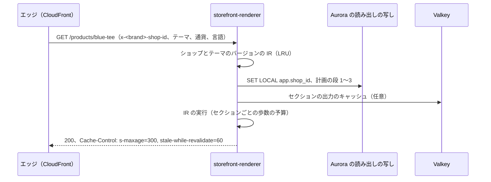

# Storefront Themes: Shopify

テーマの言語 Loom の文法と意味、型、文脈に応じたエスケープ、drop とフィルター、データの読み出しの形と上限、翻訳と IR とインタープリター、セクションとブロック、テーマの構成と公開、テーマの編集、既定のテーマ、特定商取引法の表示のページ、ストアフロントで動くスクリプトと外部送信を決める。

前提となる決定は、Loom を自前で設計し、IR に翻訳してインタープリターで動かし、副作用なし・既定でエスケープ・上限つきにすること（[ADR-0007](../decisions/0007-theme-language-design.md)）、東京の元で描画してエッジでキャッシュすること（[architecture/README.md](README.md) の 6 節）、全表に `shop_id` と FORCE RLS（[ADR-0003](../decisions/0003-tenancy-and-rls.md)）。要件は NFR-003（キャッシュに外れたとき TTFB p95 500ms）と NFR-012（1 ページの描画の CPU p99 50ms、上限の超過でページが落ちない）。法務の確認待ちは L1（特定商取引法の表示）、L2（在庫の残りの表示）、L6（外部送信規律）、L9（文法をどこまで似せてよいか）。この文書で決めたことは次の ADR にある。

| ADR | 決定 |
| --- | --- |
| [0045](../decisions/0045-loom-grammar-and-contextual-escaping.md) | Loom の文法を EBNF で固定し、演算子の優先の順位と括弧、`not`、`null`、空白の制御（`{{-`・`-}}`）を持つ。エスケープは、翻訳の時に静的な HTML を字句解析して出力の位置の文脈（本文、引用した属性、URL の属性、`<script>`、`<style>`）を決め、文脈ごとのエスケープを差し込む。引用のない属性の中の出力、`<script>`・`<style>` の中の `json`・`css_value` 以外の出力は翻訳のエラーにする |
| [0046](../decisions/0046-theme-structure-sections-and-publishing.md) | テーマは、レイアウト・テンプレート（JSON のセクションの並び）・セクション（`.loom` と `.schema.json`）・スニペット・資産・言語のファイル・設定で作る。テーマの保存は全ファイルを検査・翻訳した不変の「テーマのバージョン」にし、公開はショップの公開中のテーマのバージョンの ID を 1 つの更新で入れ替える。1 テンプレート 25 セクション、1 セクション 50 ブロック |
| [0047](../decisions/0047-loom-data-access-and-prefetch.md) | drop の属性はスキーマに列挙し、属性ごとに読み出しの費用と「キャッシュしてよいか」を持つ。翻訳の時に読む道を集めて、要求ごとのまとめた読み出しの計画にする。計画の外の動的な読み出しも費用を数える（1 ページ 200）。キャッシュするページのテンプレートは、`customer`・`cart` と個人のメタフィールドを読めない（翻訳のエラー） |
| [0048](../decisions/0048-storefront-scripts-csp-and-external-transmission.md) | ストアフロントのスクリプトは、テーマの資産（本システムの CDN）、アプリの埋め込み（`app-registry` に登録した配信元）、事業者が許可した配信元だけにし、CSP の `script-src` を配信元の一覧で組む。外部送信の公表のページは、スクリプトの一覧から自動で作る枠を用意し、文言と同意の取り方は法務の確認の後に決める |

## 1. 範囲

- 扱う：
  - Loom の文法、型、意味、エスケープ、タグ、フィルター
  - drop のスキーマ、データの読み出しの計画と費用
  - 上限と、超えたときの振る舞い（ADR-0007 の値を受ける）
  - 翻訳（字句解析、構文解析、検査、IR）とインタープリター
  - セクションとブロック、テーマのファイルの構成、テーマのバージョンと公開
  - テーマの編集の画面とプレビュー
  - 既定のテーマ 2 つ
  - 特定商取引法の表示・プライバシーの方針のページの枠
  - ストアフロントのスクリプト、CSP、外部送信の公表の枠
- 扱わない：
  - エッジのキャッシュの鍵と世代の番号、動的な部品（[storefront-api-and-caching.md](storefront-api-and-caching.md)）
  - 商品・コレクションの値そのもの（[catalog-and-pricing.md](catalog-and-pricing.md)）
  - チェックアウトの画面（[cart-and-checkout.md](cart-and-checkout.md)。テーマでは描かない）
  - 検索の結果の順位（[search-and-recommendations.md](search-and-recommendations.md)）

## 2. 本家の形（確かめたこと）

いずれも 2026-10-10 に確認。

| 項目 | 内容 | 出典 |
| --- | --- | --- |
| Liquid | 本家のテンプレートの言語。Ruby、MIT。「評価せず、安全である」ことを目標にする | [Liquid](https://github.com/Shopify/liquid) |

- 本家の Liquid が既定で出力をエスケープしないこと、本家のテーマのファイルの構成、セクションとブロックの数の上限、本家のテーマの描画の上限は、この確認では公式の資料で見ていない（**未検証**）。
- 本システムは、本家の Liquid の実装もその移植も、テーマも使わない（[リポジトリ共通の ADR-0007](../../../../docs/decisions/0007-no-reuse-of-original-implementation.md)）。`{{ }}`・`` の形は Jinja・Django にもある公開の形として使う。文法をどこまで似せてよいかは法務の確認待ち（L9）。文脈に応じたエスケープは、Go の `html/template` などで公開されている考え方で、実装は自前で書く。

## 3. 要件

| 要件 | 目標 | NFR・基準 |
| --- | --- | --- |
| 描画の速さ | キャッシュに外れたページの描画（DB の読み出しを含む）p95 250ms、描画の CPU p99 50ms | NFR-003、NFR-012 |
| 止まる | 任意のテンプレートと値で、上限の中で終わる | NFR-012 |
| XSS | `raw` を通らない値が、要素・属性・スクリプトを作らない | NFR-012、quality.md の 2.2.1 節 E |
| 分離 | drop はショップの RLS の中でだけ値を引く。キャッシュするページに個人の値が入らない | NFR-008 |
| 反映 | テーマの公開から表示まで p95 10 秒 | NFR-011 |
| 決定性 | 同じテンプレート・同じ値・同じ要求の時刻で、同じ出力と同じ歩数 | ADR-0007 |

## 4. Loom の言語

ADR-0045。

### 4.1 文法（EBNF の素描）

確定の EBNF と試験のベクトルは `loom-grammar-and-parser` の Story で開発リポジトリに置く。下はその骨格。

```ebnf
template     = { text | output | tag | comment } ;
text         = ? "{{" "{%" "{#" を含まない文字の並び ? ;
output       = "{{" [ "-" ] expr { "|" filter } [ "-" ] "}}" ;
comment      = "{#" ? "#}" を含まない任意の文字 ? "#}" ;
tag          = "" ;

tag_body     = if_tag | for_tag | case_tag | assign_tag | capture_tag
             | render_tag | section_tag | paginate_tag | form_tag | end_tag
             | "else" | "break" | "continue" ;
if_tag       = ( "if" | "elsif" | "unless" ) expr ;
for_tag      = "for" ident [ "," ident ] "in" expr { for_opt } ;
for_opt      = "limit" ":" expr | "offset" ":" expr | "reversed" ;
case_tag     = "case" expr | "when" expr { "," expr } ;
assign_tag   = "assign" ident "=" expr { "|" filter } ;
capture_tag  = "capture" ident ;
render_tag   = "render" string [ "with" expr "as" ident ] { "," ident ":" expr } ;
section_tag  = "section" string ;
paginate_tag = "paginate" expr "by" integer ;
form_tag     = "form" string [ "," expr ] ;
end_tag      = "end" ( "if" | "unless" | "for" | "case" | "capture" | "paginate" | "form" ) ;

expr         = or_expr ;
or_expr      = and_expr { "or" and_expr } ;
and_expr     = not_expr { "and" not_expr } ;
not_expr     = [ "not" ] cmp_expr ;
cmp_expr     = add_expr [ cmp_op add_expr ] ;
cmp_op       = "==" | "!=" | "<" | "<=" | ">" | ">=" | "in" | "contains" ;
add_expr     = primary ;                       (* 四則はフィルターで書く。演算子は持たない *)
primary      = literal | path | "(" expr ")" | range ;
path         = ident { "." ident | "[" expr "]" } ;
range        = "(" expr ".." expr ")" ;
filter       = ident [ ":" arg { "," arg } ] ;
arg          = expr | ident ":" expr ;
literal      = string | integer | decimal | "true" | "false" | "null" ;
ident        = letter { letter | digit | "_" } ;
```

- **優先の順位**：`not` ＞ 比べ ＞ `and` ＞ `or`。括弧で変えられる。右から評価する、のような独自の規則は持たない。
- **空白の制御**：`{{-`・`-}}`・`` は、その側の空白と改行を 1 つの塊として除く。
- **`unless`** は `if not` と同じ IR になる。
- **`for`** は `loop` の値（`index`・`index0`・`first`・`last`・`length`）を持つ。`for k, v in map` で地図を回る（鍵の順で決定的）。
- **`render`** の呼び出し先は、渡した値と、全体の drop（`shop`、`settings`、`request`、`localization`）だけを見る。呼び出し元の `assign` を見ない。
- **`` のタグ**は持たない（`{{ '{{' }}` で書く）。
- ファイルの拡張子は `.loom`。言語のバージョンは `loom_version`（初めは `1`）をテーマの設定に書く。

### 4.2 型と値

| 型 | 中身 | 比べ・真偽 |
| --- | --- | --- |
| `null` | 値なし。存在しない属性・範囲の外の添え字も `null` | 偽 |
| 真偽 | `true`・`false` | そのまま |
| 整数 | 53 ビットの符号つき。溢れはエラー（そのセクションを空にする） | 0 も真（空と偽は `null` と `false` だけ。驚きを減らすため明示にする） |
| 十進 | 文字列で持つ 10 進。四則は 9 桁に丸める（half-even） | 同上 |
| 文字列 | UTF-8。1 MB まで | 空の文字列も真。`== ""` で比べる |
| 安全な HTML | 保存の時に安全化した HTML（商品の説明、リッチテキストの設定）。エスケープしない | 文字列と同じ |
| 配列・地図 | 要素の数は上限の中 | 空も真。`.size == 0` で比べる |
| お金 | `{ amount_minor, currency }`。四則は同じ通貨どうし、整数 | お金どうしだけ比べられる |
| drop | 許可したオブジェクト（5 節） | 真 |

- 型の違う値の比べ（文字列と整数など）は `false` を返し、テーマのチェックで警告にする。暗黙の型の変換をしない。

### 4.3 文脈に応じたエスケープ

翻訳の時に、テンプレートの静的な文字（`text`）を HTML の字句解析器に通し、各 `output` の位置の文脈を決める。

| 文脈 | 例 | 差し込むエスケープ | 翻訳の時の検査 |
| --- | --- | --- | --- |
| 本文 | `<p>{{ product.title }}</p>` | `& < > " '` を文字の参照に | — |
| 引用した属性 | `` | 同上 | 属性の値が `"`・`'` で囲まれていなければエラー |
| URL の属性（`href`・`src`・`action`・`srcset`・`formaction`） | `<a href="{{ url }}">` | スキームの許可（`https`・`http`・`mailto`・`tel`・相対）。外れたら `#blocked`。その後に属性のエスケープ | 同上 |
| イベントの属性（`on*`）・`style` の属性 | `<div onclick="{{ x }}">` | — | 出力を置けばエラー |
| `<script>` の中 | `<script>var p = {{ product \| json }};</script>` | `json` の出力（`<`・`>`・`&`・U+2028・U+2029 を `\uXXXX` に） | `json` 以外の出力はエラー |
| `<style>` の中 | `color: {{ settings.color \| css_value }};` | 色・長さ・数だけを通す | `css_value` 以外はエラー |
| コメント・`<textarea>`・`<title>` | — | 本文と同じ | — |

- 安全な HTML の型の値は、本文の文脈でだけエスケープせずに出す。他の文脈ではエラー。
- `raw` は、文字列をエスケープせずに出す（本文の文脈だけ）。テーマのチェックで警告にし、既定のテーマでは使わない。
- 字句解析は HTML の構文解析の全部はしない（`` の分岐で属性の中か外かが変わるテンプレートは、分岐ごとに文脈を計算し、違えばエラー）。

### 4.4 フィルター

フィルターの一覧は言語のバージョンで固定する。名前は ADR-0007 の名前を含む。

| 種類 | フィルター |
| --- | --- |
| 文字列 | `upcase`、`downcase`、`truncate: n`（文字の数、書記素の単位）、`trim`、`replace: a, b`、`split: s`、`append: s`、`prepend: s`、`escape`、`url_encode`、`slug`、`newline_to_br`、`strip_html` |
| 数 | `add: n`、`sub: n`、`mul: n`、`div: n`（0 で割るとエラー）、`mod: n`、`round: d`、`clamp: min, max` |
| 配列 | `map: "key"`、`where: "key", value`、`sort: "key"`（照合の順、同じなら元の順）、`first`、`last`、`size`、`uniq`、`reverse`、`slice: from, n`、`join: s`、`concat: xs` |
| お金 | `money`（`¥3,300`）、`money_with_currency`（`¥3,300 JPY`）、`money_amount`（`3300`）。通貨の桁と記号はショップの言語の設定 |
| 画像 | `image_url: width: w, height: h, crop: c`（[catalog-and-pricing.md](catalog-and-pricing.md) の 6 節の 16 段に丸める）、`image_tag: alt: a, sizes: s`（`srcset` を組む） |
| 日付 | `date: "%Y年%m月%d日"`（タイムゾーンはショップ）。`now` は要求の開始の時刻 |
| 出力 | `json`、`css_value`、`raw` |
| 言語 | `t: "key"`（言語のファイルの訳。値の差し込みは `t: "key", count: n`） |
| URL | `product_url`、`collection_url`、`asset_url: "file"`（内容のハッシュつきの URL） |

- 利用者の定義するフィルターは持たない。フィルターは全部、副作用がなく、決まった歩数（入力の大きさに比例）を数える。

### 4.5 タグの例

```loom
{# 商品の価格と比較の価格 #}

<p class="price">
  {{ v.price | money }}
  
    <s>{{ v.compare_at_price | money }}</s>
  
</p>

  {{ m | image_url: width: 800 | image_tag: alt: m.alt }}

<script type="application/ld+json">{{ product.structured_data | json }}</script>
```

## 5. drop とデータの読み出し

ADR-0047。

### 5.1 drop のスキーマ

`packages/loom/schema` に drop ごとの属性を列挙する。属性は型、費用、キャッシュの可否を持つ。

| drop | 主な属性 | 費用 | キャッシュするページで |
| --- | --- | --- | --- |
| `shop` | `name`、`currency`、`locale`、`legal`（特定商取引法の表示の値） | 0（要求の始めに読む） | 読める |
| `product` | `title`、`handle`、`description`（安全な HTML）、`variants`、`options`、`media`、`price_min`、`price_max`、`tags`、`metafields.<ns>.<key>`（公開の定義だけ） | 1（ページの主の商品は 0） | 読める |
| `variant` | `title`、`price`、`compare_at_price`、`compare_at_basis`、`sku`、`available`（目安） | 0（商品と一緒に読む） | 読める。`available` は目安（[storefront-api-and-caching.md](storefront-api-and-caching.md) の動的な部品で上書き） |
| `collection` | `title`、`products`（ページ単位）、`products_count`、`filters` | 1（ページの 1 回の読み出し） | 読める |
| `collections['handle']` | 名前でのコレクション | 1 | 読める |
| `all_products['handle']` | 名前での商品 | 1 | 読める。1 ページ 20 回まで |
| `search` | `results`、`terms`、`filters` | 2 | 読める（鍵に検索の文字を含む） |
| `recommendations` | 関連の商品 | 2 | 読める |
| `cart` | 行、合計 | — | **読めない**（動的な部品で出す） |
| `customer` | 名前、注文の履歴 | — | **読めない**。アカウントのページ（キャッシュしない）だけ |
| `request` | `path`、`locale`、`page_type`、`design_mode` | 0 | 読める（ホスト・Cookie・IP は持たない） |
| `settings`・`section`・`block` | テーマの設定 | 0 | 読める |
| `page`・`blog`・`article` | 内容のページ、記事 | 1 | 読める |

- スキーマにない属性は `null`。`constructor`・`__proto__`・`prototype` などの名前は、スキーマの引きの前に拒む（属性の引きは地図の表で行い、JavaScript のオブジェクトの属性の参照をしない）。
- drop の値は、要求のトランザクション（読み出しの写し、`SET LOCAL app.shop_id`）の中でだけ引く。

### 5.2 先読みの計画



- 翻訳の時に、テンプレートと `render` の先と、テンプレートの JSON に並んだセクションを辿り、読む道を集める。道の添え字が定数（`collections['sale']`）なら計画に入れ、変数（`collections[block.settings.handle]`）なら、テーマの設定の値を要求の始めに埋めてから計画に入れる。それでも決まらない道は遅延の読み出しになる。
- 計画は段で実行する：段 1 はページの主（商品・コレクション）、段 2 はその子（バリエーション、メディア、ページの商品）、段 3 は名前の参照とメタフィールド。各段は表ごとに `WHERE id = ANY($1)` の 1 回の SELECT。
- 費用は、計画と遅延の読み出しの両方で、1 ページ 200 まで（ADR-0007）。超えたら、超えた時点のセクションを空にする（他のセクションは続く）。

### 5.3 費用の例

コレクションのページ（48 商品、各商品の最初の画像と最小の価格）と、ヘッダーのメニュー、おすすめのセクション：

| 読み出し | 費用 |
| --- | --- |
| ページの主のコレクション | 0 |
| コレクションの 1 ページの商品（48 件、バリエーションと画像は同じ段） | 1 |
| メニュー（`linklists['main']`） | 1 |
| `collections['new']` の 4 商品（おすすめのセクション） | 1 |
| 各商品のメタフィールド `custom.badge`（計画の中、まとめた 1 回） | 1 |
| 合計 | 4 |

- 悪い例：`{{ all_products[p.handle].title }}` は、遅延の読み出しが商品ごとに 1 で、48 回になる（`all_products` は 1 ページ 20 回まで。21 回目からそのセクションを空にする）。テーマのチェックがこの形を警告する。

## 6. 翻訳と実行



- IR の形は `loom_ir_version` で固定する。命令は、値を積む・属性を引く・フィルターを呼ぶ・文字を出す・分岐・回る・`render` を呼ぶ、の 20 前後。各命令は歩数 1、フィルターは入力の大きさに比例した歩数。
- インタープリターは TypeScript で、`eval`・`new Function`・`vm` を使わない（[ADR-0007](../decisions/0007-theme-language-design.md)）。IR を JavaScript に翻訳しない。
- `storefront-renderer` のタスクは、テーマのバージョンの IR を LRU（タスクあたり 256 MB）に持つ。
- セクションの出力は、（テーマのバージョン、セクションの ID、設定のハッシュ、読んだ値の `catalog_version` の組）を鍵に Valkey に 5 分置ける（コレクションのページのヘッダーなど、同じ出力の多いもの）。鍵の先頭はショップ（[AGENTS.md](../../AGENTS.md)）。

### 6.1 上限

ADR-0007 の値をそのまま使う（`theme-renderer-poc` で見直す）。

| 対象 | 既定 | 超えたとき |
| --- | --- | --- |
| 歩数 | 1 ページ 100 万、1 セクション 20 万 | そのセクションを空にする |
| 出力 | 1 ページ 2 MB | 描画を止め、エラーのページ（500。エッジは古いキャッシュを返せる） |
| ループ | 1 つの `for` 1,000 要素、1 ページの合計 5 万 | 1,000 で切る |
| `render` の入れ子 | 深さ 10 | そのセクションを空にする |
| 文字列 | 1 MB | 切る |
| データの読み出し | 1 ページ 200 | そのセクションを空にする |
| ファイル | 1 ファイル 256 KB、テーマ全体 50 MB | 保存の時に拒む |
| 壁の時計 | 1 ページ 1 秒（本システムの異常の検出） | エラーのページ、障害として数える |

- セクションを空にしたときは、HTML のコメント（`<!-- section 'x' failed: STEP_LIMIT -->`）を出し、テーマの編集のプレビューでは位置と理由を見せる。理由のコードはメトリクスに数える（[quality.md](../quality.md) の 4.1 節の「テンプレートの上限の超過の急増」）。

## 7. テーマの構成と公開

ADR-0046。

### 7.1 ファイル

```text
theme/
  theme.json                 # 名前、loom_version、設定のスキーマ、言語
  layout/theme.loom          # 全ページの外枠。{{ content_for_layout }} と  の固定の部分
  templates/
    index.json               # セクションの並びと設定
    product.json
    collection.json
    page.legal.json          # 特定商取引法の表示のページ
    customers/account.loom   # キャッシュしないページ
  sections/
    header.loom
    header.schema.json       # 設定とブロックの定義（JSON スキーマの部分集合）
    product-main.loom
    product-main.schema.json
  snippets/price.loom
  assets/theme.css、theme.js、images/…
  locales/ja.json、en.json
  config/settings_data.json  # 事業者の設定の値
```

- テンプレートの JSON：

```json
{
  "sections": {
    "main": { "type": "product-main", "settings": { "show_vendor": true },
              "blocks": { "b1": { "type": "title" }, "b2": { "type": "price" }, "b3": { "type": "buy" } },
              "block_order": ["b1", "b2", "b3"] },
    "rec":  { "type": "related", "settings": { "count": 4 } }
  },
  "order": ["main", "rec"]
}
```

- 1 テンプレート 25 セクション、1 セクション 50 ブロック、設定の値のファイル 1 MB。
- セクションの設定のスキーマは別のファイル（`.schema.json`）に置き、テンプレートの中に埋めない。

### 7.2 テーマのバージョンと公開



- 保存は、テーマの全ファイルを検査・翻訳し、通れば不変の `theme_versions` の行（ファイルの内容のハッシュの一覧と IR）を作る。通らなければ保存しない（エラーの位置を返す）。
- ショップは `published_theme_version_id` を 1 つ持つ。公開は、この列の 1 つの更新と outbox の `themes/publish` の事象（キャッシュの世代を上げる）で行う。公開の途中の状態はない。
- 公開中のテーマの編集は、新しいバージョンを作り、`published_theme_version_id` を進める（同じ公開の手順）。直前のバージョンへの戻しは、ID の書き戻しで行う。
- 1 ショップ 20 テーマ、1 テーマ 100 バージョン（古いものから消す。公開中のものは消さない）。
- 資産のファイルは内容のハッシュの URL（`/<brand>-assets/<shop_id>/<hash>/<name>`）で、`immutable` で配る。

### 7.3 テーマの編集

- 管理画面のテーマの編集は、左にセクションとブロックの木、右にプレビューの iframe を持つ。プレビューは `storefront-renderer` の `design_mode` で、キャッシュしない専用のホスト（`preview.<brand>.<domain>`、署名つきの 30 分の URL、スタッフのセッションに結び付く）で描く。
- プレビューでは、セクションを空にした理由と位置、読み出しの費用、歩数をセクションごとに見せる。
- コードの編集（`.loom` の直接の編集）は、権限 `themes_code` を持つスタッフだけ（`merchant-admin-and-staff.md`）。

### 7.4 既定のテーマ

- 2 つ（「シンプル」と「ブランド」）。自前で作り、本家のテーマを使わない。
- 両方とも、`raw` を使わず、`all_products` を使わず、5.3 節の費用で 10 以下に収める。Lighthouse の性能 90 以上（スマートフォン）を受け入れの基準にする。
- 在庫の残りの表示（「残り N 個」）は、既定で出さない設定にする（法務の確認待ち L2。[ADR-0004](../decisions/0004-inventory-reservation-model.md) の目安の値）。比較の価格の表示の既定は [catalog-and-pricing.md](catalog-and-pricing.md) の 9.1 節。

## 8. 特定商取引法の表示とプライバシーの方針

- ショップの設定に、特定商取引法の表示の項目の入力の欄（事業者の名前、住所、電話番号、責任者、価格、送料、その他の費用、支払いの時期と方法、引き渡しの時期、返品の特約、請求があれば遅滞なく開示する旨の選択など）を置き、`shop.legal` の drop で読む。
- 既定のテーマは、表示のページ（`templates/page.legal.json`）と、フッターからのリンクを持つ。テーマの公開の時に、表示のページへのリンクがフッターにないテーマを警告する。
- どの項目が要るか、省略の条件、表示の義務の分担（事業者が負い、本システムは欄と場所を用意する）は法務の確認待ち（L1）。プライバシーの方針のひな形は法務の確認待ち（L3）。
- 最終確認画面はチェックアウトの画面でテーマで描かない（[cart-and-checkout.md](cart-and-checkout.md)）。

## 9. スクリプトと外部送信

ADR-0048。

| スクリプトの出どころ | 置き方 | CSP |
| --- | --- | --- |
| テーマの資産 | `{{ 'theme.js' \| asset_url }}` | 本システムの資産の CDN を許可 |
| アプリの埋め込み（app embed） | アプリが `app-registry` に登録した配信元の URL。事業者がテーマの編集で有効にする | 登録した配信元を許可 |
| 本システムの計測 | 本システムの CDN の 1 本 | 許可 |
| 事業者の追加の配信元（タグの管理など） | ショップの設定の許可の一覧（20 まで）。追加の時に警告 | 一覧を許可 |
| インラインのスクリプト | テーマの中の `<script>` | 翻訳の時に内容のハッシュを集め、`'sha256-…'` で許可。`{{ }}` を含むインラインは `json` の出力だけ（4.3 節）。ハッシュはテーマのバージョンごとに固定 |

- CSP は `script-src 'self' <資産の CDN> <許可の一覧> <ハッシュ>` で強制する。キャッシュするページに `nonce` を使わない（応答ごとに変わる値はキャッシュと合わない）。
- 違反の報告は `report-to` で受け、ショップごとに数える（中身は保存しない）。
- **外部送信の公表**：上の表の有効なスクリプトから、送信先と目的（アプリの登録の値、本システムの計測）を集めた一覧を作り、公表のページの枠（`templates/page.external-transmission.json`）で出せるようにする。通知・公表の義務を負う者、文言、同意の取り方、同意の前に止めるスクリプトの範囲は法務の確認待ち（L6）。同意の仕組みは、スクリプトの種類（必須・計測・広告）ごとに読み込みを止められる形にしておく。

## 10. 描画の流れ



## 11. 失敗のしかた

| 事象 | 振る舞い |
| --- | --- |
| セクションの上限の超過・実行のエラー | そのセクションを空にしてページを返す |
| 出力の上限・レイアウトのエラー | 500。エッジは `stale-if-error` で古いページを返せる |
| 読み出しの写しの遅れ・障害 | 書き込みの側で読まない（チェックアウトの DB を守る）。503。エッジは古いページ |
| テーマのバージョンの IR が読めない | 公開中のバージョンの 1 つ前で描き、警告 |
| IR のバージョンの変更（レンダラーの更新） | 古い `loom_ir_version` の IR を新しいレンダラーが読めない場合、公開中のテーマを背景で翻訳し直してから出す（`delivery.md`） |

## 12. data-model への項目

| 表 | 中身 | 節 |
| --- | --- | --- |
| `themes` | `(shop_id, id)`、`name`、`role`（`draft`・`published`）、`source`（既定のテーマ、取り込み） | 7.2 |
| `theme_versions` | `(shop_id, id)`、`theme_id`、`loom_version`、`loom_ir_version`、`files jsonb`（パス → 内容のハッシュ）、`ir_s3_key`、`script_hashes`、`created_by`、`created_at` | 7.2 |
| `shops.published_theme_version_id` | 公開中のテーマのバージョン | 7.2 |
| `shop_legal_settings` | 特定商取引法の表示の項目 | 8 |
| `shop_script_allowlist` | 追加の配信元（20 まで） | 9 |
| `app_embeds`（`app-registry`、全体） | アプリの埋め込みの配信元、種類、送信先と目的の宣言 | 9 |
| S3 | `shops/<shop_id>/themes/<theme_version>/…`（ファイルと IR。ポッドに依らない） | 7 |
| Valkey | `{<shop_id>}:sec:<theme_version>:<section>:<hash>` | 6 |

## 13. テストと性質

- **PROP-LOOM-001（止まる）**：任意のテンプレート（文法の生成器と壊した文字列）と任意の drop の値で、翻訳と実行が例外でプロセスを落とさず、6.1 節の上限の中で終わる（[quality.md](../quality.md) の 2.2.1 節 E）。
- **PROP-LOOM-002（エスケープ）**：任意の値で、`raw` と安全な HTML を通らない出力は、html5 の構文解析で要素・属性・コメントを作らない。URL の属性に `javascript:` が出ない。`json` の出力は `<script>` を閉じない。
- **PROP-LOOM-003（決定性）**：同じテンプレート・値・要求の時刻で、出力と歩数と読み出しの費用が同じ。
- **PROP-LOOM-004（隔離）**：1 つのセクションの失敗が、他のセクションの出力を変えない。
- **PROP-LOOM-005（キャッシュの可否）**：キャッシュするページの種類のテンプレートで、`customer`・`cart` と非公開のメタフィールドを読むものは、翻訳で拒まれる。
- **PROP-LOOM-006（プロトタイプ）**：`constructor`・`__proto__`・`prototype`・`toString` などの名前の属性とフィルターは `null` かエラーで、内部のオブジェクトに届かない。
- **DT-LOOM-001**：4.3 節の文脈 × 出力の形（フィルター）→ 許可・エスケープ・エラーの表。
- 試験のベクトル：文法の各規則、フィルターの全部、文脈のエスケープ。言語のバージョンごとに固定し、期待する値の変更は QA の承認。
- 結合：テーマの保存で不正なテーマが拒まれ、公開が 1 つの更新で入れ替わり、`themes/publish` が世代を上げる。
- 負荷（`theme-renderer-poc`）：既定のテーマのコレクションのページ（48 商品）で描画の CPU p99 50ms。

## 14. Story の候補

| Epic | Story | 中身 |
| --- | --- | --- |
| E11 | `theme-renderer-poc` | IR のインタープリターの速さ、歩数の上限の値 |
| E11 | `loom-grammar-and-parser` | 4.1・4.3 節（ADR-0045。DT-LOOM-001）。文法の確定は法務：L9 |
| E11 | `loom-ir-and-interpreter` | 6 節、上限（PROP-LOOM-001・003・004） |
| E11 | `loom-drops-and-filters` | 4.4・5 節（ADR-0047。PROP-LOOM-005・006） |
| E11 | `loom-fuzzing` | PROP-LOOM-001・002 のファジング |
| E11 | `sections-and-blocks` | 7.1・7.2 節（ADR-0046） |
| E11 | `theme-editor` | 7.3 節 |
| E11 | `default-themes` | 7.4 節。在庫の残りの表示は法務：L2 |
| E11 | `legal-pages` | 8 節。法務：L1・L3 |
| E11 | `storefront-analytics` | 9 節の計測と公表の枠（ADR-0048）。法務：L6 |

## 15. 未解決の問い

### 決定（2026-10-10、既定案）

- **文法**：EBNF で固定、普通の優先の順位、`null`、`{# #}`、演算子の四則は持たない（ADR-0045）。
- **エスケープ**：文脈に応じて翻訳の時に差し込む。危ない文脈は翻訳のエラー（ADR-0045）。
- **テーマの公開**：不変のバージョンと ID の入れ替え（ADR-0046）。
- **データの読み出し**：静的な先読みと費用 200、キャッシュするページで個人の値を読めない（ADR-0047）。
- **スクリプト**：配信元の一覧とハッシュの CSP、`nonce` を使わない（ADR-0048）。

### 持ち越し

| 問い | いつ・どう決めるか |
| --- | --- |
| 文法・タグとフィルターの名前をどこまで似せてよいか | **法務の確認待ち：L9**。確認の後に名前を変える余地を残すため、`loom_version` 1 の確定は確認の後 |
| 特定商取引法の表示の項目と分担 | **法務の確認待ち：L1** |
| 在庫の残りの表示の既定 | **法務の確認待ち：L2** |
| 外部送信の公表の文言と同意 | **法務の確認待ち：L6** |
| 歩数の上限の値、描画の速さ | `theme-renderer-poc` |
| 本家の Liquid のエスケープの既定、テーマの構成の上限 | 公式の資料で確かめられなかった（**未検証**のまま） |

## 出典

いずれも 2026-10-10 に確認。

- Shopify, [Liquid](https://github.com/Shopify/liquid)：本家のテンプレートの言語（MIT、Ruby）。本システムは使わない
- W3C, [Content Security Policy Level 3](https://www.w3.org/TR/CSP3/)：`script-src` のハッシュと配信元
- WHATWG, [HTML Standard](https://html.spec.whatwg.org/)：字句解析の文脈（スクリプトのデータ、属性の値）
