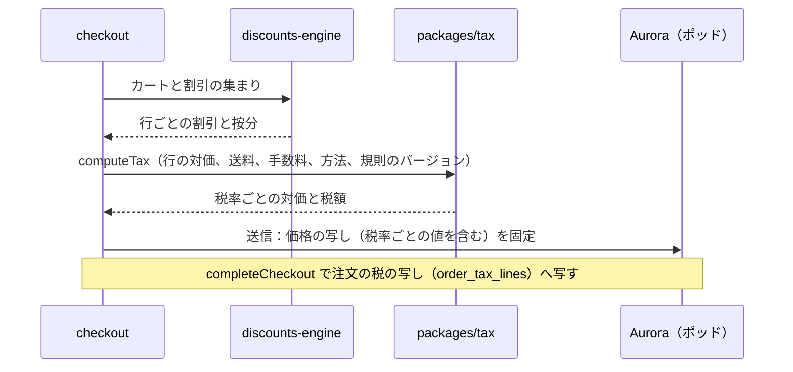
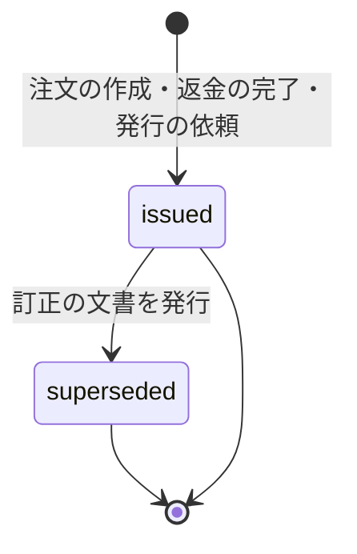
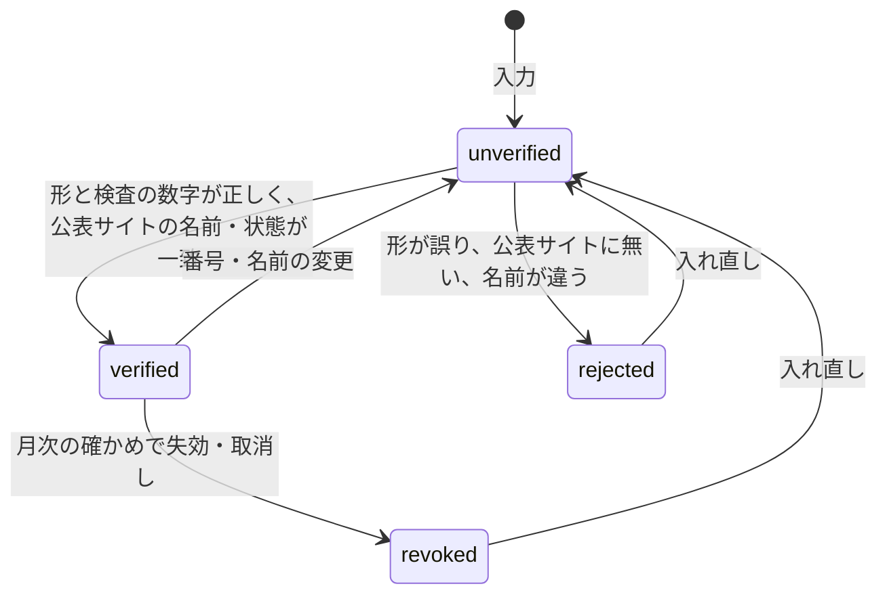

# Taxes and Invoices: Shopify

消費税の区分（10%・8%・非課税など）、総額表示、税率ごとの端数処理、割引・送料・手数料の税の扱い、適格簡易請求書（レシート）と適格請求書、適格請求書発行事業者の登録番号、返品の返還インボイスを決める。

前提となる決定は、金額は整数の最小単位（[AGENTS.md](../../AGENTS.md)）、価格の正本は税込みの整数（[ADR-0015](../decisions/0015-markets-currencies-and-rounding.md)）、送信で価格の写しを固定し、表示・注文・決済の金額を一致させること（[ADR-0005](../decisions/0005-checkout-state-machine-and-exactly-once-orders.md)）。要件は NFR-013（参照の計算との差 0 円）。**この領域の全 Story は法務の確認待ち（L4）で、確認が済むまで spec を承認しない。** この文書は、どの結論にも対応できる仕組みを書く。この文書で決めたことは次の ADR にある。

| ADR | 決定 |
| --- | --- |
| [0017](../decisions/0017-consumption-tax-calculation-and-rounding.md) | 税は `packages/tax` の純粋な関数で計算する。税込みの対価を税率ごとに合計し、税率ごとに 1 回だけ、ショップの設定の方法（`floor`・`half_up`・`ceil`。既定は `floor`）で丸める。品目ごとに丸めて足さない。注文の単位の割引の行への按分は、切り捨ての後の残りを額の大きい行から 1 円ずつ割り振る決定的な規則で行う（[discounts-engine.md](discounts-engine.md) と共通）。計算の規則は `tax_rules_version` でバージョンを付け、注文に記録する |
| [0018](../decisions/0018-invoice-documents-and-receipts.md) | レシート（適格簡易請求書）・適格請求書・返還インボイスを、注文から作る不変の文書（`tax_documents`）にする。記載の値は注文の税の写しから取り、計算し直さない。番号はショップごとの連番。直しは元を消さず、訂正の文書を足す。PDF は要求の時に文書の値から描く |
| [0019](../decisions/0019-invoice-registration-number-verification.md) | 登録番号（`T`＋13 桁）は、形と検査の数字を確かめた後、国税庁の公表サイトの照会で事業者の名前と状態を確かめてから有効にする。月に 1 回確かめ直し、失効したら文書への記載を止めて事業者に知らせる |

## 1. 範囲

- 扱う：
  - 税の区分と、商品・送料・手数料への付け方
  - 総額表示と、税込みの価格からの税額の計算
  - 税率ごとの端数処理と、方法の設定
  - 割引（行の割引、注文の単位の割引、送料の割引）の税率ごとの扱い
  - 返品・返金の税額の計算の口（金額の決定は [returns-and-refunds.md](returns-and-refunds.md)）
  - レシート・適格請求書・返還インボイスの文書、番号、記載事項、PDF
  - 登録番号の入力と確かめ
- 扱わない：
  - 割引の行への按分の規則そのもの（[discounts-engine.md](discounts-engine.md)）。この文書は、按分の後の行の対価を税率ごとに合計する。
  - 返金の額（[returns-and-refunds.md](returns-and-refunds.md)）
  - 本システムが事業者から受け取る料金（プラン、手数料）の本システム自身のインボイス（`merchant-admin-and-staff.md` と請求の仕組み。法務の L4）
  - 海外の税と輸出の免税（越境の Epic）

## 2. 制度の形（確かめたこと）

いずれも 2026-10-10 に確認。法令の解釈は書かない。下の事項の当てはめは**法務の確認待ち（L4）**。

| 項目 | 内容 | 出典 |
| --- | --- | --- |
| 適格請求書の記載事項 | 交付を受ける者の氏名・名称、売手の氏名・名称と登録番号、取引の年月日、取引の内容（軽減税率の対象の品目である旨）、税率ごとの対価の額の合計と適用税率、税率ごとの消費税額等 | [国税庁 インボイス制度について](https://www.nta.go.jp/taxes/shiraberu/zeimokubetsu/shohi/keigenzeiritsu/invoice_about.htm) |
| 適格簡易請求書 | 不特定多数の者に販売する小売業などで交付できる。宛名を省ける。税率か税額のどちらか一方の記載でよい | 同上 |
| 端数処理 | 一の適格請求書につき、税率ごとに 1 回の端数処理を行う（[intent.md](../intent.md) の「守るべき振る舞い」の前提） | 国税庁の Q&A で確かめる（[インボイス制度特設サイト](https://www.nta.go.jp/taxes/shiraberu/zeimokubetsu/shohi/keigenzeiritsu/invoice.htm)）。この確認では Q&A の該当の問を読んでいない（**未検証**） |

- 返還インボイスの記載事項、少額の返還インボイスの交付の義務の免除、送料・代引きの手数料の税率、ネットの通信販売での簡易インボイスの可否は、この確認では読んでいない（**未検証**。法務の L4 で確かめる）。
- 本家の税の計算（品目ごとか、税率ごとか、日本の端数処理の選択）は、公式の資料で確かめていない（**未検証**）。

## 3. 要件

| 要件 | 目標 | NFR・基準 |
| --- | --- | --- |
| 税額の正しさ | 注文の税率ごとの税額が、参照の実装 `tax-ref` と 1 円も違わない | NFR-013、K6 |
| 一致 | 最終確認画面・注文・決済・レシートの金額と税額が同じ | NFR-013、[intent.md](../intent.md) |
| 計算の速さ | 税の計算 1 回（行 250）p99 2ms（チェックアウトの段 p99 500ms の中） | NFR-001 |
| 再現 | 過去の注文の税額を、そのときの規則のバージョンで計算し直せる | 監査、quality.md の 4.2 節（抜き取りの再計算） |
| 文書の不変 | 発行した文書の値を書き換えない | 法務の L4 |

## 4. 税の区分

| 区分 | 税率 | 例 |
| --- | --- | --- |
| `standard_10` | 10% | 雑貨、衣類、酒類 |
| `reduced_8` | 8%（軽減税率） | 酒類を除く飲食料品、定期購読の新聞（MVP の後） |
| `exempt` | 非課税 | 非課税の取引（例：一部の商品券。MVP では使う場面が少ない） |
| `out_of_scope` | 不課税 | 寄付など |
| `export_zero`（MVP の後） | 0%（輸出の免税） | 越境の Epic |

- 税率は区分の表（`tax_rates`、`effective_from` つき）から引く。税率の変更は、新しい行を `effective_from` で足し、注文の作成の時刻ではなく**送信の時刻**の税率を使う（価格の写しを固定する時点。[ADR-0005](../decisions/0005-checkout-state-machine-and-exactly-once-orders.md)）。
- 商品の区分（[catalog-and-pricing.md](catalog-and-pricing.md) の 10 節）から候補を勧めるが、決めるのは事業者。商品の税の区分はバリエーションでなく商品が持つ。
- **送料・手数料**：ショップの設定で区分を持つ（既定は `standard_10`）。送料・代引きの手数料の区分の扱い（税率の混ざる注文の送料の区分）は法務の確認待ち（L4）。仕組みは「送料の区分を固定で持つ」と「送料を税率ごとの対価の比で分ける」の両方を、設定（`shipping_tax_mode: fixed | proportional`）で持つ。既定は `fixed`。
- **免税事業者のショップ**（登録番号を持たない）：税込みの価格での販売は同じ。文書は適格でないレシートになり、登録番号を出さない（7 節）。税額をレシートに出すかの扱いは法務の確認待ち（L4）。

## 5. 税額の計算

ADR-0017。

### 5.1 入力と出力

```text
computeTax(input) -> TaxResult
input:
  lines[]        : { line_id, tax_category, gross_after_line_discounts }   ← 税込み、整数
  order_discounts: { amount, allocation[] }                                 ← discounts-engine が行へ按分した結果
  shipping[]     : { shipping_line_id, gross_after_discount, tax_category } ← 税込み、整数
  fees[]         : { fee_id, gross, tax_category }
  rounding_mode  : floor | half_up | ceil
  tax_rules_version, as_of（送信の時刻）
output:
  per_rate[]     : { rate, taxable_gross, tax_amount }   ← 税率ごとに 1 行
  lines[]        : { line_id, rate, net_gross }          ← 行の対価（割引の後）。行ごとの税額は持たない
  total_gross, total_tax
```

- 全部が税込みの整数。計算の途中の割り算は、有理数（分子と分母の整数）で持ち、最後に 1 回だけ丸める。
- 行ごとの税額は**出力しない**。品目ごとの税額を求める画面・API・アプリがあっても、税率ごとの値だけを正とする（品目ごとの「税額の目安」を出すなら、表示の専用の値として別に計算し、合計に使わない）。

### 5.2 手順

1. 各行の対価 `net_gross = gross_after_line_discounts − (注文の単位の割引の、その行への按分)`。按分は [discounts-engine.md](discounts-engine.md) が行ごとに出す（比で切り捨て、残りを額の大きい行から 1 円ずつ、同じ額なら行の ID の順。[quality.md](../quality.md) の 2.2.1 節 C）。この文書はその結果を受け取る。
2. 税率ごとに、行・送料・手数料の対価を合計する：`taxable_gross[r] = Σ net_gross`。
3. 税率ごとに税額を計算する：`tax[r] = round_mode(taxable_gross[r] × r / (100 + r))`。ここが**唯一の丸め**。
4. `total_gross = Σ taxable_gross[r]`（非課税・不課税を含む）。`total_tax = Σ tax[r]`。

丸めの方法（有理数 `p/q`、`q > 0`、`p ≥ 0`）：

| 方法 | 結果 |
| --- | --- |
| `floor`（切り捨て。既定） | `⌊p/q⌋` |
| `half_up`（四捨五入） | `⌊(2p + q) / 2q⌋` |
| `ceil`（切り上げ） | `⌈p/q⌉` |

- 方法はショップの設定で選ぶ（法務の L4 で、事業者が選べることの扱いを確かめる）。設定の変更は、変更の後に送信したチェックアウトから効く。注文は使った方法を記録する。
- 返金で対価が負になる計算は、6 節の別の関数で行う（負の数の丸めを持ち込まない）。

### 5.3 例

ショップの方法は `floor`。カート：

| 行 | 区分 | 単価（税込み） | 数 | 税込みの額 |
| --- | --- | --- | --- | --- |
| A：お茶の葉 | `reduced_8` | 1,080 | 2 | 2,160 |
| B：マグカップ | `standard_10` | 3,300 | 1 | 3,300 |
| C：コースター | `standard_10` | 550 | 3 | 1,650 |
| 送料 | `standard_10`（`fixed`） | 880 | 1 | 880 |

注文の単位の割引 500 円（商品だけが対象）。[discounts-engine.md](discounts-engine.md) の按分（商品の額 7,110 円の比）：

- A：`500 × 2,160 / 7,110 = 151.898…`、B：`500 × 3,300 / 7,110 = 232.067…`、C：`500 × 1,650 / 7,110 = 116.033…`
- 切り捨てで 151・232・116（和 499）。残り 1 円を、額の大きい B に割り振る → A 151、B 233、C 116。

税率ごとの対価：

- 8%：`2,160 − 151 = 2,009`
- 10%：`(3,300 − 233) + (1,650 − 116) + 880 = 3,067 + 1,534 + 880 = 5,481`

税額（税率ごとに 1 回）：

- 8%：`2,009 × 8 / 108 = 148.81…` → 148
- 10%：`5,481 × 10 / 110 = 498.27…` → 498

合計 7,490 円（うち 8% 対象 2,009 円・税額 148 円、10% 対象 5,481 円・税額 498 円）。

**品目ごとに丸めると違う例**：10% の 160 円の品を 3 個。品目ごとなら `160 × 10 / 110 = 14.54…` → 14 を 3 回で 42 円。税率ごとなら `480 × 10 / 110 = 43.63…` → 43 円。本システムは 43 円を出す。

### 5.4 チェックアウトと注文での使い方



- カートの段の表示も同じ関数で計算する（見積もり）。送信で価格の写しに固定した値が、最終確認画面・決済・注文の正（[ADR-0005](../decisions/0005-checkout-state-machine-and-exactly-once-orders.md)）。
- 注文は `order_tax_lines`（税率ごとに 1 行）と、使った `tax_rules_version`・`rounding_mode` を持つ。文書（7 節）はここから値を取る。
- 注文の編集（行の追加・数の変更。[orders-and-fulfillment.md](orders-and-fulfillment.md)）は、注文の全体を同じ関数で計算し直し、差を示す。発行済みの文書は直さず、訂正の文書を出す（7.4 節）。

## 6. 返品と返金の税額

- 返金の額は [returns-and-refunds.md](returns-and-refunds.md) が決める。この文書は、返品の後の税率ごとの値を出す関数を持つ：`computeReturnTax(original_order_tax, returned_lines, mode)`。
- 方法は 2 つを持ち、どちらにするかは法務の確認待ち（L4）。ショップの設定でなく、本システムの規則として 1 つに決める（`tax_rules_version` で切り替える）。

| 方法 | 計算 |
| --- | --- |
| `difference`（差の方法） | 返品の後の注文を最初から計算し直した税額を `T'` として、返す税額 `= T − T'`（税率ごと） |
| `independent`（独立の方法） | 返品の分の税率ごとの対価の合計から、5.2 節と同じ丸めで税額を計算する |

- 例（5.3 節の注文で、C を 3 個とも返品、送料は返さない）：返品の対価 1,534 円（10%）。
  - `difference`：返品の後の 10% の対価 `5,481 − 1,534 = 3,947`、税額 `⌊3,947/11⌋ = 358`。返す税額 `498 − 358 = 140`。
  - `independent`：`⌊1,534 × 10 / 110⌋ = ⌊139.45…⌋ = 139`。
  - 1 円違う。これが法務の確認の論点の 1 つになる。
- 返金の対価と税額は、返還インボイス（7.3 節）の値になる。

## 7. 文書（レシート、適格請求書、返還インボイス）

ADR-0018、ADR-0019。

### 7.1 種類と記載の項目

| 文書 | いつ作る | 記載の項目（法務の L4 で確定） |
| --- | --- | --- |
| レシート（適格簡易請求書） | 注文の作成（`completeCheckout` の outbox の後、非同期） | ショップの名前、登録番号、取引の年月日（注文の作成の日。日本時間）、取引の内容（行の名前と数、軽減税率の対象の印「※」と凡例）、税率ごとの対価の合計、税率ごとの税額と適用税率（両方を出す） |
| 適格請求書 | 買い手が宛名を入れて発行を求めた時（注文の確認の画面・メールのリンク） | 上の項目に、宛名（買い手の入れた氏名・名称）を足す |
| 返還インボイス | 返金の完了 | ショップの名前、登録番号、返品・値引きの年月日、元の取引の年月日、内容、税率ごとの返す対価の合計、税率ごとの返す税額と適用税率 |
| 訂正の文書 | 注文の編集、記載の誤りの直し | 元の文書の番号、訂正の後の全部の項目 |

- 税率か税額のどちらかでよい簡易インボイスでも、本システムは両方を出す（記載の欠けを作らない）。
- 免税事業者のショップ（登録番号なし）は、上の形の「レシート」（適格でない）だけを出し、登録番号の欄を出さない。
- 文書の言語は日本語（MVP）。

### 7.2 不変と番号

- 文書は `tax_documents` の行（種類、番号、注文、発行の時刻、記載の値の JSON、値のハッシュ、元の文書）。挿入の後は更新しない（DB のトリガーで `UPDATE` を拒む。削除はショップの削除と保持の期限だけ）。
- 番号は `<種類の接頭辞>-<YYYY>-<連番 8 桁>`（例：`R-2026-00001234`）。連番はショップ × 種類 × 年ごとの番号の表（`tax_document_sequences`）を、文書の挿入と同じトランザクションで 1 増やす。抜けを作らない（トランザクションが失敗したら番号も戻る）。
- 記載の値は、注文の税の写し（`order_tax_lines`）と、文書の発行の時点のショップの名前・登録番号から作る。税額を計算し直さない。
- 同じ注文に、同じ種類の文書を 2 回作らない（`(shop_id, order_id, kind)` の一意。適格請求書の再発行は、宛名の変更なら訂正の文書）。

### 7.3 状態



- `superseded` は、元の行を書き換えず、訂正の文書の行の `supersedes_id` で表す（表示の時に計算する）。

### 7.4 PDF と配り方

- PDF は保存しない。要求の時に文書の値から描く（同じ値なら同じ PDF。描く道具のバージョンを文書に記録する）。
- 買い手は、注文の確認のメールのリンク（署名つき、期限 90 日）と、ログインした買い手の注文の履歴から取る。事業者は管理画面と Admin API から取る。
- 文書の保持の期間（法令の保存の義務）は法務の確認待ち（L4）。仕組みは、ショップの削除の後も文書の行を保持の期限まで残せる形（`retained_until`）にする（`security.md` の保持の規則）。

### 7.5 登録番号

ADR-0019。



- 形：`T` ＋ 13 桁の数字。法人は法人番号と同じ 13 桁で、先頭の検査の数字を確かめる（法人番号の検査の数字の算式。個人事業者の番号の検査の可否は**未検証**）。
- 照会：国税庁の適格請求書発行事業者公表システムの Web-API で、名前・登録の年月日・失効の有無を取る。API の利用の条件と速さの上限は**未検証**（E4 の `invoice-registration-number` で確かめる）。照会の結果は `invoice_registrations` に残す。
- `verified` になるまで、文書に番号を出さず、ショップは「適格でないレシート」を出す。名前の一致は、公表の名前とショップの「文書に出す名前」を NFKC と空白の除去で比べ、違えば事業者に確かめさせる（事業者が「公表の名前を使う」を選べる）。
- 月次の確かめで失効していれば `revoked` にし、以後の文書に番号を出さず、事業者に知らせる。発行済みの文書は変えない。
- 公表サイトの障害のときは `unverified` のまま待ち、24 時間ごとに試す。

## 8. 失敗のしかた

| 事象 | 振る舞い |
| --- | --- |
| 税率の表の読み出しの失敗 | チェックアウトの計算を失敗にする（推測の税率で続けない）。カートの段はエラーの表示 |
| 文書の作成のジョブの失敗 | outbox から再試行（冪等：`(shop_id, order_id, kind)` の一意）。注文の作成は止めない。1 時間を超えて作れない文書は警告 |
| 税の写しと文書の値の食い違い | 起きない設計（文書は写しから作る）。日次の抜き取り（[quality.md](../quality.md) の 4.2 節）で `tax-ref` と比べ、違えばリリースを止める |
| 丸めの方法の変更の途中のチェックアウト | 送信の前は新しい方法で計算し直す。送信の後は写しの方法のまま |
| 公表サイトの障害 | 7.5 節 |

## 9. 上限

| 対象 | 上限 |
| --- | --- |
| 1 注文の税率の数 | 5（MVP で使うのは 10%・8%・0） |
| 1 文書の行 | 注文の行と同じ（250） |
| 宛名 | 100 文字 |
| 適格請求書の発行の依頼 | 1 注文 5 回（訂正を含む） |
| 金額 | 1 注文 1 億円未満（`bigint` だが、決済の提供者の上限で絞る） |

## 10. data-model への項目

| 表 | 中身 | 節 |
| --- | --- | --- |
| `tax_rates`（全体、ポッドへ写す） | `category`、`rate_bp`（基本点。1000 = 10%）、`effective_from` | 4 |
| `shop_tax_settings` | `(shop_id)`、`rounding_mode`、`shipping_tax_category`、`shipping_tax_mode`、`fee_tax_category`、`document_display_name`、`is_registered` | 4、5.2 |
| `products.tax_category` | 商品の税の区分（[catalog-and-pricing.md](catalog-and-pricing.md)） | 4 |
| `checkout_price_snapshots` に足す値 | 税率ごとの対価と税額、`tax_rules_version`、`rounding_mode` | 5.4 |
| `order_tax_lines` | `(shop_id, order_id, rate_bp)`、`taxable_gross`、`tax_amount`、`tax_rules_version`、`rounding_mode` | 5.4 |
| `refund_tax_lines` | `(shop_id, refund_id, rate_bp)`、`taxable_gross`、`tax_amount`、`method` | 6 |
| `tax_documents` | `(shop_id, id)`、`kind`、`number`（一意 `(shop_id, number)`）、`order_id`、`refund_id`、`supersedes_id`、`issued_at`、`body jsonb`、`body_hash`、`renderer_version`、`retained_until`。`UPDATE` を拒むトリガー | 7.2 |
| `tax_document_sequences` | `(shop_id, kind, year)`、`next_value` | 7.2 |
| `invoice_registrations` | `(shop_id)`、`number`、`state`、`registered_name`、`checked_at`、`source_response_hash` | 7.5 |

## 11. テストと性質

- **PROP-TAX-001（税率ごとに 1 回）**：任意のカート（行 1〜250、区分の混ざり、割引、送料、手数料）と方法で、`computeTax` の税率ごとの税額が、`tax-ref`（税率ごとの合計を有理数で計算し 1 回丸める素直な実装）と一致する。品目ごとの丸めの和とは比べない。
- **PROP-TAX-002（合計の保存）**：`Σ taxable_gross[r]` が、行・送料・手数料の対価の和と等しく、注文の合計と等しい。
- **PROP-TAX-003（丸めの範囲）**：各税率で `0 ≤ 丸めの前 − 税額 < 1`（`floor`）、`|差| ≤ 0.5`（`half_up`）、`0 ≤ 税額 − 丸めの前 < 1`（`ceil`）。
- **PROP-TAX-004（文書の一致）**：任意の注文で、レシートの税率ごとの対価・税額が `order_tax_lines` と一致し、文書の行が更新されない。
- **PROP-TAX-005（返品）**：任意の返品の列で、返す税額の合計が元の税額を超えない。`difference` では、全部を返品したとき返す税額が元の税額と等しい。
- **DT-TAX-001**：税の区分 × 送料の扱い（`fixed`・`proportional`）× 登録の有無 → 文書の種類と項目の表。
- 試験のベクトル：5.3・6 節の例と、国税庁の資料の計算の例（法務の L4 の後に出典つきで足す。[quality.md](../quality.md) の 2.2.1 節 D）。期待する値の変更は QA の承認。

## 12. Story の候補

| Epic | Story | 中身 |
| --- | --- | --- |
| E4 | `tax-categories` | 4 節。法務：L4 |
| E4 | `tax-calculation-and-rounding` | 5 節、`tax-ref`（ADR-0017。PROP-TAX-001〜003）。法務：L4 |
| E4 | `tax-inclusive-pricing` | 5.4 節、表示との一致。法務：L4 |
| E4 | `invoice-registration-number` | 7.5 節（ADR-0019）。法務：L4 |
| E4 | `receipts-qualified-simplified-invoice` | 7.1〜7.4 節（ADR-0018。PROP-TAX-004）。法務：L4 |
| E10 | `return-invoices` | 6・7 節の返還インボイス（PROP-TAX-005）。法務：L4 |

## 13. 未解決の問い

### 決定（2026-10-10、既定案）

- **計算の形**：税率ごとに 1 回の丸め、品目ごとの税額を正にしない（ADR-0017）。
- **丸めの方法の既定**：`floor`。設定で `half_up`・`ceil` を選べる（ADR-0017。選べることの扱いは L4）。
- **文書**：不変の行、連番、PDF は要求の時に描く（ADR-0018）。
- **登録番号**：公表サイトで確かめてから有効、月次の確かめ（ADR-0019）。
- **送料の区分**：既定は固定の `standard_10`。按分の方法も設定で持つ。

### 持ち越し

| 問い | いつ・どう決めるか |
| --- | --- |
| 端数処理の規則、方法を事業者が選べること、送料・手数料の区分、割引の税率ごとの按分、返品の税額の方法（`difference` か `independent`）、返還インボイスの項目と少額の扱い、文書の保持の期間、免税事業者のレシートの形、ネットの通信販売での簡易インボイスの可否 | **法務の確認待ち：L4** |
| 公表サイトの Web-API の利用の条件と速さ | E4 の `invoice-registration-number` |
| 本家の税の計算の形 | 公式の資料で確かめられなかった（**未検証**のまま） |

## 出典

いずれも 2026-10-10 に確認。

- 国税庁, [インボイス制度について](https://www.nta.go.jp/taxes/shiraberu/zeimokubetsu/shohi/keigenzeiritsu/invoice_about.htm)：適格請求書の 6 つの記載事項。適格簡易請求書は宛名を省け、税率か税額のどちらかでよい
- 国税庁, [インボイス制度特設サイト](https://www.nta.go.jp/taxes/shiraberu/zeimokubetsu/shohi/keigenzeiritsu/invoice.htm)：Q&A と公表サイトの入口（端数処理の問は**未検証**）
