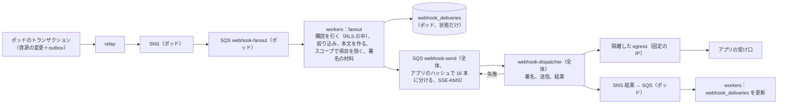

# Webhooks: Shopify

アプリへの Webhook の話題、購読、事象から配信までの流れ、本文とヘッダー、署名、少なくとも 1 回の配信と重複、順序、送り直し、購読の停止、送り先の制限と隔離した egress、照合のための事象の一覧を決める。

前提となる決定は、outbox → SNS・SQS（[ADR-0001](../decisions/0001-platform-and-stack.md)）、`webhook-dispatcher` は全体の面に置き、全体の面はショップのデータを持たないこと（[ADR-0002](../decisions/0002-pods-and-shop-placement.md)）、ショップとアプリごとの送信の速さの上限（[ADR-0003](../decisions/0003-tenancy-and-rls.md)）、スコープと顧客の保護のデータ（[ADR-0055](../decisions/0055-scopes-and-protected-customer-data.md)）、Webhook の署名の秘密はアプリごとに `app-registry` が持つこと（[app-platform-and-apis.md](app-platform-and-apis.md) の 4.1 節）。要件は NFR-010（事象から最初の配信まで p95 10 秒、少なくとも 1 回、失敗は 4 時間に 8 回まで送り直す）、NFR-007（配信の受け付け 月間 99.9%）、NFR-008（購読したアプリと導入したショップの事象だけ）。この文書で決めたことは次の ADR にある。

| ADR | 決定 |
| --- | --- |
| [0061](../decisions/0061-webhook-delivery-and-signing.md) | Webhook は少なくとも 1 回の配信で、順序を保証しない。本文は資源の JSON（アプリの API のバージョンの形）で、資源ごとに単調に増える `<brand>_version` を持つ。ヘッダーに話題、ショップ、配信の ID（購読 × 事象で一意、送り直しで同じ）、事象の ID、発生の時刻、API のバージョン、`X-<Brand>-Hmac-Sha256`（アプリの Webhook の署名の秘密で、生の本文の HMAC-SHA256 を base64）を付ける。接続 1 秒・全体 5 秒で切り、2xx を成功とする。失敗は 4 時間の中で 8 回まで送り直し、48 時間続けて全部の配信が失敗した購読は `disabled` にする（消さない） |
| [0062](../decisions/0062-webhook-egress-and-payload-custody.md) | 本文はポッドの `workers` が作り、本文を含む配信の依頼を暗号化した SQS で全体の `webhook-dispatcher` に渡す。`webhook-dispatcher` は本文を保存せず（SQS の保持の中だけ）、結果（状態のコード、時間）だけをポッドへ返す。送り先は HTTPS・443・公開の IP だけで、名前の解決の結果を確かめて固定し、リダイレクトを追わない。送信は固定の IP の隔離した egress から行い、IP の一覧を公開する |

## 1. 範囲

- 扱う：
  - 話題の一覧、購読（宣言と API）、絞り込みと項目の選択
  - 事象から配信までの流れ、本文とヘッダー、本文の大きさ
  - 署名と、秘密の入れ替え
  - 少なくとも 1 回、重複、順序、`<brand>_version`
  - 送り直しの間隔、購読の停止と再開、開発者への知らせ
  - 送り先の制限（SSRF）、egress、速さの上限
  - 照合のための事象の一覧（Admin API）
  - 個人のデータの削除の依頼の話題の枠
- 扱わない：
  - 決済の提供者・運送会社から本システムが受ける Webhook（[payments-integration.md](payments-integration.md)、[orders-and-fulfillment.md](orders-and-fulfillment.md)）
  - アプリの導入とスコープ（[app-platform-and-apis.md](app-platform-and-apis.md)）
  - egress の網の全体の構成（`infrastructure.md`）

## 2. 本家の形（確かめたこと）

いずれも 2026-10-10 に確認。

| 項目 | 内容 | 出典 |
| --- | --- | --- |
| 署名 | `X-Shopify-Hmac-SHA256` に、アプリの client secret と生の本文から作った HMAC-SHA256 を base64 で入れる | [Deliver webhooks through HTTPS](https://shopify.dev/docs/apps/build/webhooks/subscribe/https) |
| 時間切れ | 接続 1 秒、要求の全体 5 秒。200 以外（3xx を含む）は失敗 | 同上 |
| ID | 配信の ID（`X-Shopify-Webhook-Id`）は配信ごとに一意で、重複の検出に使える。事象の ID（`X-Shopify-Event-Id`）は、同じ事業者の操作から出た配信（同じ話題の複数の購読）で同じ | 同上 |
| 順序と保証 | 同じ話題の中でも順序を保証しない。配信は保証されないので、照合のジョブを持つことを勧める | [Webhooks](https://shopify.dev/docs/apps/build/webhooks) |
| 送り直し | 失敗した配信を 4 時間に 8 回まで送り直す。失敗が続くと、Admin API で作った購読を消す | [Troubleshoot webhooks](https://shopify.dev/docs/apps/build/webhooks/troubleshooting-webhooks) |

- 本家の送り直しの間隔、購読を消すまでの失敗の続く時間は、公式の資料で確かめていない（**未検証**。[intent.md](../intent.md) の Open questions）。
- 本家のヘッダーの名前は使わず、`X-<Brand>-…` で書く（[リポジトリ共通の ADR-0006](../../../../docs/decisions/0006-brand-neutral-identifiers.md)、[AGENTS.md](../../AGENTS.md)）。

## 3. 要件

| 要件 | 目標 | NFR・基準 |
| --- | --- | --- |
| 速さ | 事象（トランザクションの確定）から最初の配信の試みまで p95 10 秒 | NFR-010 |
| 届け方 | 少なくとも 1 回。受け口が 4 時間の中で 1 回でも成功すれば届く | NFR-010 |
| 送り直し | 4 時間に 8 回まで | NFR-010 |
| 受け付け | 事象を配信の待ちに入れる経路の可用性 月間 99.9% | NFR-007 |
| 分離 | 購読したアプリと導入したショップの事象だけ。スコープの外の項目を本文に入れない | NFR-008、[quality.md](../quality.md) の 2.2.1 節 G |
| うるさい隣人 | 1 つのアプリの受け口の遅れが、他のアプリの配信を遅らせない | NFR-008 |

## 4. 話題と購読

### 4.1 話題

| 話題 | 要るスコープ | 発生 |
| --- | --- | --- |
| `orders/create`・`orders/updated`・`orders/paid`・`orders/cancelled` | `read_orders` | 注文の作成・変更・支払い・取り消し（[orders-and-fulfillment.md](orders-and-fulfillment.md)） |
| `fulfillments/create`・`fulfillments/update` | `read_fulfillments` | 配送 |
| `refunds/create`、`returns/request`・`returns/close` | `read_orders` | 返金・返品（[returns-and-refunds.md](returns-and-refunds.md)） |
| `products/create`・`products/update`・`products/delete` | `read_products` | [catalog-and-pricing.md](catalog-and-pricing.md) の 12 節 |
| `collections/update` | `read_products` | 同上 |
| `inventory_levels/update` | `read_inventory` | 在庫の数（拠点 × 品目。[inventory-and-reservations.md](inventory-and-reservations.md)）。1 品目 1 秒 1 回にまとめる |
| `customers/create`・`customers/update` | `read_customers`（項目は保護のデータ） | 顧客 |
| `themes/publish` | `read_themes` | テーマの公開 |
| `app/uninstalled` | なし | アプリの削除 |
| `app_subscriptions/update` | なし | 課金の状態（[app-platform-and-apis.md](app-platform-and-apis.md) の 8 節） |
| `bulk_operations/finish` | なし | 一括の操作の完了 |
| `shop/update` | なし | ショップの設定 |
| `customers/data_request`・`customers/redact`・`shop/redact` | なし（必須の購読） | 個人のデータの開示・削除の依頼（法務の確認待ち L3） |

### 4.2 購読

- **宣言の購読**：アプリのバージョンに書いた購読（話題、送り先の URL、API のバージョン、絞り込み、項目の選択）。導入した全ショップに効く。
- **API の購読**：`webhookSubscriptionCreate`（ショップごと）。
- 購読は（アプリ、ショップ、話題、送り先）で一意。1 つの導入で 200 まで。
- **絞り込み**：`filter`（例：`financial_status:paid AND total_price:>10000`）。本文の項目に対する決めた小さな言語（比べ、`AND`・`OR`、括弧、512 文字）。絞り込みで外れた事象は配信しない（数える）。
- **項目の選択**：`includeFields`（例：`["id", "line_items.sku", "updated_at"]`）。本文を小さくする。`id` と `<brand>_version` は常に入れる。
- 送り先の URL は購読の作成の時に 6.3 節の検査を通す（名前の解決は配信のたびにも行う）。

## 5. 本文とヘッダー

ADR-0061。

### 5.1 本文

- 資源の JSON。形は購読の API のバージョンの Admin API の型に合わせる（本家の形との互換は目標にしない）。
- 本文は、配信の時点でなく**事象の時点**の資源の写し（outbox の事象を受けた `workers` が、事象のトランザクションの直後の状態を読む。より新しい状態を読んだ場合は、`<brand>_version` がそれを示す）。
- 項目はアプリのスコープと保護のデータの承認で絞る。承認のない保護の項目は除き、`<brand>_redacted_fields` に道を入れる（[ADR-0055](../decisions/0055-scopes-and-protected-customer-data.md)）。
- `<brand>_version`：資源ごとに単調に増える整数（商品は `catalog_version`、注文は `order_version`、在庫は `inventory_version`）。受け手は、持っている値より小さい本文を捨てればよい。
- 本文の大きさ：256 KiB まで。超えたら、`id`・`<brand>_version`・`updated_at` と `<brand>_truncated: true` だけの本文にし、受け手は Admin API で読み直す。

### 5.2 ヘッダー

| ヘッダー | 中身 |
| --- | --- |
| `Content-Type` | `application/json` |
| `X-<Brand>-Topic` | 話題（`orders/create`） |
| `X-<Brand>-Shop-Domain` | ショップの既定のドメイン（`<shop>.<brand>.<domain>`） |
| `X-<Brand>-Api-Version` | 本文の API のバージョン |
| `X-<Brand>-Webhook-Id` | 配信の ID（UUIDv7）。購読 × 事象で一意。送り直しで同じ |
| `X-<Brand>-Event-Id` | 事象の ID（UUIDv7、outbox の行の ID）。同じ事象から出た全部の購読の配信で同じ |
| `X-<Brand>-Triggered-At` | 事象の時刻（RFC 3339、UTC、ミリ秒） |
| `X-<Brand>-Attempt` | 何回目の試み（1〜9） |
| `X-<Brand>-Hmac-Sha256` | `base64(HMAC-SHA256(secret, 生の本文のバイト))` |
| `X-<Brand>-Hmac-Sha256-Previous` | 秘密の入れ替えの 24 時間だけ、古い秘密の署名 |

### 5.3 署名

- 秘密は、アプリの Webhook の署名の秘密（32 バイトの乱数。`<brand>_whsec_` の接頭辞で開発者に見せる）。client secret と分け、入れ替えを独立にする。
- 入れ替え：開発者が新しい秘密を作ると、24 時間は新しい秘密で `X-<Brand>-Hmac-Sha256`、古い秘密で `X-<Brand>-Hmac-Sha256-Previous` を付ける。24 時間の後、古い秘密を消す。
- 受け手の確かめ方（開発者の文書に書く）：生の本文のバイト（JSON の構文解析の前）で HMAC を作り、定数時間で比べる。`Triggered-At` が 5 分より古い本文を、受け手が捨ててよい（送り直しは `Triggered-At` を変えないので、送り直しを受けたい受け手は、`Webhook-Id` の重複の検出と組み合わせる）。
- 試験のベクトル（秘密、本文、期待する署名）を公開し、契約の試験に使う（[quality.md](../quality.md) の 2.2.1 節 L）。

例：秘密 `whsec の 32 バイト`（試験のベクトルで固定）、本文 `{"id":"gid://<brand>/Order/0192…","<brand>_version":3}` → 署名は試験のベクトルの期待する値と一致すること（値は開発リポジトリの `webhook-signature-vectors.json` に置く）。

## 6. 配信

### 6.1 流れ

ADR-0062。

- **fanout**（ポッド）：事象ごとに、そのショップの導入と購読（`webhook_subscriptions`）を引き、絞り込みを当て、購読ごとに本文を作る。`webhook_deliveries` に（配信の ID、購読、事象、状態 `pending`）を書き、送りの依頼（本文、ヘッダーの材料、送り先、`app_id`、試みの予定）を全体の SQS に入れる。依頼の入れと行の書きの順は「行を書いてから依頼」で、依頼の失敗は行の `pending` を拾う 1 分ごとのジョブが入れ直す（少なくとも 1 回）。
- **dispatcher**（全体）：依頼を受け、アプリの秘密（KMS で包んだもの。プロセスのメモリーに 5 分の写し）で署名し、送る。結果（状態のコード、時間、誤りの種類）を SNS でポッドへ返す。本文を保存しない。ログに本文と URL のクエリを書かない。
- **アプリごとの公平**：SQS の送りのキューをアプリのハッシュで 16 本に分け、dispatcher はキューごとに同時の送りの数の上限（アプリごとに 50、遅いアプリは減らす）を持つ。1 つのアプリの遅い受け口が、他のアプリの配信を待たせない。
- **ショップとアプリの速さの上限**：（ショップ、アプリ）1 秒 50 件（[ADR-0003](../decisions/0003-tenancy-and-rls.md)）。超えた分は遅らせる（捨てない）。

### 6.2 送り直しと停止

ADR-0061。

| 試み | 前の試みからの待ち | 最初からの累計（目安） |
| --- | --- | --- |
| 1 | — | 0 |
| 2 | 1 分 | 1 分 |
| 3 | 4 分 | 5 分 |
| 4 | 10 分 | 15 分 |
| 5 | 20 分 | 35 分 |
| 6 | 30 分 | 65 分 |
| 7 | 45 分 | 110 分 |
| 8 | 60 分 | 170 分 |
| 9 | 70 分 | 240 分 |

- 最初の試みと、送り直し 8 回。待ちは ±10% の揺らぎを付け、累計が 4 時間を超えないように最後を縮める。
- 成功：2xx。失敗：それ以外（3xx を含む。リダイレクトを追わない）、接続 1 秒・全体 5 秒の時間切れ、TLS の誤り、名前の解決の失敗、6.3 節の拒否。`429`・`503` の `Retry-After` は、次の予定より遅いときだけ従う（4 時間の中で）。
- SQS の遅らせは 15 分までなので、それより長い待ちは、依頼に `not_before` を持たせ、早く受けたら残りの待ち（15 分まで）で入れ直す。
- 9 回とも失敗した配信は `failed` にし、照合の一覧（7 節）で拾えるようにする。
- **購読の停止**：同じ購読への配信が、48 時間続けて 1 回も成功せず、その間の配信がすべて `failed` で、`failed` が 10 件以上なら、購読を `disabled` にし、開発者（メール、開発者の画面）と事業者（アプリの画面の注意）に知らせる。消さない。開発者が受け口を直して「再開」すると `active` に戻る（止まっていた間の事象は送らない。照合の一覧で取る）。本家は Admin API で作った購読を消す（2 節）。本システムは消さずに止める。

### 6.3 送り先の制限

ADR-0062。

| 規則 | 中身 |
| --- | --- |
| スキームとポート | `https` だけ、443 だけ |
| 証明書 | 公開の CA の正しい証明書、TLS 1.2 以上、名前の一致 |
| 名前の解決 | 送るたびに解決し、得た全部の IP が公開の範囲（私的、ループバック、リンクローカル、CGNAT、メタデータ `169.254.169.254`、IPv6 の ULA・リンクローカル、本システムの範囲を拒む）か確かめ、その IP に固定して接続する（DNS の再束縛を防ぐ） |
| リダイレクト | 追わない（失敗） |
| 応答 | 本文は 64 KiB まで読んで捨てる |
| egress | 固定の IP の NAT（東京、AZ ごと）。IP の一覧を開発者の文書に公開し、変えるときは 30 日前に知らせる |
| 網 | dispatcher のタスクは、ポッドと全体の面の内部の網へ届かないサブネットに置く |

## 7. 照合の一覧

- 配信は少なくとも 1 回だが、受け口の長い停止では届かない（`failed`、`disabled`）。アプリが取り戻せるように、Admin API に事象の一覧を出す：`events(first, after, topics, since)`。中身は事象の ID、話題、資源の ID、`<brand>_version`、時刻。7 日。スコープで絞る。
- アプリは、一覧の事象の資源を Admin API で読み直す（本文は一覧に入れない）。
- 配信の記録：`webhookDeliveries(subscriptionId, status, first)`（7 日）。状態のコード、時間、試みの数。本文を持たない（ポッドは本文を残さない）。

## 8. 失敗のしかた

| 事象 | 振る舞い |
| --- | --- |
| 受け口の障害 | 6.2 節の送り直し。48 時間で停止 |
| dispatcher の障害 | SQS に依頼が溜まる（保持 4 日）。復旧で送る。事象から最初の試みの遅れを SLI で見る |
| ポッドの fanout の遅れ | 事象の遅れ。`webhook-fanout` のキューの年齢を SLI にし、5 分で警告 |
| 結果の返りの欠け | `webhook_deliveries` が `pending` のまま。1 時間の後に状態を `unknown` にする（照合の一覧で取れる。もう 1 回送ることはしない） |
| SQS の重複の受け取り | 同じ配信の ID で 2 回送りうる。受け手は配信の ID で重複を除く（文書に書く） |
| 秘密の読み出しの失敗（KMS） | 送らずに送り直しの予定へ。送り直しの回数に数えない（本システムの原因） |
| 全体の SQS（東京）の障害 | ポッドの fanout は `pending` の行を残し、復旧で入れ直す |

## 9. 上限

| 対象 | 上限 |
| --- | --- |
| 購読 | 1 導入 200 |
| 絞り込み | 512 文字 |
| 本文 | 256 KiB（超えたら薄い本文） |
| 時間切れ | 接続 1 秒、全体 5 秒 |
| 送り直し | 8 回、4 時間 |
| 停止 | 48 時間の連続の失敗、10 件以上 |
| 速さ | （ショップ、アプリ）1 秒 50、アプリの同時の送り 50 |
| 在庫の話題のまとめ | 1 品目 1 秒 1 回 |

## 10. data-model への項目

| 表・保存 | 中身 | 節 |
| --- | --- | --- |
| `webhook_subscriptions`（ポッド） | `(shop_id, id)`、`installation_id`、`topic`、`address`、`api_version`、`filter`、`include_fields`、`source`（宣言・API）、`state`（`active`・`disabled`）、`failing_since`、`disabled_at` | 4.2、6.2 |
| `webhook_deliveries`（ポッド） | `(shop_id, delivery_id)`、`subscription_id`、`event_id`、`topic`、`state`（`pending`・`delivered`・`failed`・`unknown`）、`attempts`、`last_status`、`last_latency_ms`、`created_at`。日の分割で 7 日 | 6.1、7 |
| `webhook_events_index`（ポッド） | `(shop_id, event_id)`、`topic`、`resource_gid`、`resource_version`、`occurred_at`。7 日（照合の一覧） | 7 |
| `apps.webhook_secret_ciphertext[2]`（全体） | 署名の秘密（今と前） | 5.3 |
| SQS | `webhook-fanout`（ポッド）、`webhook-send-00`〜`15`（全体、SSE-KMS）、結果の返り（ポッド） | 6.1 |

## 11. テストと性質

- **PROP-HOOK-001（少なくとも 1 回）**：任意の事象の列と、受け口の失敗の列（4 時間の中で 1 回は成功する）で、各（購読、事象）が少なくとも 1 回届き、配信の ID が（購読、事象）ごとに一意で、送り直しで変わらない（[quality.md](../quality.md) の 2.2.1 節 L）。
- **PROP-HOOK-002（バージョンの単調）**：同じ資源の事象の列の本文の `<brand>_version` は、事象の順に増える。受け手が最大の `<brand>_version` を残すと、届く順に依らず最後の状態になる。
- **PROP-HOOK-003（署名）**：任意の本文と秘密で、受け手の確かめの関数が、送り手の署名だけを受け入れる。入れ替えの 24 時間は両方の秘密で通る。
- **PROP-HOOK-004（分離とスコープ）**：任意の購読・スコープ・承認で、本文にスコープの外の項目と未承認の保護の項目が出ない。他のショップ・他のアプリの事象が配信されない。
- **PROP-HOOK-005（送り直しの時刻）**：仮想の時計で、試みの時刻が 6.2 節の表の範囲（±10%）にあり、累計が 4 時間を超えない。
- **DT-HOOK-001**：応答（2xx、3xx、4xx、429、5xx、時間切れ、TLS の誤り、拒否の IP）→ 成功・送り直し・`Retry-After` の扱いの表。
- 結合：SSRF の宛先（私的な IP、DNS の再束縛、リダイレクト）、証明書の検査、停止と再開、遅い受け口のアプリが他のアプリを遅らせないこと（負荷）。
- 負荷（E14）：1 秒 2,000 件の事象、受け口の 10% が遅い（4 秒）場面で、他の受け口の p95 10 秒。

## 12. Story の候補

| Epic | Story | 中身 |
| --- | --- | --- |
| E14 | `webhook-subscriptions-and-delivery` | 4〜7 節（ADR-0061・0062。PROP-HOOK-001〜005、DT-HOOK-001） |
| E14 | `webhook-egress` | 6.3 節の網と固定の IP（`infrastructure.md` と共同） |
| E14 | `compliance-webhooks` | 4.1 節の削除の依頼の話題。法務：L3 |

## 13. 未解決の問い

### 決定（2026-10-10、既定案）

- **届け方**：少なくとも 1 回、順序なし、`<brand>_version` で並べ直せる（ADR-0061）。
- **署名**：アプリの Webhook の専用の秘密、生の本文の HMAC、24 時間の入れ替え（ADR-0061）。
- **送り直し**：4 時間に 8 回、表の間隔（ADR-0061）。
- **停止**：48 時間の連続の失敗で `disabled`、消さない（ADR-0061）。本家（消す）と違う。
- **本文の置き場所**：ポッドで作り、全体は運ぶだけ（ADR-0062）。

### 持ち越し

| 問い | いつ・どう決めるか |
| --- | --- |
| 削除の依頼の話題の法的な位置づけと期限 | **法務の確認待ち：L3** |
| 本家の送り直しの間隔、停止までの時間 | 公式の資料で確かめられなかった（**未検証**のまま） |
| 「本家との意図した違い」（購読を消さずに止める） | [architecture/README.md](README.md) の 1.4 節の表に行を足す（この文書の担当の範囲の外。統合の工程で反映する） |
| 全体の面の `webhook-dispatcher` が本文を運ぶこと | [ADR-0002](../decisions/0002-pods-and-shop-placement.md) の「全体の面はショップのデータを持たない」を、「保存しない（運ぶだけ）」と読む。ADR-0002 に注記を足すかを Dev（テックリード）に確認する |

## 出典

いずれも 2026-10-10 に確認。

- Shopify Dev, [Deliver webhooks through HTTPS](https://shopify.dev/docs/apps/build/webhooks/subscribe/https)：署名、時間切れ、配信の ID と事象の ID
- Shopify Dev, [Webhooks](https://shopify.dev/docs/apps/build/webhooks)：順序の保証なし、照合の勧め
- Shopify Dev, [Troubleshoot webhooks](https://shopify.dev/docs/apps/build/webhooks/troubleshooting-webhooks)：4 時間に 8 回、失敗が続くと購読を消す
- IETF, [RFC 2104](https://www.rfc-editor.org/rfc/rfc2104)（HMAC）
