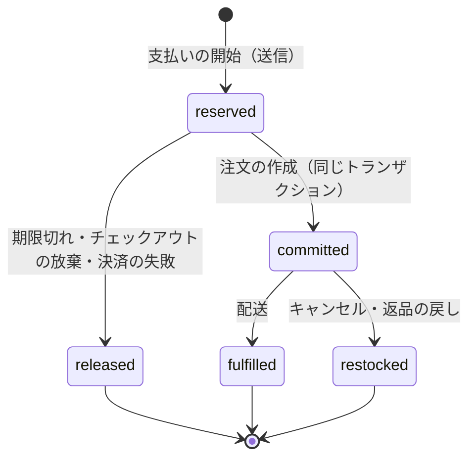

# ADR-0004: 在庫は拠点ごとの行を Aurora の正本にし、支払いの開始で期限つきの引き当て、注文の作成で確定にする。「売り越さない」品目は CHECK 制約で守る。熱い品目は在庫を複数の枠の行に分ける

## Context

フラッシュセールでは、1 つの品目（例：限定のスニーカーの 1 サイズ、在庫 3,000）に、数分で数万人が買いに来る。守ることは次の 2 つである。

- **売り越さない**：「在庫切れで売らない」設定の品目は、注文に入った数が手元の数を超えない（NFR-004）。
- **速さ**：1 ショップ 100 件/秒（S1）の注文の作成を、チェックアウトの p99 の中で処理する（NFR-001、NFR-002）。

難しさは次のとおり。

- 在庫の行が 1 つだと、すべての更新が同じ行のロックで並ぶ。PostgreSQL の 1 行の更新は、待ちの長さで上限が決まる（数百〜千件/秒の見込み。`inventory-hot-row-poc` で測る）。
- 買い手は支払いの途中でやめる。引き当てたまま放っておくと、売れるはずの在庫が残る。
- 決済の結果は遅れて届く（リダイレクト、Webhook、コンビニ払い）。
- 本家の在庫は、手元の数（on_hand）を available・committed・reserved などの状態の和として持ち、committed は注文の作成と配送で本家が動かす（[Inventory states](https://shopify.dev/docs/apps/build/orders-fulfillment/inventory-management-apps/manage-quantities-states)、2026-10-10 に確認）。チェックアウトの途中で在庫を押さえる時点は、公式の資料で確かめられなかった（**未検証**）。

## Options

正本の置き場所：

1. **Aurora の行（拠点 × 品目）。引き当ての行と同じトランザクション**
2. Valkey の数（Lua で減らす）を正本にし、後で DB に写す
3. 注文の作成の時点だけで在庫を減らす（引き当てなし）

熱い行：

- a. **在庫を複数の枠（slot）の行に分ける**
- b. 1 行のまま、待合室の流量だけで抑える
- c. 減らす要求をキューに入れ、1 つの書き手がまとめて処理する

## Decision

1 と a を採用する。

### 数の持ち方

拠点 × 品目（inventory item）ごとに、次の数を持つ。

| 数 | 意味 | 動かすもの |
| --- | --- | --- |
| `on_hand` | 拠点に物としてある数 | 入荷、調整、配送（減る）、返品の戻し |
| `available` | 売れる数（枠の行の和） | 引き当て（減る）、戻し（増える）、調整 |
| `reserved` | 引き当て中の数（期限つき） | 引き当て、確定、戻し |
| `committed` | 注文に入った、未配送の数 | 確定（増える）、配送・キャンセル（減る） |
| `unavailable` | 破損、検品中、安全在庫 | 調整 |

- 不変条件：`on_hand = available + reserved + committed + unavailable`。表の行の更新は、この式を変えない操作の組だけで書く（`packages/inventory` の関数だけ）。
- 「売り越さない」（`inventory_policy = deny`）の品目は、枠の行に `CHECK (available >= 0)` を置く。「在庫切れでも売る」（`continue`）の品目は CHECK を置かず、負を許す。在庫を数えない品目は行を持たない。

### 引き当て・確定・戻し

- **引き当て**は、チェックアウトの送信（支払いの開始）で行う。カートに入れた時点では行わない。行（`reservations`）は、チェックアウト・拠点・品目・数・期限（通常 15 分、フラッシュセールのショップは 10 分）・状態を持つ。
- **確定**は、注文の作成と同じトランザクションで、引き当ての行を `committed` にし、`reserved` を減らして `committed` を増やす（[ADR-0005](0005-checkout-state-machine-and-exactly-once-orders.md)）。期限を過ぎていても、まだ戻していなければ確定してよい（決済が先に済んだ場合）。
- **戻し**は、掃除の処理（1 分ごと）が、期限を過ぎた `reserved` の行を `released` にし、枠に数を戻す。行の状態の条件付きの更新（`WHERE state = 'reserved'`）で、確定と戻しのどちらか一方だけが勝つ。確定した数を戻しで動かさない。
- 決済が済んだのに引き当てが戻されていたら、引き当てを取り直す。取れなければ注文を作らず、オーソリを取り消すか返金する（[ADR-0005](0005-checkout-state-machine-and-exactly-once-orders.md) の決定表）。
- 拠点の選び方：ショップの拠点の優先の順（配送先の都道府県の規則を含む）で、引き当てられる最初の拠点を選ぶ。1 つの行を複数の拠点に分けるのは MVP では行わない（inventory-and-reservations の領域）。

### 熱い品目の枠

- 枠（`inventory_slots`）は、拠点 × 品目ごとに `slot_no` と `available` を持つ。既定は 1 枠。フラッシュセールの品目は、セールの予定の登録で 32 枠に分ける（数は `inventory-hot-row-poc` で決める）。
- 引き当ては、チェックアウトの ID のハッシュで最初の枠を選び、`UPDATE inventory_slots SET available = available - $n WHERE ... AND slot_no = $s AND available >= $n` を実行する。0 行なら次の枠を試す（最大で全枠）。全部が 0 行なら在庫切れ。
- 戻しは、引き当てた枠に戻す。
- 枠の偏りの直し（rebalance）は、2 つの枠の間で、1 つのトランザクションで片方を減らし片方を増やす操作だけで行う。合計を変えない。セールの後、枠を 1 つにまとめる。
- 枠を分けると、「残り N 個」の表示は和を読むことになる。表示は目安として、短いキャッシュで出す（法務の L2 の確認の後に既定の振る舞いを決める）。

### 流量と目安

- 待合室は、残りの `available` の和から許可証の数を決める（flash-sales-and-queueing の領域）。待合室・Valkey の数は目安で、引き当ての成否は必ず DB で決める。待合室が壊れても、売り越しは起きない（遅くなるだけ）。

### 他の案を選ばなかった理由

- **2（Valkey を正本）**：Valkey のフェイルオーバーで直近の減算を失うと、売り越す。DB への写しとの食い違いの直しが要る。
- **3（引き当てなし）**：支払いを済ませた後に在庫切れが分かり、返金が多発する。フラッシュセールでは決済の提供者の負荷も無駄に増える。
- **b（1 行のまま）**：待合室で絞っても、1 行の更新の上限が 1 ショップ 100 件/秒の目標の近くにあり、余裕がない。
- **c（1 つの書き手）**：キューの往復で、引き当ての p99 50ms を守りにくい。書き手の障害で売れなくなる。

## Consequences

- 良くなること：
  - 売り越しの防止が DB の制約とトランザクションに乗り、キャッシュ・待合室の障害で崩れない。
  - 熱い品目の更新が枠の数だけ並べられる。
- 引き受けるコスト：
  - 枠の数だけ「残りがあるのに、選んだ枠が 0」が起き、別の枠を試す往復が増える。終盤は全枠を試す。
  - 掃除の処理の遅れは、売れる在庫の遅れになる（売り越しにはならない）。
  - 不変条件を守る関数の外で在庫の表を書けないので、一括の調整も同じ関数を通す。

## Confirmation

- 性質ベーステスト：任意の並行の引き当て・確定・戻し・調整・枠の直しの列で、`deny` の品目の `committed + reserved` が `on_hand - unavailable` を超えず、不変条件の式が常に成り立つ（[quality.md](../quality.md) の 2.2.1 節 A）。
- 参照の実装との比べ：同じ操作の列を、素直な参照の実装（1 つのロックで直列に処理）と比べ、注文に入った数の合計が「在庫の範囲で」一致する。
- 本番：毎時、拠点 × 品目ごとに、注文の行の数の和と `committed` の数、不変条件の式を照合する。不一致は呼び出し（[runbooks/](../runbooks/README.md)）。
- PoC：E5 の前の `inventory-hot-row-poc` で、枠 1・8・32・64 の引き当ての速さと p99 を測る。
