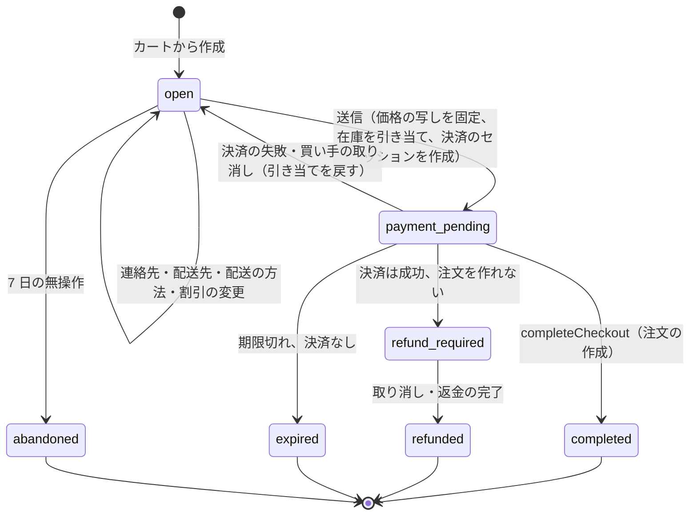

# ADR-0005: チェックアウトを明示の状態の機械にし、注文の作成を `completeCheckout` の 1 つの関数とトランザクションに集める。`orders.checkout_id` を一意にし、決済だけ済んだ状態を 1 分ごとの照合で解消する

## Context

注文は、事業者と買い手の間の約束で、お金と在庫が動く。次を守る（NFR-005、NFR-006、NFR-013）。

- 1 つのチェックアウトから注文は 0 か 1。
- 決済が済んだ買い手は、注文を持つか、全額の返金を受ける。
- 最終確認画面の金額、注文の金額、決済の金額が一致する（特定商取引法の最終確認画面の扱いは法務の確認待ち L1）。

難しさは次のとおり。

- 決済の結果は、買い手のリダイレクトの戻りと、提供者の Webhook の 2 つの経路で、どちらが先かわからずに届く。どちらも届かないこともある（買い手がブラウザを閉じる、Webhook の遅れ）。
- 提供者への要求は時間切れになりうる。結果が不明のまま残る（[ADR-0006](0006-payments-via-providers.md)）。
- 引き当ての期限（[ADR-0004](0004-inventory-reservation-model.md)）と決済の完了の順序が入れ替わる。
- コンビニ払い・銀行振込は、支払いの番号を出した後、数日かけて支払われる。
- 送信の後にカートや価格が変わると、表示した金額と請求する金額がずれる。

## Options

1. **明示の状態の機械。送信で価格の写し（スナップショット）を固定し、注文の作成を 1 つの関数・1 つのトランザクション・一意の制約に集める。照合の処理で取りこぼしを拾う**
2. Webhook だけを注文の作成の経路にする（リダイレクトの戻りは待つだけ）
3. 分散の取引の協調（Saga のオーケストレーター）を別のサービスに置く

## Decision

1 を採用する。

### 状態

- **送信**で、行・数・単価・割引・送料・手数料・税（税率ごと）・合計を、価格の写し（`checkout_price_snapshots`、写しのハッシュつき）として固定する。最終確認画面はこの写しを出す。決済の金額は写しの合計、注文の金額は写しの写しである。送信の後にカート・価格・割引を変えたいときは、`open` に戻して新しい試行（`attempt` を 1 増やす）にする。
- 状態の遷移は `packages/checkout` の 1 つの遷移の関数だけが書く。遷移ごとに `checkout_events` に行を足す（理由のコードつき）。

### 注文の作成（`completeCheckout`）

- リダイレクトの戻り、提供者の Webhook（inbox の後）、照合の処理、のどれからも同じ関数 `completeCheckout(checkout_id, attempt)` を呼ぶ。
- 1 つのトランザクションで次を行う：チェックアウトの行を `SELECT ... FOR UPDATE` で取る → 下の決定表で動作を決める → 注文と行を挿入する（`orders.checkout_id` は一意）→ 引き当てを確定に変える → 割引の使用の回数を数える → outbox に `orders/create` などを書く → チェックアウトを `completed` にする。
- 一意の制約の違反（二重の作成）は、既存の注文を返す成功として扱う。
- 提供者の結果は、Webhook やリダイレクトの値をそのまま信じず、提供者の照会の API で確かめた値を使う（[ADR-0006](0006-payments-via-providers.md)）。

### 完了の決定表（DT-CHK-001 の草案）

上から順に評価し、最初に一致した行を採用する。確定した表は cart-and-checkout の領域の spec に書く。

| # | チェックアウトの状態 | 提供者の結果（照会） | 金額は写しと一致 | 引き当て | → 動作 | → 次の状態 |
| --- | --- | --- | --- | --- | --- | --- |
| 1 | `completed` | - | - | - | 既存の注文を返す | `completed` |
| 2 | `refund_required`・`refunded` | - | - | - | 何もしない | そのまま |
| 3 | `payment_pending` | 不明・処理中 | - | - | 照会の再試行を予約 | `payment_pending` |
| 4 | `payment_pending` | 失敗・取り消し | - | - | 引き当てを戻す | `open` |
| 5 | `payment_pending`・`expired`・`abandoned` | 成功 | いいえ | - | オーソリを取り消すか返金 | `refund_required` |
| 6 | `expired`・`abandoned` | 成功 | はい | - | オーソリを取り消すか返金 | `refund_required` |
| 7 | `payment_pending` | 成功（オーソリ・売上） | はい | 未戻し（期限の内外を問わず） | 注文を作り、確定 | `completed` |
| 8 | `payment_pending` | 成功 | はい | 戻し済み、取り直せた | 注文を作り、確定 | `completed` |
| 9 | `payment_pending` | 成功 | はい | 戻し済み、取り直せない | オーソリを取り消すか返金 | `refund_required` |
| 10 | `payment_pending` | 支払い待ち（コンビニ・銀行振込の番号を発行） | はい | 未戻し・取り直せた | 支払い待ちの注文を作り、確定 | `completed` |
| 11 | `payment_pending` | 支払い待ち | はい | 戻し済み、取り直せない | 支払いの番号を取り消す | `expired` |

- 支払い待ちの注文は、支払いの期限（既定 3 日、提供者の設定）を過ぎたら取り消し、在庫を戻す（payments-integration の領域）。
- `refund_required` は、取り消し・返金を冪等キー付きで提供者に依頼し、完了で `refunded` にする。買い手と事業者に知らせる。

### 照合

- 照合の処理（1 分ごと、ポッドごと）が、`payment_pending` のまま 5 分を超えたチェックアウトと、提供者の Webhook のうち未処理のものを探し、`completeCheckout` を呼ぶ。提供者の結果が成功で、15 分を超えて `completed` でも `refunded` でもないものは、呼び出しのアラートにする（NFR-006）。
- 日次で、提供者の取引の一覧（照会の API か精算のファイル）と、注文・返金を突き合わせる（payments-integration の領域）。

### 他の案を選ばなかった理由

- **2（Webhook だけ）**：Webhook の遅れの間、買い手は確認の画面を待つ。提供者の障害で Webhook が来ないと注文ができない。どちらの経路でも同じ関数を呼べば、速さと確かさを両方取れる。
- **3（Saga）**：注文・在庫・outbox は同じポッドの DB にある（[ADR-0001](0001-platform-and-stack.md)）。1 つのトランザクションで足りるところに、協調の仕組みを足すと失敗の形が増える。

## Consequences

- 良くなること：
  - 二重の注文が一意の制約で止まり、経路の数に依らない。
  - 「決済だけ済んだ」状態が、決定表の行と照合で必ず閉じる。
  - 価格の写しで、表示・注文・決済の金額が一致する。
- 引き受けるコスト：
  - 送信の後に価格を変えたい買い手は、新しい試行になり、決済のセッションを作り直す。
  - 照合の処理と提供者の照会の API に依存する。照会の API を持たない提供者は選ばない（[ADR-0006](0006-payments-via-providers.md)）。
  - フラッシュセールでは、チェックアウトの行のロックが 1 チェックアウトに閉じるので問題にならないが、割引の使用の回数（全体の上限つきのコード）が熱い行になりうる。discounts-engine の領域で、在庫と同じ枠の方式を使う。

## Confirmation

- 性質ベーステスト：任意の順序・重複・遅れで届くリダイレクトの戻り・Webhook・照合の呼び出し・期限切れの掃除の列で、注文は 0 か 1、決済の成功は「注文あり」か「返金済み」に必ず行き着き、注文の金額が写しの合計と一致する（[quality.md](../quality.md) の 2.2.1 節 B）。
- 表駆動テスト：DT-CHK-001 の全行。
- 本番：照合の結果（15 分を超えた決済済みで注文なし）を SLI にし、0 を目標にする（[runbooks/](../runbooks/README.md)）。
