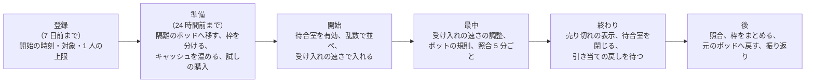

# Runbooks: Shopify

Ops が持つ運用の文書。品質の判定基準は [quality.md](../quality.md) の 4 節にある。SLI の計測とアラートの条件の実装は [observability.md](../architecture/observability.md) にある。表と置き場所は [data-model.md](../architecture/data-model.md)。**SLO の値とアラートの一覧の正本はこの文書** で、値を変えるときは、この文書を先に変える。

この題材は、事業者の売上そのものを運ぶ。止まれば、その時間の売上が消える。フラッシュセールの数分の障害は、事業者の 1 年の山場を壊す。フラッシュセールの運用は 5 節にまとめる。

## 1. SLI と SLO

| SLI | 良いイベント（数える場所） | SLO（S1） | 許容範囲を外れたときの扱い | 品質の判定に使う |
| --- | --- | --- | --- | --- |
| チェックアウトの可用性 | チェックアウトの要求のうち、5xx・時間切れでないもの（在庫切れ、待合室の待ち、提供者の拒否は除く）（ALB、`checkout`） | **月間 99.95%**（NFR-007） | 1 時間のバーンレート 14.4 倍・6 時間で 6 倍で呼び出し、3 日で 1 倍でチケット。エラーバジェットを使い切ったら、修正以外のデプロイを止める | |
| チェックアウトの確定の速さ | `completeCheckout` が 1.5 秒以内（提供者の時間を除く） | **p99 1.5 秒**（NFR-001） | p99 が 3 秒を 5 分超えたら呼び出し | |
| チェックアウトの段の速さ | カート・配送先・送料と税の計算が 500ms 以内 | **p99 500ms**（NFR-001） | p99 が 1 秒を 10 分超えたら呼び出し | |
| ストアフロントの可用性 | ストアフロントの要求のうち、5xx・時間切れでないもの（エッジ） | **月間 99.95%**（NFR-007） | チェックアウトと同じバーンレート | |
| ストアフロントの TTFB | 見張りと実ユーザーの計測の TTFB（日本） | **当たり p95 80ms、外れ p95 500ms**（NFR-003） | 外れの p95 が 1 秒を 15 分超えたらチケット、2 秒で呼び出し | |
| 管理画面と Admin API の可用性 | 5xx・時間切れでないもの（`THROTTLED` は除く） | **月間 99.9%**（NFR-007） | バーンレート | |
| Admin API の速さ | 費用 100 以下のクエリが 1 秒以内 | **p99 1 秒**（NFR-009） | 1 時間続けて超えたらチケット | |
| 売り越し | `deny` の品目の不変条件の照合の不一致 | **0**（NFR-004、K1） | 1 件で呼び出し（SEV1 の候補）。該当の品目の販売を止める | ○ |
| 注文の一回性 | 重複の注文、決済済みで注文も返金もない 15 分超 | **0**（NFR-006、K2） | 1 件で呼び出し（SEV2 から） | ○ |
| 金額の一致 | 価格の写し・注文・決済の金額の不一致、税の再計算の不一致 | **0**（NFR-013、K6） | 1 件でチケット、5 件で呼び出し | ○ |
| 分離 | 応答とキャッシュの監査の不一致 | **0**（NFR-008、K8） | 1 件で呼び出し（SEV1 の候補） | ○ |
| 隣人の影響 | フラッシュセール中のショップと同じポッドの他のショップの、チェックアウトの p99（ショップごと） | **NFR-001 の値を全ショップで** | 上位 1% のショップが 10 分外れたらチケット、ポッドの 5% で呼び出し | ○ |
| キャッシュの無効化 | 見張りのショップの価格の変更が表示に出るまで | **p95 10 秒・p99 60 秒**（NFR-011） | p99 が 5 分を超えたら呼び出し | ○ |
| Webhook の配信 | 事象から最初の配信の試みまで 10 秒以内 | **p95 10 秒**（NFR-010） | p95 が 2 分を 10 分超えたらチケット、10 分で呼び出し | |
| 関数の実行 | 関数の実行のうち、本システムの原因（ホストの異常、epoch の安全網）の失敗でないもの | **99.99%**（NFR-012） | 1 時間で 0.1% を超えたら呼び出し | ○ |
| 検索 | 検索が 200ms 以内 | **p95 200ms**（NFR-014） | 1 時間続けて超えたらチケット | |
| チェックアウトのスクリプト | 見張りが読んだチェックアウトのページのスクリプトの目録と、リリースの目録の不一致（[ADR-0067](../decisions/0067-checkout-script-integrity-and-card-testing.md)） | **0** | 1 件で呼び出し。該当のショップのチェックアウトを止める | ○ |
| 監査ログの鎖 | ハッシュの鎖の切れと、S3 の写しの欠け（[ADR-0064](../decisions/0064-permissions-roles-and-audit-log.md)） | **0** | 1 件でチケット、写しの 6 時間の遅れで呼び出し | ○ |
| 売り越しの試み | `deny` の品目の CHECK の違反の数（DB で止まった数） | 急増なし | 直近 1 時間の 10 倍でチケット（SEV2 の候補） | ○ |
| 外からの見張り | `canary` の購入の成功（[ADR-0073](../decisions/0073-correctness-monitors-and-independent-canary.md)） | 3 回続けての失敗 0 | 3 回続けて失敗したら、`canary` から直接呼び出す（デッドマンスイッチ） | |

- SLO の窓は 30 日の移動の窓（報告は暦の月）。エラーバジェットを使い切ったら、信頼性の作業を機能より先にする。デプロイの前に残りを確かめる。
- **数えないもの**：在庫切れ、待合室の待ち、提供者の拒否（カードの拒否）、`THROTTLED`、ボットとして拒んだ要求。ただし率の急な上がりは、本システムの食い違いの兆候として見る。見張りのショップは SLO の計算から除き、別に見る。
- 「品質の判定に使う」に○がある指標は、QA が品質の判定基準に使う（[quality.md](../quality.md) の 4.1 節）。定義を変えるときは QA と合意する。
- 復旧の目標：AZ の障害は RPO 0・RTO 5 分。リージョンの障害は RPO 1 分・RTO 1 時間（NFR-005）。
- 本家のサービスの SLA は、公式の資料で確かめなかった（**未検証**）。

## 2. 上限と容量のパラメーター

値の正本は、各 ADR と領域の文書にある（数値の正本の一覧は [architecture/README.md](../architecture/README.md) の 6 節の「決定（2026-10-10、統合）」）。Ops が運用で変えてよいのは、下の「運用で変えるもの」だけで、変えたら記録を残す。

| 対象 | 値 | 正本 | 運用で変えるもの |
| --- | --- | --- | --- |
| 引き当ての期限 | 通常 15 分、フラッシュセールのショップ 10 分 | [ADR-0004](../decisions/0004-inventory-reservation-model.md) | — |
| 引き当ての掃除 | 1 分ごと、期限の 30 秒後から、500 行ずつ | [ADR-0020](../decisions/0020-inventory-slot-counters-and-reservation-sweep.md) | — |
| 在庫の枠 | 既定 1、フラッシュセールの品目 32 | [ADR-0004](../decisions/0004-inventory-reservation-model.md)、[ADR-0021](../decisions/0021-inventory-slot-probing-and-rebalance.md) | セールごとの枠の数（1〜64） |
| 品目の販売 | — | [ADR-0023](../decisions/0023-inventory-movements-ledger-and-reconciliation.md) | `ops.inventory_item_sales_enabled`（品目ごとに止めるだけ。照合の不一致のとき） |
| 照合の処理 | 1 分ごと。15 分超でアラート | [ADR-0005](../decisions/0005-checkout-state-machine-and-exactly-once-orders.md) | — |
| ショップごとのチェックアウトの同時実行 | 既定 50（プラス 100）、隔離のポッド 500 | [ADR-0003](../decisions/0003-tenancy-and-rls.md)、[ADR-0031](../decisions/0031-checkout-admission-limits.md) | `ops.shop_limit_overrides`（ショップごとの一時の引き上げ・引き下げ。記録を残す） |
| チェックアウトの作成の速さ | ショップ 20 件/秒・溜め 100（プラス 40・200）。セールの間は `rate_cap` × 1.2 | [ADR-0031](../decisions/0031-checkout-admission-limits.md)、[shops-and-pods.md](../architecture/shops-and-pods.md) の 11 節 | `ops.shop_limit_overrides` |
| 自動の待合室 | 同時実行の上限の 80% を 30 秒で有効、30% を 10 分で解除 | [ADR-0027](../decisions/0027-flash-sale-preparation-and-surge-auto-queue.md) | — |
| 待合室の受け入れ | 1 ショップ 100 件/秒（S1）を上限に、残りの在庫から計算 | flash-sales-and-queueing の領域 | `ops.waiting_room_admit_rate`（ショップごと、下げるのは即時、上げるのは事業者と合意） |
| 許可証の期限 | 15 分、1 回だけ。鍵は 7 日で回す | [ADR-0025](../decisions/0025-queue-pass-tokens.md) | — |
| テンプレートの上限 | 歩数 1 ページ 100 万・1 セクション 20 万、出力 2 MB、ループ 1,000、入れ子 10、データの読み出し 200 | [ADR-0007](../decisions/0007-theme-language-design.md) | — |
| 関数の上限 | 燃料 1,000 万、メモリー 10 MiB、入力 128 KiB、出力 20 KiB（200 行を超えると比例）、1 段の合計 50ms | [ADR-0008](../decisions/0008-extension-sandbox-wasm.md)、[ADR-0060](../decisions/0060-function-invocation-budget-and-failure-defaults.md) | `ops.functions_required_fail_open`（必須のカートの検証の関数を一時的に「通す」に倒す。ショップか全体、記録を残す） |
| Admin API | 1 クエリ 1,000、回復 100・200・1,000/秒・容量 1,000・2,000・10,000（プラン）、ショップの全アプリの合計の回復はプランの 5 倍 | [ADR-0009](../decisions/0009-admin-api-graphql-and-cost-limits.md) | `ops.admin_api_restore_factor`（下げるだけ。ポッドの DB の CPU 80% が 5 分で自動に 0.5） |
| ショップの移し替え | 停止 p99 10 秒、停止の待ち 3 秒まで、中継の窓 15 分（最大 24 時間）、同時に元のポッドで 2・全体で 4、スロットの遅れ 20 GB で止める | [ADR-0012](../decisions/0012-shop-mover-logical-decoding-and-cutover.md) | 中継の窓の延長（KeyValueStore の更新の失敗のとき） |
| KeyValueStore の熱い集まり | 4 MB まで、3.5 MB で外し始める、固定の枠 1 MB、入れる条件 5 分で 30 件 | [ADR-0010](../decisions/0010-shop-routing-hot-set-and-custom-domains.md) | `ops.hotset_pinned_hosts`（固定の枠へ手で足す） |
| Webhook の送り直し | 4 時間に 8 回（1・4・10・20・30・45・60・70 分）、48 時間の連続の失敗で購読を止める | [ADR-0061](../decisions/0061-webhook-delivery-and-signing.md) | — |
| 決済の照会と遮断器 | 照会 5 秒・30 秒・2 分・5 分・10 分・以後 30 分ごと、24 時間で page。遮断器は 1 分に 20 件以上かつ 50% 以上で開く | [ADR-0036](../decisions/0036-payment-webhook-inbox-and-inquiry-schedule.md) | — |
| チェックアウトの受け付け | — | — | `ops.checkout_enabled`（ショップ・ポッドごとに止めるだけ） |
| 関数の実行 | — | — | `ops.functions_enabled`（アプリごとに止めるだけ。止めると「効果なし」） |
| Webhook の送信 | — | — | `ops.webhooks_enabled`（アプリごとに止めるだけ） |
| 悪用したアプリ | — | [security.md](../architecture/security.md) の 3.2 節 | `ops.app_suspended`（アプリのトークン・Webhook・関数・埋め込みを全ショップで止める。5 分以内に効く） |
| カードテスト | — | [ADR-0067](../decisions/0067-checkout-script-integrity-and-card-testing.md) | `ops.checkout_challenge`（ショップの支払いの送信に WAF のチャレンジを付ける。自動で 1 時間、Ops が延ばせる） |
| 換算のマーケットのチェックアウト | — | [catalog-and-pricing.md](../architecture/catalog-and-pricing.md) の 13 節 | `ops.markets_converted_checkout`（為替の提供者の障害が 72 時間を超えたら止める） |
| カタログの上限 | 1 商品 1,000 バリエーション、オプション 3 など | [ADR-0014](../decisions/0014-product-variant-option-model.md) | `ops.catalog_limits`（プランごとの引き上げ） |
| 外貨のマーケット | — | [ADR-0015](../decisions/0015-markets-currencies-and-rounding.md) | `release.markets-foreign-currency`（仮の決定。PM の判断と法務の L4 まで有効にしない） |
| 保護の顧客のデータの段階 2 | — | [ADR-0055](../decisions/0055-scopes-and-protected-customer-data.md) | `release.protected-data-level2`（法務の L3 まで有効にしない） |

## 3. リリースとロールバック

- **デプロイとリリースを分ける。** デプロイは Ops が承認し、リリース（フラグを広げる）は PM が判断する。未完成の振る舞いは `release.*` のフラグの裏に置く。`release.*` は 100% の後 30 日で消す。
- **お金・在庫・税の規則をフラグにしない。** 引き当ての遷移、チェックアウトの状態の機械、税の計算、割引の適用の順序の変更は、コードのバージョンとして出し、本番の照合の指標で見る。
- **テーマの言語と関数の API のバージョン**：新しい振る舞いは新しい `loom_version`・関数の API のバージョンとして足し、古いバージョンを残す。既存のテーマと関数の振る舞いを、デプロイで変えない。
- **ポッドごとの段階のデプロイ**（[ADR-0075](../decisions/0075-pod-wave-rollout-and-cross-pod-migrations.md)）：全体の面 → staging → 見張りのポッド `p00`（60 分）→ 共有のポッド 1 つ → 残りのポッドを 25% ずつ（各 30 分）。隔離のポッドは最後で、予定したセールの前後 24 時間は外す。エッジの関数は見張りの配信 `mtd-canary` で 60 分見てから出す。手順は [deploy-and-rollback.md](deploy-and-rollback.md)。
- **自動のロールバックの条件**：チェックアウトの 5xx、確定の p99、在庫の照合の不一致、決済済みで注文なしの増加、ストアフロントの 5xx、テンプレートの上限の超過の急増、関数の失敗（本システムの原因）、キャッシュの鍵の材料の不一致（判定の値は [delivery.md](../architecture/delivery.md) の 4.4 節）。
- **デプロイの順**：全体の面の移行と全体の面のサービス → 各ポッドのマイグレーション（広げる段だけ）→ `workers`・`relay` → `checkout`・`admin-api`・`storefront-api` → `storefront-renderer` → エッジの関数 → 管理画面の資産。
- **ロールバック**：まずフラグで戻す。次に 1 つ前のイメージ（マイグレーションは広げる段だけなので、前のバージョンが今の DB で動く）。縮める段の後は前へ戻さない。
- 本番へのデプロイは Ops が承認する（作成者と別の人）。

### 3.1 デプロイの時間帯と凍結

| 対象 | 時間帯 | 凍結（修正だけ） |
| --- | --- | --- |
| ストアフロント、管理画面、Admin API | 平日 10〜17 時 | 金曜 15 時以降、日本の祝日の前日、年末年始、エラーバジェットを使い切っている間 |
| チェックアウト、在庫、決済、関数の砂場 | 平日 10〜15 時 | 同上。加えて、予定したフラッシュセールの前後 24 時間（そのセールのポッド）、大きな販売の時期（年末年始の商戦、ブラックフライデーにあたる週） |
| エッジの関数、WAF の規則 | 平日 10〜15 時 | 同上 |
| Terraform（ネットワーク、ポッドの追加、DB） | 平日 10〜16 時。Ops の承認 | 同上 |

- 上の時間帯と凍結は本システムの既定である。本家の運用の値ではない。

## 4. アラートと手順

手順は [templates/runbook.md](../../../../docs/templates/runbook.md) の形で書く。統合の工程（2026-10-10）で、核の 6 本の草案を作った（状態が「草案」のもの）。残りは「計画」で、「作る Story」の完了の条件に含める（E18 の `runbooks-e18` でまとめて確かめる）。

| アラート（重さ） | 手順 | 状態 | 作る Story |
| --- | --- | --- | --- |
| 全般（下の手順のないもの、SEV の判断、連絡） | [incident-response.md](incident-response.md) | 草案 | `observability-baseline`、`slo-dashboards-alerts` |
| デプロイ中の自動ロールバック、波の停止 | [deploy-and-rollback.md](deploy-and-rollback.md) | 草案 | `pod-wave-deploy`、`pod-migrator` |
| Aurora Global Database の遅延（`AuroraGlobalDBRPOLag` 10 秒が 5 分。page）、リージョンの障害 | [disaster-recovery.md](disaster-recovery.md) | 草案 | `osaka-warm-standby`、`dr-failover-drill` |
| ボットの急増、待合室の異常、セールの準備の失敗 | [flash-sale-operations.md](flash-sale-operations.md)（5 節の運用の手順） | 草案 | `waiting-room`、`bot-defense`、`flash-sale-scheduling` |
| ショップの移し替えの失敗・停止の超過、中継の窓の延長 | [shop-move.md](shop-move.md) | 草案 | `shop-mover`、`isolation-pod-moves` |
| 在庫の照合の不一致 `inventory-mismatch`（page、SEV1 の候補）、決済済みで注文なしの 15 分超・重複の注文 `payment-order-mismatch`（page） | [oversell-or-paid-without-order.md](oversell-or-paid-without-order.md) | 草案 | `inventory-reconciliation`、`checkout-reconciler`、`payment-reconciliation-daily` |
| チェックアウトの SLO のバーンレート（page・ticket）、確定の遅れ | `checkout-degraded.md`（ショップ・ポッドのチェックアウトの停止、待合室の有効化を含む） | 計画 | `complete-checkout`、`checkout-admission-limits` |
| 決済の提供者の障害（遮断器が開く。全手段が閉じたら page） | `payment-provider-outage.md`（決済の手段の一時の非表示を含む） | 計画 | `payment-inquiry-and-circuit-breaker` |
| ストアフロントの SLO、TTFB の悪化、`edge-router` の停止 | `storefront-degraded.md`（`stale-if-error`、キャッシュの延長、熱い集まりの緊急の拡大を含む） | 計画 | `edge-cache-keys`、`shop-directory-and-routing` |
| キャッシュの無効化の遅れ（page） | `cache-invalidation-lag.md` | 計画 | `cache-invalidation` |
| 分離の疑い（応答・キャッシュ・検索の監査。page、SEV1 の候補） | `tenant-leak-response.md`（エッジのキャッシュの全消去を含む） | 計画 | `leak-path-tests` |
| チェックアウトのスクリプトの目録の不一致（page） | `checkout-script-mismatch.md` | 計画 | `checkout-csp-and-script-integrity` |
| カードテストの急増 | `card-testing.md` | 計画 | `card-testing-controls` |
| ポッドの DB の負荷・接続の上限への接近、隣人の影響 | `pod-pressure.md`（ショップごとの上限の引き下げ、ショップの移し替えを含む） | 計画 | `per-shop-limits` |
| 関数の失敗の急増（本システムの原因）、`function-runner` の異常 | `function-runner-incident.md`（アプリの関数の停止、必須の検証の `fail_open` を含む） | 計画 | `function-runner` |
| テンプレートの上限の超過の急増（リリースの後） | `theme-render-regression.md` | 計画 | `loom-ir-and-interpreter` |
| Webhook の配信の遅れ・失敗の増加 | `webhook-delivery.md` | 計画 | `webhook-subscriptions-and-delivery` |
| 悪用したアプリ | `app-suspension.md` | 計画 | `app-abuse-controls` |
| 監査ログの鎖の切れ・写しの遅れ | `audit-chain-break.md` | 計画 | `audit-chain-verification` |
| 開示の請求・捜査機関からの照会 | `legal-request.md`（法務の L3 の後に確定） | 計画 | `customer-data-requests` |

- すべてのアラートは、対応する手順の URL を注釈に持つ（CI で検査する）。
- 計画の手順を作るまでは、[incident-response.md](incident-response.md) の一般の手順で対応する。事業者への障害の知らせは、状況のページで行う（文言は法務の確認の後）。

## 5. フラッシュセールの運用

予定したフラッシュセールは、事業者の登録（セールの予定）から始め、次の段で運用する。手順の細部は [flash-sale-operations.md](flash-sale-operations.md)、仕組みは [flash-sales-and-queueing.md](../architecture/flash-sales-and-queueing.md)。予定にない急増（テレビでの紹介など）は、自動の判定で待合室を有効にし、同じ手順の「最中」から入る。

### 5.1 登録と準備

| いつ | 作業 | 持ち主 |
| --- | --- | --- |
| 7 日前まで | 事業者がセールを登録する（開始の時刻、対象の商品・バリエーション、在庫、1 人あたりの上限、想定の来訪者）。想定の来訪者が 1 万人を超えるセールは、Ops が事業者と面談する | 事業者、Ops |
| 4 日前まで | 隔離のポッドの大きさを上げる（Aurora の大きい型の読み出しを足してフェイルオーバー。[capacity.md](../architecture/capacity.md) の 5 節） | Ops |
| 3 日前まで | 対象のショップを隔離のポッドへ移す（[shop-move.md](shop-move.md)、平日の昼）。空きがなければ隔離のポッド `x02` を足す | Ops |
| 24 時間前まで | 対象の品目の在庫を枠に分ける（既定 32）、割引の使用の回数の枠（16）。待合室の設定（受け入れの上限、許可証の期限）。WAF の規則（対象のショップの速さの上限、チャレンジ）。関数の先読み | 段の機械（[ADR-0027](../decisions/0027-flash-sale-preparation-and-surge-auto-queue.md)）、Ops |
| 1 時間前 | 商品のページと待合室のページのキャッシュを温める | 段の機械 |
| 60 分前 | ECS の予定の拡大（[capacity.md](../architecture/capacity.md) の 5 節） | 自動 |
| 1 時間前 | 見張りの購入（提供者の試験の環境）、待合室の試し、ダッシュボードの確認。担当の Ops と IC を決める | Ops |

### 5.2 最中

- 待合室は開始の 15 分前から受け付ける。開始の時刻に、それまでの到着を乱数で並べる。以後は来た順。
- 受け入れの速さは、残りの在庫（`available` の和）と、ポッドのチェックアウトの p99 から自動で決める。p99 が 1 秒を超えたら自動で下げる。手動の変更は `ops.waiting_room_admit_rate` で、下げるのは Ops の判断で即時、上げるのは事業者と合意してから。
- 見るもの：受け入れの速さと待ちの人数、チェックアウトの p99、引き当ての失敗（在庫切れ）の率、CHECK の違反の数、照合（5 分ごと）、決済済みで注文なし、ボットとして拒んだ数、同じポッドの他のショップの SLI。
- ボットの急増：WAF の規則を強める（チャレンジの対象を広げる）。許可証の使い回しが見つかったら、そのセッションの許可証を無効にする。
- 売り切れ：全枠の `available` が 0 で、待っている人に売り切れを示し、新しい受け入れを止める。引き当ての期限切れで在庫が戻ったら、受け入れを再開する。

### 5.3 終わりと後

- 最後の引き当ての期限（10 分）を過ぎてから、待合室を閉じる。
- 照合：在庫の不変条件、注文の行と `committed`、決済と注文（照合の処理の結果）、1 人あたりの上限の違反の候補（同じ配送先・決済の手段の多数の注文）を事業者に示す。
- 枠を 1 つにまとめる。7 日の間に事業者の対応（キャンセル、発送）が落ち着いたら、ショップを元のポッドへ戻す（または隔離のポッドに残す判断）。
- 振り返り：受け入れの速さ、売り切れまでの時間、ボットの割合、SLI の消費。次のセールの既定の値に反映する。

### 5.4 止める条件

次のどれかで、Ops はそのショップのチェックアウトを止める（`ops.checkout_enabled`）か、受け入れを 0 にする。事業者に知らせる。

- 在庫の照合の不一致（売り越しの疑い）。
- 決済済みで注文なしの増加が、照合の処理で減らない。
- 同じポッドの他のショップの SLI が、ポッドの 5% で外れる。

## 6. 定期作業

| 作業 | 頻度 | 持ち主 |
| --- | --- | --- |
| 在庫の照合の結果の確認 | 毎日（自動は毎時） | Ops |
| 決済と注文の日次の突き合わせの結果の確認 | 毎日 | Ops |
| 税の再計算の抜き取りの結果の確認 | 毎週 | QA、Ops |
| ポッドの偏りの確認と、ショップの移し替えの計画 | 毎週 | Ops |
| 予定したフラッシュセールの一覧の確認と準備 | 毎週 | Ops |
| Wasmtime・依存のセキュリティの更新の確認 | 毎週 | Ops、Dev |
| DR の訓練（大阪への切り替え） | 半年ごと | Ops |
| 費用の見直し（注文あたり・ストアフロントの要求あたりの原価、ポッドの使用率） | 毎月 | Ops、PM |
