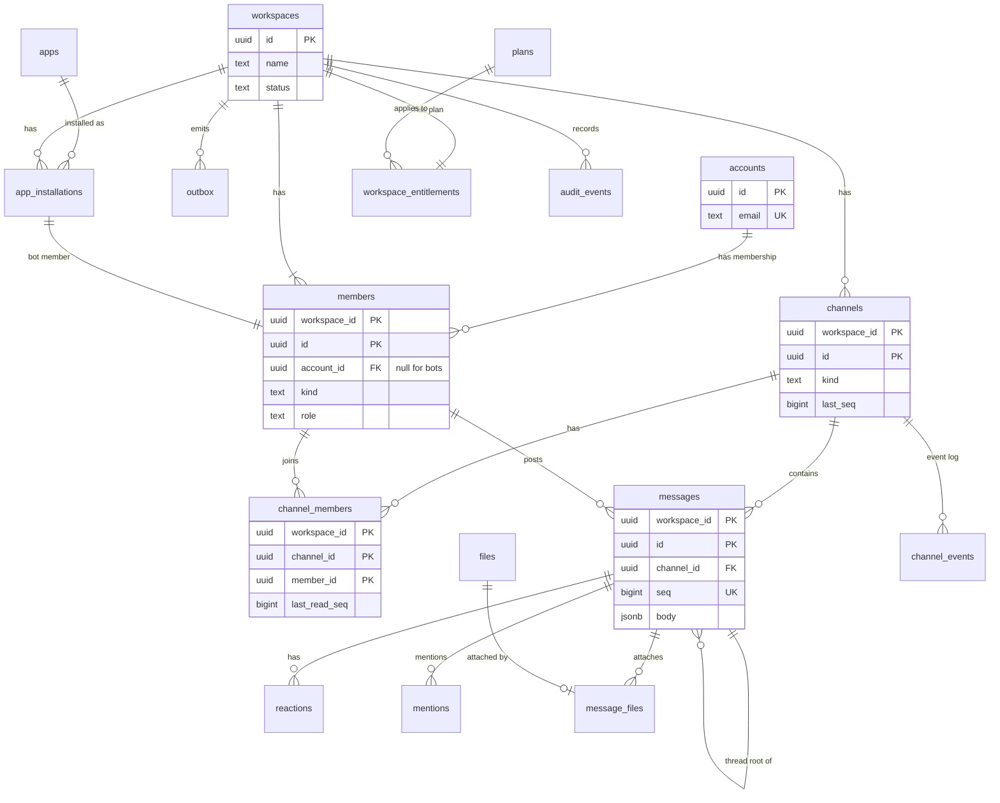

# Data model: Slack

データモデルの正本。テーブル・列・キー・索引・パーティション・保持と、DB の外のストア（Valkey、S3、検索、イベント）の形を、ここにまとめる。

- テナントの分離は [ADR-0009](../decisions/0009-pooled-tenancy-with-rls.md)、アカウントとメンバーの関係は [ADR-0010](../decisions/0010-accounts-and-workspace-members.md)、順序は [ADR-0001](../decisions/0001-per-channel-sequence.md)、配信は [ADR-0002](../decisions/0002-db-as-source-of-truth-with-outbox.md) に従う。
- **形（テーブル・列・キー）はこの文書を正とする。** 振る舞い（いつ書くか、誰が読めるか）は、各領域の文書を正とする。両者が食い違ったら、実装を止めて Dev（テックリード）に確かめる。
- 実装の変更（`changes/`）でマイグレーションを書くときは、この文書と各領域の文書を同じ PR で直す。

## 1. 文書の構成

量が多いので、領域ごとにファイルを分けた。

| ファイル | 内容 | テーブル数 |
| --- | --- | --- |
| この文書 | 規約、全体の ER 図、テーブルの索引、横断的な不変条件、テナントのコンテキスト | — |
| [data-model/identity.md](data-model/identity.md) | アカウントと認証（Better Auth）、OAuth、ワークスペース、メンバー、認証ポリシー、招待、API トークン | 24 |
| [data-model/conversations.md](data-model/conversations.md) | チャンネル、メッセージ、スレッド、リアクション、メンション、ピン、リンクのプレビュー、会話の周辺 | 15 |
| [data-model/realtime-and-notifications.md](data-model/realtime-and-notifications.md) | outbox、チャンネルのイベント列、通知の設定・記録・予定、リマインダー | 9 |
| [data-model/files-and-search.md](data-model/files-and-search.md) | ファイル、添付、容量、検索用のテーブル | 4 |
| [data-model/app-platform.md](data-model/app-platform.md) | アプリの定義（テナントの外）、インストール、配送、ビュー、公開 API の冪等性 | 18 |
| [data-model/governance.md](data-model/governance.md) | プランと entitlement、監査ログ、保持ポリシー、リーガルホールド、エクスポート、セル（S3） | 13 |
| [data-model/stores.md](data-model/stores.md) | Valkey のキー、S3 のキー、検索のマッピング、outbox・イベント・ジョブのペイロード、クライアントの IndexedDB | — |

合計 83 テーブル。ER 図は、全体図 1 つと、領域ごとの図 10 個（各ファイルの冒頭）。

## 2. 規約

### 2.1 使うストア

| ストア | 役割 | 正本か | 失ったとき |
| --- | --- | --- | --- |
| Aurora PostgreSQL 18（writer 1＋reader 1） | すべての業務データ。唯一の正本（ADR-0002） | 正本 | バックアップから戻す（[infrastructure.md](infrastructure.md)） |
| Valkey（ElastiCache） | Pub/Sub、在席、チケット、レート制限の計数、短命のキャッシュ | 正本ではない | 正しさは保たれる。クライアントが差分取得で回復する（ADR-0003） |
| S3 | ファイルの原本、サムネイル、プレビューの画像、エクスポート、監査ログのアーカイブ、削除の台帳 | ファイルの本体の正本。メタデータは DB | バージョニングと大阪への複製（[infrastructure.md](infrastructure.md)） |
| SQS | Relay から Worker へのきっかけ（ADR-0014） | 正本ではない | Relay が outbox から再送する |
| 検索 | S1 は Aurora の `search` スキーマ、S2 は OpenSearch（ADR-0004） | 正本ではない | DB から作り直す（[search.md](search.md) の 5.4 節） |
| AppConfig | フィーチャーフラグ（ADR-0026） | フラグの正本 | — |
| IndexedDB（ブラウザ） | 読み取りのキャッシュ、未送信のメッセージ、下書き（ADR-0024） | 未送信と下書きだけは端末の正本 | 読み取りのキャッシュは取り直す |

- 課金と金額は扱わない（ADR-0032。課金は別の題材）。金額の型は使わない。

### 2.2 ID

- **ID はすべて UUIDv7**（ADR-0009）。既定値は PostgreSQL 18 の `uuidv7()`。Better Auth の表も、生成関数を渡して UUIDv7 にする（[identity-and-access.md](identity-and-access.md) の 1.1 節）。
- 例外は `outbox.id` と `outbox_dead.id`（`bigint` の連番）。Relay が `ORDER BY id` で読むため（[realtime.md](realtime.md) の 11.1 節）。
- `seq` はチャンネルの中の連番で、`bigint`（ADR-0001）。ID ではなく位置である。
- クライアントが作る冪等キー（`client_msg_id`）も `uuid`。公開 API の `Idempotency-Key` は UUIDv5 に変換して入れる（[public-api.md](public-api.md) の 5.3 節）。
- 外部に見せる ID は UUID の文字列のまま。接頭辞付きの ID は、トークン（`slk_bot_...` など）だけに使う。

### 2.3 テナンシーと RLS

**テナントテーブル**（`workspace_id` を持つ表）は、次の形にそろえる（ADR-0009）。

```sql
CREATE TABLE <t> (
  workspace_id uuid NOT NULL REFERENCES workspaces (id),
  id           uuid NOT NULL DEFAULT uuidv7(),
  ...
  PRIMARY KEY (workspace_id, id)
);
ALTER TABLE <t> ENABLE ROW LEVEL SECURITY;
ALTER TABLE <t> FORCE ROW LEVEL SECURITY;
CREATE POLICY tenant_isolation ON <t>
  USING      (workspace_id = current_setting('app.workspace_id')::uuid)
  WITH CHECK (workspace_id = current_setting('app.workspace_id')::uuid);
```

- 主キーと外部キーは、`workspace_id` を先頭に含む複合キーにする。別テナントの行を参照する外部キーは、DB が拒否する。
- 索引の先頭も `workspace_id` にする（RLS の条件がクエリに加わるため）。
- `current_setting` は `missing_ok` なしで呼ぶ。コンテキストの設定を忘れたらエラーになる（安全側）。
- `workspaces` は、テナントの根として `id = current_setting('app.workspace_id')::uuid` のポリシーを持つ（[data-model/identity.md](data-model/identity.md)）。
- **テナントの外の表**（`accounts`、Better Auth の表、アプリの定義、`plans`、`platform_audit_events` など）は RLS を持たない。触れてよいモジュールを lint で限る（例：Better Auth の表は `apps/api/src/auth/` だけ）。
- **RLS の例外**は `search` スキーマだけ（ADR-0027）。

DB ロール（ADR-0009 の表に、各 ADR と領域の文書で足したものを加えた一覧）：

| ロール | 使う主体 | 権限 | 定めた場所 |
| --- | --- | --- | --- |
| `migrator` | マイグレーション | すべての表の所有者。FORCE RLS の対象 | ADR-0009 |
| `app` | api・mcp・public-api・Worker | テナントテーブルを RLS の下で読み書き。`BYPASSRLS` なし。`search` スキーマには権限なし | ADR-0009 |
| `relay` | Relay | `outbox` の全行の SELECT・DELETE と `published_at` の UPDATE、`outbox_dead` への INSERT | ADR-0009、[realtime.md](realtime.md) の 11 節 |
| `search_owner` | `search.*` の関数の所有者（NOLOGIN） | `search` スキーマの読み書き。`BYPASSRLS` なし | ADR-0027 |
| `tenant_resolver` | テナントをまたぐ `SECURITY DEFINER` 関数の所有者（NOLOGIN） | 下の関数が読む表だけに `TO tenant_resolver USING (true)` のポリシーを持つ。`BYPASSRLS` なし | この文書（2026-09-28 に決定） |
| `audit_exporter` | 監査ログのエクスポーター | `audit_events` の全行の SELECT だけ | ADR-0018 |
| `audit_pruner` | 監査ログの期限切れの削除 | `audit_events` のパーティションの DROP、`platform_audit_events` への INSERT | ADR-0018 |

テナントをまたぐ正当な読み書き（ADR-0009 の「個別に扱う」）は、`tenant_resolver` が所有する `SECURITY DEFINER` 関数だけで行う。関数は引数で必ず絞り、決まった列だけを返す。

| 関数 | 用途 | 定めた場所 |
| --- | --- | --- |
| `auth_resolve_member(workspace_id, account_id)` | メンバーと認証ポリシーの解決 | [identity-and-access.md](identity-and-access.md) の 6.2 節 |
| `auth_resolve_api_token(token_id)` | API トークンの検証 | 同 9 節 |
| `auth_accept_invitation(token_hash, account_id)` | 招待の受諾（メンバーの作成、チャンネルへの追加） | 同 8.1 節 |
| `auth_list_my_workspaces(account_id)` | `GET /api/me/workspaces` | 同 2.3 節 |
| `auth_find_joinable_workspaces(email_domain)` | ドメインでの参加の候補 | 同 8.3 節 |
| `app_console_list_collaborators(app_id)` | 開発者コンソールのコラボレーター | [apps.md](apps.md) の 3.2 節 |
| `hooks_resolve_webhook(webhook_id)` | Incoming Webhook の URL から、ワークスペースとインストールを引く | [apps.md](apps.md) の 11 節 |
| `app_list_active_installations(app_id)` | アプリの `blocked` で全インストールを止める運用のジョブ | [apps.md](apps.md) の 14.2 節 |
| `scheduler_due_items(kind, until, limit)` | 期限の来た行の `workspace_id` と主キーだけを返す。予約送信、リマインダー、保存のリマインド、メールの予定、アプリの配送の再試行、ファイルの GC と再スキャン。Worker は受け取った `workspace_id` でコンテキストを設定してから、行を RLS の下で読み直す | 各表の索引の節 |

### 2.4 命名

- テーブル名は複数形の snake_case（`channel_members`）。列名は snake_case。
- 外部キーの列は `<参照先の単数>_id`。役割が要るときは前に付ける（`uploader_member_id`、`created_by_member_id`）。
- 時刻は `<動詞の過去分詞>_at`（`created_at`、`deleted_at`、`expires_at`）。真偽値は `is_` か `has_`（`is_private`）、状態は `status` か `state`（領域の文書の呼び方に合わせる）。
- ハッシュを置く列は `<名前>_hash`（SHA-256 の `bytea`）。暗号化した列は `<名前>_enc`（`bytea`）。
- Better Auth のモデル名と項目名は、設定で snake_case の表名・列名に写す（`user` → `accounts`、`account` → `auth_identities`）。
- 本家の製品の内部の表名・項目名は使わない（ルートの AGENTS.md、リポジトリの ADR-0006）。

### 2.5 型

| 用途 | 型 | 規則 |
| --- | --- | --- |
| ID | `uuid` | 2.2 節 |
| 連番・件数・バイト数 | `bigint` | `seq`、`storage_bytes` など。小さい件数は `integer` |
| 時刻 | `timestamptz` | 常に UTC で保存する。`timestamp`（タイムゾーンなし）は使わない |
| 日付だけ | `date` | ほぼ使わない |
| タイムゾーン | `text` | IANA の名前（`Asia/Tokyo`） |
| 期間 | `integer`（秒・日） | 列名に単位を付ける（`duration_days`）。`interval` は使わない |
| 列挙 | `text` ＋ `CHECK (x IN (...))` | PostgreSQL の `ENUM` は使わない。値の追加を expand / contract で扱いやすくするため（ADR-0022） |
| 本文・UI ブロック | `jsonb` | Zod で検証してから書く（ADR-0006）。DB では形を検査しない |
| 設定の束 | `jsonb` | 型は `packages/contract` の Zod に置く |
| ID の小さな集合 | `uuid[]` | 外部キーを張れないので、書き込むサービス関数で検証する。要素が増えうるものは子の表にする |
| ハッシュ・暗号文 | `bytea` | |
| IP アドレス | `inet` | |
| 金額 | 使わない | 課金は対象外（ADR-0032） |

### 2.6 時刻の列と削除

- ほぼすべての表に `created_at timestamptz NOT NULL DEFAULT now()` を持たせる。更新される表は `updated_at` も持ち、サービス関数で更新する（トリガーは使わない）。
- 削除には 3 つの形があり、表ごとにどれかを選ぶ。

| 形 | 使う表 | 規則 |
| --- | --- | --- |
| **墓標（tombstone）** | `messages`、`search.message_docs` | 行を残して中身を消す。`deleted_at` を設定し、本文を空にする。`seq` と冪等キーの一意性を保つため（[messaging.md](messaging.md) の「削除」、ADR-0019） |
| **論理削除** | `accounts`、`workspaces`、`files`、`apps` など | `deleted_at`（または `status`）を設定し、非同期の Worker が後で物理削除する（ADR-0019） |
| **無効化** | `members` | 行を消さない。`deactivated_at` を設定する（ADR-0010） |
| **物理削除** | 関係の表（`reactions`、`pins`、`channel_members` など）、期限付きの表 | その場で `DELETE` する。期限付きの表はパーティションごと落とす |

- 保持ポリシーとリーガルホールドによる物理削除は、ADR-0019 の保持の Worker だけが行う。
- ワークスペースの消去では、全テナントテーブルを子から順に消す。表の一覧は、マイグレーションの lint と同じ定義から得る（ADR-0019）。

### 2.7 暗号化

- 保存時の暗号化は、ストアごとの KMS のカスタマー管理キーで行う（ADR-0017）。DB の列を個別に暗号化するのは、次の表の列だけにする。

| 列 | 方式 | 理由 |
| --- | --- | --- |
| `two_factors.secret`、`two_factors.backup_codes` | Better Auth の暗号化（`secrets` の版付きの鍵） | 復号して照合する必要がある |
| `auth_identities` の OAuth のトークン | Better Auth の `encryptOAuthTokens` | IdP のトークンを平文で持たない |
| `jwks.private_key` | Better Auth の JWT プラグインの暗号化 | |
| `app_credentials.signing_secret_enc` ほか | KMS の `apps` キーでエンベロープ暗号化 | HMAC の署名に使うので復号が要る（[apps.md](apps.md) の 8 節） |
| `app_bot_token_handoffs.token_enc` | KMS の `apps` キー | ボットのトークンの平文を 10 分だけ置く |

- **照合だけに使う秘密は、ハッシュだけを置く**（SHA-256、定数時間で比べる）：OTP・検証の値、招待のトークン、API トークン、Incoming Webhook の秘密、旧い `client_secret`、WebSocket のチケット（Valkey）。
- ワークスペースごとの鍵（EKM）は将来の選択肢（ADR-0017）。入れるときは、本文の列（`messages.body`）から暗号化する。

### 2.8 パーティション

| 表 | 分割 | 単位 | 落とす時期 |
| --- | --- | --- | --- |
| `outbox` | `RANGE (created_at)` | 1 日 | 空になった日のパーティションを落とす |
| `channel_events` | `RANGE (event_id)` | 1 か月 | 30 日を過ぎたもの |
| `notification_log` | `RANGE (message_id)` | 1 か月 | 30 日を過ぎたもの |
| `app_event_deliveries` | `RANGE (event_id)` | 1 日 | 3 日を過ぎたもの |
| `app_delivery_attempts` | `RANGE (id)` | 1 日 | 7 日を過ぎたもの |
| `audit_events`、`platform_audit_events` | `RANGE (id)` | 1 か月 | 1 年を過ぎたもの |
| `search.message_docs` | `HASH (workspace_id)` | 32 分割 | — |
| `messages` | なし | — | S2 で行数が 50 億を超えそうなら、`HASH (workspace_id)` を検討する（[capacity.md](capacity.md) の 3.1 節） |

- **時間で切る表は、原則として UUIDv7 の ID の範囲で切る**（2026-09-28 に決定）。PostgreSQL は、分割した表の主キー・一意制約に分割キーを含めることを求める。`created_at` で切ると、冪等性に使う一意制約（`notification_log` の主キーなど）が、別の時刻に書いた重複を防げなくなる。UUIDv7 は先頭 48 ビットが時刻なので、ID の範囲がそのまま時間の範囲になる。
- `outbox` は冪等性の一意制約を持たないので、`created_at` で切る。
- 範囲の境界は、時刻から作った UUIDv7 の下限（時刻の 48 ビットの後を 0 で埋めた値）にする。パーティションの作成と削除は、定期のジョブ（`partition-maintenance`、1 日 1 回）で行い、7 日先まで作っておく。
- `channel_events` の主キーは `(workspace_id, channel_id, seq, event_id)` になる。`seq` の一意性は DB の制約ではなく、`channels.last_seq` の行ロックでの採番で守る（5 節の I-2）。

### 2.9 規模の前提（S1）

各表の「S1 の規模」は、次の前提からの見積もりである。E7 の負荷試験で置き換える。

| 項目 | 値 | 出典 |
| --- | --- | --- |
| ワークスペース | 約 1 万（仮定） | — |
| アカウント | 約 15 万（仮定。DAU 10 万の 1.5 倍） | [capacity.md](capacity.md) の 1 節 |
| メンバー | 約 20 万（仮定。1 アカウントが平均 1.3 ワークスペース） | — |
| 1 日の投稿 | 500 万件（ピーク 300 件/秒） | [capacity.md](capacity.md) の 1 節 |
| 保存するメッセージ | 1 年で約 18 億件、約 1.8 TB | 同上 |
| `seq` を消費するイベント | 1 日約 750 万件 | 投稿＋リアクション・編集・削除（投稿の 0.5 倍） |

### 2.10 スキーマの変更

- 無停止の expand / contract で行う（ADR-0022）。列の削除・改名・型の変更・既定値のない `NOT NULL` の追加を、同じリリースで行わない。
- テナントテーブルの追加は、`workspace_id`、複合キー、`FORCE ROW LEVEL SECURITY`、ポリシーをマイグレーションの lint で検査する（ADR-0009）。削除の対象の一覧（2.6 節）にも自動で入る。

## 3. 全体の ER 図

主な実体と関係だけを示す。列と細かい関係は、領域ごとの図にある。



## 4. テーブルの索引

「外」はテナントの外（RLS なし）、「内」はテナントテーブル（RLS あり）。

| テーブル | 領域のファイル | テナント | 振る舞いを定める文書 |
| --- | --- | --- | --- |
| `accounts` | [identity](data-model/identity.md) | 外 | [identity-and-access.md](identity-and-access.md)、ADR-0010、ADR-0012 |
| `auth_identities` | [identity](data-model/identity.md) | 外 | [identity-and-access.md](identity-and-access.md) の 1.1 節 |
| `sessions` | [identity](data-model/identity.md) | 外 | 同 3 節 |
| `verifications` | [identity](data-model/identity.md) | 外 | 同 2.1 節 |
| `passkeys` | [identity](data-model/identity.md) | 外 | 同 4 節 |
| `two_factors` | [identity](data-model/identity.md) | 外 | 同 4 節 |
| `sso_providers` | [identity](data-model/identity.md) | 外 | 同 5 節 |
| `auth_rate_limits` | [identity](data-model/identity.md) | 外 | 同 11 節 |
| `jwks` | [identity](data-model/identity.md) | 外 | [public-api.md](public-api.md) の 4 節、ADR-0017 |
| `oauth_clients` | [identity](data-model/identity.md) | 外 | [public-api.md](public-api.md) の 4.1 節、[mcp.md](mcp.md) の 3.1 節 |
| `oauth_access_tokens` | [identity](data-model/identity.md) | 外 | 同上 |
| `oauth_refresh_tokens` | [identity](data-model/identity.md) | 外 | 同上 |
| `oauth_consents` | [identity](data-model/identity.md) | 外 | 同上 |
| `oauth_workspace_selections` | [identity](data-model/identity.md) | 外 | [public-api.md](public-api.md) の 4.1 節 |
| `workspaces` | [identity](data-model/identity.md) | 根（RLS あり） | [identity-and-access.md](identity-and-access.md)、ADR-0019 |
| `members` | [identity](data-model/identity.md) | 内 | ADR-0010、[identity-and-access.md](identity-and-access.md) |
| `member_statuses` | [identity](data-model/identity.md) | 内 | [identity-and-access.md](identity-and-access.md) の「プロフィールとステータス」 |
| `workspace_settings` | [identity](data-model/identity.md) | 内 | 複数（[messaging.md](messaging.md)、[read-state-and-notifications.md](read-state-and-notifications.md) ほか） |
| `workspace_auth_policies` | [identity](data-model/identity.md) | 内 | [identity-and-access.md](identity-and-access.md) の 1.2 節 |
| `workspace_domains` | [identity](data-model/identity.md) | 内 | 同 5.2 節 |
| `workspace_sso_connections` | [identity](data-model/identity.md) | 内 | 同 5.1 節 |
| `invitations` | [identity](data-model/identity.md) | 内 | 同 8 節 |
| `api_tokens` | [identity](data-model/identity.md) | 内 | 同 9 節、[apps.md](apps.md) の 3.3 節 |
| `workspace_mcp_policies` | [identity](data-model/identity.md) | 内 | [mcp.md](mcp.md) の 3.3 節 |
| `channels` | [conversations](data-model/conversations.md) | 内 | [messaging.md](messaging.md)、ADR-0001 |
| `channel_members` | [conversations](data-model/conversations.md) | 内 | [read-state-and-notifications.md](read-state-and-notifications.md) |
| `messages` | [conversations](data-model/conversations.md) | 内 | [messaging.md](messaging.md) |
| `reactions` | [conversations](data-model/conversations.md) | 内 | 同「リアクション」 |
| `mentions` | [conversations](data-model/conversations.md) | 内 | 同「メンション」 |
| `thread_subscriptions` | [conversations](data-model/conversations.md) | 内 | 同「スレッドの購読」 |
| `pins` | [conversations](data-model/conversations.md) | 内 | 同「ピン留め」 |
| `link_previews` | [conversations](data-model/conversations.md) | 内 | 同「リンクのプレビュー」 |
| `message_unfurls` | [conversations](data-model/conversations.md) | 内 | 同上 |
| `user_groups` | [conversations](data-model/conversations.md) | 内 | 同「ユーザーグループ」 |
| `user_group_members` | [conversations](data-model/conversations.md) | 内 | 同上 |
| `scheduled_messages` | [conversations](data-model/conversations.md) | 内 | 同「予約送信」 |
| `custom_emoji` | [conversations](data-model/conversations.md) | 内 | 同「カスタム絵文字」 |
| `saved_items` | [conversations](data-model/conversations.md) | 内 | 同「保存とブックマーク」 |
| `channel_bookmarks` | [conversations](data-model/conversations.md) | 内 | 同上 |
| `outbox` | [realtime-and-notifications](data-model/realtime-and-notifications.md) | 内（`relay` は全行） | [realtime.md](realtime.md) の 11 節 |
| `outbox_dead` | [realtime-and-notifications](data-model/realtime-and-notifications.md) | 内（`relay` は全行） | 同 11.4 節 |
| `channel_events` | [realtime-and-notifications](data-model/realtime-and-notifications.md) | 内 | 同 4 節 |
| `member_notification_prefs` | [realtime-and-notifications](data-model/realtime-and-notifications.md) | 内 | [read-state-and-notifications.md](read-state-and-notifications.md) の 6 節 |
| `push_subscriptions` | [realtime-and-notifications](data-model/realtime-and-notifications.md) | 内 | 同 7.1 節 |
| `notification_log` | [realtime-and-notifications](data-model/realtime-and-notifications.md) | 内 | 同 8 節 |
| `notification_pending_emails` | [realtime-and-notifications](data-model/realtime-and-notifications.md) | 内 | 同 7.2 節 |
| `notification_email_batches` | [realtime-and-notifications](data-model/realtime-and-notifications.md) | 内 | 同 8 節 |
| `reminders` | [realtime-and-notifications](data-model/realtime-and-notifications.md) | 内 | 同「リマインダー」 |
| `files` | [files-and-search](data-model/files-and-search.md) | 内 | [files.md](files.md)、ADR-0015 |
| `message_files` | [files-and-search](data-model/files-and-search.md) | 内 | 同上 |
| `workspace_usage` | [files-and-search](data-model/files-and-search.md) | 内 | [files.md](files.md) の 7 節 |
| `search.message_docs` | [files-and-search](data-model/files-and-search.md) | 例外（RLS なし、関数だけ） | [search.md](search.md)、ADR-0027 |
| `apps` | [app-platform](data-model/app-platform.md) | 外 | [apps.md](apps.md) の 3.2 節 |
| `app_manifest_versions` | [app-platform](data-model/app-platform.md) | 外 | 同上 |
| `app_credentials` | [app-platform](data-model/app-platform.md) | 外 | 同 3.2 節、14.3 節 |
| `app_collaborators` | [app-platform](data-model/app-platform.md) | 外 | 同 3.2 節 |
| `app_verified_domains` | [app-platform](data-model/app-platform.md) | 外 | 同 7.7 節 |
| `app_endpoint_states` | [app-platform](data-model/app-platform.md) | 外 | 同 7.5 節 |
| `app_delivery_attempts` | [app-platform](data-model/app-platform.md) | 外 | 同 17 節、ADR-0033 の 5 |
| `app_installations` | [app-platform](data-model/app-platform.md) | 内 | 同 3.3 節、5 節 |
| `app_user_authorizations` | [app-platform](data-model/app-platform.md) | 内 | 同 3.3 節 |
| `app_bot_token_handoffs` | [app-platform](data-model/app-platform.md) | 内 | 同 5.1 節 |
| `workspace_app_policies` | [app-platform](data-model/app-platform.md) | 内 | 同 6.3 節 |
| `workspace_app_rules` | [app-platform](data-model/app-platform.md) | 内 | 同上 |
| `app_approval_requests` | [app-platform](data-model/app-platform.md) | 内 | 同 6.4 節 |
| `workspace_slash_commands` | [app-platform](data-model/app-platform.md) | 内 | 同 9.2 節 |
| `incoming_webhooks` | [app-platform](data-model/app-platform.md) | 内 | 同 11 節 |
| `app_views` | [app-platform](data-model/app-platform.md) | 内 | 同 9.3 節、12 節 |
| `app_event_deliveries` | [app-platform](data-model/app-platform.md) | 内 | 同 7 節 |
| `api_idempotency_keys` | [app-platform](data-model/app-platform.md) | 内 | [public-api.md](public-api.md) の 5.3 節 |
| `plans` | [governance](data-model/governance.md) | 外 | ADR-0032、ADR-0033 |
| `workspace_entitlements` | [governance](data-model/governance.md) | 内 | 同上 |
| `workspace_entitlement_overrides` | [governance](data-model/governance.md) | 内 | 同上、[rate-limiting.md](rate-limiting.md) |
| `audit_events` | [governance](data-model/governance.md) | 内（追記のみ） | ADR-0018 |
| `platform_audit_events` | [governance](data-model/governance.md) | 外（追記のみ） | ADR-0018 |
| `audit_export_checkpoints` | [governance](data-model/governance.md) | 外 | ADR-0018 |
| `retention_policies` | [governance](data-model/governance.md) | 内 | ADR-0019 |
| `legal_holds` | [governance](data-model/governance.md) | 内 | ADR-0019 |
| `legal_hold_targets` | [governance](data-model/governance.md) | 内 | ADR-0019 |
| `held_message_versions` | [governance](data-model/governance.md) | 内 | ADR-0019 |
| `export_jobs` | [governance](data-model/governance.md) | 内 | ADR-0019、[security.md](security.md) の 15 節 |
| `workspace_export_settings` | [governance](data-model/governance.md) | 内 | 同上 |
| `workspace_cells` | [governance](data-model/governance.md) | 外（S3 の Global） | ADR-0023、[infrastructure.md](infrastructure.md) の 10 節 |

## 5. 横断的な不変条件

実装とテストで守る規則。DB の制約で守れるものは制約にし、守れないものは性質ベーステストで確かめる。

| # | 不変条件 | 守り方 | 決めた場所 |
| --- | --- | --- | --- |
| I-1 | テナントの中の行は、別テナントの行を参照しない | 複合外部キー、RLS | ADR-0009 |
| I-2 | チャンネルの `seq` は 1 から欠番・重複なく増える。チャンネルの状態を変える操作は、ちょうど 1 つ `seq` を消費する | `channels.last_seq` を `UPDATE ... RETURNING` で採番し、`messages`・`channel_events`・`outbox` と同じトランザクションで書く。`UNIQUE (workspace_id, channel_id, seq)`（`messages`）。PROP-MSG-001 | ADR-0001、[messaging.md](messaging.md) の「共通の規則」 |
| I-3 | 状態が変わらない操作は `seq` を消費しない | サービス関数が「変わったか」を確かめてからイベントを書く | [messaging.md](messaging.md) |
| I-4 | メッセージの `seq` は作成時の値から変わらない。並びは `seq` だけで決める | `seq` を更新する経路を作らない。`created_at` と ID で並べない | ADR-0001 |
| I-5 | 同じ（メンバー、`client_msg_id`）の投稿は 1 行だけ | `UNIQUE (workspace_id, channel_id, member_id, client_msg_id)`。PROP-MSG-002 | [messaging.md](messaging.md)、REQ-MSG-002 |
| I-6 | 1 つのアカウントは、1 つのワークスペースに最大 1 人のメンバーを持つ | `UNIQUE (workspace_id, account_id)` | ADR-0010 |
| I-7 | テナントの中のデータは `account_id` を参照しない（`members.account_id` だけが例外） | マイグレーションの lint | ADR-0010 |
| I-8 | 1 つのファイルは 1 つのメッセージにだけ付く | `message_files` の `UNIQUE (workspace_id, file_id)` | ADR-0015、[files.md](files.md) |
| I-9 | スキャンが済んでいないファイルは配らない | `files.status = 'ready'` のときだけ URL を発行する。S3 のタグによる制御と二重 | ADR-0015 |
| I-10 | 既読の位置は後退しない | `GREATEST(last_read_seq, :seq)` | [read-state-and-notifications.md](read-state-and-notifications.md) の 1 節 |
| I-11 | 1 つのメッセージで、1 人への通知は最大 1 回 | `notification_log` の主キーと `INSERT ... ON CONFLICT DO NOTHING` | ADR-0014 |
| I-12 | 検索の文書は、古い版で新しい版を上書きしない | `content_seq` の比較 | [search.md](search.md) の 2.3 節 |
| I-13 | 監査ログは追記だけ | `app` に `UPDATE`・`DELETE` を与えない。トリガーでも拒否する | ADR-0018 |
| I-14 | 監査の対象の操作が成功したら、同じトランザクションに監査ログが 1 件ある | 表駆動の結合テスト | ADR-0018 |
| I-15 | リーガルホールドの対象は、どの経路でも物理削除しない | 物理削除を保持の Worker と `deleteFile` に集め、ホールドを確かめる | ADR-0019 |
| I-16 | 削除済みのメッセージは本文を持たない | 削除と同じトランザクションで `body` を空にする（ホールド中は `held_message_versions` に退避） | ADR-0019、[messaging.md](messaging.md) |
| I-17 | ワークスペースの主たる所有者は 1 人で、有効な owner である | `workspaces.primary_owner_member_id`。最後の owner の降格・無効化は 409 | [identity-and-access.md](identity-and-access.md) の 6.3 節 |
| I-18 | SSO の振り分けに使える確認済みのドメインは、1 つのワークスペースだけ | `workspace_domains` の部分一意索引（ワークスペースをまたぐので `tenant_resolver` の関数で検査する） | 同 5.2 節 |
| I-19 | スラッシュコマンドの名前はワークスペースで一意 | `UNIQUE (workspace_id, command)` | [apps.md](apps.md) の 9.2 節 |
| I-20 | 1 つのアプリは、1 つのワークスペースに最大 1 つのインストール | `UNIQUE (workspace_id, app_id)` | [apps.md](apps.md) の 3.3 節 |
| I-21 | アプリへの配送は（インストール、`event_id`）ごとに 1 件 | `app_event_deliveries` の主キー | [apps.md](apps.md) の 7.3 節 |
| I-22 | Valkey のチャンネル名とキー、S3 のキー、検索の条件は、必ずワークスペースで区切る | [data-model/stores.md](data-model/stores.md) の形。レビューと lint | ADR-0009 |
| I-23 | 読めるチャンネルの判定は 1 つの規則。TypeScript の関数と SQL の `readable_channel_ids()` は同じ集合を返す | 性質ベーステスト | ADR-0005、[search.md](search.md) の 3 節 |
| I-24 | DB が正本。Valkey・SQS・検索・キャッシュを失っても、DB から作り直せる | 配信経路に状態を持たせない | ADR-0002 |

## 6. テナントのコンテキスト

```
Request ─▶ 認証ミドルウェア
            1. セッションから account_id を得る（または API トークンから member_id）
            2. パスの workspace_id と account_id から member を解決する（auth_resolve_member。なければ 404）
            3. BEGIN; SET LOCAL app.workspace_id = …; SET LOCAL app.member_id = …
         ─▶ ハンドラー（以降のクエリはすべて RLS の下で実行される）
         ─▶ COMMIT（SET LOCAL の値はここで消える）
```

- API のパスは `/workspaces/{workspace_id}/...` の形にし、テナントを明示する。内部 API は `/api` を接頭辞に持つ（Web と同じオリジンで SPA のルートと分けるため。例：`/api/workspaces/{ws}/channels`）。設計文書では、接頭辞を省いて書くことがある。
- Worker は、ジョブが持つ `workspace_id` でコンテキストを設定してから処理する。ジョブの形は [data-model/stores.md](data-model/stores.md) の 5 節。
- `app.member_id` は、監査ログの行為者と、行為者で絞る処理（自分の予約送信など）に使う。RLS のポリシーには使わない（ポリシーはワークスペースの単位だけ）。
