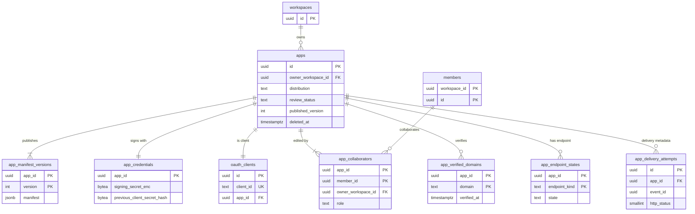
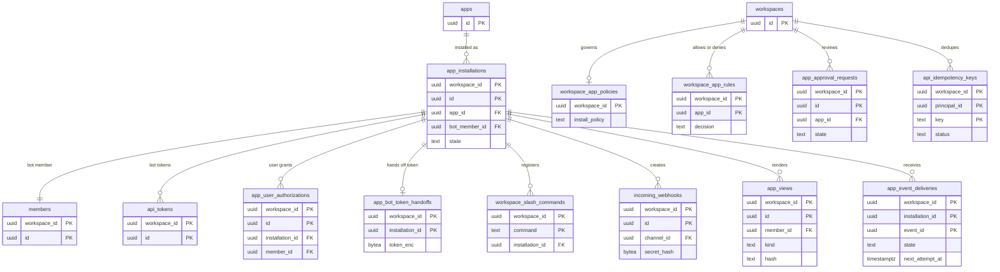

# Data model: アプリの基盤と公開 API

[data-model.md](../data-model.md) の一部。規約は、そちらの 2 節に従う。振る舞いは [apps.md](../apps.md)、[public-api.md](../public-api.md)、[ADR-0030](../../decisions/0030-versioned-public-api.md)、[ADR-0031](../../decisions/0031-app-platform.md)、[ADR-0033](../../decisions/0033-slack-aligned-platform-and-plan-decisions.md) を正とする。E12（MVP の後）で作る。

- **アプリの定義はテナントの外**、**インストールと配送はテナントの中** に置く（[apps.md](../apps.md) の 3 節）。
- OAuth のクライアント・同意・トークンは Better Auth の表（[identity.md](identity.md) の 2 節）にある。

## 1. ER 図

### 1.1 アプリの定義（テナントの外）

### 1.2 インストールと配送（テナントの中）

## 2. テナントの外の表

RLS を持たない。開発者コンソールのモジュールと、配送・認可のサービス関数だけが触れる。テナントのデータ（本文など）を持たない。S3 ではセルの外（アイデンティティ面）に置き、各セルへ読み取り専用で複製する（[apps.md](../apps.md) の 18.2 節）。

### apps

| 列 | 型 | NULL | 既定 | 説明 |
| --- | --- | --- | --- | --- |
| `id` | `uuid` | NO | `uuidv7()` | |
| `owner_workspace_id` | `uuid` | NO | | 所有するワークスペース。→ `workspaces.id` |
| `distribution` | `text` | NO | `'single_workspace'` | `single_workspace` / `distributed`。`distributed` から戻さない |
| `review_status` | `text` | NO | `'none'` | `none` / `pending` / `approved` / `rejected` / `blocked` |
| `published_version` | `integer` | YES | | 公開中のマニフェストの版 |
| `created_by_member_id` | `uuid` | NO | | 所有するワークスペースのメンバー |
| `created_at` / `updated_at` | `timestamptz` | NO | `now()` | |
| `deleted_at` | `timestamptz` | YES | | 論理削除。全インストールのアンインストールの後に設定する |

- 外部キー：`owner_workspace_id` → `workspaces`、`(owner_workspace_id, created_by_member_id)` → `members`、`(id, published_version)` → `app_manifest_versions`。
- 索引：`(owner_workspace_id)`（コンソールの一覧）。
- S1 の規模：E12 の開始後、数千行。

### app_manifest_versions

| 列 | 型 | NULL | 既定 | 説明 |
| --- | --- | --- | --- | --- |
| `app_id` | `uuid` | NO | | |
| `version` | `integer` | NO | | 1 から増える |
| `manifest` | `jsonb` | NO | | `packages/contract/public/v1` の Zod で検証済みのマニフェスト |
| `published_at` | `timestamptz` | YES | | 下書きは NULL |
| `published_by_member_id` | `uuid` | YES | | |
| `created_at` | `timestamptz` | NO | `now()` | |

- 主キー：`(app_id, version)`。インストールは、インストールしたときの版を指す（スコープを固定する）。
- 保持：インストールから参照される版は消さない。
- S1 の規模：数万行。

### app_credentials

アプリの秘密。KMS の `apps` キーでエンベロープ暗号化する（ADR-0017 の 2026-09-28 の注記）。

| 列 | 型 | NULL | 既定 | 説明 |
| --- | --- | --- | --- | --- |
| `app_id` | `uuid` | NO | | 主キー |
| `signing_secret_enc` | `bytea` | NO | | 署名の秘密（`whsec_` の形、24〜64 バイト） |
| `previous_signing_secret_enc` | `bytea` | YES | | 入れ替え中の旧い秘密。両方で署名する |
| `previous_signing_secret_expires_at` | `timestamptz` | YES | | 24 時間後 |
| `previous_client_secret_hash` | `bytea` | YES | | 旧い `client_secret` のハッシュ。トークンのエンドポイントを包むハンドラーが照合する（[apps.md](../apps.md) の 14.3 節） |
| `previous_client_secret_expires_at` | `timestamptz` | YES | | 24 時間後 |
| `updated_at` | `timestamptz` | NO | `now()` | |

- 現在の `client_secret` は `oauth_clients` にある。
- 復号できるのは app-delivery Worker と api のタスクロールだけ。
- S1 の規模：数千行。

### app_collaborators

| 列 | 型 | NULL | 既定 | 説明 |
| --- | --- | --- | --- | --- |
| `app_id` | `uuid` | NO | | |
| `owner_workspace_id` | `uuid` | NO | | `apps.owner_workspace_id` と同じ |
| `member_id` | `uuid` | NO | | 所有するワークスペースのメンバー |
| `role` | `text` | NO | | `owner` / `editor` |
| `created_at` | `timestamptz` | NO | `now()` | |

- 主キー：`(app_id, member_id)`。
- 外部キー：`app_id` → `apps`、`(owner_workspace_id, member_id)` → `members`。
- 読み取りは `app_console_list_collaborators(app_id)`（`tenant_resolver`）で、メンバーの表示名を添えて返す。
- S1 の規模：数万行。

### app_verified_domains

| 列 | 型 | NULL | 既定 | 説明 |
| --- | --- | --- | --- | --- |
| `app_id` | `uuid` | NO | | |
| `domain` | `text` | NO | | |
| `verification_token` | `text` | NO | | DNS TXT の値 |
| `verified_at` | `timestamptz` | YES | | |

- 主キー：`(app_id, domain)`。
- S1 の規模：数千行。

### app_endpoint_states

| 列 | 型 | NULL | 既定 | 説明 |
| --- | --- | --- | --- | --- |
| `app_id` | `uuid` | NO | | |
| `endpoint_kind` | `text` | NO | | `events` / `interactivity` |
| `state` | `text` | NO | `'enabled'` | `enabled` / `disabled` |
| `disabled_reason` | `text` | YES | | `failure_threshold` / `gone_410` |
| `disabled_at` | `timestamptz` | YES | | |
| `updated_at` | `timestamptz` | NO | `now()` | |

- 主キー：`(app_id, endpoint_kind)`。
- S1 の規模：数千行。

### app_delivery_attempts

開発者コンソールに見せる、配送のメタデータ。本文を持たない（ADR-0033 の 5）。

| 列 | 型 | NULL | 既定 | 説明 |
| --- | --- | --- | --- | --- |
| `id` | `uuid` | NO | `uuidv7()` | 分割キー |
| `app_id` | `uuid` | NO | | |
| `installation_id` | `uuid` | NO | | 他のテナントの ID だが、中身を持たない |
| `event_id` | `uuid` | NO | | |
| `event_type` | `text` | NO | | |
| `attempt` | `smallint` | NO | | 1 から |
| `http_status` | `smallint` | YES | | タイムアウト・接続の失敗は NULL |
| `latency_ms` | `integer` | YES | | |
| `outcome` | `text` | NO | | `delivered` / `retrying` / `failed` / `skipped` / `dropped` |

- 主キー：`(id)`。索引：`(app_id, id DESC)`（直近 7 日の一覧）。
- 分割：`RANGE (id)`、1 日。7 日を過ぎたパーティションを落とす。
- S1 の規模：1 日約 500 万行、常に約 3,500 万行。

## 3. テナントの中の表

### app_installations

| 列 | 型 | NULL | 既定 | 説明 |
| --- | --- | --- | --- | --- |
| `workspace_id`、`id` | `uuid` | NO | | |
| `app_id` | `uuid` | NO | | → `apps.id` |
| `manifest_version` | `integer` | NO | | インストールしたときの版 |
| `bot_scopes` | `text[]` | NO | | 許したボットのスコープ |
| `user_scopes` | `text[]` | NO | `'{}'` | 許したユーザーのスコープの上限 |
| `bot_member_id` | `uuid` | NO | | ボットのメンバー |
| `installed_by_member_id` | `uuid` | NO | | |
| `state` | `text` | NO | | `pending_approval` / `active` / `suspended` / `uninstalled` |
| `suspended_at`、`uninstalled_at` | `timestamptz` | YES | | |
| `created_at` / `updated_at` | `timestamptz` | NO | `now()` | |

- 主キー：`(workspace_id, id)`。一意：`UNIQUE (workspace_id, app_id)`（I-20）、`UNIQUE (workspace_id, bot_member_id)`。
- 外部キー：`app_id` → `apps`、`(app_id, manifest_version)` → `app_manifest_versions`、`(workspace_id, bot_member_id)` → `members`（`members.installation_id` と循環するので `DEFERRABLE INITIALLY DEFERRED`）。
- 索引：`(app_id) WHERE state = 'active'`（アプリの `blocked` で全インストールを止める。ワークスペースをまたぐので、運用のジョブが `app_list_active_installations(app_id)` で引く）。
- アンインストールしても行は残す（`uninstalled`）。ワークスペースの消去で消える。
- S1 の規模：数万行。

### app_user_authorizations

| 列 | 型 | NULL | 既定 | 説明 |
| --- | --- | --- | --- | --- |
| `workspace_id`、`id` | `uuid` | NO | | |
| `installation_id` | `uuid` | NO | | |
| `member_id` | `uuid` | NO | | 同意したメンバー |
| `user_scopes` | `text[]` | NO | | |
| `created_at` | `timestamptz` | NO | `now()` | |
| `revoked_at` | `timestamptz` | YES | | |

- 主キー：`(workspace_id, id)`。一意：`UNIQUE (workspace_id, installation_id, member_id) WHERE revoked_at IS NULL`。
- Better Auth の `oauth_consents`（テナントの外）と対にし、管理者の一覧と取り消しに使う。
- S1 の規模：数万行。

### app_bot_token_handoffs

インストールの同意で作ったボットのトークンの平文を、トークンの応答で渡すまでの 10 分だけ置く（[apps.md](../apps.md) の 5.1 節）。

| 列 | 型 | NULL | 既定 | 説明 |
| --- | --- | --- | --- | --- |
| `workspace_id`、`installation_id` | `uuid` | NO | | 主キー |
| `token_enc` | `bytea` | NO | | KMS の `apps` キーで暗号化 |
| `expires_at` | `timestamptz` | NO | | 10 分後 |

- 渡したら消す。期限切れは 10 分ごとに消す（渡せなかったトークンも失効させる）。
- S1 の規模：常に数行。

### workspace_app_policies

| 列 | 型 | NULL | 既定 | 説明 |
| --- | --- | --- | --- | --- |
| `workspace_id` | `uuid` | NO | | 主キー |
| `install_policy` | `text` | NO | | `open` / `approval_required`（既定は entitlement の `feature.apps_admin_policy`） |
| `member_install_allowed` | `boolean` | NO | `true` | |
| `distributed_apps` | `text` | NO | `'allow'` | `allow` / `reviewed_only` / `deny` |
| `updated_at` | `timestamptz` | NO | `now()` | |

- S1 の規模：数千行。

### workspace_app_rules

| 列 | 型 | NULL | 既定 | 説明 |
| --- | --- | --- | --- | --- |
| `workspace_id`、`app_id` | `uuid` | NO | | 主キー |
| `decision` | `text` | NO | | `allow` / `deny` |
| `max_scopes` | `text[]` | YES | | `allow` のときのスコープの上限 |
| `created_by_member_id` | `uuid` | NO | | |
| `created_at` | `timestamptz` | NO | `now()` | |

- S1 の規模：数万行。

### app_approval_requests

| 列 | 型 | NULL | 既定 | 説明 |
| --- | --- | --- | --- | --- |
| `workspace_id`、`id` | `uuid` | NO | | |
| `app_id` | `uuid` | NO | | |
| `requested_by_member_id` | `uuid` | NO | | |
| `requested_scopes` | `text[]` | NO | | |
| `reason` | `text` | YES | | |
| `state` | `text` | NO | `'pending'` | `pending` / `approved` / `denied` |
| `decided_by_member_id` | `uuid` | YES | | |
| `decided_at` | `timestamptz` | YES | | |
| `created_at` | `timestamptz` | NO | `now()` | |

- 一意：`UNIQUE (workspace_id, app_id) WHERE state = 'pending'`（未処理の依頼はワークスペースに 1 つ）。
- 保持：判断から 1 年で消す（監査ログは残る）。
- S1 の規模：数千行。

### workspace_slash_commands

| 列 | 型 | NULL | 既定 | 説明 |
| --- | --- | --- | --- | --- |
| `workspace_id` | `uuid` | NO | | |
| `command` | `text` | NO | | `/` から始まる小文字 |
| `installation_id` | `uuid` | NO | | 割り当てたインストール |
| `description`、`usage_hint` | `text` | YES | | マニフェストから写す |
| `created_at` | `timestamptz` | NO | `now()` | |

- 主キー：`(workspace_id, command)`（I-19）。同じ名前を持つアプリが後から入っても、割り当ては変えない（管理者が選ぶ）。
- 索引：`(workspace_id, installation_id)`（アンインストールで消す）。
- S1 の規模：数万行。

### incoming_webhooks

| 列 | 型 | NULL | 既定 | 説明 |
| --- | --- | --- | --- | --- |
| `workspace_id`、`id` | `uuid` | NO | | `id` は URL の `webhook_id` |
| `installation_id` | `uuid` | NO | | |
| `channel_id` | `uuid` | NO | | 投稿先 |
| `secret_hash` | `bytea` | NO | | |
| `previous_secret_hash` | `bytea` | YES | | 入れ替え中の旧い秘密 |
| `previous_secret_expires_at` | `timestamptz` | YES | | 1 時間後 |
| `created_by_member_id` | `uuid` | NO | | |
| `created_at` | `timestamptz` | NO | `now()` | |
| `revoked_at` | `timestamptz` | YES | | |

- 一意：`UNIQUE (id)`（全体。`hooks.<domain>` はパスの `webhook_id` から、`tenant_resolver` の関数 `hooks_resolve_webhook(webhook_id)` で引く）。
- 外部キー：`(workspace_id, installation_id)` → `app_installations`、`(workspace_id, channel_id)` → `channels`。
- 保持：アンインストールで消す。
- S1 の規模：数万行。

### app_views

モーダルとアプリのホーム。

| 列 | 型 | NULL | 既定 | 説明 |
| --- | --- | --- | --- | --- |
| `workspace_id`、`id` | `uuid` | NO | | |
| `installation_id` | `uuid` | NO | | |
| `member_id` | `uuid` | NO | | 見るメンバー |
| `kind` | `text` | NO | | `modal` / `home` |
| `ui_blocks` | `jsonb` | NO | | [apps.md](../apps.md) の 10 節 |
| `private_metadata` | `text` | YES | | 3,000 文字まで |
| `hash` | `text` | NO | | 楽観ロック。更新のたびに変える |
| `parent_view_id` | `uuid` | YES | | 重ねたモーダル（3 枚まで） |
| `connection_id` | `text` | YES | | モーダルを届ける接続（`trigger_id` に結び付いたもの） |
| `expires_at` | `timestamptz` | YES | | モーダルは 1 時間。ホームは NULL |
| `created_at` / `updated_at` | `timestamptz` | NO | `now()` | |

- 一意：`UNIQUE (workspace_id, installation_id, member_id) WHERE kind = 'home'`。
- CHECK：`char_length(private_metadata) <= 3000`。`kind = 'modal'` なら `expires_at IS NOT NULL`。
- 保持：期限切れのモーダルを 1 時間ごとに消す。アンインストールで消す。
- S1 の規模：数十万行。

### app_event_deliveries

Events API の配送（[apps.md](../apps.md) の 7.3 節）。

| 列 | 型 | NULL | 既定 | 説明 |
| --- | --- | --- | --- | --- |
| `workspace_id`、`installation_id` | `uuid` | NO | | |
| `event_id` | `uuid` | NO | | 配送の ID（アプリに送る `event_id`）。分割キー |
| `event_type` | `text` | NO | | |
| `channel_id` | `uuid` | YES | | |
| `seq` | `bigint` | YES | | |
| `target_id` | `uuid` | YES | | メッセージなどの対象 |
| `state` | `text` | NO | `'pending'` | `pending` / `delivered` / `failed` / `skipped` / `dropped` |
| `attempts` | `smallint` | NO | `0` | 最大 7 回 |
| `next_attempt_at` | `timestamptz` | YES | | |
| `last_status` | `smallint` | YES | | |
| `last_latency_ms` | `integer` | YES | | |
| `created_at` / `updated_at` | `timestamptz` | NO | `now()` | |

- 主キー：`(workspace_id, installation_id, event_id)`（I-21。`INSERT ... ON CONFLICT DO NOTHING`）。
- 索引：`(next_attempt_at) WHERE state = 'pending'`（app-delivery-scheduler。ワークスペースをまたぐので `scheduler_due_items`）、`(workspace_id, installation_id, state)`（インストールごとの未配送の上限 10,000 件）。
- 分割：`RANGE (event_id)`、1 日。3 日を過ぎたパーティションを落とす。
- S1 の規模：1 日約 500 万行、常に約 1,500 万行。

### api_idempotency_keys

公開 API の `Idempotency-Key`（[public-api.md](../public-api.md) の 5.3 節）。投稿は `client_msg_id` を使うので、この表を使わない。

| 列 | 型 | NULL | 既定 | 説明 |
| --- | --- | --- | --- | --- |
| `workspace_id` | `uuid` | NO | | |
| `principal_id` | `uuid` | NO | | ボットならインストール、ユーザーのトークンならメンバー |
| `key` | `text` | NO | | 255 文字まで |
| `request_hash` | `bytea` | NO | | 要求の中身のハッシュ |
| `status` | `text` | NO | `'processing'` | `processing` / `completed` |
| `response_status` | `smallint` | YES | | |
| `response_body` | `jsonb` | YES | | |
| `created_at` | `timestamptz` | NO | `now()` | |

- 主キー：`(workspace_id, principal_id, key)`。
- 索引：`(created_at)`（24 時間を過ぎた行の削除）。
- S1 の規模：1 日数十万行。
